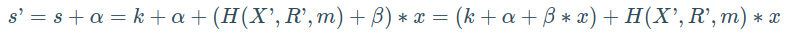

# 面试题集: 区块链概念-Bitcoin

[返回旧的已有问题](#旧的问题列表)

## 技能概览

### 共识机制

| 能力点 | 技能难度| 快速跳转 |
| :--- |:---: | :---: |
| 工作量证明（PoW）原理 | 2 | [直达题目](#工作量证明-pow-原理) |
| 挖矿难度调整机制 | 3 | [直达题目](#挖矿难度调整机制) |
| 区块链分叉与重组 | 4 | [直达题目](#区块链分叉与重组) |
| 51%攻击及防御策略 | 5 | [直达题目](#51-攻击及防御策略) |
| 共识机制优化与替代方案 | 7 | [直达题目](#共识机制优化与替代方案) |

### 网络与节点

| 能力点 | 技能难度| 快速跳转 |
| :--- |:---: | :---: |
| P2P网络结构与节点类型 | 2 | [直达题目](#p2p网络结构与节点类型) |
| 节点同步与区块传播机制 | 3 | [直达题目](#节点同步与区块传播机制) |
| 网络延迟与分布式共识影响 | 5 | [直达题目](#网络延迟与分布式共识影响) |
| 节点安全与防护措施 | 6 | [直达题目](#节点安全与防护措施) |
| 网络拓扑优化与抗攻击设计 | 8 | [直达题目](#网络拓扑优化与抗攻击设计) |

### 交易机制

| 能力点 | 技能难度| 快速跳转 |
| :--- |:---: | :---: |
| 交易结构与格式 | 2 | [直达题目](#交易结构与格式) |
| 交易签名与验证 | 3 | [直达题目](#交易签名与验证) |
| 交易费用与优先级机制 | 4 | [直达题目](#交易费用与优先级机制) |
| 交易池管理与交易打包策略 | 5 | [直达题目](#交易池管理与交易打包策略) |
| 复杂交易脚本与多重签名 | 6 | [直达题目](#复杂交易脚本与多重签名) |
| 闪电网络与链下交易扩展 | 8 | [直达题目](#闪电网络与链下交易扩展) |

### 数据结构与存储

| 能力点 | 技能难度| 快速跳转 |
| :--- |:---: | :---: |
| 区块结构与Merkle树 | 2 | [直达题目](#区块结构与merkle树) |
| UTXO模型与状态管理 | 3 | [直达题目](#utxo模型与状态管理) |
| 区块链数据存储与索引 | 4 | [直达题目](#区块链数据存储与索引) |
| 轻节点与SPV验证机制 | 5 | [直达题目](#轻节点与spv验证机制) |
| 区块链数据压缩与优化 | 7 | [直达题目](#区块链数据压缩与优化) |

### 安全与隐私

| 能力点 | 技能难度| 快速跳转 |
| :--- |:---: | :---: |
| 密码学基础（哈希函数、椭圆曲线） | 2 | [直达题目](#密码学基础-哈希函数-椭圆曲线) |
| 私钥管理与钱包安全 | 3 | [直达题目](#私钥管理与钱包安全) |
| 双重支付攻击与防范 | 4 | [直达题目](#双重支付攻击与防范) |
| 隐私保护技术（CoinJoin等） | 6 | [直达题目](#隐私保护技术-coinjoin等) |
| 量子计算对Bitcoin安全的影响 | 8 | [直达题目](#量子计算对bitcoin安全的影响) |

### 开发与调试

| 能力点 | 技能难度| 快速跳转 |
| :--- |:---: | :---: |
| Bitcoin核心客户端使用与配置 | 3 | [直达题目](#bitcoin核心客户端使用与配置) |
| RPC接口调用与脚本编写 | 4 | [直达题目](#rpc接口调用与脚本编写) |
| Bitcoin节点搭建与维护 | 5 | [直达题目](#bitcoin节点搭建与维护) |
| 性能调优与故障排查 | 7 | [直达题目](#性能调优与故障排查) |
| 源码阅读与定制开发 | 9 | [直达题目](#源码阅读与定制开发) |

### 架构与扩展

| 能力点 | 技能难度| 快速跳转 |
| :--- |:---: | :---: |
| Bitcoin协议演进与软硬分叉 | 5 | [直达题目](#bitcoin协议演进与软硬分叉) |
| 侧链与跨链技术 | 7 | [直达题目](#侧链与跨链技术) |
| 扩容方案（SegWit、闪电网络） | 8 | [直达题目](#扩容方案-segwit-闪电网络) |
| 系统级架构设计与治理 | 9 | [直达题目](#系统级架构设计与治理) |
| 企业级Bitcoin解决方案设计 | 10 | [直达题目](#企业级bitcoin解决方案设计) |

---

## 详细题目列表

### 共识机制

<a id='工作量证明-pow-原理'></a>

#### 工作量证明（PoW）原理

**技能难度评分:** 2/10

**问题 1:**

> 以下关于比特币中工作量证明（PoW）机制的描述，哪一项是正确的？
>
> A. PoW主要通过验证节点的身份来确保区块链的安全性。
> B. PoW要求矿工通过大量计算寻找满足特定条件的哈希值，以获得记账权。
> C. PoW机制依赖于持有大量代币的节点来决定新区块的产生。
> D. PoW通过加密签名保证交易的隐私性和不可篡改性。

<details>
  <summary>点击查看答案</summary>
  <p><strong>正确答案: B. PoW要求矿工通过大量计算寻找满足特定条件的哈希值，以获得记账权。工作量证明的核心是矿工通过不断尝试计算区块哈希，使其满足网络设定的难度目标，从而竞争记账权，保证区块链的安全和去中心化。</strong></p>
</details>

**问题 2:**

> 假设你在设计一个基于Bitcoin区块链的支付系统。请简要说明工作量证明（PoW）机制是如何保证区块链网络安全和交易不可篡改的？并结合该场景，分析如果矿工计算能力大幅提升，可能会带来哪些影响？

<details>
  <summary>点击查看答案</summary>
  <p><strong>正确答案: 工作量证明（PoW）机制通过要求矿工解决一个计算难题（即找到一个满足特定哈希条件的随机数nonce），来验证新区块的合法性。这个过程需要大量计算资源和时间，因此攻击者想要篡改区块链中的交易必须重新计算被篡改区块及其后续所有区块的PoW，成本极高，从而保证了区块链的安全性和交易的不可篡改性。

在基于Bitcoin的支付系统中，PoW确保了交易的确认和网络共识，防止双重支付和欺诈行为。

如果矿工的计算能力大幅提升，可能带来以下影响：

1. 新区块产生速度加快，导致系统调整难度的机制被触发，网络难度会增加以保持平均每10分钟产生一个区块的目标。
2. 矿工集中化风险增加，算力过于集中可能导致51%攻击的风险提升。
3. 能源消耗增加，带来环境和成本问题。
因此，设计支付系统时需要考虑算力变化对网络安全和性能的影响。</strong></p>

</details>

---

<a id='挖矿难度调整机制'></a>

#### 挖矿难度调整机制

**技能难度评分:** 3/10

**问题 1:**

> 在比特币网络中，挖矿难度调整机制的主要目的是？
>
> A. 保证每个区块的平均产生时间约为10分钟，适应网络算力的变化。
> B. 调整区块奖励的数量，以控制通货膨胀。
> C. 通过增加交易手续费来激励矿工。
> D. 限制每个矿工每日的挖矿次数，防止集中化。

<details>
  <summary>点击查看答案</summary>
  <p><strong>正确答案: A. 保证每个区块的平均产生时间约为10分钟，适应网络算力的变化。——比特币的难度调整机制通过每2016个区块（大约两周）调整一次挖矿难度，使得平均出块时间保持在10分钟左右，从而保证网络稳定运行。选项B、C、D分别与区块奖励、交易手续费和矿工行为控制相关，但不是难度调整的目的。</strong></p>
</details>

**问题 2:**

> 假设你在一个比特币矿池工作，发现最近矿工的计算能力突然提升，导致新区块的产生速度明显加快。请简述比特币的挖矿难度调整机制是如何应对这种情况的？并分析该机制对网络安全和区块链稳定性的影响。

<details>
  <summary>点击查看答案</summary>
  <p><strong>正确答案: 比特币的挖矿难度调整机制会每2016个区块（约两周）自动调整一次难度，目标是保持平均每10分钟产生一个区块。如果矿工计算能力提升，区块产生速度加快，系统会在下一个难度调整时增加挖矿难度，使得找到有效哈希值变得更难，从而减缓区块产生速度回到10分钟左右。该机制保证了区块链的稳定出块速度，有助于维护网络的安全性和共识稳定，防止因算力波动导致的区块链分叉或不稳定。</strong></p>
</details>

---

<a id='区块链分叉与重组'></a>

#### 区块链分叉与重组

**技能难度评分:** 4/10

**问题 1:**

> 在比特币区块链中，当发生链重组（chain reorganization）时，下列哪一项描述是正确的？
>
> A. 链重组是指矿工同时挖出两个新区块，导致网络出现永久分叉，两个链都会长期存在。
>
> B. 链重组发生时，节点会选择最长的有效链作为主链，并丢弃短链上的区块，可能导致交易回滚。
>
> C. 链重组意味着所有节点都会立即同步到同一个新区块，确保全网无分叉状态。
>
> D. 链重组时，节点会将所有分叉的区块都保留在本地，防止任何交易被丢弃。

<details>
  <summary>点击查看答案</summary>
  <p><strong>正确答案: B. 链重组发生时，节点会选择最长的有效链作为主链，并丢弃短链上的区块，可能导致交易回滚。这是比特币共识机制中的关键过程，确保最终一致性。短链上的区块及其交易将被废弃，可能导致已经确认的交易被回滚。</strong></p>
</details>

**问题 2:**

> 假设在一个比特币节点的正常运行过程中，网络中突然出现了两个长度相同但包含不同交易的新区块，导致节点链上出现分叉。请解释在这种情况下节点是如何选择主链的？此外，如果节点之前已经接收并确认了较短链上的交易，当链重组（reorganization）发生时，这些交易的状态会发生什么变化？请结合实际场景说明你会如何处理可能出现的交易冲突。

<details>
  <summary>点击查看答案</summary>
  <p><strong>正确答案: 在比特币网络中，当节点遇到两个长度相同但包含不同交易的区块时，节点会暂时将这两个区块视为分叉链的两个分支。节点会继续接收新的区块并验证链的长度。当其中一个分支的链变得更长时，节点会选择长度最长的链作为主链，这也是比特币的“最长链规则”。

链重组（reorganization）发生时，如果之前已确认的交易位于被替换的较短链上，这些交易将变为未确认状态。节点需要将这些交易重新放入内存池（mempool），等待重新被包含进新的主链。

在实际场景中，可能出现交易冲突，例如两个分叉链上包含了同一笔资金的不同花费。在链重组后，只有被采纳主链上的交易会被视为有效，另一部分交易将被撤销。为了处理这种情况，节点或应用应监听链重组事件，及时更新交易状态，并通知用户交易状态的变化。此外，应用层可以通过增加交易确认数来提升交易的安全性，减少因链重组而引起的风险。</strong></p>
</details>

---

<a id='51-攻击及防御策略'></a>

#### 51%攻击及防御策略

**技能难度评分:** 5/10

**问题 1:**

> 在比特币网络中，51%攻击指的是攻击者控制了超过半数的算力，从而能够对区块链进行某些恶意操作。以下哪项是有效的防御策略，用以减轻或防范51%攻击的风险？
>
> A. 增加区块链的区块大小以加快交易处理速度，从而减少攻击者的攻击窗口。
>
> B. 引入多重签名机制，要求交易必须经过多个独立节点的签名才能被确认。
>
> C. 提高网络的算力分散度，避免算力集中在少数矿工或矿池手中。
>
> D. 缩短区块间隔时间，使区块链更新更频繁，增加攻击者的同步难度。

<details>
  <summary>点击查看答案</summary>
  <p><strong>正确答案: C. 提高网络的算力分散度，避免算力集中在少数矿工或矿池手中。 解析：51%攻击的核心风险来自于单一实体或矿池控制超过半数算力。提高算力分散度，可以避免算力被少数实体垄断，从而降低攻击的可能性。选项A虽然能提升交易处理速度，但无法直接防止算力集中；选项B的多重签名机制主要用于提高交易安全性，与防范算力控制无直接关系；选项D缩短区块时间可能导致更多孤块产生，反而可能增加网络的分叉风险，不利于防御51%攻击。</strong></p>
</details>

**问题 2:**

> 假设你是一个比特币矿池的技术负责人，近期网络上出现了关于51%攻击的讨论。请你简要说明什么是51%攻击，并结合你作为矿池负责人在实际运营中可能采取的防御策略，分析如何降低矿池遭受51%攻击的风险。

<details>
  <summary>点击查看答案</summary>
  <p><strong>正确答案: 51%攻击指的是当某个实体或组织控制了超过50%的网络算力时，能够对区块链网络进行恶意操作，如双重支付、阻止新交易确认等，从而破坏网络的安全性和去中心化特性。作为矿池负责人，防御策略包括：

1. 分散算力：避免矿池算力过于集中，鼓励矿工分布在多个矿池，降低单一矿池的算力比例。
2. 监控网络：实时监控网络算力分布和异常行为，及时发现潜在的攻击风险。
3. 联合防御：与其他矿池建立合作机制，共同抵御大规模攻击。
4. 采用链外方案：利用链下协议或其他安全机制，增强交易的不可逆性。
5. 激励机制调整：设计合理的奖励机制，避免算力被恶意集中。

通过上述措施，可以有效降低矿池及整个比特币网络遭受51%攻击的风险，维护网络的安全和稳定。</strong></p>
</details>

---

<a id='共识机制优化与替代方案'></a>

#### 共识机制优化与替代方案

**技能难度评分:** 7/10

**问题 1:**

> 在比特币的共识机制中，针对工作量证明（Proof of Work, PoW）存在的高能耗和扩展性问题，以下哪种共识机制作为替代方案，主要通过减少能源消耗和提高交易处理速度来优化传统的PoW机制？
>
> A. 权益证明（Proof of Stake, PoS）
> B. 拜占庭容错算法（Byzantine Fault Tolerance, BFT）
> C. 工作量证明变体（Proof of Capacity, PoC）
> D. 零知识证明（Zero-Knowledge Proof, ZKP）

<details>
  <summary>点击查看答案</summary>
  <p><strong>正确答案: A. 权益证明（Proof of Stake, PoS） - PoS通过让节点基于持有的代币数量和时间来参与区块生产，显著降低了能耗并提升了效率，是PoW的常见替代方案。B选项BFT主要用于小规模许可链，C选项PoC虽然减少了能源消耗但并未广泛用于比特币替代，D选项ZKP是一种隐私技术而非共识机制。</strong></p>
</details>

**问题 2:**

> 假设你在一家金融科技公司工作，公司计划基于Bitcoin的区块链技术开发一个高频交易结算系统。由于Bitcoin的PoW共识机制存在交易确认延迟和能耗高的问题，导致系统吞吐量和响应时间无法满足业务需求。请结合Bitcoin的共识机制特点，分析PoW在此场景下的局限性，并提出两种替代的共识机制或优化方案，说明它们如何在提高性能和安全性之间取得平衡。

<details>
  <summary>点击查看答案</summary>
  <p><strong>正确答案: PoW（Proof of Work）机制通过计算大量哈希运算来保障区块链的安全性和去中心化，但其存在以下局限性，尤其在高频交易结算系统中表现突出：

1. 交易确认延迟：PoW矿工需要时间进行计算，Bitcoin区块平均出块时间约为10分钟，这导致交易确认时间较长，不适合对延迟敏感的高频交易。

2. 能耗高：大量算力消耗导致能源浪费，增加运营成本，不利于绿色金融理念。

3. 吞吐量低：Bitcoin的设计限制了每秒交易量，无法满足高频交易的大量交易需求。

两种替代方案或优化方案：

1. 权益证明（PoS, Proof of Stake）：

- 通过质押代币选出区块生产者，减少算力浪费。
- 出块速度快，延迟低，适合高频交易场景。
- 需要设计合理的激励和惩罚机制以防止攻击，保证安全性。

2. 委托权益证明（DPoS, Delegated Proof of Stake）：

- 选举少数代表节点负责出块，极大提高出块速度和吞吐量。
- 适合对性能要求高的场景，但去中心化程度稍弱。

此外，技术优化如闪电网络（Lightning Network）也可以作为Layer 2解决方案，进行链下快速结算，减轻主链负担。

综上，PoS和DPoS通过减少计算资源浪费和缩短确认时间，提高性能；同时，通过经济激励和选举机制维护安全性和一定程度的去中心化，较好地平衡了性能与安全。</strong></p>
</details>

---

### 网络与节点

<a id='p2p网络结构与节点类型'></a>

#### P2P网络结构与节点类型

**技能难度评分:** 2/10

**问题 1:**

> 在比特币的P2P网络中，以下哪种节点类型主要负责接收和广播交易及区块，但不保存完整的区块链数据？
>
> A. 全节点（Full Node）
> B. 轻节点（Light Node）
> C. 挖矿节点（Mining Node）
> D. 中继节点（Relay Node）

<details>
  <summary>点击查看答案</summary>
  <p><strong>正确答案: B. 轻节点（Light Node）

解释：轻节点只下载区块头而不保存完整区块链数据，主要用于验证交易的简化支付验证（SPV），它们负责接收和广播交易及区块，但不保存完整链数据。全节点保存完整链数据，挖矿节点除了保存数据还进行区块挖矿，中继节点不是标准的比特币节点分类，可能造成混淆。</strong></p>
</details>

**问题 2:**

> 在比特币的P2P网络中，节点扮演着不同的角色。假设你是一名网络工程师，负责优化节点连接以提升网络的传播效率。请简要说明比特币P2P网络中的主要节点类型，并分析它们在信息传播中的作用和区别。

<details>
  <summary>点击查看答案</summary>
  <p><strong>正确答案: 比特币P2P网络中的主要节点类型包括全节点（Full Node）和轻节点（Light Node）。

- 全节点：全节点保存完整的区块链数据，验证交易和区块的合法性，通常也向其他节点转发信息。它们是网络的核心，保证网络的安全和去中心化。

- 轻节点：轻节点不保存完整的区块链，只下载区块头和与自己相关的交易信息，依赖全节点提供区块数据。它们节省资源，但对网络的安全贡献较小。

在信息传播中，全节点负责接收、验证并广播交易和区块，确保网络中的数据一致性和安全性；轻节点主要依赖全节点获取数据，减少自身负担。优化网络连接时，应优先保证全节点之间的高效连接，以提升整个网络的传播速度和稳定性。</strong></p>
</details>

---

<a id='节点同步与区块传播机制'></a>

#### 节点同步与区块传播机制

**技能难度评分:** 3/10

**问题 1:**

> 在比特币网络中，节点如何高效地同步最新的区块信息？
>
> A. 节点仅通过全量下载所有历史区块数据来同步最新状态。
>
> B. 节点通过先下载区块头（headers），然后请求缺失的区块体，从而实现增量同步。
>
> C. 节点通过广播所有交易数据而非区块来同步最新状态。
>
> D. 节点只依靠单个邻居节点来同步区块，减少网络带宽消耗。

<details>
  <summary>点击查看答案</summary>
  <p><strong>正确答案: B. 节点通过先下载区块头（headers），然后请求缺失的区块体，从而实现增量同步。 解释：比特币节点通常先同步区块头以快速确认链的结构，然后根据需要请求缺失的区块体，这种方式高效且节省带宽。选项A描述的是初始完全同步，但不是高效的增量同步方式；选项C错误，交易数据是通过区块传播的；选项D不合理，比特币节点会从多个邻居节点请求数据以提高同步速度和可靠性。</strong></p>
</details>

**问题 2:**

> 假设你负责维护一个比特币全节点，发现节点长时间未能与网络同步，区块的更新延迟很大。请简要分析可能导致节点同步缓慢的原因，并说明比特币网络中节点是如何传播新区块和实现同步的。

<details>
  <summary>点击查看答案</summary>
  <p><strong>正确答案: 可能导致节点同步缓慢的原因包括：
1. 网络连接不稳定或带宽不足，导致节点与其他节点的通信延迟或丢包。
2. 节点连接的对等节点数量不足，影响区块信息的传播速度。
3. 节点硬件性能不足，处理新区块验证和链重组速度慢。
4. 节点软件版本过旧，可能存在兼容性问题。

比特币网络中，节点通过点对点（P2P）网络相互连接。当一个节点接收到新区块时，会先验证区块的有效性，验证通过后向其连接的对等节点广播该区块。其它节点收到广播后也进行验证并继续传播，形成快速的区块传播网络。节点通过区块链的最长链规则和工作量证明机制实现同步，持续下载和验证新区块，保证链的最新状态。</strong></p>
</details>

---

<a id='网络延迟与分布式共识影响'></a>

#### 网络延迟与分布式共识影响

**技能难度评分:** 5/10

**问题 1:**

> 在Bitcoin网络中，网络延迟对分布式共识机制的主要影响是什么？
>
> A. 网络延迟会导致节点无法同步区块链，增加链分叉的概率，从而影响最终共识的达成。
>
> B. 网络延迟会直接降低挖矿难度，使新区块更容易被发现。
>
> C. 网络延迟会使节点自动放弃接收新区块，导致网络瘫痪。
>
> D. 网络延迟不会影响分布式共识，因为所有节点都使用相同的时间戳同步。
>

<details>
  <summary>点击查看答案</summary>
  <p><strong>正确答案: A. 网络延迟会导致节点无法同步区块链，增加链分叉的概率，从而影响最终共识的达成。——这是正确答案，因为在Bitcoin网络中，网络延迟会导致不同节点对最新区块的接收时间不同步，可能出现多个有效区块同时被挖出，形成分叉，从而增加了达成共识的难度和时间。</strong></p>
</details>

**问题 2:**

> 假设你正在设计一个基于Bitcoin协议的分布式支付系统，该系统的节点分布在全球不同地区。请分析网络延迟对该系统中区块传播和分布式共识过程的影响，并提出两种可能的技术或机制来缓解网络延迟带来的负面影响。请结合实际场景说明你的思路。

<details>
  <summary>点击查看答案</summary>
  <p><strong>正确答案: 网络延迟会导致区块在节点间传播时间变长，从而增加分叉（链分歧）的概率，影响共识的达成速度和稳定性。具体表现为：

1. 区块传播延迟使得部分节点在收到新区块之前，可能已经挖出新的区块，导致不同节点的链状态不一致，增加孤块（orphan blocks）的数量。
2. 共识达成变慢，可能导致交易确认时间延长，影响用户体验。

缓解方法包括：

1. 使用高效的区块传播机制，如Compact Blocks或Graphene协议，减少传播的数据量和时间，提升传播效率。
2. 部署更多的中继节点（Relay Nodes）或使用网络拓扑优化，减少节点之间的跳数和延迟，加快区块传播速度。

通过这些技术，可以减少网络延迟带来的负面影响，提高系统的吞吐量和共识效率，保障分布式支付系统的稳定运行。</strong></p>
</details>

---

<a id='节点安全与防护措施'></a>

#### 节点安全与防护措施

**技能难度评分:** 6/10

**问题 1:**

> 在比特币网络中，为了保障节点的安全性，防止恶意攻击和数据篡改，以下哪项措施是最有效的？
>
> A. 只允许可信IP地址连接节点，以防止任何未知节点的访问。
>
> B. 启用节点的防火墙和端口过滤，限制入站和出站连接的端口范围。
>
> C. 使用Proof of Work机制减少节点的计算资源消耗。
>
> D. 定期更换节点的私钥以防止密钥泄露。
>
> 请从中选择最佳答案。

<details>
  <summary>点击查看答案</summary>
  <p><strong>正确答案: B. 启用节点的防火墙和端口过滤，限制入站和出站连接的端口范围。这是保护节点免受网络攻击和未经授权访问的有效手段，能够限制恶意流量和减少攻击面。选项A过于严格且不现实，选项C是共识机制相关，而非节点安全措施，选项D虽然有助于安全但频繁更换私钥在比特币节点中并不常见且影响较小。</strong></p>
</details>

**问题 2:**

> 假设你在一家比特币矿池运营公司工作，负责维护多个全节点服务器。近期发现部分节点频繁遭受DDoS攻击，导致同步延迟和节点不稳定。请简述你会采取哪些安全措施来保护这些比特币节点，确保节点的稳定性和数据完整性？请结合网络层和应用层的防护策略进行说明。

<details>
  <summary>点击查看答案</summary>
  <p><strong>正确答案: 为了保护比特币节点免受DDoS攻击及其他潜在威胁，确保节点的稳定性和数据完整性，可以采取以下措施：

1. 网络层防护措施：

- 使用防火墙限制访问节点的IP范围，仅允许可信IP连接。
- 部署DDoS防护服务或硬件，如流量清洗设备，过滤异常流量。
- 利用负载均衡器分散请求压力，防止单点过载。
- 启用网络隔离，将节点置于安全的子网或VPC内，减少暴露面。

2. 应用层防护措施：

- 配置节点软件的访问控制，限制RPC接口的访问权限。
- 定期更新节点软件和依赖，修补已知安全漏洞。
- 启用节点的日志监控和报警系统，及时发现异常行为。
- 实施数据备份和验证机制，确保区块链数据的完整性。

3. 其他措施：

- 使用VPN或加密通道保护节点间通信。
- 对节点服务器进行安全加固，如关闭不必要的服务和端口。

综合这些防护措施，可以有效提升比特币节点的安全性，保障其稳定运行。</strong></p>
</details>

---

<a id='网络拓扑优化与抗攻击设计'></a>

#### 网络拓扑优化与抗攻击设计

**技能难度评分:** 8/10

**问题 1:**

> 在比特币网络中，为了优化网络拓扑结构并增强抗攻击能力，以下哪种设计最有效？
>
> A. 节点完全连接所有其他节点，形成全连接网络，以确保信息快速传播。
>
> B. 采用分层网络结构，其中部分节点作为超级节点，负责汇总和转发信息。
>
> C. 每个节点随机连接有限数量的邻居节点，结合自适应连接策略以抵御DDoS攻击。
>
> D. 节点仅连接地理位置最近的几个节点，以减少网络延迟和带宽消耗。

<details>
  <summary>点击查看答案</summary>
  <p><strong>正确答案: C。理由：在比特币网络中，节点通常不会与所有节点全连接（排除A），以避免巨大的带宽和计算负担。分层网络结构（B）虽有利于信息汇总，但引入超级节点可能成为攻击目标，降低抗攻击性。仅连接地理位置最近节点（D）虽然减少延迟，但可能形成易受分区攻击的局部网络。相比之下，随机连接有限邻居并结合自适应连接策略，能够平衡网络负载，增加网络的鲁棒性和抗DDoS攻击能力，是比特币网络拓扑设计中常用且有效的策略。</strong></p>
</details>

**问题 2:**

> 在比特币网络中，节点的网络拓扑结构直接影响交易传播效率和抗攻击能力。假设你负责设计一个优化的网络拓扑方案，以提升交易传播速度同时增强对DDoS攻击和网络分区攻击的抵抗能力。
>
> 请结合比特币网络的特点，简述你会采取哪些具体措施来优化网络拓扑？如何设计节点连接策略以平衡传播效率与抗攻击性？请说明你的方案中如何防范常见的网络攻击类型，并举例说明其工作原理。

<details>
  <summary>点击查看答案</summary>
  <p><strong>正确答案: 在设计比特币网络的优化拓扑时，主要考虑以下几个方面：

1. 节点连接策略优化：
   - 多样化连接：节点应连接多个不同地理位置和自治系统（AS）的节点，避免集中连接某一类节点，减少单点失败风险。
   - 限制入站和出站连接比例：保持合理的入站和出站连接数量，防止恶意节点通过大量连接控制网络。
   - 引入随机性：节点连接时引入一定随机性，防止攻击者预测和控制网络拓扑。

2. 传播机制优化：
   - 优先传播给可靠和低延迟节点，提高交易和区块的传播速度。
   - 使用分层传播策略，例如核心节点和边缘节点分层，核心节点承担快速传播责任。

3. 抗攻击设计：
   - 针对DDoS攻击：
     - 限制每个节点的连接数，防止恶意节点大量连接造成资源耗尽。
     - 利用节点信誉系统，降低恶意节点传播权重。
   - 针对网络分区攻击（Partition Attack）：
     - 保持节点连接多样性，确保网络中不同部分有足够连接，防止被孤立。
     - 定期重连机制，自动寻找新的连接，恢复被切断的连接。

4. 监控与自适应调整：
   - 实时监控网络拓扑和连接质量，动态调整连接策略。

通过以上措施，可以在提升交易传播效率的同时，增强比特币网络对DDoS和网络分区攻击的抗性。例如，限制连接数和引入随机连接能防止攻击者通过大量连接发起DDoS攻击；多样化连接和定期重连机制能有效防止网络分区攻击，确保网络连通性和数据一致性。</strong></p>
</details>

---

### 交易机制

<a id='交易结构与格式'></a>

#### 交易结构与格式

**技能难度评分:** 2/10

**问题 1:**

> 在比特币的交易结构中，以下哪个字段用于引用之前的交易输出（UTXO）作为本次交易的输入？
>
> A. nSequence
> B. prevout
> C. scriptSig
> D. locktime

<details>
  <summary>点击查看答案</summary>
  <p><strong>正确答案: B. prevout。因为prevout字段指向之前交易的具体输出，作为当前交易的输入来源，引用了之前的UTXO。其他选项中，nSequence用于交易替代，scriptSig是输入的解锁脚本，locktime是交易的时间锁定。</strong></p>
</details>

**问题 2:**

> 在比特币网络中，假设你是一名开发者，负责设计一个工具来解析和展示用户的交易信息。请简述比特币交易的基本结构，包括输入（Inputs）和输出（Outputs）部分的主要字段，并说明这些字段在交易验证中的作用。

<details>
  <summary>点击查看答案</summary>
  <p><strong>正确答案: 比特币交易的基本结构主要包括交易输入（Inputs）和交易输出（Outputs）。

- 交易输入（Inputs）：
  - 引用的前一笔交易的交易ID（TxID）和输出索引（vout），用于指定花费的UTXO（未花费交易输出）。
  - 解锁脚本（ScriptSig），提供解锁前面UTXO所需的签名和公钥，用于证明所有权。
  - 序列号（Sequence），用于支持交易替代（Replace-by-Fee）和时间锁。

- 交易输出（Outputs）：
  - 价值（Value），表示该输出所包含的比特币数量。
  - 锁定脚本（ScriptPubKey），定义了花费该输出所需满足的条件，通常是一个地址的公钥哈希。

这些字段在交易验证中的作用：

- 输入中的引用确保交易花费的是存在且未被花费的UTXO。
- 解锁脚本验证交易发起者对引用UTXO的所有权。
- 输出定义了接收者和金额，确保比特币的正确转移。
- 序列号支持高级功能如交易替代。

理解交易结构有助于开发者正确解析交易数据，验证交易合法性，并构建安全可靠的比特币应用。</strong></p>
</details>

---

<a id='交易签名与验证'></a>

#### 交易签名与验证

**技能难度评分:** 3/10

**问题 1:**

> 在比特币交易的签名与验证过程中，哪一项描述最准确地说明了交易签名的作用？
>
> A. 交易签名用于加密交易数据，确保交易内容不被篡改。
> B. 交易签名证明交易发起者拥有对应的私钥，从而授权转移资金。
> C. 交易签名是为了隐藏发送方的身份，保护用户隐私。
> D. 交易签名主要用于加快交易验证速度，减少网络延迟。

<details>
  <summary>点击查看答案</summary>
  <p><strong>正确答案: B. 交易签名证明交易发起者拥有对应的私钥，从而授权转移资金。交易签名的核心作用是用私钥对交易数据进行签名，验证方通过对应的公钥确认交易发起者的身份和授权，确保只有拥有私钥的人能发起资金转移，防止伪造和欺诈。</strong></p>
</details>

**问题 2:**

> 假设你正在开发一个比特币钱包应用，用户发起一笔转账交易。请简要说明交易签名的作用，以及在交易验证过程中，节点是如何利用交易签名来确保交易的合法性？请结合具体步骤说明。

<details>
  <summary>点击查看答案</summary>
  <p><strong>正确答案: 交易签名的作用是证明交易发起者拥有对应的私钥，从而授权转移其比特币资产，防止他人伪造交易。具体步骤如下：

1. **交易构造**：用户创建交易数据，包括输入（引用之前的未花费输出）和输出（接收地址及金额）。

2. **生成签名**：用户使用自己的私钥对交易的特定部分（通常是交易的摘要）进行数字签名，生成交易签名。

3. **广播交易**：带有签名的交易被广播到比特币网络。

4. **交易验证**：节点接收到交易后，使用交易中提供的公钥（或从公钥哈希推断）来验证签名，确认签名与交易内容相匹配，且公钥对应的地址拥有被花费的输出。

5. **防止篡改**：如果交易内容被篡改，签名验证将失败，节点会拒绝该交易。

通过以上过程，交易签名确保了只有拥有私钥的人才能发起有效交易，保障了比特币网络的安全性。</strong></p>
</details>

---

<a id='交易费用与优先级机制'></a>

#### 交易费用与优先级机制

**技能难度评分:** 4/10

**问题 1:**

> 在比特币网络中，交易费用如何影响交易被矿工优先打包的概率？
>
> A. 交易费用越高，交易被优先包含在区块中的概率越大，因为矿工倾向于选择能带来更高收益的交易。
>
> B. 交易费用越高，交易被延迟确认的时间越长，因为高费用交易需要更多的网络验证。
>
> C. 交易费用的高低不会影响交易的优先级，矿工随机选择交易进行打包。
>
> D. 交易费用越低，交易被优先包含在区块中的概率越大，因为矿工更喜欢处理小额费用的交易以维护网络公平性。

<details>
  <summary>点击查看答案</summary>
  <p><strong>正确答案: A. 交易费用越高，交易被优先包含在区块中的概率越大，因为矿工倾向于选择能带来更高收益的交易。 解释：在比特币网络中，矿工通过选择交易费用较高的交易优先打包，以最大化其收益。因此支付更高的交易费用通常可以加快交易确认速度。选项B错误，因为高费用交易不会导致更长的网络验证时间；选项C错误，矿工选择交易并非随机；选项D错误，矿工并不优先处理低费用交易。</strong></p>
</details>

**问题 2:**

> 假设你是一名比特币钱包开发工程师，用户向你反馈说他们的交易很长时间都未被确认。请结合比特币的交易费用与优先级机制，分析可能的原因，并说明你会如何优化钱包的费用估算策略以提高交易的确认速度？

<details>
  <summary>点击查看答案</summary>
  <p><strong>正确答案: 在比特币网络中，矿工优先打包交易时主要考虑交易费用（fee rate），即每字节（或每虚拟字节）的费用。交易费用较低的交易通常优先级低，确认时间长，尤其在网络拥堵时。用户交易未被确认可能原因包括：

1. 交易费用设置过低，无法激励矿工优先打包。
2. 网络拥堵，费用市场竞争激烈，导致低费用交易排队时间长。

作为钱包开发者，为优化费用估算策略，可以采取以下措施：

- 实时监测当前网络的费用市场，通过分析最近区块中交易的费用率，动态调整建议费用。
- 提供多个费用优先级选项（如高、中、低），让用户根据需求选择确认速度。
- 使用比特币的费用估算API（如Bitcoin Core的estimatesmartfee），结合自身策略进行合理调整。
- 在网络拥堵时，提醒用户增加费用或等待网络缓解。

通过这些优化，可以有效提升交易被矿工优先确认的概率，减少用户等待时间。</strong></p>
</details>

---

<a id='交易池管理与交易打包策略'></a>

#### 交易池管理与交易打包策略

**技能难度评分:** 5/10

**问题 1:**

> 在Bitcoin的交易池（mempool）管理中，矿工在选择交易进行打包时，通常采用哪种策略以最大化矿工收益？
>
> A. 优先选择交易大小最大的交易，以占满区块空间，提高区块利用率。
>
> B. 优先选择交易手续费率（每字节手续费）最高的交易，以最大化区块中手续费总收益。
>
> C. 优先选择先进入交易池的交易，保证交易的公平性。
>
> D. 随机选择交易，以避免对特定交易的偏好，确保网络公平性。

<details>
  <summary>点击查看答案</summary>
  <p><strong>正确答案: B. 优先选择交易手续费率（每字节手续费）最高的交易，以最大化区块中手续费总收益。 解析：矿工通常会根据交易的手续费率（即每字节手续费）来排序交易，优先打包手续费率高的交易，以最大化区块的手续费收益。选项A错误，因为仅考虑交易大小可能导致低收益；选项C错误，先入先出并不保证矿工收益最大化；选项D错误，随机选择交易不符合矿工利益最大化的策略。</strong></p>
</details>

**问题 2:**

> 假设你是一个比特币矿工节点的开发工程师，当前交易池中有大量未确认交易，其中部分交易的手续费较高，部分交易的手续费较低。请你说明在设计交易打包策略时，如何平衡手续费优先和交易公平性？同时，简述如何管理交易池以避免因交易过多导致的性能瓶颈？

<details>
  <summary>点击查看答案</summary>
  <p><strong>正确答案: 在设计交易打包策略时，矿工通常优先选择手续费较高的交易，以最大化矿工收益，这体现了手续费优先原则。但如果仅依赖手续费优先，可能导致手续费较低的交易长期无法确认，影响用户体验和交易公平性。为平衡两者，可以采用如下策略：

1. 设定最低手续费门槛，确保交易池中只有合理的交易被接受。
2. 在打包时优先选择高手续费交易，同时预留一定比例的区块空间给低手续费但等待时间较长的交易，避免交易饿死。
3. 利用动态调整手续费门槛，根据网络拥堵程度动态调节接受的交易手续费水平。

在交易池管理方面，为避免性能瓶颈，可以采取：

1. 限制交易池最大容量，超过容量时优先剔除手续费最低的交易。
2. 使用高效的数据结构（如优先队列或哈希表）快速查找、插入和删除交易。
3. 定期清理过期或无效交易，保持交易池健康。
4. 对交易进行有效性快速验证，减少无效交易占用资源。

通过合理的打包策略和高效的交易池管理，可以提升矿工收益，同时保障网络交易的公平性和系统性能。</strong></p>
</details>

---

<a id='复杂交易脚本与多重签名'></a>

#### 复杂交易脚本与多重签名

**技能难度评分:** 6/10

**问题 1:**

> 在比特币的多重签名（Multisig）交易脚本中，哪一项描述最准确地反映了P2SH（Pay-to-Script-Hash）多重签名地址的工作原理？
>
> A. P2SH多重签名地址直接存储所有公钥和签名，交易验证时无需提供脚本。
>
> B. P2SH多重签名地址仅存储脚本的哈希，实际的解锁脚本在花费时提供，以验证满足签名条件。
>
> C. P2SH多重签名地址强制要求所有公钥持有者必须同时签名，且脚本大小固定。
>
> D. P2SH多重签名允许通过单个私钥签名即可完成交易，无需满足n-of-m条件。

<details>
  <summary>点击查看答案</summary>
  <p><strong>正确答案: B. P2SH多重签名地址仅存储脚本的哈希，实际的解锁脚本在花费时提供，以验证满足签名条件。 解析：P2SH地址只存储脚本的哈希值，实际的复杂脚本和签名在花费时由解锁脚本提供，这样简化了地址的表示和提高了隐私性，同时允许复杂的多重签名逻辑。A选项错误，因为P2SH地址不直接存储公钥和签名；C选项错误，因为多重签名不强制所有公钥都必须签名，n-of-m是灵活的；D选项错误，P2SH多重签名必须满足预设的签名数量条件。</strong></p>
</details>

**问题 2:**

> 假设你在一个比特币支付系统中，需要设计一个钱包，要求实现一个多重签名机制：至少3个签名者中的2个必须签名才能转出资金。
>
> 请简述：
>
> 1. 这种多重签名的交易脚本（Script）大致是如何构造的？
> 2. 在实际交易中，如何验证满足多重签名的条件？
> 3. 讨论使用多重签名对提升安全性和灵活性的具体优势，以及可能带来的性能或复杂性问题。

<details>
  <summary>点击查看答案</summary>
  <p><strong>正确答案: 1. 多重签名交易脚本通常使用P2SH（Pay to Script Hash）或者P2WSH（Pay to Witness Script Hash）形式，将复杂的验证逻辑封装在一个脚本哈希中。对于“至少3个签名者中的2个必须签名”的场景，脚本大致格式是：

```
OP_2 <PubKey1> <PubKey2> <PubKey3> OP_3 OP_CHECKMULTISIG
```

其中，OP_2 表示至少需要2个签名，<PubKey1>等是参与签名者的公钥，OP_3 表示共有3个公钥，OP_CHECKMULTISIG 负责验证多重签名。

2. 在实际交易验证时，交易输入会携带至少2个有效的签名，这些签名对应上述公钥中的任意两个。比特币网络节点通过执行脚本，检查这些签名是否有效且满足至少2个签名的条件，只有满足后交易才被接受。

3. 多重签名提升安全性：需要多个私钥共同签名，降低单点私钥泄露风险；提升灵活性：可以实现多方控制、联合账户等复杂场景。缺点包括：

- 交易数据较大，因包含多个签名，导致交易费用增加。
- 脚本复杂度增加，可能带来验证时间延长。
- 需要协调多个签名者，增加操作复杂性。

综上，多重签名适合对安全性和权限控制有较高要求的场景，但需权衡复杂性和成本。</strong></p>
</details>

---

<a id='闪电网络与链下交易扩展'></a>

#### 闪电网络与链下交易扩展

**技能难度评分:** 8/10

**问题 1:**

> 在比特币的闪电网络中，哪种机制最关键地确保了链下交易的安全性和最终性？
>
> A. 双向支付通道通过多重签名和时间锁合约保证资金安全
> B. 所有链下交易必须立即广播到主链以确保可验证性
> C. 使用侧链技术将所有交易状态存储在外部区块链上
> D. 通过中心化的清算机构对链下交易进行审计和确认

<details>
  <summary>点击查看答案</summary>
  <p><strong>正确答案: A. 双向支付通道通过多重签名和时间锁合约保证资金安全。闪电网络利用双向支付通道，结合多重签名和时间锁合约（HTLCs），确保链下交易双方在不信任的情况下资金安全和交易的最终性，这是闪电网络扩展机制的核心。选项B错误，因为链下交易并不需要立即广播到主链，目的是减少主链负载；选项C混淆了侧链和闪电网络的概念，侧链不是闪电网络的核心机制；选项D错误，闪电网络是去中心化的，不依赖中心化清算机构。</strong></p>
</details>

**问题 2:**

> 假设你在一家电商平台工作，该平台希望通过集成比特币闪电网络来实现高频小额支付，以提升用户体验和降低交易费用。请简述闪电网络实现链下交易扩展的基本原理，并分析在该场景下，闪电网络如何解决链上交易的瓶颈问题。同时，请指出闪电网络在实际应用中可能面临的两个主要技术挑战，并提出相应的解决思路。

<details>
  <summary>点击查看答案</summary>
  <p><strong>正确答案: 闪电网络通过建立多跳支付通道，允许用户在链下进行高频、低成本的交易，从而实现链下交易扩展。其基本原理是：用户先在链上开设双向支付通道，锁定一定数量的比特币作为保证金；之后，双方可以在通道内进行无限次的交易，只有在关闭通道时才将最终结算结果写回主链，显著减少链上交易数量，缓解链上拥堵和高昂手续费问题。

在电商平台场景中，闪电网络能够实现快速确认和低手续费的支付体验，满足小额高频交易需求，提高用户支付效率和平台的交易吞吐量。

两个主要技术挑战及解决思路：

1. **通道路由问题**：如何找到一条可用的支付路径以完成多跳支付是核心难题。解决思路包括优化路由算法，采用网络拓扑分析和路径缓存，同时引入隐私保护机制防止路径信息泄露。
2. **通道资金流动性管理**：支付通道需要双方预先锁定资金，流动性不足会导致支付失败。解决思路包括引入自动化流动性管理工具、增设中继节点、以及设计激励机制鼓励资金在网络中流动。</strong></p>

</details>

---

### 数据结构与存储

<a id='区块结构与merkle树'></a>

#### 区块结构与Merkle树

**技能难度评分:** 2/10

**问题 1:**

> 在Bitcoin区块结构中，Merkle树的主要作用是什么？
>
> A. 用于存储所有交易的完整数据以减少区块大小
> B. 用于快速验证某笔交易是否包含在区块中而无需下载所有交易数据
> C. 用于加密区块头以保证区块不可篡改
> D. 用于生成新区块的随机数以确保网络安全

<details>
  <summary>点击查看答案</summary>
  <p><strong>正确答案: B. 用于快速验证某笔交易是否包含在区块中而无需下载所有交易数据。解释：Merkle树通过将交易哈希两两组合并递归哈希，生成一个根哈希（Merkle根），使得用户可以仅通过这根哈希和相应的Merkle路径，验证某笔交易是否包含在区块中，无需下载全部交易数据。选项A错误，因为Merkle树不存储完整交易数据；选项C错误，区块头的加密与Merkle树无关；选项D错误，随机数（Nonce）生成与Merkle树功能不同。</strong></p>
</details>

**问题 2:**

> 在比特币区块链中，一个区块包含了多个交易。请结合区块结构和Merkle树的作用，解释为什么比特币使用Merkle树来组织交易数据？并简述Merkle树在验证交易完整性时的优势。假设你正在设计一个轻量级比特币钱包，如何利用Merkle树来高效验证某笔交易是否包含在某个区块中？

<details>
  <summary>点击查看答案</summary>
  <p><strong>正确答案: 比特币区块结构中包含了区块头和交易列表。由于交易数量庞大，直接存储和验证所有交易信息效率低下。Merkle树是一种二叉哈希树结构，通过将交易哈希两两组合计算上层哈希，最终得到一个Merkle根，存储在区块头中。

使用Merkle树的主要原因是提高数据验证的效率和安全性：

1. 只需通过Merkle根就能验证区块内所有交易的完整性，避免逐一验证所有交易。
2. 通过Merkle路径（从目标交易到Merkle根的哈希路径），轻量级客户端可以快速验证某笔交易是否包含在区块中，而无需下载整块交易数据。

在设计轻量级比特币钱包时，可以利用Merkle树的这种特性，钱包只需下载区块头和相关交易的Merkle路径，通过计算和对比Merkle根，验证交易的存在性和完整性，从而节省存储和带宽资源。</strong></p>
</details>

---

<a id='utxo模型与状态管理'></a>

#### UTXO模型与状态管理

**技能难度评分:** 3/10

**问题 1:**

> 在比特币的UTXO模型中，以下哪项描述最准确地反映了UTXO的作用？
>
> A. UTXO代表已花费的交易输出，用于记录交易历史。
> B. UTXO是未花费的交易输出，代表用户可以使用的比特币余额。
> C. UTXO是交易输入的集合，用于验证交易的合法性。
> D. UTXO是一个账户余额的快照，类似于传统银行的账户余额。

<details>
  <summary>点击查看答案</summary>
  <p><strong>正确答案: B. UTXO是未花费的交易输出，代表用户可以使用的比特币余额。 解释：UTXO（Unspent Transaction Output）指的是尚未被任何后续交易花费的交易输出，它代表了用户实际可用的比特币余额。选项A错误，因为UTXO是未花费的输出；选项C错误，交易输入引用的是UTXO，但UTXO本身不是输入集合；选项D错误，比特币采用UTXO模型而非账户余额模型。</strong></p>
</details>

**问题 2:**

> 在一个比特币钱包应用中，用户需要查询自己的余额并发起支付交易。请简要说明UTXO模型是如何帮助钱包管理用户余额的？并分析在状态管理中，为什么UTXO模型相比账户模型更适合比特币这样去中心化的支付系统？

<details>
  <summary>点击查看答案</summary>
  <p><strong>正确答案: UTXO模型将每笔交易的未花费输出（UTXO）作为余额的基本单位。钱包通过跟踪所有属于用户的UTXO累加计算余额，只有这些未被消费的输出才能用于发起新的交易。这样，钱包不需要维护一个全局账户余额状态，而是管理一组分散的UTXO集合。

相比账户模型，UTXO模型的状态管理更为分散和明确，每笔交易明确指定消费哪些UTXO，避免了共享状态的竞争与双重支付问题，提升了系统的并行处理能力和安全性。这种模型更适合去中心化环境，因为它天然支持无信任的交易验证和并行更新，降低了全局状态同步的复杂性。</strong></p>
</details>

---

<a id='区块链数据存储与索引'></a>

#### 区块链数据存储与索引

**技能难度评分:** 4/10

**问题 1:**

> 在比特币区块链中，区块和交易数据的存储采用了哪种主要的数据结构来支持高效的验证和索引？
>
> A. 链表（Linked List）
> B. 哈希树（Merkle Tree）
> C. B+树（B+ Tree）
> D. 哈希表（Hash Table）

<details>
  <summary>点击查看答案</summary>
  <p><strong>正确答案: B. 哈希树（Merkle Tree） - 比特币区块链使用Merkle树结构对交易数据进行组织，以便高效验证交易完整性和快速索引。链表虽然用于区块链中连接区块，但不适合交易数据的快速验证；B+树主要用于数据库索引，不是比特币的主要结构；哈希表虽有快速查找特点，但比特币交易验证依赖Merkle树。</strong></p>
</details>

**问题 2:**

> 假设你正在设计一个基于Bitcoin区块链的轻客户端钱包，需要快速验证某个交易是否包含在某个区块中。请简要说明Bitcoin区块链是如何存储交易数据的，以及轻客户端通常使用哪种数据结构来高效地索引和验证交易？为什么这种数据结构适合轻客户端的需求？

<details>
  <summary>点击查看答案</summary>
  <p><strong>正确答案: Bitcoin区块链中的交易数据存储在区块的默克尔树（Merkle Tree）结构中。每个区块包含一个默克尔根（Merkle Root），这是所有交易哈希通过哈希树递归组合后的根哈希。轻客户端（SPV客户端）不下载完整区块数据，而是只下载区块头和相关交易的默克尔路径（Merkle Path）。

轻客户端使用默克尔树来高效索引和验证交易的原因是：

1. **高效验证**：通过默克尔路径，轻客户端可以验证某笔交易是否包含在某个区块中，而无需下载整个区块的所有交易。
2. **节省存储和带宽**：只需存储和传输区块头和相关的默克尔路径，极大减少了数据量。
3. **安全性**：默克尔根由矿工计算并包含在区块头中，防篡改，保证了交易数据的完整性。

因此，默克尔树结构非常适合轻客户端快速且安全地验证交易，同时降低资源消耗。</strong></p>
</details>

---

<a id='轻节点与spv验证机制'></a>

#### 轻节点与SPV验证机制

**技能难度评分:** 5/10

**问题 1:**

> 在比特币网络中，轻节点（SPV节点）通过哪种机制来验证交易的有效性？
>
> A. 下载完整区块数据并验证每个交易的脚本执行结果
> B. 仅下载区块头并通过默克尔树证明验证交易是否包含在某个区块中
> C. 依赖中心化服务器提供交易验证结果
> D. 只验证交易的数字签名，不关心交易是否被包含在区块中

<details>
  <summary>点击查看答案</summary>
  <p><strong>正确答案: B. 仅下载区块头并通过默克尔树证明验证交易是否包含在某个区块中。因为轻节点不下载完整区块，只下载区块头，通过默克尔树路径验证特定交易是否被包含在区块内，从而实现轻量级的交易验证。</strong></p>
</details>

**问题 2:**

> 假设你正在设计一个轻节点钱包应用，用户希望在不下载完整区块链数据的情况下，验证某笔交易是否包含在比特币区块链中。请简述轻节点（SPV节点）是如何利用区块头和Merkle路径来实现交易验证的，并分析这种验证机制在安全性和资源消耗上的优势与潜在风险。

<details>
  <summary>点击查看答案</summary>
  <p><strong>正确答案: 轻节点（SPV节点）只下载并保存区块链中的区块头，而不保存完整的区块交易数据。区块头包含了前一个区块的哈希、Merkle树根哈希、时间戳等信息。为了验证某笔交易是否包含在某个区块中，轻节点会请求该交易对应的Merkle路径（从交易到区块头的Merkle根的哈希链）。通过计算交易哈希并结合Merkle路径，轻节点可以验证该交易是否确实存在于该区块内。  

优势：  

1. 资源消耗低：轻节点只需存储区块头，数据量远小于完整节点，适合资源有限的设备。  
2. 验证速度快：无需验证所有交易，仅需验证相关交易的Merkle路径和区块头的工作量证明。  

潜在风险：  

1. 信任依赖：轻节点依赖于全节点提供的交易数据和Merkle路径，可能面临数据欺骗（如伪造Merkle路径）。  
2. 无法检测区块内容的完整性：轻节点不能独立验证所有交易的有效性，只能验证交易存在性，因此安全性不及完整节点。  

总结：轻节点和SPV验证机制在减轻存储和计算负担方面表现出色，适合普通用户使用，但其安全性依赖于网络中的诚实节点和合理的网络环境。</strong></p>
</details>

---

<a id='区块链数据压缩与优化'></a>

#### 区块链数据压缩与优化

**技能难度评分:** 7/10

**问题 1:**

> 在比特币区块链中，为了优化存储效率和传输性能，常采用多种数据压缩与优化技术。以下哪一项是比特币区块链中实际应用的压缩或优化方法？
>
> A. 使用哈夫曼编码（Huffman Coding）对整个区块数据进行压缩，以减少存储空间。
>
> B. 采用交易输入的“序列化压缩”技术，通过只存储前一个输出的简短引用来减小交易数据大小。
>
> C. 使用默克尔树（Merkle Tree）结构，将交易哈希聚合以实现快速验证和部分数据下载，间接优化存储和传输。
>
> D. 利用量子纠缠技术在区块链节点间实现数据压缩和同步，提高网络效率。

<details>
  <summary>点击查看答案</summary>
  <p><strong>正确答案: C. 使用默克尔树（Merkle Tree）结构，将交易哈希聚合以实现快速验证和部分数据下载，间接优化存储和传输。  
解释：比特币区块链中通过默克尔树结构聚合交易哈希，允许节点只下载部分交易数据（如SPV轻节点），从而优化存储和传输效率。哈夫曼编码（A）虽然是压缩方法，但未实际应用于比特币区块数据。交易输入的“序列化压缩”（B）描述不准确，交易数据主要通过脚本和引用前输出实现，而非特殊压缩技术。量子纠缠技术（D）目前属于猜想和未来技术，未应用于比特币网络。</strong></p>
</details>

**问题 2:**

> 假设你负责设计一个轻量级的比特币全节点客户端，目标是在保证数据完整性和安全性的前提下，优化区块链数据的存储和传输效率。请结合比特币区块链的数据结构，简述你会采用哪些数据压缩与优化技术？并说明这些技术如何在具体的区块链场景中发挥作用，解决存储和网络带宽的瓶颈问题。

<details>
  <summary>点击查看答案</summary>
  <p><strong>正确答案: 在设计轻量级比特币全节点客户端时，可以采用以下数据压缩与优化技术：

1. **区块头压缩**：比特币区块头大小固定（80字节），可利用差异编码（delta encoding）存储连续区块间的非变字段，如时间戳和难度目标的变化，减少存储冗余。

2. **交易数据压缩**：
   - 使用**Merkle树结构**仅存储和验证交易的Merkle根，客户端只需下载自己关注的交易的Merkle路径，避免全量交易数据传输。
   - 采用**压缩的脚本表示**，例如利用脚本模板和参数替代完整脚本，减少交易输入输出脚本的大小。

3. **区块过滤（Bloom Filter）**：利用Bloom Filter技术，客户端可以向全节点请求只包含感兴趣地址或交易的区块片段，减少不必要的数据传输。

4. **数据编码优化**：如使用更高效的序列化格式（例如Bitcoin Core使用的CompactSize编码）来表示可变长度整数和数组，减少编码开销。

5. **存储结构优化**：
   - 利用数据库压缩功能（如LevelDB的压缩）对存储进行优化。
   - 设计增量同步机制，只同步新增或变更的数据块，避免重复下载。

这些技术在区块链场景中有效缓解了节点存储需求和网络带宽压力，使得轻节点能够高效地同步链上状态，同时保证数据的完整性和安全性。通过减少冗余数据传输和存储，极大提升了节点的性能和用户体验。</strong></p>
</details>

---

### 安全与隐私

<a id='密码学基础-哈希函数-椭圆曲线'></a>

#### 密码学基础（哈希函数、椭圆曲线）

**技能难度评分:** 2/10

**问题 1:**

> 在比特币的安全机制中，椭圆曲线数字签名算法（ECDSA）主要依赖于哪种数学难题保证其安全性？
>
> A. 大整数分解难题
> B. 离散对数难题（椭圆曲线上的离散对数问题）
> C. 哈希碰撞难题
> D. 公钥加密难题
>
> 请根据答案选择最合适的选项。

<details>
  <summary>点击查看答案</summary>
  <p><strong>正确答案: B. 离散对数难题（椭圆曲线上的离散对数问题）

解释：ECDSA的安全性基于椭圆曲线离散对数问题的计算难度，这是一种在椭圆曲线群中找到私钥的困难数学问题。大整数分解难题主要用于RSA，哈希碰撞难题是哈希函数安全性的考量，而公钥加密难题是一类泛指，不特指ECDSA的基础。</strong></p>
</details>

**问题 2:**

> 在比特币交易中，哈希函数和椭圆曲线密码学分别扮演什么角色？请结合具体的交易签名和验证场景，简要说明这两种密码学技术如何保障交易的安全性。

<details>
  <summary>点击查看答案</summary>
  <p><strong>正确答案: 哈希函数在比特币中主要用于生成交易的唯一标识（交易ID）和构建区块链的数据结构（如区块哈希），确保数据的完整性和不可篡改性。具体来说，交易数据经过哈希处理产生一个固定长度的摘要，任何微小修改都会导致哈希值改变，从而能够快速检测数据篡改。

椭圆曲线密码学（ECC）用于生成和验证数字签名，确保交易的真实性和授权性。发送者使用其私钥对交易数据的哈希值进行签名，生成数字签名。网络中的其他节点使用发送者的公钥通过椭圆曲线算法验证该签名，确认交易确实是由持有私钥的人发起，防止伪造和双重支付。

综上，哈希函数保障交易数据完整性，椭圆曲线密码学保障交易的身份验证和授权，两者共同确保比特币交易的安全性。</strong></p>
</details>

---

<a id='私钥管理与钱包安全'></a>

#### 私钥管理与钱包安全

**技能难度评分:** 3/10

**问题 1:**

> 在管理比特币私钥时，哪种做法最能有效防止私钥被他人窃取？
>
> A. 将私钥保存在电子邮件草稿中，以便随时访问
> B. 使用硬件钱包存储私钥，并保持设备离线
> C. 将私钥写在纸上并拍照保存，方便云端备份
> D. 在多个社交媒体账户中分享私钥以防丢失

<details>
  <summary>点击查看答案</summary>
  <p><strong>正确答案: B。使用硬件钱包存储私钥并保持设备离线，是目前公认的最安全的私钥管理方式之一。硬件钱包能将私钥隔离在专用设备中，防止网络攻击和恶意软件窃取，显著提升钱包安全性。选项A和C存在私钥被远程窃取的风险，选项D更是极其危险，会导致私钥被公开，资产完全暴露。</strong></p>
</details>

**问题 2:**

> 假设你是一家比特币交易平台的安全工程师，公司决定开发一款新的热钱包用于日常交易。请简述你会采取哪些私钥管理措施以保障热钱包的安全？同时，说明如果热钱包的私钥被泄露，可能带来的风险以及应对策略。

<details>
  <summary>点击查看答案</summary>
  <p><strong>正确答案: 1. 私钥管理措施：
- 使用硬件安全模块（HSM）或安全的密钥管理系统存储私钥，避免私钥直接暴露在服务器或应用中。
- 实现多重签名（Multi-signature）机制，分散私钥权限，减少单点失败风险。
- 定期轮换私钥，限制单个私钥的使用时间和范围。
- 对访问私钥的操作进行严格的权限控制和审计日志记录。
- 加密存储私钥，并确保密钥解密操作在受控环境下进行。

2. 私钥泄露风险：

- 攻击者可以直接控制热钱包中的资金，进行未经授权的转账，导致资金损失。
- 平台声誉受损，用户信任度下降。

3. 应对策略：

- 立即冻结相关钱包地址，阻止资金进一步流出。
- 通知用户及相关部门，启动应急响应计划。
- 调查泄露原因，修补安全漏洞。
- 加强私钥管理和监控，防止类似事件再次发生。</strong></p>

</details>

---

<a id='双重支付攻击与防范'></a>

#### 双重支付攻击与防范

**技能难度评分:** 4/10

**问题 1:**

> 在比特币网络中，双重支付攻击是一种常见的安全威胁。以下哪种防范措施最有效地减少双重支付的风险？
>
> A. 增加区块大小以包含更多交易，从而加快交易确认速度
> B. 等待多个区块确认后再认为交易最终有效，确保交易不可逆转
> C. 使用多重签名钱包来限制交易的发起者数量
> D. 通过加密哈希函数隐藏交易细节，防止他人复制交易内容

<details>
  <summary>点击查看答案</summary>
  <p><strong>正确答案: B. 等待多个区块确认后再认为交易最终有效，确保交易不可逆转。因为双重支付攻击利用的是交易在未确认或确认较少时被替换或撤销的漏洞，等待多个区块确认可以显著降低这种风险，保证交易的不可逆性。</strong></p>
</details>

**问题 2:**

> 假设你是一家线上商家，接受比特币支付。最近你听说了“双重支付攻击”（Double Spending Attack）的问题。请简要说明什么是双重支付攻击？结合你的业务场景，分析为什么双重支付会对你的业务造成风险？并提出两种有效的防范措施，简要说明它们的原理及如何帮助降低双重支付的风险。

<details>
  <summary>点击查看答案</summary>
  <p><strong>正确答案: 双重支付攻击是指攻击者试图使用同一笔比特币资金进行多次支付，从而欺骗商家或接收方。具体来说，攻击者发起两笔交易，向不同方支付相同的币，但只让其中一笔交易被网络确认，从而获得了双倍的价值。\n\n在你的线上商家业务中，若发生双重支付，攻击者可能会先用同一笔资金支付商品或服务，然后撤销该交易，导致你既失去商品，又未收到实际资金，造成经济损失。\n\n防范措施包括：\n1. 等待多个区块确认：不立即发货，而是等待交易在区块链上被多个区块确认（通常建议6个确认），这大大降低了攻击者成功双重支付的概率，因为交易一旦被多次确认，篡改难度极大。\n2. 使用零确认风险管理工具：对于小额交易，可以通过实时监控交易池中的冲突交易，结合交易费率、节点信誉等因素，判断交易是否有被冲突替代的风险，从而决定是否立即发货。\n这两种方法分别从交易确认的安全性和实时风险评估两个角度，帮助降低双重支付风险，保护商家利益。</strong></p>
</details>

---

<a id='隐私保护技术-coinjoin等'></a>

#### 隐私保护技术（CoinJoin等）

**技能难度评分:** 6/10

**问题 1:**

> 在比特币的隐私保护技术中，CoinJoin 是一种常用的方法。以下哪项最准确地描述了 CoinJoin 的工作原理？
>
> A. CoinJoin 通过将多个用户的交易输入和输出合并成一个交易，从而混淆资金来源，提升交易隐私性。
>
> B. CoinJoin 使用零知识证明技术，完全隐藏交易金额和参与方的身份。
>
> C. CoinJoin 是一种智能合约协议，自动执行多方的资金交换，保证交易不可篡改。
>
> D. CoinJoin 通过在链下进行交易撮合，减少链上交易数量，从而提高隐私性。

<details>
  <summary>点击查看答案</summary>
  <p><strong>正确答案: A. CoinJoin 通过将多个用户的交易输入和输出合并成一个交易，从而混淆资金来源，提升交易隐私性。 解释：CoinJoin 的核心机制是将多个用户的交易合并成一笔交易，混淆各个输入与输出之间的对应关系，从而提高资金来源的匿名性和隐私保护。选项 B 描述的是零知识证明技术，通常用于 Zcash 等隐私币；选项 C 混淆了 CoinJoin 与智能合约的概念；选项 D 描述更接近闪电网络或链下交易，不是 CoinJoin 的工作方式。</strong></p>
</details>

**问题 2:**

> 在一个比特币支付平台中，用户对交易隐私保护的需求越来越高。假设你负责设计一个基于CoinJoin的混合服务方案，请简述CoinJoin的核心原理，并分析该方案在实际应用中可能遇到的安全风险及其应对策略。

<details>
  <summary>点击查看答案</summary>
  <p><strong>正确答案: CoinJoin的核心原理是在多个用户发起支付时，将他们的输入和输出交易合并成一个联合交易，从而打破单个交易输入和输出之间的直接关联，提升交易的隐私性。这样，外部观察者难以确定哪个输入对应哪个输出，从而保护用户的交易隐私。

在实际应用中，CoinJoin方案可能面临以下安全风险：

1. 参与者作弊风险：恶意参与者可能试图在交易中插入无效输入或输出，导致交易失败，或者试图跟踪交易关联性。
2. 交易失败与回退风险：如果某个参与者未能完成签名，可能导致整个CoinJoin交易无法广播，影响用户体验。
3. 参与者身份泄露风险：如果参与者的IP地址或其他网络信息被关联，可能削弱隐私保护效果。
4. 监管合规风险：某些地区对混合服务有限制，可能导致合规问题。

针对这些风险，可以采取以下应对策略：

1. 使用信任最小化的协作机制，如多轮交互和加密通信，确保参与者只能看到必要信息。
2. 引入激励机制和处罚机制，减少恶意行为。
3. 采用网络层隐私技术，如Tor或VPN，隐藏参与者网络身份。
4. 设计合理的超时和回退机制，保证交易流程顺畅。
5. 关注合规要求，合理设计服务范围和用户准入规则。</strong></p>

</details>

---

<a id='量子计算对bitcoin安全的影响'></a>

#### 量子计算对Bitcoin安全的影响

**技能难度评分:** 8/10

**问题 1:**

> 在量子计算能力不断提升的背景下，关于量子计算对Bitcoin安全性的潜在影响，下列哪项描述是最准确的？
>
> A. 量子计算能够轻松破解Bitcoin的SHA-256哈希算法，从而直接伪造交易数据。
>
> B. 量子计算主要威胁Bitcoin的ECDSA签名算法，因为基于Shor算法的量子攻击可以有效恢复私钥。
>
> C. 量子计算对Bitcoin网络的安全影响有限，因为Bitcoin使用的公钥加密是基于量子安全算法。
>
> D. 量子计算将使Bitcoin的区块链结构失效，因为量子计算可以立即计算整个区块链的状态。

<details>
  <summary>点击查看答案</summary>
  <p><strong>正确答案: B. 量子计算主要威胁Bitcoin的ECDSA签名算法，因为基于Shor算法的量子攻击可以有效恢复私钥。——SHA-256哈希算法目前被认为对量子计算的Grover算法攻击仍有较强抵抗力，攻击效率提升有限。Bitcoin的安全主要依赖于ECDSA签名的私钥保护，而量子计算中的Shor算法可以高效分解离散对数问题，威胁私钥安全。公钥加密并非基于量子安全算法，且现阶段量子计算尚不能即时计算整个区块链状态。</strong></p>
</details>

**问题 2:**

> 假设未来量子计算技术取得了重大突破，能够有效破解当前广泛使用的椭圆曲线数字签名算法（ECDSA），请结合Bitcoin的实际应用场景回答：
>
> 1. 量子计算能力增强将如何具体威胁Bitcoin的安全机制？
> 2. 针对这种威胁，Bitcoin网络和用户可以采取哪些技术手段和策略来保障资产安全？
> 3. 请分析这些对策在技术实现和实际应用中可能面临的挑战。

<details>
  <summary>点击查看答案</summary>
  <p><strong>正确答案: 1. 量子计算能力增强对Bitcoin安全的具体威胁：
- Bitcoin依赖ECDSA算法来生成和验证交易签名，量子计算机（如通过Shor算法）能够在多项式时间内破解ECDSA的私钥，从而使攻击者能够伪造交易，窃取用户资金。
- 量子计算使得公开的Bitcoin地址曾经使用过的公钥泄露成为严重风险，攻击者可以基于公钥恢复私钥，导致资产失窃。

2. 针对量子威胁的技术手段和策略：

- 引入抗量子密码学算法，如基于格的签名算法或哈希基签名算法，更新Bitcoin协议以支持新的签名机制。
- 推广使用一次性地址或避免重复使用同一地址，减少公钥暴露的风险。
- 设计和部署量子安全的多重签名方案，增强交易验证的安全性。
- 加速软分叉或硬分叉升级，确保网络快速适应新的密码学标准。

3. 技术实现和应用挑战：

- 抗量子密码学算法的性能开销较大，可能影响Bitcoin网络的交易速度和区块链存储效率。
- 协议升级需要全网共识，协调难度高，且存在分叉风险。
- 用户教育和钱包软件更新滞后，导致部分用户资产依然暴露于量子攻击风险中。
- 新算法的安全性尚需长时间验证，存在未知漏洞风险。

综上，量子计算对Bitcoin安全构成实质威胁，需从协议层面和用户实践两方面积极应对，保障区块链资产的长期安全。</strong></p>
</details>

---

### 开发与调试

<a id='bitcoin核心客户端使用与配置'></a>

#### Bitcoin核心客户端使用与配置

**技能难度评分:** 3/10

**问题 1:**

> 在配置 Bitcoin Core 客户端时，哪一个配置选项用于指定节点仅连接到特定的 IP 地址或主机，以限制节点的对等连接？
>
> A. listen=0
> B. connect=1
> C. bind=IP地址
> D. addnode=IP地址

<details>
  <summary>点击查看答案</summary>
  <p><strong>正确答案: D. addnode=IP地址

解释：配置项 addnode 用于添加指定的节点地址，节点将尝试连接到这些地址作为对等节点，限制连接范围。选项 A (listen=0) 是禁用监听，B (connect=1) 是错误的配置项，C (bind=IP地址) 是绑定本地接口，不是用于指定对等节点连接。</strong></p>
</details>

**问题 2:**

> 假设你正在为一个中小型企业配置Bitcoin核心客户端（bitcoind）以支持他们的线上支付系统。请简述你会如何配置客户端以确保安全性和性能，同时保证节点能够快速同步区块链数据。请重点说明你会使用哪些配置参数及其作用。

<details>
  <summary>点击查看答案</summary>
  <p><strong>正确答案: 在为中小型企业配置Bitcoin核心客户端时，应重点考虑以下配置参数以确保安全性、性能和快速同步：

1. **rpcuser 和 rpcpassword**：设置RPC用户名和密码，确保远程调用接口安全。

2. **txindex=1**：启用交易索引，方便查询交易数据，适合需要查询历史交易的业务场景。

3. **prune=<size>**：开启区块修剪（例如prune=550），减少磁盘空间占用，适合存储资源有限的环境。

4. **dbcache=<size>**：增加数据库缓存大小（如dbcache=1024），提高性能，减少磁盘读写。

5. **maxconnections**：根据网络环境调整最大连接数，平衡资源消耗与网络稳定性。

6. **connect= 或 addnode=**：指定可靠的节点，帮助节点快速同步区块链。

7. **listen=1**：开启监听，允许其他节点连接，提高网络同步效率。

8. **rpcallowip=**：限制允许访问RPC的IP范围，增强接口安全性。

通过合理配置以上参数，可以确保节点既安全又高效运行，满足企业线上支付的需求。</strong></p>
</details>

---

<a id='rpc接口调用与脚本编写'></a>

#### RPC接口调用与脚本编写

**技能难度评分:** 4/10

**问题 1:**

> 在使用 Bitcoin Core 的 RPC 接口调用时，哪一个命令用于执行一个自定义的比特币脚本（Script）以验证其有效性？
>
> A. validateaddress
> B. decodescript
> C. verifyscript
> D. testmempoolaccept
>
> 请选出唯一正确答案。

<details>
  <summary>点击查看答案</summary>
  <p><strong>正确答案: B 选项是正确答案。decodescript 命令用于解析和验证比特币脚本的结构和内容，可以帮助开发者理解和调试自定义脚本。A 选项 validateaddress 是用于验证地址格式，C 选项 verifyscript 并不存在于 Bitcoin Core RPC 接口，D 选项 testmempoolaccept 用于测试交易是否能被接受进入内存池，与脚本验证不直接相关。</strong></p>
</details>

**问题 2:**

> 假设你在开发一个监控工具，需要通过Bitcoin Core的RPC接口实时获取最新区块的哈希值，并根据区块哈希调用脚本查询该区块的具体交易数量。请简述你将如何使用RPC接口完成这两个步骤，并给出伪代码示例说明调用流程。

<details>
  <summary>点击查看答案</summary>
  <p><strong>正确答案: 要实现该功能，可以分两步完成：

1. 使用RPC接口调用`getbestblockhash`命令获取最新区块的哈希值。
2. 使用RPC接口调用`getblock`命令，传入第一步得到的区块哈希，获取该区块的详细信息，包括交易列表，从而统计交易数量。

伪代码示例：

```python
# 1. 获取最新区块哈希
latest_block_hash = rpc_call('getbestblockhash')

# 2. 获取区块信息
block_info = rpc_call('getblock', [latest_block_hash])

# 3. 统计交易数量
transaction_count = len(block_info['tx'])

print(f"最新区块哈希: {latest_block_hash}, 交易数量: {transaction_count}")
```

这里，`rpc_call`是封装了RPC调用逻辑的函数，负责向Bitcoin Core节点发送RPC请求并返回结果。通过这种方式，可以实现实时获取最新区块的哈希，并查询其交易数量的需求。</strong></p>
</details>

---

<a id='bitcoin节点搭建与维护'></a>

#### Bitcoin节点搭建与维护

**技能难度评分:** 5/10

**问题 1:**

> 在搭建和维护一个比特币全节点时，以下哪项配置最关键地影响节点的区块和交易数据的同步完整性？
>
> A. 修改p2p端口以避免与防火墙冲突
> B. 启用pruning模式以减少磁盘空间占用
> C. 配置正确的datadir路径以确保数据存储位置正确
> D. 设置rpcuser和rpcpassword以保障远程调用安全

<details>
  <summary>点击查看答案</summary>
  <p><strong>正确答案: C. 配置正确的datadir路径以确保数据存储位置正确

解释：比特币全节点的数据存储路径（datadir）决定了区块链数据和区块索引的存放位置，配置错误会导致节点无法正确保存和同步区块数据，从而影响节点的完整性和正常运行。虽然p2p端口、pruning模式和RPC认证都是重要的配置，但它们主要影响连接性、资源使用和安全性，而非区块数据的同步完整性。</strong></p>
</details>

**问题 2:**

> 假设你在一家金融科技公司负责搭建和维护Bitcoin全节点，以支持公司的比特币支付服务。请描述在搭建节点时需要考虑的关键配置和安全措施，以及在节点运行过程中如何监控节点状态和处理常见故障？请结合实际维护场景，说明你的思路和解决方案。

<details>
  <summary>点击查看答案</summary>
  <p><strong>正确答案: 在搭建Bitcoin全节点时，关键配置包括：

1. 硬件资源选择：确保服务器有足够的存储空间（至少500GB以上），稳定的网络连接和适当的CPU与内存资源，以应对区块链数据的不断增长。

2. 软件选择和配置：下载官方Bitcoin Core客户端，正确配置bitcoin.conf文件，如设置rpcuser和rpcpassword加强访问控制，开启适当的端口（默认8333）以支持P2P网络。

3. 安全措施：采取防火墙限制访问，配置节点只接受可信IP连接，启用SSL/TLS加密RPC通信，定期更新节点软件以修补漏洞，做好备份节点数据。

在节点运行过程中，监控和维护包括：

1. 状态监控：使用监控工具（如Prometheus、Grafana）监控节点同步状态、内存使用、网络流量和磁盘I/O，确保节点正常同步最新区块。

2. 日志分析：定期检查节点日志，识别异常错误信息，如网络连接失败、区块验证错误等。

3. 故障处理：针对节点不同步，可能需要检查网络连接、防火墙设置，重启节点或重新索引区块链数据；节点崩溃时，及时分析日志并修复配置或硬件问题。

4. 数据备份与恢复：定期备份钱包文件和配置，确保在节点发生故障时快速恢复。

通过上述措施，能够保证Bitcoin全节点的稳定运行，支持公司的比特币支付服务高效可靠。</strong></p>
</details>

---

<a id='性能调优与故障排查'></a>

#### 性能调优与故障排查

**技能难度评分:** 7/10

**问题 1:**

> 在比特币节点的性能调优与故障排查过程中，哪种方法最有效地帮助定位内存泄漏问题？
>
> A. 增加节点的日志级别为调试模式，并通过分析日志文件查找异常内存分配情况。
> B. 使用内存分析工具（如Valgrind或heap profiler）对节点进程进行分析，检测未释放的内存块。
> C. 通过调整节点的网络连接数来减少内存使用峰值，从而间接解决内存泄漏问题。
> D. 重启节点服务以清空内存缓存，从而暂时避免内存泄漏带来的影响。

<details>
  <summary>点击查看答案</summary>
  <p><strong>正确答案: B. 使用内存分析工具（如Valgrind或heap profiler）对节点进程进行分析，检测未释放的内存块。——这是定位内存泄漏的标准方法，通过专业的内存分析工具可以精确识别内存未释放的位置和原因。选项A虽然有帮助，但日志主要用于功能和错误追踪，不能直接定位内存泄漏。选项C是调优手段，但不能解决根本的内存泄漏问题。选项D是临时缓解措施，无法根除问题。</strong></p>
</details>

**问题 2:**

> 假设你负责维护一个基于Bitcoin核心节点的支付服务，最近发现节点同步速度显著变慢，并导致交易确认延迟增加。请结合Bitcoin节点的架构，分析可能导致性能瓶颈的原因，并提出针对性的调优和故障排查方案。

<details>
  <summary>点击查看答案</summary>
  <p><strong>正确答案: 可能的性能瓶颈原因包括：
1. 网络带宽或延迟问题，导致区块和交易数据传输缓慢。
2. 磁盘I/O性能不足，影响区块数据的读取和写入。
3. CPU资源不足，导致验证交易和区块的计算瓶颈。
4. 内存不足，导致缓存（如UTXO集）的效率下降，频繁访问磁盘。
5. 节点配置不合理，如连接数限制过低影响数据同步。

针对性的调优和故障排查方案：

- 监控网络带宽和延迟，排查网络故障或带宽瓶颈。
- 检查磁盘性能，考虑使用SSD替代机械硬盘，优化操作系统的I/O调度。
- 监控CPU和内存使用情况，适当增加硬件资源。
- 调整Bitcoin节点配置参数，如增加maxconnections、dbcache等缓存设置。
- 使用Bitcoin核心提供的调试工具（如debug.log）分析日志，定位具体性能瓶颈。
- 确认节点软件版本，升级到最新稳定版本以利用性能改进。
- 在必要时，采用节点分片或负载均衡等架构优化方案。</strong></p>

</details>

---

<a id='源码阅读与定制开发'></a>

#### 源码阅读与定制开发

**技能难度评分:** 9/10

**问题 1:**

> 在比特币核心源码中，若你希望定制节点的交易验证逻辑，最合适的源码模块或文件是以下哪一个？
>
> A. chainparams.cpp —— 负责区块链参数配置，不涉及交易验证逻辑。
> B. validation.cpp —— 负责交易和区块的验证，是定制交易验证逻辑的关键位置。
> C. net_processing.cpp —— 主要处理网络消息的收发，不直接涉及交易验证。
> D. wallet.cpp —— 主要负责钱包相关功能，交易验证不在此模块。
>
> 请结合源码架构理解选择正确答案。

<details>
  <summary>点击查看答案</summary>
  <p><strong>正确答案: B. validation.cpp —— 负责交易和区块的验证，是定制交易验证逻辑的关键位置。选择validation.cpp是因为该文件包含了交易输入脚本验证、区块有效性检查等核心逻辑，是进行交易验证定制开发的主要入口。其他选项虽然在源码中重要，但不直接承担交易验证职责。</strong></p>
</details>

**问题 2:**

> 假设你在一个比特币钱包项目中，需要定制开发支持多签名交易（Multisig Transaction）功能。请简述你在阅读比特币核心源码（Bitcoin Core）时，如何定位和理解多签名交易相关的核心模块和关键代码？并说明你会如何进行定制开发以实现对多签名交易的支持？请结合具体的源码结构和函数调用流程进行说明。

<details>
  <summary>点击查看答案</summary>
  <p><strong>正确答案: 1. 定位多签名交易相关代码：
- 多签名交易主要涉及脚本（script）相关的实现，重点关注Bitcoin Core中`src/script`目录下的代码，如`script.cpp`和`script.h`，尤其是处理`OP_CHECKMULTISIG`操作码的部分。
- 交易构建相关代码在`src/primitives/transaction.h`和`src/primitives/transaction.cpp`中定义交易结构，`src/wallet`目录下负责钱包相关的交易构建和签名。
- 验证多签名脚本的逻辑主要在`src/script/interpreter.cpp`中，理解`EvalScript`函数如何处理多签名脚本。

2. 理解关键代码流程：

- 阅读`EvalScript`函数，理解多签名验证时如何逐个验证签名。
- 查看`SignSignature`和`ProduceSignature`等函数，理解签名的生成和验证过程。
- 关注`CWallet::CreateTransaction`和`CWallet::SignTransaction`的实现，掌握如何在钱包层面构造和签署多签名交易。

3. 定制开发实现步骤：

- 在钱包模块中扩展接口，支持多签名地址的创建和管理。
- 利用已有的脚本和交易构建逻辑，增加多签名交易的构造流程。
- 实现多方签名收集和交易签名的聚合逻辑。
- 测试多签名交易的构造、签名和广播流程，确保符合比特币网络的验证规则。

通过上述方法，结合对源码结构的理解和具体函数的分析，可以有效定位多签名交易的核心代码，实现定制开发需求。</strong></p>
</details>

---

### 架构与扩展

<a id='bitcoin协议演进与软硬分叉'></a>

#### Bitcoin协议演进与软硬分叉

**技能难度评分:** 5/10

**问题 1:**

> 在Bitcoin协议的演进过程中，软分叉（Soft Fork）和硬分叉（Hard Fork）是两种重要的协议升级方式。以下关于软分叉和硬分叉的描述，哪一项是正确的？
>
> A. 软分叉会导致区块链分裂成两个独立链，而硬分叉不会。
>
> B. 硬分叉通常是向后兼容的，而软分叉不兼容旧节点。
>
> C. 软分叉是一种向后兼容的协议升级，允许旧节点仍然接受新规则下的区块。
>
> D. 硬分叉不需要所有节点升级，旧节点仍然可以接受新规则下的区块。

<details>
  <summary>点击查看答案</summary>
  <p><strong>正确答案: C</strong></p>
</details>

**问题 2:**

> 假设你所在的团队计划在现有Bitcoin节点软件中引入一项新功能，该功能需要通过协议升级实现。请简述在Bitcoin协议演进过程中，软分叉和硬分叉的区别，以及在该场景中如何选择合适的升级方式？同时，请说明选择该升级方式时需要考虑的主要技术和社区因素。

<details>
  <summary>点击查看答案</summary>
  <p><strong>正确答案: 软分叉（Soft Fork）是向后兼容的协议升级，旧节点仍然认可新规则下的区块，只是对规则进行了收紧，例如限制了一些以前被允许的交易类型。硬分叉（Hard Fork）是向后不兼容的升级，旧节点不会认可新规则下的区块，必须升级才能继续参与网络。

在引入新功能时，若希望最大程度保证网络的连续性和兼容性，通常优先考虑软分叉，因为软分叉不会导致链分裂，旧节点无需强制升级；如果新功能涉及放宽规则或旧节点无法兼容的新规则，则需要硬分叉。

选择升级方式时需考虑：

1. 技术实现难度及兼容性。
2. 节点升级的意愿和社区对升级的支持度。
3. 升级可能带来的链分裂风险及其对网络安全的影响。
4. 升级的紧急程度和对现有用户的影响。

综合考虑后，选择软分叉或硬分叉，以确保协议演进平稳进行，避免社区分裂和网络不稳定。</strong></p>
</details>

---

<a id='侧链与跨链技术'></a>

#### 侧链与跨链技术

**技能难度评分:** 7/10

**问题 1:**

> 在比特币生态系统中，关于侧链（Sidechain）与跨链技术的描述，以下哪项是正确的？
>
> A. 侧链允许资产从比特币主链转移到其他链上，并且通过双向锚定（Two-way peg）机制确保资产的可逆转性和安全性。
>
> B. 跨链技术仅限于在不同的比特币节点之间同步交易数据，无法实现资产的跨链转移。
>
> C. 侧链通常依赖于智能合约在比特币主链上自动执行资产锁定和释放的操作。
>
> D. 通过跨链技术，两个区块链可以直接共享共识机制，从而实现链间的完全融合。

<details>
  <summary>点击查看答案</summary>
  <p><strong>正确答案: A. 侧链允许资产从比特币主链转移到其他链上，并且通过双向锚定（Two-way peg）机制确保资产的可逆转性和安全性。解释：侧链通过双向锚定机制实现资产的锁定和释放，使得资产可以在主链和侧链之间安全转移，而不影响主链的安全性和去中心化特性。选项B错误，因为跨链技术不仅限于同步交易数据，还能实现资产跨链转移；选项C错误，比特币主链不支持复杂智能合约，侧链资产锁定通常通过多重签名或验证者机制完成；选项D错误，不同区块链一般不会直接共享共识机制，跨链技术更多依赖于跨链桥或中继协议来实现互操作。</strong></p>
</details>

**问题 2:**

> 假设你所在的公司正在开发一个基于Bitcoin主链的支付系统，但为了支持更多复杂的智能合约功能和更高的交易吞吐量，团队计划引入侧链技术。请简述侧链的基本原理，并结合跨链技术，分析如何实现Bitcoin主链与侧链之间的资产转移，重点说明其中的安全考虑和技术挑战。

<details>
  <summary>点击查看答案</summary>
  <p><strong>正确答案: 侧链是与主链并行运行的独立区块链，它允许资产在主链和侧链之间双向转移，从而扩展主链的功能和性能。侧链通过“锁定-释放”机制，将主链上的资产锁定在特定地址，等量的资产在侧链上释放或生成，反之亦然。跨链技术则是实现不同区块链间资产和信息互操作的关键，包括哈希时间锁定合约（HTLC）、中继（Relay）、多重签名、多链侧链网关等方案。

在Bitcoin与侧链之间实现资产转移时，通常采用双向锚定（Two-way peg）机制：主链上的资产被锁定（不可使用），侧链上相应资产被释放使用；当资产返回主链时，侧链资产被销毁或锁定，主链资产解锁。这个过程需要确保双方链上的状态同步和不可篡改。

安全考虑包括：

1. 资产锁定机制的安全性，防止资产被非法提取或双重花费。
2. 跨链通信的可靠性和防止中间人攻击。
3. 侧链的共识机制和安全模型是否足够强大，防止侧链被攻击导致资产损失。
4. 失败或异常情况下资产的可回滚性，确保资产不会永久丢失。

技术挑战包括：

1. 如何实现去中心化的跨链验证，减少信任第三方。
2. 跨链交易的延迟和成本问题。
3. 不同链之间的协议兼容性和状态同步。
4. 侧链的安全性与主链的权威性之间的平衡。

综上，侧链和跨链技术为Bitcoin生态系统提供了可扩展和多样化的方案，但需要在设计时充分考虑安全与信任问题。</strong></p>
</details>

---

<a id='扩容方案-segwit-闪电网络'></a>

#### 扩容方案（SegWit、闪电网络）

**技能难度评分:** 8/10

**问题 1:**

> 以下关于比特币扩容方案SegWit和闪电网络的描述，哪一项是正确的？
>
> A. SegWit通过将交易签名数据移出区块，使更多交易能被打包进区块，从而提高了区块的有效容量，同时也解决了双花问题。
>
> B. 闪电网络是一种链下解决方案，它通过创建支付通道实现即时交易确认，且所有交易都必须在主链上进行广播以确保安全。
>
> C. SegWit通过增加区块大小限制，直接提升了比特币网络的每秒交易处理能力。
>
> D. 闪电网络依赖于多签名和哈希时间锁定合约（HTLC）实现安全的链下支付，但不需要任何链上交易来开启或关闭支付通道。

<details>
  <summary>点击查看答案</summary>
  <p><strong>正确答案: A. SegWit通过将交易签名数据移出区块，使更多交易能被打包进区块，从而提高了区块的有效容量，同时也解决了双花问题。 解析：SegWit（隔离见证）通过将交易的签名数据移出基本区块数据结构，减小了交易的有效体积，从而提升了区块的有效容量。此外，SegWit还解决了交易的可塑性问题，间接帮助防止了双花攻击。选项B错误，闪电网络的链下交易不需要全部广播主链，但开启和关闭通道的交易必须上链。选项C错误，SegWit并未直接增加区块大小限制，而是通过移除签名数据达到扩容效果。选项D错误，闪电网络的支付通道开启和关闭必须有链上交易作为保证。</strong></p>
</details>

**问题 2:**

> 假设你在一家区块链支付公司负责设计一个高频小额支付系统，现有的比特币链上交易手续费高且确认时间长，影响了用户体验。请结合SegWit和闪电网络，说明如何利用这两种扩容方案优化该系统的性能和成本？请具体分析这两种技术的工作原理、各自优势，以及在该场景中的适用性和潜在限制。

<details>
  <summary>点击查看答案</summary>
  <p><strong>正确答案: 在高频小额支付系统中，链上交易手续费和确认时间高是主要瓶颈。SegWit和闪电网络作为比特币的两种扩容方案，可以协同优化性能与成本。

1. SegWit（隔离见证）

- 工作原理：SegWit通过将签名数据从交易主体中分离出来，降低了单个交易的实际区块占用空间，提高了区块容量，从而提升链上交易吞吐量。
- 优势：降低了交易费用，减少了交易延迟；修复了交易延展性问题，支持更复杂的二层协议。
- 场景适用性：适合需要链上交易确认的场景，改善基础交易性能。对于高频支付，SegWit能降低单笔交易成本，但仍受链容量和确认时间限制。

2. 闪电网络（Lightning Network）

- 工作原理：闪电网络是一个基于链下的支付通道网络，用户通过开设支付通道进行多次链下交易，仅在开闭通道时进行链上交易，极大提升交易速度。
- 优势：实现秒级确认和极低手续费，适合高频小额支付；减轻主链负载，提升扩展性。
- 场景适用性：非常适合高频小额支付场景，用户体验优异。
- 限制：需要双方在线且保持通道，通道容量有限，存在流动性管理挑战。

3. 综合应用建议

- 使用SegWit优化链上交易，降低开闭通道成本；
- 利用闪电网络处理绝大多数高频小额支付，减少链上交易；
- 设计时需考虑用户资金流动性、通道管理和安全性。

总结：SegWit通过提高链上交易效率降低成本，闪电网络通过链下支付极大提升速度和扩展性，两者结合能有效提升高频小额支付系统的性能和用户体验，但仍需平衡通道管理复杂性和资金流动性问题。</strong></p>
</details>

---

<a id='系统级架构设计与治理'></a>

#### 系统级架构设计与治理

**技能难度评分:** 9/10

**问题 1:**

> 在设计比特币网络的系统级架构与治理机制时，以下哪一项最有效地确保了网络的去中心化和共识安全？
>
> A. 由单一权威节点控制区块的生成和验证，提高效率和安全性。
>
> B. 采用工作量证明（Proof of Work）机制，通过竞争计算确保区块链的不可篡改性和共识达成。
>
> C. 通过集中式数据库管理所有交易数据，保证数据的一致性和快速访问。
>
> D. 使用简单多数投票机制决定区块链协议的升级，确保治理过程快速且无争议。

<details>
  <summary>点击查看答案</summary>
  <p><strong>正确答案: B. 采用工作量证明（Proof of Work）机制，通过竞争计算确保区块链的不可篡改性和共识达成。 解释：比特币网络的核心设计是利用工作量证明机制确保去中心化的共识安全，防止单点控制和篡改，同时激励节点公平竞争参与网络维护。选项A和C均违背去中心化原则，选项D在实际治理中可能导致分叉和争议，难以保证网络稳定。</strong></p>
</details>

**问题 2:**

> 假设你正在设计一个基于Bitcoin区块链的跨国支付系统，该系统需要支持高并发交易处理、确保交易安全性、以及满足不同国家对数据隐私和合规性的要求。请说明你如何从系统级架构设计和治理的角度，规划该系统的整体架构，包括但不限于节点部署策略、共识机制的选择、数据隐私保护措施、以及如何应对系统升级和治理的挑战？请结合Bitcoin的特性进行详细阐述。

<details>
  <summary>点击查看答案</summary>
  <p><strong>正确答案: 在设计基于Bitcoin的跨国支付系统时，系统级架构设计和治理应重点考虑以下几个方面：

1. 节点部署策略：
   - 分布式节点部署以保证系统的去中心化和高可用性，节点应分布在不同国家和地区，减少单点故障风险。
   - 节点类型包括全节点和轻节点，全节点负责验证和存储完整区块链数据，轻节点用于快速交易查询和验证，提升系统响应速度。

2. 共识机制的选择：
   - 由于系统基于Bitcoin，默认采用PoW共识机制，其安全性和抗攻击能力较强，但扩展性受限。
   - 可结合第二层解决方案（如闪电网络）提升交易吞吐量和速度，同时保持主链安全性。

3. 数据隐私保护措施：
   - Bitcoin本身交易数据公开透明，需引入隐私保护技术，如交易混淆（CoinJoin）、零知识证明，或利用侧链实现隐私保护。
   - 对合规性要求严苛的地区，设计数据隔离和访问控制策略，确保敏感信息不被泄露，满足GDPR等法规。

4. 系统升级和治理：
   - 设计灵活的软分叉和硬分叉机制，确保升级过程平滑且可控。
   - 建立多方参与的治理模型，包括节点运营商、监管机构和用户，透明决策，减少分歧风险。
   - 引入自动化监控和风险预警系统，及时发现并处理潜在的安全和性能问题。

综上，系统架构需在保证Bitcoin核心安全性的基础上，通过节点合理部署、扩展层技术应用、隐私保护机制和多方治理框架，满足跨国支付的高并发、合规和安全需求。</strong></p>
</details>

---

<a id='企业级bitcoin解决方案设计'></a>

#### 企业级Bitcoin解决方案设计

**技能难度评分:** 10/10

**问题 1:**

> 在设计企业级Bitcoin支付解决方案时，如何最有效地实现高吞吐量和低延迟的交易处理，同时保证安全性和去中心化属性？
>
> A. 通过直接在Bitcoin主链上增加块大小，来提升交易吞吐量，同时保持原生区块链的安全性。
>
> B. 利用闪电网络（Lightning Network）作为第二层解决方案，处理大量小额交易，减少主链负载，同时保持安全结算。
>
> C. 使用私有链替代Bitcoin主链，完全控制共识机制以获得高性能，但放弃去中心化特征。
>
> D. 通过频繁调整比特币的挖矿难度，让矿工更快地产生区块，从而提高交易确认速度和吞吐量。

<details>
  <summary>点击查看答案</summary>
  <p><strong>正确答案: B. 利用闪电网络（Lightning Network）作为第二层解决方案，处理大量小额交易，减少主链负载，同时保持安全结算。 解释：企业级Bitcoin解决方案通常需要高吞吐量和低延迟以满足实际业务需求。直接增加主链块大小（选项A）面临安全和去中心化的挑战，私有链（选项C）牺牲了Bitcoin的核心属性，而调整挖矿难度（选项D）无法显著提升交易速度。闪电网络作为第二层扩展方案，能够有效将小额交易链下处理，减轻主链压力，同时通过智能合约保证资金安全和最终结算，符合企业级应用需求。</strong></p>
</details>

**问题 2:**

> 假设你正在为一家跨国金融机构设计一个企业级Bitcoin支付和结算解决方案。请描述你如何设计该系统以满足以下关键需求：
>
> 1. 高并发交易处理能力，确保系统在交易高峰期的稳定性和低延迟。
> 2. 多重签名和权限管理，以保障资金安全和合规性。
> 3. 与现有传统金融系统（如银行核心系统和清算平台）无缝集成。
> 4. 交易隐私保护，以及满足监管机构的审计要求。
>
> 请详细说明你的架构设计思路，关键技术选型和如何平衡安全性、性能与合规性。

<details>
  <summary>点击查看答案</summary>
  <p><strong>正确答案: 设计企业级Bitcoin支付和结算解决方案时，需综合考虑系统性能、安全和合规性：

1. 高并发交易处理能力：
   - 采用分布式架构，利用负载均衡和水平扩展服务器集群处理交易请求。
   - 使用比特币二层扩展方案（如闪电网络）或侧链技术，减轻主链压力，提升交易速度和吞吐量。
   - 设计异步交易处理和队列机制，保证交易有序且高效执行。

2. 多重签名与权限管理：
   - 采用多重签名钱包（Multisig Wallet），确保资金转移需多方授权。
   - 引入基于角色的访问控制（RBAC），配合硬件安全模块（HSM）存储私钥，提升密钥管理安全。
   - 实施交易审批流程，结合区块链智能合约自动化权限验证。

3. 与传统金融系统集成：
   - 设计API网关，实现Bitcoin系统与银行核心系统、清算平台的数据交互。
   - 使用消息队列和中间件确保系统解耦，提高系统的扩展性和容错能力。
   - 实现统一账务处理接口，保证数据一致性。

4. 交易隐私与合规：
   - 采用混币服务或零知识证明等隐私保护技术，减少交易链上可见信息。
   - 设计完整的审计日志和监控系统，满足监管对交易透明度及合规性的要求。
   - 配合合规工具实现反洗钱（AML）和客户身份识别（KYC）流程。

综上，解决方案需在安全性、性能和合规性之间找到平衡，通过多层次设计和技术选型，确保系统稳定可靠，满足企业业务需求和监管要求。</strong></p>
</details>

---


---
---

## 旧的问题列表


- [1.简述 UTXO 模型](#1-简述-utxo-模型)
- [2.比特钱包有哪些地址格式，请简要说明](#2-比特钱包有哪些地址格式请简要说明)
- [3.Pay-to-Taproot介绍与优势](#3-pay-to-taproot介绍与优势)
- [4.简述比特币的 POW 共识算法](#4-简述比特币的-pow-共识算法)
- [5. 简述 BRC20 的原理](#5-简述-brc20-的原理)
- [6.请说明一下什么是 RGB 协议](#6-请说明一下什么是-rgb-协议)
- [7.举例说明比特币脚本编程的过程](#7-举例说明比特币脚本编程的过程)
- [8.简述 Schnorr盲签名](#8-简述-schnorr盲签名)

<a id='1-简述-utxo-模型'></a>
### 1.简述 UTXO 模型

UTXO（Unspent Transaction Output）模型是比特币等区块链系统中采用的账户设计模型，它的核心理念是：**交易不是在账户之间转账，而是通过“花费未使用的输出”来组成新的交易**。

1. **基本概念**

   - **UTXO 是“未花费的交易输出”**，本质上代表用户所拥有的数字资产；

   - 每一笔交易的输出可以被后续交易引用作为输入；

   - 用户余额 = 当前“归属该地址的所有 UTXO”之和。

     类比现实：UTXO 像一堆零钱，花钱时要选出一些零钱凑够金额，并产生找零（新 UTXO）。

2. **交易结构**

   - 每笔交易由 `Inputs`（输入） 和 `Outputs`（输出）组成；

   - 输入引用旧的 UTXO，输出生成新的 UTXO；

   - 一旦某个 UTXO 被引用作为输入，它就**不可重复使用**，确保双花攻击无效。

3. **优势**

   - **并行性强**：不同地址的 UTXO 互不干扰，适合并发处理；

   - **隐私性较好**：每次交易可以使用新的地址，不需要账户绑定；

   - **追溯清晰**：每个币的来源可以完整追溯，便于审计。

4. **与账户模型的区别（如以太坊）**

| 特性     | UTXO 模型                    | 账户模型                 |
| -------- | ---------------------------- | ------------------------ |
| 状态存储 | 存储一组未花费的输出         | 存储每个地址的余额和状态 |
| 并发能力 | 高（互不依赖的 UTXO 可并行） | 低（依赖账户状态）       |
| 查询余额 | 需遍历并累加所有 UTXO        | 直接读取账户余额         |


<a id='2-比特钱包有哪些地址格式请简要说明'></a>
### 2.比特钱包有哪些地址格式，请简要说明

1. **P2PKH（Pay to Public Key Hash）地址：**

   - **地址以 `1` 开头**，例如：`1A1zP1eP5QG12345MPTfTL5SLmv7D12345`

   - 属于比特币最早期的地址格式（Legacy 地址）；

   - 对应脚本类型是 `OP_DUP OP_HASH160 <PubKeyHash> OP_EQUALVERIFY OP_CHECKSIG`
   - 优点：兼容性强
   - 缺点：交易体积大，手续费相对高

2. **P2SH（Pay to Script Hash）地址：**

   - **地址以 `3` 开头**，例如：`3J00t1WpEZ00CNmQ1234567890nqRhWNLy`

   - 支持多重签名或更复杂的支付脚本；

   - 实现隔离见证前主要用来实现功能扩展。
   - 优点：灵活性更高，可用于多签等场景
   - 缺点：仍使用传统交易结构，未完全优化交易效率

3. **Bech32（原生隔离见证地址，SegWit）：**

   - **地址以 `bc1` 开头**，例如：`bc1qar01234567890abcdydnw9re591234567890`

   - 引入于 BIP 173，全面支持原生 SegWit；

   - 字符更短、不区分大小写、容错率更高。
   - 优点：交易体积更小、手续费更低、未来兼容性好
   - 缺点：部分早期钱包或交易所不支持

4. **P2WPKH（Pay to Witness Public Key Hash）**

   - 属于 **隔离见证（SegWit）v0 的原生地址格式**，是 Bech32 地址的一种；

   - **地址以 `bc1q` 开头**，比如：`bc1qxy12345678sqtzq2n0yrf2493p83k123456789`

   - 脚本类型为：`OP_0 <20-byte PubKeyHash>`；

   - 与传统 P2PKH 相比，交易体积更小，手续费更低，抗交易重放攻击能力更强。
   - 应用场景：绝大多数现代钱包默认地址格式，主流交易所全面支持。

5. **P2TR（Pay to Taproot）**

   - 属于 **Taproot 协议（BIP 340/341/342）推出的地址格式**，启用于 2021 年；

   - **地址以 `bc1p` 开头**，比如：`bc1p5cyxnuxmeuwuvkwfem96llyxfv3nh123456789`

   - 脚本类型为：`OP_1 <32-byte x-only public key>`；

   - 支持 Schnorr 签名、多签聚合、隐私增强，更利于复杂智能合约的可扩展性。

   - 优点：

     - 多签可聚合为一个签名，节省空间；
     - 交易可隐藏执行路径，提升隐私；

     - 是比特币可编程能力的一大步。

   - 支持情况：目前主流钱包逐步支持中，但生态尚未完全普及。

6. **P2WSH（Pay to Witness Script Hash）**

   - **P2WSH 是“隔离见证版本 0 + 脚本哈希”格式**，是对传统 `P2SH` 的 SegWit 升级版本；
   - **地址以 `bc1q`开头（Bech32），后跟 62 字符长的哈希**（比 P2WPKH 更长）
   - 脚本类型为：`OP_0 <32-byte SHA256(script)>`
   - 应用场景：
     - 用于隔离见证下的多重签名（MultiSig）、时间锁（CLTV）、HTLC 等复杂合约；
     - 类似于早期的 `P2SH`，但享受 SegWit 优化带来的低手续费、无脚本攻击向量等好处。

**总结**

| 地址类型   | 前缀   | 协议版本     | 脚本类型                | 特点与用途                                      |
| ---------- | ------ | ------------ | ----------------------- | ----------------------------------------------- |
| **P2PKH**  | `1`    | Legacy       | 公钥哈希（PKH）         | 最早期地址格式，兼容性强，费用高                |
| **P2SH**   | `3`    | Legacy       | 脚本哈希（SH）          | 多签与复杂脚本支持，兼容性好                    |
| **P2WPKH** | `bc1q` | SegWit v0    | 公钥哈希（Witness PKH） | 主流原生隔离见证地址，费用低，效率高            |
| **P2WSH**  | `bc1q` | SegWit v0    | 脚本哈希（Witness SH）  | 支持复杂脚本的 SegWit 地址，适用于多签等        |
| **P2TR**   | `bc1p` | Taproot (v1) | x-only 公钥 + MAST      | 支持 Schnorr 签名、增强隐私与可扩展性的最新格式 |


<a id='3-pay-to-taproot介绍与优势'></a>
### 3.Pay-to-Taproot介绍与优势

Pay-to-Taproot（P2TR）是一种ScriptPubKey，它将比特币锁定在一个脚本上，允许用户向 Schnorr 公钥或各种其他脚本的 Merkle 根支付。表面上看，一个P2TR输出将比特币锁定在一个施诺尔公钥上，我们假设为Q。然而，这个公钥Q实际上是一个公钥P和一个公钥M的总和，M是由其他ScriptPubKeys列表的Merkle根计算出来的。P2TR 输出中的比特币可以通过发布公钥 P 的签名或满足 Merkle 树中包含的脚本之一来花费，前者称为密钥路径，后者则是脚本路径。虽然P2TR的输出可能有许多种方式，但只有被使用的那一种会被公开，这样可以为其他未使用的替代方案保持隐私。此外，由于Schnorr密钥聚合特性，公钥P本身可以是一个聚合密钥，公钥P作为一个聚合密钥或单一密钥的状态永远不会被透露，因为所有的P2TR输出都是彼此相似的，这样将破坏许多链分析启发式方法，增强用户的隐私。

1. **其他支付方式**

   - P2PKH：Pay-to-Public-Key-Hash（P2PKH）是一种ScriptPubKey，它将比特币锁定在一个公钥的哈希（比特币地址）上。例如，Alice想在P2PKH交易中向Bob发送1个BTC，Bob向Alice提供他钱包中的一个地址，然后Bob的地址会被包括在交易中。当Bob试图花费他收到的比特币时，他必须用对应于公钥的私钥来签署交易，公钥的哈希值与Alice交易中提供的哈希值一致。

   - P2WPKH：Pay-to-Witness-Public-Key-Hash (P2WPKH) 是一种 ScriptPubKey，用于将比特币锁定到 SegWit 地址。 P2WPKH 交易在大多数方面类似于 P2PKH 交易；它仍然将比特币锁定到公钥的哈希值。主要区别在于 P2WPKH 使用 SegWit。这意味着所有输入的 ScriptSig（解锁比特币的脚本）被移出交易主体并进入见证部分，并称为脚本见证。这些数据仍然记录在区块链上，但数据产生的费用会低于常规数据，使得 SegWit 交易比常规交易便宜。

   - P2SH：Pay-to-Script-Hash (P2SH) 是一种 ScriptPubKey， 主要用于多重签名钱包，制作输出脚本逻辑，在接受交易之前检查多重签名。例如，如果 Alice 在 P2SH 交易中向 Bob 发送 1 BTC，她会将花费比特币所需脚本的哈希值包含在交易中。此脚本可能需要 Bob 的私钥和/或许多其他人的签名。当 Bob 想要花费他从 Alice 那里收到的比特币时，他会重建 Alice 用来发送比特币的脚本哈希，并使用脚本所需的任何私钥对交易进行签名。P2SH 非常灵活，因为它允许用户构建任意脚本。此外，交易的发送者不需要知道他们发送到什么脚本类型。在上面的示例中，Bob 可以线下构建他想要的脚本，并且只向 Alice 发送该脚本的哈希值，从而为 Bob 保留更多隐私。

   - P2WSH：Pay-to-Witness-Script-Hash (P2WSH) 是一种在大多数方面类似于 P2SH 交易的交易类型，除了它使用 SegWit。与 P2SH 交易一样，P2WSH 交易将比特币锁定到脚本的哈希值。为了花费这个比特币，花费者必须出示称为 RedeemScript 的脚本和任何必需的签名。在技术层面上，P2WSH 实际上描述了用于将比特币锁定到 SegWit 脚本哈希的 ScriptPubKey。

2. **P2TR优点**

通过比较不同类型的签名大小，可以看出在单一签名上使用P2TR是要比同等的P2WPKH要大一点的，但仔细观察会发现，对单一签名的钱包用户和整个网络来说，使用P2TR有很多好处：

|                    | P2PKH(legacy) | P2WPKH(Segwit v0) | P2TR(taproot/segwit v1) |
| ------------------ | ------------- | ----------------- | ----------------------- |
| **Output**         | 34            | 31                | 43                      |
| **Input**          | 148           | 68                | 57.5                    |
| **2-in, 2-out tx** | 374           | 208.5             | 211.5                   |

- 花费更便宜：在投入层面上，花费一个单一签名的P2TR UTXO比花费一个P2WPKH UTXO要少15%左右。像上表这样过于简单的分析隐藏了一个细节，即花费者不能选择他们被要求支付的地址，所以如果你留在P2WPKH上，而其他人都升级到P2TR，你的2进2出交易的实际典型大小将是232.5vbytes，而所有P2TR交易仍然只有211.5vbytes。
- 隐私性：虽然早期采用者改用新的脚本格式时，会失去一些隐私，但改用taproot的用户也会立即得到隐私性的提升。你的交易将能够看起来与从事新的LN通道、更有效的DLCs、安全的多重签名、各种巧妙的钱包备份恢复方案或其他一百种开创性发展的人没有区别。现在使用P2TR进行单签名，也允许你的钱包在以后升级到多签名、tapscripts、LN支持或其他功能，而不影响你现有用户的隐私。无论是旧版本还是新版本的软件收到 UTXO 都没有关系——两个 UTXO 在链上看起来都是一样的。
- 对硬件签名设备来说更方便：自重新发现费用超额支付攻击以来，一些硬件签署设备拒绝签署交易，除非该交易中花费的每个UTXO都有元数据，其中包含产生该UTXO的整个交易的重要部分的副本。而Taproot 消除了费用超额支付攻击的潜在漏洞，因此可以显着提高硬件签名者的性能。
- 更多的可预测性：P2PKH和P2WPKH UTXO的ECDSA签名可以有不同的大小，由于钱包需要在创建签名之前选择交易的费率，大多数钱包只是假设最坏情况下的签名大小，因此接受较小的签名时将略微多付一些费用。而对于P2TR，签名的大小是事先知道的，允许钱包可以选择一个精确的feerate。
- 帮助完整的节点：比特币系统的整体安全性取决于大部分比特币用户使用自己的节点验证每笔确认的交易，也包括验证您钱包创建的交易。Taproot的schnorr签名可以有效地进行批量验证，在同步区块的过程中，节点验证签名时需要消耗的CPU周期减少了约1/2。就算你拒绝了上述的所有优点，也要考虑一下使用taproot去帮助运行完整节点的人。 支持P2TR

对于已经支持接收和花费v0 segwit P2WPKH输出的钱包来说，升级到v1 segwit P2TR进行单一签名应该很容易，以下是主要的步骤：

- 使用新的BIP32密钥推导路径：强烈建议为P2TR公钥使用一个新的推导路径（例如由BIP86定义的），如果你在ECDSA和schnorr签名中使用相同的密钥，可能会被攻击。
- 通过哈希值来调整你的公钥：虽然技术上不需要单签名，特别是当你的所有密钥都来自随机选择的BIP32种子时，BIP341建议将你的密钥提交到一个不可消耗的scripthash树。这就像使用椭圆曲线加法运算一样简单，将你的公钥与该密钥的哈希值的曲线点相加。遵守这个建议的好处就是如果你以后要增加对无脚本多签名的支持，或者增加对tr()描述符的支持，你将能够使用同样的代码。
- 创建你的地址并对其进行监控：使用bech32m来创建你的地址。支付将被发送到scriptPubKey OP_1 <tweaked_pubkey>。你可以使用用于扫描 v0 隔离见证地址（如 P2WPKH）的任何方法来扫描支付脚本的交易。
- 创建一个支出交易：taproot的所有非见证字段都和P2WPKH的一样，所以你不需要担心交易序列化的变化。
- 创建一个签名信息：这是对支出交易的数据的承诺。大部分数据与你为P2WPKH交易所签署的数据相同，但字段的顺序被改变，还有一些额外的东西被签署。实现这一点只是一个序列化和散列各种数据的问题，所以编写代码应该很容易。
- 签署签名信息的哈希值：现在已经有许多不同的方法用来创建Schnorr签名了。因此当前最好的方法不是 "推出你自己的方法"，而是使用你信任的、经过严格审查的库中的功能。但是，如果你由于某种原因不能这样做，BIP340提供了一种算法，如果你已经有了制作ECDSA签名的基础，那么这种算法应该很容易实现。当你有了你的签名，把它放在输入的见证数据中，然后发送你的支出交易。

3. **总结**

Pay-to-Taproot (P2TR)输出是版本为 1 的SegWit 输出，以后所有的 Taproot 交易都是 SegWit 交易，因此对于开发者，优先尝试一下P2TR是必要的。在taproot在709,632区块激活之前，你就可以使用testnet、公共默认标志或Bitcoin Core的私有regtest模式测试你的代码。


<a id='4-简述比特币的-pow-共识算法'></a>
### 4.简述比特币的 POW 共识算法

1. **目标与作用：**

   - **防止双重支付：** POW的主要目标之一是防止任何人重复花费同一笔比特币。

   - **达成共识：** 它让全球分布式的节点对交易的顺序和有效性达成一致，共同维护一个不可篡改的账本（区块链）。

   - **控制新币发行：** 新的比特币也是通过POW过程产生的，作为对矿工贡献算力的奖励。

2. **核心思想：“付出努力才能获得记账权”**

   - 简单来说，POW要求参与者（称为“矿工”）执行一些计算上困难但结果易于验证的工作。

   - 这个“工作”主要是指寻找一个特定的随机数（Nonce），当这个随机数与区块中的其他数据（如交易信息、上一个区块的哈希值等）一起进行哈希运算（比特币使用的是SHA-256算法）时，得到的哈希结果必须小于一个特定的目标值（Target）。

3. **挖矿过程：**

   - 矿工收集网络中待确认的交易，将它们打包成一个候选区块。

   - 然后，矿工开始尝试不同的Nonce值，不断进行哈希运算，直到找到一个满足条件的Nonce。

   - 这个过程非常消耗计算资源和电力，就像在“挖矿”一样，因此得名。

   - 第一个找到有效Nonce的矿工，就有权将这个区块添加到区块链上，并获得新发行的比特币和该区块包含的交易手续费作为奖励。

4. **难度调整 (Difficulty Adjustment)：**

   - 为了维持大约每10分钟产生一个新区块的稳定速率，比特币网络会定期（大约每2016个区块，约两周时间）根据全网总算力的变化来调整“挖矿难度”。

   - 如果全网算力增加，导致区块产生过快，难度就会调高（即目标哈希值会变小，更难找到）。反之，如果算力下降，难度就会调低。

   - 这确保了不管有多少矿工参与，新币的发行速度和交易确认时间都能保持相对稳定。

5. **安全性：**

   - 由于修改历史区块需要重新计算该区块及其之后所有区块的POW（因为每个区块都包含了前一个区块的哈希值），这需要巨大的算力，使得攻击成本非常高昂。

   - 只要大部分算力掌握在诚实的矿工手中（通常说的51%攻击），网络就是安全的。


<a id='5-简述-brc20-的原理'></a>
### 5. 简述 BRC20 的原理

BRC-20 是一种在比特币区块链上发行同质化代币的实验性标准。它的原理核心是利用了 **Ordinals 协议** 和 **铭文 (Inscriptions)** 的概念。

1. **Ordinals 协议基础：**
   - 首先，要理解 BRC-20，我们需要先了解 Ordinals 协议。这个协议为比特币的最小单位——聪（Satoshi）——进行编号，使得每一个聪都变得独一无二。
   - 然后，Ordinals 允许用户将任意数据（如文本、图片、代码等）附加或“铭刻”到这些特定的聪上，这些附加的数据就被称为“铭文”。
2. **BRC-20 的实现方式：**
   - BRC-20 标准巧妙地利用了这种铭文功能。它通过将特定格式的 JSON (JavaScript Object Notation) 文本数据铭刻到聪上，来定义和管理代币。
   - 这些 JSON 数据规定了代币的操作，主要包括三种基本操作：
     - **Deploy (部署)：** 定义一个新的 BRC-20 代币，包括代币的名称（Ticker，通常是4个字符）、最大供应量（Max Supply）和每次铸造的限制数量（Limit per Mint）。这个部署铭文一旦上链，就确立了这个代币的基本属性。
     - **Mint (铸造)：** 用户根据已部署代币的规则，铭刻一个铸造指令的 JSON 数据，来获取一定数量的该代币。这通常需要在代币的总量和单次铸造限制内进行。
     - **Transfer (转移)：** 当用户想要转移 BRC-20 代币时，他们首先需要铭刻一个转移指令的 JSON 数据，声明要转移的数量。然后，通过花费包含这个“转移铭文”的那个聪（UTXO），来完成代币的实际所有权转移。
3. **状态计算与账本：**
   - 与以太坊等智能合约平台不同，BRC-20 的状态（比如谁拥有多少代币）**不是由比特币区块链本身直接计算或强制执行的**。
   - 相反，BRC-20 的账本状态是通过链下的索引器 (Indexer) 来跟踪和计算的。这些索引器会扫描比特币区块链上的所有铭文，解析符合 BRC-20 格式的 JSON 数据，并根据这些数据的顺序和内容来构建和更新代币的余额和所有权状态。
   - 因此，不同索引器之间的数据同步和一致性是一个需要关注的点。
4. **特点与局限性：**
   - **简单性：** BRC-20 的设计相对简单，主要依赖文本铭文，易于理解和实现。
   - **比特币原生：** 它直接构建在比特币主网上，利用了比特币的安全性。
   - **实验性：** 它仍然是一个相对较新的实验性标准，缺乏智能合约的复杂功能，例如自动化做市、借贷等。
   - **效率和成本：** 所有的操作都需要通过比特币交易来铭刻数据，可能会受到比特币网络交易费用和确认时间的影响。
   - **依赖链下索引：** 用户需要依赖可信的链下索引器来获取准确的代币状态。


<a id='6-请说明一下什么是-rgb-协议'></a>
### 6.请说明一下什么是 RGB 协议

RGB 协议是一个开源的、具有可扩展性和隐私保护能力的智能合约系统和数字资产协议，它构建在比特币区块链和闪电网络之上。它的目标是为比特币生态带来更复杂的智能合约功能以及发行和管理多样化数字资产的能力，同时不损害比特币主链的简洁性和安全性。

1. **核心理念：链下计算，链上承诺 (Off-Chain Computation, On-Chain Commitment)**
   - 与许多在区块链上直接执行所有逻辑的智能合约平台不同，RGB 的大部分数据和合约逻辑的验证与状态转换都发生在**链下**。
   - 比特币区块链本身主要用于**锚定和承诺**RGB 合约的状态。它通过将合约状态的简短加密承诺（通常是哈希值）嵌入到比特币交易的输出（UTXO）中来实现。这意味着比特币主链不直接解释或存储 RGB 的合约数据或逻辑，只是作为其存在和状态的“公证人”。
2. **客户端验证 (Client-Side Validation)**
   - 这是 RGB 的一个关键特性。资产的有效性和合约状态的更新是由资产的**所有者独立验证**的，而不是由全球共享的区块链网络（矿工或全节点）来验证。
   - 当一笔 RGB 资产被转移时，发送方会将该资产的历史记录（经过加密和选择性披露）以及相关的状态转换证明直接发送给接收方。接收方使用这些信息独立验证这笔资产的完整历史和当前状态的有效性。
   - 这种方法极大地增强了隐私性，因为只有交易的参与方才了解资产的详细信息，同时也提高了可扩展性，因为不需要全网广播和验证每一笔资产的细节。
3. **利用比特币的 UTXO 模型和一次性密封 (Single-Use Seals)**
   - RGB 巧妙地利用了比特币的 UTXO（未花费交易输出）模型。每个 RGB 资产或合约状态都与一个特定的比特币 UTXO 相关联。
   - 当这个 UTXO 被花费时，就意味着这个特定的“一次性密封”被打开了，与之关联的 RGB 资产状态也随之更新或转移。新的状态会与花费这笔 UTXO 交易产生的新 UTXO 相关联。
   - 这种机制确保了 RGB 资产的转移遵循比特币交易的规则，防止了双重花费，并继承了比特币的安全性。
4. **主要功能和目标：**
   - **发行多样化资产：** 可以发行同质化代币（类似 ERC-20）、非同质化代币（NFTs）、稳定币、证券代币等。
   - **复杂智能合约：** 支持比比特币脚本更复杂的合约逻辑，例如去中心化身份、投票系统等。
   - **隐私保护：** 由于数据主要在链下处理并通过客户端验证，交易细节不会暴露在公开的比特币区块链上。
   - **可扩展性：** 避免了将所有数据和计算都放在比特币主链上，从而减轻了主链的负担，并有可能通过闪电网络实现更快速、更低成本的资产转移。
   - **不修改比特币核心：** RGB 是一个构建在比特币之上的第二层或第三层协议，不需要对比特币的核心代码进行任何修改。
5. **与闪电网络的集成：**
   - RGB 协议被设计为可以与闪电网络良好集成。这意味着通过 RGB 发行的资产理论上也可以在闪电网络通道中进行即时、低成本的转移，进一步增强其可用性和可扩展性。


<a id='7-举例说明比特币脚本编程的过程'></a>
### 7.举例说明比特币脚本编程的过程

比特币脚本编程是比特币交易验证的核心机制。它是一种基于栈的、非图灵完备的脚本语言，主要用来定义比特币如何被花费。下面用一个最常见的交易类型，**P2PKH (Pay-to-Public-Key-Hash)**，来举例说明这个过程。

P2PKH 意味着 "支付给公钥的哈希"。当我们说 Alice 给 Bob 发送比特币时，Alice 实际上是创建了一个交易输出，这个输出锁定了一些比特币，并规定只有能够证明自己拥有对应于某个公钥哈希（Bob的公钥哈希）的私钥的人才能花费它们。

这个过程主要涉及两个脚本：

1. **锁定脚本 (Locking Script / `scriptPubKey`)**: 这个脚本由发送方（Alice）创建，并包含在交易的输出中。它定义了花费这笔输出的条件。
2. **解锁脚本 (Unlocking Script / `scriptSig`)**: 这个脚本由接收方（Bob），在未来他想要花费这笔比特币时创建，并包含在他花费这笔输出的交易的输入中。它提供了满足锁定脚本条件的数据。

**P2PKH 锁定脚本 (`scriptPubKey`) 的样子通常是：**

```
OP_DUP OP_HASH160 <Bob_PubKeyHash> OP_EQUALVERIFY OP_CHECKSIG
```

让我们分解一下：

- `OP_DUP`: 复制栈顶的元素。
- `OP_HASH160`: 对栈顶的元素进行 HASH160 运算（先 SHA-256，再 RIPEMD-160）。
- `<Bob_PubKeyHash>`: 这是 Bob 的公钥经过 HASH160 运算后得到的哈希值，它是一个固定的数据，直接压入栈中。
- `OP_EQUALVERIFY`: 比较栈顶的两个元素是否相等。如果相等，则移除它们；如果不相等，或者栈中元素不足，则脚本执行失败。`VERIFY` 后缀意味着如果检查失败，交易立即标记为无效。
- `OP_CHECKSIG`: 验证签名。它会使用栈顶的公钥和次栈顶的签名，来验证这笔交易（或交易的特定部分）是否被该公钥对应的私钥正确签署。

**当 Bob 想要花费这笔比特币时，他需要提供解锁脚本 (`scriptSig`)：**

```
<Bob_Signature> <Bob_PublicKey>
```

- `<Bob_Signature>`: Bob 使用他的私钥对这笔花费交易（或其特定部分）进行的数字签名。
- `<Bob_PublicKey>`: Bob 的完整公钥。

**脚本执行过程 (验证过程)：**

当 Bob 尝试花费这笔比特币时，比特币节点会将解锁脚本 (`scriptSig`) 和锁定脚本 (`scriptPubKey`) 连接起来，然后从左到右依次执行。

执行顺序大致如下：

1. `<Bob_Signature>`被压入栈。
   - 栈: `[<Bob_Signature>]`
2. `<Bob_PublicKey>`被压入栈。
   - 栈: `[<Bob_Signature>, <Bob_PublicKey>]`
3. `OP_DUP`执行：复制栈顶的 `<Bob_PublicKey>`。
   - 栈: `[<Bob_Signature>, <Bob_PublicKey>, <Bob_PublicKey>]`
4. `OP_HASH160`执行：取出栈顶的 `<Bob_PublicKey>`，计算其 HASH160 值，然后将结果压入栈。
   - 栈: `[<Bob_Signature>, <Bob_PublicKey>, hash160(<Bob_PublicKey>)]`
5. `<Bob_PubKeyHash>` (来自锁定脚本) 被压入栈。
   - 栈: `[<Bob_Signature>, <Bob_PublicKey>, hash160(<Bob_PublicKey>), <Bob_PubKeyHash_from_scriptPubKey>]`
6. `OP_EQUALVERIFY` 执行：比较栈顶的两个元素 `hash160(<Bob_PublicKey>)` 和 `<Bob_PubKeyHash_from_scriptPubKey>`。
   - 如果它们相等（意味着 Bob 提供的公钥确实是最初指定的那个公钥的哈希），则两者都从栈中弹出，脚本继续。
   - 如果不相等，脚本立即失败，交易无效。
   - 栈 (如果相等): `[<Bob_Signature>, <Bob_PublicKey>]`
7. `OP_CHECKSIG`执行：取出栈顶的 `<Bob_PublicKey>` 和次栈顶的 `<Bob_Signature>`。它会验证这个签名对于当前交易和这个公钥是否有效。
   - 如果签名有效，则将 `TRUE` (或数字 1) 压入栈。
   - 如果签名无效，则将 `FALSE` (或数字 0) 压入栈。
   - 栈 (如果签名有效): `[TRUE]`

最后，如果栈顶的元素是 `TRUE` (或者非零值)，则脚本执行成功，交易被认为是有效的，Bob 可以花费这笔比特币。


<a id='8-简述-schnorr盲签名'></a>
### 8.简述 Schnorr盲签名

**Schnorr盲签名方案**

顾名思义，Schnorr 盲签名是签名者不知道他们签署了什么的签名。 可能很难想象这有什么用处，但在处理`不经意服务器（Oblivious Server）`时，它是一个很好的工具，而这在比特币和整个互联网的未来发挥着重要作用。

`不经意服务器`指的是一些支持可信计算或数据存储的服务器，用户可能会对其服务进行付费，但服务器却不需要知道它操作的所有信息，这类信息包括用户的身份、哪些方正在相互交互、正在存储哪些数据、正在执行的什么计算等等内容，因为这个过程是不经意的。一个不经意的服务器应该是一个可靠的计算服务，除了计算什么都不做。

将这个场景迁移到比特币网络中，如果采用盲签名，节点只负责运算，而无法知晓正在计算的内容是什么，最终节点打包的区块并不会透露用户的任何隐私，这为用户的匿名性提供了极大保护。用户只需为节点（矿工）支付交易的手续费，就能享受比特币网络提供的隐私性和安全性。

Schnorr盲签名方案有四个步骤：

- 签名者提供一个随机数
- 接收者提出一个使用随机数构造的盲挑战（它不显示有关签名内容的信息）
- 签名者使用步骤 1 中的随机数提供此挑战的正常 schnorr 签名
- 接收者解开这个签名的盲部分，从而产生一个正常的、有效的 Schnorr 签名，它看起来与签名者提供的签名完全无关，因为 R 和 s 值都由随机数调整。

**Schnorr盲签名是如何工作的**

在创建盲签名的过程中，具有公钥 `X` 的签名者和接收者之间的通信类似于Schnorr 的签名协议：

1. 签名者生成一个随机的 `k` 并将随机数 `R = k*G` 发送给接收者。
2. 接收者响应一个挑战 `c`。
3. 签名者回复生成的盲签名 `s = k + c*x`，其中 `x` 是签名者的私钥。

在正常的 Schnorr 协议中，接收者旨在选择 c 作为他们想要签名的某些消息 m 的哈希 `H(X, R, m)`。 但是我们使用盲签名的目标是允许接收者以某种方式调整 R 和 s 以获得签名 `(R', s')`，其中调整值是随机数，因此该签名看起来与原始的 `(R, s)` 完全无关。

 因此，如果我们想完成这个方案，最直接的做法就是让接收者生成随机数 `α`和`t`，并让 `X' = X + t*G`, `R' = R + α*G`， X'和R'是调整后的公钥和随机数。因此它们生成的挑战将是 `c = H(X', R', m)`，生成的盲签名为 `s = k + H(X',R',m) * x` ，然后需要调整为有效 schnorr 签名。


这样，我们就最终得到了使用密钥 X'签署的消息 m 的有效 Schnorr 签名 `(R',s')`。

然而，这个方案有一个致命的缺陷。 如果签名者试图查看它已签署的内容（例如通过查看比特币交易的所有签名）并且遇到使用公钥 X' 签署消息 m得到的签名 (R', s') ，它将无法识别这些值中的任何一个，这看似达到了匿名的目的 ，但它将能够计算 H(X', R', m) 并将该值与它在步骤 2 中收到的挑战进行比较，这破坏了签名者的匿名性。

为了解决这个问题，可以生成一个新的随机数`β` ，并用它来调整挑战 `c = H(X', R', m) + β`，调整后的签名就变成了



并且，我们必须对随机数添加额外的调整以保持一致，调整后得到 `R'=R + α∗G + β∗X`。现在得到最终的盲签名 `(R', s')`，其中所有这些值对于签名者来说都是随机的，并且挑战哈希也是随机的。

**Schnorr盲签名的安全性**

Schnorr 盲签名方案对于所提出的各种攻击来说，实际上并不安全，只是规定签名者在很小一段时间内中止和重试，才能确保使其安全（但也会导致不太有效的签名方案）。正因为如此，通常只有在需要Schnorr签名时使用 Schnorr 盲签名才是有意义的（例如，如果被签名的事物是未来的比特币交易）。对于盲签名的大多数链下用例，使用其他盲签名方案可能更有意义。 如BIP340提及的，确切地说，Schnorr 签名承诺了一个非常简单的盲签名方案，但它是不安全的，因为它容易受到 Wagner 的攻击。一种已知的缓解措施是让签名者以一定的概率中止签名会话，并且可以在非标准密码假设下证明由此产生的方案是安全的。

**盲CoinSwap服务器**

盲签名的一个有趣用例是 CoinSwap 服务器，CoinSwap 是一对不可链接的交易，通常有两方以原子方式相互支付几乎相等的金额。使用盲签名，可以有一个盲 CoinSwap 服务，用户可以支付少量费用与服务器执行 CoinSwap，而服务器无法跟踪哪个付款对应哪个收款。

就像常规 Schnorr 签名一样，盲签名支持预先提交的随机数方案。具体来说，一旦服务器给出了它的随机数，并且客户端生成了它的调整，客户端就能够计算 `s*G`，其中 s 来自已知消息的盲签名，这可以实现这些签名的原子购买，这是通过使用 `s*G` 作为适配器签名中的适配器点来实现的。该签名将用户的付款签署给服