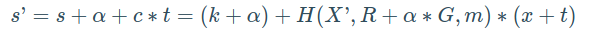

# Bitcoin

[TOC]

## 1.简述 UTXO 模型

UTXO（Unspent Transaction Output）模型是比特币等区块链系统中采用的账户设计模型，它的核心理念是：**交易不是在账户之间转账，而是通过“花费未使用的输出”来组成新的交易**。

1. **基本概念**

   - **UTXO 是“未花费的交易输出”**，本质上代表用户所拥有的数字资产；

   - 每一笔交易的输出可以被后续交易引用作为输入；

   - 用户余额 = 当前“归属该地址的所有 UTXO”之和。

     类比现实：UTXO 像一堆零钱，花钱时要选出一些零钱凑够金额，并产生找零（新 UTXO）。

2. **交易结构**

   - 每笔交易由 `Inputs`（输入） 和 `Outputs`（输出）组成；

   - 输入引用旧的 UTXO，输出生成新的 UTXO；

   - 一旦某个 UTXO 被引用作为输入，它就**不可重复使用**，确保双花攻击无效。

3. **优势**

   - **并行性强**：不同地址的 UTXO 互不干扰，适合并发处理；

   - **隐私性较好**：每次交易可以使用新的地址，不需要账户绑定；

   - **追溯清晰**：每个币的来源可以完整追溯，便于审计。

4. **与账户模型的区别（如以太坊）**

| 特性     | UTXO 模型                    | 账户模型                 |
| -------- | ---------------------------- | ------------------------ |
| 状态存储 | 存储一组未花费的输出         | 存储每个地址的余额和状态 |
| 并发能力 | 高（互不依赖的 UTXO 可并行） | 低（依赖账户状态）       |
| 查询余额 | 需遍历并累加所有 UTXO        | 直接读取账户余额         |


## 2.比特钱包有哪些地址格式，请简要说明

1. **P2PKH（Pay to Public Key Hash）地址：**

   - **地址以 `1` 开头**，例如：`1A1zP1eP5QG12345MPTfTL5SLmv7D12345`

   - 属于比特币最早期的地址格式（Legacy 地址）；

   - 对应脚本类型是 `OP_DUP OP_HASH160 <PubKeyHash> OP_EQUALVERIFY OP_CHECKSIG`
   - 优点：兼容性强
   - 缺点：交易体积大，手续费相对高

2. **P2SH（Pay to Script Hash）地址：**

   - **地址以 `3` 开头**，例如：`3J00t1WpEZ00CNmQ1234567890nqRhWNLy`

   - 支持多重签名或更复杂的支付脚本；

   - 实现隔离见证前主要用来实现功能扩展。
   - 优点：灵活性更高，可用于多签等场景
   - 缺点：仍使用传统交易结构，未完全优化交易效率

3. **Bech32（原生隔离见证地址，SegWit）：**

   - **地址以 `bc1` 开头**，例如：`bc1qar01234567890abcdydnw9re591234567890`

   - 引入于 BIP 173，全面支持原生 SegWit；

   - 字符更短、不区分大小写、容错率更高。
   - 优点：交易体积更小、手续费更低、未来兼容性好
   - 缺点：部分早期钱包或交易所不支持

4. **P2WPKH（Pay to Witness Public Key Hash）**

   - 属于 **隔离见证（SegWit）v0 的原生地址格式**，是 Bech32 地址的一种；

   - **地址以 `bc1q` 开头**，比如：`bc1qxy12345678sqtzq2n0yrf2493p83k123456789`

   - 脚本类型为：`OP_0 <20-byte PubKeyHash>`；

   - 与传统 P2PKH 相比，交易体积更小，手续费更低，抗交易重放攻击能力更强。
   - 应用场景：绝大多数现代钱包默认地址格式，主流交易所全面支持。

5. **P2TR（Pay to Taproot）**

   - 属于 **Taproot 协议（BIP 340/341/342）推出的地址格式**，启用于 2021 年；

   - **地址以 `bc1p` 开头**，比如：`bc1p5cyxnuxmeuwuvkwfem96llyxfv3nh123456789`

   - 脚本类型为：`OP_1 <32-byte x-only public key>`；

   - 支持 Schnorr 签名、多签聚合、隐私增强，更利于复杂智能合约的可扩展性。

   - 优点：

     - 多签可聚合为一个签名，节省空间；
     - 交易可隐藏执行路径，提升隐私；

     - 是比特币可编程能力的一大步。

   - 支持情况：目前主流钱包逐步支持中，但生态尚未完全普及。

6. **P2WSH（Pay to Witness Script Hash）**

   - **P2WSH 是“隔离见证版本 0 + 脚本哈希”格式**，是对传统 `P2SH` 的 SegWit 升级版本；
   - **地址以 `bc1q`开头（Bech32），后跟 62 字符长的哈希**（比 P2WPKH 更长）
   - 脚本类型为：`OP_0 <32-byte SHA256(script)>`
   - 应用场景：
     - 用于隔离见证下的多重签名（MultiSig）、时间锁（CLTV）、HTLC 等复杂合约；
     - 类似于早期的 `P2SH`，但享受 SegWit 优化带来的低手续费、无脚本攻击向量等好处。

**总结**

| 地址类型   | 前缀   | 协议版本     | 脚本类型                | 特点与用途                                      |
| ---------- | ------ | ------------ | ----------------------- | ----------------------------------------------- |
| **P2PKH**  | `1`    | Legacy       | 公钥哈希（PKH）         | 最早期地址格式，兼容性强，费用高                |
| **P2SH**   | `3`    | Legacy       | 脚本哈希（SH）          | 多签与复杂脚本支持，兼容性好                    |
| **P2WPKH** | `bc1q` | SegWit v0    | 公钥哈希（Witness PKH） | 主流原生隔离见证地址，费用低，效率高            |
| **P2WSH**  | `bc1q` | SegWit v0    | 脚本哈希（Witness SH）  | 支持复杂脚本的 SegWit 地址，适用于多签等        |
| **P2TR**   | `bc1p` | Taproot (v1) | x-only 公钥 + MAST      | 支持 Schnorr 签名、增强隐私与可扩展性的最新格式 |


## 3.Pay-to-Taproot介绍与优势

Pay-to-Taproot（P2TR）是一种ScriptPubKey，它将比特币锁定在一个脚本上，允许用户向 Schnorr 公钥或各种其他脚本的 Merkle 根支付。表面上看，一个P2TR输出将比特币锁定在一个施诺尔公钥上，我们假设为Q。然而，这个公钥Q实际上是一个公钥P和一个公钥M的总和，M是由其他ScriptPubKeys列表的Merkle根计算出来的。P2TR 输出中的比特币可以通过发布公钥 P 的签名或满足 Merkle 树中包含的脚本之一来花费，前者称为密钥路径，后者则是脚本路径。虽然P2TR的输出可能有许多种方式，但只有被使用的那一种会被公开，这样可以为其他未使用的替代方案保持隐私。此外，由于Schnorr密钥聚合特性，公钥P本身可以是一个聚合密钥，公钥P作为一个聚合密钥或单一密钥的状态永远不会被透露，因为所有的P2TR输出都是彼此相似的，这样将破坏许多链分析启发式方法，增强用户的隐私。

1. **其他支付方式**

   - P2PKH：Pay-to-Public-Key-Hash（P2PKH）是一种ScriptPubKey，它将比特币锁定在一个公钥的哈希（比特币地址）上。例如，Alice想在P2PKH交易中向Bob发送1个BTC，Bob向Alice提供他钱包中的一个地址，然后Bob的地址会被包括在交易中。当Bob试图花费他收到的比特币时，他必须用对应于公钥的私钥来签署交易，公钥的哈希值与Alice交易中提供的哈希值一致。

   - P2WPKH：Pay-to-Witness-Public-Key-Hash (P2WPKH) 是一种 ScriptPubKey，用于将比特币锁定到 SegWit 地址。 P2WPKH 交易在大多数方面类似于 P2PKH 交易；它仍然将比特币锁定到公钥的哈希值。主要区别在于 P2WPKH 使用 SegWit。这意味着所有输入的 ScriptSig（解锁比特币的脚本）被移出交易主体并进入见证部分，并称为脚本见证。这些数据仍然记录在区块链上，但数据产生的费用会低于常规数据，使得 SegWit 交易比常规交易便宜。

   - P2SH：Pay-to-Script-Hash (P2SH) 是一种 ScriptPubKey， 主要用于多重签名钱包，制作输出脚本逻辑，在接受交易之前检查多重签名。例如，如果 Alice 在 P2SH 交易中向 Bob 发送 1 BTC，她会将花费比特币所需脚本的哈希值包含在交易中。此脚本可能需要 Bob 的私钥和/或许多其他人的签名。当 Bob 想要花费他从 Alice 那里收到的比特币时，他会重建 Alice 用来发送比特币的脚本哈希，并使用脚本所需的任何私钥对交易进行签名。P2SH 非常灵活，因为它允许用户构建任意脚本。此外，交易的发送者不需要知道他们发送到什么脚本类型。在上面的示例中，Bob 可以线下构建他想要的脚本，并且只向 Alice 发送该脚本的哈希值，从而为 Bob 保留更多隐私。

   - P2WSH：Pay-to-Witness-Script-Hash (P2WSH) 是一种在大多数方面类似于 P2SH 交易的交易类型，除了它使用 SegWit。与 P2SH 交易一样，P2WSH 交易将比特币锁定到脚本的哈希值。为了花费这个比特币，花费者必须出示称为 RedeemScript 的脚本和任何必需的签名。在技术层面上，P2WSH 实际上描述了用于将比特币锁定到 SegWit 脚本哈希的 ScriptPubKey。

2. **P2TR优点**

通过比较不同类型的签名大小，可以看出在单一签名上使用P2TR是要比同等的P2WPKH要大一点的，但仔细观察会发现，对单一签名的钱包用户和整个网络来说，使用P2TR有很多好处：

|                    | P2PKH(legacy) | P2WPKH(Segwit v0) | P2TR(taproot/segwit v1) |
| ------------------ | ------------- | ----------------- | ----------------------- |
| **Output**         | 34            | 31                | 43                      |
| **Input**          | 148           | 68                | 57.5                    |
| **2-in, 2-out tx** | 374           | 208.5             | 211.5                   |

- 花费更便宜：在投入层面上，花费一个单一签名的P2TR UTXO比花费一个P2WPKH UTXO要少15%左右。像上表这样过于简单的分析隐藏了一个细节，即花费者不能选择他们被要求支付的地址，所以如果你留在P2WPKH上，而其他人都升级到P2TR，你的2进2出交易的实际典型大小将是232.5vbytes，而所有P2TR交易仍然只有211.5vbytes。
- 隐私性：虽然早期采用者改用新的脚本格式时，会失去一些隐私，但改用taproot的用户也会立即得到隐私性的提升。你的交易将能够看起来与从事新的LN通道、更有效的DLCs、安全的多重签名、各种巧妙的钱包备份恢复方案或其他一百种开创性发展的人没有区别。现在使用P2TR进行单签名，也允许你的钱包在以后升级到多签名、tapscripts、LN支持或其他功能，而不影响你现有用户的隐私。无论是旧版本还是新版本的软件收到 UTXO 都没有关系——两个 UTXO 在链上看起来都是一样的。
- 对硬件签名设备来说更方便：自重新发现费用超额支付攻击以来，一些硬件签署设备拒绝签署交易，除非该交易中花费的每个UTXO都有元数据，其中包含产生该UTXO的整个交易的重要部分的副本。而Taproot 消除了费用超额支付攻击的潜在漏洞，因此可以显着提高硬件签名者的性能。
- 更多的可预测性：P2PKH和P2WPKH UTXO的ECDSA签名可以有不同的大小，由于钱包需要在创建签名之前选择交易的费率，大多数钱包只是假设最坏情况下的签名大小，因此接受较小的签名时将略微多付一些费用。而对于P2TR，签名的大小是事先知道的，允许钱包可以选择一个精确的feerate。
- 帮助完整的节点：比特币系统的整体安全性取决于大部分比特币用户使用自己的节点验证每笔确认的交易，也包括验证您钱包创建的交易。Taproot的schnorr签名可以有效地进行批量验证，在同步区块的过程中，节点验证签名时需要消耗的CPU周期减少了约1/2。就算你拒绝了上述的所有优点，也要考虑一下使用taproot去帮助运行完整节点的人。 支持P2TR

对于已经支持接收和花费v0 segwit P2WPKH输出的钱包来说，升级到v1 segwit P2TR进行单一签名应该很容易，以下是主要的步骤：

- 使用新的BIP32密钥推导路径：强烈建议为P2TR公钥使用一个新的推导路径（例如由BIP86定义的），如果你在ECDSA和schnorr签名中使用相同的密钥，可能会被攻击。
- 通过哈希值来调整你的公钥：虽然技术上不需要单签名，特别是当你的所有密钥都来自随机选择的BIP32种子时，BIP341建议将你的密钥提交到一个不可消耗的scripthash树。这就像使用椭圆曲线加法运算一样简单，将你的公钥与该密钥的哈希值的曲线点相加。遵守这个建议的好处就是如果你以后要增加对无脚本多签名的支持，或者增加对tr()描述符的支持，你将能够使用同样的代码。
- 创建你的地址并对其进行监控：使用bech32m来创建你的地址。支付将被发送到scriptPubKey OP_1 <tweaked_pubkey>。你可以使用用于扫描 v0 隔离见证地址（如 P2WPKH）的任何方法来扫描支付脚本的交易。
- 创建一个支出交易：taproot的所有非见证字段都和P2WPKH的一样，所以你不需要担心交易序列化的变化。
- 创建一个签名信息：这是对支出交易的数据的承诺。大部分数据与你为P2WPKH交易所签署的数据相同，但字段的顺序被改变，还有一些额外的东西被签署。实现这一点只是一个序列化和散列各种数据的问题，所以编写代码应该很容易。
- 签署签名信息的哈希值：现在已经有许多不同的方法用来创建Schnorr签名了。因此当前最好的方法不是 "推出你自己的方法"，而是使用你信任的、经过严格审查的库中的功能。但是，如果你由于某种原因不能这样做，BIP340提供了一种算法，如果你已经有了制作ECDSA签名的基础，那么这种算法应该很容易实现。当你有了你的签名，把它放在输入的见证数据中，然后发送你的支出交易。

3. **总结**

Pay-to-Taproot (P2TR)输出是版本为 1 的SegWit 输出，以后所有的 Taproot 交易都是 SegWit 交易，因此对于开发者，优先尝试一下P2TR是必要的。在taproot在709,632区块激活之前，你就可以使用testnet、公共默认标志或Bitcoin Core的私有regtest模式测试你的代码。


## 4.简述比特币的 POW 共识算法

1. **目标与作用：**

   - **防止双重支付：** POW的主要目标之一是防止任何人重复花费同一笔比特币。

   - **达成共识：** 它让全球分布式的节点对交易的顺序和有效性达成一致，共同维护一个不可篡改的账本（区块链）。

   - **控制新币发行：** 新的比特币也是通过POW过程产生的，作为对矿工贡献算力的奖励。

2. **核心思想：“付出努力才能获得记账权”**

   - 简单来说，POW要求参与者（称为“矿工”）执行一些计算上困难但结果易于验证的工作。

   - 这个“工作”主要是指寻找一个特定的随机数（Nonce），当这个随机数与区块中的其他数据（如交易信息、上一个区块的哈希值等）一起进行哈希运算（比特币使用的是SHA-256算法）时，得到的哈希结果必须小于一个特定的目标值（Target）。

3. **挖矿过程：**

   - 矿工收集网络中待确认的交易，将它们打包成一个候选区块。

   - 然后，矿工开始尝试不同的Nonce值，不断进行哈希运算，直到找到一个满足条件的Nonce。

   - 这个过程非常消耗计算资源和电力，就像在“挖矿”一样，因此得名。

   - 第一个找到有效Nonce的矿工，就有权将这个区块添加到区块链上，并获得新发行的比特币和该区块包含的交易手续费作为奖励。

4. **难度调整 (Difficulty Adjustment)：**

   - 为了维持大约每10分钟产生一个新区块的稳定速率，比特币网络会定期（大约每2016个区块，约两周时间）根据全网总算力的变化来调整“挖矿难度”。

   - 如果全网算力增加，导致区块产生过快，难度就会调高（即目标哈希值会变小，更难找到）。反之，如果算力下降，难度就会调低。

   - 这确保了不管有多少矿工参与，新币的发行速度和交易确认时间都能保持相对稳定。

5. **安全性：**

   - 由于修改历史区块需要重新计算该区块及其之后所有区块的POW（因为每个区块都包含了前一个区块的哈希值），这需要巨大的算力，使得攻击成本非常高昂。

   - 只要大部分算力掌握在诚实的矿工手中（通常说的51%攻击），网络就是安全的。


## 5. 简述 BRC20 的原理

BRC-20 是一种在比特币区块链上发行同质化代币的实验性标准。它的原理核心是利用了 **Ordinals 协议** 和 **铭文 (Inscriptions)** 的概念。

1. **Ordinals 协议基础：**
   - 首先，要理解 BRC-20，我们需要先了解 Ordinals 协议。这个协议为比特币的最小单位——聪（Satoshi）——进行编号，使得每一个聪都变得独一无二。
   - 然后，Ordinals 允许用户将任意数据（如文本、图片、代码等）附加或“铭刻”到这些特定的聪上，这些附加的数据就被称为“铭文”。
2. **BRC-20 的实现方式：**
   - BRC-20 标准巧妙地利用了这种铭文功能。它通过将特定格式的 JSON (JavaScript Object Notation) 文本数据铭刻到聪上，来定义和管理代币。
   - 这些 JSON 数据规定了代币的操作，主要包括三种基本操作：
     - **Deploy (部署)：** 定义一个新的 BRC-20 代币，包括代币的名称（Ticker，通常是4个字符）、最大供应量（Max Supply）和每次铸造的限制数量（Limit per Mint）。这个部署铭文一旦上链，就确立了这个代币的基本属性。
     - **Mint (铸造)：** 用户根据已部署代币的规则，铭刻一个铸造指令的 JSON 数据，来获取一定数量的该代币。这通常需要在代币的总量和单次铸造限制内进行。
     - **Transfer (转移)：** 当用户想要转移 BRC-20 代币时，他们首先需要铭刻一个转移指令的 JSON 数据，声明要转移的数量。然后，通过花费包含这个“转移铭文”的那个聪（UTXO），来完成代币的实际所有权转移。
3. **状态计算与账本：**
   - 与以太坊等智能合约平台不同，BRC-20 的状态（比如谁拥有多少代币）**不是由比特币区块链本身直接计算或强制执行的**。
   - 相反，BRC-20 的账本状态是通过链下的索引器 (Indexer) 来跟踪和计算的。这些索引器会扫描比特币区块链上的所有铭文，解析符合 BRC-20 格式的 JSON 数据，并根据这些数据的顺序和内容来构建和更新代币的余额和所有权状态。
   - 因此，不同索引器之间的数据同步和一致性是一个需要关注的点。
4. **特点与局限性：**
   - **简单性：** BRC-20 的设计相对简单，主要依赖文本铭文，易于理解和实现。
   - **比特币原生：** 它直接构建在比特币主网上，利用了比特币的安全性。
   - **实验性：** 它仍然是一个相对较新的实验性标准，缺乏智能合约的复杂功能，例如自动化做市、借贷等。
   - **效率和成本：** 所有的操作都需要通过比特币交易来铭刻数据，可能会受到比特币网络交易费用和确认时间的影响。
   - **依赖链下索引：** 用户需要依赖可信的链下索引器来获取准确的代币状态。


## 6.请说明一下什么是 RGB 协议

RGB 协议是一个开源的、具有可扩展性和隐私保护能力的智能合约系统和数字资产协议，它构建在比特币区块链和闪电网络之上。它的目标是为比特币生态带来更复杂的智能合约功能以及发行和管理多样化数字资产的能力，同时不损害比特币主链的简洁性和安全性。

1. **核心理念：链下计算，链上承诺 (Off-Chain Computation, On-Chain Commitment)**
   - 与许多在区块链上直接执行所有逻辑的智能合约平台不同，RGB 的大部分数据和合约逻辑的验证与状态转换都发生在**链下**。
   - 比特币区块链本身主要用于**锚定和承诺**RGB 合约的状态。它通过将合约状态的简短加密承诺（通常是哈希值）嵌入到比特币交易的输出（UTXO）中来实现。这意味着比特币主链不直接解释或存储 RGB 的合约数据或逻辑，只是作为其存在和状态的“公证人”。
2. **客户端验证 (Client-Side Validation)**
   - 这是 RGB 的一个关键特性。资产的有效性和合约状态的更新是由资产的**所有者独立验证**的，而不是由全球共享的区块链网络（矿工或全节点）来验证。
   - 当一笔 RGB 资产被转移时，发送方会将该资产的历史记录（经过加密和选择性披露）以及相关的状态转换证明直接发送给接收方。接收方使用这些信息独立验证这笔资产的完整历史和当前状态的有效性。
   - 这种方法极大地增强了隐私性，因为只有交易的参与方才了解资产的详细信息，同时也提高了可扩展性，因为不需要全网广播和验证每一笔资产的细节。
3. **利用比特币的 UTXO 模型和一次性密封 (Single-Use Seals)**
   - RGB 巧妙地利用了比特币的 UTXO（未花费交易输出）模型。每个 RGB 资产或合约状态都与一个特定的比特币 UTXO 相关联。
   - 当这个 UTXO 被花费时，就意味着这个特定的“一次性密封”被打开了，与之关联的 RGB 资产状态也随之更新或转移。新的状态会与花费这笔 UTXO 交易产生的新 UTXO 相关联。
   - 这种机制确保了 RGB 资产的转移遵循比特币交易的规则，防止了双重花费，并继承了比特币的安全性。
4. **主要功能和目标：**
   - **发行多样化资产：** 可以发行同质化代币（类似 ERC-20）、非同质化代币（NFTs）、稳定币、证券代币等。
   - **复杂智能合约：** 支持比比特币脚本更复杂的合约逻辑，例如去中心化身份、投票系统等。
   - **隐私保护：** 由于数据主要在链下处理并通过客户端验证，交易细节不会暴露在公开的比特币区块链上。
   - **可扩展性：** 避免了将所有数据和计算都放在比特币主链上，从而减轻了主链的负担，并有可能通过闪电网络实现更快速、更低成本的资产转移。
   - **不修改比特币核心：** RGB 是一个构建在比特币之上的第二层或第三层协议，不需要对比特币的核心代码进行任何修改。
5. **与闪电网络的集成：**
   - RGB 协议被设计为可以与闪电网络良好集成。这意味着通过 RGB 发行的资产理论上也可以在闪电网络通道中进行即时、低成本的转移，进一步增强其可用性和可扩展性。


## 7.举例说明比特币脚本编程的过程

比特币脚本编程是比特币交易验证的核心机制。它是一种基于栈的、非图灵完备的脚本语言，主要用来定义比特币如何被花费。下面用一个最常见的交易类型，**P2PKH (Pay-to-Public-Key-Hash)**，来举例说明这个过程。

P2PKH 意味着 "支付给公钥的哈希"。当我们说 Alice 给 Bob 发送比特币时，Alice 实际上是创建了一个交易输出，这个输出锁定了一些比特币，并规定只有能够证明自己拥有对应于某个公钥哈希（Bob的公钥哈希）的私钥的人才能花费它们。

这个过程主要涉及两个脚本：

1. **锁定脚本 (Locking Script / `scriptPubKey`)**: 这个脚本由发送方（Alice）创建，并包含在交易的输出中。它定义了花费这笔输出的条件。
2. **解锁脚本 (Unlocking Script / `scriptSig`)**: 这个脚本由接收方（Bob），在未来他想要花费这笔比特币时创建，并包含在他花费这笔输出的交易的输入中。它提供了满足锁定脚本条件的数据。

**P2PKH 锁定脚本 (`scriptPubKey`) 的样子通常是：**

```
OP_DUP OP_HASH160 <Bob_PubKeyHash> OP_EQUALVERIFY OP_CHECKSIG
```

让我们分解一下：

- `OP_DUP`: 复制栈顶的元素。
- `OP_HASH160`: 对栈顶的元素进行 HASH160 运算（先 SHA-256，再 RIPEMD-160）。
- `<Bob_PubKeyHash>`: 这是 Bob 的公钥经过 HASH160 运算后得到的哈希值，它是一个固定的数据，直接压入栈中。
- `OP_EQUALVERIFY`: 比较栈顶的两个元素是否相等。如果相等，则移除它们；如果不相等，或者栈中元素不足，则脚本执行失败。`VERIFY` 后缀意味着如果检查失败，交易立即标记为无效。
- `OP_CHECKSIG`: 验证签名。它会使用栈顶的公钥和次栈顶的签名，来验证这笔交易（或交易的特定部分）是否被该公钥对应的私钥正确签署。

**当 Bob 想要花费这笔比特币时，他需要提供解锁脚本 (`scriptSig`)：**

```
<Bob_Signature> <Bob_PublicKey>
```

- `<Bob_Signature>`: Bob 使用他的私钥对这笔花费交易（或其特定部分）进行的数字签名。
- `<Bob_PublicKey>`: Bob 的完整公钥。

**脚本执行过程 (验证过程)：**

当 Bob 尝试花费这笔比特币时，比特币节点会将解锁脚本 (`scriptSig`) 和锁定脚本 (`scriptPubKey`) 连接起来，然后从左到右依次执行。

执行顺序大致如下：

1. `<Bob_Signature>`被压入栈。
   - 栈: `[<Bob_Signature>]`
2. `<Bob_PublicKey>`被压入栈。
   - 栈: `[<Bob_Signature>, <Bob_PublicKey>]`
3. `OP_DUP`执行：复制栈顶的 `<Bob_PublicKey>`。
   - 栈: `[<Bob_Signature>, <Bob_PublicKey>, <Bob_PublicKey>]`
4. `OP_HASH160`执行：取出栈顶的 `<Bob_PublicKey>`，计算其 HASH160 值，然后将结果压入栈。
   - 栈: `[<Bob_Signature>, <Bob_PublicKey>, hash160(<Bob_PublicKey>)]`
5. `<Bob_PubKeyHash>` (来自锁定脚本) 被压入栈。
   - 栈: `[<Bob_Signature>, <Bob_PublicKey>, hash160(<Bob_PublicKey>), <Bob_PubKeyHash_from_scriptPubKey>]`
6. `OP_EQUALVERIFY` 执行：比较栈顶的两个元素 `hash160(<Bob_PublicKey>)` 和 `<Bob_PubKeyHash_from_scriptPubKey>`。
   - 如果它们相等（意味着 Bob 提供的公钥确实是最初指定的那个公钥的哈希），则两者都从栈中弹出，脚本继续。
   - 如果不相等，脚本立即失败，交易无效。
   - 栈 (如果相等): `[<Bob_Signature>, <Bob_PublicKey>]`
7. `OP_CHECKSIG`执行：取出栈顶的 `<Bob_PublicKey>` 和次栈顶的 `<Bob_Signature>`。它会验证这个签名对于当前交易和这个公钥是否有效。
   - 如果签名有效，则将 `TRUE` (或数字 1) 压入栈。
   - 如果签名无效，则将 `FALSE` (或数字 0) 压入栈。
   - 栈 (如果签名有效): `[TRUE]`

最后，如果栈顶的元素是 `TRUE` (或者非零值)，则脚本执行成功，交易被认为是有效的，Bob 可以花费这笔比特币。


## 8.简述 Schnorr盲签名

**Schnorr盲签名方案**

顾名思义，Schnorr 盲签名是签名者不知道他们签署了什么的签名。 可能很难想象这有什么用处，但在处理`不经意服务器（Oblivious Server）`时，它是一个很好的工具，而这在比特币和整个互联网的未来发挥着重要作用。

`不经意服务器`指的是一些支持可信计算或数据存储的服务器，用户可能会对其服务进行付费，但服务器却不需要知道它操作的所有信息，这类信息包括用户的身份、哪些方正在相互交互、正在存储哪些数据、正在执行的什么计算等等内容，因为这个过程是不经意的。一个不经意的服务器应该是一个可靠的计算服务，除了计算什么都不做。

将这个场景迁移到比特币网络中，如果采用盲签名，节点只负责运算，而无法知晓正在计算的内容是什么，最终节点打包的区块并不会透露用户的任何隐私，这为用户的匿名性提供了极大保护。用户只需为节点（矿工）支付交易的手续费，就能享受比特币网络提供的隐私性和安全性。

Schnorr盲签名方案有四个步骤：

- 签名者提供一个随机数
- 接收者提出一个使用随机数构造的盲挑战（它不显示有关签名内容的信息）
- 签名者使用步骤 1 中的随机数提供此挑战的正常 schnorr 签名
- 接收者解开这个签名的盲部分，从而产生一个正常的、有效的 Schnorr 签名，它看起来与签名者提供的签名完全无关，因为 R 和 s 值都由随机数调整。

**Schnorr盲签名是如何工作的**

在创建盲签名的过程中，具有公钥 `X` 的签名者和接收者之间的通信类似于Schnorr 的签名协议：

1. 签名者生成一个随机的 `k` 并将随机数 `R = k*G` 发送给接收者。
2. 接收者响应一个挑战 `c`。
3. 签名者回复生成的盲签名 `s = k + c*x`，其中 `x` 是签名者的私钥。

在正常的 Schnorr 协议中，接收者旨在选择 c 作为他们想要签名的某些消息 m 的哈希 `H(X, R, m)`。 但是我们使用盲签名的目标是允许接收者以某种方式调整 R 和 s 以获得签名 `(R', s')`，其中调整值是随机数，因此该签名看起来与原始的 `(R, s)` 完全无关。

 因此，如果我们想完成这个方案，最直接的做法就是让接收者生成随机数 `α`和`t`，并让 `X' = X + t*G`, `R' = R + α*G`， X'和R'是调整后的公钥和随机数。因此它们生成的挑战将是 `c = H(X', R', m)`，生成的盲签名为 `s = k + H(X',R',m) * x` ，然后需要调整为有效 schnorr 签名。



这样，我们就最终得到了使用密钥 X'签署的消息 m 的有效 Schnorr 签名 `(R',s')`。

然而，这个方案有一个致命的缺陷。 如果签名者试图查看它已签署的内容（例如通过查看比特币交易的所有签名）并且遇到使用公钥 X' 签署消息 m得到的签名 (R', s') ，它将无法识别这些值中的任何一个，这看似达到了匿名的目的 ，但它将能够计算 H(X', R', m) 并将该值与它在步骤 2 中收到的挑战进行比较，这破坏了签名者的匿名性。

为了解决这个问题，可以生成一个新的随机数`β` ，并用它来调整挑战 `c = H(X', R', m) + β`，调整后的签名就变成了


并且，我们必须对随机数添加额外的调整以保持一致，调整后得到 `R'=R + α∗G + β∗X`。现在得到最终的盲签名 `(R', s')`，其中所有这些值对于签名者来说都是随机的，并且挑战哈希也是随机的。

**Schnorr盲签名的安全性**

Schnorr 盲签名方案对于所提出的各种攻击来说，实际上并不安全，只是规定签名者在很小一段时间内中止和重试，才能确保使其安全（但也会导致不太有效的签名方案）。正因为如此，通常只有在需要Schnorr签名时使用 Schnorr 盲签名才是有意义的（例如，如果被签名的事物是未来的比特币交易）。对于盲签名的大多数链下用例，使用其他盲签名方案可能更有意义。 如BIP340提及的，确切地说，Schnorr 签名承诺了一个非常简单的盲签名方案，但它是不安全的，因为它容易受到 Wagner 的攻击。一种已知的缓解措施是让签名者以一定的概率中止签名会话，并且可以在非标准密码假设下证明由此产生的方案是安全的。

**盲CoinSwap服务器**

盲签名的一个有趣用例是 CoinSwap 服务器，CoinSwap 是一对不可链接的交易，通常有两方以原子方式相互支付几乎相等的金额。使用盲签名，可以有一个盲 CoinSwap 服务，用户可以支付少量费用与服务器执行 CoinSwap，而服务器无法跟踪哪个付款对应哪个收款。

就像常规 Schnorr 签名一样，盲签名支持预先提交的随机数方案。具体来说，一旦服务器给出了它的随机数，并且客户端生成了它的调整，客户端就能够计算 `s*G`，其中 s 来自已知消息的盲签名，这可以实现这些签名的原子购买，这是通过使用 `s*G` 作为适配器签名中的适配器点来实现的。该签名将用户的付款签署给服