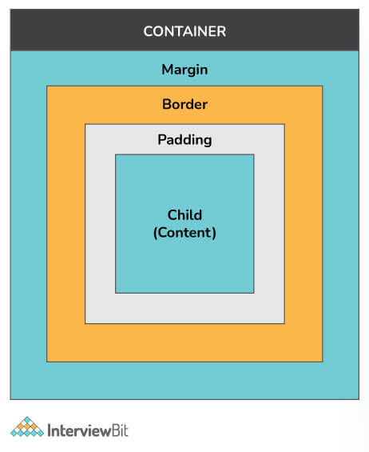
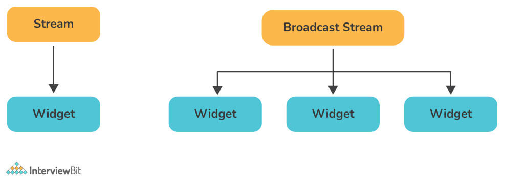

# 面试题集: 客户端开发-Flutter

[返回旧的已有问题](#旧的问题列表)

## 技能概览

### Flutter核心架构

| 能力点 | 技能难度| 快速跳转 |
| :--- |:---: | :---: |
| Flutter渲染流程理解 | 6 | [直达题目](#flutter渲染流程理解) |
| Widget生命周期管理 | 5 | [直达题目](#widget生命周期管理) |
| Element与RenderObject关系 | 7 | [直达题目](#element与renderobject关系) |
| Flutter事件传递机制 | 6 | [直达题目](#flutter事件传递机制) |
| Flutter异步机制与事件循环 | 5 | [直达题目](#flutter异步机制与事件循环) |

### 状态管理

| 能力点 | 技能难度| 快速跳转 |
| :--- |:---: | :---: |
| setState使用与限制 | 3 | [直达题目](#setstate使用与限制) |
| InheritedWidget原理与应用 | 5 | [直达题目](#inheritedwidget原理与应用) |
| Provider框架使用与原理 | 6 | [直达题目](#provider框架使用与原理) |
| Bloc模式实现与优化 | 7 | [直达题目](#bloc模式实现与优化) |
| Riverpod框架深入理解 | 7 | [直达题目](#riverpod框架深入理解) |
| 状态管理性能优化 | 8 | [直达题目](#状态管理性能优化) |

### 布局与UI设计

| 能力点 | 技能难度| 快速跳转 |
| :--- |:---: | :---: |
| 基础布局组件使用 | 3 | [直达题目](#基础布局组件使用) |
| 自定义布局实现 | 6 | [直达题目](#自定义布局实现) |
| 响应式设计与适配 | 5 | [直达题目](#响应式设计与适配) |
| 动画基础实现 | 4 | [直达题目](#动画基础实现) |
| 复杂动画与自定义动画 | 7 | [直达题目](#复杂动画与自定义动画) |
| Flutter绘制原理与Canvas使用 | 8 | [直达题目](#flutter绘制原理与canvas使用) |

### 路由与导航

| 能力点 | 技能难度| 快速跳转 |
| :--- |:---: | :---: |
| Navigator基础使用 | 3 | [直达题目](#navigator基础使用) |
| 命名路由与参数传递 | 4 | [直达题目](#命名路由与参数传递) |
| 路由守卫与权限控制 | 6 | [直达题目](#路由守卫与权限控制) |
| 自定义路由动画 | 7 | [直达题目](#自定义路由动画) |
| 路由状态管理与深度链接 | 8 | [直达题目](#路由状态管理与深度链接) |

### 网络与数据处理

| 能力点 | 技能难度| 快速跳转 |
| :--- |:---: | :---: |
| Http请求基础 | 3 | [直达题目](#http请求基础) |
| Dio库使用 | 4 | [直达题目](#dio库使用) |
| 网络请求拦截与缓存 | 6 | [直达题目](#网络请求拦截与缓存) |
| WebSocket实时通信 | 7 | [直达题目](#websocket实时通信) |
| 数据序列化与反序列化 | 5 | [直达题目](#数据序列化与反序列化) |
| 离线数据同步策略 | 8 | [直达题目](#离线数据同步策略) |

### 性能优化

| 能力点 | 技能难度| 快速跳转 |
| :--- |:---: | :---: |
| Flutter性能监控工具使用 | 5 | [直达题目](#flutter性能监控工具使用) |
| Widget重绘与渲染优化 | 7 | [直达题目](#widget重绘与渲染优化) |
| 内存泄漏检测与优化 | 7 | [直达题目](#内存泄漏检测与优化) |
| 启动速度优化 | 6 | [直达题目](#启动速度优化) |
| 帧率与流畅度调优 | 8 | [直达题目](#帧率与流畅度调优) |
| 异步任务调度优化 | 7 | [直达题目](#异步任务调度优化) |

### 平台集成与原生交互

| 能力点 | 技能难度| 快速跳转 |
| :--- |:---: | :---: |
| Platform Channels基础 | 4 | [直达题目](#platform-channels基础) |
| MethodChannel与EventChannel使用 | 6 | [直达题目](#methodchannel与eventchannel使用) |
| 原生插件开发 | 7 | [直达题目](#原生插件开发) |
| Flutter与原生UI混合开发 | 8 | [直达题目](#flutter与原生ui混合开发) |
| 多平台适配策略 | 7 | [直达题目](#多平台适配策略) |

### 测试与调试

| 能力点 | 技能难度| 快速跳转 |
| :--- |:---: | :---: |
| 单元测试基础 | 3 | [直达题目](#单元测试基础) |
| Widget测试 | 5 | [直达题目](#widget测试) |
| 集成测试 | 6 | [直达题目](#集成测试) |
| 调试工具与日志分析 | 5 | [直达题目](#调试工具与日志分析) |
| 性能分析与问题定位 | 7 | [直达题目](#性能分析与问题定位) |

### 安全与发布

| 能力点 | 技能难度| 快速跳转 |
| :--- |:---: | :---: |
| Flutter应用安全基础 | 4 | [直达题目](#flutter应用安全基础) |
| 数据加密与安全存储 | 6 | [直达题目](#数据加密与安全存储) |
| 代码混淆与防逆向 | 7 | [直达题目](#代码混淆与防逆向) |
| 应用签名与发布流程 | 5 | [直达题目](#应用签名与发布流程) |
| 持续集成与自动化发布 | 7 | [直达题目](#持续集成与自动化发布) |

---

## 详细题目列表

### Flutter核心架构

<a id='flutter渲染流程理解'></a>
#### Flutter渲染流程理解

**技能难度评分:** 6/10

**问题 1:**

> 在 Flutter 的渲染流程中，以下哪一个阶段负责将 Widget 转换为对应的 RenderObject，并构建渲染树？
> 
> A. Build 阶段（Build Phase）
> 
> B. Layout 阶段（Layout Phase）
> 
> C. Paint 阶段（Paint Phase）
> 
> D. Compositing 阶段（Compositing Phase）

<details>
  <summary>点击查看答案</summary>
  <p><strong>

正确答案: A. Build 阶段（Build Phase）

解释：
Flutter 的渲染流程中，Build 阶段负责将 Widget 转换为对应的 Element 和 RenderObject，构建渲染树。Layout 阶段负责根据约束计算大小和位置，Paint 阶段负责绘制内容，Compositing 阶段负责将绘制的内容合成到屏幕上。选项 B、C、D 分别对应后续的渲染流程阶段，但不负责 Widget 到 RenderObject 的转换。</strong></p>
</details>

**问题 2:**

> 假设你正在开发一个复杂的 Flutter 应用，其中包含多个自定义组件和动画。某次性能分析中发现，应用在某个页面切换时出现明显的卡顿现象。请结合 Flutter 的渲染流程，分析可能导致卡顿的环节，并提出优化建议。
> 
> 请简述 Flutter 渲染流程的主要阶段，并说明每个阶段可能出现性能瓶颈的原因，以及针对这些瓶颈你会采取哪些具体优化措施？

<details>
  <summary>点击查看答案</summary>
  <p><strong>

正确答案: Flutter 的渲染流程主要包括以下几个阶段：

1. Widget 阶段：构建 Widget 树，描述 UI 的结构。
2. Element 阶段：Widget 转换为 Element，负责关联 Widget 和 RenderObject。
3. RenderObject 阶段：构建渲染树，负责布局（layout）、绘制（paint）和组合（compositing）。

性能瓶颈分析：

- Widget 阶段：频繁调用 setState 导致整个 Widget 树重建，增加 CPU 开销。
- Element 阶段：大量创建或销毁 Element，增加内存和计算负担。
- RenderObject 阶段：
  - Layout 阶段：复杂布局计算消耗时间长。
  - Paint 阶段：绘制复杂图形或大量像素时性能下降。
  - Compositing 阶段：图层过多或合成过于复杂导致 GPU 负担大。

优化建议：

- 减少不必要的 setState 调用，使用更细粒度的状态管理，如 Provider、Bloc 等。
- 使用 const 构造函数和键（Key）来复用 Widget 和 Element，减少重建。
- 优化布局，避免深层嵌套和复杂布局，使用合适的布局组件。
- 利用 RepaintBoundary 分割绘制区域，减少不必要的重绘。
- 简化绘制内容，减少透明度和阴影等复杂效果。
- 使用性能分析工具（Flutter DevTools）定位具体瓶颈，针对性优化。</strong></p>
</details>

---

<a id='widget生命周期管理'></a>
#### Widget生命周期管理

**技能难度评分:** 5/10

**问题 1:**

> 在Flutter中，StatefulWidget的生命周期中，哪个方法会在State对象被插入到树中时调用，用于初始化依赖关系？
> 
> A. initState()
> 
> B. didChangeDependencies()
> 
> C. build()
> 
> D. dispose()

<details>
  <summary>点击查看答案</summary>
  <p><strong>

正确答案: B. didChangeDependencies()。

解释：didChangeDependencies()方法在State对象插入树中后立即调用，此时依赖的InheritedWidget可能发生变化，适合做依赖相关的初始化。initState()虽然在State对象创建后调用，但此时依赖关系尚未建立；build()用于构建UI；dispose()则是销毁前调用。</strong></p>
</details>

**问题 2:**

> 在Flutter开发中，假设你有一个需要频繁更新数据的StatefulWidget，比如一个实时显示股票价格的组件。请简述该Widget的生命周期管理中，哪些生命周期方法适合用来初始化数据监听、更新数据和释放资源？并说明为什么选择这些方法？

<details>
  <summary>点击查看答案</summary>
  <p><strong>

正确答案: 在Flutter的StatefulWidget中，常用的生命周期方法包括：

1. **initState()**：适合用来初始化数据监听和相关资源的创建。因为initState()只会在Widget创建时调用一次，适合设置初始状态和启动订阅，比如打开WebSocket连接或添加数据监听器。

2. **didUpdateWidget()**：当Widget的配置发生变化时调用，适合处理依赖于父Widget变化的逻辑，比如更新监听的参数或重新配置数据源。

3. **setState()**：用于更新UI状态，响应数据变化时调用。

4. **dispose()**：适合用来释放资源和取消监听，防止内存泄漏。比如关闭WebSocket连接、移除监听器等。

选择这些方法的原因在于它们分别对应Widget生命周期的不同阶段，合理利用可以保证资源的正确初始化、更新和释放，避免资源浪费和潜在的内存泄漏。</strong></p>
</details>

---

<a id='element与renderobject关系'></a>
#### Element与RenderObject关系

**技能难度评分:** 7/10

**问题 1:**

> 在Flutter框架中，Element与RenderObject之间的关系是如何体现的？
> 
> A. Element持有RenderObject的实例，负责管理其生命周期和更新，同时RenderObject处理具体的绘制和布局逻辑。
> 
> B. RenderObject持有Element的实例，负责管理其生命周期，Element只负责绘制和布局。
> 
> C. Element和RenderObject是完全独立的，彼此之间没有直接联系，Element只管理Widget树。
> 
> D. Element和RenderObject共享同一个实例，既负责管理生命周期又负责渲染。
> 
> 请结合Flutter核心架构说明你的选择。

<details>
  <summary>点击查看答案</summary>
  <p><strong>

正确答案: A. Element持有RenderObject的实例，负责管理其生命周期和更新，同时RenderObject处理具体的绘制和布局逻辑。——这是唯一正确的答案，因为在Flutter中，Element是Widget与RenderObject之间的桥梁，负责维护RenderObject的生命周期和状态更新，而RenderObject负责具体的布局和绘制工作。选项B错误地颠倒了两者的职责；选项C错误地认为两者无关；选项D错误地认为两者共享实例，实际上它们是分离的对象。</strong></p>
</details>

**问题 2:**

> 假设你在开发一个自定义复杂UI组件时，遇到了性能问题。请结合Flutter的渲染流程，详细说明Element与RenderObject之间的关系，并分析如何利用这两者的特性优化自定义组件的性能。请举例说明在更新UI时，Element和RenderObject各自的职责，以及它们是如何协作来减少不必要的渲染开销的。

<details>
  <summary>点击查看答案</summary>
  <p><strong>

正确答案: 在Flutter中，Element是Widget树与RenderObject树之间的桥梁，负责管理Widget的实例和RenderObject的生命周期。RenderObject则负责具体的布局、绘制和命中测试。

Element持有对Widget和RenderObject的引用，它负责在Widget树发生变化时，更新对应的RenderObject。具体来说，Element负责比较新旧Widget，决定是否需要更新RenderObject，或者创建新的RenderObject。

在性能优化方面，理解Element与RenderObject的关系至关重要：

1. **Element缓存和复用**：Element复用旧的Widget和RenderObject，避免不必要的对象创建，减少内存分配和GC压力。

2. **RenderObject的局部更新**：RenderObject负责具体绘制，只在必要时（如尺寸变化或绘制属性改变）才重新布局和重绘，减少整体UI的重绘开销。

举例来说，假设一个列表项的状态发生变化，仅对应的Element会触发更新，Element会调用RenderObject的`markNeedsLayout`或`markNeedsPaint`方法，通知RenderObject重新布局或绘制。其他未变化的列表项的RenderObject不会受到影响，从而提高性能。

总结：Element负责管理生命周期和Widget树的结构变化，RenderObject专注于高效渲染和布局。通过合理设计Widget与Element的更新逻辑，减少RenderObject的重建和重绘，可以显著提升自定义组件的性能。</strong></p>
</details>

---

<a id='flutter事件传递机制'></a>
#### Flutter事件传递机制

**技能难度评分:** 6/10

**问题 1:**

> 在Flutter的事件传递机制中，当一个手势事件（如点击）发生时，事件是如何在Widget树中传递的？以下哪项描述是正确的？
> 
> A. 事件从根Widget向下传递到目标Widget，然后从目标Widget向上传递回根Widget（捕获和冒泡阶段）。
> 
> B. 事件只会传递给目标Widget，其他Widget不会接收到事件。
> 
> C. 事件沿着命中测试路径从根Widget向下传递到目标Widget，目标Widget处理后事件传递结束，不会向上传递。
> 
> D. 事件沿着命中测试路径从根Widget向下传递到目标Widget，目标Widget处理后事件会向上传递给其父Widget，直到被消费或到达根Widget。

<details>
  <summary>点击查看答案</summary>
  <p><strong>

正确答案: D. 事件沿着命中测试路径从根Widget向下传递到目标Widget，目标Widget处理后事件会向上传递给其父Widget，直到被消费或到达根Widget。 解释：Flutter的事件传递机制包括命中测试、事件分发和事件冒泡。事件首先沿Widget树从根向下传递，找到命中目标Widget，事件传递给该Widget处理。处理后事件会向上传递（冒泡），父Widget有机会响应事件，直到事件被消费或传递到根Widget。选项A描述类似浏览器的捕获和冒泡机制，但Flutter没有捕获阶段。选项B错误，因为事件会传递给目标Widget的父Widget。选项C错误，因为事件会冒泡向上传递。</strong></p>
</details>

**问题 2:**

> 在Flutter中，假设你有一个包含多个子组件的复杂界面，其中一个子组件需要响应用户的点击事件，但你发现该事件被父组件或其他兄弟组件拦截或阻止了。请简要说明Flutter的事件传递机制是如何工作的？并结合该场景，分析可能导致事件被拦截的原因，以及你会如何设计事件传递或处理机制以确保目标子组件能够正确接收到事件。

<details>
  <summary>点击查看答案</summary>
  <p><strong>

正确答案: Flutter的事件传递机制主要基于事件的捕获、目标和冒泡三个阶段，但其实现方式与传统Web不同。事件从最顶层的Widget开始向下传递（捕获阶段），到达目标Widget后触发事件处理，然后事件可以向上传递（冒泡阶段）给父Widget。具体来说，Flutter中手势事件是通过GestureDetector等手势识别器处理的，事件首先由HitTest确定目标Widget，然后事件由该Widget处理。

在该场景中，事件被父组件或兄弟组件拦截可能由以下原因导致：
1. 父组件或兄弟组件的GestureDetector或Listener设置了较高优先级的手势识别，导致事件被吸收。
2. 使用了AbsorbPointer或IgnorePointer等Widget，阻止事件传递。
3. 事件传递链上某些Widget进行了事件消费，阻止事件继续传递。

为确保目标子组件能正确接收到事件，可以采取以下设计策略：
- 确认手势识别器的优先级和竞态规则，避免父组件抢占手势。
- 使用HitTestBehavior明确事件的传递行为，如设置为translucent以允许事件穿透。
- 避免不必要的AbsorbPointer或IgnorePointer。
- 利用Notification机制或事件回调，确保事件能被传递和响应。
- 在复杂交互中，可以自定义GestureRecognizer以精细控制事件处理。这样可以在保证事件传递通畅的同时，避免不必要的事件被拦截，确保目标子组件响应用户操作。</strong></p>
</details>

---

<a id='flutter异步机制与事件循环'></a>
#### Flutter异步机制与事件循环

**技能难度评分:** 5/10

**问题 1:**

> 在Flutter中，事件循环(Event Loop)和微任务队列(Microtask Queue)的关系是什么？
> 
> A. 事件循环会在每一轮结束后立即执行所有微任务队列中的任务，然后才处理下一轮事件。
> 
> B. 微任务队列中的任务只会在事件循环完全停止后才执行。
> 
> C. Flutter的事件循环和微任务队列是两个相互独立且不会交互的机制。
> 
> D. 事件循环优先处理事件队列中的任务，而微任务队列中的任务只有当事件队列为空时才执行。

<details>
  <summary>点击查看答案</summary>
  <p><strong>

正确答案: A. 事件循环会在每一轮结束后立即执行所有微任务队列中的任务，然后才处理下一轮事件。理由：Flutter的事件循环机制遵循Dart的事件循环模型，每一轮事件循环结束后，会立即执行所有排队的微任务，确保微任务优先于下一轮事件的处理。这保证了异步代码中的微任务（如Future.microtask）能够及时执行，从而提高响应性。</strong></p>
</details>

**问题 2:**

> 在Flutter应用中，假设你有一个需要从网络获取数据的异步操作，同时你还需要更新UI显示加载状态和最终数据。请解释Flutter的事件循环和异步机制是如何协同工作的以保证UI在等待数据时依然保持响应？此外，请简述使用Future和async/await时，事件循环是如何调度任务的，以及为什么Flutter的UI不会卡顿。

<details>
  <summary>点击查看答案</summary>
  <p><strong>

正确答案: Flutter的事件循环基于Dart的事件循环机制，主要由微任务队列（microtask queue）和事件队列（event queue）组成。当异步操作（如网络请求）发起后，Dart会将后续的回调任务放入事件队列或微任务队列中。UI线程在事件循环中不断从队列中取出任务执行。使用async/await时，异步函数会先执行同步部分，遇到await时会挂起当前函数，将后续代码封装为微任务放入微任务队列，等待异步操作完成。与此同时，事件循环继续处理其他事件（如用户输入、绘制帧等），保证UI线程不被阻塞。网络请求完成后，相应的回调被放入事件队列，待事件循环调度时执行，更新UI状态。这样，Flutter通过事件循环和异步机制的配合，实现了异步任务与UI渲染的解耦，避免了UI卡顿。</strong></p>
</details>

---


### 状态管理

<a id='setstate使用与限制'></a>
#### setState使用与限制

**技能难度评分:** 3/10

**问题 1:**

> 在Flutter中，使用setState时，以下哪种说法是正确的？
> 
> A. setState可以在任何异步操作完成后调用，无需考虑组件是否已卸载。
> 
> B. setState只能在StatefulWidget的State类中调用，且调用时必须同步执行。
> 
> C. setState的回调函数中应该只包含修改状态的代码，且不能包含异步操作。
> 
> D. setState会立即重新构建Widget树，因此调用后无需担心构建延迟。

<details>
  <summary>点击查看答案</summary>
  <p><strong>

正确答案: C. setState的回调函数中应该只包含修改状态的代码，且不能包含异步操作。 解析：setState的回调函数应仅包含同步修改状态的代码，因为异步操作可能导致状态更新在组件已经卸载后发生，造成异常。选项A错误，因为异步操作完成后调用setState需要确保组件仍然挂载。选项B错误，setState可以在State类中调用，但不要求必须同步执行，调用应当在组件挂载状态下。选项D错误，setState通知框架状态已改变，实际构建由框架调度，可能并非立即执行。</strong></p>
</details>

**问题 2:**

> 在Flutter中，当你使用`setState`来更新UI时，请描述`setState`的正确使用方法及其限制。假设你正在开发一个购物车应用，用户点击“添加商品”按钮时需要更新购物车中的商品数量。
> 
> 请回答以下问题：
> 1. `setState`应该放在哪个类中调用？
> 2. `setState`的回调函数中应该执行什么操作？
> 3. 如果你在异步操作中调用`setState`，需要注意什么？
> 4. 在什么情况下不建议频繁调用`setState`？为什么？

<details>
  <summary>点击查看答案</summary>
  <p><strong>

正确答案: 1. `setState`应该在继承自`State`的状态类中调用，而不是在`StatefulWidget`类中调用。

2. `setState`的回调函数中应该执行更新状态（即修改状态变量）的操作，不能在回调中执行耗时操作，因为`setState`会触发Widget的重新构建。

3. 在异步操作中调用`setState`时，需要确认当前`State`对象仍然挂载（`mounted`为true），否则调用`setState`会导致异常。通常在异步操作完成后判断`if(mounted) setState(...)`。

4. 不建议频繁调用`setState`，尤其是在短时间内多次调用，因为每次调用都会触发界面重建，可能导致性能下降。应合理批量更新状态，减少不必要的重建，提高应用性能。</strong></p>
</details>

---

<a id='inheritedwidget原理与应用'></a>
#### InheritedWidget原理与应用

**技能难度评分:** 5/10

**问题 1:**

> 在Flutter中，InheritedWidget的主要作用是什么？
> 
> A. 用于在组件树中共享数据，并在数据变化时通知依赖的子组件重建。
> B. 用于管理异步操作的状态，类似于FutureBuilder。
> C. 用于控制路由跳转和页面导航。
> D. 用于构建自定义的动画效果。

<details>
  <summary>点击查看答案</summary>
  <p><strong>

正确答案: A. 用于在组件树中共享数据，并在数据变化时通知依赖的子组件重建。——InheritedWidget设计的核心目的是在组件树中高效共享状态，当它的数据发生变化时，会通知所有依赖它的子组件进行重建，从而实现状态的传递和更新。选项B描述的是异步状态管理，选项C和D则与InheritedWidget的职责无关。</strong></p>
</details>

**问题 2:**

> 在 Flutter 应用中，假设你需要在多个子组件中共享一个用户登录状态（如用户名和登录状态标志），请说明如何使用 InheritedWidget 来实现这一需求？
> 
> 请结合 InheritedWidget 的原理，描述它是如何实现状态共享和通知子组件更新的，并举例说明在实际开发中应如何正确使用它来避免性能问题。

<details>
  <summary>点击查看答案</summary>
  <p><strong>

正确答案: InheritedWidget 是 Flutter 提供的一种状态共享机制，它通过在 Widget 树中向下传递数据，使得子组件可以方便地访问共享的数据。

1. 原理：
- InheritedWidget 本身是不可变的，当数据发生变化时，通常会创建一个新的 InheritedWidget 实例替代旧实例。
- Flutter 框架会调用依赖该 InheritedWidget 的子组件的 didChangeDependencies 方法，从而通知它们数据发生了变化，触发重建。
- 依赖共享数据的子组件需要通过 `BuildContext.dependOnInheritedWidgetOfExactType` 来获取当前 InheritedWidget，并注册依赖关系。

2. 实现共享用户登录状态：
- 创建一个继承自 InheritedWidget 的自定义类，如 UserStatusInheritedWidget，包含用户名和登录状态。
- 在 Widget 树的适当位置（通常是 MaterialApp 之下）使用该 InheritedWidget 包裹子树。
- 子组件通过 `UserStatusInheritedWidget.of(context)` 方法获取登录状态。

3. 避免性能问题：
- 由于 InheritedWidget 触发依赖它的所有子组件重建，数据设计应尽量细粒度，避免不必要的重建。
- 可结合 StatefulWidget 管理状态，只有当状态真正改变时才更新 InheritedWidget。
- 对于复杂状态管理，建议使用 Provider、Riverpod 等更高层次的状态管理工具。

总结：InheritedWidget 通过在 Widget 树中传递数据和依赖注册机制，实现了高效的状态共享和更新通知，但需要合理设计以避免性能瓶颈。</strong></p>
</details>

---

<a id='provider框架使用与原理'></a>
#### Provider框架使用与原理

**技能难度评分:** 6/10

**问题 1:**

> 以下关于Flutter中Provider状态管理框架的描述，哪一项是正确的？
> 
> A. Provider框架中的Consumer小部件只能用于读取Provider提供的对象，不能用于监听对象的变化。
> 
> B. 使用ChangeNotifierProvider时，被提供的ChangeNotifier对象应当手动调用dispose方法以释放资源。
> 
> C. Provider框架通过InheritedWidget实现数据共享，且当被监听的数据变化时，依赖该数据的所有子组件都会重新构建。
> 
> D. 在Provider框架中，Provider.of<T>(context, listen: false)会在数据变化时自动触发调用组件的build方法。

<details>
  <summary>点击查看答案</summary>
  <p><strong>

正确答案: C. Provider框架通过InheritedWidget实现数据共享，且当被监听的数据变化时，依赖该数据的所有子组件都会重新构建。 解析：Provider底层是基于InheritedWidget实现的，当被提供的数据变化并通知监听者时，所有依赖该数据的子组件都会重新构建以更新界面。选项A错误，Consumer不仅用于读取数据，也会监听数据变化并重建；选项B错误，ChangeNotifierProvider会自动管理ChangeNotifier的生命周期，通常不需要手动dispose；选项D错误，listen: false表示不监听数据变化，组件不会因数据变化而重建。</strong></p>
</details>

**问题 2:**

> 在一个Flutter应用中，你需要实现一个购物车功能，要求购物车状态能被多个页面共享，并且在商品数量变化时，相关页面能够自动更新UI。请结合Provider框架，简述如何设计和实现该购物车的状态管理？同时，请解释Provider框架中ChangeNotifier是如何实现状态通知和更新机制的原理，以及它相比于传统setState的优势。

<details>
  <summary>点击查看答案</summary>
  <p><strong>

正确答案: 1. 设计与实现购物车状态管理：
- 创建一个继承ChangeNotifier的购物车模型类（如CartModel），包含商品列表和操作方法（添加商品、移除商品、修改数量等）。
- 在根组件或高层组件中使用ChangeNotifierProvider，将CartModel提供给子组件树。
- 各个页面通过Provider.of<CartModel>(context)或Consumer<CartModel>来获取购物车状态，并监听变化。
- 当购物车状态改变时（调用notifyListeners()），依赖该状态的UI会自动重新构建，保持同步。

2. ChangeNotifier的状态通知与更新机制原理：
- ChangeNotifier内部维护了一个监听器列表（Listeners），当状态变化时调用notifyListeners()。
- notifyListeners()会遍历所有注册的监听器并调用它们，触发UI组件的重建。
- Provider框架通过监听ChangeNotifier的通知来实现自动刷新UI的功能，避免手动调用setState。

3. 相较于传统setState的优势：
- 状态集中管理，避免状态分散在多个StatefulWidget中。
- 支持跨组件、跨页面共享状态，更加灵活。
- 自动管理监听和更新，减少手动刷新UI的代码量。
- 提高代码的可维护性和可测试性。</strong></p>
</details>

---

<a id='bloc模式实现与优化'></a>
#### Bloc模式实现与优化

**技能难度评分:** 7/10

**问题 1:**

> 在使用Flutter的Bloc模式进行状态管理时，哪种做法最能有效优化Bloc的性能，避免不必要的UI重建？
> 
> A. 在Bloc中尽量使用全局变量来存储状态，避免频繁创建新的状态对象
> B. 使用Equatable或者重写==和hashCode方法，确保只有状态真正变化时才触发UI重建
> C. 在UI层直接监听Bloc的私有变量，减少事件传递的开销
> D. 把所有业务逻辑都写在UI组件中，减少Bloc的复杂度，从而提升性能

<details>
  <summary>点击查看答案</summary>
  <p><strong>

正确答案: B. 使用Equatable或者重写==和hashCode方法，确保只有状态真正变化时才触发UI重建。Bloc模式中，状态的变化会触发UI的重建，使用Equatable或重写==和hashCode方法可以确保只有状态确实发生变化时才通知监听者，避免无意义的重建，提高性能。其他选项中，A使用全局变量可能导致状态管理混乱，C监听私有变量违背了Bloc的封装原则，D把业务逻辑写在UI层会导致代码混乱且难以维护。</strong></p>
</details>

**问题 2:**

> 假设你在开发一个Flutter应用，使用Bloc模式管理用户登录流程。随着功能复杂度增加，你发现Bloc中的事件和状态处理代码冗长且难以维护，导致代码复用性差，性能也有所下降。请结合实际开发经验，简述你会如何对Bloc实现进行优化？请重点说明如何拆分Bloc、减少状态更新、以及提升事件处理效率。

<details>
  <summary>点击查看答案</summary>
  <p><strong>

正确答案: 1. 拆分Bloc：将单个庞大的Bloc拆分为多个职责单一的子Bloc。例如，将登录表单验证、网络请求和用户信息管理拆分成不同的Bloc，避免单个Bloc过于臃肿。

2. 减少状态更新：通过使用Equatable等工具优化状态比较，避免无意义的状态刷新。同时，可以细化状态，使Bloc只在必要时发出状态更新，减少UI重绘。

3. 提升事件处理效率：使用transformers（如debounce、throttle）对事件流进行优化，避免事件过于频繁触发导致性能问题。此外，合理设计事件触发逻辑，避免重复触发相同事件。

4. 代码复用与模块化：将公共逻辑抽象成Mixin或工具类，简化Bloc代码，提升复用性。

5. 结合BlocObserver进行调试和性能监控，及时发现和优化性能瓶颈。</strong></p>
</details>

---

<a id='riverpod框架深入理解'></a>
#### Riverpod框架深入理解

**技能难度评分:** 7/10

**问题 1:**

> 在使用Riverpod进行状态管理时，以下关于`Provider`和`StateNotifierProvider`的说法，哪个是正确的？
> 
> A. `Provider`只能用于管理不可变的简单值，而`StateNotifierProvider`专门用于管理可变状态且支持复杂逻辑。
> 
> B. `StateNotifierProvider`内部状态的改变会自动通知所有监听它的Widget，而`Provider`不会自动通知状态变化，需要手动刷新。
> 
> C. `Provider`和`StateNotifierProvider`都可以直接修改状态，但`StateNotifierProvider`更适合异步操作。
> 
> D. `StateNotifierProvider`只能管理同步状态，不支持异步状态管理，异步操作必须使用`FutureProvider`。

<details>
  <summary>点击查看答案</summary>
  <p><strong>

正确答案: A. `Provider`只能用于管理不可变的简单值，而`StateNotifierProvider`专门用于管理可变状态且支持复杂逻辑。因为`Provider`适合提供简单的、不可变的数据或服务实例，而当状态是可变且包含复杂业务逻辑时，推荐使用`StateNotifier`配合`StateNotifierProvider`来管理状态，实现更灵活的状态更新和通知机制。</strong></p>
</details>

**问题 2:**

> 在一个 Flutter 应用中，假设你使用 Riverpod 来管理用户登录状态和用户资料信息。考虑以下需求场景：
> 
> 1. 用户登录状态需要在整个应用中共享，并且在登录状态变化时，相关的页面需要自动刷新。
> 2. 用户资料信息依赖于当前登录的用户ID，需要在登录状态变化时自动重新获取。
> 3. 你希望避免不必要的刷新和数据请求，提升性能。
> 
> 请结合 Riverpod 的 Provider 类型（如 StateProvider、FutureProvider、ChangeNotifierProvider 等）、依赖管理和缓存机制，设计一个合理的状态管理方案，并解释你如何实现上述需求。同时说明如何避免性能问题和可能遇到的坑点。

<details>
  <summary>点击查看答案</summary>
  <p><strong>

正确答案: 针对该场景，可以采用以下设计方案：

1. 登录状态管理：
   - 使用 StateProvider<bool> 或 StateProvider<User?> 来管理用户登录状态，因为登录状态是一个简单的可变状态，StateProvider 支持同步更新和监听。

2. 用户资料信息管理：
   - 使用 FutureProvider<UserProfile> 来异步获取用户资料信息。
   - 这个 FutureProvider 依赖于登录状态中的用户ID，当用户登录状态变化时，会自动重新触发异步获取操作。

3. 依赖管理和自动刷新：
   - Riverpod 会自动追踪 Provider 之间的依赖关系，当登录状态改变时，依赖用户ID的 FutureProvider 会自动刷新。

4. 避免不必要的刷新和数据请求：
   - 利用 Riverpod 的缓存机制，FutureProvider 会缓存最近的异步结果，避免重复请求。
   - 可以使用 `ref.watch` 和 `ref.read` 的合理组合，确保只有真正需要刷新的组件订阅 Provider。
   - 对用户资料的请求可以加入防抖或节流逻辑，或者在 FutureProvider 内部进行请求合并。

5. 可能的坑点和解决方案：
   - 登录状态未正确设置为可变状态，导致用户资料不刷新。
   - 直接使用全局变量或外部状态，绕过 Riverpod，导致状态不一致。
   - 异步请求未处理异常，导致应用崩溃或状态不更新。
   - 过度监听导致页面频繁重建，影响性能，应当精准订阅需要的 Provider。

总结：通过合理使用 StateProvider 管理登录状态，使用依赖登录状态的 FutureProvider 异步获取用户资料，利用 Riverpod 的依赖追踪和缓存机制，可以高效且安全地管理状态，满足业务需求并优化性能。</strong></p>
</details>

---

<a id='状态管理性能优化'></a>
#### 状态管理性能优化

**技能难度评分:** 8/10

**问题 1:**

> 在 Flutter 中进行状态管理时，为了优化性能，以下哪种做法最有效地减少了不必要的 Widget 重建？
> 
> A. 在整个应用中使用单一的全局状态管理对象，确保所有组件都能访问最新状态。
> 
> B. 使用 `Provider` 的 `Consumer` 或 `Selector` 来精确监听部分状态，避免整个 Widget 树重建。
> 
> C. 使用 `setState` 更新状态时，尽量在顶层 Widget 调用，保证状态同步。
> 
> D. 将所有状态保存在 StatefulWidget 的 State 对象中，确保状态更新后整棵 Widget 树都能刷新。

<details>
  <summary>点击查看答案</summary>
  <p><strong>

正确答案: B. 使用 `Provider` 的 `Consumer` 或 `Selector` 来精确监听部分状态，避免整个 Widget 树重建。 这是因为 `Consumer` 和 `Selector` 能够只监听和响应状态的特定部分变化，从而避免无关 Widget 的重建，显著提升性能。其他选项如全局状态管理或顶层调用 `setState` 会导致大量不必要的重建，影响性能。</strong></p>
</details>

**问题 2:**

> 在一个大型Flutter应用中，使用Provider进行状态管理时，某些页面的UI在状态更新后出现明显的卡顿和掉帧现象。请结合具体场景，分析可能导致性能问题的原因，并提出三种有效的性能优化策略。

<details>
  <summary>点击查看答案</summary>
  <p><strong>

正确答案: 可能导致性能问题的原因包括：

1. **过度重建（Over-Rebuilding）**：Provider的状态变化导致整个Widget树或较大范围的Widgets被重新构建，影响性能。

2. **无差异更新（Inefficient State Notification）**：状态管理没有精细划分，导致每次状态更新都通知所有监听者，造成不必要的重绘。

3. **不合理的监听位置**：状态监听设置在了不合适的Widget层级，导致大量无关Widgets也参与重建。

针对上述问题，优化策略包括：

1. **使用Selector或Consumer精细监听**：通过Selector选择性监听状态的某个字段，只在该字段变化时重建对应Widget，减少不必要的重建。

2. **拆分状态管理范围**：将大的状态拆分成多个小状态，分别管理和监听，避免状态更新时影响过多UI部分。

3. **避免在build方法中执行复杂逻辑或状态监听**：将复杂数据处理放在状态类或异步操作中，减少build中的计算，保持UI渲染高效。

4. **合理使用const和缓存**：尽可能使用const构造函数和缓存Widget，减少重建开销。

通过以上方法，可以有效减少不必要的Widget重建，提升Flutter应用的渲染性能和用户体验。</strong></p>
</details>

---


### 布局与UI设计

<a id='基础布局组件使用'></a>
#### 基础布局组件使用

**技能难度评分:** 3/10

**问题 1:**

> 在Flutter中，哪个布局组件最适合用于在水平方向上均匀排列多个子组件，并且可以控制它们之间的间距？
> 
> A. Column
> B. Row
> C. Stack
> D. Expanded
> 
> 请从以上选项中选择正确答案。

<details>
  <summary>点击查看答案</summary>
  <p><strong>

正确答案: B. Row

解释：Row是Flutter中用于水平排列子组件的基础布局组件。它可以通过mainAxisAlignment属性来控制子组件在水平方向上的排列方式和间距。Column用于垂直方向排列，Stack用于组件叠加，Expanded用于扩展子组件占用剩余空间，但本身不是布局容器。</strong></p>
</details>

**问题 2:**

> 在一个Flutter应用中，你需要设计一个页面顶部有一个固定高度的标题栏，标题栏下方是一个可滚动的列表。请说明你会选择哪些基础布局组件来实现这个布局，并简要描述每个组件的作用和它们是如何组合在一起满足需求的。

<details>
  <summary>点击查看答案</summary>
  <p><strong>

正确答案: 你可以使用Column组件作为整体的垂直布局容器。将顶部的固定高度标题栏放置在Column的第一个子组件中，使用Container或SizedBox设置其固定高度。标题栏下方放置一个Expanded组件包裹的ListView，用于实现可滚动的列表区域。这样，Column会将标题栏固定高度占据顶部空间，剩余空间由Expanded的ListView填充并支持滚动。具体组件作用如下：

- Column：垂直排列子组件，实现上下布局。
- Container/SizedBox：给标题栏设置固定高度。
- Expanded：将ListView扩展填满剩余可用空间。
- ListView：实现内容可滚动的列表。

通过这种组合，满足了页面顶部固定标题栏和下方内容可滚动的需求。</strong></p>
</details>

---

<a id='自定义布局实现'></a>
#### 自定义布局实现

**技能难度评分:** 6/10

**问题 1:**

> 在Flutter中实现自定义布局时，创建一个继承自RenderBox的自定义RenderObject的主要目的是？
> 
> A. 方便复用现有的Widget样式和动画效果。
> 
> B. 直接控制子组件的绘制顺序和布局逻辑，实现特殊的布局需求。
> 
> C. 自动处理所有子组件的状态管理和生命周期。
> 
> D. 快速实现响应式布局，而无需重写任何布局逻辑。

<details>
  <summary>点击查看答案</summary>
  <p><strong>

正确答案: B. 直接控制子组件的绘制顺序和布局逻辑，实现特殊的布局需求。 Flutter中自定义布局通常通过继承RenderBox并重写其布局和绘制方法来实现，以便精细控制子组件的尺寸和位置，这是实现复杂或特殊布局的核心方式。</strong></p>
</details>

**问题 2:**

> 在Flutter中，某个业务需求需要实现一个自定义布局，该布局将子组件按圆形环绕排列，且环的半径和子组件大小可以动态调整。请简述你会如何实现这个自定义布局，包括你会选择继承哪个布局类，关键的布局步骤，以及如何动态计算子组件的位置。

<details>
  <summary>点击查看答案</summary>
  <p><strong>

正确答案: 1. 选择继承的类：可以继承自`RenderBox`或者`MultiChildRenderObjectWidget`配合自定义的`RenderBox`。其中，继承`MultiChildRenderObjectWidget`可以方便管理多个子组件。

2. 关键布局步骤：
  - 重写`performLayout`方法，在该方法中首先调用每个子组件的`layout`方法，获取其大小。
  - 根据传入的环半径和子组件大小，计算每个子组件在圆环上的角度位置。
  - 使用三角函数（sin, cos）计算每个子组件的具体偏移位置。
  - 通过`positionChild`或直接设置子组件的`offset`，将其放置到对应位置。

3. 动态计算位置：
  - 根据子组件数量，计算每个子组件间的角度间隔（360度/子组件数）。
  - 对每个子组件，计算其中心点的坐标：
    
    ```
    double angle = index * angleInterval;
    double dx = centerX + radius * cos(angle) - childWidth / 2;
    double dy = centerY + radius * sin(angle) - childHeight / 2;
    ```
  
  - 将计算出的(dx, dy)作为子组件的偏移。

通过以上步骤，可以实现一个灵活且性能较好的自定义圆形环绕布局，满足业务需求的动态调整。</strong></p>
</details>

---

<a id='响应式设计与适配'></a>
#### 响应式设计与适配

**技能难度评分:** 5/10

**问题 1:**

> 在Flutter中实现响应式设计时，哪种方法最适合根据不同屏幕尺寸动态调整布局？
> 
> A. 使用MediaQuery获取屏幕尺寸并在布局中进行条件判断
> 
> B. 直接使用固定的宽高值，确保所有设备显示一致
> 
> C. 只使用Expanded和Flexible组件，无需考虑屏幕尺寸
> 
> D. 通过设置Scaffold的backgroundColor来适配不同屏幕

<details>
  <summary>点击查看答案</summary>
  <p><strong>

正确答案: A. 使用MediaQuery获取屏幕尺寸并在布局中进行条件判断。因为MediaQuery可以动态获取当前设备的屏幕尺寸信息，结合条件判断或布局调整，能够实现真正的响应式设计，适配各种屏幕大小。选项B固定宽高会导致在不同设备上显示不合理；选项C虽然Expanded和Flexible有助于弹性布局，但不等于响应式设计，仍需考虑屏幕尺寸；选项D与布局适配无关。</strong></p>
</details>

**问题 2:**

> 假设你正在开发一个Flutter应用，该应用需要在手机、平板和网页等不同尺寸的设备上都能有良好的用户体验。请你说明如何设计应用的UI布局以实现响应式设计和适配？
> 
> 请结合Flutter中常用的布局组件和技术，描述你的设计思路，并举例说明如何根据屏幕尺寸调整布局或样式。

<details>
  <summary>点击查看答案</summary>
  <p><strong>

正确答案: 为了在Flutter中实现响应式设计和适配，可以采取以下设计思路：

1. 使用MediaQuery获取屏幕尺寸信息，通过MediaQuery.of(context).size获取宽高，或使用MediaQuery.of(context).orientation判断屏幕方向。

2. 利用LayoutBuilder，根据父组件提供的约束条件动态决定子组件的布局，尤其适合自适应宽度或高度。

3. 结合Flexible、Expanded等弹性布局组件，使布局能够根据可用空间进行伸缩。

4. 使用FractionallySizedBox或AspectRatio等组件，通过比例关系调整组件大小，保持UI元素的比例一致。

5. 对于不同屏幕尺寸，使用条件判断（如屏幕宽度阈值）调整布局结构，例如手机上采用单列列表，平板上采用双列或多列布局。

6. 使用Flutter的响应式框架如flutter_screenutil或responsive_builder等第三方库，简化适配流程。

举例：
```dart
Widget build(BuildContext context) {
  var screenWidth = MediaQuery.of(context).size.width;

  if (screenWidth < 600) { // 手机布局
    return ListView(
      children: [...],
    );
  } else { // 平板及以上布局
    return GridView.count(
      crossAxisCount: 2,
      children: [...],
    );
  }
}
```
通过以上方法，能够根据不同设备的屏幕尺寸调整UI布局，保证良好的用户体验。</strong></p>
</details>

---

<a id='动画基础实现'></a>
#### 动画基础实现

**技能难度评分:** 4/10

**问题 1:**

> 在 Flutter 中实现一个简单的动画，哪种方法是最合适的？
> 
> A. 使用 `setState()` 结合 `Timer` 来手动改变 UI 状态从而实现动画。
> B. 使用 `AnimatedBuilder` 配合 `AnimationController` 来控制动画的执行和更新。
> C. 使用 `Future.delayed()` 来延迟 UI 重绘，从而实现动画效果。
> D. 使用 `GestureDetector` 监听手势并在手势回调中调用 `Navigator.push` 来切换页面实现动画效果。

<details>
  <summary>点击查看答案</summary>
  <p><strong>

正确答案: B. 使用 `AnimatedBuilder` 配合 `AnimationController` 来控制动画的执行和更新。因为 Flutter 中动画的基础实现通常依赖于 AnimationController 来驱动动画状态的变化，AnimatedBuilder 可以高效地重建动画相关的 widget，从而实现流畅的动画效果。选项 A 使用 setState 和 Timer 虽然可行但效率低且不推荐，选项 C 的 Future.delayed 不是动画实现的正确方式，选项 D 与动画基础实现无关，是页面导航的操作。</strong></p>
</details>

**问题 2:**

> 在Flutter中，你需要为一个按钮实现一个简单的点击放大缩小动画效果，以提升用户体验。请简述如何使用`AnimationController`和`AnimatedBuilder`来实现该动画，同时说明为什么需要使用`AnimationController`，以及如何控制动画的开始和结束。

<details>
  <summary>点击查看答案</summary>
  <p><strong>

正确答案: 要实现按钮的点击放大缩小动画，可以按照以下步骤进行：

1. 创建一个`AnimationController`，它是动画的核心，负责管理动画的时间和状态。需要在`StatefulWidget`的`State`中初始化，并且通常传入`vsync`参数以优化性能。

2. 创建一个`Tween<double>`，定义动画的起始值和结束值，比如从1.0（正常大小）到1.2（放大）。

3. 使用`AnimationController`驱动`Tween`产生的`Animation`对象。

4. 用`AnimatedBuilder`监听动画，并在其`builder`方法中通过`Transform.scale`来实现缩放效果。

5. 在按钮的点击事件中调用`AnimationController`的`forward()`方法启动动画，动画结束后可以调用`reverse()`方法回到起始状态。

为什么需要使用`AnimationController`：
- 它提供了动画的时间控制和状态管理，允许我们精确控制动画的执行过程。

如何控制动画的开始和结束：
- 使用`AnimationController`的`forward()`方法开始动画，`reverse()`方法反向执行动画，或者使用`stop()`方法停止动画。可以通过监听`status`状态来判断动画何时完成，进而执行相应的逻辑。</strong></p>
</details>

---

<a id='复杂动画与自定义动画'></a>
#### 复杂动画与自定义动画

**技能难度评分:** 7/10

**问题 1:**

> 在Flutter中实现复杂动画时，若需要对动画的多个属性（如位置、大小、颜色）进行不同的插值控制，并结合自定义的动画曲线，以下哪种方式最适合实现这种需求？
> 
> A. 使用AnimatedContainer配合多个setState调用来分别控制属性动画
> B. 通过AnimationController和TweenSequence结合自定义Curve，使用AnimatedBuilder来构建动画效果
> C. 直接使用Flutter的ImplicitlyAnimatedWidgets，如AnimatedOpacity和AnimatedPositioned来组合动画
> D. 使用Future.delayed配合定时器手动修改状态来模拟动画效果

<details>
  <summary>点击查看答案</summary>
  <p><strong>

正确答案: B. 通过AnimationController和TweenSequence结合自定义Curve，使用AnimatedBuilder来构建动画效果

解释：
复杂动画通常涉及多个属性和自定义的插值控制，这需要对动画的进度进行精细管理。AnimationController提供了对动画生命周期和进度的控制，TweenSequence允许对多个Tween进行分段插值，自定义Curve可以实现非线性动画效果，AnimatedBuilder则能高效地构建动画UI。相比之下，使用ImplicitlyAnimatedWidgets和setState方式更适合简单动画，Future.delayed方式效率低且不推荐用于复杂动画实现。</strong></p>
</details>

**问题 2:**

> 在一个电商App中，设计一个复杂的购物车动画效果：当用户将商品添加到购物车时，商品图片从商品列表飞入屏幕右上角的购物车图标，并且购物车图标发生缩放和颜色渐变的动画。请说明你会如何在Flutter中实现这一复杂动画？
> 
> 请回答中包含：
> 1. 你会选择哪些动画组件和类（如AnimationController、Tween、AnimatedBuilder等），并简述它们的作用。
> 2. 如何协调多个动画（飞行路径、缩放、颜色变化）的执行。
> 3. 如果需要自定义动画曲线或路径，应该如何实现。
> 4. 你如何保证动画的性能和流畅度。
> 
> 请结合具体的技术细节和Flutter的动画机制进行说明。

<details>
  <summary>点击查看答案</summary>
  <p><strong>

正确答案: 1. 组件选择与作用：
- 使用AnimationController来控制动画的生命周期和进度。
- 使用Tween定义属性变化范围，如位置Tween（Offset）、缩放Tween（double）、颜色Tween（Color）。
- 使用AnimatedBuilder或者自定义AnimatedWidget来监听AnimationController的变化并重建UI。
- 可以使用Stack布局来叠加商品图片和购物车图标，便于动画展示。

2. 多动画协调：
- 创建多个Animation对象，例如位置动画、缩放动画和颜色动画，均由同一个AnimationController驱动。
- 通过CurvedAnimation为每个动画设置不同的时间区间和曲线，利用AnimationController的value来同步它们。
- 可以使用Interval来划分动画执行的时间段，实现动画的先后或叠加效果。

3. 自定义动画曲线或路径：
- 自定义动画曲线可以通过继承Curve类并重写transform方法实现。
- 自定义飞行路径可以使用Path和PathMetric，结合AnimatedBuilder在每帧计算当前路径上的点，从而改变商品图片的位置。
- 也可以使用TweenSequence配合自定义Tween来实现复杂的中间动画状态。

4. 性能与流畅度保证：
- 避免在动画过程中进行复杂计算或布局重建，尽量将动画逻辑放在动画驱动的Widget内。
- 使用RepaintBoundary包裹动画Widget，减少绘制范围。
- 预加载和缓存动画中用到的图片资源。
- 适当限制动画帧率或复杂度，确保在低端设备上也能流畅运行。

总结：通过合理使用AnimationController和多个Tween动画，结合自定义曲线和路径，并优化性能，可以实现流畅且复杂的购物车飞入动画效果，提升用户体验。</strong></p>
</details>

---

<a id='flutter绘制原理与canvas使用'></a>
#### Flutter绘制原理与Canvas使用

**技能难度评分:** 8/10

**问题 1:**

> 在Flutter中使用Canvas进行自定义绘制时，以下关于Canvas绘制原理的描述，哪一项是正确的？
> 
> A. Canvas绘制是立即绘制（immediate mode），所有绘制命令会立即反映到屏幕上。
> 
> B. Flutter中的Canvas绘制实际上是基于保留模式（retained mode），绘制命令会被缓存在绘制树中，直到下一帧刷新。
> 
> C. 每次调用CustomPainter的paint方法时，Flutter都会传入一个新的Canvas实例，代表一块独立的绘制区域。
> 
> D. Canvas的坐标系原点默认在屏幕中心，正方向为右上方。

<details>
  <summary>点击查看答案</summary>
  <p><strong>

正确答案: A. Canvas绘制是立即绘制（immediate mode），所有绘制命令会立即反映到屏幕上。 解释：Flutter中的Canvas遵循立即绘制模式（immediate mode），paint方法中所有的绘制命令都会直接作用于当前帧的绘制上下文，而不是像保留模式那样缓存绘制指令。选项B错误，因为Flutter不是基于保留模式；选项C错误，Flutter传入的Canvas实例是当前绘制上下文，而非独立区域；选项D错误，Canvas坐标系原点默认在左上角，正方向为右下方。</strong></p>
</details>

**问题 2:**

> 在一个Flutter应用中，假设你需要自定义一个复杂的进度条控件，该控件不仅需要动态绘制多种形状（如圆形、矩形和路径），还要根据不同状态显示不同的渐变色和动画效果。请结合Flutter的绘制原理，简述你如何利用Canvas进行绘制，并说明在实现过程中如何优化性能以保证流畅的动画效果？

<details>
  <summary>点击查看答案</summary>
  <p><strong>

正确答案: 在Flutter中，绘制流程主要基于Skia引擎，绘制分为构建层级树（Widget Tree）、元素树（Element Tree）和渲染树（Render Tree），最后通过绘制阶段将绘制命令提交给GPU。自定义复杂进度条时，通常会继承CustomPainter，重写paint(Canvas canvas, Size size)方法，在该方法中利用Canvas提供的API绘制各种形状（如canvas.drawCircle、canvas.drawRect、canvas.drawPath等）。

为了实现动态渐变和动画效果，可结合AnimationController和CustomPainter，调用canvas.drawShader来绘制渐变色，利用动画驱动更新，使动画连贯。

性能优化方面：
1. 避免在paint中创建复杂对象（如Path、Paint），应提前缓存或复用。
2. 仅在必要时调用setState或notifyListeners，减少不必要的重绘。
3. 使用shouldRepaint方法合理判断是否需要重绘，避免无效重绘。
4. 尽量减少Canvas的绘制命令，合并绘制操作。
5. 对于复杂路径，考虑预计算路径数据。

通过以上方法，利用Canvas强大的绘制能力和Flutter的绘制管线，实现高效且流畅的自定义进度条动画。</strong></p>
</details>

---


### 路由与导航

<a id='navigator基础使用'></a>
#### Navigator基础使用

**技能难度评分:** 3/10

**问题 1:**

> 在 Flutter 中使用 Navigator 进行页面跳转时，以下哪个代码片段能够正确地将当前页面压入路由栈并跳转到名为 '/home' 的新页面？
> 
> A. Navigator.push(context, MaterialPageRoute(builder: (context) => HomePage()));
> 
> B. Navigator.pushNamed(context, '/home');
> 
> C. Navigator.popAndPushNamed(context, '/home');
> 
> D. Navigator.pushReplacement(context, MaterialPageRoute(builder: (context) => HomePage()));

<details>
  <summary>点击查看答案</summary>
  <p><strong>

正确答案: B. Navigator.pushNamed(context, '/home');

解释：
选项 B 是使用命名路由跳转到 '/home' 页面，符合题目要求中“跳转到名为 '/home' 的新页面”的描述，且将当前页面压入路由栈，方便返回。

选项 A 使用的是匿名路由跳转，虽然也能跳转，但题目强调的是跳转到名为 '/home' 的页面，通常是命名路由；
选项 C 是先弹出当前页面再推入新页面，不是简单的页面压入；
选项 D 是替换当前页面，不会将当前页面压入栈中。</strong></p>
</details>

**问题 2:**

> 假设你正在开发一个Flutter应用，其中有两个页面：主页（HomePage）和详情页（DetailPage）。当用户点击主页上的一个按钮时，需要跳转到详情页，并在详情页显示传递过来的商品ID。
> 
> 请简述如何使用Navigator实现这个页面跳转及数据传递？并说明如何在DetailPage中获取传递的商品ID。

<details>
  <summary>点击查看答案</summary>
  <p><strong>

正确答案: 在主页（HomePage）中，使用Navigator.of(context).push方法跳转到详情页，并通过构造函数传递商品ID。例如：

```dart
Navigator.of(context).push(
  MaterialPageRoute(
    builder: (context) => DetailPage(productId: '123'),
  ),
);
```

在详情页（DetailPage）中，定义一个接收商品ID的构造函数参数：

```dart
class DetailPage extends StatelessWidget {
  final String productId;

  DetailPage({required this.productId});

  @override
  Widget build(BuildContext context) {
    return Scaffold(
      appBar: AppBar(title: Text('Detail Page')),
      body: Center(
        child: Text('Product ID: ' + productId),
      ),
    );
  }
}
```

这样，当主页跳转到详情页时，商品ID就会被传递并显示在详情页中。通过这种方式，Navigator不仅实现了页面跳转，还支持了简单的数据传递。</strong></p>
</details>

---

<a id='命名路由与参数传递'></a>
#### 命名路由与参数传递

**技能难度评分:** 4/10

**问题 1:**

> 在Flutter中，使用命名路由（Named Routes）传递参数时，哪种方式是正确的？
> 
> A. 通过Navigator.pushNamed时，使用arguments参数传递参数，然后在目标页面通过ModalRoute.of(context).settings.arguments接收。
> 
> B. 直接在Navigator.pushNamed的路由名字符串中拼接参数，例如'/detail?id=123'，然后在目标页面通过ModalRoute.of(context).settings.name解析参数。
> 
> C. 使用Navigator.pushNamed时，传入一个包含参数的Map作为第二个参数，目标页面通过构造函数接收参数。
> 
> D. 在MaterialApp的routes中定义函数时，直接传入参数给构造函数，无需使用arguments。

<details>
  <summary>点击查看答案</summary>
  <p><strong>

正确答案: A. 通过Navigator.pushNamed时，使用arguments参数传递参数，然后在目标页面通过ModalRoute.of(context).settings.arguments接收。 解释：Flutter的命名路由参数传递推荐通过Navigator.pushNamed的arguments参数传递数据，目标页面通过ModalRoute.of(context).settings.arguments安全且规范地获取参数。选项B的拼接方式不符合Flutter命名路由设计，且解析复杂；选项C中Map作为第二个参数传递不符合API定义；选项D中routes中定义的函数不能直接传入动态参数。</strong></p>
</details>

**问题 2:**

> 在Flutter应用中，假设你有一个商品列表页面（ProductListPage）和一个商品详情页面（ProductDetailPage）。
> 
> 请说明如何使用命名路由实现从商品列表页面跳转到商品详情页面并传递商品ID参数。请简述命名路由的配置方法，以及在目标页面如何接收并使用传递的参数。
> 
> 同时，请你分析在实际项目中使用命名路由传参的优缺点，以及在什么情况下你会选择使用命名路由而非直接使用MaterialPageRoute进行页面跳转。

<details>
  <summary>点击查看答案</summary>
  <p><strong>

正确答案: 1. 命名路由配置：
   - 在MaterialApp的routes属性中配置路由，例如：
     ```dart
     routes: {
       '/productDetail': (context) => ProductDetailPage(),
     },
     ```

2. 跳转并传递参数：
   - 使用Navigator.of(context).pushNamed，并通过arguments传递参数：
     ```dart
     Navigator.of(context).pushNamed('/productDetail', arguments: productId);
     ```

3. 在目标页面接收参数：
   - 在ProductDetailPage中通过ModalRoute.of(context)?.settings.arguments获取传递的参数：
     ```dart
     final productId = ModalRoute.of(context)?.settings.arguments as String;
     ```
   - 根据productId加载相应商品详情。

4. 优缺点分析：
   - 优点：
     * 路由管理集中，代码结构清晰。
     * 通过命名统一管理路由，便于维护。
     * 适合中大型应用的导航管理。
   - 缺点：
     * 参数类型不够安全，使用arguments传递时需要手动类型转换。
     * 传递复杂参数时不够灵活。

5. 选择场景：
   - 当应用导航较为复杂，页面较多时，使用命名路由便于统一管理。
   - 当参数简单且类型明确时，命名路由传参较方便。
   - 若需要传递复杂对象或需要更强类型安全，或临时页面跳转，可能更倾向于使用MaterialPageRoute。</strong></p>
</details>

---

<a id='路由守卫与权限控制'></a>
#### 路由守卫与权限控制

**技能难度评分:** 6/10

**问题 1:**

> 在Flutter中实现路由守卫以控制用户权限访问时，以下哪种方法最符合最佳实践？
> 
> A. 在页面的build方法中检查权限，并根据结果决定是否渲染页面内容。
> 
> B. 使用Navigator的onGenerateRoute回调，在生成路由时进行权限检查并决定是否允许导航。
> 
> C. 在路由表中直接将需要权限的页面剔除，不进行动态权限判断。
> 
> D. 在页面加载完成后，通过异步调用接口验证权限，再决定是否跳转到登录页。

<details>
  <summary>点击查看答案</summary>
  <p><strong>

正确答案: B. 使用Navigator的onGenerateRoute回调，在生成路由时进行权限检查并决定是否允许导航。——这是Flutter中实现路由守卫的推荐方式，因为它可以在路由生成阶段统一拦截和判断权限，避免无权限页面被构建渲染，保证导航的安全性和一致性。选项A会导致页面部分渲染后才发现权限问题，用户体验差；选项C缺乏动态控制能力，无法支持登录状态变化；选项D延迟权限校验，存在短暂的无权限访问风险。</strong></p>
</details>

**问题 2:**

> 假设你在使用Flutter开发一个企业级应用，该应用有多个用户角色（如管理员、普通用户和访客），不同角色对某些页面的访问权限不同。请描述你如何设计和实现路由守卫（Route Guards）来控制用户访问权限，并举例说明如何在Flutter中结合路由守卫实现权限校验。请重点说明路由守卫的工作原理、权限判断的时机以及如何处理未授权访问的情况。

<details>
  <summary>点击查看答案</summary>
  <p><strong>

正确答案: 在Flutter中实现路由守卫与权限控制，通常的设计思路是通过拦截路由跳转过程来判断当前用户是否有权限访问目标页面。具体步骤如下：

1. 路由守卫的工作原理：
   - 路由守卫作为路由跳转的中间环节，在导航到目标页面之前进行权限校验。
   - 如果用户权限满足要求，允许路由跳转；否则阻止跳转并进行相应处理（如跳转到登录页或显示提示）。

2. 权限判断的时机：
   - 权限判断通常发生在路由跳转请求发起时（例如在`onGenerateRoute`或使用第三方路由管理库时的路由拦截机制）。
   - 也可以在页面初始化时再次校验，防止绕过路由守卫。

3. 实现方式示例：
   - 使用`onGenerateRoute`统一处理路由跳转，检查当前用户角色和目标路由的访问权限。
   - 维护一个权限映射表，定义每个路由对应的最低访问角色。
   - 在路由生成方法中获取当前登录用户角色，进行权限对比。
   - 若权限不足，返回跳转到登录页或无权限提示页的Route。

4. 处理未授权访问：
   - 显示友好的无权限提示页面或弹窗。
   - 引导用户登录或联系管理员。

示例代码片段：
```dart
Route<dynamic>? onGenerateRoute(RouteSettings settings) {
  final userRole = AuthService.currentUserRole();
  final routePermissions = {
    '/adminPage': UserRole.admin,
    '/userPage': UserRole.user,
  };

  final requiredRole = routePermissions[settings.name];
  if (requiredRole != null && userRole.index < requiredRole.index) {
    return MaterialPageRoute(builder: (_) => UnauthorizedPage());
  }

  // 返回正常页面
  switch (settings.name) {
    case '/adminPage':
      return MaterialPageRoute(builder: (_) => AdminPage());
    case '/userPage':
      return MaterialPageRoute(builder: (_) => UserPage());
    default:
      return MaterialPageRoute(builder: (_) => HomePage());
  }
}
```

总结：通过路由守卫，对路由跳转进行拦截和权限校验，可以有效控制不同角色用户对页面的访问权限，提升应用安全性和用户体验。</strong></p>
</details>

---

<a id='自定义路由动画'></a>
#### 自定义路由动画

**技能难度评分:** 7/10

**问题 1:**

> 在Flutter中实现自定义路由动画时，哪种方式是正确的？
> 
> A. 通过继承PageRouteBuilder并重写buildTransitions方法来自定义动画。
> 
> B. 只需在MaterialApp的routes中定义动画即可自动应用自定义动画，无需额外代码。
> 
> C. 使用Navigator.pushReplacementNamed即可自动使用自定义的路由动画。
> 
> D. 使用AnimatedBuilder包装目标页面Widget来实现路由动画，Flutter路由系统无需介入。

<details>
  <summary>点击查看答案</summary>
  <p><strong>

正确答案: A. 通过继承PageRouteBuilder并重写buildTransitions方法来自定义动画。 解释：Flutter中实现自定义路由动画的标准做法是通过继承PageRouteBuilder，并在其中重写buildTransitions方法以定义自定义动画效果。选项B错误，因为仅在routes中定义路由不会自动应用自定义动画；选项C错误，pushReplacementNamed只是替换路由，不涉及动画定义；选项D错误，虽然AnimatedBuilder可用于动画，但路由动画需要在路由层面处理，不能仅靠包装目标页面Widget实现。</strong></p>
</details>

**问题 2:**

> 在一个电商Flutter应用中，设计了一个从商品列表页跳转到商品详情页的自定义路由动画，要求详情页从右侧滑入，同时列表页的内容淡出。请描述如何使用Flutter的路由机制实现这个动画效果，并说明在实现过程中需要注意哪些性能和用户体验方面的问题？

<details>
  <summary>点击查看答案</summary>
  <p><strong>

正确答案: 要实现商品列表页到商品详情页的自定义路由动画，可以通过继承PageRouteBuilder来自定义路由动画。具体步骤如下：

1. 使用PageRouteBuilder的transitionDuration属性定义动画时长。
2. 在transitionsBuilder中，使用SlideTransition实现详情页从右侧滑入的动画。
3. 同时使用FadeTransition实现列表页内容的淡出效果。
4. 可以通过Stack布局将两个动画叠加，确保动画平滑过渡。

示例代码：
```dart
Navigator.of(context).push(PageRouteBuilder(
  pageBuilder: (context, animation, secondaryAnimation) => ProductDetailPage(),
  transitionsBuilder: (context, animation, secondaryAnimation, child) {
    final slideIn = Tween<Offset>(begin: Offset(1, 0), end: Offset.zero).animate(animation);
    final fadeOut = Tween<double>(begin: 1.0, end: 0.0).animate(secondaryAnimation);
    return Stack(
      children: [
        FadeTransition(opacity: fadeOut, child: context.widget),
        SlideTransition(position: slideIn, child: child),
      ],
    );
  },
));
```

注意事项：
- 性能方面，确保动画的帧率流畅，避免在动画过程中加载大量资源导致卡顿。
- 使用合适的动画时长（一般300ms左右）以保证动画自然且不影响用户操作。
- 处理好页面生命周期，避免动画过程中页面状态异常。
- 考虑用户习惯，动画应符合平台设计规范，避免过于复杂或突兀的动画影响用户体验。</strong></p>
</details>

---

<a id='路由状态管理与深度链接'></a>
#### 路由状态管理与深度链接

**技能难度评分:** 8/10

**问题 1:**

> 在 Flutter 中实现深度链接（Deep Linking）时，如何确保路由状态能够正确恢复并同步到应用的导航堆栈？
> 
> A. 使用 Navigator.pushNamed 方法手动推入路由，并在应用启动时解析深度链接参数来初始化导航堆栈。
> 
> B. 利用 Router 和 RouteInformationParser 结合 RouteInformationProvider，基于 URL 状态管理导航堆栈，实现路由状态的同步与恢复。
> 
> C. 仅通过 MaterialApp 的 initialRoute 属性配置启动路由即可保证深度链接的正确处理，无需额外状态管理。
> 
> D. 依赖于第三方导航库（如 auto_route），默认就能处理所有深度链接和路由状态的同步，无需开发者额外配置。

<details>
  <summary>点击查看答案</summary>
  <p><strong>

正确答案: B. 利用 Router 和 RouteInformationParser 结合 RouteInformationProvider，基于 URL 状态管理导航堆栈，实现路由状态的同步与恢复。 解析：Flutter 的 Navigator 2.0 体系通过 Router、RouteInformationParser 和 RouteInformationProvider 允许开发者基于 URL 直接管理路由状态，这种方式能够实现深度链接的解析、导航堆栈的构建和状态的恢复，是实现复杂路由状态管理和深度链接的推荐方案。选项 A 是较为传统的 Navigator 1.0 用法，难以做到状态同步和恢复；选项 C 过于简单，无法应对动态路由和多层导航；选项 D 依赖第三方库，且并非默认行为，需要额外配置。</strong></p>
</details>

**问题 2:**

> 在一个Flutter电商应用中，用户可以通过深度链接直接跳转到某个商品详情页（例如：myshop://product/12345）。请结合Flutter的路由状态管理机制，简述如何设计和实现支持该深度链接的路由管理方案。请重点说明：
> 
> 1. 如何解析和处理深度链接以更新路由状态？
> 2. 如何保证路由状态与应用内导航状态的一致性？
> 3. 在用户从深度链接进入应用后，如何管理返回栈和页面状态，提升用户体验？
> 
> 请结合实际开发中的技术方案（如 Navigator 2.0、RouterDelegate、RouteInformationParser 等）进行说明。

<details>
  <summary>点击查看答案</summary>
  <p><strong>

正确答案: 1. 解析和处理深度链接：
- 使用RouteInformationParser解析传入的深度链接URL，将其转换成应用内部可识别的路由状态对象（例如ProductPageState，包含商品ID）。
- 在RouterDelegate中根据解析后的路由状态构建对应的页面栈，自动导航到商品详情页。

2. 保证路由状态与导航状态一致性：
- 路由状态作为单一数据源，驱动RouterDelegate构建UI页面栈。
- 用户导航操作（如返回、切换页面）触发RouterDelegate更新路由状态。
- 通过监听路由状态变化同步更新RouteInformation，保持URL与页面状态一致，实现双向绑定。

3. 管理返回栈和页面状态：
- 初次通过深度链接进入时，构建完整页面栈（如首页 -> 商品列表 -> 商品详情），避免用户无法返回首页。
- 通过RouterDelegate维护返回栈，支持系统返回键和应用内返回按钮的正确响应。
- 利用状态管理方案（如Provider、Riverpod）缓存页面状态，防止页面重建导致的数据丢失，提升用户体验。

总结：结合Navigator 2.0架构，利用RouteInformationParser解析深度链接，RouterDelegate控制页面栈，确保路由状态与页面状态同步，合理维护返回栈和页面状态，才能高效支持深度链接并提升用户体验。</strong></p>
</details>

---


### 网络与数据处理

<a id='http请求基础'></a>
#### Http请求基础

**技能难度评分:** 3/10

**问题 1:**

> 在Flutter中使用`http`包发送一个GET请求获取网络数据时，下列哪个代码片段是正确的？
> 
> A. 
> ```dart
> var response = await http.get('https://example.com');
> ```
> 
> B. 
> ```dart
> var response = await http.get(Uri.parse('https://example.com'));
> ```
> 
> C. 
> ```dart
> var response = http.get(Uri.parse('https://example.com'));
> ```
> 
> D. 
> ```dart
> var response = await http.post(Uri.parse('https://example.com'));
> ```

<details>
  <summary>点击查看答案</summary>
  <p><strong>

正确答案: B. 代码中`http.get`方法的参数必须是`Uri`类型，而不是字符串，且需要使用`await`关键字等待异步结果。A选项传入的是字符串，C选项缺少`await`，D选项使用了POST请求，题目要求是GET请求。</strong></p>
</details>

**问题 2:**

> 假设你正在开发一个Flutter应用，需要从一个REST API获取用户列表数据。请简述Flutter中如何使用`http`包发起一个GET请求，并说明如何处理请求的响应和可能出现的错误？请结合代码示例说明。

<details>
  <summary>点击查看答案</summary>
  <p><strong>

正确答案: 在Flutter中使用`http`包发起GET请求的基本步骤如下：

1. 导入`http`包：
```dart
import 'package:http/http.dart' as http;
```

2. 使用`http.get`方法发送GET请求：
```dart
Future<void> fetchUserList() async {
  final url = Uri.parse('https://api.example.com/users');
  try {
    final response = await http.get(url);

    if (response.statusCode == 200) {
      // 请求成功，解析响应数据
      final responseBody = response.body;
      print('用户列表数据: $responseBody');
      // 这里可以将JSON数据解析成对象
    } else {
      // 服务器返回错误状态码
      print('请求失败，状态码: ${response.statusCode}');
    }
  } catch (e) {
    // 请求过程中出现异常，比如网络问题
    print('请求异常: $e');
  }
}
```

3. 响应处理说明：
- 检查`statusCode`判断请求是否成功（通常200代表成功）
- 成功时解析`response.body`，通常是JSON格式
- 失败时根据状态码进行不同的错误处理
- 使用`try-catch`捕获网络异常，保证应用稳定

通过以上步骤，可以完成基本的GET请求操作，并合理处理响应和错误。</strong></p>
</details>

---

<a id='dio库使用'></a>
#### Dio库使用

**技能难度评分:** 4/10

**问题 1:**

> 在使用Flutter的Dio库进行网络请求时，以下关于拦截器（Interceptor）的说法，哪一项是正确的？
> 
> A. 拦截器只能用来拦截请求，不支持拦截响应。
> 
> B. 可以通过拦截器修改请求头，但不能修改请求体。
> 
> C. 拦截器可以用于统一处理请求错误和响应错误。
> 
> D. 拦截器设置后，必须手动调用，否则不会生效。

<details>
  <summary>点击查看答案</summary>
  <p><strong>

正确答案: C. 拦截器可以用于统一处理请求错误和响应错误。 拦截器（Interceptor）在Dio中既可以拦截请求，也可以拦截响应，且支持对请求和响应的错误进行统一处理，因此选项C是正确的。选项A错误，因为拦截器不仅能拦截请求，也能拦截响应。选项B错误，拦截器可以修改请求体。选项D错误，拦截器设置后会自动生效，无需手动调用。</strong></p>
</details>

**问题 2:**

> 在一个Flutter应用中，你需要使用Dio库实现一个带有自动重试机制的网络请求功能，确保当请求因网络波动失败时，能够自动重新尝试最多3次。请简述你会如何使用Dio实现这一功能，并说明如何配置请求的拦截器或其他相关组件来完成自动重试的逻辑。

<details>
  <summary>点击查看答案</summary>
  <p><strong>

正确答案: 要实现带有自动重试机制的网络请求，可以通过Dio的拦截器(Interceptor)来实现。具体步骤如下：

1. 创建Dio实例。
2. 实现一个自定义的拦截器，在拦截器的onError回调中判断请求失败的原因。
3. 如果请求失败且重试次数未达到3次，使用Dio重新发起请求。
4. 维护一个计数器来记录当前重试次数。

示例代码片段：

```dart
class RetryInterceptor extends Interceptor {
  final Dio dio;
  final int maxRetries;
  int retryCount = 0;

  RetryInterceptor({required this.dio, this.maxRetries = 3});

  @override
  Future onError(DioError err, ErrorInterceptorHandler handler) async {
    if (retryCount < maxRetries && _shouldRetry(err)) {
      retryCount++;
      try {
        final response = await dio.request(
          err.requestOptions.path,
          options: Options(
            method: err.requestOptions.method,
            headers: err.requestOptions.headers,
          ),
          data: err.requestOptions.data,
          queryParameters: err.requestOptions.queryParameters,
        );
        return handler.resolve(response);
      } catch (e) {
        return handler.next(err);
      }
    }
    return handler.next(err);
  }

  bool _shouldRetry(DioError err) {
    // 根据需要判断是否是网络错误等需要重试的情况
    return err.type == DioErrorType.other || err.type == DioErrorType.connectTimeout;
  }
}

// 使用示例
final dio = Dio();
dio.interceptors.add(RetryInterceptor(dio: dio));

```

通过上面的方式，Dio在请求失败时会自动重试最多3次，提升请求的鲁棒性。</strong></p>
</details>

---

<a id='网络请求拦截与缓存'></a>
#### 网络请求拦截与缓存

**技能难度评分:** 6/10

**问题 1:**

> 在 Flutter 中使用 Dio 库实现网络请求拦截与缓存时，以下哪种做法最适合确保缓存的有效管理和更新？
> 
> A. 在请求拦截器中直接修改请求头，添加缓存控制字段，但不处理响应缓存，依赖服务器缓存机制。
> 
> B. 使用响应拦截器缓存响应数据，并在请求拦截器中根据缓存策略决定是否发起网络请求。
> 
> C. 在请求发起前手动检查缓存文件，如果存在缓存则直接返回缓存数据，完全跳过网络请求和拦截器。
> 
> D. 仅依赖 Dio 自带的默认缓存机制，无需实现自定义拦截器或缓存逻辑。

<details>
  <summary>点击查看答案</summary>
  <p><strong>

正确答案: B. 使用响应拦截器缓存响应数据，并在请求拦截器中根据缓存策略决定是否发起网络请求。 解析：在 Flutter 中使用 Dio 实现网络请求拦截与缓存时，最佳实践是通过响应拦截器缓存响应数据，同时在请求拦截器中根据缓存策略判断是否需要发起新的网络请求，这样可以有效管理缓存的生命周期和数据一致性。选项 A 仅修改请求头不处理响应缓存，无法实现完整缓存机制；选项 C 跳过拦截器不利于统一管理请求流程；选项 D Dio 默认没有完善缓存机制，需要自定义逻辑。</strong></p>
</details>

**问题 2:**

> 在Flutter应用中，假设你正在开发一个新闻阅读客户端，需要实现网络请求的拦截和缓存机制，以减少重复请求和提升用户体验。请描述你会如何设计这一机制，具体包括：
> 
> 1. 你会选择在哪个层级进行请求拦截（例如HttpClient、Dio拦截器等），为什么？
> 2. 缓存策略你会如何设计？如何保证缓存的有效性和数据的实时性？
> 3. 当缓存过期或无缓存时，应该如何处理请求？
> 4. 如果用户在无网络环境下访问，如何利用缓存保证应用的可用性？
> 
> 请结合具体实现或库的使用说明你的思路。

<details>
  <summary>点击查看答案</summary>
  <p><strong>

正确答案: 1. 请求拦截层级选择：
- 通常会选择使用Dio库的拦截器（Interceptor）来实现请求拦截，因为Dio提供了丰富的拦截器接口，支持请求、响应和错误的拦截，方便统一处理缓存逻辑。

2. 缓存策略设计：
- 缓存可以根据请求的URL和参数生成唯一的缓存键。
- 缓存数据可以存储在本地（如使用shared_preferences、hive或sqflite等）。
- 设计缓存有效期（例如5分钟、1小时等），缓存过期后需要重新请求。
- 支持强制刷新策略，例如用户手动下拉刷新时跳过缓存。

3. 缓存过期或无缓存时处理：
- 发起网络请求获取最新数据。
- 请求成功后更新缓存。
- 请求失败时，如果有旧缓存可用则返回旧缓存，并提示用户网络异常。

4. 无网络环境下的缓存利用：
- 在请求拦截器中检测网络状态（可以使用connectivity_plus库）。
- 如果无网络且有缓存数据，直接返回缓存数据，保证应用可用性。
- 如果无网络且无缓存，返回相应的错误提示。

整体思路就是利用Dio拦截器统一管理请求的缓存读取和写入，结合本地存储和网络状态检测，实现高效且用户体验良好的网络缓存机制。</strong></p>
</details>

---

<a id='websocket实时通信'></a>
#### WebSocket实时通信

**技能难度评分:** 7/10

**问题 1:**

> 在Flutter中使用WebSocket实现实时通信时，哪种做法最适合处理服务器断开连接后自动重连机制？
> 
> A. 在WebSocketChannel建立连接后，使用Stream的listen方法监听消息，并在onDone回调中调用connect方法重新连接。
> 
> B. 使用Timer定时器每隔固定时间重新创建WebSocketChannel，无需监听断开事件。
> 
> C. 仅在应用启动时建立WebSocket连接，不需要考虑断开重连，因为WebSocket本身会自动重连。
> 
> D. 在收到服务器特定的心跳消息时，主动关闭连接并重新建立以保证连接的稳定性。

<details>
  <summary>点击查看答案</summary>
  <p><strong>

正确答案: A. 在WebSocketChannel建立连接后，使用Stream的listen方法监听消息，并在onDone回调中调用connect方法重新连接。——正确答案是A，因为WebSocketChannel的Stream的onDone回调会在连接断开时触发，利用此回调可以实现自动重连机制，保证实时通信的稳定性。选项B虽然定时重连，但不监听断开事件，可能导致资源浪费或连接重复；选项C错误，WebSocket不会自动重连，需要手动处理；选项D中主动关闭连接重连并非最佳实践，容易导致额外网络开销。</strong></p>
</details>

**问题 2:**

> 假设你正在开发一个Flutter应用，该应用需要通过WebSocket实现实时聊天功能。在实际开发中，你遇到以下两个问题：
> 
> 1. 如何保证WebSocket连接在应用处于后台或网络波动时能自动重连？
> 2. 如何设计数据的收发机制以确保消息的顺序性和完整性？
> 
> 请结合Flutter和WebSocket的特性，简述你的解决思路，并说明可能遇到的挑战及应对策略。

<details>
  <summary>点击查看答案</summary>
  <p><strong>

正确答案: 1. 自动重连机制：
- 利用Flutter的生命周期监听（如WidgetsBindingObserver）检测应用状态变化，结合网络状态监听（例如使用connectivity_plus插件）判断网络是否恢复。
- 在连接断开时，启动一个指数退避的重连策略，避免频繁重连造成资源浪费。
- 使用WebSocket库（如web_socket_channel）时，监听onDone和onError事件，触发重连流程。

2. 消息顺序性和完整性设计：
- 在消息发送端，给每条消息添加唯一的递增序号。
- 接收端根据序号进行消息排序，遇到缺失序号时可以请求重发或等待。
- 使用ACK机制确认消息已被正确接收，未确认的消息可以重发。

挑战与应对：
- 网络不稳定导致频繁断开重连：通过合理的重连间隔和次数限制，避免资源浪费。
- 应用切换到后台后，系统可能限制后台网络活动：可结合平台特性做适当处理，如iOS的后台任务或Android的前台服务。
- 消息丢失或乱序：设计可靠的消息协议，确保应用层的消息完整性和顺序性。

综合上述方案，可以有效提升Flutter应用中WebSocket实时通信的稳定性和可靠性。</strong></p>
</details>

---

<a id='数据序列化与反序列化'></a>
#### 数据序列化与反序列化

**技能难度评分:** 5/10

**问题 1:**

> 在Flutter中使用json_serializable包进行数据序列化和反序列化时，以下哪种做法是正确的？
> 
> A. 需要手动编写所有的toJson和fromJson方法来转换数据。
> 
> B. 只需要在数据模型类上添加@JsonSerializable注解，运行build_runner即可自动生成序列化代码。
> 
> C. 使用json_serializable时，不需要导入任何额外的包，因为Flutter默认支持。
> 
> D. json_serializable只能序列化基础数据类型，不能处理嵌套的自定义对象。

<details>
  <summary>点击查看答案</summary>
  <p><strong>

正确答案: B. 只需要在数据模型类上添加@JsonSerializable注解，运行build_runner即可自动生成序列化代码。 解释：json_serializable通过在模型类上添加@JsonSerializable注解，结合build_runner工具，可以自动生成toJson和fromJson方法，避免手动编写，提高开发效率和代码可靠性。选项A错误，因为不需要手动编写所有方法；选项C错误，json_serializable是一个第三方包，需要额外导入；选项D错误，json_serializable支持嵌套的自定义对象序列化。</strong></p>
</details>

**问题 2:**

> 在Flutter客户端开发中，假设你需要从一个REST API获取一组用户数据，接口返回的是JSON格式。请描述你如何在Flutter中实现该JSON数据的反序列化为Dart对象，以及如何将Dart对象序列化回JSON字符串以便发送给服务器。此外，请说明在反序列化过程中可能遇到的常见问题及其解决思路。

<details>
  <summary>点击查看答案</summary>
  <p><strong>

正确答案: 在Flutter中，通常使用 `dart:convert` 库中的 `jsonDecode` 和 `jsonEncode` 方法进行JSON和Dart对象之间的转换。

1. 反序列化（JSON -> Dart对象）：
   - 使用 `jsonDecode` 将JSON字符串转换为Map或List。
   - 定义对应的Dart模型类（如User），并实现一个工厂构造函数 `fromJson(Map<String, dynamic> json)`，将Map转换为Dart对象。
   - 通过遍历JSON数组，将每个JSON对象转换为对应的Dart对象。

2. 序列化（Dart对象 -> JSON字符串）：
   - 在Dart模型类中实现 `toJson()` 方法，返回一个Map。
   - 使用 `jsonEncode` 将Dart对象或对象列表转换为JSON字符串。

常见问题及解决思路：
- 类型不匹配：JSON字段类型与Dart属性类型不一致，可能导致运行时错误。解决方法是使用合适的类型转换和null安全处理。
- 字段缺失或额外字段：JSON数据中可能缺少某些字段或包含未定义字段。应在模型类中使用可选参数和默认值，并做好异常处理。
- 嵌套数据结构复杂：对于嵌套JSON，需要递归调用 `fromJson` 和 `toJson` 方法处理子对象。
- 性能问题：大量数据时，手动序列化可能效率低，建议使用代码生成工具如 `json_serializable` 来自动生成序列化代码，提高性能和减少错误。</strong></p>
</details>

---

<a id='离线数据同步策略'></a>
#### 离线数据同步策略

**技能难度评分:** 8/10

**问题 1:**

> 在Flutter客户端开发中，设计离线数据同步策略时，以下哪种方法最适合确保数据冲突最小且用户体验流畅？
> 
> A. 采用乐观并发控制（Optimistic Concurrency Control），允许客户端先行提交更改，再与服务器同步并在冲突时进行合并处理。
> 
> B. 仅在应用启动时同步数据，避免频繁的数据交换来减少网络请求。
> 
> C. 采用悲观并发控制（Pessimistic Concurrency Control），在客户端进行任何数据更改前先锁定服务器数据。
> 
> D. 完全依赖服务器端的时间戳，客户端不保存任何本地更改，确保数据一致性。

<details>
  <summary>点击查看答案</summary>
  <p><strong>

正确答案: A. 采用乐观并发控制（Optimistic Concurrency Control），允许客户端先行提交更改，再与服务器同步并在冲突时进行合并处理。 - 该策略适合移动Flutter客户端的离线同步场景，因为它允许用户在无网络时也能操作数据，提升用户体验，并在同步时通过合并机制最大限度减少数据冲突。选项B会导致数据不及时同步，影响数据新鲜度；选项C在网络不稳定时容易造成死锁或响应延迟；选项D牺牲了离线操作能力，降低了用户体验，因此不适合离线优先的客户端设计。</strong></p>
</details>

**问题 2:**

> 假设你在使用Flutter开发一个电商App，该App需要支持用户在无网络环境下浏览商品、添加购物车并提交订单。请简述你会如何设计离线数据同步策略以保证数据的最终一致性？请重点说明如何处理数据冲突、同步时机以及可能遇到的技术挑战。

<details>
  <summary>点击查看答案</summary>
  <p><strong>

正确答案: 在设计Flutter电商App的离线数据同步策略时，主要考虑以下几个方面：

1. 数据存储与操作：
   - 本地缓存使用如SQLite、Hive或ObjectBox等数据库存储离线数据。
   - 用户在无网络时，可以对本地数据进行增删改操作，操作记录以队列（操作日志）形式保存。

2. 同步时机：
   - 网络恢复时自动触发同步。
   - 也可以设计手动刷新机制，允许用户主动同步。

3. 同步流程设计：
   - 客户端将本地的操作日志或变更集发送到服务器。
   - 服务器对数据进行合并处理，返回最新数据版本。
   - 客户端根据服务器响应更新本地数据。

4. 数据冲突处理：
   - 采用乐观锁（版本号或时间戳）检测冲突。
   - 设计冲突解决策略，如“最后写入优先”，“用户选择版本”，或“合并变更”。
   - 对订单类关键业务数据，可以设计幂等接口，避免重复提交。

5. 技术挑战：
   - 离线操作的完整记录和重放。
   - 保证数据一致性与完整性，避免丢失或覆盖。
   - 处理复杂冲突逻辑，确保用户体验。
   - 网络环境不稳定时的重试机制与错误恢复。

通过上述设计，可以确保用户在离线时也能顺畅操作，且在网络恢复后数据能够正确同步，保证最终一致性。</strong></p>
</details>

---


### 性能优化

<a id='flutter性能监控工具使用'></a>
#### Flutter性能监控工具使用

**技能难度评分:** 5/10

**问题 1:**

> 在Flutter应用性能监控中，哪种工具主要用于捕获并分析UI帧的渲染时间，从而帮助开发者识别界面卡顿的具体原因？
> 
> A. Flutter Inspector
> B. Dart DevTools中的Performance面板
> C. Flutter Doctor
> D. Widget Rebuild Tracker
> 
> 请从中选择最合适的答案。

<details>
  <summary>点击查看答案</summary>
  <p><strong>

正确答案: B. Dart DevTools中的Performance面板，
解释：Dart DevTools的Performance面板专门用于捕获和分析UI帧的渲染时间，能够帮助开发者详细查看每一帧的绘制过程和耗时，从而识别和定位界面卡顿问题。Flutter Inspector主要用于查看Widget树和布局；Flutter Doctor用于环境诊断；Widget Rebuild Tracker虽然能跟踪Widget重建，但并不直接分析帧渲染时间。</strong></p>
</details>

**问题 2:**

> 假设你在开发一款Flutter应用，用户反馈应用在某些页面滑动时出现卡顿。请描述你会如何使用Flutter的性能监控工具定位和分析这个性能问题？具体说明你会关注哪些指标，使用哪些工具，并简述如何根据监控结果进行优化。

<details>
  <summary>点击查看答案</summary>
  <p><strong>

正确答案: 1. 使用Flutter DevTools中的性能面板进行监控：
   - 关注帧率（FPS）和帧时间，判断是否存在掉帧（帧时间超过16ms）。
   - 查看时间线（Timeline），分析渲染过程中的各个阶段，如UI构建、布局、绘制等，定位瓶颈。
2. 利用Flutter的性能Overlay（性能叠加层）实时查看帧渲染情况，观察是否有明显的帧时间波动。
3. 使用Profile模式运行应用，结合DevTools的内存面板，查看是否存在内存泄漏或过度分配，导致GC频繁。
4. 结合代码中的性能分析工具（如Flutter的`Timeline` API），定位具体导致卡顿的代码片段。

根据监控结果，优化措施可能包括：
- 减少不必要的重建和重绘，使用`const`构造函数或`RepaintBoundary`分割绘制区域。
- 优化复杂布局，避免过度嵌套和重复计算。
- 异步处理耗时操作，避免阻塞主线程。
- 减少内存分配，避免频繁GC。

通过上述步骤，能够系统地定位并解决Flutter应用的滑动卡顿问题。</strong></p>
</details>

---

<a id='widget重绘与渲染优化'></a>
#### Widget重绘与渲染优化

**技能难度评分:** 7/10

**问题 1:**

> 在Flutter中，为了减少不必要的Widget重绘和提升渲染性能，下列哪种做法最有效？
> 
> A. 使用const构造函数创建不可变的Widget，避免其在状态变化时重新构建。
> B. 将所有状态提升到根Widget，确保子Widget不需要重建。
> C. 使用StatefulWidget替代StatelessWidget，因为StatefulWidget可以控制重绘行为。
> D. 在build方法中频繁调用setState()，使界面及时更新以避免卡顿。

<details>
  <summary>点击查看答案</summary>
  <p><strong>

正确答案: A. 使用const构造函数创建不可变的Widget，避免其在状态变化时重新构建。 这是因为const Widget在编译时即被创建，Flutter在重建时会复用这些Widget实例，减少了不必要的重绘和构建开销，从而提升性能。选项B错误，因为将状态提升到根节点反而可能导致更多Widget重建；选项C错误，StatefulWidget并不一定减少重绘，且管理不当可能引起更多重建；选项D错误，频繁调用setState会触发过多重绘，反而降低性能。</strong></p>
</details>

**问题 2:**

> 假设你在开发一个Flutter应用，其中有一个包含大量列表项的复杂列表，每个列表项都包含多个子Widget，并且列表中的某些项会频繁更新。请结合Flutter的渲染机制，简述导致列表项频繁重绘的原因，并提出至少三种优化策略，说明它们如何减少不必要的Widget重绘，提高渲染性能。

<details>
  <summary>点击查看答案</summary>
  <p><strong>

正确答案: 频繁重绘的原因
1. **状态管理不当**：如果列表项的状态管理不合理，比如使用了全局状态或者父Widget的状态变化直接触发了整个列表的重建，导致所有列表项都被重绘。
2. **Widget树重建范围过大**：父Widget的setState调用会导致整个子树重建，如果没有合理拆分，整个列表或大量列表项都会被重绘。
3. **未使用Key或Key设置不当**：Flutter在更新列表时，依赖Key来判断哪些Widget需要重建，缺乏Key或Key混乱会导致不必要的重建。

### 优化策略
1. **使用`const`构造函数和不可变Widget**：尽量将不变的子Widget声明为`const`，Flutter会跳过这些Widget的重绘，减少渲染开销。
2. **合理拆分Widget树并使用`StatefulWidget`或`ValueListenableBuilder`等局部状态管理**：将频繁变化的部分单独拆分成独立的StatefulWidget，避免父Widget的状态变化影响整个列表。
3. **使用`ListView.builder`和合适的Key**：`ListView.builder`可以按需构建列表项，避免一次性构建所有项，配合唯一且稳定的Key，减少Widget的重复创建和重绘。
4. **使用`RepaintBoundary`**：将复杂的列表项包裹在`RepaintBoundary`中，隔离重绘区域，避免不必要的重绘波及整个列表。

通过上述优化，可以有效减少Flutter的Widget重绘次数，提高渲染效率，提升应用性能。</strong></p>
</details>

---

<a id='内存泄漏检测与优化'></a>
#### 内存泄漏检测与优化

**技能难度评分:** 7/10

**问题 1:**

> 在 Flutter 应用开发中，以下哪种做法最有效地帮助检测和定位内存泄漏问题？
> 
> A. 使用 Flutter 自带的 DevTools 的内存快照功能，定期捕获和比较内存分配情况。
> 
> B. 仅通过代码审查，查找所有未关闭的 Stream 和未取消的订阅。
> 
> C. 通过增加应用的日志打印，追踪所有对象的创建和销毁。
> 
> D. 在发布版本中关闭所有断言和调试信息，以减少内存消耗。
> 
> 请从中选择最准确的答案。

<details>
  <summary>点击查看答案</summary>
  <p><strong>

正确答案: A. 使用 Flutter 自带的 DevTools 的内存快照功能，定期捕获和比较内存分配情况。 解释：Flutter DevTools 提供的内存快照功能可以直观地显示内存对象的分布和变化，帮助开发者检测内存泄漏的具体位置和原因。虽然代码审查（B）和日志打印（C）有助于发现潜在问题，但它们不够系统和直观，且工作量大。选项 D 是错误的做法，关闭断言和调试信息并不会帮助检测内存泄漏，反而可能掩盖问题。</strong></p>
</details>

**问题 2:**

> 假设你在开发一个Flutter应用，该应用中有一个页面包含大量复杂动画和数据加载操作。你发现随着用户在该页面和其他页面之间频繁切换，应用的内存占用不断上升，最终导致性能下降甚至崩溃。请简述你会如何检测该页面是否存在内存泄漏，并结合Flutter的特性，说明你会采取哪些优化措施来解决内存泄漏问题？

<details>
  <summary>点击查看答案</summary>
  <p><strong>

正确答案: 要检测Flutter应用中的内存泄漏，可以通过以下步骤：

1. 使用Flutter DevTools的内存工具（Memory tab）监控内存使用情况，观察内存快照（Heap Snapshot）和对象分配情况，判断是否有对象持续增长且未被回收。
2. 利用Flutter的Dart Observatory或DevTools的垃圾回收（GC）功能，强制进行垃圾回收，确认未被释放的对象。
3. 通过分析堆快照，查找引用链，定位导致对象无法被回收的原因。

针对内存泄漏的优化措施包括：

- 确保动画控制器（AnimationController）和其他资源在State对象的dispose方法中正确释放，避免对象持续占用内存。
- 避免在StatefulWidget中持有对context的长期引用，防止阻止Widget树的垃圾回收。
- 使用合适的状态管理方案，避免全局变量或单例持有大量临时对象。
- 对于长时间运行或频繁切换的页面，合理拆分和重用组件，减少重复创建。
- 定期检查异步操作（如Stream、Future）是否正确取消订阅或关闭，防止资源泄漏。

通过上述检测和优化步骤，可以有效定位和解决Flutter应用中的内存泄漏问题，提升应用性能和稳定性。</strong></p>
</details>

---

<a id='启动速度优化'></a>
#### 启动速度优化

**技能难度评分:** 6/10

**问题 1:**

> 在Flutter应用中优化启动速度时，以下哪种做法最有效？
> 
> A. 使用大量的异步操作在应用启动时加载所有数据，以避免后续页面的延迟。
> 
> B. 启用Flutter的"deferred components"（延迟加载组件）功能，将部分功能模块延迟加载。
> 
> C. 在 main() 函数中执行复杂的初始化逻辑，确保所有资源都已准备好后再运行 runApp()。
> 
> D. 将所有页面和资源打包成一个单一的巨型Dart文件，减少文件请求次数。

<details>
  <summary>点击查看答案</summary>
  <p><strong>

正确答案: B. 启用Flutter的"deferred components"（延迟加载组件）功能，将部分功能模块延迟加载。 解释：延迟加载允许应用只在需要时加载部分资源和代码，减少初始启动时的资源占用和时间，从而有效提升启动速度。选项A虽然避免后续延迟，但会增加启动时负担；选项C在启动时做复杂初始化会延长启动时间；选项D将所有资源合并为一个巨型文件可能导致首次加载时间更长，且不利于按需加载。</strong></p>
</details>

**问题 2:**

> 在一个大型Flutter应用中，用户反馈应用启动时间过长，影响体验。请结合Flutter的启动流程，详细分析可能导致启动慢的原因，并提出至少三种具体的优化措施，说明每种措施的原理和适用场景。

<details>
  <summary>点击查看答案</summary>
  <p><strong>

正确答案: 启动慢的原因可能包括：

1. 应用首次渲染内容过多，导致UI线程阻塞。
2. 大量同步初始化操作（如读取配置文件、初始化数据库、网络请求）阻塞主线程。
3. 资源文件过大，导致加载时间长。
4. 未使用Flutter的延迟加载或懒加载机制。

优化措施：

1. 减少初始渲染内容，使用占位符或骨架屏，延迟加载非关键UI，减少主线程压力。
2. 将耗时初始化操作放到异步执行，或使用Flutter的Isolate进行并行处理，避免阻塞UI线程。
3. 使用Flutter的deferred components（延迟组件加载）或代码分割技术，减少首次包体大小。
4. 压缩和优化资源文件，减少加载时间。
5. 使用Flutter的FlutterNativeSplash插件实现原生启动画面，提升启动感知速度。

适用场景：
- 对于网络请求和数据库初始化，异步处理更合适。
- 对于大规模UI构建，延迟加载和骨架屏更有效。
- 对于应用包体过大，使用代码分割和资源优化更适用。</strong></p>
</details>

---

<a id='帧率与流畅度调优'></a>
#### 帧率与流畅度调优

**技能难度评分:** 8/10

**问题 1:**

> 在Flutter应用中优化帧率和流畅度时，以下哪种做法最有效地减少UI卡顿和提升渲染性能？
> 
> A. 在setState中执行大量复杂计算，以确保状态及时更新
> B. 使用RepaintBoundary将静态部分分离，减少不必要的重绘
> C. 尽量使用Opacity组件替代Visibility组件以减少渲染开销
> D. 在build方法中频繁创建新的对象以保证UI的最新状态

<details>
  <summary>点击查看答案</summary>
  <p><strong>

正确答案: B. 使用RepaintBoundary将静态部分分离，减少不必要的重绘。解释：RepaintBoundary能将widget树划分成独立的绘制层，避免不必要的重绘，从而提升帧率和流畅度。A选项会导致主线程阻塞，C选项中Opacity本身会触发额外的合成层，不一定比Visibility更优，D选项频繁创建对象会增加GC压力，影响性能。</strong></p>
</details>

**问题 2:**

> 假设你在开发一个复杂的Flutter应用，用户反馈在某些页面滑动时出现卡顿，帧率明显下降。请结合Flutter的渲染机制，详细分析可能导致帧率下降的原因，并说明你会采取哪些具体手段来进行调优以提升流畅度？
> 
> 请从以下几个方面进行阐述：
> 1. Flutter的帧渲染流程及其与性能的关系。
> 2. 常见导致帧率下降的代码或布局问题。
> 3. 使用Flutter性能调试工具（如Flutter DevTools）进行定位的方法。
> 4. 针对发现的问题，提出具体的优化策略和实践方案。

<details>
  <summary>点击查看答案</summary>
  <p><strong>

正确答案: 1. Flutter帧渲染流程主要包括：
   - Widget层构建（构建树）
   - Element层更新
   - RenderObject层布局与绘制
   - GPU合成帧并展示
   帧率下降通常意味着单帧渲染时间超过16ms，导致掉帧和卡顿。

2. 常见导致帧率下降的原因包括：
   - 复杂的布局层级和过度绘制
   - 在build或绘制阶段执行耗时操作（如同步IO、复杂计算）
   - 使用未优化的动画或频繁setState导致大量重建
   - 图片资源未进行合理压缩或缓存

3. 使用Flutter DevTools的性能面板：
   - 通过帧时间线查看每帧耗时分布，识别是否为布局、绘制或GPU合成过程耗时过长
   - 通过“重绘层”工具查看过度绘制区域
   - 使用CPU Profiler定位耗时函数

4. 优化策略：
   - 减少build方法中的计算，使用缓存和异步操作
   - 使用const构造函数和避免不必要的widget重建（如分离状态管理）
   - 使用RepaintBoundary分割绘制层，减少重绘范围
   - 优化布局，避免复杂嵌套，使用ListView.builder等懒加载组件
   - 图片资源合理压缩与缓存，避免重复解码
   - 合理使用动画，避免频繁调用setState，使用AnimationController管理动画

通过上述分析和手段，能够系统地定位和解决Flutter应用中的帧率与流畅度问题，提高用户体验。</strong></p>
</details>

---

<a id='异步任务调度优化'></a>
#### 异步任务调度优化

**技能难度评分:** 7/10

**问题 1:**

> 在Flutter中进行异步任务调度优化时，以下哪种方式最有效地防止主线程被阻塞，从而提升应用的响应性能？
> 
> A. 使用`Future.delayed`来延迟执行耗时任务，保证主线程空闲
> B. 通过`compute`函数将耗时任务移至单独的Isolate执行，避免阻塞UI线程
> C. 频繁调用`setState`来立即刷新UI，确保异步任务完成后界面快速响应
> D. 在异步任务中使用`async`和`await`关键字，保证任务顺序执行，减少资源竞争

<details>
  <summary>点击查看答案</summary>
  <p><strong>

正确答案: B</strong></p>
</details>

**问题 2:**

> 在Flutter应用中，假设你有多个异步任务需要频繁调度执行（如网络请求、数据库读写和计算密集型任务），请描述你会如何设计和优化这些异步任务的调度策略，以确保应用的流畅性和性能？请结合Flutter的事件循环机制、Isolate以及任务优先级管理进行说明。

<details>
  <summary>点击查看答案</summary>
  <p><strong>

正确答案: 在Flutter中，为了优化多个异步任务的调度，首先需要理解Flutter的单线程事件循环机制（UI线程）和异步任务执行模型。由于UI线程负责渲染和响应用户交互，异步任务若过多或执行时间过长，会阻塞UI线程，导致界面卡顿。优化策略包括：1. 使用Isolate：将计算密集型或耗时任务放到独立的Isolate中执行，避免阻塞主UI线程。Isolate之间通过消息传递进行通信，适合完全独立的任务处理。2. 任务优先级管理：合理安排任务的执行顺序，优先保证UI相关和用户交互紧密相关的任务优先执行，降低后台任务优先级，防止重要任务被延迟。3. 利用事件循环机制：避免在主线程执行长时间同步操作，使用异步API（如Future、async/await）分解任务，把任务拆解成多个小步骤，利用事件循环分批执行。4. 任务合并与节流：对于频繁触发的异步操作，如网络请求或数据库写操作，采用合并请求或节流（throttle）技术，减少任务调度次数，降低系统负担。5. 资源监控和动态调整：通过监控任务执行时间和系统负载，动态调整任务调度策略，如延迟低优先级任务，避免资源争抢。通过以上方法，可以有效优化Flutter应用中异步任务的调度，提升应用性能和响应速度，确保用户体验流畅。</strong></p>
</details>

---


### 平台集成与原生交互

<a id='platform-channels基础'></a>
#### Platform Channels基础

**技能难度评分:** 4/10

**问题 1:**

> 在Flutter中，Platform Channels用于实现Flutter与原生平台（如Android和iOS）之间的通信。以下关于Platform Channels的描述，哪一项是正确的？
> 
> A. Platform Channels只能用于Flutter向原生发送消息，不能接收来自原生的消息。
> 
> B. 使用Platform Channels时，Flutter端和原生端需要使用相同的消息通道名称来确保通信。
> 
> C. Platform Channels自动序列化所有复杂数据类型，无需开发者处理。
> 
> D. Platform Channels只能传递字符串类型的数据，不能传递其他类型。

<details>
  <summary>点击查看答案</summary>
  <p><strong>

正确答案: B. 使用Platform Channels时，Flutter端和原生端需要使用相同的消息通道名称来确保通信。 这是正确的，因为Flutter与原生之间的通信是基于通道名称进行匹配的，双方必须使用相同的通道名称才能成功发送和接收消息。</strong></p>
</details>

**问题 2:**

> 假设你正在开发一个Flutter应用，需要调用原生Android平台的相机功能以实现拍照。请简要描述Flutter中的Platform Channels是什么，它在Flutter与原生代码交互中的作用是什么？并说明如何使用Platform Channels实现Flutter调用Android拍照功能的基本流程。

<details>
  <summary>点击查看答案</summary>
  <p><strong>

正确答案: Flutter中的Platform Channels是一种用于Flutter与原生平台（如Android或iOS）之间进行通信的机制。它允许Flutter代码通过消息传递调用原生代码功能，进而实现Flutter与原生组件的集成。

Platform Channels的作用是桥接Flutter的Dart代码与原生平台代码，使得Flutter应用可以调用平台特定的API，如访问相机、传感器、文件系统等。

实现Flutter调用Android拍照功能的基本流程如下：

1. 在Flutter端，创建一个MethodChannel，定义一个唯一的通道名称。
2. Flutter端通过MethodChannel调用方法（如"takePicture"），向原生发送请求。
3. 在Android原生代码中，注册对应的MethodChannel，并监听该通道上的方法调用。
4. 当接收到Flutter发来的"takePicture"调用时，Android端启动相机意图，完成拍照操作。
5. 拍照完成后，Android端将结果（如图片路径）通过MethodChannel返回给Flutter端。
6. Flutter端接收返回结果，进行后续处理。

通过这种方式，Flutter应用可以灵活地调用原生平台功能，实现跨平台与原生能力的结合。</strong></p>
</details>

---

<a id='methodchannel与eventchannel使用'></a>
#### MethodChannel与EventChannel使用

**技能难度评分:** 6/10

**问题 1:**

> 在Flutter中，关于MethodChannel和EventChannel的使用，下列说法中哪项是正确的？
> 
> A. MethodChannel适用于Flutter与原生之间的持续数据流通信，而EventChannel适用于一次性调用和返回结果。
> B. EventChannel用于Flutter与原生之间的单次方法调用，MethodChannel用于持续监听原生事件。
> C. MethodChannel适合用于Flutter调用原生代码执行一次性方法并获取返回值，EventChannel适合用于Flutter持续监听来自原生的事件流。
> D. 在Flutter中，MethodChannel和EventChannel功能完全相同，可以互换使用。

<details>
  <summary>点击查看答案</summary>
  <p><strong>

正确答案: C. MethodChannel适合用于Flutter调用原生代码执行一次性方法并获取返回值，EventChannel适合用于Flutter持续监听来自原生的事件流。 解释：MethodChannel用于Flutter与原生之间的单次方法调用，适合请求-响应模式；EventChannel用于持续监听原生端事件流，适合事件流的传递，两者用途不同，不可互换。</strong></p>
</details>

**问题 2:**

> 在一个 Flutter 应用中，你需要实现一个功能：Flutter 端请求原生平台获取设备的当前电池电量（一次性请求），并且实时监听设备的充电状态变化（持续事件）。请你说明如何使用 MethodChannel 和 EventChannel 来实现这个需求？请分别描述两者的使用场景、典型调用流程，并指出在实现过程中可能遇到的关键点或注意事项。

<details>
  <summary>点击查看答案</summary>
  <p><strong>

正确答案: 在该场景中，Flutter 端需要与原生平台进行两种不同类型的通信：

1. **一次性请求设备当前电池电量**
   - 使用 MethodChannel：它提供了 Flutter 与原生平台之间的双向通信，适合请求-响应模式。
   - 调用流程：
     - Flutter 端通过 MethodChannel 调用原生方法（如 `getBatteryLevel`）。
     - 原生端接收调用，获取当前电池电量并返回结果。
     - Flutter 端接收结果并更新 UI。

2. **持续监听充电状态变化**
   - 使用 EventChannel：它适合推送持续事件流，Flutter 端订阅事件流，原生端推送事件。
   - 调用流程：
     - Flutter 端创建 EventChannel 并监听流。
     - 原生端通过事件流推送充电状态变化事件。
     - Flutter 端接收事件并实时处理。

**关键点和注意事项：**
- MethodChannel 适合请求-响应，EventChannel 适合事件流传输。
- 原生端实现时，MethodChannel 处理方法调用，EventChannel 实现事件流的监听和推送。
- 需要注意线程安全，原生端事件推送应在合适线程执行。
- 处理好异常和错误，例如原生端无法获取电量时应返回错误信息，Flutter 端要处理这些异常。
- 监听结束后要及时取消 EventChannel 的订阅，避免内存泄漏。
- 在 iOS 和 Android 上原生代码实现差异，需分别处理。

通过合理区分两种 Channel 的使用场景，可以高效实现该功能，保证数据通信的正确性和实时性。</strong></p>
</details>

---

<a id='原生插件开发'></a>
#### 原生插件开发

**技能难度评分:** 7/10

**问题 1:**

> 在Flutter中开发一个原生插件时，哪种方法是正确地实现Flutter与原生代码（如Android或iOS）通信的方式？
> 
> A. 在Flutter中直接调用原生代码的函数，无需通过任何桥接机制。
> 
> B. 使用平台通道（Platform Channels）通过消息传递机制在Flutter与原生代码之间通信。
> 
> C. 将原生代码编译成Flutter插件的Dart包，然后直接导入使用。
> 
> D. 在Flutter中使用反射机制动态调用原生代码的方法。

<details>
  <summary>点击查看答案</summary>
  <p><strong>

正确答案: B. 使用平台通道（Platform Channels）通过消息传递机制在Flutter与原生代码之间通信。——Flutter通过平台通道实现与原生平台的异步通信，是官方推荐且唯一支持的标准方式，直接调用或反射调用原生代码是不支持的，原生代码也不能编译成Dart包直接导入。</strong></p>
</details>

**问题 2:**

> 假设你在开发一个Flutter应用，需要通过原生插件调用Android设备的摄像头进行实时视频流的采集。请描述你如何设计和实现这个原生插件，包括以下几个方面：
> 
> 1. Flutter端和Android端如何建立通信通道？
> 2. 如何处理权限请求和异常情况？
> 3. 如何确保视频流数据能够高效地传递给Flutter层进行渲染？
> 
> 请结合实际开发中可能遇到的问题，说明你的解决方案和设计思路。

<details>
  <summary>点击查看答案</summary>
  <p><strong>

正确答案: 1. 通信通道设计：
- 使用Flutter的MethodChannel或EventChannel与Android原生代码通信。
- MethodChannel适合调用方法和获取结果，EventChannel适合用于持续的数据流传输，如视频流。
- 在Flutter端创建对应的Channel，并在Android端注册对应的Handler。

2. 权限处理与异常管理：
- 在Android端，使用运行时权限请求机制（如ActivityCompat.requestPermissions）请求摄像头权限。
- 在Flutter插件中，设计接口先检查权限状态，必要时请求权限。
- 处理用户拒绝权限的情况，返回明确的错误信息给Flutter层，并提供重试或引导用户设置权限的方案。
- 捕获摄像头异常（设备不可用、被占用等），并通过Channel传递错误信息。

3. 高效数据传输设计：
- 视频流数据量大，直接通过MethodChannel传输大数据性能差，建议使用EventChannel实现流式传输。
- Android端使用Camera2 API或CameraX获取视频帧，转换为合适的格式（如YUV或JPEG压缩数据）。
- 通过EventChannel将视频帧以字节流形式传递给Flutter。
- Flutter端接收字节流后，使用合适的解码和渲染方案（如Texture Widget或第三方插件）显示视频。

4. 实际问题与解决方案：
- 线程管理：摄像头操作在后台线程进行，确保不会阻塞UI线程。
- 性能优化：使用高效的图像格式和内存管理，避免内存泄漏。
- 兼容性处理：处理不同Android版本的API差异。

综上，设计时需合理选择通信机制，完善权限和异常处理逻辑，优化数据传输性能，确保插件在实际环境中稳定高效运行。</strong></p>
</details>

---

<a id='flutter与原生ui混合开发'></a>
#### Flutter与原生UI混合开发

**技能难度评分:** 8/10

**问题 1:**

> 在Flutter与原生UI混合开发中，哪种方式最适合在Flutter界面中嵌入一个原生Android视图（如一个原生的Camera预览控件）？
> 
> A. 使用PlatformView，通过PlatformViewFactory创建原生视图，将其嵌入Flutter的Widget树中。
> 
> B. 直接在Flutter中调用Android的View类实例，并将其作为Flutter Widget使用。
> 
> C. 在原生Android Activity中使用FlutterView将Flutter界面作为子视图嵌入。
> 
> D. 使用MethodChannel传递原生视图的布局XML字符串到Flutter，在Flutter中通过解析XML动态生成对应的控件。

<details>
  <summary>点击查看答案</summary>
  <p><strong>

正确答案: A. 使用PlatformView，通过PlatformViewFactory创建原生视图，将其嵌入Flutter的Widget树中。 这是Flutter官方推荐的集成原生视图的方式，PlatformView使得原生视图可以作为Flutter Widget使用，实现真正的混合UI。选项B描述不符合Flutter框架的架构；选项C是将Flutter作为原生视图嵌入原生界面，而非在Flutter中嵌入原生视图；选项D方法不可行，Flutter无法直接解析原生布局XML。</strong></p>
</details>

**问题 2:**

> 在一个大型移动应用中，部分业务模块需要使用原生UI以满足复杂的交互和性能要求，而其他模块使用Flutter进行快速开发。请描述如何实现Flutter与原生UI的混合开发，具体说明Flutter如何嵌入原生视图，以及原生如何嵌入Flutter视图。请结合具体的技术方案和生命周期管理进行阐述，并分析在该方案中可能遇到的性能和状态同步问题，如何解决这些问题。

<details>
  <summary>点击查看答案</summary>
  <p><strong>

正确答案: Flutter与原生UI混合开发主要有两种嵌入方式：

1. Flutter嵌入原生视图（PlatformView）
- 通过PlatformView，Flutter可以将原生控件嵌入到Flutter的Widget树中，实现复杂的原生UI和交互。
- 在Android中，使用AndroidView；在iOS中，使用UiKitView。
- Flutter通过Platform Channels与原生视图通信，实现事件和数据交互。

2. 原生嵌入Flutter视图
- 在原生页面中，创建FlutterEngine并加载Flutter页面。
- 通过FlutterViewController（iOS）或FlutterFragment/FlutterActivity（Android）嵌入Flutter界面。
- 适合在已有原生项目中逐步引入Flutter。

生命周期管理：
- 需确保FlutterEngine的生命周期与原生页面同步，避免资源泄露。
- 管理好PlatformView的创建和销毁，防止内存泄漏。

性能与状态同步问题：
- PlatformView存在性能开销，尤其是Android平台，可能导致帧率下降。可通过减少PlatformView数量和优化渲染逻辑缓解。
- 状态同步问题通过Platform Channels实现双向通信，确保Flutter与原生状态一致。
- 使用MethodChannel、EventChannel等机制传递数据和事件，必要时设计状态管理方案。

总结：
混合开发需要合理设计Flutter与原生视图的嵌入方式，注重生命周期管理和通信机制，结合具体业务需求权衡性能和开发效率。</strong></p>
</details>

---

<a id='多平台适配策略'></a>
#### 多平台适配策略

**技能难度评分:** 7/10

**问题 1:**

> 在使用Flutter进行多平台适配时，哪种策略最有效地保证了应用在不同平台（如iOS、Android、Web和桌面）上具有良好用户体验和性能？
> 
> A. 统一使用单一代码库和UI设计，通过条件编译或平台检测来调整少量平台特定代码。
> 
> B. 为每个平台编写完全独立的Flutter代码库，以最大化利用各平台原生特性。
> 
> C. 主要针对移动端开发，Web和桌面端通过第三方框架单独实现。
> 
> D. 依赖Flutter自动处理所有平台差异，开发者无需做任何平台适配工作。

<details>
  <summary>点击查看答案</summary>
  <p><strong>

正确答案: A. 统一使用单一代码库和UI设计，通过条件编译或平台检测来调整少量平台特定代码。- 这是Flutter多平台适配的最佳实践。Flutter鼓励使用单一代码库来维护应用逻辑和UI，通过条件编译（如使用Platform.isAndroid、kIsWeb等）或平台通道来处理特定平台需求，既保证了代码复用，也能针对不同平台进行优化，提升用户体验和性能。B选项虽然能最大化平台特性利用，但会导致维护成本极高。C选项忽视了Flutter跨平台的优势，增加了开发复杂度。D选项过于理想化，Flutter仍需开发者主动适配平台差异。</strong></p>
</details>

**问题 2:**

> 在使用Flutter开发一个面向Android、iOS、Web和桌面平台的应用时，如何设计和实现一个高效的多平台适配策略？请结合具体业务场景（例如一个电商App）说明如何处理不同平台在UI布局、性能优化和原生功能调用方面的差异，并阐述你会采用哪些Flutter特性或第三方库来支持这一策略。

<details>
  <summary>点击查看答案</summary>
  <p><strong>

正确答案: 在Flutter中实现多平台适配时，需综合考虑UI布局差异、性能优化及原生功能调用。以电商App为例：

1. UI布局适配：
   - 使用Flutter的响应式布局组件（如MediaQuery、LayoutBuilder）根据不同屏幕尺寸和平台动态调整布局。
   - 利用Platform.isAndroid、Platform.isIOS等判断平台，针对不同平台提供适配样式，确保用户体验一致。
   - 对于Web和桌面端，考虑使用更适合大屏幕的布局（如多栏布局），而移动端则采用单栏滚动。

2. 性能优化：
   - 针对Web和桌面平台，优化资源加载，如图片分辨率和懒加载策略。
   - 移动端关注流畅的动画和响应速度，利用Flutter的Widget重用和State管理减少重绘。

3. 原生功能调用：
   - 利用Flutter的Platform Channels实现与原生代码的交互，调用平台特有功能（如支付、推送）。
   - 对于不同平台，分别实现对应的原生插件或使用已有成熟插件。

4. 技术支持：
   - 使用flutter_platform_widgets库简化跨平台UI组件差异。
   - 使用responsive_framework或flutter_screenutil进行屏幕适配。
   - 利用Flutter的条件导入（conditional imports）管理不同平台的代码。

综上，通过结合响应式布局、平台判断、性能调优及原生交互机制，配合Flutter生态中的相关工具和库，可以构建一个高效且用户体验一致的多平台电商应用。</strong></p>
</details>

---


### 测试与调试

<a id='单元测试基础'></a>
#### 单元测试基础

**技能难度评分:** 3/10

**问题 1:**

> 在 Flutter 中编写单元测试时，以下哪一项是单元测试的主要特点？
> 
> A. 依赖于真实的网络请求来验证功能是否正常
> B. 测试代码通常运行速度较慢，因为需要启动完整的应用环境
> C. 测试单个函数或类的逻辑，而不涉及 UI 或外部资源
> D. 需要手动点击界面元素来验证交互效果

<details>
  <summary>点击查看答案</summary>
  <p><strong>

正确答案: C. 测试单个函数或类的逻辑，而不涉及 UI 或外部资源。单元测试的核心目标是验证最小可测试单元（如函数或类）的正确性，通常不依赖网络或 UI，确保测试快速且独立。</strong></p>
</details>

**问题 2:**

> 在Flutter应用中，你负责开发一个计数器功能，包含一个方法`increment()`，用于将计数器的值加1。请简述如何为该方法编写单元测试，并说明单元测试的主要作用是什么？请结合具体场景说明。

<details>
  <summary>点击查看答案</summary>
  <p><strong>

正确答案: 要为`increment()`方法编写单元测试，首先需要创建一个测试用例，初始化计数器对象，然后调用`increment()`方法，最后断言计数器的值是否正确增加。示例步骤如下：

1. 创建计数器类的实例。
2. 调用`increment()`方法。
3. 使用断言（如`expect`）验证计数器的值是否从初始值增加了1。

单元测试的主要作用是验证代码的最小功能单元是否按预期工作，确保代码的正确性和稳定性。通过自动化测试，可以快速发现代码中的错误，减少手动测试的工作量，提高开发效率和代码质量。在实际开发中，单元测试帮助开发者在功能改动后及时捕获潜在的错误，避免影响其他功能模块。</strong></p>
</details>

---

<a id='widget测试'></a>
#### Widget测试

**技能难度评分:** 5/10

**问题 1:**

> 在Flutter中进行Widget测试时，哪种方法最适合用来模拟用户点击按钮并验证UI是否发生预期变化？
> 
> A. 使用`pumpWidget()`加载Widget，然后调用`tester.tap()`模拟点击，最后调用`pump()`刷新UI
> B. 使用`runApp()`运行整个应用，然后在控制台手动输入点击事件
> C. 直接修改Widget的状态变量，跳过用户交互模拟以简化测试
> D. 使用`setState()`函数手动刷新UI，不需要模拟用户操作

<details>
  <summary>点击查看答案</summary>
  <p><strong>

正确答案: A. 使用`pumpWidget()`加载Widget，然后调用`tester.tap()`模拟点击，最后调用`pump()`刷新UI。因为Widget测试中，`pumpWidget()`用于加载测试的Widget，`tester.tap()`用于模拟用户点击事件，`pump()`用于刷新UI以反映状态变化，这是标准且推荐的测试流程。</strong></p>
</details>

**问题 2:**

> 假设你正在开发一个Flutter应用，有一个自定义的登录按钮组件`LoginButton`，它根据传入的`isLoading`状态显示不同的UI（加载动画或文本按钮）。请描述如何编写一个Widget测试来验证当`isLoading`为true时，按钮显示加载动画，而当`isLoading`为false时，按钮显示文本“登录”。在你的回答中，请说明测试中使用的主要方法和思路，以及如何模拟不同状态以保证测试的有效性。

<details>
  <summary>点击查看答案</summary>
  <p><strong>

正确答案: 在进行`LoginButton`的Widget测试时，首先需要通过`WidgetTester`来构建并渲染该组件。测试的关键是验证组件在不同`isLoading`状态下的UI表现。具体步骤如下：

1. 使用`pumpWidget`将`LoginButton`包裹在必要的父级组件中进行渲染。
2. 先设置`isLoading`为`true`，调用`pumpWidget`重建组件，使用`find.byType`查找加载动画对应的Widget（例如`CircularProgressIndicator`），并使用`expect`断言其存在，确认加载动画显示。
3. 再设置`isLoading`为`false`，重新调用`pumpWidget`，使用`find.text('登录')`查找按钮文本，并断言文本存在，确认文本按钮显示。

测试中，通过多次调用`pumpWidget`模拟不同的状态变化，保证组件在不同状态下的UI表现符合预期。这样可以有效捕捉UI状态切换的正确性，确保用户体验一致。</strong></p>
</details>

---

<a id='集成测试'></a>
#### 集成测试

**技能难度评分:** 6/10

**问题 1:**

> 在Flutter的集成测试中，以下哪个选项最准确描述了`flutter_driver`包的主要用途？
> 
> A. 用于编写单元测试，验证单个函数或类的逻辑正确性。
> 
> B. 用于模拟用户交互和验证应用程序的UI行为，确保多个组件协同工作。
> 
> C. 用于自动化性能测试，专门测量渲染帧率和内存使用情况。
> 
> D. 用于管理和运行Flutter应用的依赖包，类似于包管理工具。

<details>
  <summary>点击查看答案</summary>
  <p><strong>

正确答案: B. 用于模拟用户交互和验证应用程序的UI行为，确保多个组件协同工作。 解释：`flutter_driver`是Flutter提供的集成测试工具包，主要用于模拟用户的真实操作（如点击、滑动等）并验证整个应用的UI行为，从而确保多个组件能够协同工作，符合集成测试的目的。A选项描述的是单元测试，C选项是性能测试的范畴，D选项则是包管理的功能，与集成测试无关。</strong></p>
</details>

**问题 2:**

> 假设你在开发一个Flutter应用，其中有一个购物车功能需要与后台服务进行交互。请描述如何设计一个集成测试来验证购物车添加商品并成功同步至服务器的流程？
> 
> 请说明：
> 1. 你会如何搭建测试环境？
> 2. 你会选择哪些工具或库来实现集成测试？
> 3. 如何模拟后台服务的响应？
> 4. 你会重点关注哪些测试点？
> 
> 请结合具体技术细节进行说明。

<details>
  <summary>点击查看答案</summary>
  <p><strong>

正确答案: 1. 搭建测试环境：
- 使用Flutter集成测试框架（flutter_test+integration_test包）搭建测试环境。
- 配置测试设备或模拟器运行环境。
- 准备一个可被测试的应用版本，确保可以注入模拟服务。

2. 选择工具或库：
- 使用integration_test包实现端到端的UI和功能测试。
- 使用mockito或http_mock_adapter等库模拟后端HTTP请求。
- 结合Flutter Driver或Flutter集成测试框架来自动化测试流程。

3. 模拟后台服务响应：
- 利用依赖注入，将网络请求客户端替换为模拟客户端。
- 通过mockito等库定义预期的HTTP请求和对应的响应数据。
- 确保模拟服务能够模拟成功与失败的不同场景，以便测试应用的容错性。

4. 重点测试点：
- 验证添加商品到购物车的UI交互是否正常。
- 检查添加操作是否触发正确的网络请求。
- 确认应用正确处理服务器响应，并更新本地状态。
- 测试网络异常或服务器错误时，应用的错误处理能力。
- 验证数据同步后购物车状态的一致性。

通过上述设计，集成测试不仅能验证前端UI逻辑，还能确保与后端交互的正确性和健壮性，提升应用质量。</strong></p>
</details>

---

<a id='调试工具与日志分析'></a>
#### 调试工具与日志分析

**技能难度评分:** 5/10

**问题 1:**

> 以下关于 Flutter 调试与日志分析的描述，哪一项是正确的？
> 
> A. 使用 Flutter DevTools 时，"Performance" 面板只能用于查看内存使用情况，无法分析帧率和渲染性能。
> 
> B. 在调试 Flutter 应用时，使用 "flutter logs" 命令可以查看应用的运行日志，但无法过滤特定标签或关键字。
> 
> C. Flutter 提供的 "debugPrint" 函数用于打印调试信息，且它会自动限制单条日志的长度，防止日志被截断。
> 
> D. 在 Flutter 中，使用断点调试时必须先关闭热重载，否则断点不会生效。

<details>
  <summary>点击查看答案</summary>
  <p><strong>

正确答案: C. Flutter 提供的 "debugPrint" 函数用于打印调试信息，且它会自动限制单条日志的长度，防止日志被截断。此选项正确，因为 debugPrint 函数会自动分块输出长日志，避免日志内容被截断，方便调试阅读。

A 选项错误，Performance 面板不仅可以查看内存，还能分析帧率和渲染性能。
B 选项错误，flutter logs 支持通过命令行过滤日志。
D 选项错误，断点调试和热重载可以同时使用，热重载不会影响断点的生效。</strong></p>
</details>

**问题 2:**

> 在开发一个Flutter应用时，你发现用户反馈某个功能在特定情况下会异常崩溃，但你无法在本地复现该问题。请说明你会如何利用Flutter的调试工具和日志分析技术来定位和解决这个问题？请具体描述你会使用哪些工具、如何收集和分析日志，以及如何排查可能的原因。

<details>
  <summary>点击查看答案</summary>
  <p><strong>

正确答案: 首先，我会引导用户或测试团队收集崩溃时的日志，尤其是通过Flutter提供的日志工具，如Flutter日志（flutter logs）或使用Firebase Crashlytics等崩溃分析工具来收集崩溃堆栈信息。

其次，我会使用Flutter的DevTools中的调试功能，如断点调试、性能监控和内存分析来检查代码逻辑和性能瓶颈。同时，利用日志输出（print语句或日志包）增加关键路径的日志，帮助定位问题出现的具体代码位置。

如果问题难以重现，我会尝试模拟用户环境或使用集成测试、自动化测试来模拟异常场景。

最后，通过分析收集到的日志和堆栈信息，结合Flutter的热重载功能快速迭代修复代码，并验证问题是否解决。</strong></p>
</details>

---

<a id='性能分析与问题定位'></a>
#### 性能分析与问题定位

**技能难度评分:** 7/10

**问题 1:**

> 在使用 Flutter 的性能分析工具时，开发者发现应用在某些页面的帧率明显下降，导致界面卡顿。以下哪种方法最有效地帮助定位性能瓶颈？
> 
> A. 使用 Flutter Inspector 查看 Widget 树的结构，查找嵌套过深的 Widget。
> B. 利用 Dart DevTools 的 Timeline 视图，分析帧渲染时间，定位耗时操作。
> C. 通过查看 Flutter 的日志输出，查找异常或错误信息以定位性能问题。
> D. 使用 Flutter 的热重载功能，多次刷新页面以观察帧率变化情况。

<details>
  <summary>点击查看答案</summary>
  <p><strong>

正确答案: B. 利用 Dart DevTools 的 Timeline 视图，分析帧渲染时间，定位耗时操作。 解释：Flutter 的 Dart DevTools 中的 Timeline 视图能够详细展示每一帧的渲染时间和执行流程，帮助开发者精确地定位导致帧率下降的耗时操作，是性能分析和问题定位的有效工具。选项 A 主要用于布局调试，虽然嵌套过深可能影响性能，但不如 Timeline 视图直接。选项 C 关注错误日志，主要用于功能性错误排查，不适合定位性能瓶颈。选项 D 的热重载功能用于开发效率提升，不具备性能分析能力。</strong></p>
</details>

**问题 2:**

> 假设你在开发一个Flutter应用时，遇到了用户反馈页面卡顿严重的问题。请描述你会如何利用Flutter的性能分析工具（如Flutter DevTools）来定位性能瓶颈？请结合具体的性能指标和分析步骤说明，并举例说明如何根据分析结果采取相应的优化措施。

<details>
  <summary>点击查看答案</summary>
  <p><strong>

正确答案: 首先，使用Flutter DevTools中的Performance面板开始录制应用的性能数据，重点关注帧率（FPS）、帧时间和UI线程的耗时。

步骤如下：
1. 观察帧时间曲线，识别是否存在帧时间超过16ms（即低于60FPS）的情况，确认是否发生卡顿。
2. 查看Timeline中的CPU活动，特别是UI线程和GPU线程的调用，找出长时间运行的任务。
3. 使用帧分析工具查看具体的帧构建过程，判断是否存在build、layout或paint阶段耗时异常。
4. 结合Memory面板，排查是否有内存泄漏或者大对象频繁创建导致GC频繁，影响性能。

根据分析结果，可能的优化措施包括：
- 对频繁重建的Widget使用const构造函数或使用缓存技术，如RepaintBoundary减少重绘。
- 优化build方法，避免不必要的状态更新和复杂布局。
- 使用异步加载数据或图片，避免阻塞UI线程。
- 减少动画复杂度或优化动画实现。

通过上述步骤，能系统地定位性能瓶颈，并有针对性地进行优化，提升应用的流畅度和用户体验。</strong></p>
</details>

---


### 安全与发布

<a id='flutter应用安全基础'></a>
#### Flutter应用安全基础

**技能难度评分:** 4/10

**问题 1:**

> 在Flutter应用的安全实践中，以下哪种做法最有助于防止敏感信息被恶意访问？
> 
> A. 在代码中硬编码API密钥，便于快速调用
> B. 使用Flutter的`flutter_secure_storage`插件存储敏感数据
> C. 将敏感数据保存在本地的普通SharedPreferences中
> D. 将所有敏感信息直接写入应用的assets文件夹中

<details>
  <summary>点击查看答案</summary>
  <p><strong>

正确答案: B. 使用Flutter的`flutter_secure_storage`插件存储敏感数据。理由：`flutter_secure_storage`使用平台的安全存储机制（如iOS的Keychain和Android的EncryptedSharedPreferences）来保存敏感信息，能有效防止数据被未授权访问。选项A硬编码密钥极易被反编译获取，选项C的SharedPreferences是明文存储，不安全，选项D的assets文件夹内容公开，敏感信息容易泄露。</strong></p>
</details>

**问题 2:**

> 在开发一款涉及用户敏感数据的Flutter应用时，你如何设计和实现应用的安全机制，以防止数据泄露和恶意攻击？请结合具体场景，简述你会采用的主要安全措施及其作用。

<details>
  <summary>点击查看答案</summary>
  <p><strong>

正确答案: 在涉及用户敏感数据的Flutter应用中，主要安全措施包括：

1. **数据加密**：对存储在本地的数据（如使用SharedPreferences或本地数据库）进行加密，防止数据被恶意访问。
2. **安全网络通信**：使用HTTPS协议，确保数据传输过程中被加密，防止中间人攻击。
3. **敏感信息不硬编码**：避免在代码中硬编码API密钥或敏感信息，使用安全存储或环境变量管理。
4. **用户认证和授权**：集成安全的身份验证机制，如OAuth或Firebase Auth，确保只有合法用户访问敏感功能。
5. **防止逆向工程**：通过混淆代码（如使用ProGuard）减少代码被反编译的风险。
6. **输入验证和防注入**：对用户输入进行严格验证，防止注入攻击。
7. **使用安全存储插件**：如flutter_secure_storage，安全地存储令牌和凭证。

举例场景：如果应用需要保存用户的支付信息，除了使用HTTPS保证传输安全外，还需要使用flutter_secure_storage将支付令牌加密存储，避免明文存储，同时确保应用通过身份验证后才能访问支付功能。</strong></p>
</details>

---

<a id='数据加密与安全存储'></a>
#### 数据加密与安全存储

**技能难度评分:** 6/10

**问题 1:**

> 在Flutter应用中，哪种方式最适合用于安全地存储敏感数据（如用户的访问令牌）？
> 
> A. 使用SharedPreferences存储数据，并对数据进行Base64编码。
> B. 使用Flutter的flutter_secure_storage插件，该插件利用平台的安全存储机制（如iOS的Keychain和Android的Keystore）。
> C. 将敏感数据存储在本地SQLite数据库中，并对字段进行简单的字符串加密。
> D. 将敏感数据直接存储在应用的内存中，避免写入磁盘以提高安全性。

<details>
  <summary>点击查看答案</summary>
  <p><strong>

正确答案: B. 使用Flutter的flutter_secure_storage插件，该插件利用平台的安全存储机制（如iOS的Keychain和Android的Keystore）。 解释：flutter_secure_storage是Flutter中推荐用于安全存储敏感数据的插件，它利用了iOS的Keychain和Android的Keystore等底层安全存储机制，提供了更高的安全保障。A选项仅做Base64编码，不能真正加密数据，安全性不足；C选项的简单字符串加密通常易被破解，且SQLite数据库本身不安全；D选项仅存内存无法持久化且应用重启后数据丢失，且内存中的数据仍可能被攻击者访问。</strong></p>
</details>

**问题 2:**

> 在一个Flutter应用中，假设你需要存储用户的敏感信息（如登录凭证和个人隐私数据），请描述你会如何设计数据加密与安全存储的方案？
> 
> 请结合以下几个方面进行阐述：
> 1. 选择何种加密算法及其合理性。
> 2. 如何安全地管理加密密钥。
> 3. 具体在Flutter中实现安全存储时会用到哪些插件或技术。
> 4. 如何防止数据在存储和读取过程中被攻击者窃取或篡改。
> 
> 请说明你的设计思路，并结合实际开发中的安全考虑进行分析。

<details>
  <summary>点击查看答案</summary>
  <p><strong>

正确答案: 1. 加密算法选择：
- 通常选择对称加密算法如AES，因为它在移动端性能较好且安全性高。
- AES-256是较为推荐的标准，保证足够的加密强度。

2. 加密密钥管理：
- 密钥不应硬编码在代码中，避免被反编译获取。
- 使用Flutter的安全存储插件（如flutter_secure_storage）将密钥存储在设备的安全硬件模块中（如iOS的Keychain，Android的Keystore）。
- 可以结合设备生物识别功能提升密钥访问安全。

3. Flutter中安全存储实现：
- 使用flutter_secure_storage插件进行加密存储，底层调用操作系统安全存储。
- 对于更高安全需求，可在存储前对数据进行AES加密，再存储加密后的数据。

4. 防止数据被窃取或篡改：
- 通过加密保证数据在存储时不可读。
- 使用完整性校验（如HMAC）确保数据未被篡改。
- 限制密钥访问权限，结合生物识别等多因素认证。
- 避免在内存中长时间保存明文数据，使用后及时清除。

总结：设计安全存储方案时，要综合考虑加密算法强度、密钥管理策略、系统安全存储能力以及防攻击机制，确保用户敏感数据在Flutter客户端的安全性和隐私保护。</strong></p>
</details>

---

<a id='代码混淆与防逆向'></a>
#### 代码混淆与防逆向

**技能难度评分:** 7/10

**问题 1:**

> 在 Flutter 应用中实现代码混淆和防逆向时，以下哪种做法最有效地提升代码安全性？
> 
> A. 使用 Dart 的 `dart2js` 编译器将代码编译为 JavaScript，从而防止反编译。
> 
> B. 启用 Flutter 的 `--obfuscate` 和 `--split-debug-info` 选项，同时混淆 Dart 代码符号，防止直接反编译和符号还原。
> 
> C. 仅依赖发布时开启的混淆压缩的 APK 文件格式，自动保护代码不被逆向。
> 
> D. 在发布包中加入加密算法，防止应用被调试和内存读取。

<details>
  <summary>点击查看答案</summary>
  <p><strong>

正确答案: B. 启用 Flutter 的 `--obfuscate` 和 `--split-debug-info` 选项，同时混淆 Dart 代码符号，防止直接反编译和符号还原。 解释：Flutter 官方支持通过 `--obfuscate` 选项混淆 Dart 代码中的符号名称，配合 `--split-debug-info` 生成符号映射文件，可以有效提升代码的逆向难度。选项A虽然能将代码转换为 JavaScript，但 Flutter 本质上是编译为原生代码，且该方式不是常用的混淆手段。选项C仅依赖 APK 格式本身的压缩并不能防止逆向。选项D提到的加密算法对于防调试和内存读取有一定帮助，但并不是 Flutter 官方推荐的混淆方式，且不能单独依赖。</strong></p>
</details>

**问题 2:**

> 假设你负责开发一款基于Flutter的移动应用，该应用包含重要的业务逻辑和敏感算法。请说明在Flutter项目中如何进行代码混淆以防止被逆向分析？请结合具体的工具和配置进行说明。同时，讨论除了代码混淆之外，还可以采用哪些策略来增强应用的防逆向能力？请针对Flutter环境给出你的设计思路。

<details>
  <summary>点击查看答案</summary>
  <p><strong>

正确答案: 在Flutter项目中，代码混淆主要针对Dart代码和原生代码两部分进行。

1. Dart代码混淆：Flutter官方提供了混淆功能，可以通过在发布APK或IPA时添加参数实现。例如，使用Flutter命令行发布时，加入 `--obfuscate` 和 `--split-debug-info` 参数：
```
flutter build apk --obfuscate --split-debug-info=/<project-directory>/debug-info
```
其中，`--obfuscate` 会混淆Dart符号名，`--split-debug-info` 会将调试符号拆分保存，方便后续定位错误。

2. 原生代码混淆：对于Android平台，可以配合ProGuard或R8进行Java/Kotlin代码混淆，通过配置`proguard-rules.pro`文件指定混淆规则。对于iOS平台，可以使用LLVM的优化和混淆选项。

除了代码混淆外，还可以采用以下策略增强防逆向能力：

- **代码加固**：使用第三方加固工具，对APK进行加固处理，增加反调试、反注入和防篡改能力。
- **加密关键资源和字符串**：对敏感字符串和配置进行加密，运行时解密，避免直接暴露。
- **检测调试环境**：在代码中加入检测调试器或模拟器的逻辑，发现异常时采取保护措施。
- **动态加载和混淆业务逻辑**：将部分关键逻辑拆分成动态库或远程服务，减少本地暴露面。
- **使用混淆工具增强**：结合第三方Dart混淆工具（如dart_obfuscator）进行更深层次的混淆。

设计思路上，应结合Flutter自身的混淆支持和原生混淆工具，配合运行时保护和代码加固，形成多层次的防护体系，既保证应用性能，也提升逆向难度。</strong></p>
</details>

---

<a id='应用签名与发布流程'></a>
#### 应用签名与发布流程

**技能难度评分:** 5/10

**问题 1:**

> 在Flutter项目中，发布Android应用时，为什么需要配置签名密钥（keystore），并且在哪个阶段必须完成签名？
> 
> A. 签名密钥用于加密应用代码，必须在Flutter项目构建完成后，上传到应用商店之前完成签名。
> 
> B. 签名密钥用于验证应用来源，必须在构建APK或AAB包时完成签名，否则包无法安装或发布。
> 
> C. 签名密钥是为应用添加水印，必须在应用运行时动态完成签名。
> 
> D. 签名密钥用于压缩应用资源，必须在打包完成后自动完成签名。

<details>
  <summary>点击查看答案</summary>
  <p><strong>

正确答案: B. 签名密钥用于验证应用来源，必须在构建APK或AAB包时完成签名，否则包无法安装或发布。 答案解析：签名密钥（keystore）是用来证明应用开发者身份的，Android系统通过签名验证应用来源，确保应用的安全性和完整性。签名必须在生成最终安装包（APK或AAB）时完成，否则包无法被设备识别为合法应用，无法安装或发布至应用商店。</strong></p>
</details>

**问题 2:**

> 假设你负责一个Flutter应用的发布工作，团队要求确保应用的安全性和完整性。请简述Flutter应用在Android平台上的签名和发布流程，并结合实际场景说明为什么签名步骤是必要的，以及如果在发布过程中签名配置错误，可能会带来哪些影响？

<details>
  <summary>点击查看答案</summary>
  <p><strong>

正确答案: Flutter应用在Android平台的签名与发布流程主要包括以下步骤：

1. 生成签名密钥（keystore）：使用keytool生成一个私钥文件，用于签名APK或AAB。
2. 配置签名信息：在Flutter项目的android/app目录下的build.gradle文件中配置签名相关信息（密钥路径、别名、密码等）。
3. 构建发布版本：通过flutter build apk --release或flutter build appbundle --release命令生成签名的发布包。
4. 测试签名包并上传到应用市场。

签名步骤的必要性：
- 确保应用的完整性和来源可信，防止应用被篡改或伪造。
- 应用市场通过签名验证来识别开发者身份和版本合法性。

如果签名配置错误，可能带来的影响包括：
- 无法成功构建发布包或构建的包无法安装。
- 应用市场拒绝上传或审核失败。
- 用户升级时出现签名不匹配，导致无法覆盖安装，必须卸载重装，影响用户体验。
- 安全风险增加，可能导致应用被恶意篡改。  

因此，正确配置和管理签名信息是发布Flutter应用的关键环节。</strong></p>
</details>

---

<a id='持续集成与自动化发布'></a>
#### 持续集成与自动化发布

**技能难度评分:** 7/10

**问题 1:**

> 在Flutter项目的持续集成与自动化发布流程中，哪种做法最有效地保证了发布版本的安全性和稳定性？
> 
> A. 在CI流水线中使用未签名的构建包进行快速测试，发布时再手动签名
> B. 在CI流水线中集成自动签名步骤，确保每次构建产物都自动签名并上传到发布渠道
> C. 完全依赖开发者本地签名APK或IPA，避免在CI服务器处理密钥文件，以防泄露
> D. 只在发布前最后一次手动签名构建包，避免自动化流程中出现签名错误

<details>
  <summary>点击查看答案</summary>
  <p><strong>

正确答案: B. 在CI流水线中集成自动签名步骤，确保每次构建产物都自动签名并上传到发布渠道。因为自动签名步骤可以确保每个构建版本都经过有效的签名，提升发布效率和安全性，同时减少人为错误和延迟，使持续集成与自动化发布流程更加可靠。</strong></p>
</details>

**问题 2:**

> 假设你负责一个Flutter应用的持续集成与自动化发布流程。请描述如何设计一套CI/CD流水线，确保每次代码提交后能够自动完成代码编译、单元测试、构建不同平台（iOS和Android）的安装包，并自动发布到测试环境或应用商店。请重点说明如何保障发布过程的安全性（例如签名证书管理）以及如何处理构建失败时的回滚或通知机制。

<details>
  <summary>点击查看答案</summary>
  <p><strong>

正确答案: 设计Flutter应用的CI/CD流水线时，应包括以下关键步骤：

1. 代码提交触发流水线：使用Git仓库的hook（如GitHub Actions、GitLab CI等）触发流水线。

2. 自动化构建与测试：流水线自动拉取最新代码，运行Flutter的单元测试和集成测试，确保代码质量。

3. 多平台构建：分别构建iOS和Android安装包。iOS构建需在macOS环境下完成，Android则可在Linux环境下完成。

4. 签名证书管理：
  - 使用安全的秘钥管理服务（如Azure Key Vault、AWS Secrets Manager或私有Vault）存储签名证书和密钥。
  - 在流水线中动态加载证书，避免将敏感信息硬编码在代码库。
  - 对iOS使用正确的Provisioning Profile和证书，对Android使用keystore文件和密码。

5. 自动发布：
  - 测试环境可自动上传到Firebase App Distribution或TestFlight。
  - 正式发布时，结合应用商店API（如Google Play Developer API）自动提交应用。

6. 失败处理与通知：
  - 构建或测试失败时，流水线应立即停止后续步骤。
  - 通过邮件、Slack等方式通知相关开发人员。
  - 可以配置自动回滚机制，例如恢复到上一个稳定版本的构建产物。

7. 日志和监控：全流程日志记录，便于问题追踪和审计。

通过上述设计，能够保证Flutter应用的持续集成和自动化发布的效率、安全和稳定性。</strong></p>
</details>

---


---
---

## 旧的问题列表


- [1. Ticker在Flutter中有何作用？](#1-ticker在flutter中有何作用)
- [2. 请解释Flutter Inspector的功能](#2-请解释flutter-inspector的功能)
- [3. 如何在代码中实现仅在debug模式执行特定逻辑？](#3-如何在代码中实现仅在debug模式执行特定逻辑)
- [4. 什么是Mixins？它们如何解决继承限制？](#4-什么是mixins它们如何解决继承限制)
- [5. 如何区分Flutter中的包(package)和插件(plugin)？](#5-如何区分flutter中的包package和插件plugin)
- [6. Flutter的主要局限性有哪些？](#6-flutter的主要局限性有哪些)
- [7. Flutter中有哪些不同的构建模式(Build Modes)？](#7-flutter中有哪些不同的构建模式build-modes)
- [8. 解释Flutter的Widget及其重要性](#8-解释flutter的widget及其重要性)
- [9. Flutter中的Widget有哪几种类型？](#9-flutter中的widget有哪几种类型)
- [10. 什么是Dart语言？其重要性有哪些？](#10-什么是dart语言其重要性有哪些)
- [11. 解释应用状态(App State)](#11-解释应用状态app-state)
- [12. runApp()和main()在Flutter中有何区别？](#12-runapp和main在flutter中有何区别)
- [13. Flutter的优势有哪些？](#13-flutter的优势有哪些)
- [14. 推荐哪些适合 Flutter 开发的编辑器？](#14-推荐哪些适合-flutter-开发的编辑器)
- [15. 有哪些知名应用主要使用 Flutter 开发？](#15-有哪些知名应用主要使用-flutter-开发)
- [16. Flutter 中 Keys 是什么？何时需要使用？](#16-flutter-中-keys-是什么何时需要使用)
- [17. 请解释 Flutter 中的 Container 容器类](#17-请解释-flutter-中的-container-容器类)
- [18. Flutter 与 React Native 哪个更优？](#18-flutter-与-react-native-哪个更优)
- [19. mainAxisAlignment 与 crossAxisAlignment 的使用场景](#19-mainaxisalignment-与-crossaxisalignment-的使用场景)
- [20. Flutter 是否开源？](#20-flutter-是否开源)
- [21. 为什么 Flutter 应用的初期构建较耗时？](#21-为什么-flutter-应用的初期构建较耗时)
- [22. 什么是 Streams（流）？](#22-什么是-streams流)
- [23. Stream 有哪些不同类型？](#23-stream-有哪些不同类型)
- [24. 什么是 Flutter SDK？](#24-什么是-flutter-sdk)
- [25. Hot Reload 和 Hot Restart 的区别是什么](#25-hot-reload-和-hot-restart-的区别是什么)
- [26. BuildContext 的作用是什么](#26-buildcontext-的作用是什么)
- [27. 什么是 Widget 测试](#27-什么是-widget-测试)
- [28. 状态管理的核心概念是什么](#28-状态管理的核心概念是什么)
- [29. pubspec.yaml 文件的作用](#29-pubspec-yaml-文件的作用)
- [30. 什么是 Tween 动画](#30-什么是-tween-动画)
- [31. 如何在 Flutter 发起 HTTP 请求](#31-如何在-flutter-发起-http-请求)
- [32. Flutter 中常用的数据库方案](#32-flutter-中常用的数据库方案)
- [33. Provider 的核心原理](#33-provider-的核心原理)
- [34. await 关键字的用途](#34-await-关键字的用途)
- [35. SizedBox与Container的区别是什么？](#35-sizedbox与container的区别是什么)
- [36. 什么是Dart语言中的空安全运算符（Null-aware operators）？](#36-什么是dart语言中的空安全运算符null-aware-operators)
- [37. 为什么通常选择Flutter而非其他移动应用开发工具？](#37-为什么通常选择flutter而非其他移动应用开发工具)
- [38. Flutter中包（Packages）和插件（Plugins）有何不同？](#38-flutter中包packages和插件plugins有何不同)
- [39. Flutter目前存在哪些主要限制？](#39-flutter目前存在哪些主要限制)
- [40. 为什么首次构建Flutter应用耗时较长？](#40-为什么首次构建flutter应用耗时较长)
- [41. Key在Flutter中的作用是什么，如何使用？](#41-key在flutter中的作用是什么如何使用)
- [42. Dart中流的两种类型分别是什么？](#42-dart中流的两种类型分别是什么)
- [43. 如何定义Flutter？](#43-如何定义flutter)
- [44. Flutter由哪家公司开发？](#44-flutter由哪家公司开发)
- [45. Flutter首个运行于Android的版本代号是什么？](#45-flutter首个运行于android的版本代号是什么)
- [46. Flutter的四个主要组成部分？](#46-flutter的四个主要组成部分)
- [47. Flutter 的首个版本于何时发布？](#47-flutter-的首个版本于何时发布)
- [48. Flutter 使用何种编程语言实现？](#48-flutter-使用何种编程语言实现)
- [49. SDK 的全称是什么？](#49-sdk-的全称是什么)
- [50. 请列举适用于 Flutter 开发的编辑器？](#50-请列举适用于-flutter-开发的编辑器)
- [51. 用于判断两个表达式并返回值的运算符是哪个？](#51-用于判断两个表达式并返回值的运算符是哪个)
- [52. Flutter 的 Widget（组件）分为几大类？](#52-flutter-的-widget组件分为几大类)
- [53. 发布模式（Release Mode）的编译命令是什么？](#53-发布模式release-mode的编译命令是什么)
- [54. Flutter 的编译模式有哪几种？](#54-flutter-的编译模式有哪几种)
- [55. 哪个 Flutter 组件可用于容器尺寸控制？](#55-哪个-flutter-组件可用于容器尺寸控制)
- [56. 如何用 Flutter 动画模拟真实物理效果？](#56-如何用-flutter-动画模拟真实物理效果)
- [57. 列举使用 Flutter 开发的知名应用？](#57-列举使用-flutter-开发的知名应用)
- [58. Flutter 中用于编写 Android 原生代码的目录是？](#58-flutter-中用于编写-android-原生代码的目录是)
- [59. Await 函数的作用是什么？](#59-await-函数的作用是什么)
- [60. 哪个功能用于快速编译更新应用？](#60-哪个功能用于快速编译更新应用)
- [61. 程序的入口函数是哪个？](#61-程序的入口函数是哪个)
- [62. AnimationController 的作用是什么？](#62-animationcontroller-的作用是什么)
- [63. 如何单独测试某个组件？](#63-如何单独测试某个组件)
- [64. 能否用 WidgetsApp 实现基础导航？](#64-能否用-widgetsapp-实现基础导航)
- [65. 哪个组件支持下拉刷新功能？](#65-哪个组件支持下拉刷新功能)
- [66. 列举 StatelessWidget 的典型应用场景？](#66-列举-statelesswidget-的典型应用场景)
- [67. 解释 Tree Shaking（树摇优化）机制？](#67-解释-tree-shaking树摇优化机制)
- [68. 项目中使用什么文件来导入包？](#68-项目中使用什么文件来导入包)
- [69. Navigation.push 在 Flutter 中的用途是什么？](#69-navigation-push-在-flutter-中的用途是什么)
- [70. Flutter 中 HTTP 包的作用是什么？](#70-flutter-中-http-包的作用是什么)
- [71. 如何解释 Flutter 的 profile 模式？](#71-如何解释-flutter-的-profile-模式)
- [72. Flutter 中哪个类负责实现 Material Design 的基础布局结构？](#72-flutter-中哪个类负责实现-material-design-的基础布局结构)
- [73. 未指定返回类型时函数的默认返回类型是什么？](#73-未指定返回类型时函数的默认返回类型是什么)
- [74. Flutter 中类的构造函数名称是什么？](#74-flutter-中类的构造函数名称是什么)
- [75. Flutter 布局机制的核心是什么？](#75-flutter-布局机制的核心是什么)
- [76. 哪个组件可以实现滚动排列的列表显示？](#76-哪个组件可以实现滚动排列的列表显示)
- [77. Flutter 中的布局定义是什么？](#77-flutter-中的布局定义是什么)
- [78. 如何测试单个 widget？](#78-如何测试单个-widget)
- [79. Flutter 最新版本是什么？（截至原文档时间）](#79-flutter-最新版本是什么截至原文档时间)
- [80. Flutter 属于前端还是后端框架？](#80-flutter-属于前端还是后端框架)
- [81. Dart 中 Future 的作用是什么？](#81-dart-中-future-的作用是什么)
- [82. Image.network() 构造函数的作用？](#82-image-network-构造函数的作用)
- [83. 解释 Dart 中的 Rune 概念？](#83-解释-dart-中的-rune-概念)
- [84. Flutter 是免费的吗？](#84-flutter-是免费的吗)
- [85. 为何在 Flutter 中使用 const 关键字？](#85-为何在-flutter-中使用-const-关键字)
- [86. Dart 中常用哪些运算符？](#86-dart-中常用哪些运算符)
- [87. Flutter 中为何使用 Ticker？](#87-flutter-中为何使用-ticker)
- [88. 如何减少代码执行时间？](#88-如何减少代码执行时间)
- [89. 什么是 Dart？](#89-什么是-dart)
- [90. 如何减少 widget 的重建？](#90-如何减少-widget-的重建)
- [91. 解释 Spacer widget 的定义与用途？](#91-解释-spacer-widget-的定义与用途)
- [92. 谈谈 Flutter Provider 的设计理念](#92-谈谈-flutter-provider-的设计理念)
- [93. Navigator 在 Flutter 中的作用及用法？](#93-navigator-在-flutter-中的作用及用法)
- [94. 列举应用状态（App State）的典型场景？](#94-列举应用状态app-state的典型场景)
- [95. Flutter 中的 Stream 工作机制？](#95-flutter-中的-stream-工作机制)
- [96. StatefulWidget 的生命周期方法？](#96-statefulwidget-的生命周期方法)
- [97. Cookbook 在软件开发中的定位？](#97-cookbook-在软件开发中的定位)
- [98. Container 类的核心功能？](#98-container-类的核心功能)
- [99. Flutter 框架的架构分层？](#99-flutter-框架的架构分层)
- [100. Flutter 的竞争优势分析？](#100-flutter-的竞争优势分析)
- [101. Flutter 应用上架的核心流程？](#101-flutter-应用上架的核心流程)
- [102. 解释主轴（Primary Axis）与交叉轴（Cross Axis）对齐](#102-解释主轴primary-axis与交叉轴cross-axis对齐)
- [103. 如何获取屏幕尺寸？](#103-如何获取屏幕尺寸)
- [104. Container 与 SizedBox 有什么区别？](#104-container-与-sizedbox-有什么区别)
- [105. Release模式的使用场景和功能是什么？](#105-release模式的使用场景和功能是什么)
- [106. 列举 Flutter 中常用的数据库包](#106-列举-flutter-中常用的数据库包)
- [107. 什么是工厂构造函数（factory constructors）？](#107-什么是工厂构造函数factory-constructors)
- [108. FlutterActivity 的职责是什么？](#108-flutteractivity-的职责是什么)
- [109. Flutter 中 GridView 的类型有哪些？](#109-flutter-中-gridview-的类型有哪些)
- [110. 如何实现自定义页面切换动效？](#110-如何实现自定义页面切换动效)
- [111. 如何使用 Provider 进行状态管理？](#111-如何使用-provider-进行状态管理)
- [112. Expanded 和 Flexible 的区别？](#112-expanded-和-flexible-的区别)
- [113. const 与 final 有哪些区别？](#113-const-与-final-有哪些区别)
- [114. 如何优化 Flutter 应用性能？](#114-如何优化-flutter-应用性能)
- [115. 如何实现国际化（i18n）？](#115-如何实现国际化i18n)
- [116. setState 与 Provider 有何不同？](#116-setstate-与-provider-有何不同)
- [117. Scaffold 是否可以嵌套使用？为什么？](#117-scaffold-是否可以嵌套使用为什么)
- [118. 请解释如何在 Flutter 中使用 Stream（流）和 Future（异步任务）？并说明两者之间的异同点](#118-请解释如何在-flutter-中使用-stream流和-future异步任务并说明两者之间的异同点)
- [119. WidgetsApp 和 MaterialApp 有何区别？](#119-widgetsapp-和-materialapp-有何区别)
- [120. runApp() 与 main() 的区别是什么？](#120-runapp-与-main-的区别是什么)
- [121. Dart 中为何需要 Mixins（混入）？](#121-dart-中为何需要-mixins混入)
- [122. Flutter 与 React 该如何选择？](#122-flutter-与-react-该如何选择)
- [123. Flutter 项目为何需要分离安卓和 iOS 目录？](#123-flutter-项目为何需要分离安卓和-ios-目录)
- [124. 如何用 Flutter 导航系统构建多级页面层级？](#124-如何用-flutter-导航系统构建多级页面层级)
- [125. 如何通过手势识别系统处理用户输入？](#125-如何通过手势识别系统处理用户输入)
- [126. 如何创建自定义 Widget？这样做有什么好处？](#126-如何创建自定义-widget这样做有什么好处)
- [127. 热重载（Hot Reload）与热重启（Hot Restart）有何区别？](#127-热重载hot-reload与热重启hot-restart有何区别)
- [128. 如何使用 Flutter 动画 API 创建自定义动画？](#128-如何使用-flutter-动画-api-创建自定义动画)
- [129. 常用的 Flutter IDE 有哪些？各有什么特点？](#129-常用的-flutter-ide-有哪些各有什么特点)
- [130. 如何在 Flutter 中实现页面间的自定义转场动画？](#130-如何在-flutter-中实现页面间的自定义转场动画)
- [131. 如何实现可拖拽组件？](#131-如何实现可拖拽组件)
- [132. 如何自定义动画曲线（animation curve）？](#132-如何自定义动画曲线animation-curve)
- [133. StatelessWidget 和 StatefulWidget 的核心区别是什么？](#133-statelesswidget-和-statefulwidget-的核心区别是什么)
- [134. 阐述 StatefulWidget 的生命周期流程？](#134-阐述-statefulwidget-的生命周期流程)
- [135. Flutter 的 Tree Shaking 机制指什么？](#135-flutter-的-tree-shaking-机制指什么)
- [136. Spacer 组件的作用是什么？](#136-spacer-组件的作用是什么)
- [137. InheritedWidget 的核心作用？](#137-inheritedwidget-的核心作用)
- [138. 为何 build() 方法定义在 State 而非 StatefulWidget 中？](#138-为何-build-方法定义在-state-而非-statefulwidget-中)
- [139. Flutter 的 Native 特性指什么？](#139-flutter-的-native-特性指什么)
- [140. Navigator 和 Route 的职责？](#140-navigator-和-route-的职责)
- [141. PageRoute 的作用？](#141-pageroute-的作用)
- [142. Future、async、await 的关系？](#142-futureasyncawait-的关系)
- [143. 如何动态更新 ListView 数据？](#143-如何动态更新-listview-数据)
- [144. 什么是 `Stream`？](#144-什么是-stream)
- [145. Flutter 中 `keys` 的作用和使用场景是？](#145-flutter-中-keys-的作用和使用场景是)
- [146. `GlobalKeys` 的独特之处是什么？](#146-globalkeys-的独特之处是什么)
- [147. 何时使用 mainAxisAlignment 与 crossAxisAlignment？](#147-何时使用-mainaxisalignment-与-crossaxisalignment)
- [148. 何时需要使用 `double.INFINITY`？](#148-何时需要使用-double-infinity)
- [149. `Ticker`、`Tween` 与 `AnimationController` 的关系？](#149-tickertween-与-animationcontroller-的关系)
- [150. 什么是 `ephemeral` 状态？](#150-什么是-ephemeral-状态)
- [151. `AspectRatio` 组件的作用是？](#151-aspectratio-组件的作用是)
- [152. 如何从 State 访问 StatefulWidget 的属性？](#152-如何从-state-访问-statefulwidget-的属性)
- [153. 列举需要用到 `Future` 的操作？](#153-列举需要用到-future-的操作)
- [154. `SafeArea` 的实际作用？](#154-safearea-的实际作用)
- [155. mainAxisSize 的使用场景是什么？](#155-mainaxissize-的使用场景是什么)
- [156. SizedBox 与 Container 的差异？](#156-sizedbox-与-container-的差异)
- [157. Flutter 中控制可见性的组件有哪些？](#157-flutter-中控制可见性的组件有哪些)
- [158. Container 能否同时设置 color 和 decoration 属性？](#158-container-能否同时设置-color-和-decoration-属性)
- [159. 使用 `CrossAxisAlignment.baseline` 时需额外设置什么属性？](#159-使用-crossaxisalignment-baseline-时需额外设置什么属性)
- [160. `resizeToAvoidBottomInset` 的应用场景？](#160-resizetoavoidbottominset-的应用场景)
- [161. 导入语句中的 `as`、`show`、`hide` 有何区别？](#161-导入语句中的-asshowhide-有何区别)
- [162. `TextEditingController` 的重要性体现在哪？](#162-texteditingcontroller-的重要性体现在哪)
- [163. Listview 的 reverse 属性有何作用？](#163-listview-的-reverse-属性有何作用)
- [164. 模态 BottomSheet 与持续型 BottomSheet 的区别？](#164-模态-bottomsheet-与持续型-bottomsheet-的区别)
- [165. InheritedWidget 与 Provider 的关系？](#165-inheritedwidget-与-provider-的关系)
- [166. 什么是 `UnmodifiableListView`？](#166-什么是-unmodifiablelistview)
- [167. `??` 和 `?.` 操作符的区别](#167--和---操作符的区别)
- [168. `ModalRoute.of()` 的作用是什么？](#168-modalroute-of-的作用是什么)
- [169. `Navigator.pushNamed` 和 `Navigator.pushReplacementNamed` 的区别](#169-navigator-pushnamed-和-navigator-pushreplacementnamed-的区别)
- [170. 单例(Single Instance)与作用域实例(Scoped Instance)的区别](#170-单例single-instance与作用域实例scoped-instance的区别)
- [171. getDocuments() 与 snapshots() 的区别](#171-getdocuments-与-snapshots-的区别)
- [172. 什么是 `vsync`？](#172-什么是-vsync)
- [173. 动画何时达到 `completed` 或 `dismissed` 状态？](#173-动画何时达到-completed-或-dismissed-状态)
- [174. `AnimationController` 与 `Animation` 的区别](#174-animationcontroller-与-animation-的区别)
- [175. 何时使用 `SingleTickerProviderStateMixin` 和 `TickerProviderStateMixin`？](#175-何时使用-singletickerproviderstatemixin-和-tickerproviderstatemixin)
- [176. 如何定义 `Tween` 动画？](#176-如何定义-tween-动画)
- [177. `Ticker` 的重要性？](#177-ticker-的重要性)
- [178. Dart 为何需要混入 (`mixins`)？](#178-dart-为何需要混入-mixins)
- [179. 使用 `WidgetsBindingObserver` 的场景？](#179-使用-widgetsbindingobserver-的场景)
- [180. 为何首次构建 Flutter 应用耗时较长？](#180-为何首次构建-flutter-应用耗时较长)
- [181. 什么是`应用状态(App State)`？](#181-什么是应用状态app-state)
- [182. Flutter 中两种 `Stream` 类型？](#182-flutter-中两种-stream-类型)
- [183. Dart 隔离(`Isolates`)是什么？](#183-dart-隔离isolates是什么)
- [184. Flutter 检查器 (`Flutter Inspector`) 的作用？](#184-flutter-检查器-flutter-inspector-的作用)
- [185. `Stream` 与 `Future` 的区别](#185-stream-与-future-的区别)
- [186. 如何比较 Dart 中不同构造方式的日期对象？](#186-如何比较-dart-中不同构造方式的日期对象)
- [187. `async` 与 `async*` 的区别？](#187-async-与-async-的区别)
- [188. `Debug` 与 `Profile` 模式差异？](#188-debug-与-profile-模式差异)
- [189. 如何在 Dart 中将 List 转换为 Map？](#189-如何在-dart-中将-list-转换为-map)
- [190. Dart 中默认的 "non-nullable" 是什么含义？](#190-dart-中默认的-non-nullable-是什么含义)
- [191. Expanded 和 Flexible 有什么区别？](#191-expanded-和-flexible-有什么区别)
- [192. 为什么不建议使用 exit(0) 关闭应用？](#192-为什么不建议使用-exit0-关闭应用)
- [193. main() 和 runApp() 在 Flutter 中有何区别？](#193-main-和-runapp-在-flutter-中有何区别)
- [194. 什么是 Dart？Flutter 为何选择它？](#194-什么是-dartflutter-为何选择它)
- [195. Flutter 的布局文件在哪里？为何不需要单独布局文件？](#195-flutter-的布局文件在哪里为何不需要单独布局文件)
- [196. Flutter 中 final 和 const 的区别？](#196-flutter-中-final-和-const-的区别)
- [197. Dart 是什么？为何用于 Flutter？](#197-dart-是什么为何用于-flutter)
- [198. Flutter 中 Key 的作用是什么？](#198-flutter-中-key-的作用是什么)
- [199. MaterialApp 和 WidgetsApp 的适用场景有何不同？](#199-materialapp-和-widgetsapp-的适用场景有何不同)
- [200. Flutter 性能优化常用手段有哪些？](#200-flutter-性能优化常用手段有哪些)
- [201. Navigator 与 Router 在 Flutter 中有何区别？](#201-navigator-与-router-在-flutter-中有何区别)
- [202. Flutter 中的 State 是什么概念？](#202-flutter-中的-state-是什么概念)
- [203. setState() 方法在 Flutter 中起什么作用？](#203-setstate-方法在-flutter-中起什么作用)
- [204. StatelessWidget 与 StatefulWidget 在性能上有何差异？](#204-statelesswidget-与-statefulwidget-在性能上有何差异)
- [205. MaterialApp 组件在 Flutter 中承担什么角色？](#205-materialapp-组件在-flutter-中承担什么角色)
- [206. Scaffold 组件的主要功能是什么？](#206-scaffold-组件的主要功能是什么)
- [207. 为何 Widget 的 build 方法需要传入 BuildContext？](#207-为何-widget-的-build-方法需要传入-buildcontext)
- [208. push 与 pushReplacement 导航方法有什么区别？](#208-push-与-pushreplacement-导航方法有什么区别)
- [209. Widget Inspector 工具的主要用途是什么？](#209-widget-inspector-工具的主要用途是什么)
- [210. MediaQuery 组件如何实现响应式布局？](#210-mediaquery-组件如何实现响应式布局)
- [211. SafeArea widget 在 Flutter 中有何作用？](#211-safearea-widget-在-flutter-中有何作用)
- [212. 解释 Expanded widget 在 Flutter 中的用途](#212-解释-expanded-widget-在-flutter-中的用途)
- [213. Flex widget 的主要用途是什么？](#213-flex-widget-的主要用途是什么)
- [214. 说一说 ListView 的核心功能](#214-说一说-listview-的核心功能)
- [215. GridView 的主要使用场景](#215-gridview-的主要使用场景)
- [216. 对比 ListView 和 GridView 的核心差异](#216-对比-listview-和-gridview-的核心差异)
- [217. 解释 Flutter 中 Stream 的概念](#217-解释-flutter-中-stream-的概念)
- [218. Wrap widget 存在的意义是什么？](#218-wrap-widget-存在的意义是什么)
- [219. Flutter 中的 Stack widget 有什么作用？](#219-flutter-中的-stack-widget-有什么作用)
- [220. Hero widget 在 Flutter 中起什么作用？](#220-hero-widget-在-flutter-中起什么作用)
- [221. AnimatedContainer 组件在 Flutter 中的应用场景是什么？](#221-animatedcontainer-组件在-flutter-中的应用场景是什么)
- [222. AnimatedOpacity 组件主要解决什么问题？](#222-animatedopacity-组件主要解决什么问题)
- [223. AnimatedBuilder 的使用场景有什么特殊之处？](#223-animatedbuilder-的使用场景有什么特殊之处)
- [224. GestureDetector 组件的主要功能是什么？](#224-gesturedetector-组件的主要功能是什么)
- [225. MediaQuery.of() 方法的主要作用是什么？](#225-mediaquery-of-方法的主要作用是什么)
- [226. ValueListenableBuilder 如何优化性能？](#226-valuelistenablebuilder-如何优化性能)
- [227. Flutter 中 StreamBuilder 组件的作用是什么？](#227-flutter-中-streambuilder-组件的作用是什么)
- [228. Flutter 中有哪些构建模式？区别在哪？](#228-flutter-中有哪些构建模式区别在哪)
- [229. SizedBox 组件在 Flutter 中的使用场景是什么？](#229-sizedbox-组件在-flutter-中的使用场景是什么)
- [230. LayoutBuilder 组件的主要功能是什么？](#230-layoutbuilder-组件的主要功能是什么)
- [231. ConstrainedBox 组件的作用机制是怎样的？](#231-constrainedbox-组件的作用机制是怎样的)
- [232. Tooltip 组件在交互设计中有何作用？](#232-tooltip-组件在交互设计中有何作用)
- [233. ClipRRect 组件能实现什么样的UI效果？](#233-cliprrect-组件能实现什么样的ui效果)
- [234. ShaderMask 的应用场景有哪些？](#234-shadermask-的应用场景有哪些)
- [235. 如何实现 Flutter 无限滚动分页？](#235-如何实现-flutter-无限滚动分页)
- [236. Tween 动画的工作原理是什么？](#236-tween-动画的工作原理是什么)
- [237. Flutter中FutureBuilder组件的用途是什么？](#237-flutter中futurebuilder组件的用途是什么)
- [238. StreamBuilder与FutureBuilder在Flutter中有何区别？](#238-streambuilder与futurebuilder在flutter中有何区别)
- [239. 除了Button组件外还能用什么Widget实现按钮效果？](#239-除了button组件外还能用什么widget实现按钮效果)

<a id='1-ticker在flutter中有何作用'></a>
### 1. Ticker在Flutter中有何作用？

Ticker的主要作用是同步动画更新频率。它像时钟一样以固定频率（比如每秒60次）发送信号，驱动动画系统更新状态。通过精确的计时机制，每个tick会携带从动画启动至今的时间差。这种设计能让多个动画保持同步，即使它们的启动时间不同也能确保流畅协作。

> [类比理解] 类似于手表指针每秒跳动一次，开发者可以注册回调来响应每个"滴答"事件。TickerProviderStateMixin就是常用的实现方式，它通过与动画控制器配合来控制ticker的生命周期。

<a id='2-请解释flutter-inspector的功能'></a>
### 2. 请解释Flutter Inspector的功能

Flutter Inspector是强大的调试工具，可可视化widget树的层级结构和属性配置。类似Android开发中的布局审查器，它支持：

- 实时选择并高亮界面元素
- 切换平台渲染模式（iOS/Android）
- 显示布局基准线、调试边框
- 检查widget重建情况
- 开启慢速动画模式辅助调试

> [使用场景] 排查布局越界问题时，通过"Show Debug Paint"能快速定位渲染异常的组件。性能叠加层则帮助发现界面卡顿的根源。

<a id='3-如何在代码中实现仅在debug模式执行特定逻辑'></a>
### 3. 如何在代码中实现仅在debug模式执行特定逻辑？

需要结合dart foundation库的条件判断：

```dart
import 'package:flutter/foundation.dart' as Foundation;

if (Foundation.kReleaseMode) {
   // 正式环境不执行的代码
} else {
   print('当前为调试模式');
   // 调试专用逻辑，如日志记录或测试功能
}
```

> [原理说明] kReleaseMode是编译时常量，build_runner会自动在发布版本中将其设为true。这种方法能有效剥离调试代码，减小包体积。

<a id='4-什么是mixins它们如何解决继承限制'></a>
### 4. 什么是Mixins？它们如何解决继承限制？

由于Dart不支持多重继承，Mixins（混入）通过代码注入实现横向复用。它允许将多个类的功能组合到一个类中，常见于：

```dart
mixin LoggingMixin {
  void log(String message) => print('[Log] $message');
}

class MyPage with LoggingMixin {
  void init() => log('页面初始化'); 
}
```

> [设计优势] 相比接口实现，混入可直接复用具体方法。例如Flutter框架中的RenderSliverHelpers就通过mixin为滑动控件提供通用计算逻辑。

<a id='5-如何区分flutter中的包package和插件plugin'></a>
### 5. 如何区分Flutter中的包(package)和插件(plugin)？

两者都用于代码模块化，关键差异在于：

- **插件(Plugin)**：通过Platform Channels集成原生代码，提供设备功能访问（如相机、GPS）
- **包(Package)**：纯Dart实现的组件库（如状态管理、UI工具）

> [发布规范] 在pub.dev平台提交时，使用`flutter create --template=plugin`会生成插件模板，包含Android/iOS原生代码目录。

<a id='6-flutter的主要局限性有哪些'></a>
### 6. Flutter的主要局限性有哪些？

当前存在的限制包括：

1. **包体积问题**：基础引擎约增加4-5MB，复杂应用可能超过50MB
2. **动态化限制**：苹果审核条款限制JIT热更新能力
3. **3D支持薄弱**：缺乏对OpenGL ES/Vulkan的直接支持
4. **生态成熟度**：部分领域（如企业级AR）的第三方库仍待完善
5. **学习曲线**：Dart语言和响应式编程范式需要适应周期

> [版本展望] Flutter 3.0已增强桌面端支持，未来将改进图像管线提升复杂场景性能。

<a id='7-flutter中有哪些不同的构建模式build-modes'></a>
### 7. Flutter中有哪些不同的构建模式(Build Modes)？

> [考察内容] 该问题需要区分不同开发阶段与编译特性之间的对应关系

根据开发阶段的不同，框架会以不同的方式或模式（称为构建模式）编译代码。Flutter工具允许应用以三种模式编译：

- **调试模式(Debug Mode)**：支持在物理设备/模拟器上进行调试，启用断言(Assertions)和服务扩展。通过优化编译实现快速部署，适合开发阶段快速迭代
- **配置模式(Profile Mode)**：保留部分调试能力以进行性能分析，启用追踪功能和部分扩展插件。禁止在模拟器中使用以避免性能失真。可通过`flutter run --profile`命令编译
- **发布模式(Release Mode)**：部署正式版时使用，最大化优化并最小化体积。禁用所有调试工具，具有启动快、执行迅速等特点。使用`flutter run --release`命令编译

<a id='8-解释flutter的widget及其重要性'></a>
### 8. 解释Flutter的Widget及其重要性

> [深入理解] 此处需要展示对组件化架构的认知

Flutter应用由众多Widget（组件）构成，它们是声明和构建用户界面的基本单元。即使是最基础的UI元素也必须通过Widget实现构建。核心价值体现在：

```dart
class ImageWidget extends StatelessWidget {
  // 具体实现
}
```

组件通过嵌套形成树状结构，从根组件到叶节点都是Widget组成。更新机制通过比较新旧Widget差异，智能同步UI变更。这种纯代码声明方式带来：

1. 实时可视化布局预览
2. 热重载的动态开发体验
3. 统一逻辑与布局的代码结构
4. 细粒度的UI控制能力

<a id='9-flutter中的widget有哪几种类型'></a>
### 9. Flutter中的Widget有哪几种类型？

> [换个问法] 需要解释两种核心组件的生命周期差异

主要分为两类：

- **无状态组件(Stateless Widget)**：静态呈现，不保存变化值。适合展示固定内容，构建一次后不再更新
- **有状态组件(Stateful Widget)**：动态响应用户交互或数据变化。通过`State`对象管理可变状态，触发UI重绘。生命周期包含`createState()`、`initState()`、`build()`等关键阶段

<a id='10-什么是dart语言其重要性有哪些'></a>
### 10. 什么是Dart语言？其重要性有哪些？

Dart是Google开发的面向对象编程语言，Flutter的核心开发语言。以下示例演示基础语法：

```dart
void main() {
  for (int i = 0; i < 5; i++) {
    print('hello ${i + 1}');
  }
}
```

重要性体现于：

1. 声明式编程风格提高代码可读性
2. 采用JIT(即时编译)与AOT(预编译)混合模式：开发期快速刷新，发布期优化执行效率
3. 类似JavaScript但性能更高（通过Dart VM实现）
4. 强类型系统增强代码稳定性
5. 完整的OOP支持（类/接口/泛型等），适合构建复杂应用

<a id='11-解释应用状态app-state'></a>
### 11. 解释应用状态(App State)

> [需要解释] 区分全局状态与局部状态的应用场景

应用状态指跨组件共享的全局数据，典型场景包括：

- 用户身份凭证
- 偏好设置（如主题/语言）
- 电商购物车
- 消息通知计数
管理方式推荐使用状态管理库（如Provider/Bloc），与局部状态(ephemeral state)不同，这些状态需要在组件销毁后持续存在

<a id='12-runapp和main在flutter中有何区别'></a>
### 12. runApp()和main()在Flutter中有何区别？

1. **main()**：程序入口函数，Dart语言强制的执行起点
2. **runApp()**：在main函数中调用的Flutter专用方法，接受根组件参数初始化渲染树。典型结构：

```dart
void main() {
  runApp(MyApp()); // 启动Widget树
}
```

<a id='13-flutter的优势有哪些'></a>
### 13. Flutter的优势有哪些？

> [考察点] 需要结合跨平台特性与性能特点综合回答

核心优势体现在：

1. **热重载(Hot Reload)**：平均节省40%开发时间，保留应用状态刷新UI
2. **统一代码库**：iOS/Android双端共享逻辑与UI层，降低维护成本
3. **高性能渲染**：通过Skia图形引擎直接编译为本地机器码，性能媲美原生应用
4. **丰富的组件库**：Material/Cupertino风格组件全覆盖，支持高度自定义
5. **渐进式文档**：从入门到高级特性均有详实指南，配套丰富的代码示例
6. **声明式UI**：通过Widget树直观描述界面，自动处理视图更新
7. **多平台扩展**：通过Flutter for Web/Desktop支持全平台部署

<a id='14-推荐哪些适合-flutter-开发的编辑器'></a>
### 14. 推荐哪些适合 Flutter 开发的编辑器？

使用合适的编辑器可以显著提升 Flutter 开发效率。Flutter 开发需要依赖插件来实现 Dart 编译、代码分析和框架支持。常用编辑器包括：

- Android Studio
- Visual Studio Code
- IntelliJ IDEA
- Xcode（iOS 开发必备）
- Eclipse（需配置 Dart 插件）
- 极客向编辑器：Emacs/Vim（通过插件支持）

> [补充说明] 此问题关注开发环境配置经验，应优先列举具备官方插件支持的 IDE，同时体现对轻量级工具链的了解。

<a id='15-有哪些知名应用主要使用-flutter-开发'></a>
### 15. 有哪些知名应用主要使用 Flutter 开发？

以下为使用 Flutter 构建的知名应用案例：

- 谷歌广告平台 Google Ads
- 电商应用 Alibaba（阿里巴巴国际站）
- 腾讯部分模块（如微信插件）
- 知识付费应用 Coach Yourself
- 健康管理类 Watermaniac
- 金融科技产品 Birch Finance
- 笔记类应用 Reflectly

> [考察重点] 列举需涵盖不同行业领域，体现 Flutter 的跨领域适用性。部分案例可能涉及混合开发，但主体功能由 Flutter 实现。

<a id='16-flutter-中-keys-是什么何时需要使用'></a>
### 16. Flutter 中 Keys 是什么？何时需要使用？

Keys 在 Flutter 中充当 Widget、元素和语义节点的唯一标识符，分为 LocalKey（局部键）和 GlobalKey（全局键）两大类。主要应用场景包括：

1. **状态保持**：当 Widget 类型相同但内容变化时（如列表重新排序），Key 可帮助框架识别需保留状态的组件
2. **表单控制**：通过 GlobalKey 获取表单状态
3. **动画过渡**：管理 Widget 树结构变化时的动画衔接

```dart
// 列表项使用 Key 的示例
ListView(
  children: items.map((item) => 
    ListTile(
      key: ValueKey(item.id), // 使用唯一标识
      title: Text(item.name),
    )
  ).toList(),
)
```

> [深入理解] 该问题考察对 Widget 生命周期和渲染机制的理解。应强调 Key 在元素复用时的核心作用，而非简单的概念复述。

<a id='17-请解释-flutter-中的-container-容器类'></a>
### 17. 请解释 Flutter 中的 Container 容器类

作为基础布局组件，Container 提供了多维度样式控制能力。其核心功能包括：

- **复合样式**：通过组合 padding（内边距）、margin（外边距）、border（边框）、decoration（装饰）等属性构建复杂外观
- **尺寸控制**：通过 constraints（约束条件）、width/height（宽高）管理布局空间
- **子元素定位**：配合 alignment（对齐方式）实现 child 的精确定位



> [注意点] Container 会根据是否存在子组件或尺寸约束自动调整布局策略。示例中图示应重点说明层级关系：margin → border → padding → content 的嵌套结构。

<a id='18-flutter-与-react-native-哪个更优'></a>
### 18. Flutter 与 React Native 哪个更优？

两大跨端框架的对比需从多维度考量：

| 维度            | Flutter                              | React Native                   |
| 编程语言        | Dart（类型安全）                     | JavaScript（动态类型）         |
| 渲染机制        | Skia 引擎自绘                        | 原生组件桥接                   |
| 性能表现        | 高性能（AOT 编译）                   | 依赖 JavaScript 桥接           |
| 开发生态        | 快速增长但较新                       | 成熟社区和丰富第三方库         |
| 热重载支持      | 卓越的热重载体验                     | 支持但稳定性略逊               |
| 用例场景        | 高 UI 定制需求应用                   | 快速迭代的常规业务应用         |

> [考察目的] 避免绝对化结论，应强调根据项目需求选择。例如，需要高度定制 UI 时倾向 Flutter，已有 React 技术栈则 React Native 更合适。

<a id='19-mainaxisalignment-与-crossaxisalignment-的使用场景'></a>
### 19. mainAxisAlignment 与 crossAxisAlignment 的使用场景

布局主轴（main axis）与交叉轴（cross axis）的排列规则：

**Row 布局**：

- mainAxisAlignment → 水平方向排列（左右对齐）
- crossAxisAlignment → 垂直方向对齐（上下对齐）

**Column 布局**：

- mainAxisAlignment → 垂直方向排列（上下对齐）
- crossAxisAlignment → 水平方向对齐（左右对齐）

```dart
Row(
  mainAxisAlignment: MainAxisAlignment.spaceBetween, // 水平等距分布
  crossAxisAlignment: CrossAxisAlignment.center,      // 垂直居中对齐
  children: [/*...*/],
)
```

> [图像辅助] 提供的图片示例应重点展示不同对齐参数的视觉差异，注意行/列两种布局的方向差异。

<a id='20-flutter-是否开源'></a>
### 20. Flutter 是否开源？

Flutter 是 Google 推出且维护的开源项目，采用 BSD 许可证。其完整代码库可在 GitHub 查看和贡献：[flutter/flutter 仓库](https://github.com/flutter/flutter)。开源特性允许开发者：

1. 自由审查底层实现
2. 定制框架功能
3. 参与社区贡献
4. 避免供应商锁定风险

<a id='21-为什么-flutter-应用的初期构建较耗时'></a>
### 21. 为什么 Flutter 应用的初期构建较耗时？

首次构建时间长的主要原因：

1. **依赖解析**：需要下载 Gradle（Android）和 CocoaPods（iOS）相关依赖
2. **工具链初始化**：Flutter 需配置 Xcode 构建环境（iOS）和 Android SDK
3. **预编译阶段**：Dart 代码的 AOT（Ahead-Of-Time）编译为原生机器码
4. **资源处理**：资产压缩和优化（特别是图片资源）

> [优化建议] 可补充说明通过以下方式加速构建：
>
> - 使用 Flutter 的 `--cache-sksl` 参数预热着色器
> - 配置 CI/CD 缓存策略
> - 采用模块化开发减少整体构建次数

<a id='22-什么是-streams流'></a>
### 22. 什么是 Streams（流）？

Stream 是 Dart 异步编程的核心抽象，用于处理连续事件序列。其核心特性包括：

- **数据管道**：通过 StreamController 进行事件推送（add）和监听（listen）
- **多订阅支持**：BroadcastStream 允许多个监听器
- **异步消费**：支持 await for 语法糖和 transform 操作符

```dart
// 数值流求和示例
Future<int> sumStream(Stream<int> stream) async {
  var sum = 0;
  await for (final value in stream) {
    sum += value;
  }
  return sum;
}
```

> [重点] 应强调 Stream 在实时数据更新（如聊天消息）、文件读写和网络请求分块处理中的典型应用场景。

<a id='23-stream-有哪些不同类型'></a>
### 23. Stream 有哪些不同类型？

Dart 流系统的两种核心类型：

1. **单订阅流（Single Subscription Streams）**：
   - 严格保证事件顺序
   - 类似 TCP 的可靠传输
   - 适用场景：文件读取、顺序日志处理

2. **广播流（Broadcast Streams）**：
   - 允许多个订阅者
   - 类似 UDP 的发布订阅模型
   - 适用场景：用户交互事件、实时通知



> [创建方式] 可通过 StreamController.broadcast() 创建广播流，普通流默认为单订阅模式。

<a id='24-什么是-flutter-sdk'></a>
### 24. 什么是 Flutter SDK？

Flutter SDK 是一套包含完整跨平台开发能力的工具集，主要构成：

- **核心组件**：
  - Dart SDK（内含 JIT/AOT 编译器）
  - 渲染引擎（Impeller/Skia）
  - Widgets 框架（Material/Cupertino）

- **开发工具链**：
  - flutter CLI（项目创建/构建/测试）
  - Dart DevTools（性能分析/调试）

- **平台适配层**：
  - 平台通道（Platform Channels）实现原生交互
  - 插件系统（Packages 生态）

> [环境配置] 典型安装包含 Android Studio/Xcode 的集成，支持生成 iOS/Android/Web/Desktop 多端产物。

<a id='25-hot-reload-和-hot-restart-的区别是什么'></a>
### 25. Hot Reload 和 Hot Restart 的区别是什么

在 Dart 应用中，初始执行往往需要较长时间。为此 Flutter 提供了 Hot Reload 和 Hot Restart 两大特性来提升开发效率：

**Hot Reload**

- 核心编译流程耗时约 1 秒左右
- 支持实时修改代码、修复 Bug、调整 UI 和添加功能
- 新代码发送至 Dart 虚拟机（DVM）进行增量编译
- 保持当前应用状态不被清除（比如滚动位置或输入框内容）
- 主要通过 `setState()` 触发界面更新

```dart
// 典型的使用场景
void _updateText() {
  setState(() { // 触发布局重建
    _displayText = "新内容"; 
  });
}
```

**Hot Restart**

- 重置整个应用状态到初始值
- 重新编译所有代码并从头执行
- 执行速度比全量重启快，但稍慢于 Hot Reload
- 典型使用场景：修改全局状态初始化逻辑时

> [考察重点]
> 这个问题主要考察对 Flutter 热更新机制的理解深度。需明确区分状态保留机制和编译粒度差异，同时需要结合具体开发场景说明这两种工具的选择依据。

<a id='26-buildcontext-的作用是什么'></a>
### 26. BuildContext 的作用是什么

BuildContext 本质上是 widget 树的定位坐标系统。每个 widget 都持有独立 BuildContext（一对一关系），主要作用包括：

1. 通过 `context.findAncestorWidgetOfExactType<T>()` 查找上级 widget
2. 调用 `Theme.of(context)` 获取主题配置数据
3. 执行 `showDialog(context: context)` 等界面交互操作
4. 配合 InheritedWidget 实现数据跨层传递

> [特别注意]
> 实际开发中常见误区是尝试存储 BuildContext 的长期引用，这会导致内存泄漏。正确的做法是通过 `mounted` 属性检查 widget 是否仍在树中有效。

<a id='27-什么是-widget-测试'></a>
### 27. 什么是 Widget 测试

Flutter 测试体系分为三个层级：

**单元测试**

- 针对单独的函数/方法进行验证
- 不涉及 widget 渲染或用户交互
- 示例：验证计算逻辑的正确性

**Widget 测试**

- 使用 `testWidgets()` 方法构建 widget 树
- 可模拟用户交互（如点击滑动）
- 验证界面渲染结果是否符合预期

```dart
testWidgets('Counter increments', (WidgetTester tester) async {
  await tester.pumpWidget(MyApp()); // 渲染被测 widget
  expect(find.text('0'), findsOneWidget);
  await tester.tap(find.byIcon(Icons.add));
  await tester.pump();// 更新界面
  expect(find.text('1'), findsOneWidget);
});
```

**集成测试**

- 验证完整应用流程（如注册到下单）
- 使用 `integration_test` 包编写端到端测试
- 可测量关键路径性能指标

<a id='28-状态管理的核心概念是什么'></a>
### 28. 状态管理的核心概念是什么

状态管理主要应对两类场景：

**短暂状态（Ephemeral State）**

- 局部状态（如 PageView 当前页索引）
- 通过 `StatefulWidget` 进行管理
- 生命周期跟随所属 widget 销毁

**应用状态（App State）**

- 全局共享状态（如用户认证信息）
- 需要持久化存储（如使用 SharedPreferences）
- 典型管理方案：Provider、Riverpod、Bloc 等

> [架构选择]
> 当状态需要跨多个组件共享或需要持久化时，应优先考虑应用状态管理方案。对于简单界面交互，使用 setState 即可满足需求。

<a id='29-pubspec-yaml-文件的作用'></a>
### 29. pubspec.yaml 文件的作用

项目根目录的 pubspec.yaml 是 Flutter 的工程配置中枢，主要包含：

1. 元信息配置

```yaml
name: my_app # APP 唯一标识
version: 1.0.0+1 # 版本号（语义化版本规范）
description: A Flutter project # 发布时的描述
```

2. 依赖声明

```yaml
dependencies:
  flutter:
    sdk: flutter
  http: ^0.13.3 # 第三方包版本约束

dev_dependencies:
  flutter_test:
    sdk: flutter
```

3. 资源管理

```yaml
flutter:
  uses-material-design: true
  assets:
    - images/logo.png # 静态资源声明
  fonts: # 字体配置
    - family: Roboto
      fonts:
        - asset: fonts/Roboto-Regular.ttf
```

<a id='30-什么是-tween-动画'></a>
### 30. 什么是 Tween 动画

Tween（补间动画）通过定义始末状态值实现过渡效果，核心要素包含：

- 取值范围定义：如 `Tween<double>(begin: 0.0, end: 1.0)`
- 动画曲线控制：通过 `CurvedAnimation` 设置缓动效果
- 控制器绑定：通过 `AnimationController` 管理动画进度

典型实现结构：

```dart
final animation = Tween(begin: 0.0, end: 1.0).animate(
  CurvedAnimation(
    parent: controller,
    curve: Curves.easeInOut,
  ),
);
```

<a id='31-如何在-flutter-发起-http-请求'></a>
### 31. 如何在 Flutter 发起 HTTP 请求

使用 `http` 包的推荐实践：

1. 添加依赖

```yaml
dependencies:
  http: ^0.13.3
```

2. 发起 GET 请求

```dart
import 'package:http/http.dart' as http;

Future<Album> fetchAlbum() async {
  final response = await http
      .get(Uri.parse('https://jsonplaceholder.typicode.com/albums/1'));
  if (response.statusCode == 200) {
    return Album.fromJson(jsonDecode(response.body));
  } else {
    throw Exception('Failed to load album');
  }
}
```

3. 错误处理要点

- 使用 try-catch 捕获网络异常
- 检查 statusCode 确认响应有效性
- 配合 FutureBuilder 实现界面状态展示

<a id='32-flutter-中常用的数据库方案'></a>
### 32. Flutter 中常用的数据库方案

**Firebase Realtime Database**

- 云托管 NoSQL 数据库
- 实时数据同步特性
- 适合需要即时同步的场景（如聊天应用）
- 使用示例：

```dart
DatabaseReference ref = FirebaseDatabase.instance.ref("users/123");
ref.onValue.listen((event) { 
  DataSnapshot snapshot = event.snapshot;
  print(snapshot.value);
});
```

**SQFlite**

- 本地 SQLite 数据库封装
- 完全控制数据库 Schema
- 适用复杂查询场景

```dart
final db = await openDatabase('my_db.sqlite');
await db.execute('''
  CREATE TABLE Users (
    id INTEGER PRIMARY KEY,
    name TEXT
  )
''');
```

<a id='33-provider-的核心原理'></a>
### 33. Provider 的核心原理

Provider 的实现基于 InheritedWidget 的改进，关键点包含：

1. 数据流方式：采用观察者模式（PUB-SUB）

   ```dart
   ChangeNotifierProvider(
     create: (_) => CartModel(),
     child: MyApp(),
   )
   ```

2. 数据消费方式

   ```dart
   context.watch<CartModel>(); // 动态监听变更
   context.read<CartModel>(); // 单次读取
   ```

3. 架构优势

- 有效的 rebuild 范围控制
- 天然支持依赖注入
- 与 widget 生命周期自动绑定

<a id='34-await-关键字的用途'></a>
### 34. await 关键字的用途

await 的三大核心使用规则：

1. 异步流程控制

```dart
void _loadData() async {
  final data = await fetchData(); // 暂停执行直到返回
  setState(() => _data = data);
}
```

2. 错误传播机制

```dart
try {
  await _riskyOperation();
} catch (e) {
  // 处理同步/异步错误
}
```

3. 并发处理模式

```dart
// 并行执行
final future1 = http.get(url1);
final future2 = http.get(url2);
final results = await Future.wait([future1, future2]);
```

> [最佳实践]
> 避免在 build 方法内使用 await，应在 initState 或事件回调中处理异步操作。

<a id='35-sizedbox与container的区别是什么'></a>
### 35. SizedBox与Container的区别是什么？

> [考察内容] 这道题主要考察对布局组件的理解，需清晰区分二者的功能和适用场景。

Container是一个复合型的父组件，可以通过调整大小、边距和颜色等多种属性来控制子组件。当需要对组件进行样式定制（如设置颜色、形状或尺寸约束等）时，可以使用Container包裹子组件。它还支持多种装饰效果，例如背景图或圆角。

相比之下，SizedBox的用途更为单一，仅用于强制子组件具有特定尺寸。它不提供设置颜色或装饰的能力，仅通过固定的宽高参数调整子组件空间占位。例如，在需要精确控制间距或占位时，优先使用SizedBox会比使用轻量级的Container更高效。

<a id='36-什么是dart语言中的空安全运算符null-aware-operators'></a>
### 36. 什么是Dart语言中的空安全运算符（Null-aware operators）？

Dart的空安全运算符用于处理可能为null的值，主要有三种典型用法：

1. **??=** 空感知赋值运算符：当变量当前为null时执行赋值操作  

```dart
int a;  
a ??= 10; // a为null时才赋值为10  
print(a); // 输出10  
```

2. **??** 空值合并运算符：若左操作数为null则返回右操作数  

```dart
print(5 ?? 10);  // 输出5（非null返回自身）
print(null ?? 10); // 输出10（左侧为null转右侧）
```

3. **?.** 安全导航运算符：在对象链式调用时避免Null Pointer异常  

```dart
final childName = parent?.child?.name;  
// 任一环节为null则表达式整体返回null
```

> [深入理解] 这些运算符极大简化了空值判断代码，尤其是在处理深层嵌套对象时，能有效减少条件分支的复杂度。

<a id='37-为什么通常选择flutter而非其他移动应用开发工具'></a>
### 37. 为什么通常选择Flutter而非其他移动应用开发工具？

Flutter是谷歌2017年推出的开源跨平台UI框架，其核心优势体现在统一的代码库同时支持iOS和Android平台开发。相比Java/Kotlin或React Native等方案，主要优势包括：开发效率显著提升（热重载功能加速调试周期）、高性能的原生渲染引擎（Skia图形库）、丰富的自定义Widget库（Material和Cupertino风格组件灵活组合）。特别是单一代码库降低维护成本，成为中小型团队及快速迭代项目的重要选择。

> [补充] 跨平台一致性体验是Flutter的关键卖点，例如滚动效果、动画响应等在不同设备上的表现几乎无差异。

<a id='38-flutter中包packages和插件plugins有何不同'></a>
### 38. Flutter中包（Packages）和插件（Plugins）有何不同？

包（Package）是代码模块化的产物，通常包含可复用的组件、工具类或功能模块。例如`http`包用于网络请求。当需要扩展界面组件或通用逻辑时，通过引入第三方包能快速实现功能。

插件（Plugin）是针对平台特定功能的扩展，通过桥接原生代码实现，如摄像头调用或传感器访问。例如`path_provider`插件提供不同平台的存储路径访问机制。二者的核心差异在于：插件必须包含原生层代码，而包可能完全由Dart编写。

<a id='39-flutter目前存在哪些主要限制'></a>
### 39. Flutter目前存在哪些主要限制？

虽然发展迅速，但Flutter仍有若干局限性需注意：第三方支持的库数量相较成熟框架仍有差距（尤其在特定硬件接口或企业服务领域）；应用体积较大（初始空项目APK约15MB）；强依赖Dart语言（生态不及Java/Kotlin广泛）；广告平台的SDK支持尚不完善。此外，复杂应用中的长列表渲染优化仍需开发者手动处理，相比原生开发的深度控制略显不足。

<a id='40-为什么首次构建flutter应用耗时较长'></a>
### 40. 为什么首次构建Flutter应用耗时较长？

首次构建时会涉及Gradle和Xcode的依赖解析与编译环境初始化。具体来说，Flutter需通过Gradle下载Android插件依赖并生成APK，同时Xcode需要编译iOS端的原生桥接代码。后续构建得益于缓存机制会显著提速，使用`flutter run --release`或分平台构建能部分缓解此问题。

<a id='41-key在flutter中的作用是什么如何使用'></a>
### 41. Key在Flutter中的作用是什么，如何使用？

Key用于在Widget树变化时保持组件的状态一致性。例如当同类型Widget顺序调整时，无Key会导致状态错乱：  

```dart
// 交换两个Text的位置时，若无Key会导致输入框内容错位
Row(children: [
  TextField(key: Key('A')),
  TextField(key: Key('B')),
])
```

常用场景包括列表项增删、动态排序或维护动画状态时。GlobalKey还可用于跨组件访问状态（如Form校验）。但若非状态组件或无需维持状态的情况，添加Key可能冗余。

<a id='42-dart中流的两种类型分别是什么'></a>
### 42. Dart中流的两种类型分别是什么？

Dart的流分为单订阅流（Single Subscription Stream）和广播流（Broadcast Stream）：

- **单订阅流**确保事件顺序严格传递，适用于文件读取等顺序敏感场景。每个流仅允许单个监听者，若无可用的监听者则事件会被丢弃。
- **广播流**允许多个监听者同时订阅，适合实时事件推送（如按钮点击）。但需注意监听者需在事件发出前订阅，否则可能丢失部分事件。

> [示例] 文件读取场景应使用单订阅流，而计时器更新UI适合广播流。创建方式：  

```dart
final singleStream = Stream.fromIterable([1,2,3]); 
final broadcast = singleStream.asBroadcastStream();
```

<a id='43-如何定义flutter'></a>
### 43. 如何定义Flutter？

Flutter是以Dart语言为基础的跨平台应用开发框架，通过自渲染引擎（而非WebView或原生组件）实现高性能界面。其核心特点包括热重载（Hot Reload）快速调试、丰富的Widget库以及原生级性能表现。适合构建需要高定制UI且兼顾多端部署效率的项目。

<a id='44-flutter由哪家公司开发'></a>
### 44. Flutter由哪家公司开发？

Flutter由谷歌（Google）开发并维护，其核心团队持续推动框架更新，目前稳定版已支持Windows和macOS桌面端应用开发，并在嵌入式领域逐步扩展。

<a id='45-flutter首个运行于android的版本代号是什么'></a>
### 45. Flutter首个运行于Android的版本代号是什么？

首个公开版本命名为**Sky**，于2015年Dart开发者峰会发布。该版本重点优化渲染性能，目标保持120fps的流畅度，奠定了后续Flutter架构的基础设计理念。

<a id='46-flutter的四个主要组成部分'></a>
### 46. Flutter的四个主要组成部分？

架构层面的四大核心要素：  
**Flutter引擎** 采用C++实现，处理底层渲染（通过Skia图形库）、Dart运行时及平台交互；  
**Widget层** 提供响应式UI构建块，所有可见元素均为Widget或其组合；  
**设计语义组件** 包含Material（Android风格）和Cupertino（iOS风格）两套预设组件库；  
**基础库（Foundation）** 提供基础服务类（如动画、手势识别）、实现核心API的底层抽象。

<a id='47-flutter-的首个版本于何时发布'></a>
### 47. Flutter 的首个版本于何时发布？

首个版本于 2017 年 5 月正式发布，但其技术预览早在 2015 年就已公布。2018 年 12 月推出 Flutter 1.0 正式版本，2019 年 12 月发布 Flutter 1.12 版本。

<a id='48-flutter-使用何种编程语言实现'></a>
### 48. Flutter 使用何种编程语言实现？

Flutter 框架本身使用 Dart 语言编写。在应用开发调试阶段，Flutter 运行于 Dart 虚拟机上，该虚拟机采用即时编译（JIT, Just-In-Time）技术实现快速迭代开发。

<a id='49-sdk-的全称是什么'></a>
### 49. SDK 的全称是什么？

Software Development Kit（软件开发工具包），这是由软硬件厂商提供的工具集合，用于开发特定平台的应用。典型 SDK 包含 API（接口）、示例代码、文档等资源，帮助开发者对接服务商功能。

<a id='50-请列举适用于-flutter-开发的编辑器'></a>
### 50. 请列举适用于 Flutter 开发的编辑器？
>
> [常见工具] 主流集成开发环境包括： Android Studio、IntelliJ IDEA、Emac、Visual Studio 系和 Codemagic。这些 IDE 均提供完善的 Flutter 插件支持。

<a id='51-用于判断两个表达式并返回值的运算符是哪个'></a>
### 51. 用于判断两个表达式并返回值的运算符是哪个？

`??` 双问号运算符。其执行逻辑为：先判断表达式 1 是否为非空（non-null），若非空则直接返回其值；反之则计算并返回表达式 2 的结果。

<a id='52-flutter-的-widget组件分为几大类'></a>
### 52. Flutter 的 Widget（组件）分为几大类？

Flutter 组件系统分为两大核心类型：  
**StatelessWidget（无状态组件）**：生命周期内不可变，典型如文字显示类组件 Row/Text/Column/Container。  
**StatefulWidget（有状态组件）**：内部通过 State 对象管理动态数据，如交互式组件 Radio/Form/Checkbox/TextField。

<a id='53-发布模式release-mode的编译命令是什么'></a>
### 53. 发布模式（Release Mode）的编译命令是什么？

使用 `flutter run --release` 执行发布模式编译。对于 Web 应用，此模式会调用 dart2js 编译器进行 AOT（预编译）优化，确保运行性能最优。

<a id='54-flutter-的编译模式有哪几种'></a>
### 54. Flutter 的编译模式有哪几种？

三种编译模式：  
**Debug 模式**：调试模式保留完整调试信息，通过 IDE 绿色启动按钮或 `flutter run` 命令启动。  
**Profile 模式**：性能测试模式，保留部分调试能力同时接近 Release 模式的性能表现，使用 `flutter run --profile` 启动。  
**Release 模式**：应用发布模式，通过 `flutter run --release` 构建生产环境版本。

<a id='55-哪个-flutter-组件可用于容器尺寸控制'></a>
### 55. 哪个 Flutter 组件可用于容器尺寸控制？

SizedBox（尺寸容器）组件。支持精确设定子组件的宽高尺寸，常用于界面元素间距控制，也可强制子组件按指定宽高比例布局。

<a id='56-如何用-flutter-动画模拟真实物理效果'></a>
### 56. 如何用 Flutter 动画模拟真实物理效果？

根据具体场景需求，可选用以下动画类型：  

- 物理驱动动画（Physics-based animation）  
- 补间动画（Tween）  
- 曲线动画（Curved）  
- 共享元素过渡动画（Hero）

<a id='57-列举使用-flutter-开发的知名应用'></a>
### 57. 列举使用 Flutter 开发的知名应用？

典型案例包括：Google Ads（谷歌广告）、Hamilton（音乐剧应用）、KlasterMe（社交平台）、Reflectly（日记类应用）等跨平台应用。

<a id='58-flutter-中用于编写-android-原生代码的目录是'></a>
### 58. Flutter 中用于编写 Android 原生代码的目录是？

`android/` 目录存储 Android 平台相关配置文件。该目录在项目创建时自动生成，开发者可在此添加原生模块或修改 Gradle 配置。

<a id='59-await-函数的作用是什么'></a>
### 59. Await 函数的作用是什么？

与 async 配合使用实现异步等待机制。当执行到 await 语句时，函数将暂停并等待异步操作完成（如网络请求），直到获得最终返回值后再继续执行后续逻辑。

<a id='60-哪个功能用于快速编译更新应用'></a>
### 60. 哪个功能用于快速编译更新应用？

**Hot Reload（热重载）**：开发期间在不重启应用的情况下实时注入代码变更，极大提升调试效率。该功能通过调用 IDE 快捷键或终端命令触发。

<a id='61-程序的入口函数是哪个'></a>
### 61. 程序的入口函数是哪个？

Dart 语言默认以 `main()` 函数作为程序启动入口。这是所有 Flutter 应用的必要组成部分，框架初始化逻辑和根组件均在此函数内初始化。

<a id='62-animationcontroller-的作用是什么'></a>
### 62. AnimationController 的作用是什么？

动画控制器用于管理动画的完整生命周期：  

- 设置动画时长  
- 控制播放方向（正向/反向）  
- 实现加速/减速效果（通过 Curve 配置）  
- 提供 start()/stop()/reset() 等控制方法  
该组件通常与 Ticker 配合使用，实现帧同步动画更新。

<a id='63-如何单独测试某个组件'></a>
### 63. 如何单独测试某个组件？

通过 **Widget 单元测试** 可独立验证组件行为：  

1. 使用 `testWidgets()` 函数创建测试用例  
2. 通过 `pumpWidget()` 方法渲染目标组件  
3. 使用 Finder 类定位组件并验证状态变化  
此方法无需物理设备，可在本地环境中快速执行测试。

<a id='64-能否用-widgetsapp-实现基础导航'></a>
### 64. 能否用 WidgetsApp 实现基础导航？

支持。虽然 MaterialApp 是更完整的解决方案，但 WidgetsApp 仍提供基本路由管理：  

- 通过 `Navigator` 维护路由堆栈  
- 支持 push/pop 方法进行页面跳转  
- 可自定义过渡动画（若需高级效果仍需实现路由钩子）

<a id='65-哪个组件支持下拉刷新功能'></a>
### 65. 哪个组件支持下拉刷新功能？

**RefreshIndicator** 组件。当用户执行下拉手势时触发 `onRefresh` 回调：  

```dart
RefreshIndicator(
  onRefresh: _fetchData,
  child: ListView(...)
)
```

通常在此回调中执行网络请求，并用 Future 对象返回数据更新结果。

<a id='66-列举-statelesswidget-的典型应用场景'></a>
### 66. 列举 StatelessWidget 的典型应用场景？

无状态组件的实例包括：  

- **Text**：基础文字展示组件  
- **Icon**：系统图标渲染组件  
- **Container**：具备装饰属性的布局容器  
这类组件仅依赖外部传入的配置参数，自身不维护内部状态。

<a id='67-解释-tree-shaking树摇优化机制'></a>
### 67. 解释 Tree Shaking（树摇优化）机制？

通过静态代码分析移除未使用的模块/类/函数。在 Flutter 构建 Release 版本时，Dart 编译器会自动启用该优化：  
> [性能优化] 例如引入三方库时若只使用部分功能，最终产物将自动剔除未被引用的代码段，有效减少应用体积。这是提升加载速度的关键技术之一。

<a id='68-项目中使用什么文件来导入包'></a>
### 68. 项目中使用什么文件来导入包？

pubspec.yaml 文件用于在 Dart 代码中导入包。它会定义应用程序的依赖约束条件，其中包含项目依赖项、通用项目设置和资源文件。

<a id='69-navigation-push-在-flutter-中的用途是什么'></a>
### 69. Navigation.push 在 Flutter 中的用途是什么？

> [考察内容] 路由管理的核心方法  
Navigation.push 的作用是将新路由添加到导航器(Navigator)管理的路由堆栈中。通过这种方式实现页面跳转，类似于浏览器历史记录的工作机制。

<a id='70-flutter-中-http-包的作用是什么'></a>
### 70. Flutter 中 HTTP 包的作用是什么？

HTTP 包用于向 Web 服务器发起 HTTP 请求。开发者可以通过该包发送请求并接收来自 API 或服务器的响应，这是实现数据获取或提交的核心工具。例如：

```dart
var response = await http.get(Uri.parse('https://api.example.com/data'));
```

> [特别说明] 实际开发中建议配合异步(async/await)机制使用，并做好错误处理

<a id='71-如何解释-flutter-的-profile-模式'></a>
### 71. 如何解释 Flutter 的 profile 模式？

profile 模式用于在发布前测试应用程序性能。它与 release 模式的编译方式几乎相同，但会保留部分调试功能以便分析性能瓶颈。典型使用场景包括：

- 检查应用运行帧率(FPS)
- 内存使用分析
- 性能火焰图(Flame Graph)生成

<a id='72-flutter-中哪个类负责实现-material-design-的基础布局结构'></a>
### 72. Flutter 中哪个类负责实现 Material Design 的基础布局结构？

Scaffold 组件（widget）用于构建基础 Material 视觉布局，它提供包括 AppBar、Drawer、BottomNavigationBar 等标准元素的快速集成能力。典型用法：

```dart
Scaffold(
  appBar: AppBar(title: Text('首页')),
  body: Center(child: Text('内容区域')),
)
```

<a id='73-未指定返回类型时函数的默认返回类型是什么'></a>
### 73. 未指定返回类型时函数的默认返回类型是什么？

Dart 语言的默认返回类型是 dynamic。这意味着编译器不会进行类型检查，例如：

```dart
getValue() { // 默认为 dynamic 类型
  return '可以是任意类型';
}
```

> [类型安全建议] 明确声明返回类型可提高代码可维护性

<a id='74-flutter-中类的构造函数名称是什么'></a>
### 74. Flutter 中类的构造函数名称是什么？

构造函数的名称必须与类名完全一致。Dart 支持三种构造模式：  

- 标准构造函数：ClassName(parameters)  
- 命名构造函数：ClassName.named()  
- 工厂构造函数：factory ClassName()

<a id='75-flutter-布局机制的核心是什么'></a>
### 75. Flutter 布局机制的核心是什么？

整个布局系统的核心是 widget 树结构。布局过程分为两个阶段：  

1. 父级向子级传递约束条件（constraints）  
2. 子级根据约束确定自身尺寸并返回给父级  
这种自顶向下传递约束，自底向上确定尺寸的机制确保了高效的布局计算。

<a id='76-哪个组件可以实现滚动排列的列表显示'></a>
### 76. 哪个组件可以实现滚动排列的列表显示？

ListView 组件用于创建可滚动列表布局，相较于 Column 组件的主要优势在于：  

- 自动处理滚动逻辑  
- 支持懒加载提升性能  
- 内置多种构造方法（builder/list/separated）  

<a id='77-flutter-中的布局定义是什么'></a>
### 77. Flutter 中的布局定义是什么？

布局的本质是 widget 层次结构的空间排布系统。每个 widget 接收父级的约束参数（如最大宽高），最终确定自身位置和尺寸。关键布局组件包括 Row、Column、Stack 等。  

<a id='78-如何测试单个-widget'></a>
### 78. 如何测试单个 widget？

通过 widget 测试框架可以独立验证组件逻辑：  

1. 使用 testWidgets 方法初始化测试环境  
2. 加载目标 widget 并进行交互模拟  
3. 验证渲染结果与预期相符  

示例代码框架：

```dart
testWidgets('验证文本组件', (tester) async {
  await tester.pumpWidget(MyWidget());
  expect(find.text('预期文本'), findsOneWidget);
});
```

<a id='79-flutter-最新版本是什么截至原文档时间'></a>
### 79. Flutter 最新版本是什么？（截至原文档时间）

根据原文档内容，当时最新版本为 3.7，带来 Material 3 增强支持、级联菜单、Impeller 渲染引擎预览等新特性。（注：需根据实际情况更新版本号）  

<a id='80-flutter-属于前端还是后端框架'></a>
### 80. Flutter 属于前端还是后端框架？

虽然主要用于构建跨平台前端界面，但通过插件体系（如 shelf 包）也可实现基础后端逻辑。更准确的定位是：基于 Dart 的跨平台 UI 工具包。  

<a id='81-dart-中-future-的作用是什么'></a>
### 81. Dart 中 Future 的作用是什么？

Future 表示异步操作的潜在结果，主要用于处理：  

- 网络请求  
- 文件 I/O  
- 定时任务  
典型用法配合 async/await 语法：  

```dart
Future<String> fetchData() async {
  return await http.get(url);
}
```

<a id='82-image-network-构造函数的作用'></a>
### 82. Image.network() 构造函数的作用？

该组件用于加载网络图片资源，核心特点包括：  

- 自动缓存管理  
- 支持加载状态回调  
- 响应式尺寸适配  

示例代码需注意 URL 有效性：  

```dart
Image.network('https://picsum.photos/259?image=8')
```

<a id='83-解释-dart-中的-rune-概念'></a>
### 83. 解释 Dart 中的 Rune 概念？

Rune 表示 Unicode 码点的整数值。由于 Dart 字符串采用 UTF-16 编码，处理特殊字符（如 emoji 或某些特殊符号）时可能需要使用 runes 属性获取完整码点。例如：

```dart
var heart = '❤️';
print(heart.runes); // 输出 (10084, 65039)
```

<a id='84-flutter-是免费的吗'></a>
### 84. Flutter 是免费的吗？

完全免费且开源，采用 BSD 许可证。开发者可以无限制地用于商业项目的开发部署。

<a id='85-为何在-flutter-中使用-const-关键字'></a>
### 85. 为何在 Flutter 中使用 const 关键字？

const 在编译时优化中起关键作用，优势包括：  

- 减少重复对象创建  
- 提升渲染性能  
- 启用 widget 的 const 构造可在 widget 树重建时保持实例不变  

<a id='86-dart-中常用哪些运算符'></a>
### 86. Dart 中常用哪些运算符？

核心运算符分类：  
| 操作类型 | 运算符示例 |  
| 赋值     | ??=         |
| 空安全   | ?.          |
| 类型判断 | is, as      |  
| 级联操作 | ..          |  

> [典型场景] ?? 用于空值回退：  

```dart
var value = nullableVar ?? defaultValue;
```

<a id='87-flutter-中为何使用-ticker'></a>
### 87. Flutter 中为何使用 Ticker？

Ticker 驱动动画系统的核心机制：  

- 与屏幕刷新率同步（通常 60fps）  
- 提供精确的帧间隔计算  
- 支撑动画控制器(AnimationController)的工作基础  

典型应用场景：  

```dart
class _MyState extends State with SingleTickerProviderStateMixin {
  late AnimationController _controller;

  @override
  void initState() {
    _controller = AnimationController(
      vsync: this, // 注入 Ticker 提供者
      duration: Duration(seconds: 1),
    );
  }
}
```

<a id='88-如何减少代码执行时间'></a>
### 88. 如何减少代码执行时间？

> [考察内容] 该问题主要涉及性能优化策略的选择与实施逻辑  
解决方案根据应用程序包的大小和适配性进行调整。可集成即时编译器（JIT, Just-in-Time）来运行代码以提升性能。Dart语言的执行速度本身就优于许多语言，而预编译器（AOT, Ahead-of-Time）的引入还能进一步缩短执行时间。此外，合并顺序流（sequential streams）时整合这些编译器，可在多种应用中同时实现运行时优化和功能拓展。

<a id='89-什么是-dart'></a>
### 89. 什么是 Dart？

Dart 是由 Google 于 2011 年推出的通用型[面向对象编程语言](https://www.turing.com/kb/object-oriented-programming-help-the-developers-to-code-better)，其设计目标强调高性能、高效率与高扩展性。特别适用于跨平台开发场景，可用来构建 Web 应用、移动端应用、服务端程序及命令行工具。

<a id='90-如何减少-widget-的重建'></a>
### 90. 如何减少 widget 的重建？

> [实现原理] widget 树拆分与 Flutter 渲染机制优化  
重建时 widget 状态的变化会导致 UI 更新逻辑触发，但无意义的重建会浪费资源。关键在于将 widget 树拆分为独立的小组件，每个组件维护自身的构建流程。通过使用 `const` 构造函数告知 Flutter 该 widget 不可变可避免重建，例如：

```dart
const Text('Static Content') // 该组件不会参与重建
```

<a id='91-解释-spacer-widget-的定义与用途'></a>
### 91. 解释 Spacer widget 的定义与用途？

在 Flutter 布局体系中，Spacer 是用于填充 Row、Column 或 Flex 布局中剩余空间的弹性组件。主要作用包括：

- 生成垂直/水平间隔
- 动态分配多个 widget 之间的可用空间
- 与 Expanded 配合使用时可实现复杂的空间占比控制

<a id='92-谈谈-flutter-provider-的设计理念'></a>
### 92. 谈谈 Flutter Provider 的设计理念

Provider 的核心架构基于发布-订阅模式（PUB-SUB）。通过创建新的 widget 子类使对象可被内部组件直接访问，实现了跨层级的状态共享机制。其典型特征是单一数据源（Single Source of Truth）对应多个订阅者，有效优化了状态管理流程。

<a id='93-navigator-在-flutter-中的作用及用法'></a>
### 93. Navigator 在 Flutter 中的作用及用法？

导航器（Navigator）负责管理应用的路由栈（Route Stack）。通过 `MaterialApp` 或 `CupertinoApp` 创建导航层级时，其核心方法包括：

```dart
Navigator.push(context, route) // 跳转新页面
Navigator.pop(context) // 返回上级页面
```

路由配置支持命名式（Named Routes）与匿名式（Anonymous Routes）两种策略，具备页面间参数传递和过渡动画控制能力。

<a id='94-列举应用状态app-state的典型场景'></a>
### 94. 列举应用状态（App State）的典型场景？

> [概念辨析] 明确应用状态与临时状态（Ephemeral State）的区别  

- 持久的用户认证信息（如 JWT Token）
- 社交应用的全局未读消息计数
- 主题色/语言偏好配置数据
- 电商购物车跨页面状态同步

<a id='95-flutter-中的-stream-工作机制'></a>
### 95. Flutter 中的 Stream 工作机制？

Stream 与 Future 共同构成 Dart 异步编程体系。其特性包括：

```dart
stream.listen((event) {}) // 事件监听
```

不同于 Future 的单一返回值，Stream 可持续产生数据序列。采用响应式模式（Reactive Pattern），在数据就绪时触发回调，适用于实时数据传输场景如 WebSocket 通信。

<a id='96-statefulwidget-的生命周期方法'></a>
### 96. StatefulWidget 的生命周期方法？

生命周期链包含以下关键节点：

1. **createState**：创建关联状态对象
2. **initState**：初始化 State（仅执行一次）
3. **didChangeDependencies**：依赖项变化回调
4. **build**：构建组件树
5. **didUpdateWidget**：父组件触发更新时调用
6. **setState**：强制重建视图层
7. **deactivate**：从树中移除前触发
8. **dispose**：永久销毁组件时释放资源

> [最佳实践] initState 内禁止同步调用 BuildContext

<a id='97-cookbook-在软件开发中的定位'></a>
### 97. Cookbook 在软件开发中的定位？

编程指南（Cookbook）是针对特定技术栈的解决方案集。其特点包括：  

- 问题导向：独立解决某个具体开发痛点
- 即插即用：方案可脱离原有上下文直接复用
- 渐进式学习：按需查阅不要求通篇掌握  
例：Flutter 官方 Cookbook 包含网络请求、本地存储等高频场景实现方案。

<a id='98-container-类的核心功能'></a>
### 98. Container 类的核心功能？

Container 是 Flutter 中最基础的布局组件，具备四项核心能力：

1. **子组件包装**：通过 `child` 属性嵌套任意 widget
2. **样式控制**：设置 margin/padding/decoration 等样式属性
3. **尺寸约束**：通过 width/height/constraints 控制尺寸
4. **矩阵变换**：支持旋转/平移等几何变换  
典型用法：

```dart
Container(
  width: 100,
  padding: EdgeInsets.all(8),
  decoration: BoxDecoration(
    color: Colors.blue,
    borderRadius: BorderRadius.circular(5)
  ),
  child: Text('Btn')
)
```

<a id='99-flutter-框架的架构分层'></a>
### 99. Flutter 框架的架构分层？

三层架构构成完整的开发栈：
**框架层（Framework Layer）**：

- Widgets：响应式 UI 构建模块
- Rendering：布局与绘制逻辑
- Material/Cupertino：设计系统实现

**引擎层（Engine Layer）**：  

- Skia：2D 图形渲染库
- Dart Runtime：JIT/AOT 执行环境
- Platform Channels：原生交互通道

**平台层（Platform Layer）**：  

- iOS/Android 原生框架适配
- 平台插件系统（Camera/Geolocation 等）

<a id='100-flutter-的竞争优势分析'></a>
### 100. Flutter 的竞争优势分析？

相较 React Native 等跨端方案，Flutter 的独特优势体现在：

1. **渲染机制**：消除 JavaScript 桥接（Bridge）带来的性能损耗
2. **开发体验**：亚秒级热重载（Hot Reload）提高迭代效率
3. **UI 一致性**：自主绘制引擎保证多平台显示一致性
4. **全平台覆盖**：通过 Flutter for Web 和桌面端实现全栈统一
5. **语言特性**：Dart 的空安全（Null Safety）和 AOT 编译提升稳定性

<a id='101-flutter-应用上架的核心流程'></a>
### 101. Flutter 应用上架的核心流程？

**Google Play 上架流程**：

1. 注册开发者账户（25 美元终身费用）
2. 生成签名密钥：`keytool -genkey -v ...`
3. 配置 build.gradle 签名设置
4. 构建发布包：`flutter build appbundle`
5. 提交元数据并通过内容审核

**App Store 发布路径**：

1. 开通 Apple Developer Program（年费 99 美元）
2. 创建 App ID 与证书  

```bash
open -a Xcode *.xcodeproj
```

3. 配置 Info.plist 权限声明
4. 构建 IPA 包：`flutter build ipa`
5. 通过 TestFlight 进行 beta 测试后提交审核

> [注意事项] 需分别遵守 Google Play 和 App Store 的内容政策与隐私指南

<a id='102-解释主轴primary-axis与交叉轴cross-axis对齐'></a>
### 102. 解释主轴（Primary Axis）与交叉轴（Cross Axis）对齐

对齐方式定义了行（Row）或列（Column）如何沿水平或垂直轴排列。例如，行的主轴是水平方向，其交叉轴则为垂直方向。

- **PrimaryAxisAlignment**：控制主轴方向的对齐方式，例如行的水平对齐或列的垂直对齐  
- **CrossAxisAlignment**：控制交叉轴方向的对齐方式，例如行的垂直对齐或列的水平对齐

> [考察内容] 此处需要展示对布局基本概念的理解，通过实例说明轴的方向如何影响控件排布。需注意根据父容器类型区分主/交叉轴的行为差异。

<a id='103-如何获取屏幕尺寸'></a>
### 103. 如何获取屏幕尺寸？

可以通过 `MediaQuery` 类获取屏幕尺寸信息。该类的 `MediaQuery.of(context).size` 提供了当前设备的屏幕尺寸和方向参数，例如：

```dart
final size = MediaQuery.of(context).size;
double screenWidth = size.width;
```

> [深入理解] 需要注意该方法在构建上下文（BuildContext）可用时才能调用，通常在 `build` 方法或与视图相关的组件中使用。部分场景可能需要结合 `LayoutBuilder` 实现响应式布局。

<a id='104-container-与-sizedbox-有什么区别'></a>
### 104. Container 与 SizedBox 有什么区别？

两者均可控制子组件尺寸，但功能侧重不同：

**Container**：多功能容器，用于设置装饰（边框/背景）、内边距（padding）、外边距（margin）等样式，也可通过约束条件（constraints）控制布局

**SizedBox**：仅提供固定尺寸的布局控件，适用于强制子组件占据特定空间或设置空白间隔

```dart
// SizedBox 简单实现固定间距
SizedBox(
  width: 50,
  height: 50,
  child: Text('固定尺寸')
)

// Container 支持复合样式
Container(
  padding: EdgeInsets.all(8),
  decoration: BoxDecoration(color: Colors.blue),
  child: Text('带样式的容器')
)
```

> [场景选择] 若仅需尺寸控制优先选 SizedBox；需要综合布局与样式时则使用 Container

<a id='105-release模式的使用场景和功能是什么'></a>
### 105. Release模式的使用场景和功能是什么？

Release模式用于部署正式版应用，其特点包括：

- 移除调试信息（如热重载）
- 启用代码优化（如 Dart AOT 编译）
- 压缩资源文件
- 关闭开发工具集成

编译命令为：

```bash
flutter run --release
```

> [注意事项] 在性能测试时应始终使用 release 模式，因为 debug 模式会有较多性能损耗

<a id='106-列举-flutter-中常用的数据库包'></a>
### 106. 列举 Flutter 中常用的数据库包

两个主流数据存储方案：

- **Firebase**：云数据库解决方案，提供实时同步功能  
- **Sqflite**：本地 SQLite 数据库的 Flutter 实现  

> [扩展建议] 可根据项目需求选择 Hive（键值存储）或 Moor（ORM 库）等其他方案

<a id='107-什么是工厂构造函数factory-constructors'></a>
### 107. 什么是工厂构造函数（factory constructors）？

工厂构造函数通过 `factory` 关键字定义，特点包括：

- 可返回派生类实例
- 允许返回缓存对象
- 支持返回 `null`（当启用空安全时需要显式声明）

示例：

```dart
class Logger {
  static final Map<String, Logger> _cache = {};
  
  factory Logger(String name) {
    return _cache.putIfAbsent(name, () => Logger._internal(name));
  }
}
```

<a id='108-flutteractivity-的职责是什么'></a>
### 108. FlutterActivity 的职责是什么？

作为 Android 端的 Flutter 入口，主要负责：

- 状态栏样式配置  
- 显示启动画面（Splash Screen）  
- Dart 应用初始化路径选择  
- 屏幕透明效果支持  
- 实例状态保存与恢复  

> [平台差异] iOS 端对应的基类为 `FlutterViewController`

<a id='109-flutter-中-gridview-的类型有哪些'></a>
### 109. Flutter 中 GridView 的类型有哪些？

根据构造方式差异分为四类：

- `GridView.count()`：通过行/列数定义网格
- `GridView.extent()`：通过单元格最大宽度定义
- `GridView.builder()`：懒加载适合大数据集
- `GridView.custom()`：支持自定义布局逻辑

<a id='110-如何实现自定义页面切换动效'></a>
### 110. 如何实现自定义页面切换动效？

使用 `PageRouteBuilder` 类创建自定义路由：

```dart
Navigator.push(
  context,
  PageRouteBuilder(
    transitionDuration: Duration(seconds: 1),
    pageBuilder: (_, animation, secondaryAnimation) => NewPage(),
    transitionsBuilder: (_, anim, __, child) {
      return RotationTransition(
        turns: CurvedAnimation(parent: anim, curve: Curves.easeOut),
        child: child
      );
    }
  )
);
```

> [技巧] 可组合多个动画（位移+透明度）实现复杂过渡效果

<a id='111-如何使用-provider-进行状态管理'></a>
### 111. 如何使用 Provider 进行状态管理？

基本用法分为三步：

1. **定义数据模型**：继承 `ChangeNotifier` 实现业务逻辑
2. **暴露 Provider**：通过顶层 provider 注册
3. **组件访问数据**：使用 `Provider.of<T>(context)` 或 `context.read<T>()`

示例：

```dart
class Counter extends ChangeNotifier {
  int _value = 0;
  int get value => _value;
  
  void increment() {
    _value++;
    notifyListeners();
  }
}

void main() {
  runApp(
    ChangeNotifierProvider(
      create: (_) => Counter(),
      child: MyApp()
    )
  );
}

// 组件内使用
final counter = Provider.of<Counter>(context);
```

<a id='112-expanded-和-flexible-的区别'></a>
### 112. Expanded 和 Flexible 的区别？

两者都用于 `Flex` 布局（Row/Column），主要差异在于：

- **Expanded**：强制占据剩余全部空间（flex 默认值为1）
- **Flexible**：根据子组件大小按比例分配空间（可设置 fit 策略）

```dart
Row(
  children: [
    Flexible(flex: 1, child: Container(color: Colors.red)),
    Expanded(child: Container(color: Colors.blue))
  ]
)
```

<a id='113-const-与-final-有哪些区别'></a>
### 113. const 与 final 有哪些区别？

关键差异在于：

- **const**：编译时常量，需在声明时初始化，递归不可变
- **final**：运行时常量，只允许单次赋值

示例：

```dart
// 合法
const list = const [1,2,3]; 
final time = DateTime.now();

// 非法
const random = Random().nextInt(10);
```

<a id='114-如何优化-flutter-应用性能'></a>
### 114. 如何优化 Flutter 应用性能？

常用优化手段包括：

- **组件常量优化**：尽可能使用 `const` 构造函数
- **避免过度重建**：通过 `const`/`Provider` 减少不必要的组件更新
- **状态管理优化**：集中管理跨组件状态
- **耗时操作隔离**：将复杂计算移至 `compute` 或 isolate
- **列表优化**：使用 `ListView.builder` 实现懒加载

> [实践经验] 小项目可通过构造函数传参，大型项目推荐状态管理方案。类似 `Theme.of(context)` 的内部机制也大量使用了 InheritedWidget 的优化策略

<a id='115-如何实现国际化i18n'></a>
### 115. 如何实现国际化（i18n）？

通过官方 `flutter_localizations` 结合 `intl` 包实现：

1. 配置 `MaterialApp` 支持多语言
2. 使用 ARB 文件管理翻译资源
3. 实现本地化代理类
4. 通过 `Intl.message()` 引用翻译内容

```dart
MaterialApp(
  localizationsDelegates: [
    AppLocalizations.delegate,
    GlobalMaterialLocalizations.delegate
  ],
  supportedLocales: [Locale('en'), Locale('zh')]
);

Text(AppLocalizations.of(context)!.greeting);
```

<a id='116-setstate-与-provider-有何不同'></a>
### 116. setState 与 Provider 有何不同？

- **setState**：用于组件内部状态管理，触发局部重建
- **Provider**：实现跨组件/层级的全局状态共享，通过订阅机制精确更新

> [适用场景] 表单控件等简单状态可用 setState；用户认证等复杂状态适合 Provider

<a id='117-scaffold-是否可以嵌套使用为什么'></a>
### 117. Scaffold 是否可以嵌套使用？为什么？

技术上允许嵌套，但不推荐。每个 Scaffold 定义独立 Material 视觉层级，嵌套可能导致：

- 底部导航栏（BottomNavigationBar）位置异常
- 侧滑菜单（Drawer）触发冲突
- 悬浮按钮（FAB）位置叠加

可通过 `ScaffoldMessenger` 替代部分场景的嵌套需求

<a id='118-请解释如何在-flutter-中使用-stream流和-future异步任务并说明两者之间的异同点'></a>
### 118. 请解释如何在 Flutter 中使用 Stream（流）和 Future（异步任务）？并说明两者之间的异同点

> [考察内容] 此处需要展示对异步编程核心概念的理解，重点区分「单次操作」与「持续事件」的处理机制  

Stream 用于监听连续事件（如用户输入或网络响应流），通过 `listen` 方法实时处理数据。例如：  

```dart
_streamController.stream.listen((data) {
  print('Received: $data');
});
```

Future 则处理单次异步操作，通过 `then` 或 `async/await` 获取结果。如 HTTP 请求：  

```dart
Future<String> fetchData() async {
  final response = await http.get(Uri.parse('url'));
  return response.body;
}
```

**共同点**：  

- 均处理异步操作  
- 均可携带潜在值  

**核心差异**：  

- Future 返回单个结果，Stream 可发出多个值  
- Stream 常用于实时数据流（如传感器数据），Future 适合一次性任务（如 API 调用）  
- Stream 的订阅需要手动管理，避免内存泄漏  

<a id='119-widgetsapp-和-materialapp-有何区别'></a>
### 119. WidgetsApp 和 MaterialApp 有何区别？

MaterialApp 本质是 WidgetsApp 的功能扩展包。主要差异在于：  

- WidgetsApp 提供基础导航与本地化  
- MaterialApp 集成 Material Design 组件库，包含主题/导航栏/按钮等现成样式  
- 选择 MaterialApp 可快速构建符合 Material 规范的应用，而 WidgetsApp 适合需要完全自定义设计的情形  

> [应用场景] 构建企业级应用首选 MaterialApp，开发定制 UI 框架时可使用 WidgetsApp 作为基础  

<a id='120-runapp-与-main-的区别是什么'></a>
### 120. runApp() 与 main() 的区别是什么？

Dart 程序入口是顶层 `main()` 函数，而 `runApp()` 是 Flutter 框架的启动方法：  

```dart
void main() {
  runApp(MyApp()); // 将根部件绑定到渲染树
}
```

- `main()` 是语言级执行起点  
- `runApp()` 初始化框架并挂载部件树，必须调用且只能调用一次  
- 前者属于 Dart 语法，后者是 Flutter 框架 API  

<a id='121-dart-中为何需要-mixins混入'></a>
### 121. Dart 中为何需要 Mixins（混入）？

Dart 禁止多重继承，Mixins 通过 `with` 关键字实现代码复用：  

```dart
class Dog extends Animal with Walkable, Barkable {}
```

- 解决横切关注点（如日志、权限）  
- 比接口实现更灵活，能携带具体方法实现  
- 适合在不同类层级中复用通用行为  

> [特别注意] Mixin 类不能声明构造函数，且通过线性化顺序解决方法冲突  

<a id='122-flutter-与-react-该如何选择'></a>
### 122. Flutter 与 React 该如何选择？

二者都是优秀的跨平台框架，决策关键在生态适配：  

- **Flutter**：  
  - 优势：自主渲染引擎、高性能、统一的 UI 表现  
  - 适用：强交互应用（如游戏）、需要高度定制 UI  
- **React Native**：  
  - 优势：庞大的 JavaScript 生态、已有 Web 代码复用  
  - 适用：依赖社区模块、优先 Web 协同开发  

> [趋势观察] Flutter 在 IoT/桌面端支持更积极，React Native 的 OTA 热更新仍是独特优势  

<a id='123-flutter-项目为何需要分离安卓和-ios-目录'></a>
### 123. Flutter 项目为何需要分离安卓和 iOS 目录？

平台目录 (`android/`, `ios/`) 的用途：  

1. **Android 目录**  
   - 存放 Gradle 构建配置  
   - 自定义原生层代码（如 Kotlin 模块）  
   - 处理权限声明等平台特性  

2. **iOS 目录**：  
   - 包含 Xcode 工程文件  
   - 编写 Swift/ObjC 插件  
   - 配置应用签名与推送证书  

> [编译机制] Flutter 构建时会将 Dart 代码编译为各平台原生二进制，并通过平台通道（Platform Channel）桥接原生能力  

<a id='124-如何用-flutter-导航系统构建多级页面层级'></a>
### 124. 如何用 Flutter 导航系统构建多级页面层级？

核心使用 `Navigator` 管理路由栈：  

1. **页面跳转**：  

   ```dart
   Navigator.push(context, MaterialPageRoute(builder: (_) => DetailPage()));
   ```  

2. **嵌套导航**：  

   ```dart
   Navigator(
     key: nestedKey, // 为子导航器分配独立 key
     onGenerateRoute: (settings) {...}
   )
   ```  

3. **命名路由**：  

   ```dart
   MaterialApp(
     routes: {
       '/home': (context) => HomePage(),
       '/profile': (context) => ProfilePage(),
     },
   )
   ```  

<a id='125-如何通过手势识别系统处理用户输入'></a>
### 125. 如何通过手势识别系统处理用户输入？

使用 `GestureDetector` 包裹交互部件：  

```dart
GestureDetector(
  onTap: () => print('Tap detected'),
  onDoubleTap: () => debugPrint('Double tap'),
  onPanUpdate: (details) {
    // 拖动处理逻辑
    setState(() => position += details.delta);
  },
  child: DraggableBox(),
)
```

高级场景可通过 `RawGestureDetector` 组合手势识别器，或实现 `GestureRecognizer` 子类创建自定义手势  

<a id='126-如何创建自定义-widget这样做有什么好处'></a>
### 126. 如何创建自定义 Widget？这样做有什么好处？

**创建步骤**：  

1. 继承 StatelessWidget 或 StatefulWidget  
2. 实现 `build` 方法  
3. 通过参数化构造器提高复用性  

**示例代码**：  

```dart
class CustomButton extends StatelessWidget {
  final String label;
  final VoidCallback onPressed;

  const CustomButton({required this.label, required this.onPressed});

  @override
  Widget build(BuildContext context) {
    return ElevatedButton(
      onPressed: onPressed,
      child: Text(label),
    );
  }
}
```  

**优势分析**：  

- 代码复用率提升  
- 复杂 UI 逻辑封装  
- 项目结构更清晰  
- 便于团队协作维护  

<a id='127-热重载hot-reload与热重启hot-restart有何区别'></a>
### 127. 热重载（Hot Reload）与热重启（Hot Restart）有何区别？

**热重载**：  

- 增量编译 Dart 代码  
- 保留应用状态（如表单数据）  
- 触发方式：`r`（命令行） / ⚡️按钮（IDE）  
- 适用场景：UI 样式调试、逻辑微调  

**热重启**：  

- 完全重建应用状态  
- 重新运行 `main()` 方法  
- 触发方式：`R`（大写） / 🔥按钮  
- 适用场景：插件变更、静态变量修改  

> [原理] 热重载通过 VM 更新运行中的类定义，而热重启会重启整个 Dart 运行时  

<a id='128-如何使用-flutter-动画-api-创建自定义动画'></a>
### 128. 如何使用 Flutter 动画 API 创建自定义动画？

**基本流程**：  

1. 创建动画控制器管理时长/状态  
2. 定义插值器（Tween）设定数值范围  
3. 通过动画构建器渲染效果  

**代码示例**：  

```dart
class FadeIn extends StatefulWidget {
  @override
  _FadeInState createState() => _FadeInState();
}

class _FadeInState extends State<FadeIn> with SingleTickerProviderStateMixin {
  late AnimationController _controller;
  late Animation<double> _animation;

  @override
  void initState() {
    super.initState();
    _controller = AnimationController(
      vsync: this,
      duration: Duration(seconds: 2),
    );
    _animation = Tween(begin: 0.0, end: 1.0).animate(_controller);
    _controller.forward();
  }

  @override
  Widget build(BuildContext context) {
    return FadeTransition(
      opacity: _animation,
      child: FlutterLogo(),
    );
  }
}
```  

<a id='129-常用的-flutter-ide-有哪些各有什么特点'></a>
### 129. 常用的 Flutter IDE 有哪些？各有什么特点？

**三大主流选择**：  

- **Android Studio**  
  - 优势：深度 Flutter/Dart 集成、设备模拟器管理  
  - 场景：安卓原生混合开发  

- **Visual Studio Code**  
  - 优势：轻量快速、丰富的插件生态  
  - 场景：纯 Flutter 开发、快速原型构建  

- **IntelliJ IDEA**  
  - 优势：多语言支持、企业级功能  
  - 场景：大型项目、后端协同开发  

> [选用建议] VS Code 适合新手和轻量级项目，Android Studio 更适合需要深度调试的复杂场景

<a id='130-如何在-flutter-中实现页面间的自定义转场动画'></a>
### 130. 如何在 Flutter 中实现页面间的自定义转场动画？

通过 PageRouteBuilder 类并实现自定义 transitionBuilder 函数来完成。例如实现渐隐渐现动画：

```dart
class FadeRoute extends PageRouteBuilder {
  final Widget page;
  FadeRoute({required this.page}) : super(
    pageBuilder: (context, animation, secondaryAnimation) => page,
    transitionsBuilder: (context, animation, secondaryAnimation, child) => FadeTransition(
      opacity: animation,
      child: child,
    ),
  );
}
```

使用自定义转场时：

```dart
Navigator.of(context).push(FadeRoute(page: MyNewPage()));
```

> [深入理解] 此处考察路由系统核心机制，需要说明如何通过组合动画组件构建过渡效果。注意动画对象（animation）的时间线管理与子组件包装逻辑。

<a id='131-如何实现可拖拽组件'></a>
### 131. 如何实现可拖拽组件？

使用 Draggable 交互组件体系：

```dart
Draggable(
  feedback: Container(color: Colors.blue, width: 100, height: 100),
  childWhenDragging: Container(color: Colors.grey),
  child: Container(color: Colors.red, width: 100, height: 100),
);
DragTarget(
  builder: (context, candidateData, rejectedData) => Container(),
  onAccept: (data) => print('Dropped'),
);
```

> [考察内容] 需要理解拖动交互的触发流程与视觉状态管理（例如 childWhenDragging 的状态保持机制）。DragTarget 接受数据的处理流程是关键点。

<a id='132-如何自定义动画曲线animation-curve'></a>
### 132. 如何自定义动画曲线（animation curve）？

继承 Curve 类并实现 transform 方法：

```dart
class BounceInCurve extends Curve {
  @override
  double transform(double t) {
    if (t < 0.5) return pow(2*t, 2).toDouble();
    return pow(2*(t-1), 2).toDouble();
  }
}
```

应用自定义曲线：

```dart
final animation = CurvedAnimation(
  parent: AnimationController(vsync: this),
  curve: BounceInCurve(),
);
```

> [技术细节] 数学公式的计算需要确保返回值在 [0,1] 区间。时间参数 t（0到1）映射到曲线值的转换是关键实现点。

<a id='133-statelesswidget-和-statefulwidget-的核心区别是什么'></a>
### 133. StatelessWidget 和 StatefulWidget 的核心区别是什么？

StatelessWidget 不可变（immutable），无法在运行时改变自身状态。适用于静态展示型组件，其 build 函数仅依赖传入的配置参数。StatefulWidget 通过关联 State 对象实现动态变化，当内部状态更新时触发 rebuild，适用于交互式组件。典型区别体现在 setState() 方法的使用触发机制。

<a id='134-阐述-statefulwidget-的生命周期流程'></a>
### 134. 阐述 StatefulWidget 的生命周期流程？

主要阶段：

1. createState() 创建关联状态对象
2. initState() 初始化状态（仅调用一次）
3. didChangeDependencies() 依赖变化时触发
4. build() 构建组件树
5. didUpdateWidget() 父组件重build时新旧widget对比
6. deactivate() 从树中移除时触发
7. dispose() 永久销毁时释放资源

> [生命周期图] <https://github.com/power19942/flutter-interview-questions/raw/main/img/life_cycle.png>

<a id='135-flutter-的-tree-shaking-机制指什么'></a>
### 135. Flutter 的 Tree Shaking 机制指什么？

tree shaking（树摇）是 dart2js 编译器在生成 JavaScript 包时进行的死代码消除技术。在 release 构建模式下，编译器通过静态分析确定程序实际使用的代码路径，移除未被引用的代码库、类或函数，显著减小最终产物体积。例如当引入大型库但只使用部分功能时，未被调用的模块不会包含在发布包中。

<a id='136-spacer-组件的作用是什么'></a>
### 136. Spacer 组件的作用是什么？

用于在 Row/Column 等弹性布局容器（flex container）中动态分配剩余空间。通过 flex 参数控制空间占比，例如：

```dart
Row(
  children: [
    Text('Left'),
    Spacer(), // 占据中间所有剩余空间
    Text('Right'),
  ],
)
```

对比 MainAxisAlignment 的空间分布方式，Spacer 提供更精确的间隙控制能力。

<a id='137-inheritedwidget-的核心作用'></a>
### 137. InheritedWidget 的核心作用？

实现跨组件层级的数据共享机制。通过构建上下文依赖关系，当上层 InheritedWidget 更新时，所有依赖该数据的下层组件自动重建。典型应用场景包括主题（Theme）、多语言等全局数据传递。

<a id='138-为何-build-方法定义在-state-而非-statefulwidget-中'></a>
### 138. 为何 build() 方法定义在 State 而非 StatefulWidget 中？

State 对象在生命周期中持久存在，而 StatefulWidget 可能在每次重建时被替换。将构建逻辑放在 State 中可以：

1. 保持构建上下文稳定
2. 避免频繁重建 widget 带来的性能损耗
3. 确保状态信息与构建逻辑的持久关联

<a id='139-flutter-的-native-特性指什么'></a>
### 139. Flutter 的 Native 特性指什么？

通过 Skia 图形引擎直接控制像素渲染，跳过平台原生组件的中间层：

1. 一致性：所有平台使用相同渲染管线
2. 高性能：减少布局计算与视图树的桥接开销
3. 自定义能力：完全控制每个像素的绘制逻辑
4. 跨平台表现统一：无需处理不同平台的 UI 差异

<a id='140-navigator-和-route-的职责'></a>
### 140. Navigator 和 Route 的职责？

**导航器（Navigator）**：

- 管理应用程序的页面堆栈
- 提供 push/pop 等导航操作方法
- 处理转场动画协调

**路由（Route）**：

- 描述页面导航的抽象概念
- PageRoute 实现具体页面转场逻辑
- 可自定义页面切换效果（如 MaterialPageRoute）

典型导航操作：

```dart
// 跳转新页面
Navigator.push(context, MaterialPageRoute(builder: (_) => DetailPage()));
// 返回上级
Navigator.pop(context);
```

<a id='141-pageroute-的作用'></a>
### 141. PageRoute 的作用？

提供页面导航的动画与转场控制基类。常见实现包括：

- MaterialPageRoute：遵循 Material Design 规范的转场
- CupertinoPageRoute：iOS 风格转场
- 自定义 PageRouteBuilder：支持任意动画组合

开发者可通过继承 PageRoute 实现完全自定义的导航体验，如全屏对话框、底部弹窗等特殊转场形式。

<a id='142-futureasyncawait-的关系'></a>
### 142. Future、async、await 的关系？

**异步编程三要素**：

- `Future`：表示异步操作的最终结果（可能未完成）
- `async`：标记函数为异步执行，返回 Future 对象
- `await`：暂停当前异步函数执行，等待 Future 完成

典型使用模式：

```dart
Future<void> fetchData() async {
  final response = await http.get(url); // 等待网络请求
  print(response.body);
}
```

> [异常处理] 推荐结合 try-catch 处理异步错误：

```dart
try {
  var data = await fetchFromNetwork();
} catch (e) {
  print('Error: $e');
}
```

<a id='143-如何动态更新-listview-数据'></a>
### 143. 如何动态更新 ListView 数据？

通过组合使用状态管理与列表更新机制：

1. **数据层**：使用可观察的列表结构（如 List）
2. **状态更新**：在数据变化时调用 setState()
3. **列表构建**：使用 ListView.builder 实现懒加载

```dart
List<String> items = [];

void addItem() {
  setState(() {
    items.add('New Item ${items.length + 1}');
  });
}

ListView.builder(
  itemCount: items.length,
  itemBuilder: (context, index) => ListTile(title: Text(items[index])),
)
```

> [性能优化] 使用 Key 帮助 Flutter 识别列表项变化，避免不必要的重建。对于大型列表建议使用可滚动组件的回收机制。

<a id='144-什么是-stream'></a>
### 144. 什么是 `Stream`？

可以将`Stream`理解为数据管道——当在一端放入数值时，若有监听器（listener）在另一端，该监听器便会立即接收这个值。同一个`Stream`可以有多个监听器，所有这些监听器在管道中放入新值时都会收到相同的数据。具体实现时，通常通过`StreamController`来管理数据的添加和传输流程

> [深入理解] 该问题主要考察异步数据流处理机制的核心概念。这里需要强调`Stream`与单次响应(Future)的关系差异，以及多订阅者的特性

<a id='145-flutter-中-keys-的作用和使用场景是'></a>
### 145. Flutter 中 `keys` 的作用和使用场景是？

大多数情况下不需要手动使用`Key`，框架内部已通过它们区分不同组件(widget)。但在两种典型场景中会需要主动设置：

1. **组件差异化识别**：比如需要根据数据内容区分相同类型的组件时，选用`ObjectKey`或`ValueKey`这类语义化键值
2. **跨层级状态访问**：通过在父组件定义`GlobalKey`并传递给子组件，即可在回调等场景中通过`globalKey.state`访问子组件状态。需注意这会破坏封装性，应优先考虑状态管理方案

视频解释可参考[该教程](https://www.youtube.com/watch?v=kn0EOS-ZiIc)

<a id='146-globalkeys-的独特之处是什么'></a>
### 146. `GlobalKeys` 的独特之处是什么？

主要提供两大能力：

- **跨组件树保留状态**：允许组件在应用任意位置变更父节点而不丢失原有状态。典型场景如在不同页面展示同一组件且维持状态一致性时
- **全局访问能力**：能够直接访问位于不同树节点的组件信息，如通过`GlobalKey`获取远程组件的状态或尺寸数据

<a id='147-何时使用-mainaxisalignment-与-crossaxisalignment'></a>
### 147. 何时使用 mainAxisAlignment 与 crossAxisAlignment？

`mainAxisAlignment`控制子组件沿主轴（行组件的主轴为水平方向，列组件为垂直方向）的排列方式。`crossAxisAlignment`则负责交叉轴（行对应垂直轴，列对应水平轴）的布局策略。例如在垂直排列的列(Column)中：

```dart
Column(
  mainAxisAlignment: MainAxisAlignment.center,   // 纵向居中对齐
  crossAxisAlignment: CrossAxisAlignment.start,  // 横向左对齐
  children: [...],
)
```

[图示参考](https://github.com/power19942/flutter-interview-questions/blob/main/img/mainAxisAlignment.png)

<a id='148-何时需要使用-double-infinity'></a>
### 148. 何时需要使用 `double.INFINITY`？

当希望组件尽可能占据父级允许的最大空间时使用。例如让某个容器的宽度撑满可用区域：

```dart
Container(
  width: double.infinity, // 横向扩展至父级约束的最大宽度
  height: 200,
)
```

但需注意父级自身必须有确定尺寸，否则会触发布局错误

<a id='149-tickertween-与-animationcontroller-的关系'></a>
### 149. `Ticker`、`Tween` 与 `AnimationController` 的关系？

这三个类协同工作构建动画体系：

- **Ticker**：帧回调触发器，驱动动画的逐帧更新
- **Tween**：定义动画的起始值与结束值范围，如`Tween(begin: 0, end: 1)`
- **AnimationController**：管理动画的播放控制、时间曲线等核心参数

实现序列动画时可采用代码结构：

```dart
AnimatedBuilder(
  animation: _controller,
  builder: (context, child) {
    return Transform.scale(
      scale: _curve.value,
      child: child,
    );
  },
)
```

[工作原理图示](https://github.com/power19942/flutter-interview-questions/blob/main/img/ticker.png)

<a id='150-什么是-ephemeral-状态'></a>
### 150. 什么是 `ephemeral` 状态？

短暂状态(ephemeral state)指仅影响单个组件或局部界面的临时数据。例如按钮的高亮状态、文本输入框的内容等，通常使用`StatefulWidget`进行管理。[状态分类图示](https://github.com/power19942/flutter-interview-questions/blob/main/img/ephemeral.png)展示了它与应用级状态的区别

<a id='151-aspectratio-组件的作用是'></a>
### 151. `AspectRatio` 组件的作用是？

该组件根据给定的宽高比例调整子组件尺寸，同时在布局约束允许范围内寻找最优解。例如需要确保图片始终以16:9比例显示：

```dart
AspectRatio(
  aspectRatio: 16 / 9,
  child: Image.network('https://example.com/image.jpg'),
)
```

<a id='152-如何从-state-访问-statefulwidget-的属性'></a>
### 152. 如何从 State 访问 StatefulWidget 的属性？

通过`widget`属性直接访问。例如在State类中获取颜色参数：

```dart
class MyWidget extends StatefulWidget {
  final Color color;
  
  @override
  _MyWidgetState createState() => _MyWidgetState();
}

class _MyWidgetState extends State<MyWidget> {
  void printColor() {
    print(widget.color); // 访问所属widget的属性
  }
}
```

<a id='153-列举需要用到-future-的操作'></a>
### 153. 列举需要用到 `Future` 的操作？

典型场景包括：

1. HTTP API 调用：

```dart
Future<Response> resp = http.get('https://api.example.com');
```

2. 地理定位获取：

```dart
Future<Position> position = Geolocator.getCurrentPosition();
```

3. 结合`FutureBuilder`进行异步数据渲染：

```dart
FutureBuilder(
  future: _fetchData(),
  builder: (context, snapshot) {...}
)
```

<a id='154-safearea-的实际作用'></a>
### 154. `SafeArea` 的实际作用？

该组件实质上是通过智能添加内边距(padding)来避开设备特殊区域（如刘海屏、状态栏等）。比如将内容区域包装在SafeArea内：

```dart
SafeArea(
  minimum: EdgeInsets.all(20),
  child: Text('避免内容被遮挡'),
)
```

<a id='155-mainaxissize-的使用场景是什么'></a>
### 155. mainAxisSize 的使用场景是什么？

控制行(Row)/列(Column)在主轴方向的空间占用策略：

- `MainAxisSize.max`：占满父级提供的全部主轴空间（默认行为）
- `MainAxisSize.min`：仅占用子组件实际需要的空间

例如制作紧凑排列的按钮组时：

```dart
Row(
  mainAxisSize: MainAxisSize.min,
  children: [Icon(Icons.star), Text('收藏')],
)
```

<a id='156-sizedbox-与-container-的差异'></a>
### 156. SizedBox 与 Container 的差异？

**SizedBox**：

- 专用于设置固定尺寸
- 不包含装饰属性
- 无默认尺寸表现

**Container**：

- 支持多重装饰属性（颜色、边缘等）
- 允许通过约束设置尺寸
- 可包裹子组件

例如单纯设置间距时SizedBox更高效：

```dart
SizedBox(width: 20),  // 仅指定宽度
Container(width: 20, color: Colors.red) // 叠加装饰属性
```

视觉对比参考：[示意图1](https://github.com/power19942/flutter-interview-questions/blob/main/img/sized.png) [示意图2](https://github.com/power19942/flutter-interview-questions/blob/main/img/sized2.png)

<a id='157-flutter-中控制可见性的组件有哪些'></a>
### 157. Flutter 中控制可见性的组件有哪些？

三种主要方式及其特性：

```dart
1. Visibility：通过布尔值切换显隐，可控制是否保留组件占位空间
2. Opacity：调整透明度，组件仍参与布局计算
3. Offstage：完全移除渲染树，但保留组件状态
```

[详细对比可参考技术文章](https://medium.com/@danle.sdev/widget-hide-and-seek-a-guide-to-managing-flutter-widgets-visibility-d7977cbaf444)

<a id='158-container-能否同时设置-color-和-decoration-属性'></a>
### 158. Container 能否同时设置 color 和 decoration 属性？

不能同时设置，这两个属性会引发冲突。当需要背景色同时存在其他装饰效果时，应当统一在`decoration`中声明：

```dart
Container(
  decoration: BoxDecoration(
    color: Colors.blue,      // 颜色设置在装饰器中
    borderRadius: BorderRadius.circular(8),
  ),
  child: Text('正确示例'),
)
```

<a id='159-使用-crossaxisalignment-baseline-时需额外设置什么属性'></a>
### 159. 使用 `CrossAxisAlignment.baseline` 时需额外设置什么属性？

必须同步设定基线类型：

```dart
Row(
  crossAxisAlignment: CrossAxisAlignment.baseline,
  textBaseline: TextBaseline.ideographic, // 指定基线计算方式（中文常用ideographic）
  children: [
    Text('Hello', style: TextStyle(fontSize: 20)),
    Text('World', style: TextStyle(fontSize: 30)),
  ],
)
```

<a id='160-resizetoavoidbottominset-的应用场景'></a>
### 160. `resizeToAvoidBottomInset` 的应用场景？

当需要页面组件自动避让弹出键盘等底部嵌入视图时设置。例如在文本框聚焦时自动上推内容：

```dart
Scaffold(
  resizeToAvoidBottomInset: true, // 默认即为true
  body: MyForm(),
)
```

[启用效果示例](https://qiita-image-store.s3.ap-northeast-1.amazonaws.com/0/316760/7da984e6-ec32-7989-174c-0e104e4c5557.gif)与[禁用对比](https://qiita-image-store.s3.ap-northeast-1.amazonaws.com/0/316760/0c933d45-82a2-4401-836c-d1c6f5abc2db.gif)

<a id='161-导入语句中的-asshowhide-有何区别'></a>
### 161. 导入语句中的 `as`、`show`、`hide` 有何区别？

- `as`：为导入库设置命名空间别名

```dart
import 'package:lib1/lib1.dart' as lib1; // 通过lib1.ClassName访问
```

- `show`：仅导入指定内容

```dart
import 'package:lib2/lib2.dart' show ClassA; // 仅ClassA可用
```

- `hide`：排除指定内容

```dart
import 'package:lib3/lib3.dart' hide ClassB; // 除ClassB外其他都导入
```

[关键差异图示](https://github.com/power19942/flutter-interview-questions/blob/main/img/as.png)

<a id='162-texteditingcontroller-的重要性体现在哪'></a>
### 162. `TextEditingController` 的重要性体现在哪？

主要价值在于建立文本输入与数据模型的实时连接：

1. **双向数据绑定**：当用户修改输入文本时，控制器自动更新`text`属性值
2. **监听变动**：可注册监听器响应内容变化
3. **精准控制**：支持通过编程方式修改文本或选择区域

典型应用：

```dart
final controller = TextEditingController();

TextField(
  controller: controller,
  onChanged: (value) => print(value),
)

// 外部修改输入内容
controller.text = 'Programmatic update';
```

<a id='163-listview-的-reverse-属性有何作用'></a>
### 163. Listview 的 reverse 属性有何作用？

该属性将列表项的排列顺序物理反转。注意与单纯的数据反序不同，它会影响滚动行为。例如：

原始数据 `['cat', 'dog', 'duck']`  
启用reverse后展示顺序变更为 duck → dog → cat，且滚动方向反转

实现方式：

```dart
ListView(
  reverse: true,  // 启用反向渲染
  children: [...],
)
```

<a id='164-模态-bottomsheet-与持续型-bottomsheet-的区别'></a>
### 164. 模态 BottomSheet 与持续型 BottomSheet 的区别？

**模态 BottomSheet**：

- 需要用户进行交互才能关闭
- 背景呈现遮罩层
- 通过`showModalBottomSheet`唤起

**持续型 BottomSheet**：

- 伴随父组件存在
- 用户可滑动关闭
- 通过`ScaffoldState.showBottomSheet`创建

示例代码：

```dart
// 模态形式
showModalBottomSheet(
  context: context,
  builder: (ctx) => ModalContent(),
);

// 持续型
final _scaffoldKey = GlobalKey<ScaffoldState>();
_scaffoldKey.currentState.showBottomSheet((ctx) => PersistentContent());
```

<a id='165-inheritedwidget-与-provider-的关系'></a>
### 165. InheritedWidget 与 Provider 的关系？

`Provider`本质上是对`InheritedWidget`的封装升级：

- **简化流程**：通过组合模式减少模板代码量
- **功能增强**：集成状态管理、依赖注入等能力
- **扩展性**：支持多种Provider类型（如ChangeNotifierProvider）

传统实现方式：

```dart
class MyInherited extends InheritedWidget {
  final DataModel data;
  
  @override
  bool updateShouldNotify(old) => old.data != data;
}
```

对应的Provider实现：

```dart
ChangeNotifierProvider(
  create: (_) => DataModel(),
  child: ChildWidget(),
)
```

<a id='166-什么是-unmodifiablelistview'></a>
### 166. 什么是 `UnmodifiableListView`？

这是Dart集合框架中的不可变列表视图，用于封装原始列表并禁止修改操作。任何尝试添加/删除元素的操作都将抛出异常：

```dart
final baseList = [1, 2, 3];
final unmodifiable = UnmodifiableListView(baseList);

unmodifiable.add(4); // 抛出 UnsupportedError
```

主要用途包括API接口返回防篡改数据、状态管理中的不可变状态封装等场景

<a id='167--和---操作符的区别'></a>
### 167. `??` 和 `?.` 操作符的区别

`??` (null coalescing operator)：
表达式 `expr1 ?? expr2` 会在 expr1 非空时返回其值，否则计算并返回 expr2 的值。相当于"不为空时取左边，否则取右边"的安全选择器。

`?.` (null-aware access operator)：
允许在左操作数为空时安全访问属性或方法。类似链式调用中的哨兵守卫，若 `foo` 为空时 `foo?.bar` 直接返回 null，不会抛出空指针异常。

> [应用场景] 前者用于选择非空值，后者用于安全访问链式属性。例如用户默认设置选取：

```dart
username = cachedName ?? fetchFromServer();
userAvatar = currentUser?.profile?.avatarUrl; // 多层嵌套安全访问
```

<a id='168-modalroute-of-的作用是什么'></a>
### 168. `ModalRoute.of()` 的作用是什么？

用于获取当前路由的上下文信息。通过 `ModalRoute.of(context).settings.arguments` 可访问路由传递的参数，常用于跨页面数据传递场景。例如用户详情页接收用户ID：

```dart
// 发送参数页面
Navigator.pushNamed(context, '/details', arguments: userId);

// 接收参数页面
final userId = ModalRoute.of(context)!.settings.arguments as String;
```

> [注意事项] 实际使用中需要确保路由上下文的有效性，通常通过空断言操作符 `!` 处理非空场景。

<a id='169-navigator-pushnamed-和-navigator-pushreplacementnamed-的区别'></a>
### 169. `Navigator.pushNamed` 和 `Navigator.pushReplacementNamed` 的区别

`pushNamed` 将新路由推入栈顶，保留当前页面。表现为页面叠加，按返回键可回到前页。类似书本翻页效果。

`pushReplacementNamed` 用新路由替换当前栈顶路由，原页面被销毁。适用于登录成功后替换登录页的场景，使返回操作不重回登录状态。

> [动画比喻] `pushNamed` 像叠盘子，`pushReplacementNamed` 则是替换最顶上的盘子。开发中需特别注意用户导航历史是否应该保留。

<a id='170-单例single-instance与作用域实例scoped-instance的区别'></a>
### 170. 单例(Single Instance)与作用域实例(Scoped Instance)的区别

单例在整个应用生命周期中保持唯一实例，全局可访问。比如网络客户端或数据库连接池，需全局共享且消耗资源的服务。

作用域实例则在特定上下文（如用户会话、模块组件树）中保持唯一性。Flutter 中常见于 `Provider` 的 `ScopedProvider`，当组件树切换时自动重建实例，避免跨模块的状态污染。

> [内存管理] 单例需注意内存泄漏风险，作用域实例通过生命周期管理自动释放资源。例如购物车模块应使用作用域实例，不同用户会话独立存储。

<a id='171-getdocuments-与-snapshots-的区别'></a>
### 171. getDocuments() 与 snapshots() 的区别

`getDocuments()` 执行一次性文档获取操作，返回 `Future<DocumentSnapshot>`。适用于只需要当前快照数据的场景，如用户点击"加载最新数据"按钮。

`snapshots()` 返回持续更新的 `Stream<DocumentSnapshot>`，监听实时变化。典型应用如聊天室消息的实时滚动显示，自动响应数据库更新。

> [性能考量] 实时订阅会带来持续网络消耗，需在页面销毁时及时取消订阅防止内存泄漏。

<a id='172-什么是-vsync'></a>
### 172. 什么是 `vsync`？

垂直同步信号 (vertical synchronization) 的抽象机制。在动画系统中通过 `Ticker` 绑定屏幕刷新周期，确保动画帧率与设备刷新率同步，避免无效渲染节省资源。

> [代码示例] 创建动画控制器时必须绑定 vsync：

```dart
class _MyWidgetState extends State<MyWidget> 
    with SingleTickerProviderStateMixin {
  late AnimationController _controller;

  @override
  void initState() {
    _controller = AnimationController(
      vsync: this, // 绑定当前组件为 ticker provider
      duration: Duration(seconds: 1),
    );
  }
}
```

<a id='173-动画何时达到-completed-或-dismissed-状态'></a>
### 173. 动画何时达到 `completed` 或 `dismissed` 状态？

- **dismissed**：动画值处于初始端点（通常为 0.0）
- **completed**：动画值到达结束端点（通常为 1.0）

比如进度条动画从 0 到 100% 的正向播放达终点即完成状态，逆向播放回退到起点时为关闭状态。通过 `controller.status` 监听状态变化实现连贯动画序列。

<a id='174-animationcontroller-与-animation-的区别'></a>
### 174. `AnimationController` 与 `Animation` 的区别

`AnimationController` 是动画的导演：

- 控制动画时长 (duration)
- 管理播放状态 (forward/reverse/stop)
- 设置数值区间 (lowerBound/upperBound)
- 提供时间轴驱动 (vsync 绑定)

`Animation<T>` 是动画的数值曲线：

- 定义值变化范围（通过 `Tween` 设置起始值）
- 应用插值曲线 (Curves)
- 输出当前帧值 (value)
- 状态回调监听 (addStatusListener)

> [协作关系] Controller 驱动时间轴，Animation 转换时间值为具体类型（如颜色、尺寸等）。例如实现渐变动画：

```dart
final colorTween = ColorTween(begin: Colors.red, end: Colors.blue);
final animation = colorTween.animate(controller);
```

<a id='175-何时使用-singletickerproviderstatemixin-和-tickerproviderstatemixin'></a>
### 175. 何时使用 `SingleTickerProviderStateMixin` 和 `TickerProviderStateMixin`？

- **SingleTicker**: 组件仅需单个动画控制器。大部分场景如页面转场动画、简单组件动效。
- **TickerProvider**: 需要多个独立控制器。例如同时运行背景粒子动画和主图标旋转的复杂场景。

代码差异体现在混入声明：

```dart
// 单控制器
with SingleTickerProviderStateMixin

// 多控制器
with TickerProviderStateMixin
```

<a id='176-如何定义-tween-动画'></a>
### 176. 如何定义 `Tween` 动画？

补间动画 (in-betweening) 定义起始值和结束值的中间过渡。通过时间轴和曲线控制变化过程。例如实现位移动画：

```dart
final positionTween = Tween<Offset>(
  begin: Offset.zero,
  end: Offset(0, 1),
);
animation = positionTween.animate(curvedController);
```

框架自动计算每一帧的插值，结合 `Curve` 可实现弹性、减速等效果。主要应用于颜色、位置、尺寸等数值型属性的平滑过渡。

<a id='177-ticker-的重要性'></a>
### 177. `Ticker` 的重要性？

动画系统的节拍器，驱动每帧刷新：

1. 按屏幕刷新率（通常 60fps）触发回调
2. 页面不可见时自动暂停，优化性能
3. 开发者工具可调速测试动画

在 `WidgetsBinding` 中注册，通过 `scheduleFrameCallback` 实现与系统 VSYNC 信号的同步。例如页面切后台时自动冻结动画节省电量。

<a id='178-dart-为何需要混入-mixins'></a>
### 178. Dart 为何需要混入 (`mixins`)？

解决多重继承问题，实现横切关注点的代码复用。适用于多类共享行为但无继承关系的场景，例如：

- 页面生命周期监听 (`WidgetsBindingObserver`)
- 动画 ticker 提供 (`SingleTickerProviderStateMixin`)
- 状态管理的 `ChangeNotifier` 混合

> [设计优势] 相比接口，混入可以提供具体实现；相比继承，避免类层级膨胀。

<a id='179-使用-widgetsbindingobserver-的场景'></a>
### 179. 使用 `WidgetsBindingObserver` 的场景？

监听应用全局事件的生命周期钩子：

```dart
@override
void didChangeAppLifecycleState(AppLifecycleState state) {
  if (state == AppLifecycleState.paused) {
    // 应用进入后台
  } else if (state == AppLifecycleState.resumed) {
    // 应用回到前台
  }
}
```

常见用例：视频播放器在应用退后台时自动暂停，或游戏离开前台时保存进度。

<a id='180-为何首次构建-flutter-应用耗时较长'></a>
### 180. 为何首次构建 Flutter 应用耗时较长？

初次构建需完整编译原生依赖：

1. **iOS**: Xcode 编译执行 `pod install` 并生成 IPA
2. **Android**: Gradle 下载依赖，构建变体配置
3. **Dart** 代码全量编译为原生机器码

后续构建可复用缓存提升速度。开发阶段使用热重载 (hot-reload) 避免重复构建。

<a id='181-什么是应用状态app-state'></a>
### 181. 什么是`应用状态(App State)`？

跨组件共享的全局状态，具有用户会话持续性。典型场景：

- 用户认证令牌
- 主题偏好设置
- 电商购物车数据
- 全局功能开关配置

> [状态管理] 需区分短时局部状态（如页面滚动位置）与长期应用状态，选择合适的存储方案（如 `Riverpod`, `Bloc`, `GetIt` 等）。

<a id='182-flutter-中两种-stream-类型'></a>
### 182. Flutter 中两种 `Stream` 类型？

1. **单订阅流 (Single-subscription)**：
   - 事件顺序严格有序
   - 只能被监听一次
   - 适用于文件下载、连续数据采集等场景

2. **广播流 (Broadcast)**：
   - 允许多个监听器随时订阅
   - 事件独立处理
   - 适用于用户点击事件、实时消息推送

代码声明差异：

```dart
// 默认创建单订阅流
final singleStream = Stream.fromIterable([1,2,3]);

// 广播流需显式转换
final broadcastStream = singleStream.asBroadcastStream();
```

<a id='183-dart-隔离isolates是什么'></a>
### 183. Dart 隔离(`Isolates`)是什么？

并行执行的独立内存空间，通过消息传递通信。特点：

- 无共享内存，避免锁竞争
- 适合 CPU 密集型任务（如图像处理）
- 通过 `ReceivePort`/`SendPort` 交互

示例启动隔离：

```dart
void isolateFunction(SendPort sendPort) {
  sendPort.send('Data from isolate');
}

void main() {
  ReceivePort receivePort = ReceivePort();
  Isolate.spawn(isolateFunction, receivePort.sendPort);
  receivePort.listen((data) => print(data));
}
```

<a id='184-flutter-检查器-flutter-inspector-的作用'></a>
### 184. Flutter 检查器 (`Flutter Inspector`) 的作用？

可视化调试工具，提供：

1. Widget 树实时浏览
2. 布局边界线可视化
3. 性能层显示 (Repaint Rainbow)
4. 交互式属性修改测试

在 Android Studio 或 VS Code 中通过 `Flutter Inspector` 面板使用，帮助快速定位布局错位或溢出问题。

<a id='185-stream-与-future-的区别'></a>
### 185. `Stream` 与 `Future` 的区别

- **Future**：单次异步操作结果（如 HTTP 请求响应）
- **Stream**：持续数据序列（如 Websocket 消息、用户输入事件）

代码层面差异：

```dart
// Future 示例：获取用户资料
Future<User> fetchUser() async {
  return await http.get('/user');
}

// Stream 示例：监听实时位置
Stream<Position> trackLocation() {
  return Geolocator.getPositionStream();
}
```

> [选择依据] 需要接收多个值或实时更新时使用 Stream，单次数据获取使用 Future。

<a id='186-如何比较-dart-中不同构造方式的日期对象'></a>
### 186. 如何比较 Dart 中不同构造方式的日期对象？

需统一时区后比较时间戳：

```dart
final date1 = DateTime.parse('2023-01-01');
final date2 = DateTime(2023, 1, 1);

print(date1.isAtSameMomentAs(date2)); // true
```

> [常见陷阱] 直接比较对象会因时区差异导致错误结果，应始终使用 `isAtSameMomentAs` 或转换为 UTC 后比较。

<a id='187-async-与-async-的区别'></a>
### 187. `async` 与 `async*` 的区别？

- **async**：标记返回 Future 的异步函数

代码对比：

```dart
// 传统异步函数
Future<int> fetchCount() async {
  await Future.delayed(Duration(seconds: 1));
  return 42;
}

// 流式生成器
Stream<int> countStream() async* {
  for (int i = 1; i <= 5; i++) {
    await Future.delayed(Duration(seconds: 1));
    yield i; // 逐次产生值
  }
}
```

<a id='188-debug-与-profile-模式差异'></a>
### 188. `Debug` 与 `Profile` 模式差异？

| 特性         | Debug                     | Profile                 |
| 编译优化     | 无，快速重载              | 优化执行速度            |
| 断言         | 启用                      | 禁用                    |
| 调试工具     | 全功能支持                | 有限性能分析            |
| 设备限制     | 允许模拟器                | 仅真机                  |
| 使用场景     | 日常开发                  | 性能调优                |

> [发布建议] Profile 模式用于检测内存泄漏和帧率问题，Release 模式进行最终构建。

<a id='189-如何在-dart-中将-list-转换为-map'></a>
### 189. 如何在 Dart 中将 List 转换为 Map？

使用 `Map.fromIterable` 方法将列表中的元素映射为键值对。比如将数字列表转换为键值相同的映射：

```dart
List<int> numbers = [1, 2, 3];
Map<int, String> map = Map.fromIterable(
  numbers,
  key: (item) => item,
  value: (item) => item.toString()
);
```

> [深入理解] 也可用 `asMap()` 方法直接生成索引与元素的键值对：`list.asMap()` 会生成以列表索引为键，元素为值的 Map。例如 `['a','b'].asMap()` 返回 `{0: 'a', 1: 'b'}`

<a id='190-dart-中默认的-non-nullable-是什么含义'></a>
### 190. Dart 中默认的 "non-nullable" 是什么含义？

表示在空安全(null safety)模式中，所有类型声明默认不可为 null。比如 `String name;` 必须被显式初始化，且不能赋值为 null。要允许 null 值需使用问号声明类型：`String? nullableName = null;`

> [注意点] 启用空安全后编译器会在静态分析阶段检测潜在空指针风险，需要开发者通过`!`断言符（如 `maybeNullValue!`）或条件访问（如 `maybeNullValue?.length`）显式处理可能的空值

<a id='191-expanded-和-flexible-有什么区别'></a>
### 191. Expanded 和 Flexible 有什么区别？

主要差异在 `fit` 参数的可控性：

- Expanded 是 `fit: FlexFit.tight` 的 Flexible，强制子组件填满剩余空间
- Flexible 默认使用 `fit: FlexFit.loose` 允许子组件自由设置尺寸

示例布局中 Flex 组件包含三个子组件：

```dart
Flex(
  direction: Axis.horizontal,
  children: [
    Expanded(child: BlueBox()), // 填满可用空间
    Flexible(child: GreenBox()), // 仅占用需要空间
    Expanded(child: RedBox()),
  ]
)
```

> [布局表现] 当 Flex 容器有多余空间时，Expanded 会按 flex 系数分配空间，而 Flexible 的子组件会根据自身大小布局，可能出现空间未填满情况

<a id='192-为什么不建议使用-exit0-关闭应用'></a>
### 192. 为什么不建议使用 exit(0) 关闭应用？

会绕过 Flutter 框架的清理流程，导致以下问题：

1. 无法正确释放平台相关资源（如原生视图控制器）
2. 可能造成内存泄漏或平台层状态异常
3. 应用退出行为不符合平台规范（如 iOS 可能认为是崩溃退出）

正确做法是调用 `SystemNavigator.pop()` 或使用平台通道调用原生退出方法，让平台管理应用生命周期

<a id='193-main-和-runapp-在-flutter-中有何区别'></a>
### 193. main() 和 runApp() 在 Flutter 中有何区别？

`main()` 是 Dart 程序的通用入口点，负责初始化全局配置。而 `runApp()` 是 Flutter 特有方法，接收根控件并执行以下操作：

1. 将控件树附加到渲染层
2. 触发首帧布局和绘制
3. 建立与平台层的通信桥梁
4. 启动事件循环

典型结构：

```dart
void main() {
  // 初始化代码
  runApp(MyApp());
}
```

<a id='194-什么是-dartflutter-为何选择它'></a>
### 194. 什么是 Dart？Flutter 为何选择它？

Dart 是具备 JIT/AOT 双重编译特性的面向对象语言，Flutter 选其为核心语言因为：

1. **热重载优势**：JIT 编译实现亚秒级代码刷新，保留应用状态
2. **高性能渲染**：AOT 编译为原生代码，60fps 流畅动画，无桥接损耗
3. **内存管理**：对象分配与垃圾回收无锁化，避免界面卡顿
4. **布局能力**：单一代码库同时处理逻辑与声明式 UI 布局（无需 XML/JSX）
5. **跨平台适配**：通过编译器输出不同平台原生代码，统一开发体验

> [典型案例] Flutter 的所有控件（按钮、布局等）都用 Dart 实现，支持深度定制而无需分离布局文件

<a id='195-flutter-的布局文件在哪里为何不需要单独布局文件'></a>
### 195. Flutter 的布局文件在哪里？为何不需要单独布局文件？

采用控件树替代传统布局文件：

1. **统一语言**：UI 与逻辑都用 Dart 编写，消除上下文切换成本
2. **组合式架构**：每个控件既是布局元素也是样式定义，例如 `Padding` 控件同时定义边距和子元素
3. **动态布局示例**：

```dart
Column(
  children: [
    Text('标题', style: Theme.of(context).textTheme.headline),
    Flexible(
      child: ListView.builder(
        itemCount: 100,
        itemBuilder: (context, index) => ListTile(title: Text('Item $index')),
      ),
    ),
  ]
)
```

> [优势对比] 传统 Android XML 布局无法动态生成视图元素，而 Flutter 的代码布局可轻松实现条件渲染（如`if`语句控制控件显隐）

<a id='196-flutter-中-final-和-const-的区别'></a>
### 196. Flutter 中 final 和 const 的区别？

核心差异在编译时常量与运行时常量：

```dart
final DateTime now = DateTime.now(); // 合法，运行时赋值
const DateTime now = DateTime.now(); // 非法，编译时无法确定值
```

**final 关键特性**：

- 单次赋值（不可修改）
- 可初始化于构造函数中
- 允许运行时计算值

**const 关键特性**：

- 编译时就需要确定值
- 递归不可变（const 集合的子元素也必须是 const）
- 会被规范化处理（相同值的常量共享实例）

> [内存示例] `const a = [1]; const b = [1];` 中 a 和 b 指向同一内存对象，而 final 创建的相同列表会是不同实例

<a id='197-dart-是什么为何用于-flutter'></a>
### 197. Dart 是什么？为何用于 Flutter？

Dart 是支撑 Flutter 生态的核心语言，其优势组合：

1. **开发效率**：
   - JIT 编译支撑热重载
   - 清晰的空安全提示
2. **运行性能**：
   - AOT 生成优化机器码
   - 避免 JavaScript 桥接开销
3. **UI 构建**：
   - Widget 嵌套语法天然匹配控件树结构
   - Stream 与 async/await 简化状态管理

> [与其他语言对比] 相比 JavaScript 的动态类型，Dart 的静态类型系统在大型应用中有更好的可维护性和工具支持

<a id='198-flutter-中-key-的作用是什么'></a>
### 198. Flutter 中 Key 的作用是什么？

Key 的核心作用是**唯一标识 widget 以保持状态一致性**，主要应用于以下场景：

1. **列表项状态保留**：当列表顺序变化时，通过 `ValueKey` 可确保正确的项保持滚动位置或动画状态
2. **表单控件关联**：使用 `GlobalKey` 跨组件访问表单状态（如通过 `FormField` 的验证）
3. **动态组件替换**：当 widget 类型相同但需要强制重建时，通过更改 Key 触发框架更新

常见 Key 类型：

- **GlobalKey**：全局唯一标识，可用于跨组件访问状态（示例：`GlobalKey<FormState>`）
- **LocalKey**：
  - `ValueKey`：基于特定值标识（如列表项 ID）
  - `ObjectKey`：基于对象内存地址标识
  - `UniqueKey`：自动生成唯一标识（慎用，重建会丢失状态）

> [开发技巧] 在构建可复用组件库时，建议始终为动态列表项添加 Key；对于无需状态保留的简单组件，通常可省略 Key 以节省性能开销。

<a id='199-materialapp-和-widgetsapp-的适用场景有何不同'></a>
### 199. MaterialApp 和 WidgetsApp 的适用场景有何不同？

这两个类都是应用入口组件，区别主要体现在**设计体系集成度**：

**MaterialApp**：

- 内置 Material Design（材料设计）规范的全套组件（如 AppBar、SnackBar）
- 自动配置导航器、主题样式等基础设施
- 适用于需要快速实现标准化 Material 风格的应用

**WidgetsApp**：

- 仅提供基础交互组件（导航器、手势检测等）
- 不强制绑定特定设计规范
- 适合需要深度定制 UI 风格或构建跨平台统一设计的场景

代码层面差异示例：

```dart
// 典型 MaterialApp 配置
MaterialApp(
  theme: ThemeData(primarySwatch: Colors.blue),
  home: HomePage(),
);

// WidgetsApp 的简略实现 
WidgetsApp(
  color: Colors.blue,
  onGenerateRoute: generateRoutes,
);
```

> [架构思考] 实际开发中 95% 以上的项目优先采用 MaterialApp，仅在需要完全自定义设计系统时考虑 WidgetsApp。

<a id='200-flutter-性能优化常用手段有哪些'></a>
### 200. Flutter 性能优化常用手段有哪些？

优化方向及对应策略：

**渲染优化**：

1. 使用 `const` 修饰不变组件（减少重建判断开销）
2. 对复杂子树使用 `RepaintBoundary` 隔离绘制边界
3. 列表视图优先选用 `ListView.builder` 进行懒加载

**状态管理**：

1. 合理拆分大组件为多个 StatelessWidget
2. 使用 `Provider` + `Consumer` 精准控制刷新范围
3. 对频繁更新的动画采用 `AnimatedBuilder` 分离开销

**内存优化**：

1. 及时释放 `AnimationController` 等资源
2. 对大图使用 `cacheHeight`/`cacheWidth` 限制解码尺寸
3. 分页加载长列表数据

**工具使用**：

1. 通过性能面板（Performance Overlay）分析帧率
2. 使用 Dart DevTools 的内存分析器定位泄漏
3. 开启 `--profile` 模式进行真机性能检测

示例代码：优化列表项构建

```dart
ListView.builder(
  itemCount: 1000,
  itemBuilder: (ctx, i) => const _OptimizedItem(), // 使用 const 构造
);

class _OptimizedItem extends StatelessWidget {
  const _OptimizedItem(); // 显式声明 const 构造函数
  
  @override
  Widget build(BuildContext context) {
    return Container(
      height: 60,
      child: Text('Item $i'),
    );
  }
}
```

> [深度理解] 真正的性能优化需要结合具体场景分析，过度优化可能适得其反。建议先通过工具定位瓶颈再采取针对性措施。

<a id='201-navigator-与-router-在-flutter-中有何区别'></a>
### 201. Navigator 与 Router 在 Flutter 中有何区别？

Flutter 中的 Navigator 和 Router 是处理屏幕导航的两种不同机制：<br/>
> [考察重点] 要求对比两种导航方式的实现原理与适用场景

Navigator 作为组件直接管理应用导航堆栈，提供了基础的页面跳转功能：通过 push/pop 方法实现页面压栈/出栈操作；支持系统返回按钮和手势返回；适合简单快速的导航需求但自定义能力有限。例如基本跳转代码：

```dart
Navigator.push(context, MaterialPageRoute(builder: (_) => DetailsPage()));
```

Router 是更高级的抽象层：允许完全自定义路由逻辑（如页面过渡动画、深层链接解析、状态持久化等）；通过声明式配置管理导航状态；适合构建复杂导航架构。比如 Web URL 模式匹配：

```dart
MaterialApp.router(
  routeInformationParser: MyRouteParser(),
  routerDelegate: MyRouterDelegate()
)
```

选择策略：内置导航需求使用 Navigator，需要完全控制路由行为时选用 Router 体系。性能差异主要在于 Router 需要维护额外状态树，而 Navigator 直接在组件树操作更轻量。

<a id='202-flutter-中的-state-是什么概念'></a>
### 202. Flutter 中的 State 是什么概念？

> [本质理解] 需区分 Widget 与 State 的生命周期关系

State 指代 widget 在运行期间可能动态变化的数据集合。例如计数器数值、网络请求结果、用户输入内容等可变信息。Flutter 通过 StatefulWidget 与对应 State 类实现状态管理：

- StatefulWidget 作为不可变外壳，仅负责创建对应的 State 实例
- State 对象承载实际数据，通过 build 方法同步 UI 呈现
- 当调用 setState() 时，框架重建 widget 树更新显示

典型生命周期：当 StatefulWidget 插入 widget 树时 createState() 触发，State 初始化；当 widget 被永久移除时 dispose() 执行资源释放。整个过程 State 实例可能经历多次 build 重建。

<a id='203-setstate-方法在-flutter-中起什么作用'></a>
### 203. setState() 方法在 Flutter 中起什么作用？

该方法用于触发 StatefulWidget 的 UI 更新流程。当修改状态变量后调用 setState((){...})，会执行两个关键操作：

1. 执行传入的回调函数更新状态数据
2. 标记该组件为"脏状态"，安排下一帧重建

注意事项：

- 必须将状态修改代码包裹在 setState 回调内，否则框架无法感知变化
- 每次调用会触发整个子树重建，需避免不必要的调用
- 异步操作中需确保在回调函数内部调用，例如：

```dart
fetchData().then((data){
  setState(() => _data = data); // 正确写法
});
```

<a id='204-statelesswidget-与-statefulwidget-在性能上有何差异'></a>
### 204. StatelessWidget 与 StatefulWidget 在性能上有何差异？

二者核心差异在于状态管理机制：

- StatelessWidget 无内部状态，仅在父组件传入参数变化时重建，渲染开销较低
- StatefulWidget 通过独立 State 对象维护状态，需要额外内存开销和树管理成本

优化建议：

- 优先使用 StatelessWidget 以降低重建频率
- 对于复杂 StatefulWidget，采用 const 构造函数减少子组件重建
- 避免在 build 方法中创建大量新对象或进行耗时计算

实际测量数据显示，单一组件重建差异在微秒级。性能瓶颈更常出现在不合理的树结构或动画处理中，而非简单的组件类型选择。

<a id='205-materialapp-组件在-flutter-中承担什么角色'></a>
### 205. MaterialApp 组件在 Flutter 中承担什么角色？

该组件作为 Material Design 应用的根容器，提供三大核心功能：

1. **全局配置**：设置主题（ThemeData）、多语言支持、路由表等
2. **组件集成**：预置 Material 组件库（AppBar、SnackBar 等）
3. **导航框架**：与 Router 系统整合，提供页面切换基础能力

典型配置示例：

```dart
MaterialApp(
  title: 'Flutter Demo',
  theme: ThemeData(primarySwatch: Colors.blue),
  home: HomeScreen(),
  routes: {
    '/details': (context) => DetailsScreen(),
  },
)
```

> [场景扩展] 需要展示如何进行深色模式配置或实现全局主题覆盖时，MaterialApp 的 theme 属性是关键切入点

<a id='206-scaffold-组件的主要功能是什么'></a>
### 206. Scaffold 组件的主要功能是什么？

作为 Material Design 的页面骨架，提供标准视觉元素布局：

- 顶部 AppBar（含标题、操作按钮等）
- 悬浮操作按钮（FloatingActionButton）
- 底部导航栏（BottomNavigationBar）
- 侧边抽屉（Drawer）
- 底部表单（BottomSheet）
- SnackBar 的宿主容器

结构示例：

```dart
Scaffold(
  appBar: AppBar(title: Text('Home')),
  body: Center(child: Text('主内容区')), 
  floatingActionButton: FloatingActionButton(
    onPressed: () {},
    child: Icon(Icons.add),
  ),
)
```

> [优化提示] 在复杂布局中合理使用 SafeArea 组件处理刘海屏等异形屏幕适配

<a id='207-为何-widget-的-build-方法需要传入-buildcontext'></a>
### 207. 为何 Widget 的 build 方法需要传入 BuildContext？

BuildContext 的核心作用包括：

1. **元素定位**：通过 context 可回溯组件在树中的位置
2. **依赖查找**：使用 Provider 等状态管理时，通过 context 向上查找 InheritedWidget
3. **导航控制**：调用 Navigator 等方法时需上下文定位路由栈
4. **尺寸查询**：通过 MediaQuery.of(context) 获取屏幕参数

重要特点：

- context 与其关联的 Widget 实例存在一一对应关系
- 在组件的整个生命周期中，context 对象保持不变
- 通过 context.findAncestorWidgetOfExactType<T>() 实现组件树查询

<a id='208-push-与-pushreplacement-导航方法有什么区别'></a>
### 208. push 与 pushReplacement 导航方法有什么区别？

核心差异体现在导航栈的操作方式：

- **push**：将新路由压入栈顶（保留历史记录），可通过返回按钮回退

```dart
// A -> B，B 返回可到 A
Navigator.push(context, MaterialPageRoute(builder: (_) => ScreenB()));
```

- **pushReplacement**：替换当前栈顶路由（不可回退到原页面）

```dart
// A -> B，B 返回到 A 的上一层（假设 A 本身是被 push 进来的）
Navigator.pushReplacement(context, MaterialPageRoute(builder: (_) => ScreenB()));
```

典型场景：登录成功页使用 pushReplacement 跳转首页，避免用户回退到登录页

<a id='209-widget-inspector-工具的主要用途是什么'></a>
### 209. Widget Inspector 工具的主要用途是什么？

该调试工具提供三大核心功能：

1. **层级可视化**：实时展示 widget 树的嵌套结构
2. **属性审查**：查看各 widget 的详细配置参数
3. **布局分析**：通过边界线、基准线等辅助标识诊断渲染问题

使用方法：

- Flutter DevTools 的 Widget Inspector 选项卡
- Android Studio 内置的 Flutter Inspector 插件
- 命令行运行 `flutter inspect` 启动独立调试器

> [调试技巧] 通过按住 Alt 键点击界面元素可快速定位对应 widget 源代码

<a id='210-mediaquery-组件如何实现响应式布局'></a>
### 210. MediaQuery 组件如何实现响应式布局？

该组件通过上下文获取设备特征，主要参数包括：

- **size**：屏幕物理尺寸（考虑方向变化）
- **devicePixelRatio**：物理像素与逻辑像素比值
- **orientation**：横/竖屏状态
- **padding**：系统界面插入区域（如状态栏）

最佳实践：

```dart
final media = MediaQuery.of(context);
return Column(
  children: [
    if(media.size.width > 600) WideLayout(), // 根据宽度选择布局
    Text('当前设备像素比: ${media.devicePixelRatio}'),
  ],
);
```

> [适配方案] 建议组合使用 LayoutBuilder 实现基于约束条件的动态布局

<a id='211-safearea-widget-在-flutter-中有何作用'></a>
### 211. SafeArea widget 在 Flutter 中有何作用？

SafeArea 的作用是**确保内容显示在屏幕的安全区域**，避免被设备系统 UI（如状态栏或导航栏）遮挡。这在处理不同屏幕尺寸或比例的设备时尤其重要，能够有效防止关键内容被遮挡从而提升用户体验。

> [深入理解] 这个问题重点考察对屏幕适配机制的理解——特别是在现代手机全面屏、刘海屏的背景下，如何避免布局冲突是最核心的使用场景。参考文档中还提到其内部实际上通过 MediaQuery 获取安全区域插入量（padding），这对掌握原理很有帮助。

<a id='212-解释-expanded-widget-在-flutter-中的用途'></a>
### 212. 解释 Expanded widget 在 Flutter 中的用途

用于**让子 widget 填满父 widget 的可用空间**。最常见的使用场景是在 Row 或 Column 中均匀分配空间。例如在横向布局中有三个子组件时，用 Expanded 包裹其中任意一个都会让其占据其他两个分配后剩余的全部空间。

代码示例中的使用模式：

```dart
Row(
  children: [
    Icon(Icons.star),
    Expanded( // 文本区域会拉伸填满剩余宽度
      child: Text('Flutter is awesome'),
    ),
    Icon(Icons.thumb_up),
  ],
)
```

<a id='213-flex-widget-的主要用途是什么'></a>
### 213. Flex widget 的主要用途是什么？

Flex widget 是创建灵活布局的底层容器，通过控制**排列方向（direction）、主轴尺寸（mainAxisSize）、主轴/侧轴对齐方式（mainAxisAlignment/crossAxisAlignment）**等属性实现复杂布局。例如通过 direction: Axis.vertical 创建垂直方向布局，并通过 mainAxisAlignment.spaceEvenly 使子元素均匀分布。

> [考察要点] 需要辨识 Flex 与 Row/Column 的关系（Row 和 Column 实际上是 Flex 的子类），理解如何通过弹性系数（flex）分配子组件空间。

<a id='214-说一说-listview-的核心功能'></a>
### 214. 说一说 ListView 的核心功能

主要用于**展示可滚动的列表演项**。关键特性包括：

- 支持垂直/水平滚动（通过 scrollDirection 调整）
- 提供 builder 构造函数按需渲染提升性能
- 支持分隔线（separated 构造函数）
- 具备动态加载数据的能力（适合长列表）

代码示例：

```dart
ListView.builder(
  itemCount: items.length,
  itemBuilder: (context, index) => ListTile(
    title: Text(items[index]),
  ),
)
```

<a id='215-gridview-的主要使用场景'></a>
### 215. GridView 的主要使用场景

用来**创建网格布局**，支持通过 GridView.count 快速构建固定列数的网格，或使用 GridView.builder 按需生成动态网格项。典型场景包括图片画廊、商品分类展示等需要二维排列的场景。

示例代码片段：

```dart
GridView.count(
  crossAxisCount: 3, // 三列网格
  children: List.generate(20, (i) => Image.network('url_$i')),
)
```

<a id='216-对比-listview-和-gridview-的核心差异'></a>
### 216. 对比 ListView 和 GridView 的核心差异

两者虽然都用于滚动列表，但在布局维度上有显著区别：

- **布局形态**：ListView 是单纬度线性排列（单列/单行），而 GridView 是二维网格排布
- **空间分配**：ListView 子项默认全宽/高度固定，GridView 子项需通过 childAspectRatio 控制宽高比
- **滚动特性**：GridView 支持双向滚动（需通过 physics 配置）
- **性能优化**：两者都支持 builder 按需加载，但 GridView 多了横纵轴解算的复杂度

> [典型场景选择] 联系人列表用 ListView.builder，电商分类入口用 GridView.count 四列布局。这里需要结合场景举例说明选择依据。

<a id='217-解释-flutter-中-stream-的概念'></a>
### 217. 解释 Flutter 中 Stream 的概念

Stream 是**处理异步事件序列的核心机制**，可类比为数据管道——生产者持续发送事件（数据包/错误/结束信号），消费者通过监听订阅处理这些事件。典型应用场景：

- 用户交互事件流（如搜索框输入联想）
- 实时数据更新（如 WebSocket 推送）
- 复杂状态管理（结合 BLoC 模式）

代码示例体现核心操作：

```dart
streamController.stream.listen(
  (data) => print('收到数据：$data'),
  onError: (e) => print('错误：$e'),
  cancelOnError: false
);
```

<a id='218-wrap-widget-存在的意义是什么'></a>
### 218. Wrap widget 存在的意义是什么？

主要用于**自动换行的流式布局**。与 Row/Column 的关键差异在于：

- **空间不足自动折行显示**
- 通过 spacing/runSpacing 控制子项间距
- 支持横向/纵向排列，对齐方式灵活

典型使用场景如标签云、搜索结果过滤条件展示等需要动态排列的场景。代码示例：

```dart
Wrap(
  spacing: 8, // 子项间距
  runSpacing: 4, // 行间距
  children: [
    Chip(label: Text('Flutter')),
    Chip(label: Text('Dart')),
    // 超过宽度会自动换行
  ],
)
```

<a id='219-flutter-中的-stack-widget-有什么作用'></a>
### 219. Flutter 中的 Stack widget 有什么作用？

用于在应用中将多个 widget 叠放在同一位置进行布局。Stack 提供 alignment 和 overflow 等属性控制子 widget 的位置与溢出行为。例如配合对齐属性将控件居中显示，或通过溢出设置处理子元素尺寸超出可用空间的情况。

>[典型场景] 实现图片上叠加文字效果是该 widget 的常见用法，如展示带有标题的封面图时可选用 Stack 布局。

<a id='220-hero-widget-在-flutter-中起什么作用'></a>
### 220. Hero widget 在 Flutter 中起什么作用？

实现带有相同标签(tag)的 widget 跨界面过渡动画效果，常用于页面切换时保持元素视觉连续性。该组件通过流畅的转换动画帮助用户理解界面间的关联关系。

>[核心机制] 当两个界面的 Hero widget 使用相同标签时，框架会自动创建飞行动画效果。这在图片浏览等媒体类应用中尤为常见。其动画类型包括径向扩展等特殊形式（参考径向 Hero 动画实现）。

<a id='221-animatedcontainer-组件在-flutter-中的应用场景是什么'></a>
### 221. AnimatedContainer 组件在 Flutter 中的应用场景是什么？

作为具备动画能力的容器控件，可自动对属性变化产生过渡动画。通过设置 duration（动画时长）和 curve（变化曲线）等参数控制动画表现。

>[实现示例] 当用户点击按钮时触发控件宽高或颜色的渐变调整。比如实现圆形与方形的形态切换动画时，只需修改 shape 属性即可自动获得过渡效果。

<a id='222-animatedopacity-组件主要解决什么问题'></a>
### 222. AnimatedOpacity 组件主要解决什么问题？

专门用于处理 widget 透明度变化的动画效果。通过设定 opacity 属性变化，让子控件呈现淡入淡出(fade)的动态效果。支持通过 curve 参数控制动画速度曲线。

>[应用场景] 实现提示框的渐显效果时，将 opacity 从 0 渐变至 1。结合 Visibility 组件可优化渲染性能避免隐藏控件的布局占用。

<a id='223-animatedbuilder-的使用场景有什么特殊之处'></a>
### 223. AnimatedBuilder 的使用场景有什么特殊之处？

用于创建无法通过标准动画组件实现的定制动画效果。其 builder 函数可构建自定义 widget 树并绑定动画对象，适合需要精细控制动画参数的场景。

>[对比说明] 与 AnimatedContainer 等预设动画组件不同，该组件允许将动画逻辑与 widget 构建过程解耦。例如实现旋转卡片效果时，可通过动画控制器(AnimationController)精确管理旋转角度变化。

<a id='224-gesturedetector-组件的主要功能是什么'></a>
### 224. GestureDetector 组件的主要功能是什么？

检测和处理用户触摸手势的基础控件。提供 onTap（点击）、onDoubleTap（双击）、onLongPress（长按）等回调接口支持十余种手势类型，是构建交互式 UI 的核心组件。

>[开发技巧] 需注意手势冲突处理，例如当同时设置 onTap 和 onDoubleTap 时，两次单击会触发双击回调。可通过设定时间间隔阈值优化交互体验。

<a id='225-mediaquery-of-方法的主要作用是什么'></a>
### 225. MediaQuery.of() 方法的主要作用是什么？

获取当前上下文环境中的媒体查询数据(MediaQueryData)，包含设备像素比、屏幕方向(orientation)、尺寸(size)等关键信息，用于构建响应式布局。

>[实战应用] 实现字体随屏幕缩放时：

```dart
final mediaData = MediaQuery.of(context);
final scale = mediaData.textScaleFactor;
Text('文本', style: TextStyle(fontSize: 16 * scale));
```

<a id='226-valuelistenablebuilder-如何优化性能'></a>
### 226. ValueListenableBuilder 如何优化性能？

通过局部构建机制提高渲染效率：当监听的 ValueListenable 值变化时，仅重建关联的 widget 子树而非整个界面，避免 setState 引发的全局重建问题。

>[对比分析] 传统 setState 会导致 widget 树完全刷新，而 ValueListenableBuilder 配合 ValueNotifier 可实现精准更新。例如实现计数器时：

```dart
final counter = ValueNotifier(0);

ValueListenableBuilder(
  valueListenable: counter,
  builder: (ctx, value, _) => Text('$value')
)
```

<a id='227-flutter-中-streambuilder-组件的作用是什么'></a>
### 227. Flutter 中 StreamBuilder 组件的作用是什么？

主要用于监听数据流（Stream）并在流发射新数据时自动重建组件。通过构建器（builder）函数响应不同数据状态，包括等待、成功和错误等情况。这种方式可以有效处理异步数据流与UI的同步问题。

> [使用场景举例] 比如显示实时新闻列表时，当新闻源有更新就会自动刷新界面。典型代码结构如下：

```dart
StreamBuilder(
  stream: newsStream,
  builder: (context, snapshot) {
    if (snapshot.hasError) return ErrorWidget();
    if (!snapshot.hasData) return LoadingIndicator();
    return ListView.builder(itemCount: snapshot.data.length...);
  }
)
```

<a id='228-flutter-中有哪些构建模式区别在哪'></a>
### 228. Flutter 中有哪些构建模式？区别在哪？

三种主要构建模式控制应用的编译优化方向：

1. **Debug 模式**：启用热重载、调试工具和详细日志，适合开发阶段
2. **Profile 模式**：保留性能分析工具但关闭调试，用于性能优化测试
3. **Release 模式**：进行代码压缩和优化，移除调试信息，用于正式发布

> [深入理解] Debug 模式会禁用树摇（tree-shaking）优化，而 Release 模式会启用所有优化措施，包的体积和运行效率会有显著差异

<a id='229-sizedbox-组件在-flutter-中的使用场景是什么'></a>
### 229. SizedBox 组件在 Flutter 中的使用场景是什么？

用于创建固定尺寸的空盒子，本质上是简化版的 Container。通过定义明确的 width/height 约束布局，特别适用于需要严格控制尺寸的占位场景。比如给按钮设置固定宽高：

```dart
SizedBox(
  width: 200,
  height: 50,
  child: ElevatedButton(...)
)
```

<a id='230-layoutbuilder-组件的主要功能是什么'></a>
### 230. LayoutBuilder 组件的主要功能是什么？

当父组件尺寸变化时动态重建子组件树。通过获取父级约束条件（BoxConstraints）实现响应式布局，非常适合需要根据可用空间调整布局的场景。例如根据屏幕方向显示不同排列的组件：

```dart
LayoutBuilder(builder: (context, constraints) {
  if (constraints.maxWidth > 600) {
    return WideLayout();
  } else {
    return NarrowLayout();
  }
})
```

<a id='231-constrainedbox-组件的作用机制是怎样的'></a>
### 231. ConstrainedBox 组件的作用机制是怎样的？

通过设置最小/最大宽高约束来限制子组件尺寸。既能防止元素溢出指定区域，也能实现复杂布局约束。例如保证图片不超过预设尺寸：

```dart
ConstrainedBox(
  constraints: BoxConstraints(
    maxWidth: 300,
    maxHeight: 200
  ),
  child: Image.network(...)
)
```

> [与 SizedBox 比较] 虽然都能控制尺寸，但 ConstrainedBox 允许设置范围而非固定值，适用性更广

<a id='232-tooltip-组件在交互设计中有何作用'></a>
### 232. Tooltip 组件在交互设计中有何作用？

长按或悬停时显示浮动提示信息，提升UI可访问性。可通过两种方式实现：

1. 通用方式包裹任何组件：

```dart
Tooltip(
  message: '删除文件',
  child: Icon(Icons.delete)
)
```

2. 直接使用内置组件属性（如IconButton的tooltip参数）

<a id='233-cliprrect-组件能实现什么样的ui效果'></a>
### 233. ClipRRect 组件能实现什么样的UI效果？

用于给子组件添加圆角裁剪效果。通过 borderRadius 属性控制各角半径值，常见于头像或卡片设计：

```dart
ClipRRect(
  borderRadius: BorderRadius.circular(20),
  child: Image.asset('assets/cover.jpg')
)
```

<a id='234-shadermask-的应用场景有哪些'></a>
### 234. ShaderMask 的应用场景有哪些？

通过着色器（Shader）实现渐变、混合等高级视觉效果。比如创建文本渐变：

```dart
ShaderMask(
  shaderCallback: (bounds) => LinearGradient(...).createShader(bounds),
  blendMode: BlendMode.srcIn,
  child: Text('渐变文字'),
)
```

<a id='235-如何实现-flutter-无限滚动分页'></a>
### 235. 如何实现 Flutter 无限滚动分页？

当列表滚动到底部时自动加载新数据，常用 `infinite_scroll_pagination` 包实现核心逻辑。主要步骤包括：

1. 初始化分页控制器
2. 设置页面请求方法
3. 绑定列表视图与分页状态

```dart
PagedListView(
  pagingController: _pagingController,
  builderDelegate: PagedChildBuilderDelegate(...)
)
```

<a id='236-tween-动画的工作原理是什么'></a>
### 236. Tween 动画的工作原理是什么？

通过定义起始值（begin）和结束值（end）创建补间动画，常用于颜色、尺寸等属性的渐变过渡。完整的动画实现需要配合 AnimationController：

```dart
final animation = Tween(begin: 0.0, end: 1.0).animate(controller);
...
Transform.scale(
  scale: animation.value,
  child: Button()
)
```

> [深入理解] Tween 本身不管理动画时间线，需要通过 AnimationController 控制动画进度和状态

<a id='237-flutter中futurebuilder组件的用途是什么'></a>
### 237. Flutter中FutureBuilder组件的用途是什么？

FutureBuilder组件在Flutter应用中用于在Future完成时重建界面。它通过提供builder函数实现这一功能，当异步操作完成后自动触发界面更新。简单来说，这种组件可理解为专门处理异步操作并基于结果重新渲染界面的工具。比如，当需要显示从网络请求获取的数据时，可以使用FutureBuilder在数据加载完成后自动更新文本显示。> [应用场景] 最常用于处理API调用、文件读取等单次数据请求场景。

例如，以下代码展示了如何在数据加载完成后显示结果：

```dart
FutureBuilder<String>(
  future: _fetchData(),
  builder: (context, snapshot) {
    if (snapshot.hasData) {
      return Text(snapshot.data!);
    }
    return CircularProgressIndicator();
  }
)
```

<a id='238-streambuilder与futurebuilder在flutter中有何区别'></a>
### 238. StreamBuilder与FutureBuilder在Flutter中有何区别？

两者虽同为处理异步操作的组件，但适用场景和机制有本质差异：StreamBuilder面向持续更新的数据流（如实时聊天消息），而FutureBuilder用于处理单次异步操作（如单次网络请求）。具体差异可通过五个维度对比：

> [核心差异]

- **数据交互量**：流式数据 vs 单次请求
- **更新频率**：多轮增量更新 vs 单次完整更新
- **生命周期**：持续性连接 vs 一次性执行
- **内存消耗**：需要管理订阅关系 vs 无需维护状态
- **典型场景**：股票行情推送、即时消息 vs 用户资料加载、配置文件读取

实际开发中，当需要实时显示服务器推送数据时应当使用StreamBuilder，例如实时监控系统：

```dart
StreamBuilder<int>(
  stream: _sensorDataStream(),
  builder: (context, snapshot) {
    return Text('当前值: ${snapshot.data ?? 0}');
  }
)
```

<a id='239-除了button组件外还能用什么widget实现按钮效果'></a>
### 239. 除了Button组件外还能用什么Widget实现按钮效果？

通过触摸交互型组件可实现自定义按钮效果，常见方案包括：

**1. GestureDetector**
提供基础手势识别能力，适合需要完全自定义样式的场景：

```dart
GestureDetector(
  onDoubleTap: () => print('双击事件'),
  onLongPress: () => print('长按事件'),
  child: CustomShapeWidget()
)
```

**2. InkWell**
提供涟漪点击效果，符合Material设计规范：

```dart
InkWell(
  splashColor: Colors.amber,
  onTap: () => _handleLogin(),
  child: Padding(
    padding: EdgeInsets.all(12),
    child: Text('带水波纹的按钮')
  )
)
```

> [选择建议] 需要实现Material设计效果时优先选InkWell，需要完全自定义触摸反馈时使用GestureDetector。注意InkWell必须放置于Material组件上下文环境中才能正常显示涟漪效果。