[TOC]


## 1.怎么实现地图多层级展示

好嘛既然SDK不支持，产品需要这个功能，最后思考了一下，假如我对返回的数组按照数值升序，这样数值越大的就会最后绘制，也就是在最上层。经过排序后真的实现了。

## 2.使用mqttclient有碰到什么问题的，主题订阅失败怎么处理呢

主题订阅失败：/// 重新发送消息服务连接参数

```objective-c
/// **@param** completion 回调

- (void)reconnectMsgConfigAndConnectMsgServerCompletion:(nonnull void (^)(BOOL isConnect))completion;

CherryPushClient
```

1，使用mqtt时遇到一直断线重连的问题，排查了很久，最后才发现设置的ClientId都是一样的。

如果有特殊规则，设置的时候请保证ClientId不重要，没有特殊规则的话建议设置nil

1.设置地址和端口号.

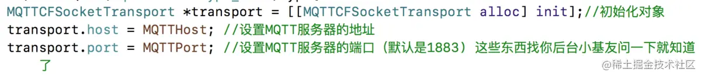

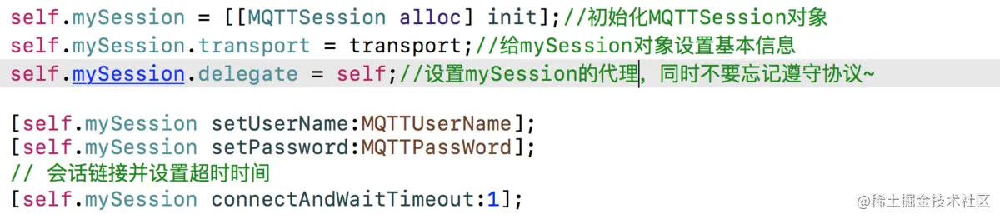

1. 最后订阅主题，这个地方看了很多人写的博客，假设你的主题很多比如5个,10个，使用线程处理，这样也是可以的，但是不是最优化的方式，后面会详细说明，对了mqtt是可以同时订阅多个主题的，很多资料都未说明.

这个地方用了枚举，主要是为了判断订阅主题，来处理回调的数据

//注意:订阅主题不能放到子线程进行,否则block不会回调

第四步：实现Session代理方法，处理数据

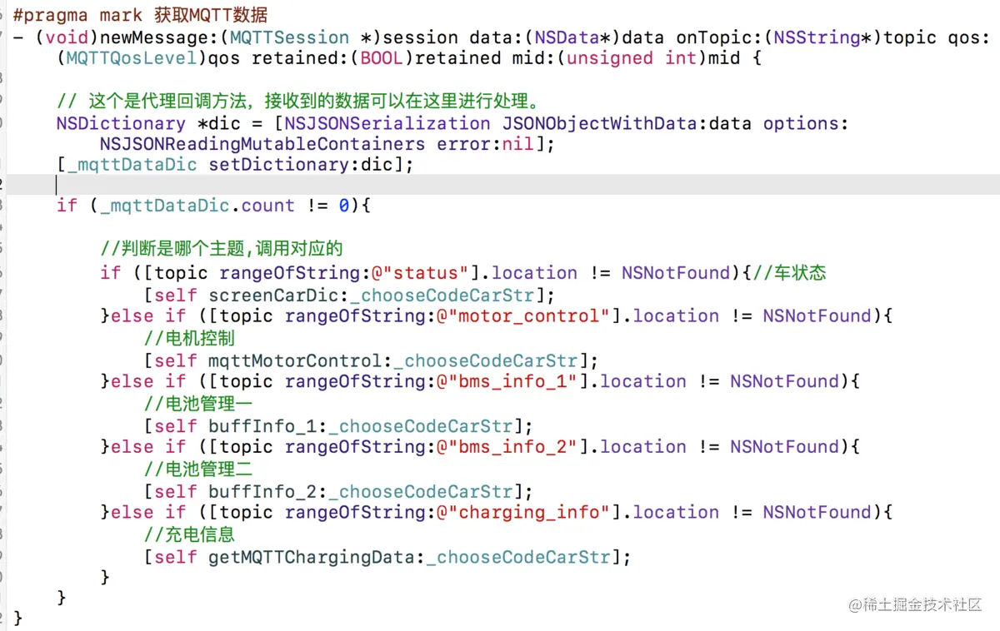

在代理方法中，就可以得到对应的数据，在这里说明一下

1.如果你订阅的主题只有一个，那么你不判断也是可以的，但是如果有多个主题，你需要判断，返回的哪个对应的主题，然后才能处理数据。

*2.* **你订阅主题假如是这样的 *@* “ *$IOT/haha/datapoint/motor_control*” **，那么在处理数据时，你判断“\*motor_control\*”字符串就可以找到对应的数据 \*,\* 判断最后的参数就行，看截图就明白了 \*.\***

**1.先说常用的属性，如果你一直把mqtt开着，你不处理，那么mqtt一直会有数据返回，我这边就是1秒一次，然后一堆数据....**

在刚开始的时候，初始化了 MQTTSession 的对象，看截图

[self.mySession disconnect] 断开连接 对应的就是 [self.mySession connect] 重新连接 

如果不需要mqtt了，记得close，不然mqtt还会返回数据.

当然这个截图，只是全部举例说明，如果不用mqtt直接，close就搞定,不需要写这么多.

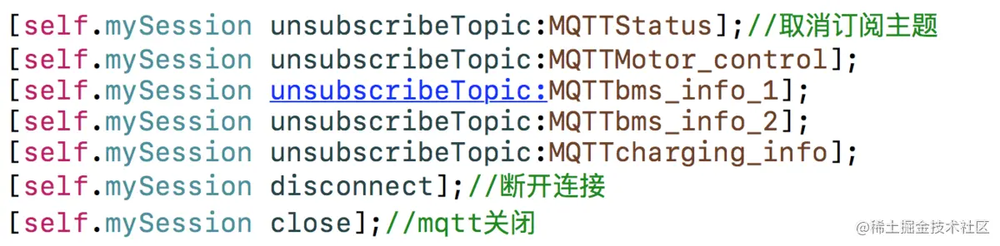

2.在正常情况下，你的mqtt成功订阅了主题，那么它会一直在监听服务器是否有数据返回,但是有的时候嘛，你会遇到下面这中情况,mqtt停止了，当然排除你自己 close的情况外.

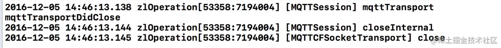

这种情况就很坑爹啦，你用mqtt的目的是啥，就是要实时监控嘛。。。。

在我查询的资料中有几种解释：

前提是你家的服务器一直在发送数据，而不是停掉了

2.1 你的clientID，没有设置，简单说明,你有一个账号是老王，那么你登录了，你的同事也登录了，这个时候,mqtt会自动掉线。

self.mySession.clientId 有这个属性,我咨询过后台，说移动端要设置，设置成功就可以避免，但是如果你用的是，MQTTClient 这个，完全不用，因为别人已经处理好了，可以自己点击进去看看,那么如果你用的是其他的第三方，clientId需要取**随机数**，不能相同.

2.2 碰到上面这个问题咋办呢，**MQTTClient 没有断线重连的机制**，也可能是我没找到，哪位小伙伴看到了也麻烦告诉我一声.

这个时候，你需要监听消息的状态，就可以处理了，来看看，**self.mySession.status**的值


在上面也写到了，如果你使用disconnect\connect，那么消息的状态最终都会输出第五个MQTTSessionStatusClosed.

在上面也写到了，如果你使用disconnect\connect，那么消息的状态最终都会输出第五个MQTTSessionStatusClosed.

2.3 介绍两种监听方法:

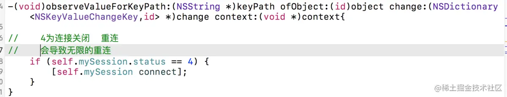

2.3.2 目前我在用就是定时器,用定时器处理消息状态

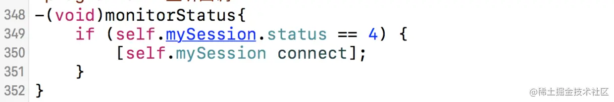

好处就是，离开页面的时候，mqtt关闭，定时器也关闭，不会导致kvo那种情况出现,坏处暂时没发现.

这样就可以让mqtt一只处于监控的状态下了.

**3.关于MQTT一次性订阅多个主题，每个mqtt框架都可以。**

上面我写的主题格式是这样的

//主题格式      @“$IOT/haha/datapoint/motor_control”

**现在你只需要把主题的URL  改成这样  @"$IOT/haha/#"**

**MQTT主题(Topic)支持’+’, ‘#’的通配符，’+’通配一个层级，’#’通配多个层级(必须在末尾)**

**解释一下，#表示，haha下面的所有主题，假如你有10个主题，你这样就可以一次性订阅完成，然后你在返回的数据中，判断对应的主题处理数据就可以了.**

**4.最后说一个，MQTT超时时间设置的问题.**

```objective-c
dispatch_async(dispatch_get_main_queue(), ^{

  // [self.mqttSession subscribeTopic:_topic];

 [self.mqttSession subscribeToTopic:_topic atLevel:MQTTQosLevelAtLeastOnce];

});

  
```

MQTT在网络情况不太好/接收不到服务器数据时，容易导致线程卡住，你懂得，什么都不能点了，建议把这里的时间设置小一点.

```objective-c
[self.mySession connectAndWaitTimeout:1];
```

5,使用MQTTClient的SDK时,为了离线能获取未推送的消息, 我设置了

clean:false ,结果导致App挂起一段时间后,使用同样的clientID再去获取推送时, (App重新唤起,重新连接,但就是收不到推送).

设置clean:true 则问题解决.

不知是否后端配置的代码是否存在问题,如果收不到推送,可以先尝试clean掉session.方便排除问题

6,App多次退出登录 再登陆以后, MQTT推送的回调回调多次

2018-01-26 17:46:43.636585+0800 sandbao[3917:1696336] [MQTTSession] checkDup f974c1662eed04a4066deb33c61cca12 @1516960004

**后来的解决办法是**

```objective-c
/**
 关闭MQTT
 */
- (void)closeMQTT{
    //避免删除kvo异常
    @try{
        //清除kvo监听
        [self.manager removeObserver:self forKeyPath:@"state"];
    }
    @catch(NSException *exception){
    }
    //关闭连接 - 触发监听(有可能关成功,测试出有关失败的可能)
    [self.manager disconnect];
}
```

7,**在关闭MQTT连接的时候,不要clean掉 self.manager = nil;**

**而是在App重新连接的时候, 替换session的clientID**

```objective-c
self.manager.session.clientId = clientID;**

[self.manager connectToLast];**
```

8,我们在使用MQTT的时候，在设置客户端参数的时候设置的自动重连属性，但是断开重连后无法订阅断开之前订阅的消息。

在设置MQTT客户端参数配置的时候记得设置不要清除Session即可

```objective-c
/**
 * MQTT连接参数设置
 */
private MqttConnectOptions mqttConnectOptions(String userName, String passWord) throws MqttException {
    mqttClient = new MqttClient(HOST, clientId, new MemoryPersistence());
    MqttConnectOptions options = new MqttConnectOptions();
    options.setUserName(userName);
    options.setPassword(passWord.toCharArray());
    options.setConnectionTimeout(10);///默认：30
    options.setAutomaticReconnect(true);//默认：false
    options.setCleanSession(false);//默认：true
    //options.setKeepAliveInterval(20);//默认：60
    return options;
}
```

设置AutomaticReconnect(true)和CleanSession(false)，这样MQTT客户端在断开重连后还能继续收到之前的消息

## 3.使用苹果内购支付失败怎么处理（支付漏单怎么处理）

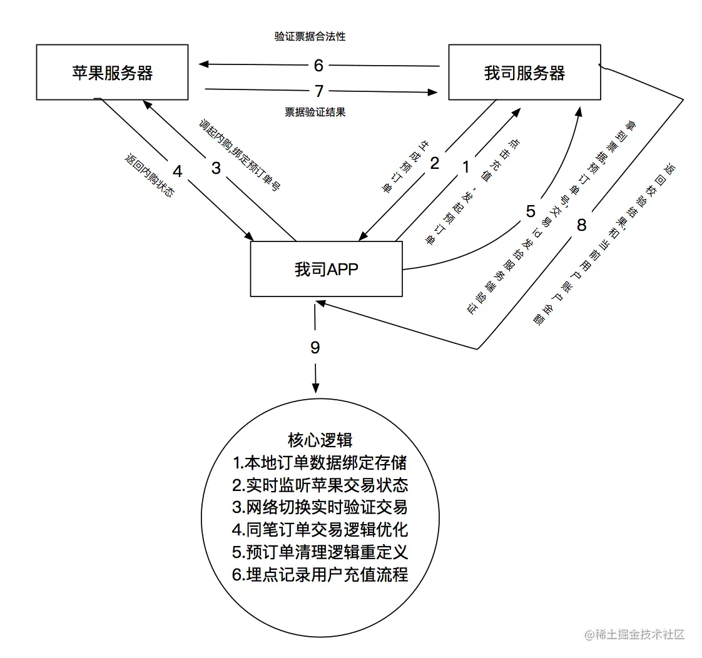

**漏单常见原因**

- 1.票据未成功上传给自己服务器,(网络等原因)就已经结束交易;
- 2.未启动APP时实时监听是否有交易未完成,付款后因用户主动杀死APP时再次启动未监听到状态导致漏单;
- 3.用户绑定支付宝,银联等其他情况,第一次充值时.苹果检测用户没钱,状态变为交易失败,然后去支付宝等页面绑定,绑定成功后交易重新走交易完成,状态变成交易成功,处理交易失败时你是否删除了预订单并结束交易.导致服务端验证的参数缺少.验证失败.导致漏单.

iOS的内购大致上分为两种：1，内置模式流程

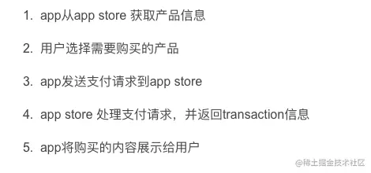

2 服务器模式流程

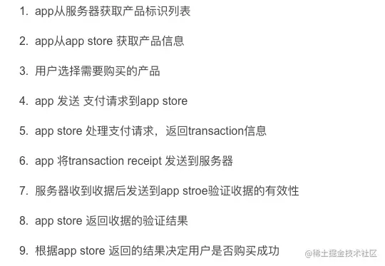

（两种模块的区别，请自行百度）本人这里和后台对接以后，采用的是第二种模式。第一个版本上线以后，基本没有什么问题，可是到后来就慢慢的出现，用户明明就付款成功了，但是我们的后台服务器没有改变对应的余额给用户。这就导致被投诉。没有办法，就只有自己加条件，减少这种情况的出现。具体做法，见代码

第五步：将后台给的校验接口，进行二次调用。第一次调用，让后台将教育凭证上传到服务器保存起来。

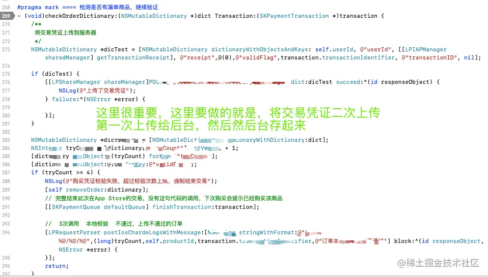

第六步：第二次调用的时候，对交易凭证进行对比，如果凭证一样，那么就移除凭证。如果不一样或者服务器请求超时，那么这个凭证就会被保留下来。当再次调起APP的时候，内购的漏单校验代理会再次去检测本地是否还有未完成的订单，如果有那么就执行，这样用户对于的余额就对了。

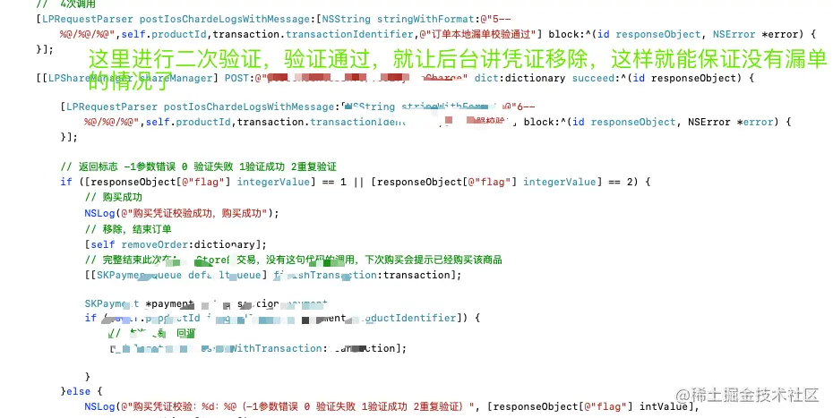

最后在推荐一个比较机械化的办法，就是对内购流程进行埋点处理。用用户名和订单号加时间戳的办法去记录每一笔订单，如果出现了漏单的情况，这个日志记录就可以去查询用户是否付款成功，但是可用余额又没有到账的情况。查询以后，叫后台去人为的修改数据即可。

## 4.有了解过音视频解码吗？


## 5.rxswift熟悉吗？


## 6.同样的代码一个封装成静态库一个是oc源码组成两个APP同时上架苹果会不会判断是一样的

一样的

## 7.上架碰到苹果4.3问题的怎么处理

1、4.3一般会有2种情况，想要快速解决就得弄清楚自己的属于哪一种情况

（1）代码相似（一般会被机审直接打回）

（2）应用与提交到App Store的其他应用相同的功能集（一般是人审4.3）;

针对上面的2种回复去辨别属于哪一种情况。还有一个方式是可以查看自己APP进入审核的时间和被打回来的时间间隔，如果时间太短的可以确定是机审无疑。

针对机审4.3的修改方案

1、选择APP中的其中2个Tab做板式的变更，最好是首页+另一个Tab

2、修改UI、Icon、启动页、五图

3、修改工程名 、修改类名前缀 、文件夹文件名。

4、更换提交账户、IP、打包电脑、测试账户最好也可以更换一下

基本上以上的几个操作可以解决4.3的问题

还有网上还有许多要加垃圾代码或者混淆代码进去的方式在2019年后已经不适用，现在苹果机审已经非常强大，如果有不相信的同学可以亲身体验一下。苹果爸爸会毫不犹豫的给你打回来一个2.3.1。亲测有效，哈哈哈！

人审4.3的修改方案

如果是人工打回来的4.3，只能通过沟通去解决了。之前的解决方式是详细说明每一个页面包含哪一些具体的功能，还有自己的APP和其他APP的优势在哪一些地方。最好可以提供一下APP的使用视频，如果有软著什么的最好也一起丢给苹果吧。

楼主的提审方案就是——有什么资料都丢过去，不管苹果需不需要，以防万一。

## 8.怎么处理没有资质证书导致被苹果下架?


## 9.怎么跟ipa包瘦身？怎么检测swift类有没有使用

1. 从图片资源进行瘦身。
2. 整理项目中用到的第三方库。
3. 代码层面的优化
   - 未使用的代码及时清理
   - 整理重复的代码
4. 编译选项的设置（均在Build Settings里面设置）

对于这一块，不是特别的懂，所以根据网上提供的一些方法，我试了一下，感觉以下方法确实能起到一定的作用，大家可以参考一下。
 **（1） 将Deployment Postprocessing和Strip Linked Product选项 设置为YES。**
 **（2） 将Generate Debug Symbols 默认为YES,设置为NO。**
 **（3） Symbols hidden by default设置为YES**
 **（4） Strip debug symbols during copy 设置为YES**

5. 资源包，符号表，单架构库

动态库封装，将组件化封装成动态库

6. 在workspace中管理多个project的方式实现组件化

新建workspace，新建或者添加项目工程Project，比如叫Test

新建Project比如叫Common，类型选择framework

Build Settings -> Mach-O Type 选择dynamic library动态库，选择静态库也可以，看需要

将通用模块的代码放在Common中，添加需要的系统库，暴露相应的头文件


**App Thinning(苹果自身优化)**

App Thinning 是指 iOS9 以后引入的一项优化，Apple 会尽可能，自动降低分发到具体用户时所需要下载的 App 大小。其主要包含以下三项功能。

**Slicing(应用分割)**

其中架构方面开发者不需要去控制，但是对于资源来说要求图片在 **Asset Catalog** 管理，如果直接放在 Bundle 中，则不会被优化。

关于 Asset Catalog 相关知识点及优化结论可见下文 Assets Catalog 章节。

**Bitcode（中间码）**

Bitcode 是一个编译好的程序的中间表示形式（IR）。上传到 App Store Connect 中的包含 Bitcode 的 App 将会在 App store 中进行链接和编译。苹果会对包含 Bitcode 的二进制 app 进行二次优化，而不需要提交一个新的 app 版本到 app store 中。属于 Apple 内部的优化，但需要注意；

- 全部都要支持。我们所依赖的静态库、动态库、Cocoapods 管理的第三方库，都需要开启 Bitcode。否则打包会编译失败，具体错误会在 Xcode 中指出；
- Crash 定位。开启 Bitcode 后最终生成的可执行文件是 Apple 自动生成的，同时会产生新的符号表文件，所以我们无法使用自己包生成的 DYSM 符号化文件来进行符号化，而是使用使用 Apple 生成的 DYSM 符号化文件；
- Flutter 不支持 Bitcode，如果项目是包含 Flutter 框架的，就无法使用这种方式；
- BitCode 在 iOS 开发中是可选的，在 watchOS 开发中是必须要选择的， Mac OS 是不支持 BitCode 的。

**On-Demand Resources(随需应变资源)**

On-Demand Resource 即一部分图片可以被放置在苹果的服务器上，不随着 App 的下载而下载，直到用户真正进入到某个页面时才下载这些资源文件。

应用场景：相机应用的贴纸或者滤镜、关卡游戏等。

开启方式：Build Settings -> Enable On Demand Resources -> 设置为 YES（默认开启

**去除无用架构**

可以在 Build Setting - Excluded Architectures 项设置排除的架构。

先看一下几种架构的含义：

- 模拟器 32 位处理器测试需要 i386 架构；
- 模拟器 64 位处理器测试需要 x86_64 架构；
- 真机 32 位处理器需要 armv7, 或者 armv7s 架构；
- 真机 64 位处理器需要 arm64 架构。

**结论：理论上只保留 arm64 架构其实就够用了，可以去除 armv6 、 armv7 、 armv7s 三种架构。**

------

**去除符号信息**

可执行文件中的符号是指程序中的所有的变量、类、函数、枚举、变量和地址映射关系，以及一些在调试的时候使用到的用于定位代码在源码中的位置的调试符号，符号和断点定位以及堆栈符号化有很重要的关系。

**Strip Style**

Strip Style 表示的是我们需要去除的符号的类型的选项，其分为三个选择项：

- All Symbols: 去除所有符号，一般是在主工程中开启；
- Non-Global Symbols: 去除一些非全局的 Symbol（保留全局符号，Debug Symbols 同样会被去除），链接时会被重定向的那些符号不会被去除，此选项是静态库 / 动态库的建议选项；
- Debug Symbols: 去除调试符号，去除之后将无法断点调试。

**结论：主工程选择All Symbols，静、动态库选择Non-Global Symbols。**

------

**Strip Linked Product**

并不是所有的符号都是必须的，比如 Debug Map，所以 Xcode 提供给我们 Strip Linked Product 来去除不需要的符号信息 (**Strip Style 中选择的选项相应的符号**），去除了符号信息之后我们就只能使用 dSYM 来进行符号化了，所以需要将 Debug Information Format 修改为 DWARF with dSYM file。

需要注意Strip Linked Product 选项在 Deployment Postprocessing 设置为 YES 的时候才生效，而 Deployment Postprocessing 在 Archive 时不受手动设置的影响，会被强制设置成 YES。

**结论：将Deployment Postprocessing设置为 NO，将Strip Linked Product设置为YES，将Release模式的下的Debug Information Format 修改为 DWARF with dSYM file**

**Mach-O 可执行文件瘦身**

在对 Mach-O 文件进行瘦身优化时，我们可以通过分析 Link Map 文件来给我们一定的数据参考，帮助我们分析 Mach-O 文件的构成。

Link Map 是编译链接时可以生成的一个 txt 文件，它生成目的就是帮助程序员分析包大小。Link Map 记录了每个方法在当前的二进制架构下占据的空间。通过分析 Link Map，我们可以了解每个类甚至每个方法占据了多少安装包空间。

开启 Build setting 中的 Write Link Map File 开关，Xcode 就会生成一份 Link Map 文件。其中生成的 Link Map 文件路径如下：~/Developer/Xcode/DerivedData/项目/Build/Intermediates.noindex/项目.build/Debug-iphonesimulator/项目.build/项目-LinkMap-normal-x86_64.txt

如果直接阅读 Link Map 文件，效率会比较低，也不直观，我们可以使用一些工具帮助我们分析。

**多个可执行文件中去除相同代码**

这里的多个可执行文件一般是指 APP 宿主程序与 Extension 程序，如果 APP 宿主程序与 Extension 程序都依赖同一个静态库库时，就会导致两个可执行文件中都包含相同的代码；个人觉得有两种解决方案：

- 考虑到 Extension 程序相对宿主程序来说功能较小，可尽量使用原生功能，不接入三方库；
- 如果想要接入同一份库，可将该库以动态库的方式引入，最终两个可执行文件会动态链接同一份库，避免了重复代码；

