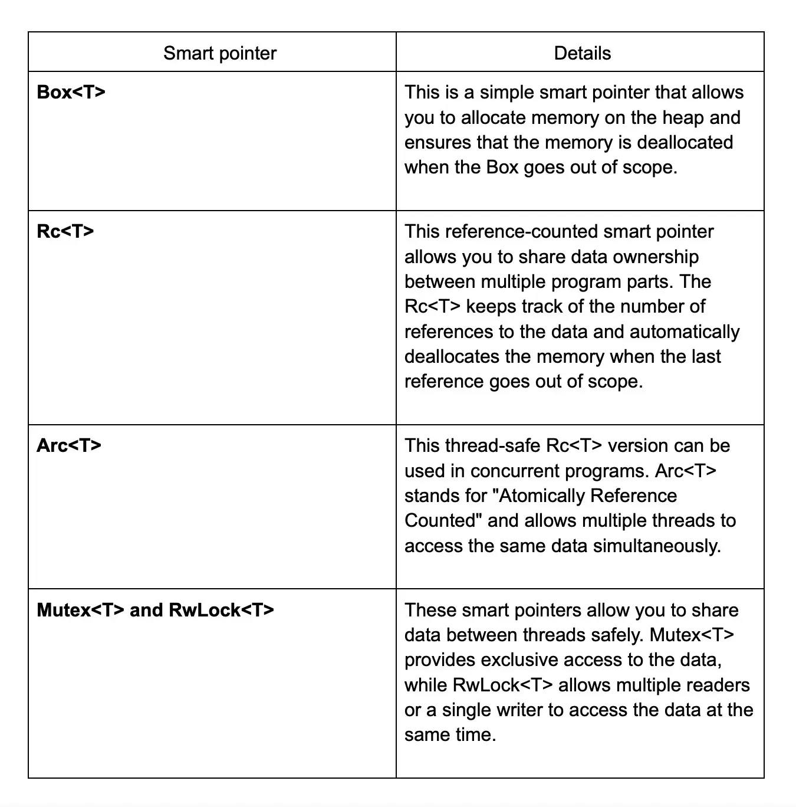
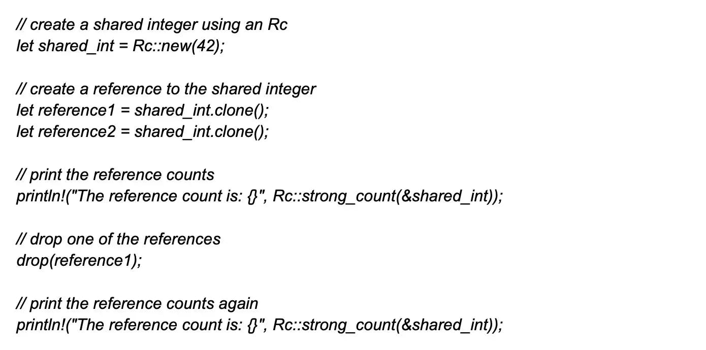

# Rust

[TOC]

## 1. Rust相比其他编程语言有哪些优势？

要理解优势，通常会与类似编程语言进行对比。例如：

> [比较内容] 与C++相比，Rust在安全设计上表现优异——C++难以保护其自身抽象和程序员自定义抽象，而错误发生时会导致未定义行为。Rust通过内存安全机制隔离这些问题。与Java相比，虽然Java通过垃圾回收（GC）管理内存，但其速度仍无法与C系语言比拟，而Rust采用自动内存管理机制在速度与安全性间取得平衡。相较于Python，Rust的表达式体系允许更优雅的代码组合。

关键优势总结为：极速执行效率、线程安全保证、防止段错误、内存安全机制、现代化语法设计。

## 2. Rust的垃圾回收机制如何运作？

采用静态垃圾回收机制（static garbage collector），基于所有权（ownership）模型实现自动内存管理。通过编译时所有权规则检查，自动回收不再使用的内存区域，无需运行时垃圾回收线程。

> [技术细节] 不同于传统垃圾回收（GC），Rust的核心机制是所有权规则（ownership rules）结合生命周期（lifetimes）检查，在编译阶段即可保证内存安全，彻底消除悬垂指针（dangling pointers）等问题。

## 3. 如何在Rust中获取命令行参数？

使用标准库提供的迭代器接口：

```rust
use std::env;

fn main() {
    let args: Vec<String> = env::args().collect();
    println!("{:?}", args);
}
```

替代方案包括`std::env::args_os`处理非UTF-8参数，核心路径是遍历`env::args()`返回的迭代器。

## 4. 如何描述Rust与其他编程语言的差异？

相比其他语言的核心区别：

- 速度对标C/C++但消除内存安全问题
- 无需垃圾回收实现内存安全（与Java/Golang对比）
- 模式匹配（pattern matching）和代数数据类型（ADT）提升代码可靠性
- 零成本抽象（zero-cost abstractions）提供高级语法不影响运行效率
- Cargo生态工具链现代化程度远超传统语言

> [对比实例] 例如WebAssembly领域，Rust的编译产物体积和性能优于TypeScript，而在系统编程领域其安全性优于C，开发效率优于C++。

## 5. Rust有哪些关键特性？

核心语言特性包括：

- 移动语义（move semantics）
- 极小运行时（minimal runtime）
- 高效C绑定（C FFI）
- 特质泛型（trait-based generics）
- 零成本抽象（zero cost abstraction）
- 模式匹配（pattern matching）
- 类型推断（type inference）
- 无畏并发（fearless concurrency）

## 6. Rust是否保证尾调用优化（TCO）？

不保证尾调用优化。即使标准库函数也不保证TCO实现，编译器会根据优化级别决定是否应用该优化。需手动优化递归为迭代时，建议使用循环结构而非依赖编译器优化。

## 7. Rust包含移动构造函数吗？

通过`memcpy`实现值移动，所有未实现`Copy` trait的类型都使用移动语义（move semantics）。例如：

```rust
let s1 = String::from("hello");
let s2 = s1;  // s1被移动，所有权转移给s2
// println!("{}", s1);  // 编译错误：值已被移动
```

## 8. 如何编写运行Rust程序？

1. 创建`main.rs`文件：

```rust
fn main() {
    println!("Hello, Rust!");
}
```

2. 编译执行：

```bash
rustc main.rs  # 编译
./main         # 运行（Linux/macOS）
```

> [开发建议] 实际开发应使用Cargo管理项目，而非直接调用rustc

## 9. Cargo在Rust中的角色是什么？

Rust官方构建系统与包管理器，主要职能：

1. 项目管理：创建新项目(`cargo new`)、构建(`cargo build`)、测试(`cargo test`)
2. 依赖管理：解析`Cargo.toml`下载crates.io的依赖项
3. 版本锁定：生成`Cargo.lock`精确记录依赖版本
4. 跨平台编译：管理交叉编译（cross-compilation）工具链

## 10. Cargo.lock文件的作用？

通过`cargo build`自动生成，记录精确依赖版本确保可重复构建。例如指定依赖`serde = "1.0"`时，Cargo.lock将锁定到具体小版本如1.0.159，避免版本漂移导致构建问题。

## 11. 在Rust中应选用哪种字符串类型？

首选`&str`作为函数参数接收字符串切片（string slice），`String`作为可修改的堆分配字符串。两者关系类似于：

```rust
let s: String = String::from("heap string");
let slice: &str = &s[..];  // 创建切片引用
```

> [内存细节] `String`拥有堆内存，`&str`为借用（borrow），`str`为动态大小类型（DST）

## 12. Rust比C/C++更安全吗？

在内存安全方面具备显著优势：

- 编译时检查空指针(null pointer)和悬垂指针
- 所有权系统（ownership system）保证单所有权
- 借用检查器（borrow checker）强制执行读写锁规则
- 无数据竞争（data race）的并发模型
- 禁止裸指针（raw pointer）算术运算，除非在`unsafe`块中

## 13. 如何将文件读取为字符串？

使用`std::fs::read_to_string`函数：

```rust
use std::fs;

fn main() -> Result<(), std::io::Error> {
    let content = fs::read_to_string("example.txt")?;
    println!("{}", content);
    Ok(())
}
```

内部通过`Read::read_to_string`方法实现，自动处理文件打开/关闭和缓冲区分配。

## 14. 如何实现异步I/O处理？

主流选择包括：

- **tokio**：最流行的异步运行时（async runtime），提供TCP/UDP等网络原语
- **async-std**：标准库风格的异步实现
- **mio**：底层非阻塞I/O库
- **smol**：轻量级执行器

示例使用tokio：

```rust
use tokio::fs::File;
use tokio::io::AsyncReadExt;

#[tokio::main]
async fn main() -> Result<(), Box<dyn std::error::Error>> {
    let mut file = File::open("test.txt").await?;
    let mut contents = vec![];
    file.read_to_end(&mut contents).await?;
    Ok(())
}
```

## 15. Rust如何促进代码复用？

通过模块系统（module system）实现：

1. 使用`mod`关键字组织代码模块
2. 使用`pub`控制访问权限
3. Crate作为编译单元和分发单位
4. Trait定义共享接口行为
5. 条件编译（conditional compilation）支持跨平台复用

## 16. `cargo new`命令的作用？

创建新Rust项目结构：

```bash
cargo new my_project --bin  # 创建可执行项目
cargo new my_lib --lib      # 创建库项目
```

生成标准目录结构：

```
my_project/
├── Cargo.toml
└── src/
    └── main.rs
```

## 17. 如何高效读取文件？

有效方法及其使用场景：

1. `File::open`配合`Read::read`：原始字节流读取
2. `BufReader::new(file).read_line`：带缓冲的行读取
3. `fs::read_to_end`：一次性加载整个文件到字节数组
4. `mmap`系统调用：内存映射大文件处理

> [效能对比] 对于大文件，内存映射（memory mapping）的效率最高，而`read_to_string`适合中小型文件。

## 18. 方法声明中self、&self、&mut self的区别？

所有权传递规则：

- **&self**：不可变借用（immutable borrow），只读访问方法
- **&mut self**：可变借用（mutable borrow），可修改实例数据
- **self**：获取所有权（ownership transfer），调用后原实例失效

示例：

```rust
impl MyStruct {
    fn ref_method(&self) {}     // 只读
    fn mut_method(&mut self) {} // 可修改
    fn consume_method(self) {}  // 获取所有权
}
```

## 19. unwrap()函数的用途与风险？

用于快速提取`Option/Result`类型的值：

```rust
let x: Option<i32> = Some(5);
let y = x.unwrap();  // 如果是None则panic!
```

> [使用注意] 生产代码中建议使用模式匹配或`expect()`代替，慎用unwrap以防潜在panic

## 20. 如何调试Rust程序？

调试方式：

1. GDB/LLDB命令式调试：

```bash
rust-gdb target/debug/my_program
```

2. IDE集成调试（VSCode + CodeLLDB）
3. 打印调试：`dbg!`宏快速输出变量值
4. 日志系统：使用`log`crate配合env_logger

## 21. Rust错误处理机制？

采用分层处理策略：

1. **可恢复错误**：使用`Result<T, E>`类型，通过`?`操作符传播错误
2. **不可恢复错误**：`panic!`宏终止线程，可通过`catch_unwind`捕获（非绝对可靠）
3. **错误类型转换**：From trait实现错误类型自动转换

典型错误处理模式：

```rust
use std::fs::File;

fn read_file() -> Result<String, std::io::Error> {
    let mut file = File::open("file.txt")?;
    let mut s = String::new();
    file.read_to_string(&mut s)?;
    Ok(s)
}
```

## 22. 能使用Rust编写操作系统吗？

完全可行且已有多个实例：

- **Redox OS**：微内核架构操作系统
- **Theseus OS**：Rust编写的实验性OS
- **Google Fuchsia**：部分内核模块使用Rust
关键技术点：

1. 禁用标准库（no_std模式）
2. 直接操作硬件（MMU，中断处理）
3. 自定义内存分配器
4. 裸机（bare metal）编程支持

## 23. 如何实现平台特定行为？

使用条件编译属性（conditional compilation）：

```rust
#[cfg(target_os = "linux")]
fn linux_specific() {}

#[cfg(target_pointer_width = "64")]
fn for_64bit() {}
```

常用条件属性：

- `target_os`：linux/windows/macos
- `target_arch`：x86_64/arm
- `target_family`：unix/windows
- `target_endian`：big/little

## 24. Rust支持交叉编译吗？

完全支持且工具链成熟。例如编译ARM目标：

1. 添加目标支持：

```bash
rustup target add arm-unknown-linux-gnueabihf
```

2. 使用Cargo交叉编译：

```bash
cargo build --target=arm-unknown-linux-gnueabihf
```

配置`.cargo/config`设置链接器等工具链参数。

## 25. Deref强制转换是什么？

自动解引用转换规则，允许类型自动转换以获得目标引用。典型转换链：

1. **&Box<T> → &T**

```rust
let boxed = Box::new(5);
let ref_num: &i32 = &boxed;  // 自动解引用
```

2. **&String → &str**：字符串类型转换
3. **&Vec<T> → &[T]**：向量转切片
4. 智能指针（Arc/Rc）到内部数据的转换

## 26. 解释Rust中的所有权概念？

所有权系统的三大规则：

1. 每个值有且仅有一个所有者（owner）
2. 值在离开作用域时自动释放（drop）
3. 所有权可通过移动（move）转移，不可隐式复制

典型场景：

```rust
let s1 = String::from("hello");
let s2 = s1;   // s1所有权转移给s2

// println!("{}", s1); // 编译错误：值的所有权已转移
```

内存安全通过编译时的借用检查（borrow checker）实现，无需垃圾回收。

## 27. Rust支持哪些平台？

Rust支持以下多种平台：

- Linux
- macOS
- Windows
- iOS
- Android
- FreeBSD
- NetBSD
- OpenBSD
- Solaris
- WebAssembly（Web汇编）

> [深入理解] 该问题需要展现对Rust跨平台能力的了解。特别注意提到的WebAssembly支持体现了其在前端和跨平台场景的应用前景。  
Rust具有强大的交叉编译支持，允许开发者在单一开发环境中为多种目标平台构建应用

## 28. 安装Rust的步骤是什么？

安装过程分为几个简单步骤：首先打开终端（Linux/macOS）或命令提示符（Windows）。接着运行官方提供的安装脚本命令：

```bash
curl --proto '=https' --tlsv1.2 -sSf https://sh.rustup.rs | sh
```

Windows用户也可直接下载执行rustup-init.exe文件。安装脚本启动后会提示操作选项，按"1"选择默认安装即可自动配置开发环境。整个过程耗时约数分钟，完成时系统会提示环境变量配置建议。最后通过`rustc --version`验证安装是否成功

## 29. 如何在Rust中声明全局变量？

使用`static`关键字可声明全局变量，该变量具有静态生命周期且必须初始化常量表达式。典型示例：

```rust
static MAX_VALUE: i32 = 100_000;
static mut COUNTER: u32 = 0; // 需使用unsafe块操作
```

> [特别注意] 需要解释为何可变全局变量采用`unsafe`：由于多个线程可能同时访问修改数据，必须显式声明unsafe来强调开发者的同步责任

## 30. Rust有哪些局限性？

主要限制可从四个维度分析：

1. **学习曲线**：源于所有权系统和借用检查器等新颖机制，对新手特别是无系统编程背景者难度较大
2. **内存约束**：虽然保证内存安全，但严格的ownership规则有时会限制灵活编码
3. **编译速度**：相比Go等语言更长的编译时间影响开发迭代效率
4. **生态成熟度**：标准库虽完善但第三方库数量和成熟度与Python等仍有差距

> [考察内容] 此处需展示对语言生态发展现状的客观认知，可补充说明Rust在Web服务、嵌入式等领域的生态建设进展

## 31. 如何用Rust编写GUI应用程序？

常用GUI解决方案包括：

- **GTK-rs**：跨平台图形库，支持Linux/Windows/macOS
- **Druid**：专注于数据可视化的原生Rust框架
- **Slint**：声明式UI框架，支持嵌入式系统
- **Tauri**：基于Web技术的轻量级桌面应用方案

> [应用场景] 选择Tauri时可提及它与Electron的性能对比优势，例如更小的内存占用和更快的启动时间

## 32. Rust的所有权规则有哪些？

核心规则体系构成Rust内存安全的基石：

1. 每个值有且仅有一个所有者的变量
2. 当所有者离开作用域时自动销毁对应值
3. 值被移动后原所有者不可用（所有权转移）
4. 通过引用（不可变/可变）实现临时访问，需遵循借用规则防止数据竞争

## 33. 能否完全用Rust编写操作系统？

完全可行。现有代表性案例包括：

- Redox OS：微内核架构的类Unix系统
- Theseus OS：专注于内存安全的实验性系统
- Tock OS：面向嵌入式设备的实时操作系统

> [实现难点] 需使用`no_std`模式避开标准库，直接操作硬件抽象层（HAL）和实现内存管理单元（MMU）

## 34. Rust中的借用是什么？

借用机制允许通过引用的方式临时访问数据而不转移所有权。分为两种形式：

1. 不可变借用（&T）：允许同时存在多个只读访问
2. 可变借用（&mut T）：单一独占式可修改访问

典型错误场景：

```rust
let mut x = 5;
let r1 = &mut x;
let r2 = &mut x; // 编译错误：不可同时存在多个可变引用
```

## 35. Rust中的生命周期是什么？

生命周期标注（lifetime annotations）是描述引用有效性范围的语法机制，防止悬垂引用。典型用法：

```rust
fn longest<'a>(s1: &'a str, s2: &'a str) -> &'a str {
    if s1.len() > s2.len() { s1 } else { s2 }
}
```

> [编译原理] 编译器通过生命周期消除规则自动推断大部分场景，开发者仅需在复杂场景显式标注

## 36. Rust中的模块是什么？

模块系统的三个层级结构：

1. **crate**：编译单元，可生成lib或exe
2. **mod**：使用`mod`划分的逻辑单元
3. **分文件管理**：通过目录和mod.rs组织多层嵌套

可见性控制关键点：

- `pub`控制项的访问权限
- `use`进行路径引入
- `super`/`self`实现相对路径访问

## 37. Rust中的模式匹配是什么？

`match`表达式构成模式匹配的核心，具有以下特征：

- 必须穷尽所有可能模式
- 支持模式解构（元组/结构体/枚举）
- 可用通配符`_`忽略不需要的值
- 配合`if`添加卫语句（guard）增强逻辑控制

示例：

```rust
match value {
    Some(x) if x > 10 => println!("超过阈值"),
    Some(_) => println!("有效值"),
    None => println!("空值"),
}
```

## 38. 相比C/C++，Rust更安全吗？

安全性的三个核心保证：

1. **编译时内存安全**：通过所有权系统零成本消除数据竞争和越界访问
2. **类型系统**：强类型+代数数据类型减少逻辑错误
3. **无数据竞争**：借用检查器强制线程同步要求

> [对比分析] 虽然C/C++手动内存管理可以获得极致性能，但也需要开发者承担更多内存泄漏和悬垂指针的风险。Rust在保证相似性能的前提下，通过类型系统将内存错误消除在编译阶段

## 39. Rust中的引用（Reference）是什么？

引用本质上是一个指针，指向某个值但不拥有它。允许父函数保持原变量的作用域，同时子函数可以使用该数据。这意味着程序的多个部分可以访问同一数据，无需进行所有权转移或拷贝。

> [考察点] 这里需要强调引用与所有权的分离特性，以及无拷贝访问的优势

## 40. Rust中的引用类型有哪些？

两种引用类型：不可变引用（immutable reference）和可变引用（mutable reference）

不可变引用通过`&`符号创建，提供对值的只读访问，禁止通过该引用修改原始值。可变引用使用`&mut`创建，允许通过引用修改原始数据。这个区别是Rust内存安全的核心机制，防止数据竞争的编译期检查就基于此规则。

> [注意点] 需说明可变与非可变引用的互斥访问规则：同一作用域内只能有一个可变引用，或同时存在多个不可变引用

## 41. Rust如何促进代码重用？

主要通过编译器的所有权模型和Cargo生态实现。所有权机制消除未管理指针和内存泄漏，使模块开发更安全可靠。Cargo包管理器让代码共享变得简单，官方crates.io生态提供大量可重用库，支持依赖管理与版本控制。

> [示例场景] 如在项目中使用`serde`进行序列化时，仅需在Cargo.toml添加依赖项即可调用成熟的标准化功能

## 42. Rust中的unwrap()方法是做什么的？

unwrap()用于从Option或Result类型中直接取出内部值。当用于Option时，若为None会panic；用于Result时，若为Err也会panic。这种直取操作适合于快速开发原型或确定操作必然成功的场景。

```rust
let x: Option<i32> = Some(5);
println!("{}", x.unwrap()); // 输出5

let y: Result<i32, &str> = Ok(10);
println!("{}", y.unwrap()); // 输出10
```

> [危险警告] 如果在可能失败的场景滥用unwrap，会导致程序崩溃。生产代码推荐使用模式匹配或`expect()`

## 43. Rust中的结构体（struct）是什么？

结构体是将相关数据字段组合成单一类型的复合数据类型。与C的结构体类似，但Rust的struct可以定义方法但无继承特性。示例定义：

```rust
struct User {
    username: String,
    email: String,
    sign_in_count: u64,
    active: bool,
}
```

> [对比说明] 不同于传统OOP的类，Rust的struct仅包含数据，行为通过impl块单独定义

## 44. Option和Result类型在Rust中有何区别？

两者都表示可能失败的操作，但适用场景不同：

- Option<T>处理存在性判断，表示值可能有（Some）或没有（None），比如查询集合时元素是否存在
- Result<T, E>处理操作结果，可能是成功值（Ok）或带错误信息的失败（Err），比如文件读取可能因权限问题失败

```rust
// Option示例：字符串查找子串
fn find(haystack: &str, needle: char) -> Option<usize> {
    haystack.find(needle)
}

// Result示例：解析数字
fn parse_num(s: &str) -> Result<i32, ParseIntError> {
    s.parse()
}
```

## 45. 什么是Rust的过程宏（procedural macro）？

过程宏是在编译期间操作抽象语法树（AST）生成代码的元编程工具。分为三种类型：自定义派生（Derive）、属性式（Attribute-like）、函数式（Function-like）。示例创建一个简单的派生宏：

```rust
#[proc_macro_derive(HelloMacro)]
pub fn hello_macro_derive(input: TokenStream) -> TokenStream {
    // 解析输入并生成代码
    impl_macro(&parse_macro_input!(input as DeriveInput))
}
```

> [应用场景] 常见于序列化库（如serde的#[derive(Serialize)]），或自动实现trait时减少样板代码

## 46. Rust中的数据竞争（data race）指什么？

数据竞争发生在多线程环境下，当两个或多个线程同时访问同一内存位置，其中至少有一个是写操作，且未做同步处理时。Rust的类型系统通过所有权规则在编译器阻止此类情况：要么允许多个不可变引用，要么唯一可变引用，同时强制线程间数据传递使用同步原语（如Mutex）。

> [安全机制] 这是Rust无需垃圾回收即可保证内存安全的核心特性，也是编译器严格检查引用规则的直接成果

## 47. Rust如何确保内存安全？

采用编译期检查机制达成：

1. 所有权系统（Ownership）强制每个值有唯一所有者，作用域结束自动释放
2. 借用检查（Borrow checker）跟踪引用生命周期，防止悬垂指针
3. 类型系统严格检查引用有效性，确保：
   - 不可变引用存在时禁止可变引用
   - 所有引用必须有效（无空指针）

```rust
fn main() {
    let s = String::from("hello"); // s是所有者
    let len = calculate_length(&s); // 通过不可变借用访问
    println!("{} {}", s, len); // 有效：借用后所有权未转移
}

fn calculate_length(s: &String) -> usize { // 引用参数
    s.len()
} // s离开作用域但未拥有数据，不触发释放
```

## 48. Rust中的枚举（enum）是什么？

枚举允许开发者定义包含多个可能变体的类型，每个变体可携带不同类型的关联数据。相比其他语言的enum，Rust的枚举更强大，例如Option和Result都是标准库中的枚举实现：

```rust
enum WebEvent {
    PageLoad,                      // 无数据变体
    KeyPress(char),                // 携带基本类型
    Click { x: i64, y: i64 },      // 包含匿名结构体
}
```

> [高级特性] 配合模式匹配可构建类型安全的有限状态机，是Rust错误处理的核心机制

## 49. Rust中的条件编译如何实现？

通过`#[cfg]`属性在不同编译条件下包含或排除代码块。常用条件包括target_os（目标系统）、feature（功能开关）、test（测试模式）等：

```rust
#[cfg(target_os = "linux")]
fn get_os_info() {
    println!("Running on Linux!");
}

#[cfg(test)]
mod tests {
    #[test]
    fn it_works() {
        assert_eq!(2 + 2, 4);
    }
}
```

> [实用技巧] 可通过`cargo build --features "feature_name"`启用特定功能的条件编译

## 50. 构建脚本（build script）在Rust中有什么作用？

build.rs文件在编译前执行，主要用于：

- 生成代码（如协议缓冲区编译）
- 检测系统环境（如查找C库路径）
- 编译C/C++子模块
- 设置环境变量（如版本信息）

典型场景是在嵌入式开发中，通过构建脚本生成特定硬件平台的绑定代码。

## 51. Rust中的迭代器（iterator）是什么？

迭代器提供按需生成元素序列的抽象，通过实现Iterator trait来定义遍历逻辑。标准库集合都提供迭代器支持，可通过`iter()`、`into_iter()`、`iter_mut()`获取不同所有权类型的迭代器：

```rust
let v = vec![1, 2, 3];
let mut iter = v.iter(); // 获取不可变引用迭代器

assert_eq!(iter.next(), Some(&1));
assert_eq!(iter.next(), Some(&2));
```

> [惰性求值] 迭代器链式调用（如map/filter）直到消费操作（如collect）才真正执行

## 52. Rust中的通道（channel）是什么？

通道是线程间通信的消息传递机制，基于多生产者单消费者（mpsc）模式。标准库的实现保证发送和接收操作的原子性与安全性：

```rust
use std::sync::mpsc;
use std::thread;

let (tx, rx) = mpsc::channel();

thread::spawn(move || {
    tx.send(42).unwrap();
});

let received = rx.recv().unwrap();
println!("Got: {}", received); // 输出Got: 42
```

> [并发模型] 相比共享内存方案，通道强制消息传递的隔离性，减少数据竞争风险

## 53. 对Rust中的cargo.toml文件有哪些了解？

Cargo.toml文件是Rust包管理工具Cargo使用的配置文件，采用TOML（Tom's Obvious Minimal Language）格式编写。该文件定义了项目元信息，包括项目名称、版本、构建设置和依赖关系，是管理Rust项目的核心配置文件。

> [深入理解] 这里考察对Rust生态基础工具的认知。通过这个文件可以实现依赖版本控制、特性开关设置和构建脚本管理，极大简化了项目的共享与协作流程。

实际使用中，开发者在新增依赖时只需在`[dependencies]`节添加条目，例如：

```toml
[dependencies]
serde = "1.0"
```

## 54. 什么是Rust中的声明式宏？

声明式宏（declarative macro）允许开发者定义代码模式匹配规则，通过`macro_rules!`进行创建。这类宏通过模式匹配和代码模板实现元编程，常用于创建重复代码的抽象模板。

基本结构示例：

```rust
macro_rules! vec {
    ($($x:expr),*) => { 
        { let mut temp_vec = Vec::new(); $(temp_vec.push($x);)* temp_vec }
    };
}
```

> [考察内容] 重点在于展示对元编程基础和宏扩展机制的理解。每个匹配臂由模式与模板组成，当调用宏时编译器会将匹配到的代码片段填入模板。

## 55. 如何理解函数指针？

函数指针（function pointer）是指向函数入口地址的指针类型。在Rust中可使用`fn`关键字定义，配合指针语法实现延迟执行或动态调用：

```rust
fn add(a: i32, b: i32) -> i32 { a + b }
let func_ptr: fn(i32, i32) -> i32 = add;
assert_eq!(func_ptr(2,3), 5);
```

> [应用场景] 常用于高阶函数参数或状态机设计。与闭包的区别在于不捕获环境变量，且类型系统会严格校验签名匹配。

## 56. 解释Rust中的元组类型？

元组（tuple）是包含多个异构值的复合类型，通过圆括号构造，支持模式解构和索引访问。区别于数组，元组支持存储不同类型的数据：

```rust
let point = (3.14, 42); // (f64, i32)类型
let (x, y) = point;
println!("First element: {}", point.0);
```

> [类型特征] 具有固定的长度和类型顺序，常用于函数多返回值场景。最大支持12个元素的元组解构（通过编译器特殊实现）。

## 57. 说明match表达式的作用机制？

match是Rust的核心模式匹配工具，通过穷尽性检查确保所有可能情况都被处理。执行过程逐臂测试匹配模式，直到找到首个匹配项后执行对应代码块：

```rust
let value = Some(5);
match value {
    Some(n) => println!("Value: {n}"),
    None => println!("No value"),
}
```

> [模式系统] 支持范围模式、守卫条件、绑定变量等高级用法。与if let相比，match更适用于需要处理多种可能情况的场景。

## 58. 结构体(struct)和枚举(enum)的区别是什么？

结构体用于组合相关数据字段，侧重实体建模；枚举则是变体集合，侧重状态表达。语法层面：

```rust
struct Point { x: i32, y: i32 } // 具名字段结构体
enum Message {
    Quit,                      // 无数据变体
    Move { x: i32, y: i32 },   // 类结构体变体
    Write(String),             // 元组式变体
}
```

> [类型系统] 枚举变体实际是不同类型构造器，可携带差异化的关联数据，与结构体组合使用能构建丰富的领域模型。

## 59. Rust中有哪些错误处理机制？

主要错误处理策略分层实现：

**Result类型**用于函数返回可能错误：

```rust
fn read_file() -> Result<String, io::Error> {
    fs::read_to_string("file.txt")
}
```

**Option类型**处理空值情景：

```rust
fn find(haystack: &str, needle: char) -> Option<usize> {
    haystack.find(needle)
}
```

**panic!宏**处理不可恢复错误，触发线程终止。错误处理库如thiserror提供更灵活的错误封装和传播能力。

> [最佳实践] 建议优先使用Result进行显式错误传播，在底层库中定义具体错误类型，通过?操作符简化错误处理流程。

## 60. 标准库在Rust中扮演什么角色？

Rust标准库提供核心功能的跨平台抽象，包含基础类型（Vec、String）、系统接口（文件IO、网络）和并发原语等关键模块。作为语言基础设施，其特性：

- 完全使用safe Rust实现（除少量`unsafe`系统调用）
- 零成本抽象原则贯穿设计
- 提供模块化组织（std::collections等）
- 与语言特性深度整合（如Iterator trait）

## 61. 如何理解Rust的异步编程模型？

基于Future trait实现非阻塞操作，async/await语法糖简化异步代码编写：

```rust
async fn fetch_data() -> Result<String, reqwest::Error> {
    reqwest::get("http://example.com").await?.text().await
}
```

运行时需要搭配executor（如tokio、async-std），通过状态机机制实现高效任务调度。区别于线程模型，异步任务在单个线程内通过协作式调度实现高并发。

## 62. Rust的并发模型有哪些特点？

基于所有权和类型系统的安全并发原语：

- 线程间通信通过通道（mpsc）传递所有权
- 共享状态使用Arc/Mutex等智能指针保护
- Send/Sync trait保证跨线程安全
- Rayon库提供数据并行抽象

示例：

```rust
let data = Arc::new(Mutex::new(0));
let handles: Vec<_> = (0..10).map(|_| {
    let data = Arc::clone(&data);
    thread::spawn(move || {
        let mut num = data.lock().unwrap();
        *num += 1;
    })
}).collect();
```

## 63. Rust中如何进行I/O操作？

通过std::io模块实现标准输入输出，典型操作模式：

```rust
use std::io::{self, Write};

fn write_output() -> io::Result<()> {
    let mut stdout = io::stdout().lock();
    writeln!(stdout, "Processing data...")?;
    Ok(())
}
```

对文件操作采用更符合Rust习惯的Result处理方式：

```rust
let mut file = File::create("output.txt")?;
file.write_all(b"Hello Rust")?;
```

> [性能考虑] 推荐使用BufReader/BufWriter进行缓冲操作，特别在处理大量数据时。

## 64. Rust中的测试框架主要用于什么用途？

测试框架在Rust中为手动测试提供了高效替代方案。它内置的rustc_test框架包含一系列工具用于测试Rust代码，主要通过单元测试系统实现。例如使用#[test]属性定义测试函数，并借助assert_eq!和assert_ne!等断言宏进行结果验证。该框架支持变量计算、自动序列化和类型检查等特性，能够有效提升测试自动化程度。

> [考察重点] 该问题需要展示对测试工具链的理解，重点强调内建设施的使用场景和实际功能，而非单纯列举概念。

## 65. Rust中的文档系统是如何运作的？

Rustdoc作为内置文档系统，支持开发者通过特殊注释生成可浏览的HTML文档。使用三条斜杠///作为文档注释标记，紧贴在需要说明的结构体、函数或模块等元素上方。这些注释支持Markdown格式，并能自动生成API文档网站，极大地简化了代码与文档同步维护的流程。

## 66. Rust如何处理多线程编程？

通过标准库原生支持多线程，std::thread::spawn函数是创建新线程的核心接口。接收闭包作为执行体，例如：

```rust
std::thread::spawn(|| {
    println!("在新线程中执行");
});
```

为保障线程安全，Rust提供互斥锁（Mutex）、信号量（Semaphore）和消息通道（Channel）等同步原语，从语言层面预防数据竞争问题。

## 67. 什么是Rust中的Mutex？

Mutex（互斥锁）作为并发编程的核心同步机制，通过互斥访问确保共享数据安全性。其工作机制是通过锁状态管理，同一时间仅允许单个线程持有锁并操作受保护数据。典型用法示例：

```rust
use std::sync::Mutex;

let counter = Mutex::new(0);
{
    let mut num = counter.lock().unwrap();
    *num += 1; // 此处进行数据操作
} // 自动释放锁
```

> [关键机制] 当线程尝试获取已被占用的锁时会阻塞，直到锁释放。这种设计从根本上杜绝了数据竞争，但需注意避免死锁情况。

## 68. Rust中的原子类型有什么作用？

原子类型（Atomic types）如AtomicBool、AtomicUsize等提供无锁并发操作的硬件级保证，确保读-改-写操作具有不可分割性。例如AtomicUsize的原子递增操作：

```rust
use std::sync::atomic::{AtomicUsize, Ordering};

let count = AtomicUsize::new(0);
count.fetch_add(1, Ordering::SeqCst);
```

这种方法相较于Mutex具备更优性能，但仅适用于基础数据类型，并且需谨慎选择内存序（Memory Ordering）参数。

## 69. 什么是可变引用？

可变引用（Mutable reference）使用&mut语法标记，允许修改所指向的数据。Rust的借用规则强制要求：在特定作用域内，某个变量要么存在多个不可变引用，要么只能存在一个可变引用。例如：

```rust
let mut s = String::from("hello");
let r1 = &mut s;
// let r2 = &mut s; // 此处会触发编译错误
r1.push_str(" world");
```

这种机制在编译期阻止数据竞争，是实现内存安全的重要基石。

## 70. 如何使用Rust标准集合类型（Vec/HashMap等）？

**动态数组Vec**通过vec!宏快速初始化：

```rust
let mut v = vec![1, 2, 3];
v.push(4);
```

**哈希映射HashMap**存储键值对，需注意键类型需实现Hash和Eq特性：

```rust
use std::collections::HashMap;
let mut scores = HashMap::new();
scores.insert(String::from("Blue"), 10);
```

**哈希集合HashSet**用于去重存储，提供高效的成员检测：

```rust
use std::collections::HashSet;
let mut set = HashSet::new();
set.insert(1);
```

## 71. Rust的特质系统有何特点？

特质（Trait）定义可跨类型实现的抽象接口，是实现泛型编程和多态的核心机制。例如定义可打印特性：

```rust
trait Printable {
    fn print(&self);
}

struct Point { x: i32, y: i32 }
impl Printable for Point {
    fn print(&self) {
        println!("坐标: ({}, {})", self.x, self.y);
    }
}
```

通过impl Traile for Type语法实现多态行为，支持特性继承和默认方法实现。

## 72. Rust中模式匹配的语法结构是怎样的？

模式匹配采用match表达式语法：

```rust
let value = 4;
match value {
    1 => println!("等于一"),
    2 | 3 => println!("二到三"),
    4..=10 => println!("四到十"),
    _ => println!("其他情况"),
}
```

每个分支包含模式表达式和执行代码块，编译器会检查穷尽性（exhaustiveness checking），确保覆盖所有可能情况。

> [实战技巧] 通过if let简化单分支匹配，例如处理Option类型：
>
> ```rust
> if let Some(value) = maybe_value {
>     println!("获取到值: {}", value);
> }
> ```

## 73. Rust的内存管理模型有何特点？

基于所有权（Ownership）、借用（Borrowing）和生命周期（Lifetime）三位一体机制。核心规则包括：

- 每个值有唯一所有者，离开作用域自动释放
- 不可变借用（&T）允许多个读取，可变借用（&mut T）独占访问
A lifetime标注示例：

```rust
fn longest<'a>(x: &'a str, y: &'a str) -> &'a str {
    if x.len() > y.len() { x } else { y }
}
```

编译器通过生命周期参数保证引用有效性，无需垃圾回收即实现内存安全。

## 74. 如何处理Rust中的标准字符串类型？

两种主要类型差异：

- String：堆分配、可修改的UTF-8字符串
- &str：固定长度的字符串切片

转换操作示例：

```rust
let s1 = String::from("hello");
let s2 = &s1[..3]; // 切片为"hel"

// 字符串操作
let mut s = String::new();
s.push_str("world");
s.replace_range(.., "hello");
```

关键方法包括capacity()查看容量、as_bytes()获取字节表示、chars()进行字符级迭代等。

## 75. Rust 如何支持宏？

Rust 支持两种类型的宏：过程宏（Procedural Macros）和声明宏（Declarative Macros）。  
过程宏通过操作语法树在编译时生成代码，需要定义在独立 Crate 中并通过自定义属性调用。声明宏使用 `macro_rules!` 宏定义，通过模式匹配将代码结构替换为指定模板。  
Rust 的宏系统提供了强大的代码生成能力，但因其复杂性和调试难度，建议谨慎使用。  

> [深入理解]  
> 这里考察候选者对 Rust 元编程机制的理解层次。需要说明两类宏的核心差异：过程宏基于语法树操作实现生成逻辑，而声明宏侧重基于模式的代码模板替换。

## 76. Rust 中的闭包是什么？

闭包是能够捕获外层环境变量的可传递函数对象。它会自动推断参数和返回类型，运行时由编译器生成包含捕获变量和执行代码的结构体。与普通函数的区别在于闭包可访问定义位置的上下文数据。  

## 77. 闭包的所有权模型是怎样的？

Rust 通过三种闭包 trait（Fn/FnMut/FnOnce）实现所有权控制：  

- **Fn**：通过不可变引用捕获变量（`&T`）  
- **FnMut**：通过可变引用捕获变量（`&mut T`）  
- **FnOnce**：通过值捕获变量（`T`），只能调用一次  

编译时会根据闭包对捕获变量的使用方式自动推断特征实现，确保内存安全且支持灵活的所有权转移操作。例如修改捕获的变量会触发 FnMut 特征约束。

## 78. Rust 如何支持网络编程？

标准库 `std::net` 模块提供基础网络功能：  

- **传输层**：`TcpStream`/`TcpListener` 处理 TCP 连接，`UdpSocket` 实现 UDP 通信  
- **地址格式**：支持 IPv4/IPv6 地址表示（`Ipv4Addr`/`Ipv6Addr`）  
- **应用层**：社区库如 Hyper (HTTP) 提供高层抽象  
例如创建 TCP 服务端的基础结构：  

```rust
use std::net::TcpListener;  
let listener = TcpListener::bind("127.0.0.1:8080").unwrap();  
```

## 79. Rust 如何用于 Web 开发？

核心优势体现在：  

1. **异步运行时**：通过 `async/await` 语法和运行时（如 Tokio）支持高并发 IO  
2. **Web 框架**：Actix-web（Actor 模型）、Rocket（声明式路由）、Axum（Tower 中间件生态）  
3. **类型安全**：所有权机制从编译时规避内存安全问题，适合构建高可靠后端服务  
4. **WASM 支持**：通过 wasm-bindgen 实现前端组件开发  

> [对比说明]  
> 相较 Go 语言，Rust 在需要极致性能（如协议解析）或复杂状态管理的场景表现更优，但启动时间和开发效率仍是 Go 的优势点。

## 80. Rust 如何支持数据库操作？

通过生态库实现多样化数据库交互：  

- **Diesel**：类型安全的 ORM 框架，支持 PostgreSQL/MySQL/SQLite  
- **SQLx**：异步原生 SQL 执行库，支持编译期查询验证  
- **SeaORM**：基于 SQLx 的高级 ORM，提供关系映射和查询构建器  
典型数据库查询示例（使用 SQLx）：  

```rust
let row = sqlx::query!("SELECT id, name FROM users WHERE email = ?", email)  
    .fetch_one(&pool)  
    .await?; 
```

## 81. Rust 如何管理不安全代码？

通过显式标记机制隔离危险操作：  

1. **unsafe 块**：授予指针解引用等危险操作的权限域  
2. **原始指针**：允许使用 `*const T`/`*mut T` 但禁止隐式解引用  
3. **安全封装**：要求将 unsafe 代码包装在安全接口内部  
例如 C FFI 交互时需要 unsafe 块：  

```rust
unsafe {  
    let c_str = libc::malloc(10);  
    // ...  
    libc::free(c_str);  
}  
```

> [要点说明]  
> 该机制允许在必要时突破编译器安全检查，但要求开发者自行验证unsafe块内逻辑的正确性，实现安全与灵活性的平衡。

## 82. Rust 如何支持泛型？

基于类型参数化实现代码复用：  

- **类型参数声明**：使用 `<T>` 语法定义泛型函数/结构体  
- **特征约束**：通过 `T: Trait` 语法限制类型须实现特定行为  
- **单态化**：编译时生成具体类型的副本，获得零成本抽象优势  
泛型方法定义示例：  

```rust
fn swap<T>(a: &mut T, b: &mut T) {  
    std::mem::swap(a, b);  
}  
```  

该机制使代码既能复用又不损失性能，是 Rust 零成本抽象理念的重要体现。

## 83. 请解释 Rust 中的 crate 是什么？

Rust 中的 crate 是语言内定义的编译单元，可以理解为包含可复用代码的模块或库。一个 crate 可以包含多个模块，这些模块由函数、枚举、结构体和其他属性构成。通过 crate 和模块的划分，能够以更标准化和模块化的方式组织代码，促进代码复用。Rust 的 crate 会发布到官方包管理平台 crates.io，在这里开发者可以共享或检索项目依赖。

> [应用场景] 值得注意的是，在实际项目中，可通过 `cargo new` 命令自动创建 crate 框架。比如`cargo new my_library --lib` 会自动生成包含 lib.rs 的库类型 crate 结构。

## 84. Copy 和 Clone trait 在 Rust 中的区别是什么？

Copy trait 用于简单复制成本低的类型（例如基本数值类型、布尔值），这类类型发生变量绑定时会执行按位复制（bitwise copy），新旧变量各自独立使用。而 Clone trait 适用于需深层复制或涉及所有权语义的类型（如字符串、动态数组等堆分配类型），必须显式调用 `clone()` 方法复制数据。举例说明：

```rust
#[derive(Copy, Clone)]
struct Point { x: i32, y: i32 } // 适用于 Copy 的简单结构体

let a = Point { x: 1, y: 2 };
let b = a; // 按位复制，a 仍然有效
```

## 85. 解释数组（array）和向量（vector）的区别

数组是**栈**分配的固定长度集合，长度必须在编译期确定且运行时不改变。与之相对，向量（vector）是**堆**分配的动态集合，使用 Vec<T> 类型实现，运行时可动态调整大小。例如：

```rust
let arr = [1, 2, 3]; // 固定三元素数组
let mut vec = vec![1, 2]; // 初始容量为2的向量
vec.push(3); // 扩容至三元素
```

> [内存布局] 数组元素紧密排列在栈内存，而 vector 内部实际上维护了堆内存指针、容量（capacity）和当前长度（length）三个字段的组合。

## 86. 模块（module）和 crate 在 Rust 中的区别

模块是通过 `mod` 关键字组织的代码单元，主要用于代码分层和访问控制。一个 crate 是包含编译入口（如 main.rs 或 lib.rs）的完整包结构，分为二进制 crate（生成可执行文件）和库 crate（生成可供链接的库）。典型应用场景举例：

```rust
// crate 根文件 lib.rs
mod network {
    mod server { ... } // 嵌套模块
}
// cargo.toml 定义了当前 crate 的元信息
```

> [项目结构] crate 是 Rust 的最小编译单元，而模块则是 crate 内部的逻辑分割。理解这点对于管理大型项目的引用关系至关重要。

## 87. 静态生命周期（'static）的作用是什么？

`'static` 表示贯穿整个程序运行周期的生命周期，常用于全局常量或字符串字面量等无需动态管理的场景。例如：

```rust
let s: &'static str = "Hello World"; // 字符串字面量存储在二进制只读段

static MAX_VALUE: i32 = 100; // 静态变量全局有效
```

需注意，并非所有用 `'static` 标注的类型都会永久存活，但这类数据必须确保至少存活到程序终止。这在定义线程间共享数据或缓存时极为常见。

## 88. 可变引用（mutable）与不可变引用在 Rust 中有何区别？

不可变引用 (`&T`) 提供只读访问权限，同一作用域内允许多个不可变引用共存。可变引用 (`&mut T`) 允许修改数据，但在其作用域中具有排他性——同一时间不能有其他任何引用（可变或不可变）指向同一数据。典型示例：

```rust
let mut x = 5;
let r1 = &x; // 允许
let r2 = &x; // 允许
let r3 = &mut x; // 编译错误! 已有不可变引用存在
```

该机制从根本上避免了数据竞争（data race），确保线程安全。

## 89. 特质对象（trait object）与泛型的区别是什么？

泛型在编译期进行单态化（monomorphization），会为每个使用的具体类型生成独立代码，效率更高但可能导致二进制体积增大。而特质对象使用动态分发（dynamic dispatch），通过虚函数表（vtable）在运行时确定方法调用，适用于需要类型擦除的场合。实例对比：

```rust
// 泛型版本
fn process<T: Processor>(item: T) { ... }
// 特质对象版本
fn process(item: &dyn Processor) { ... }
```

> [使用场景] 当需要存储不同类型但实现相同 trait 的对象集合时，必须使用特质对象。例如 `Vec<Box<dyn Draw>>`。

## 90. 简要说明生命周期的概念

生命周期标注用于表达多个引用间的存活时长关系，确保不会出现悬垂引用。生命周期的核心规则是：引用者的生命周期不能超过被引用的数据。例如：

```rust
fn longest<'a>(s1: &'a str, s2: &'a str) -> &'a str {
    if s1.len() > s2.len() { s1 } else { s2 }
}
```

此处生命周期参数 `'a` 表示输入参数与返回值的存活范围必须至少保持一致。Rust 编译器通过借用检查器（borrow checker）验证生命周期有效性。

## 91. 迭代器（iterator）与生成器（generator）的区别？

Rust 的迭代器通过实现 `Iterator` trait 按需生成值序列。生成器通过 `yield` 关键字暂停执行并返回中间结果，本质上是通过状态机实现的惰性求值特殊迭代器。示例使用生成器的异步编程：

```rust
async fn async_gen() -> impl Stream<Item = i32> {
    for i in 0..10 {
        yield i; 
    }
}
```

生成器更多见于异步编程上下文，而标准库中的大部分集合都直接提供迭代器接口。

## 92. 可变变量与不可变变量的区别？

使用 `mut` 关键字声明的变量允许在初始化后重新赋值或修改其内容（如结构体字段修改），而不可变变量则禁止任何形态的值变更。需特别注意，不可变变量并不等于常量（const）——后者必须编译期求值且类型标记必要。典型场景：

```rust
let mut counter = 0;
counter += 1; // 合法操作

let s = String::from("hello");
s.push_str(" world"); // 编译错误! 缺乏 mut 声明
```

> [设计哲学] 此设计默认不可变的特性有助于减少意外状态变更造成的错误，同时编译器能据此进行优化。

## 93. Rust 中的智能指针是什么？

智能指针是具备额外元数据和功能的结构体，通过实现 `Deref` 和 `Drop` trait 管理资源。常见类型包括：

- `Box<T>`：用于堆分配数据
- `Rc<T>`：引用计数指针
- `Arc<T>`：线程安全的原子引用计数
- `Mutex<T>`：提供跨线程互斥访问

例如 `Rc<T>` 的使用场景：

```rust
use std::rc::Rc;

let data = Rc::new(vec![1, 2, 3]);
let clone1 = Rc::clone(&data); // 增加引用计数
```

智能指针通过 RAII（资源获取即初始化）机制确保资源释放，这是 Rust 无需垃圾回收仍能安全管理内存的关键设计。

## 94. Rust 中有哪些不同类型的智能指针（Smart Pointers）？

Rust 提供了多种智能指针类型，每种都有特定用途：

> [考察内容] 这里需要列举标准库中主要的智能指针类型及其核心功能。  
主要类型包括：

- `Box<T>`：用于堆分配数据的所有权管理，适用于明确大小的类型
- `Rc<T>`（Reference Counted）：通过引用计数实现多所有权，非线程安全
- `Arc<T>`（Atomic Reference Counted）：线程安全版本的 Rc
- `RefCell<T>`：提供运行时借用检查的内部可变性容器
- `Mutex<T>` 和 `RwLock<T>`：线程间共享数据时使用的同步原语



## 95. 如何在 Rust 中使用智能指针？

智能指针是带有指针特性的数据结构，具有额外功能。Rust 中使用需注意所有权语义，比如 `Rc` 类型的共享所有权示例如下：

> [代码示例] 引用计数智能指针的基本用法：

```rust
use std::rc::Rc;

let data = Rc::new(5);  // 创建引用计数指针
let data_clone = Rc::clone(&data);  // 增加引用计数
```

通过这种方式，多个变量可以共享同一数据的所有权。当最后一个 Rc 被丢弃时数据才会释放。



## 96. Rust 中分片（slices）有哪些使用场景？

分片常用于传递集合的部分元素而非整个集合，其核心优势在于轻量高效（仅包含起始指针和长度）：

1. **数组/向量部分访问**：通过 `[start..end]` 语法创建
2. **函数参数传递**：避免复制整个集合
3. **字符串处理**：字符串切片 `&str` 是执行字符串操作的常见方式
4. **二进制数据处理**：与 IO 操作结合使用（如文件读写）

> [深入理解] 分片实际上是对底层数据的视图（view），不能修改原始数据，若需要修改需使用可变引用分片 `&mut [T]`。

## 97. Rust 中的分片（slice）是什么？

分片本质是指向内存块中连续元素序列的引用，类型表示为 `&[T]`，其中 T 是元素类型。其特点包括：

- 通过 `std::slice::SliceIndex` 特性从数组、向量等集合创建
- 内存安全保证：访问时自动进行边界检查
- 生命周期关联：必须与被切片的原始数据生命周期相关联

> [示例] 从数组创建：

```rust
let arr = [1, 2, 3, 4];
let slice = &arr[1..3];  // 获取元素 2 和 3 的引用
```

## 98. 什么是匹配表达式（match expression）？

匹配表达式是 Rust 的核心控制流结构，通过模式匹配选择执行分支。与其他语言的 switch 语句相比具有以下特点：

- 必须穷尽所有可能性
- 模式匹配支持解构（destructuring）
- 所有权转移检查在编译期完成
- 支持守卫（guard）条件表达式

> [注意] match 会触发变量移动（move），若需保留所有权时需使用引用模式或智能指针。

## 99. Rust 中匹配表达式如何使用？

match 关键字启动表达式的模式匹配流程，基本用法如下：

```rust
let number = 7;

match number {
    1 => println!("一"),
    2 | 3 => println!("二或三"),
    4..=6 => println!("四到六"),
    _ => println!("其他")
}
```

> [执行特性]

- 匹配分支顺序影响执行优先级
- 范围模式 `..=` 包含上限值
- `_` 通配符捕获未匹配情况
- 每个分支表达式必须返回相同类型

## 100. 函数调用和闭包调用有何区别？

核心区别在于环境变量的捕获方式：

| **特征**       | **函数**                   | **闭包**                     |
| 名称           | 显式声明                 | 匿名                        |
| 参数类型       | 必须显式声明             | 可自动推断                  |
| 环境变量访问   | 只能通过参数             | 可捕获上下文变量            |
| 特性实现       | 无                        | 自动实现 Fn/FnMut/FnOnce 等 |

> [代码对比] 闭包的简化语法：

```rust
let x = 10;
let closure = |y| x + y;  // 捕获外围变量 x
fn func(y: i32) -> i32 { y + 10 }  // 无捕获能力
```

## 101. trait 限定（trait bounds）和 where 从句有何区别？

两者均用于泛型约束，主要差异在于可读性和适用场景：

**trait bound** 直接在内联中声明：

```rust
fn print<T: Display>(item: T) { ... }
```

**where 从句** 在函数签名后声明约束：

```rust
fn process<T, U>(a: T, b: U) 
where 
    T: Clone + Debug,
    U: PartialOrd
{ ... }
```

> [适用场景] 当存在多泛型参数或多约束时，where 语法更清晰且支持更复杂的约束表达式。

## 102. 什么是闭包捕获（closure capture）？

当闭包访问外部环境变量时，Rust 自动进行捕获行为的现象：

```rust
let mut count = 0;
let mut increment = || { // 闭包开始捕获 count
    count += 1;
    count
};
```

> [实现机制] Rust 根据闭包体中的变量使用方式，自动选择按引用捕获、可变引用捕获或移动捕获（通过闭包 trait 自动推导）。

## 103. Rust 中的闭包捕获有哪些类型？

根据捕获变量的方式分为两类核心机制：

1. **移动捕获（move capture）**
   - 使用 `move` 关键字强制转移所有权

   ```rust
   let data = vec![1,2,3];
   let closure = move || println!("{:?}", data); 
   // data 所有权已转移至闭包
   ```

2. **借用捕获（borrow capture）**
   - 自动根据使用场景选择不可变/可变借用

   ```rust
   let x = 5;
   let show = || println!("{}", x);  // 不可变借用
   let mut y = 10;
   let mut change = || y *= 2;  // 可变借用
   ```

## 104. Rust 中可变闭包和不可变闭包有何区别？

区别主要体现在对捕获变量的操作权限上：

| **特征**       | 不可变闭包 (Fn)       | 可变闭包 (FnMut)          |
| 访问方式       | 只读                 | 可读写                   |
| 环境要求       | 无特殊要求           | 捕获变量必须为 mut       |
| trait 实现     | 自动实现             | 需闭包体有修改操作时实现 |
| 线程安全性     | 可跨线程使用         | 通常需同步机制配合       |

> [实例对比]

```rust
// Fn 示例
let s = "hello".to_string();
let print = || println!("{}", s);

// FnMut 示例
let mut counter = 0;
let inc = || {
    counter += 1;  // 修改捕获变量
    counter
};
```

## 105. 解释静态分派(static dispatch)

静态分派发生在编译阶段，编译器根据变量或表达式的静态类型确定要调用的具体函数。由于其不需要运行时开销，这种机制被广泛用于实现更高性能——编译器能够生成更高效的代码。

> [实现机制] 静态分派通过泛型(generics)和特征(traits)实现。当使用具体类型调用泛型函数时，编译器会为该类型生成特化版本。特征允许临时多态(ad-hoc polymorphism)，不同类型可实现相同特征并提供各自的方法实现。

## 106. 解释动态分派(dynamic dispatch)

动态分派指在运行时根据调用方法对象的实际类型确定具体实现的过程。该机制通过特征对象(trait objects)实现，允许将实现了某特征的不同类型统一处理。调用特征对象的方法时，Rust 使用虚表(vtable)查找具体实现。

## 107. 动态分派适用场景

当需要处理不同类型但实现相同特征的对象时最常用。但是由于动态分派需要运行时类型推断，相比静态分派会产生额外性能开销。

> [优化手段] Rust 提供了多种优化方式，例如使用 `dyn` 关键字声明特征对象，使编译器能够生成更高效的代码。

## 108. 什么是类型别名(type alias)

类型别名通过 `type` 关键字为现有类型赋予新名称。这种方式不创建新类型，仅建立等价关系，因此原类型与别名可互换使用且无性能损失。

示例：

```rust
type Kilometers = i32;
```

## 109. 解释单态化(monomorphization)

编译器在编译时为泛型结构或函数使用的每个具体类型生成特化代码的优化技术。例如调用泛型函数时，编译器会为实际使用的每个类型生成独立版本，使得可以针对具体类型进行更激进的优化。

> [对比其他技术] 不同于基于特征的动态分派，单态化通过增加代码体积换取运行效率，适用于性能敏感场景。

## 110. 什么是特化(specialization)

特化技术允许编译器根据类型实现的特征生成针对性更强的泛型实现。该机制与单态化类似，但关注点在于特征而非具体类型——当某类型实现了更具体的特征版本时，编译器优先选择该实现。

## 111. 什么是范围(range)

由范围运算符创建的值序列：双点运算符 `..` 生成排他范围（不包含上界），三点运算符 `...` 生成包含性范围（包含上界）。常用于循环迭代等场景。

## 112. 范围的用法

适用于数值序列迭代、切片生成等场景。通过运算符创建不同范围对象：

```rust
// 不包含上界：1,2,3,4
let exclusive = 1..5;

// 包含上界：1,2,3,4,5 
let inclusive = 1..=5; 
```

> [注意] Rust 新版推荐使用 `..=` 替代 `...` 语法

## 113. 特征(trait)与接口(interface)的区别

**核心差异**:

1. 语法结构：通过 `trait` 关键字定义（Rust 无原生接口概念）
2. 默认实现：特征允许提供默认方法实现，接口通常要求完全实现
3. 继承模式：特征可通过 `impl Trait for Type` 组合（非传统继承）
4. 类型约束：特征可作为泛型类型参数约束，支持更灵活的抽象

## 114. 什么是类型参数(type parameter)

类型参数使代码具备泛型(generic)能力，通过 `<T>` 语法声明。在函数、结构体等定义中作为类型占位符，使用时替换为具体类型。例：

```rust
fn example<T>(value: T) -> T {
    value
}

struct Container<T> {
    item: T
}
```

## 115. 类型参数的使用方式

定义时声明占位符，使用时推导或显式指定具体类型：

```rust
// 类型推断为 i32
example(42); 

// 显示声明类型
let boxed: Container<String> = Container { 
    item: "Data".to_string() 
};
```

> [类型约束] 通过特征限界(trait bounds)为类型参数添加行为限制，如 `T: Clone`

## 116. 解释 Rust 中的析构器

Rust 中的析构器概念通过实现 `Drop` trait 来达成。该 trait 提供了一个 `drop` 方法，当值离开作用域时会自动调用，允许在值被释放前清理资源或执行其他操作。这种机制类似于 C++ 中的析构函数或 Java/C# 的 finalizer。

当结构体（struct）或枚举（enum）实现 `Drop` trait 后，其关联的 `drop` 方法会在值即将被释放时触发，这使得可以安全释放与值相关的资源（如文件句柄或网络连接）。

## 117. Rust 中如何实现析构器？

通过为类型实现 `Drop` trait 来编写 `drop` 方法：

```rust
struct MyType;

impl Drop for MyType {
    fn drop(&mut self) {
        println!("清理 MyType 的实例");
    }
}
```

> [实现细节] 当 `MyType` 的实例离开作用域时，Rust 会自动调用其 `drop` 方法完成清理。不同于其他语言的显式资源释放（如 `delete`），Rust 通过所有权系统自动化管理生命周期，确保资源总是被正确释放。

## 118. 什么是生命周期省略（lifetime elision）？

生命周期省略允许编译器在特定场景下隐式推断生命周期参数，无需手动标注。此功能简化了引用相关函数的书写，避免冗余标注（尤其是在模式固定的场景中）。其核心目的是减少模板代码，提高可读性，同时保持内存安全。

> [应用场景] 对于常见模式（如函数参数中的单个引用决定返回值生命周期），编译器能自动推导生命周期参数。但在复杂场景（如多个输入引用相互独立时）仍需显式标注以保证正确性。

## 119. 生命周期省略的具体规则有哪些？

生命周期省略遵循三条推断规则：

1. **输入优先**：每个未标注的输入引用（函数参数）会被分配独立生命周期参数（例如 `'a`、`'b`）。
2. **单一输入假设**：若只有一个输入引用，未标注的输出引用（返回值）自动继承其生命周期。
3. **方法隐式继承**：类方法中若存在 `&self` 或 `&mut self` 参数，输出生命周期默认与 `self` 相同。

```rust
// 规则1示例：fn foo(s: &str, t: &str) -> &str; 会被推断为 fn foo<'a, 'b>(s: &'a str, t: &'b str) -> &'a str
// 规则2示例：fn bar(s: &str) -> &str; 推断为 fn bar<'a>(s: &'a str) -> &'a str
// 规则3示例：impl MyStruct { fn method(&self) -> &str; } 推断方法返回值与 self 的生命周期相同
```

> [注意] 若规则无法覆盖时（如多个输入且无 `self` 引用），必须显式标注生命周期以避免编译错误。

## 120. 编写从文件读取数据并统计特定词频的 Rust 程序

使用标准库 `std::fs` 读取文件内容，结合字符串处理统计词频：

```rust
use std::fs::File;
use std::io::Read;

fn main() -> std::io::Result<()> {
    let mut file = File::open("data.txt")?;
    let mut contents = String::new();
    file.read_to_string(&mut contents)?;

    let target_word = "rust";
    let count = contents.split_whitespace()
        .filter(|word| *word == target_word)
        .count();

    println!("单词 '{}' 出现次数: {}", target_word, count);
    Ok(())
}
```

> [实现要点] 使用 `split_whitespace` 分割文本为单词迭代器，`filter` 筛选目标词后统计数量。注意错误处理使用 `?` 操作符和 `Result` 返回类型。

## 121. 利用 Rust 网络库实现两台机器间的数据传输

通过 TCP 协议实现简易客户端-服务器通信：

**服务端代码 (server.rs):**

```rust
use std::net::{TcpListener, TcpStream};
use std::io::{Read, Write};

fn handle_client(mut stream: TcpStream) {
    let mut buffer = [0; 512];
    stream.read(&mut buffer).unwrap();
    println!("收到消息: {}", String::from_utf8_lossy(&buffer[..]));
    
    stream.write("已接收".as_bytes()).unwrap();
}

fn main() {
    let listener = TcpListener::bind("0.0.0.0:12345").unwrap();
    for stream in listener.incoming() {
        handle_client(stream.unwrap());
    }
}
```

**客户端代码 (client.rs):**

```rust
use std::net::TcpStream;
use std::io::{Read, Write};

fn main() {
    let mut stream = TcpStream::connect("目标IP:12345").unwrap();
    stream.write("来自Rust客户端".as_bytes()).unwrap();
    
    let mut response = [0; 512];
    stream.read(&mut response).unwrap();
    println!("服务器响应: {}", String::from_utf8_lossy(&response));
}
```

> [操作步骤] 需替换客户端中的 "目标IP" 为实际地址。运行服务端后，客户端发送消息并接收回执。注意缓冲区大小需匹配，实际应用应考虑分帧或循环读写。
