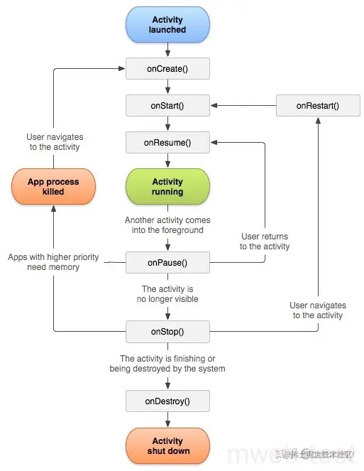

# Android逆向

[TOC]

## 1.项目里静态分析和基于xposed动态工具介绍一下，如果不使用xposed，怎么实现动态分析工具？

静态分析工具是指在不运行程序的情况下，通过对程序文件进行源代码分析，从而对程序的安全性、可靠性、性能等进行分析的工具。它可以识别出程序文件中的漏洞，但只能识别出程序文件中的静态漏洞，不能识别出程序在运行中可能出现的动态漏洞。比如apktool、androidkiller、jeb，GDA、smali、jadx等

**xposed**是一款可以为Android系统添加动态模块的框架，它可以在不改变应用程序的实际代码的情况下，在运行时为应用程序加载新的动态模块。Xposed可以用来实现动态分析工具，因为它可以挂载到程序的运行过程中，给程序添加动态模块，从而实现对程序运行情况的动态分析。

**如果不使用xposed** **，怎么实现动态分析工具？**

可以使用热更新技术（热更新就是动态下发代码，当用户打开app时，通过网络下载升级包来直接更新，不需要发布新版本到应用市场。升级包的体积比较小，下载速度快。），它可以在不重新安装应用程序的情况下，将新功能添加到应用程序中，从而实现动态分析。此外，还可以使用Java反射技术，将特定的分析逻辑添加到程序运行过程中，从而实现动态分析。

## 2.安卓上的加固，脱壳技术介绍一下？

加固技术：加固技术是指在应用程序中采取一系列措施，以防止恶意仿冒、非法修改和拆分程序，从而保护应用程序的安全性和完整性。

常见的加固技术有代码混淆、签名验证、数据加密和、Root权限控制等。

脱壳技术：脱壳技术是一种反编译技术，用于将已经加固过的安卓应用程序反编译为可读的源代码，以便分析和研究应用程序的内部结构和原理。通常，脱壳技术可以分为两大类：静态脱壳技术和动态脱壳技术。
 静态脱壳技术是指在不执行应用程序的情况下，通过反汇编和反编译来分析应用程序的原始代码；
 动态脱壳技术是指在应用程序执行过程中，通过跟踪应用程序的执行流程并分析其内部结构，来反汇编和反编译其原始代码。

## 3.如何从海量app找出一个二次打包的应用呢，有几种思路？（流量特征、代码相似度检测、UI节点遍历等）

1、流量特征:分析应用的流量特征，如流量源、目的地、数据大小等，是否存在异常的特征，可以判断是否是一个二次打包的应用。
 2、代码相似度检测:检测代码的相似度，如果存在相同的代码段或者极高的代码相似度，则可以判断是一个二次打包的应用。
 3、UI节点遍历:针对UI界面，进行遍历，查看UI界面中是否存在异常，如相同的界面或者极高的相似度，说明可能存在二次打包的应用。

## 4.xposed框架原理？

Xposed框架是改变Android应用的行为的一种方法，它使用一种叫做模块的软件，这些模块可以在Android设备上运行，从而改变应用程序的行为或外观。

Xposed框架的原理是通过修改系统的内存来实现的，它将在Android的每一次启动时被加载，并且会捕获正在运行的应用程序的方法调用，然后根据Xposed模块的设置来改变应用程序的行为。Xposed框架可以被用来改变Android系统的外观和行为，这种改变可以使用户获得更多的功能和更强大的体验。替换/system/bin/app_process，该路径的app_process被替换为Xposed的app_process，对需要hook的方法进行native注册，达到优先执行

## 5.app的漏洞了解吗？应用克隆漏洞呢，activity暴露攻击怎么利用，webview漏洞，其他漏洞等？

1、全局可读写漏洞、域控制不严格漏洞、密码明文存储漏洞、远程代码执行漏洞、Webview漏洞、Android应用本地拒绝服务漏洞等

2、应用克隆漏洞：应用克隆漏洞是指攻击者可以通过某种技术手段复制一个应用，并将其修改以获取不正当的权限、数据访问等。
 3、Activity暴露攻击：Activity暴露攻击是指攻击者可以通过某种技术手段获取到Android应用中的隐藏Activity，从而获取不正当的权限、数据访问等。
 4、WebView漏洞：WebView漏洞是指攻击者可以通过某种技术手段获取到Android应用中的WebView实例，从而获取不正当的权限、数据访问等。
 5、其他漏洞：Android应用漏洞还包括资源泄露、无线网络漏洞、应用更新漏洞、数据存储漏洞、系统服务漏洞等。

## 6.如何hook动态加载的dex？

动态加载dex的hook技术可以通过替换dex文件中的class文件来实现。可以通过替换classloader的openDexFile方法来替换dex文件的class文件，然后在openDexFile方法中将替换后的dex文件加载到虚拟机中，这样就可以hook动态加载的dex文件了。

## 7.arm和x86汇编有什么区别？函数调用约定，函数传参和返回值

1.函数调用约定不同：ARM采用的是“空参数栈”方式，而x86采用的是“压栈”方式。

2.函数参数传递不同：ARM中函数参数通常是通过寄存器传递的，而x86中函数参数通常是通过堆栈传递的。

3.函数返回值的方式不同：ARM中函数返回值通常是通过寄存器传递的，而x86中函数返回值通常是通过堆栈传递的。

4.有的指令没有：ARM汇编没有x86汇编中的堆栈操作指令，但x86汇编没有ARM汇编中的多数数据处理指令。

5.有的指令有些不同：ARM汇编和x86汇编中，有些指令的操作码和功能有些不同。

## 8.栈溢出原理，格式化字符串漏洞，有哪几种保护手段，怎么绕过栈上canary保护，ROP攻击原理

1.栈溢出原理：栈溢出是指程序在运行过程中，向栈中压入的数据比栈所能容纳的要多，从而使原本存放在栈中的数据被溢出的数据覆盖，从而导致程序出现异常。当程序接收到一个恶意数据，会在栈中压入一定量的数据，如果这个数据量超过了栈容量，就会导致栈溢出，程序就会异常终止，可能导致系统崩溃。

2.格式化字符串漏洞：格式化字符串漏洞是指程序未正确检查用户输入的格式化字符串，从而被恶意的利用。当恶意的用户输入一个特殊的格式化字符串时，程序就会运行一些不受控制的操作，甚至可以导致系统崩溃。

3.保护手段：

–格式化字符串应该进行输入验证，可以使用正则表达式或者其他技术来验证用户输入是否符合要求；

–使用访问控制列表（ACL）来控制访问，保证只有可信任的用户才能访问系统；

–安装最新的安全补丁，及时更新系统，防止漏洞被利用。

4.绕过栈上canary保护：可以使用栈溢出技术，将canary的值覆盖为预期值。

5.ROP攻击原理：ROP（Return-oriented Programming）攻击是一种反向控制流技术，它利用程序中的许多存在的返回指令，从而构造出一个攻击序列，来改变程序的执行流程。ROP攻击可以绕过现有的防御技术，例如堆栈保护、代码签名等，来达到攻击的目的。

## 9.现在安卓平台上得几种加固方式（动态加载，类抽取，混淆，vmp），怎么脱壳，及各种技术细节android常见的加固和脱壳技术，vmp了解吗，如何让你设计虚拟机保护你怎么实现？vmp的优劣势？

1.动态加载：动态加载技术可以在运行时将可执行文件下载至内存，以防止可执行文件被复制、植入病毒等。它可以降低应用程序的运行速度，因为它需要下载可执行文件，但同时可以提升应用的安全性。

2.类抽取：这种技术可以将应用的类抽取出来，并且将它们放置到独立的存储空间中，以便在运行时可以从这些独立的存储空间中加载这些类。这种技术可以有效阻止分析者从类中反编译出应用的源代码。

3.混淆：混淆技术可以使反编译者无法识别实际的代码，因为代码被混淆了，所以分析者无法得知实际的代码意图。这种技术也可以防止病毒感染，因为病毒程序也无法识别混淆的代码。

4.VMP：VMP(Virtual Machine Protection)是一种特殊的加固技术，它可以将应用程序运行在虚拟机环境中，从而使得反编译者无法直接访问应用的源代码，以及降低反编译的成功率。

脱壳：脱壳技术主要包括反汇编技术、检测加固技术和破解加固技术。
 反汇编技术可以用来分析加壳文件，检测加固技术可以用来检测是否加了壳；
 破解加固技术则可以用来破解加壳文件，从而使文件可以被反编译或破解。

谈谈虚拟机保护？

虚拟机保护使用虚拟化技术来保护某一台物理机器上的操作系统和应用程序，从而提高安全性和可靠性。它使用多个虚拟机（VM）来隔离物理机器上的资源，从而避免在执行应用程序时出现安全漏洞和其他系统问题。

虚拟机保护的优势：

•虚拟机保护可以提高系统的安全性，减少恶意软件和攻击的可能性，因为整个系统可以被隔离在虚拟机中。

•虚拟机保护可以减少系统的维护成本，因为它可以更容易地实施更新，不必重新安装每个应用程序。

•虚拟机保护可以提供更好的可用性和可恢复性，因为可以更容易地迁移虚拟机，从而更快地恢复系统。

虚拟机保护的缺点：

•虚拟机保护可能会增加系统的复杂性，因为需要在虚拟机和物理机器之间管理复杂的资源。

•虚拟机保护可能会增加系统的成本，因为需要购买其他的硬件设备和软件。

•虚拟机保护可能会减缓系统的性能，因为需要在虚拟机和物理机器之间共享资源。

## 10.frida原理，xposed与frida有什么区别？

Frida是一款免费开源的跨平台监视、调试、改写应用程序的工具，它可以通过使用动态代码注入技术，在运行时向目标程序中注入自定义代码，从而实现对其行为的实时监控和修改。

Xposed是一个使用root权限的安卓框架，它是以模块的形式对系统或应用程序的核心组件进行替换，从而达到修改系统行为的目的。

Frida与Xposed的区别：

•Xposed是基于root权限的安卓框架，模块的形式对系统或应用程序的核心组件进行替换；而Frida是一款免费开源的跨平台监视、调试、改写应用程序的工具，通过使用动态代码注入技术，在运行时向目标程序中注入自定义代码，从而实现对其行为的实时监控和修改。

•Xposed需要root权限，而Frida可以在不需要root权限的情况下操作，所以Frida更加安全。

•Xposed只支持安卓系统，而Frida支持多种操作系统，包括安卓、iOS、Windows、macOS等。

## 11.Got表hook和inlinehook有什么区别？

Hook和Inline Hook是两种不同的钩子技术，用于拦截程序的运行。Hook技术通过将一个函数指针指向用户定义的函数，在该函数被调用时，它会被用户定义的函数取代。Inline Hook技术则是通过替换一段汇编指令来实现的，当汇编代码被执行时，它会被用户定义的汇编代码替换。由于Hook技术只是替换一个函数指针，所以它的实现相对简单，而Inline Hook技术则需要替换一段汇编代码，所以它的实现相对复杂。

## 12.selinux安全相关

SElinux（Security-Enhanced Linux）是一种基于Linux的安全机制，它提供了一种有效的方式来限制系统资源的访问，从而防止恶意攻击者对系统的破坏。SElinux是基于强制访问控制（MAC）的概念来实现安全性的，它允许系统管理员为每一个特定的程序、文件或用户指定访问资源的限制。在SElinux中，可以设置用户的角色，以及每一个角色所允许的行为。可以设置文件的安全上下文，指定该文件的访问权限.此外，SElinux还有一系列的安全策略，可以更好地保护系统免受网络攻击。

## 13.Android从按下开机键，启动流程是怎样的？

1.启动Bootloader:Bootloader是一种特殊的引导程序，它负责从固件（firmware）中启动操作系统。

2.加载内核：内核是Android操作系统的核心，它负责管理设备的资源，如处理器、内存、存储空间和其他硬件。

3.加载init进程：Init进程是Android系统的最初进程，用于启动和管理其他进程。

4.加载Zygote进程：Zygote进程是Android系统的核心，它负责加载应用程序的库，以及创建新的应用程序实例。

5.加载dalvik虚拟机：Dalvik虚拟机是Android系统中的虚拟机，它负责为应用程序提供运行环境，并且负责执行应用程序代码。

6.加载系统服务和应用程序：Android系统会加载一些系统服务和应用程序，这些服务和应用程序负责完成设备上的基本任务和功能。

7.启动桌面：当系统服务和应用程序加载完毕后，Android系统会启动桌面，这样用户就可以开始使用设备了。

## 14.做过app自动化测试工具没有，这些漏洞如果编写自动化测试框架有什么思路？

1.首先，要确定当前APP的漏洞，可以通过静态代码分析工具（如PMD，FindBugs，Checkstyle）来检查源代码，以及使用动态分析工具（如Flowdroid，MobSF，AppMon）来检查应用程序的逻辑行为。

2.然后，根据漏洞的类型和严重程度，分析APP的架构，搭建自动化测试框架，可以使用开源框架Appium，Robotium等来实现。

3.接下来，根据漏洞的类型，将相应的测试用例编写出来，构建自动化测试用例，以便脚本自动执行。

4.最后，使用测试框架和用例，实施自动化测试，并根据测试结果，确定漏洞的存在性及修复程度。

## 15.ida有个f5的功能，那么如何阻止破坏f5分析呢？（破坏堆栈，滥用noreturn函数）ida不能f5反编译的原因？

1.在程序中使用编译器特定的指令，如堆栈布局，来防止F5分析。

2.使用编译器特定的指令，如noreturn函数，来防止F5分析。

3.使用静态分析工具来检查反汇编代码，以确定它是否可能会被IDA反汇编。

4.为了防止IDA的反汇编，可以将可执行文件中的一些字节替换为非可执行字节，使得IDA无法识别它们。

## 16.列举几个花指令的代码片段？

1.让电机以每秒60圈的速度旋转：

SET_MOTOR_SPEED motor_id, 60

1.让电机以每秒100圈的速度旋转：

SET_MOTOR_SPEED motor_id, 100

1.让电机以每秒50圈的速度反向旋转：

SET_MOTOR_DIRECTION motor_id, REVERSE
 SET_MOTOR_SPEED motor_id, 50

1.让电机停止运转：

SET_MOTOR_SPEED motor_id, 0

比如：

private static final char[] wJ = "0123456789abcdef".toCharArray();
 public static String imsi = "204046330839890";
 public static String p = "0";
 public static String keyword = "电话";
 public static String tranlateKeyword = "%E7%94%B5%E8%AF%9D";

## 17.android的init_array和jni_onload的时机问题，如何绕过init_array的反调试？

Android的**init_array**和**jni_onload**是两种不同的反调试机制。init_array是在链接时就会被调用，而**jni_onload**则是在Android系统中进行调用。

要绕过init_array的反调试，可以采用以下两种方法：

1.使用不同的链接器：可以**使用不同的链接器**，**以便替换** **init_array**，从而**避免被反调试**。

2.修改程序代码：可以**手动修改程序代码**，将init_array改为jni_onload，从而避免被反调试。

## 18.xposed hook原理，xposed如何实现一个dalvik模式函数的hook的，frida如何实现native函数hook的？

1.Xposed Hook原理：
 Xposed Hook原理是通过在Android系统中安装一个叫Xposed框架的模块，它会替换掉需要hook的应用的某些函数，从而实现对应用程序的hook。Xposed框架会在dex文件中插入一些代码，以实现hook的功能。

2.Xposed如何实现一个Dalvik模式函数的hook：
 Xposed框架可以通过在被hook的函数的前部插入一些代码来实现对函数的hook，从而在函数调用之前或之后做一些操作。Xposed框架可以通过替换被Hook函数的函数指针，实现对Dalvik模式函数的hook。

3.Frida如何实现Native函数hook：
 Frida可以通过在程序运行时动态修改内存中的代码来实现native函数hook。可以通过修改函数的指令指针，从而将函数调用转移到用户定义的回调函数上，从而实现native函数hook。

## 19.android反调试的几种手段？

1、检测模拟器：通过检测模拟器特征，如果检测到模拟器，就可以认为是被反调试了。

2、检测进程：检测系统进程中是否含有debuggerd、tracerpid、ddms等进程，来判断是否被调试。

3、检测调试器：通过检测调试器的标志，来判断是否被调试。

4、检测断点：通过检测断点，如果检测到断点，就可以认为是被反调试了。

5、检测hooks：通过检测hooks，如果检测到hooks，就可以认为是被反调试了。

6、检测内存：检测特定内存中是否含有对应的指令，来判断是否被调试。

## 20.ollvm混淆的原理，手段，列举指令替换的例子，如何实现的控制流平坦化？

ollvm混淆的原理，手段，列举指令替换的例子，如何实现的控制流平坦化？

•llvm混淆的原理

​      LLVM混淆是一种混淆技术，它可以改变代码中的指令流路径，添加垃圾代码，修改函数指针和变量名，从而使反汇编者难以理解代码的结构和功能。

•llvm混淆的手段

1.指令替换：对指令的替换，以使程序的执行结果不变，但反汇编出来的代码更加复杂；

2.代码混淆：在代码中添加垃圾代码，让反汇编者难以发现真正的逻辑；

3.函数指针混淆：改变函数指针的指向，从而使程序的执行结果不变，但反汇编出来的函数指针就发生了变化；

4.变量名混淆：改变变量名，使反汇编分析者难以发现变量的真正含义。

•指令替换的例子

​      例如：使用mov指令替换add指令，或者使用and指令替换or指令，使程序执行结果不变，但反汇编出来的代码更加复杂。

•如何实现控制流平坦化

​      LLVM混淆可以通过添加垃圾代码，增加函数的层次，改变函数调用次序，以及改变函数的控制流路径来实现控制流平坦化。

## 21.ios砸壳工具原理？（dyld_insert_libraries注入dylib动态库）

iOS砸壳工具的原理是通过dylib动态库注入（dyld_insert_libraries）的方式，让砸壳工具可以在App启动的早期阶段实现动态注入，从而在App的运行过程中实现破解。

dylib动态库注入的原理是将一个特定的dylib动态库注入到App的运行环境中，这个dylib动态库会在App启动时被加载运行，从而可以实现在App运行过程中对App的修改、破解等操作。

## 22.ios如何在不越狱的情况下去hook一个c函数，了解fishhook吗，Method Swizzing呢？

Fishhook就是一个iOS的钩子框架，它允许你在运行时动态替换函数实现，从而可以hook一个C函数，而不需要越狱。

Method Swizzling是一种iOS开发技术，它允许你替换Objective-C方法的实现，从而可以hook一个C函数，而不需要越狱。

## 23.static函数的区别，局部变量个全局变量放在哪个段，局部变量一定都放在栈上吗？

1.静态函数和普通函数的区别：

静态函数是指在编译期间就可以确定的函数，它不受程序的运行过程影响，而普通函数是在运行时受到程序运行过程影响的函数。

1.局部变量和全局变量放在哪个段：

局部变量放在栈段，全局变量放在数据段。

1.局部变量一定都放在栈上吗？

不一定，也可以放在寄存器中。

## 24.int a(int b){return a?100:10;}这个函数的作用《用你熟悉的一种汇编语言实现，这个函数的汇编大体上分为哪几个模块？

;这个函数的汇编大体上分为三个模块：

; 1、参数处理模块：将参数b压入栈中

MOV SP, R1 ;将SP指向栈顶
 PUSH R0, b ;将b压入栈中

; 2、逻辑处理模块：判断参数a是否为真

CMP R0, a ;比较a的值
 JE LABEL1 ;若a等于0，则跳转到LABEL1
 JNE LABEL2 ;若a不等于0，则跳转到LABEL2

; 3、返回值处理模块：根据逻辑处理模块的比较结果，设置返回值

LABEL1:
 MOV R0, 100 ;将返回值设置为100
 JMP LABEL3 ;跳转到LABEL3

LABEL2:
 MOV R0, 10 ;将返回值设置为10

LABEL3:
 POP R0 ;从栈中弹出返回值
 RET ;返回调用函数处

## 25.爱加密和邦邦壳是如何实现函数级加密的，脱壳思路是什么？

爱加密是一款功能强大的函数级加密软件，能够对软件的程序代码、数据等重要资源进行加密保护。它的工作原理是通过一种叫做“函数级加密”的技术，把代码和数据分别进行加密，并且在运行时将每一段代码和数据解密，然后再进行处理，从而实现软件的加密保护。

邦邦壳也是一款函数级加密软件，它的工作原理是先把要加密的程序代码分段加密，并在程序运行时，将每一段代码解密，然后再进行处理，从而实现软件的加密保护。

脱壳思路是先把要脱壳的程序文件分析出其中的壳程序，然后使用相应的脱壳工具，将壳程序解密，最后再把程序内部的被加密的部分还原成原来的样子。

## 26.有没有编译过安卓源码，怎么编译内核修改traceid字段实现的反调试bypass

是的，我曾经编译过安卓源码。要实现反调试bypass，首先要修改内核文件，具体的修改步骤是：
 1、打开内核文件（如arch/arm/kernel/entry-common.S），找到traceid字段；
 2、在traceid字段处添加一行代码，用来检测是否处于调试状态；
 3、如果处于调试状态，将traceid字段中的值设置为一个特殊的值，以便在程序中进行判断；
 4、在程序中添加代码，用来检测traceid字段的值，如果检测到特殊值则执行特定的操作，以实现反调试bypass的效果。

最后，在编译完成后，将编译出的内核文件安装到你的安卓手机上，即可实现反调试bypass的功能。

## 27.dalvik和art虚拟机上得函数hook区别是什么，art虚拟机为什么执行速度加快？

1.Dalvik虚拟机使用基于指令的方法来执行Java代码，而ART虚拟机使用基于字节码的方法来执行Java代码。因此，dalvik虚拟机上的函数hook只能替换dalvik虚拟机的指令，而art虚拟机上的函数hook可以替换字节码，因此在art虚拟机上hook函数更加方便。

2.ART虚拟机的执行速度比Dalvik虚拟机快的原因在于ART虚拟机采用AOT(Ahead Of Time)编译，而Dalvik虚拟机采用JIT(Just In Time)编译，AOT编译把应用程序的字节码在安装时就编译成机器码，而JIT编译则是在应用程序运行时编译字节码，因此AOT编译可以提高应用程序的执行效率。

## 28.混淆so库有什么分析经验，idapython相关问题？

1、使用procyon反编译器对so库进行反编译，可以获取到混淆之前的源代码。

2、使用IDA Pro，进行反汇编，可以查看混淆之前的函数名、局部变量名等。

3、使用IDAPython，可以自动识别和修复函数名、局部变量名，进行分析和调试。

4、通过分析so库的符号表，可以获取到混淆之前的函数名、局部变量名等。

5、使用查找技术，可以在已经混淆过的函数中搜索指定的字符串，以确认函数的功能。

## 29.了解过微信xposed插件怎么做的吗？

微信Xposed插件是一款可以实现各种微信功能的插件，它可以让你在不破坏微信原有功能的情况下改变原有功能，并且可以添加新的功能。它通过替换微信安装包来做到这一点，以满足用户的特殊需求。

## 30.分析项目中的xposed插件做什么辅助功能，哪些app做了？

Xposed插件可以为Android系统提供辅助功能，使用者可以通过安装插件来定制自己的设备，获得更多功能，并且安全可靠。

目前有不少应用程序已经使用了Xposed插件，其中包括：手机管家、护眼模式、状态栏自定义、桌面美化、模块定制、网络加速、流量监控、安全管理、屏幕解锁、增强系统等。

## 31.项目中的抓包怎么抓的？抓不到怎么解决的，原因有哪些？

抓取项目中的抓包需要依赖一些工具，比如Wireshark、Charles、Fiddler等。首先需要将电脑和需要抓取的设备连接在同一个局域网中，然后打开相应的抓包软件，从而实现抓取项目中的数据包。

如果抓不到，可能原因有：

1.局域网连接出现问题；

2.抓包软件配置有误；

3.抓取设备上的防火墙设置或者其他安全软件，阻挡了抓取数据包；

4.需要抓取的项目中没有发出数据包；

5.网络中出现了干扰，导致抓取数据包失败。

解决这些问题的方式有：

1.确保局域网连接正常；

2.检查抓取软件的配置，保证正确；

3.检查抓取设备上的防火墙设置，以及其他安全软件，保证不阻挡抓取的数据包；

4.确保需要抓取的项目正确运行，发送出数据包；

5.确保网络无干扰，保证抓取数据包的正常性。

## 32.xposed JustTrustMe的原理？

JustTrustMe是一种用于Android的Xposed框架的模块，它可以让用户在没有Root权限的情况下自动模拟系统对应用的系统签名，从而使用户可以安装未经过系统或第三方签名的应用。JustTrustMe的原理是通过拦截Android系统的PackageManager应用程序安装和更新方法，将用户安装的未经签名的应用程序替换为一个用户签名的应用程序。这样就可以实现安装未经签名的应用程序，而无需Root权限。

## 33.了解过ssl-pinning？ssl-pinning证书是怎么获取的？

SSL Pinning是一种针对SSL/TLS协议的安全技术，它允许应用程序检查连接到它的服务器的证书或公钥，以确保它是有效的，并且没有被中间人攻击者篡改。

SSL Pinning证书可以通过从服务器获取公钥，或者从证书颁发机构（CA）获取证书来获取。在获取证书后，它们可以存储在应用程序中，以便在每次发起连接时进行检查。

## 34.frida的检测与对抗？

1.使用动态的检测：使用动态的检测来尝试检测Frida的使用，可以使用系统调用，模块加载，网络流量，线程状态等来判断程序中是否有调用Frida的行为。

2.使用静态的检测：可以通过检查可执行文件或应用程序的字节码，来查找Frida API调用的特征，以及用于注入代码的汇编指令。

3.对抗Frida：应用程序可以使用随机化的技术（如ASLR）来防止Frida注入，它可以使Frida无法在特定的位置注入代码。另外，应用程序可以使用代码签名来防止Frida注入，因为Frida在运行时必须修改可执行文件，但是如果可执行文件被签名，那么修改就会被拒绝。

## 35.双进程的ptrace反调试如何解决？

双进程ptrace反调试可以通过在两个进程中分别捕获对方的ptrace事件，并在发现调试行为时终止对方的调试活动来实现。这样，即使一个进程被调试，另一个进程也可以检测出来，从而阻止调试行为的发生。

## 36.指令抽取壳怎么脱？

脱壳指令抽取的步骤如下：

1.使用反编译工具，如IDA Pro，Hopper等，将可执行文件（EXE）反编译成汇编指令；

2.寻找可疑的脱壳函数，如LoadLibrary，GetProcAddress等；

3.根据脱壳函数的汇编指令，分析函数的加载流程，提取出脱壳的汇编指令；

4.将提取的脱壳指令转换成十六进制值，编写反脱壳程序进行脱壳。

## 37.fart脱壳？

Fart脱壳是指通过解密和反汇编技术来分析和破解Fart程序的过程。这种技术可以帮助破解者查看程序的源代码，以便更好地理解程序的工作流程和内部运行机制，并对其进行修改。有时，可以使用此技术来破解某些保护程序，以便破解者能够更好地控制程序的运行。

## 38.注入、hook框架的原理？

1、注入原理：注入原理是利用反射机制，在运行时，将目标类中的某些方法进行拦截，然后在拦截的方法中进行操作，从而实现对目标类的改变，是最常见的hook原理。

2、hook框架原理：hook框架原理是 使用classloader加载指定的jar包，然后替换掉系统中的某些类，最后调用框架内部的hook方法，对系统中原有的某些方法进行拦截，从而达到hook的效果。

## 39.elf文件格式，安卓的文件格式了解吗？

安卓的文件格式主要有APK、DEX、ODEX、ELF、SO、JAR等。
 ELF（Executable and Linkable Format）是可执行和可链接格式，是UNIX系统中最常用的可执行文件格式之一，主要用于Linux操作系统，它能够装载可执行文件、共享库（shared library）和其他数据文件。ELF是Linux系统中最常见的可执行文件格式，它是一种标准的可执行文件格式，它可以为操作系统提供一种灵活的模块化架构，从而使操作系统可以运行在不同的硬件环境上。

## 40.dex最多有多少个方法，原理？

Dex文件最多可以包含65535个方法，原理是Dex文件中存储了类、方法和字段的描述信息，这些信息是以32位字节为单位存储的，而一个方法的描述信息可以占用2个字节，所以Dex文件中最多可以存储的方法数就是65535个。

## 41.davlik与art虚拟机的区别？

两者之间的最明显的区别是Dalvik虚拟机是Android系统的核心，而ART虚拟机是Android的新的运行时（runtime），用于替换Dalvik虚拟机。

Dalvik虚拟机采用的是JIT（Just-In-Time）编译器，它可以在应用程序运行时动态编译代码，从而提高应用程序的性能。

而ART虚拟机采用的是AOT（Ahead-of-Time）编译器，它在应用程序安装时就将代码编译成机器码，可以节省时间，并且运行更流畅。

此外，Dalvik虚拟机使用的是DEX文件格式，而ART虚拟机使用的是OAT文件格式。

## 42.安卓系统沙箱是怎么实现的？

Android系统沙箱是通过安全机制来实现的，它主要包括文件系统权限，网络访问权限，内存保护，进程隔离等。

文件系统权限：每个应用都有一个单独的文件系统，它们之间不会相互干扰；

网络访问权限：每个应用只能访问自己拥有权限的网络资源，不能访问其他应用的网络资源；

内存保护：每个应用占用的内存都受到严格限制，它们之间不能相互访问；

进程隔离：每个应用都运行在自己的进程中，它们之间不会受到影响。

## 43.binder机制？

**Android**的Binder机制是Android操作系统的一种远程过程调用（RPC）机制，它将Android系统中的进程间通信（IPC）虚拟化，从而允许在不同的进程中调用远程对象的方法。AndroidBinder使用一个叫做Binder的内核组件，将系统中的进程连接在一起。Binder通信是在内核空间进行的，当客户端和服务端进程之间发生数据交换时，它们都会发送一个Binder消息到内核空间，Binder内核组件会将这些消息传递到指定的服务端进程。Binder机制也支持远程方法调用（RPC），允许客户端远程调用服务端进程中的方法。

## 44.app的安装过程？

1.拷贝apk文件到指定目录

2.解压apk，拷贝文件，创建应用的数据目录

3.解析apk的AndroidManifinest.xml文件

4.显示快捷方式

## 45.如何防止app重打包？

1、在代码中添加加密模块，实现对重要代码的加密保护；
 2、在编译过程中添加签名保护，防止恶意篡改应用程序；
 3、在应用程序中添加激活机制，防止被拆分和重新打包；
 4、添加防止反编译的机制，防止应用程序被反编译；
 5、在项目中加入对资源的加密操作，以防止反编译和重新打包；
 6、添加动态加载机制，分拆代码，以防止被反编译和重新打包；
 7、在应用程序中添加防止模拟器运行的机制，以防止程序被重新打包。

## 46.JVM虚拟机与Android虚拟机区别？

JVM虚拟机主要用于运行Java程序，它是一种跨平台的虚拟机，可以在多种操作系统上运行，以便跨平台使用。Android虚拟机是一种特殊的虚拟机，主要用于运行Android应用程序，它只能在Android系统上运行，不能在其他操作系统上运行。此外，Android虚拟机比JVM虚拟机更节省资源，能够更好地适应移动环境，使程序的启动和运行更加流畅。

## 49.dex是什么？

dex是Android程序编译后的二进制文件，可以直接加载进Dalvik虚拟机执行。

## 48.那dex和class到底在结构上有什么区别呢？

dex文件是Android应用程序的二进制文件，它存储了应用程序的字节码，这些字节码是dalvik虚拟机可以理解和执行的。

class文件是Java应用程序的二进制文件，它存储了Java程序的字节码，这些字节码是Java虚拟机可以理解和执行的。

dex文件和class文件在结构上有很大的不同，dex文件是Android特有的二进制格式，而class文件是Java特有的二进制格式。

## 49.Android虚拟机中寄存器起什么作用，与栈的区别在哪里（又或者基于栈与基于寄存器的架构，谁更快？）

Android虚拟机中的寄存器主要用于存放CPU中临时保存数据和指令的内存单元，它不像栈会自动扩展，而是有一定的大小，可以存放一个指令。

与栈的区别在于，栈是一种自动增长的内存结构，它可以用来存储函数调用参数和函数返回值，它能够自动增长和减少；而寄存器是一种固定大小的内存结构，它只能用来存储一个指令。

基于栈的架构比基于寄存器的架构更快，因为栈的操作更加简单，不需要像寄存器架构那样实时保存和加载数据。

## 50.arm指令究竟是什么指令，能说说他与字节码指令的区别吗?

Arm指令是一种处理器指令，由英国Advanced RISC Machines Ltd（ARM）公司开发。最初它是一种RISC（降低精度计算机）指令，其目的是为了节省存储空间，提高处理器性能。Arm指令通常用于智能手机和平板电脑，因为它们比其他处理器更节能，并且可以提供更快的处理速度。

字节码指令是一种编码，用于表示机器指令的抽象概念，它们可以用来生成真正的机器指令。字节码指令与Arm指令最大的不同之处在于，前者是一种抽象概念，而后者则是一种特定的处理器指令。另外，字节码指令可以通过解释器或虚拟机执行，而Arm指令则只能由特定的Arm处理器来执行。

## 51.C++内存对象布局（函数，虛函数，纯虚函数），成员函数调用地址是什么样？

C++内存中的对象布局如下：

•普通函数：普通函数只有一个存储地址，指向代码段中函数的入口点。

•虚函数：虚函数有一个存储地址，指向派生类中函数的入口点，以及一个虚函数表（vtable），包含虚函数及其地址。

•纯虚函数：纯虚函数只有一个存储地址，指向虚函数表（vtable），而不是派生类中函数的入口点。

成员函数调用地址是派生类中函数的入口点，即虚函数表（vtable）中的地址。

## 52.zygote启动，怎么启动app，app启动流程(从点击到界面显示），启动涉及到的线程，怎么交互？

1.点击应用程序图标：用户点击图标，系统会接收到点击事件，并将该事件分发到Activity Manager服务中，Activity Manager服务会识别该事件，并打开相应的应用程序；

2.启动Zygote：Activity Manager服务会启动Zygote进程，Zygote进程负责为应用程序创建一个新的进程；

3.启动App进程：Zygote会启动一个新的App进程，新的App进程会加载应用程序的代码和资源，并初始化应用程序；

4.启动线程：App进程会创建并启动主线程、渲染线程和其它线程，主线程负责处理应用程序的主要逻辑，渲染线程负责UI的绘制，其它线程负责更新数据和处理网络请求等；

5.主线程加载Activity：主线程会加载应用程序的启动Activity；

6.启动Activity：Activity Manager服务会启动Activity，启动Activity会激活渲染线程；

7.渲染线程绘制界面：渲染线程会绘制界面，并将绘制的界面展示在屏幕上；

8.交互：用户可以通过界面进行交互，应用程序会根据用户的操作来更新界面并处理相关的逻辑。

## 53.linker加载so流程，so有依赖时如何执行，so加壳原理和脱壳，soinfo如何替换？

**linker加载so流程**

1.首先，linker将要加载的so文件从文件系统中加载到内存中；

2.然后，linker将读取so文件，解析其ELF头，以确定文件信息；

3.接着，linker将检查so文件是否与当前进程的ABI兼容；

4.接着，linker检查so文件的依赖库，并加载所有依赖的so文件；

5.然后，linker将加载so文件到虚拟地址空间，并处理其重定位段；

6.最后，linker将调用so文件的入口函数，将其加载到内存中。

**so有依赖时如何执行**

当so文件依赖其他so文件时，linker将首先加载依赖的so文件。然后，linker将加载要执行的so文件。在加载过程中，linker将检查依赖的so文件是否与当前进程的ABI兼容，如果不兼容，则会抛出异常。

**so加壳原理**

so加壳的原理是将so文件的入口函数替换成加壳程序的入口函数，而加壳程序的入口函数可以分析so文件的内部结构，并且可以针对不同的so文件实现不同的加密算法。

**so脱壳**

so脱壳的原理是在加载so文件之前，先将加壳程序的入口函数替换回so文件的入口函数，然后再加载so文件，从而达到脱壳的效果。

**soinfo如何替换**

soinfo可以使用linker的linker_find_soinfo函数来查找so文件，使用linker_add_soinfo函数来添加so文件，使用linker_remove_soinfo函数来移除so文件，使用linker_replace_soinfo函数来替换so文件。

## 54.inline hook和got hook原理，如何检测？inline hook跳板设计，多次跳转情况？

1.Inline hook原理：Inline hook是通过在原函数的开头插入一段机器码实现的，将原函数的开头替换成一段跳转机器码，跳转机器码指向hook函数，在hook函数中进行操作，然后再跳回原函数，实现对函数的修改和拦截。

2.Got hook原理：Got hook是通过修改GOT表来实现的，GOT表中的函数地址入口默认是指向原函数，hook实现时将其改为指向Hook函数，在Hook函数中进行操作，然后再跳回原函数，实现对函数的修改和拦截。

3.检测：可以通过检查函数的前面几个字节来进行检测，如果存在跳转指令，则说明该函数被hook了；另外可以通过检查GOT表中的函数地址入口来进行检测，如果地址指向hook函数，则说明该函数被hook了。

4.Inline hook跳板设计：Inline hook实现时，为了避免hook函数插入到原函数中造成函数体变大，可以使用跳板来实现，即在原函数的开头插入一段跳转机器码，跳转机器码指向一个跳板函数，在跳板函数中再跳转到hook函数，在hook函数中进行操作，然后再跳回原函数，实现对函数的修改和拦截。

5.多次跳转情况：多次跳转也是可以实现的，可以设计多个跳板函数，每个跳板函数负责跳转到下一个跳板函数，最后一个跳板函数负责跳转到hook函数，在hook函数中进行操作，然后再跳回原函数，实现对函数的修改和拦截。

## 55. Java hook中，xposed注入原理和hook原理，artmethod相关，Javahook如何检测，如何分析app是否有hook检浏？

1.Xposed注入原理：Xposed框架本质上是基于模块化的，它以一种特殊的形式将Java层的Hook技术注入到Android应用程序中，从而实现对应用程序的功能修改和增强。它使用一个叫做XposedBridge.jar的中间件，它将框架元素初始化到Zygote进程中，然后将Hook注入到每个应用程序的进程中，以改变其行为。

2.Hook原理：Hook技术是一种通过改变应用程序中原有函数的行为来实现目的的技术。它可以在应用程序执行前或执行后更改函数行为，以改变应用程序的行为。例如，可以使用Hook技术来改变应用程序中的某些函数，以达到隐藏系统的某些功能的目的。

3.ARTMethod相关：ARTMethod是Android Runtime的一个重要组件，它可以替代早期的Dalvik虚拟机。ARTMethod负责将Java代码编译成机器语言，并执行它。它的核心是ARTMethod表，其中包含了所有Java方法的信息，包括方法名、参数类型和堆栈大小等。

4.Javahook如何检测：可以使用反编译工具通过分析应用程序的代码来检测java Hook技术。反编译工具可以解码应用程序的字节码，从而可以检测出程序中使用的Hook技术，如Xposed框架。

5.如何分析应用程序是否有hook检测：可以使用反编译工具对应用程序的字节码进行分析，以检测应用程序是否包含特定的Hook检测代码。可以使用工具分析应用程序的字节码，以查找是否有用于检测Hook技术的代码。例如，可以检查代码中是否有检查Xposed框架的代码，以及检查是否有替换ARTMethod表的代码等。

## 56.riru和zygisk原理，4个回调的时机？

Siru和Zygisk原理是一种有效的控制算法，它通过定义四个回调来实现程序中止、挂起和重新启动逻辑。

回调的时机如下：

1.启动回调：控制算法开始运行时调用。

2.执行完成回调：控制算法正常完成时调用。

3.挂起回调：控制算法挂起时调用。

4.终止回调：控制算法终止时调用。

## 57.ollvm混淆有哪些，怎么实现的，分析的方法有哪些，分别怎么做？

LLVM混淆有以下几种：

1.算术混淆：通过添加无意义的数学运算，让目标代码变得更复杂，混淆反编译后的结果，从而达到安全加固的目的。

2.字符串混淆：在目标代码中添加大量的无意义的字符串，从而混淆反编译后的结果，从而达到安全加固的目的。

3.代码混淆：加入大量的无意义的代码，从而让反编译后的结果变得更复杂，从而达到安全加固的目的。

4.函数重命名：将函数名重新命名，使反编译后的结果更复杂，从而达到安全加固的目的。

5.栈混淆：使用栈混淆，使反编译后的结果更复杂，从而达到安全加固的目的。

LLVM混淆实现的方法有以下几种：

1.通过LLVM工具链进行混淆。

2.使用LLVM的插件进行混淆。

3.利用LLVM的API进行混淆。

分析LLVM混淆的方法有以下几种：

1.逆向工程：使用现有的工具对LLVM混淆的代码进行逆向工程，从而恢复原始的代码。

2.分析混淆后的代码：通过分析混淆后的代码，从而恢复原始的代码。

3.测试：使用现有的测试工具对LLVM混淆的代码进行测试，从而恢复原始的代码。

## 58. dex保护的方式（加壳）有哪些？分别怎么解决？

1.定长加壳：定长加壳是指在dex文件的前面添加一段固定长度的加壳程序，此类加壳程序通常有一定的检测机制，可以检测出被加壳，并且进行解密操作，以便正常使用dex文件。解决方法：需要逆向分析加壳程序，以便反编译出原始dex文件。

2.变长加壳：变长加壳是指在dex文件的后面添加一段长度不定的加壳程序，由于变长加壳程序的长度不固定，因此可以更好地隐藏dex文件信息。解决方法：需要逆向分析加壳程序，以便反编译出原始dex文件。

3.加密加壳：加密加壳是指对dex文件进行加密处理，然后在其外面加上一段加壳代码，以便检测出被加壳，并且进行解密操作，以便正常使用dex文件。解决方法：需要逆向分析加壳程序，以便反编译出原始dex文件，以及解密dex文件。

## 59.如何hook动态加载的dex?

目前Android上有三种方法可以hook动态加载的dex：

1、使用InlineHook技术：InlineHook技术可以通过修改原始字节码，在dex加载时注入自定义代码，从而实现hook动态加载的dex。

2、使用Substrate技术：Substrate技术也是一种在dex加载时注入自定义代码的技术，它可以为dex文件注入额外的字节码，从而实现hook动态加载的dex。

3、使用Xposed技术：Xposed技术是一种在Android上动态加载模块的技术，它可以在dex加载时加载特定的模块，从而实现hook动态加载的dex。

## 60.arm指令相关，art指令相关。

Arm指令集是一种用于微处理器和处理器架构的指令集架构，它有助于在不同的软硬件环境中运行应用程序。ARM指令集包括表示操作和数据的指令，以及用于控制程序流程的指令。

ART指令集是Android运行时（ART）编译器使用的指令集。ART指令集旨在提高应用程序的性能，因为它使用了高性能的指令，这使得应用程序能够更快地运行，而不会影响电池寿命。

## 61.内存保护方案，如何实现？

内存保护方案是指利用操作系统提供的安全机制来防止内存被意外或恶意破坏。

实现内存保护方案的方法有：

1.使用操作系统提供的安全机制，如访问控制列表，让每个进程只能访问它被授权的内存区域；

2.使用数据执行保护，防止恶意代码在内存中执行；

3.使用虚拟内存，将程序的内存拆分成不同的内存页，并建立相应的映射，以限制特定的进程访问内存的多少；

4.使用缓冲区溢出保护，检查用户输入的数据是否超出内存的容量，以防止内存损坏；

5.使用内存污染检测，检查内存中是否有意外的改变，以及检测是否有未知代码在内存中运行；

6.使用内存隔离技术，将每个进程的内存隔离开，以防止一个进程访问另一个进程的内存；

7.使用可信计算，通过在操作系统中执行安全检查，来防止恶意代码执行；

8.使用安全更新，定期更新系统补丁，以防止恶意代码攻击。

## 62.常见反调试以及绕过方式

反调试：

1.系统API检测：通过调用系统提供的API函数，检测是否存在调试器，检测到调试器即停止程序执行，常用API函数有IsDebuggerPresent()、CheckRemoteDebuggerPresent()等。

2.系统进程检测：通过枚举系统进程，检测调试器进程是否存在，存在即停止程序执行，常用API函数有FindWindow()、FindWindowEx()等。

3.系统文件检测：通过检测系统文件，检测调试器文件是否存在，存在即停止程序执行，常用API函数有GetFileAttributes()等。

4.系统服务检测：通过枚举系统服务，检测调试器服务是否存在，存在即停止程序执行，常用API函数有OpenSCManager()、OpenService()等。

5.内存检测：通过检测内存，检测调试器断点是否被设置，存在即停止程序执行，常用API函数有VirtualQueryEx()、ReadProcessMemory()等。

6.硬件断点检测：通过检测CPU寄存器，检测硬件断点是否被设置，存在即停止程序执行，常用API函数有GetThreadContext()、SetThreadContext()等。

绕过方式：

1.模拟调试：被调试程序利用调试API函数检测到调试器，但是并不是真正的调试器，而是模拟的调试器，此时可以绕过反调试检测。

2.修改PE头：修改可执行文件PE头中的标志位，来绕过被调试程序的反调试检测。

3.修改内存：被调试程序利用内存检测技术检测是否存在调试器，此时可以通过修改内存来绕过被调试程序的反调试检测。

4.注册表修改：被调试程序利用注册表检测是否存在调试器，此时可以通过修改注册表来绕过被调试程序的反调试检测。

5.利用代码混淆技术：可以通过使用代码混淆技术，来隐藏被调试程序的反调试检测代码，从而绕过调试检测。

## 63.elf格式相关，静态库和共享库区别。

静态库和共享库是两种不同的动态链接库形式，它们之间的区别如下：

1.静态库是一种特殊的二进制文件，它的被链接的程序的程序大小会增加，但不会增加系统资源占用；共享库是扩展动态链接库，它的被链接的程序的大小不会增加，但会增加系统资源占用。

2.静态库是把对应的函数或者类的定义都嵌入到目标文件中，不依赖其他文件，可以在不同平台之间移植；而共享库是把某一类函数或者类的定义放在一个独立的文件中，它们可以被多个程序共享，从而节约内存和存储空间，但是只能在同一类系统间共享，移植性较差。

3.静态库的编译时间一般较长，但运行效率高；共享库的编译时间一般较短，但运行效率较低。

## 64.如何检测重打包？

1.使用静态代码分析工具：静态代码分析工具可以检测出重打包的应用程序，因为它们会发现应用程序中的重复代码，以及被添加到应用程序中的额外代码。

2.使用动态分析工具：动态分析工具可以通过分析应用程序的运行行为来检测是否有重打包的应用程序。

3.使用反汇编工具：反汇编工具可以通过分析应用程序的机器代码来检测是否有重打包的应用程序。

4.使用反编译工具：反编译工具可以将机器代码转换成可读的源代码，以发现重打包的应用程序。

5.使用流量分析工具：流量分析工具可以检测应用程序的网络流量，以发现重打包的应用程序。

## 65.Java栈和c栈的区别。

Java栈和C栈的区别主要有以下几点：

1.Java栈是一个虚拟机栈，用于存储方法的执行帧，而C栈是操作系统使用的栈，用于存储函数的参数、局部变量等。

2.Java栈是由JVM负责管理，而C栈是由操作系统负责管理。

3.Java栈是安全的，可以防止溢出；而C栈则不安全，不能防止溢出。

4.Java栈的深度是限制的，而C栈的深度可以设置的比较大，甚至可以无限制。

5.Java栈中只存储Java对象，而C栈中存储的可以是任意类型的数据。

## 66.延迟处罚型风控如何对抗？群控（工作室）有哪些检测方式？

1.延迟处罚型风控的对抗方式主要是建立一套完善的风控体系，提高风控质量，保证风控能力满足经营要求。包括：

（1）建立良好的客户关系，及时发现客户的异常行为，及时采取措施。

（2）提高风控数据质量，建立完善的风控数据库，并定期更新，以确保风控数据的可靠性。

（3）定期对风控系统进行检测，确保系统的可用性和安全性。

（4）实施有效的风控管理制度，如风控流程、风控规定等，确保风控管理规范。

2.群控（工作室）检测方式包括：

（1）账号监测：对工作室帐号的风控措施，比如设置超额警报、建立风险报表、实施定期检查等。

（2）建立风控报警系统，及时发现异常行为和潜在风险。

（3）实施安全测试，定期对系统进行渗透测试，及时查找系统漏洞。

（4）建立安全管理体系，定期检查和评估安全管理机制。

## 67.设备指纹生成会遇到的问题，异常情况如何解决？

1.如果在获取设备指纹的过程中出现网络问题，可以采用重试机制，即在设定的时间内重复尝试获取设备指纹。

2.如果在获取设备指纹的过程中出现浏览器不支持的情况，可以通过探测浏览器版本，跳过不支持的浏览器，使用其他浏览器生成设备指纹。

3.如果设备指纹生成和存储时出现异常，可以采用多种措施，比如检查浏览器的cookie是否可用，检查存储空间是否有足够的空间，检查是否存在其他技术因素影响等。

## 68.native如何获取xx设备信息？

React Native提供了React Native Device Info模块，可以帮助开发者获取有关设备的信息，如设备型号，系统名称和版本，设备识别码，应用程序版本，屏幕宽度等等。

## 69.Android四大组件是什么？

Activity
Service
Broadcast receiver
Content provider

## 70.Activity的生命周期？

## 71.Android进程之间的通信方式？

Android进程之间的通信方式包括**socket**、**binder**、文件共享、**Messenger**、**AIDL**、**ContentProvider**等。

## 72:汇编 函数参数传递的过程？

1.首先，在调用函数时，把参数压入栈中。

2.然后，函数调用前会将传入参数的地址存储到寄存器中。

3.最后，当函数调用结束后，将返回值存储到栈中，并且把返回地址从栈中取出，从而完成函数参数传递的过程。

## 73.汇编 函数返回有几种形式？

1.使用 ret 指令返回；

2.使用 iret 指令返回；

3.使用 jmp 指令返回；

4.使用 call 指令返回；

5.使用 ljmp 指令返回。

## 74.Java与C++面向对象的区别？多重继承

Java和C++都是面向对象的编程语言，但是它们在面向对象的实现方式上有很大的不同。

1.Java支持单一继承，而C支持多重继承。Java只允许一个父类，而C可以从多个父类继承。

2.Java只支持public、protected、friendly和private这4种访问修饰符，而C++还支持protected，internal和package等访问修饰符。

3.Java不支持指针，而C++支持指针。

4.Java不支持goto语句，而C++支持goto语句。

5.Java不支持operator overloading，而C++支持operator overloading。

6.Java支持垃圾回收，而C++不支持垃圾回收。

7.Java支持多线程，而C++不支持多线程。

## 75.全局变量，局部变量，const修饰的值保存在elf文件结构的哪里？

全局变量：保存在ELF文件结构的.data段中。

局部变量：保存在ELF文件结构的.bss段中。

**const**修饰的值：保存在ELF文件结构的.rodata段中。

## 76.堆和栈的区别？

堆和栈是两种不同的内存结构，它们都是用于存储数据的内存模型。

堆是一种随机访问存储器，它是一种动态内存分配模式，用于存储任意大小的数据块，它仅由程序员控制。堆中的数据不会因为函数的执行和退出而被释放，只有调用free（）函数释放。

栈是一种后进先出（LIFO）的数据结构，它的内存分配是固定的，它分配的内存空间大小是固定的，它的操作是快速的。栈是用于存储函数参数，局部变量等局部数据的内存模型。在函数调用结束时，栈中的数据会自动释放。

## 77.怎么绕过SSLpining？

1.使用Hook技术：Hook技术可以使用Xposed等框架，在安装App时或运行时修改SSL证书的验证方式，从而绕过SSL Pinning的限制。

2.使用反编译工具：可以使用反编译工具如dex2jar、jadx等工具，将App的可执行文件dex文件反编译成源代码，修改源代码中的SSL Pinning逻辑，再重新编译成可执行文件。

3.使用Root技术：使用Root技术可以实现完全控制系统，获取系统的所有权限，进而修改SSL Pinning的实现逻辑，从而绕过SSL Pinning的限制。

## 78.怎么针对Socket通信防护？

1.使用安全的传输协议：在进行Socket通信时，应使用安全的传输协议，例如SSL/TLS，能够对数据进行加密，以防止数据泄漏和窃取。

2.建立安全的网络环境：为了确保Socket通信的安全，需要建立安全的网络环境，包括安装和配置防火墙，禁止不必要的连接，并使用安全的身份验证，确保只有被授权的用户才能访问网络资源。

3.定期更新软件：应定期更新操作系统和应用程序，以消除新发现的安全漏洞，防止恶意软件的入侵。

4.使用虚拟私有网络：使用虚拟私有网络（VPN）能够对网络通信进行加密，以防止数据泄漏和窃取，提高网络安全性。

## 79.权限的分类？

1.存储权限：允许应用程序访问设备的存储空间，以访问、修改、删除存储的文件和数据。

2.设备权限：允许应用程序访问设备的功能，例如相机、麦克风、蓝牙等。

3.网络权限：允许应用程序访问网络，以及使用网络服务，例如访问网络资源、发送短信、接收网络数据等。

4.通讯录权限：允许应用程序访问用户的通讯录，以便读取、修改和添加联系人。

5.安全权限：允许应用程序执行安全性相关的任务，例如管理用户账户、禁止应用程序安装等。

6.高级权限：允许应用程序执行高级任务，例如管理系统设置、定位、监控等。

## 80.Binder通信原理？

Binder是Android中的一种IPC（进程间通信）机制，它负责在进程之间传递消息和数据，使得不同进程间可以进行通信。

Binder的工作原理是将消息封装成一个特定的格式，然后通过系统内核的binder驱动程序将消息发送到另一个进程，另一个进程收到消息后，解析消息，并发送响应消息，双方之间可以不断发送消息，实现必要的通信。

## 81.说一下arm-vmp与dex-vmp的区别？

ARM-VMP是一种虚拟机，它可以在ARM处理器上运行Java虚拟机，而DEX-VMP则是一种基于Android的虚拟机，它可以运行Android应用程序的Dalvik字节码。ARM-VMP可以运行任何Java虚拟机，而DEX-VMP则只能运行Android应用程序的Dalvik字节码。此外，ARM-VMP可以支持多种不同的指令集，而DEX-VMP只能支持Android应用程序的Dalvik字节码。

## 82.说一下当前dex-vmp的一些解决思路，以及新的vmp的混淆点，有了解么？

dex-vmp是一种反编译混淆技术，最初由Google开发。它旨在加强APK文件的安全性，以防止反编译和分析。dex-vmp的解决方案是将原始字节码替换为预先编译的混淆字节码。这样反编译者就无法准确地识别原始字节码的功能，也无法轻松跟踪应用程序的控制流程。

新的VMP混淆也增加了对逆向工程的难度，使得攻击者无法识别和跟踪应用程序的控制流程。新的VMP混淆点包括：混淆字节码和指令；使用复杂的压缩算法，加密混淆字节码；混淆堆栈；混淆函数调用；混淆变量名；混淆局部变量；混淆全局变量；混淆寄存器；混淆代码段；以及使用虚拟机代码混淆等。

## 83.说一些ollvm的分 类以及如何解决ollvm的初步思路

OLLVM分为以下几类:

1.编译器优化：OLLVM可以优化源代码，以改善程序的执行效率。它可以改变源代码的结构，消除不必要的操作，消除重复计算，提高内存利用率，以及对算法进行优化。

2.逆向工程：OLLVM可以借助目标代码逆向工程，即从目标代码中提取可执行的原始源代码。这类技术可以帮助用户了解原始代码的结构，以便更好地修改和优化。

3.安全性分析：OLLVM可以扫描源代码，检测可能存在的安全漏洞，并帮助用户修复这些漏洞。

4.代码审计：OLLVM可以帮助用户对源代码进行审计，以确保代码的可读性、可维护性和可重用性。

解决OLLVM的初步思路：

1.了解OLLVM可以实现的功能，以及它们如何能够帮助您提高程序效率。

2.搭建OLLVM开发环境，以便在实践中进行尝试。

3.熟悉OLLVM中的技术，以便更好地利用它们。

4.根据实际需要，选择合适的OLLVM技术，并根据实际情况进行定制。

## 84.现在ollvm中你认为比较困难的点是哪些？

OLLVM中比较困难的点包括：

1、LLVM编译器的架构理解：LLVM是一个编译器架构，它的组件非常多，非常复杂，难以理解。

2、LLVM IR的使用：LLVM IR是一种中间表示语言，它本身并不是一种高级编程语言，而是一种半结构化的、非常低级的、直接操作硬件的语言，对于编程而言要求非常高，需要掌握很多底层的知识。

3、LLVM命令行接口的使用：LLVM的命令行接口非常复杂，每个命令都有非常多的参数，对于初学者来说很难理解。

4、LLVM IR的优化：LLVM IR的优化是一个非常复杂的问题，需要掌握一系列优化策略，并且要熟练运用LLVM提供的优化工具，才能得到最佳的优化效果。

## 85.Android上中间人抓包的原理？如何进行防护？如何进行对抗？还有哪些抓包方式？非root环境可以抓包嘛？说说方案？现有的一些最难的抓包情况是怎么样的？

**Android** **上中间人抓包的原理**：

Android中间人抓包的原理就是在中间进行抓包，将客户端与服务器之间的数据流量拦截下来，进行监控、分析和修改。这种抓包方式的实现方式一般先将客户端的请求发送到中间服务器，中间服务器将请求转发到服务端，服务端返回信息，中间服务器拦截返回信息，然后将返回信息转发到客户端。

**如何进行防护**：

1、采用https协议：采用https协议可以有效防止中间人抓包，因为https协议会将请求和响应进行加密，中间人无法读取。

2、采用VPN技术：将客户端和服务端的连接封装在一层VPN隧道中，使中间人无法拦截到数据流量，也无法抓包。

3、限制网络访问：可以限制客户端只能访问自己的服务器，这样可以有效防止中间人抓包。

**如何进行对抗**：

1、采用加密方案：可以采用加密方案，如**SSL/TLS**，来对数据进行加密，这样即使中间人抓包，也无法解密数据，从而防止被窃取信息。

2、采用双因素认证：可以采用双因素认证的方式来确保客户端的安全性，即在客户端登录时，需要输入用户名和密码，同时还需要输入一个动态口令，这样可以有效防止中间人抓包。

3、采用混淆算法：采用混淆算法可以把客户端与服务端之间的数据流量进行混淆，从而使中间人抓包无从下手。

**还有哪些抓包方式：**

1、ARP欺骗抓包：ARP欺骗抓包是通过在网络中伪造一个ARP请求来抓取数据包，这种方式是比较容易实现的，但是抓取的数据包量不大。

2、DNS欺骗抓包：DNS欺骗抓包是通过伪造DNS响应来抓取数据包，这种方式比较容易实现，但是可能引起DNS泄漏，需要注意。

3、MITM抓包：MITM抓包就是上面提到的中间人抓包，是一种比较常用的抓包方式，但是也比较容易被发现。

**非root** **环境可以抓包嘛**？

是的，非root环境也可以抓包，比如采用ARP欺骗抓包、DNS欺骗抓包等方式。

说说方案：

1、采用https协议：采用https协议可以有效防止中间人抓包，因为https协议会将请求和响应进行加密，中间人无法读取。

2、采用VPN技术：将客户端和服务端的连接封装在一层VPN隧道中，使中间人无法拦截到数据流量，也无法抓包。

3、采用双因素认证：可以采用双因素认证的方式来确保客户端的安全性，即在客户端登录时，需要输入用户名和密码，同时还需要输入一个动态口令，这样可以有效防止中间人抓包。

4、采用加密方案：可以采用加密方案，如SSL/TLS，来对数据进行加密，这样即使中间人抓包，也无法解密数据，从而防止被窃取信息。

**现有的一些最难的抓包情况是怎么样的**？

现有的一些最难的抓包情况是：

1、采用动态IP地址的抓包：当客户端的IP地址每次都在变化时，中间人抓包就会非常困难，因为中间人无法知道客户端的IP地址，也无法进行抓包。

2、采用混淆算法的抓包：采用混淆算法可以把客户端与服务端之间的数据流量进行混淆，使中间人抓包无从下手，这种抓包情况也是比较难的。

## 86.flutter有了解么？遇到这种情况怎么进行抓包？除了你提到的这些通用抓包方案？还有没有其他思路？

Flutter是一款由谷歌开发的跨平台应用开发框架，它可以让开发者利用Dart语言快速开发出高质量的应用程序，并且可以在Android和iOS平台上部署。

对于Flutter抓包，除了你提到的这些通用抓包方案，还有一些特定的方案。比如，你可以使用Flutter中提供的HttpClient和HttpOverrides来抓取网络数据，也可以使用Flutter Inspector来检查网络请求。另外，还可以使用工具如Charles Proxy和Fiddler来抓取网络请求，以及使用Wireshark来分析数据包。

## 87.Android动力态加载壳，不落地加载壳、函数抽取壳的加壳原理以及脱壳方案？

动力态加载壳是一种**Android**应用程序保护方式，它是将原始代码拆分成多个模块，并利用动态加载技术在运行时将这些模块加载到内存中，从而实现代码的重组和重新加载，从而达到防止反编译的目的。

不落地加载壳的原理是将加壳后的程序的所有部分，包括壳程序、原始程序、加壳后的程序以及所有的被壳程序加载的动态库，都放在一个可执行文件中，并且不将任何文件保存在磁盘上，而是将文件加载到内存中，运行时动态加载壳程序将原始程序与加壳后的程序重新组合，从而实现加壳。

函数抽取壳的原理是，壳程序将原始程序的函数调用指令替换为自己的函数调用指令，然后将原始函数提取出来，保存在加壳后的程序中，当程序运行时，壳程序将自己的函数调用指令替换成原始函数，从而实现加壳。

脱壳方案：可以采用反汇编技术，对加壳后的程序进行反汇编，然后分析壳程序的加载过程，以及原始程序与壳程序的组合方式，从而实现脱壳。

## 88.了解Hook么，说下当前常用的一些hook方式？xposed与Frida的原理，Frida气ptrace的关系，Frida和1DA能同时使用么？Frida绕过的第见方式？

Hook是一种可以拦截程序流程的技术，使用它可以拦截程序函数的调用，修改函数的参数和返回值，以及替换函数的实现。

目前常用的hook方式有：

1.目标程序中使用代码行为hook，如使用编译器提供的特殊指令替换函数；

2.通过系统API hook，如调用CreateRemoteThread函数注入DLL，替换函数调用；

3.内存Hook，如通过VirtualProtect修改内存保护属性，修改函数代码；

4.动态调试，如使用OllyDbg、WinDbg、GDB等工具调试程序，添加断点，更改返回值。

Xposed是一种基于Android系统的框架，它使开发者可以使用自己的专用模块对系统进行修改，而无需修改源代码，即在不重新编译系统的情况下，实现对系统的修改，其原理是通过对dalvik虚拟机的hook，实现对应用程序的hook。

Frida是一款基于Python开发的跨平台的应用程序逆向工程工具，可以实现分析和检查应用程序的行为，并可以实时调试应用程序，其原理是通过ptrace系统调用，实现应用程序的hook。

Frida和ptrace的关系：Frida使用ptrace系统调用实现应用程序的hook。

Frida和IDA能同时使用么：不能，Frida和IDA是两种不同的逆向工具，不能同时使用。

Frida绕过的常见方式：

1.修改寄存器：通过修改寄存器中的值，实现绕过被检测的代码；

2.修改堆栈：修改堆栈，替换正常的返回地址，实现跳过被检测的代码；

3.修改内存：修改内存中的值，使得程序执行流程不走被检测的代码；

4.反调试：通过检测当前程序是否处于调试状态，从而实现绕过被检测的代码。

## 89.了解签名校验么？Android的签名机制？一些常用的签名校验方式？如何进行绕过？

签名校验是指在Android应用程序中使用签名证书对应用程序进行签名，以验证应用程序的完整性和安全性。

Android的签名机制是将应用程序的相关信息（如类、资源文件等）组合成一个数据流，然后使用签名密钥生成摘要，对应用程序进行签名。

一些常用的签名校验方式包括：使用签名验证程序来验证应用程序的完整性；使用签名证书进行签名；使用公钥和私钥进行签名；使用算法（如MD5和SHA-1）进行签名；使用密码和密钥进行签名。

绕过签名校验的常用方法包括：使用破解工具篡改签名；使用Xposed框架进行Hook；使用破解软件和破解工具绕过签名检查；使用模拟器和虚拟机绕过签名检查。

## 90.了解重打包么？如何检测重打包？

重打包是指应用程序的源码被篡改后，重新编译打包，然后发布到应用市场的行为。

检测重打包有以下几种方法：

1、代码签名：应用程序的代码签名可以有效防止重打包，因为在重打包后，应用程序代码签名将发生变化，从而被检测出来。

2、混淆：混淆代码可以有效防止重打包，因为重打包后重新编译后，混淆后的代码将变得难以识别和破解，从而被检测出来。

3、反调试：反调试技术可以有效的防止重打包，当应用程序被重新编译后，反调试技术会检测出来，从而发现重打包行为。

4、数字水印：数字水印可以有效的防止重打包，当应用程序被重新编译后，数字水印会发生变化，从而被检测出来。

## 91.vmp虚拟化如何实现对字段的虛拟化？

**VMP** **虚拟化**可以实现对字段的虚拟化，通过使用虚拟机实现虚拟机技术，将多个字段虚拟化，从而节省服务器和存储空间，提高系统性能。虚拟化字段的过程包括：

1）分区分配：将多个字段分割成一系列独立的存储单元，以便虚拟机可以在它们之间进行数据转移；
 2）虚拟化：将存储单元中的数据虚拟化，以便虚拟机可以对其进行快速处理；
 3）虚拟化存储：将存储单元中的数据虚拟化，以便其他虚拟机可以访问它们；
 4）虚拟化处理：将存储单元中的数据虚拟化，以便虚拟机可以对其进行处理。

## 92.中断的具体汇编指令是哪个？

中断的汇编指令是int，可以用来触发中断。

## 93.中断hook的一些实现的函数方法？

1.函数替换：将要hook的函数用自定义函数替换，实现hook的功能。

2.指令替换：将要hook的函数的指令替换成自定义的指令，实现hook的功能。

3.内联指令替换：在要hook的函数中插入自定义的汇编指令，实现hook的功能。

4.修改函数指针：将函数指针指向自定义的函数，实现hook的功能。

5.修改系统调用表：将系统调用表中的函数指针替换成自定义的函数，实现hook的功能。

## 94.控制流平坦化的解决？

一种解决方案是使用迭代器模式。迭代器模式允许我们在不改变原有控制流的情况下将复杂的控制流平坦化。它使用一个迭代器对象来遍历一个集合中的元素，以便在每次迭代之间保持一致的控制流。它可以让我们在不使用复杂的控制流的情况下，实现简单的控制流。

## 95.符号执行解决虛假控制流？

虛假控制流是一種程序中未正確標記的控制流，它會導致程序的行為不正確。符号執行是一種基於符號的技術，可以用於解決虛假控制流的問題。符號執行的方法是將程序的控制流分解為由一系列符號組成的序列。它使優化器可以更輕鬆地判斷程序的行為，並識別哪些能夠在不影響行為的情況下移除。符號執行也可以用於偵測和修復虛假控制流，這可以使程序行為更加正確。

## 96.frida的inlinehook具体修改哪几条指令？

Frida的inlinehook可以修改一条或多条指令，具体取决于hook的目的。例如，如果要hook一个函数，可以使用一个跳转指令(如JMP)来将函数的入口点替换为自定义的函数，以便将函数的行为替换为自定义函数的行为。此外，也可以使用更多指令来替换函数的行为，以便在函数调用时执行一些操作。

## 97.Magisk怎么实现root?

Magisk是一款强大的Android越狱工具，它可以帮助你轻松地实现root。

首先，你需要在手机上安装Magisk Manager应用程序。接着，你需要下载Magisk文件，并将其复制到手机存储中。然后，打开Magisk Manager，点击“安装”，并选择“从本地安装”，选择刚才复制的Magisk文件，并点击“确认”完成安装。最后，你可以使用Magisk Manager来检查你的手机是否已经实现了root。

## 98.Magisk和Edxposed的关系？

Magisk和EdXposed是一个结合体，Magisk提供了一个安全的框架来安装和运行EdXposed模块，以及允许用户隐藏root。EdXposed是一个模块，它基于Xposed框架，能够在没有root权限的情况下修改应用程序的行为。

## 99.xposed为什么不能在Android8.0上使用？

Android 8.0开始支持安全性更高的SEAndroid，这种安全性的提升会影响Xposed的原有的操作方式，因此Xposed不能在Android 8.0上使用。

## 100.Android本更新，机制的重大变化？

Android本更新的重大变化包括：

1.功能和工具的更新，例如：新API，支持新的设备，改进的性能和新的UI等；

2.安全性更新，主要是改进系统的安全功能，防止未经授权的访问和攻击；

3.用户体验更新，改进系统的交互和可用性，以及为用户提供更好的服务；

4.其他更新，如支持新标准，改进系统的支持性能等。

## 101.Magisk怎么进行隐藏指纹信息？

1、安装Magisk，打开Magisk Manager，滑动到模块标签，点击搜索图标，搜索“Hide My Root”，安装并重启。

2、再次打开Magisk Manager，点击左侧菜单栏中的“模块”，找到刚才安装的Hide My Root，点击它，勾选“隐藏指纹信息”，然后点击“应用”即可。

## 102.不落地加载的基本原理？

不落地加载基本原理是使用Ajax技术实现。Ajax技术使用XMLHttpRequest对象发送HTTP请求，从服务器端获取部分数据，只需要更新部分网页元素而不需要重新加载整个页面。不落地加载可以更高效的提高网页的加载速度，减少服务器的负载，提高用户体验。

## 103.got表hook和plt表hook的区别？

**GOT** **表hook**

GOT（Global Offset Table）表是一个由ELF可执行文件中的动态链接器建立的表，其中包含动态链接库中的所有外部函数的地址，当程序调用外部函数时，会从GOT表中取得外部函数的地址，然后调用该函数。GOT表hook是指在GOT表中改变函数的地址，从而使得程序在调用该函数时不调用其真实的地址，而是调用hook函数指定的地址。

**PLT** **表hook**

PLT（Procedure Linkage Table）表是一个由ELF可执行文件中的动态链接器建立的表，其中包含外部函数的入口，当程序调用外部函数时，会从PLT表中取得外部函数的入口，然后调用该函数。PLT表hook是指在PLT表中改变函数的入口，从而使得程序在调用该函数时不调用其真实的入口，而是调用hook函数指定的入口。

两者的区别：GOT表hook是改变函数地址，而PLT表hook是改变函数入口。

## 104.got表中有几种重定向的方式？

有三种。

1.301重定向：永久性重定向，表明URL已经被永久更改。

2.302重定向：临时性重定向，表明URL仅在某段时间内更改。

3.303重定向：用于指示客户端在请求新资源时应使用GET方法。

## 105.为什么可以删除section节区？

因为section节区是用来存放程序代码和数据的，而在计算机程序编译运行之后，这些代码和数据都已经加载到内存中了，因此可以将section节区删除。

## 106.init arry的作用，可以没有init arry么?

arry是一种数据结构，它可以用于存储一组有序的元素。init arry是用来初始化arry的函数，可以为arry指定存储的元素类型，并且可以设置arry的长度，也可以指定arry的元素的值。没有init arry的话，arry的元素的值就会是随机的，不能满足使用者的要求。

## 107,针s0里面的不局点车行加密怎么解决，

一般来说，不同的车行加密可能需要不同的解决方案。如果你想要解决**s0**里面的不局点车行加密，可以使用暴力破解的方法，即尝试各种可能的密码，直到找到正确的密码为止。除了暴力破解之外，还可以使用现有的密码字典来尝试破解，或者尝试使用特定的软件来破解加密信息。

## 108.got表hook和inlinehook的优缺？

优点：

1.GOT表hook更加稳定，一旦hook住，几乎没有可能性被解除；

2.inline hook更容易检测，因为可以被检测出来，不需要修改内存。

缺点：

1.GOT表hook只能hook函数的入口点，对于复杂的函数无能为力；

2.inline hook比较复杂，一旦函数地址发生变化，则hook失效。

## 109.Dex2c的分析手段？

DEX2C是一种基于DEX文件的反编译工具，它可以将DEX文件反汇编成可读的C源代码。它可以将DEX文件中的字节码（bytecode）转换为可读的C源代码，从而可以更好地了解DEX文件中的指令和参数。此外，它还可以执行其它分析，如析构函数、内存管理等，以更好地了解DEX**文件的内部结构和实现机制。

## 110.为什么Dex2C会影响性能？

Dex2C会影响性能，因为它会增加编译时间，消耗更多的内存和CPU资源，以及减少应用程序的性能。此外，由于它是一种非传统的方法，所有操作都必须在设备上完成，这意味着它需要更多的时间来执行。由于需要更多的时间来执行，这将使应用程序的性能受到影响。

## 111.ollvm中的不透明谓词有了解么？针对不透明谓词是怎么解決的？

不透明谓词是LLVM中抽象语法树(AST)中的一种特殊节点，用于表示一个操作，它拥有一个特定的名字，但不能被转换为LLVM代码。因此，它们不支持直接编译，也不会被转换为LLVM中间表示(IR)。

为了解决不透明谓词的问题，LLVM提供了若干解决方案，其中最常用的两种是函数调用外部函数和内联汇编，这两种方法可以将不透明谓词转换为可以直接编译的LLVM IR。

## 112.Unicorn里面一些问题？

Unicorn 是一个模拟执行框架（仿真工具），该框架可以跨平台执行Arm, Arm64 (Armv8), M68K, Mips, Sparc, X86 (include X86_64)等指令集的原生程序。

Unicorn 不仅仅是模拟器，更是一种“硬件级”调试器，使用Unicorn的API可以轻松控制CPU寄存器、内存等资源，调试或调用目标二进制代码，现有的反调试手段对Unicorn 几乎是无效的。

## 113.Android的设备指纹防护？

Android的设备指纹防护指的是Android系统的一种安全技术，可以通过指纹识别来保护用户的手机安全。它可以用来锁定手机屏幕，登录应用，解锁支付应用等。Android设备指纹防护可以让用户更方便的使用手机，同时也有效的保护用户的隐私和数据安全。

