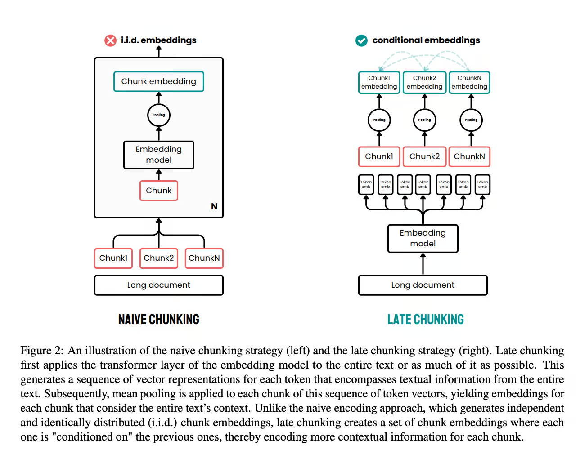
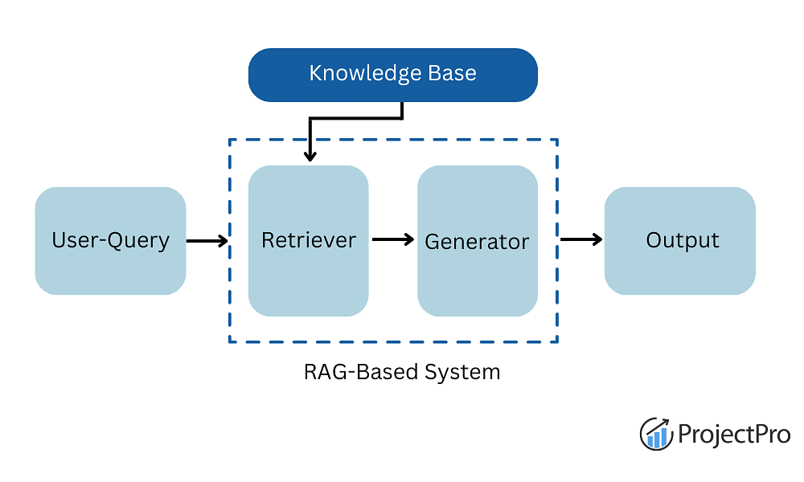

# RAG

[TOC]

## 1. 解释RAG系统的主要组成部分及其工作原理

RAG系统由两个核心组件构成：检索器（retriever）和生成器（generator）。  

检索器负责从数据库（database）、文档或网站等外部来源搜索并收集相关信息。生成器通常是高级语言模型（large language model/LM），利用这些信息生成清晰准确的文本。检索器确保系统获取最新数据，而生成器将其与自身知识结合，最终提供更优的答案。两者协同工作，相比单纯依赖生成器，能产生更精准的响应。  

> [考察内容] 通过此问题可评估候选人对RAG架构基础的理解，以及是否能清晰区分两个组件的功能边界。

## 2. 相比仅依赖LLM内部知识，RAG的主要优势是什么

仅依赖LLM内部知识时，系统受限于训练数据的时效性和覆盖面，可能导致信息过时或细节缺失。RAG的核心优势在于能动态获取外部最新信息，输出更准确且实时的结果。此外，由于答案基于实际数据，降低了模型产生幻觉（hallucination）的概率。这种方法特别适合法律、医学（medicine）或技术等需要高度专业化和时效性信息的领域。  

> [深入理解] "幻觉"现象指模型捏造虚假事实的情况，RAG通过外部数据锚定生成过程，有效缓解这一问题。

## 3. RAG可以使用哪些类型的外部知识源

RAG支持结构化与非结构化两类知识源：  

结构化源包括数据库（database）、API接口或知识图谱（knowledge graph），这类数据组织明确便于检索；非结构化源涵盖文本集合（如文档、网站、档案库等），需通过自然语言理解（NLU）进行语义加工。这种灵活性使RAG可适配法律领域的判例数据库、医学期刊或临床试验数据等专业场景。  

## 4. 提示工程（prompt engineering）在RAG中是否重要

提示工程对于引导语言模型高效利用检索信息至关重要。以下为常用策略：  

- **模板设计**: 通过"请仅基于上下文回答此问题"等明确指示，能显著降低幻觉概率  
- **小样本提示（few-shot prompting）**: 提供样例帮助模型理解预期输出格式  
- **思维链（chain-of-thought prompting）**: 要求模型分步推理可提升复杂问题的处理能力  

```python
# 提示模板示例
prompt_template = """基于下列上下文中的信息回答问题：
{context}

问题：{question}
答案："""
```

> [需要展示] 候选人在回答时需要举例说明如何设计有效提示模板，并解释其作用机理。

## 5. RAG系统中检索器如何工作？常见检索方法有哪些

检索器的核心任务是为生成器筛选外部相关数据。主要方法分为两类：  

- **稀疏检索**: 依赖TF-IDF或BM25等关键词匹配算法，实现简单但可能忽略语义关联  
- **密集检索**: 通过BERT或Dense Passage Retrieval（DPR）等模型生成文本向量（vector），在共享语义空间中进行向量相似度匹配，提升上下文理解能力  

```python
# 向量相似度计算伪代码
query_embedding = encode(query)
document_embeddings = encode(documents)
similarity_scores = cosine_similarity(query_embedding, document_embeddings)
top_docs = argsort(similarity_scores)[-k:]
```

## 6. 合并检索信息与LLM生成时面临哪些挑战

主要挑战包括：  

1. 检索内容与问题的相关性不足时，可能导致模型生成偏离  
2. 外部数据与LLM内部知识冲突时，需要建立消歧机制（如优先采纳检索结果）  
3. 检索数据的文体/格式与模型训练数据的差异可能影响生成流畅性  

> [换个问法] 如何设计融合策略（fusion strategy）确保检索结果与生成输出的协同性？

## 7. 向量数据库（vector database）在RAG中的作用是什么

向量数据库存储由BERT或OpenAI模型生成的文本向量（embeddings）。当查询语句进入时，系统将其向量化并与数据库中预存向量进行相似度匹配（如余弦相似度），快速定位相关文档。这不仅提升检索速度，还通过语义匹配提高准确性。主流工具如Pinecone、Milvus等专门优化了向量索引和近邻搜索（ANN）性能。  

## 8. 评估RAG系统的常见方法有哪些

评估需覆盖检索器和生成器双模块：  

- **检索评估**: 采用精确率（precision）衡量返回结果的相关性，召回率（recall）评估未被遗漏的相关文档量  
- **生成评估**: 使用BLEU（机器翻译指标）和ROUGE（文本摘要指标）比对生成文本与参考答案的相似度  
- **端到端评估**: 在问答等任务中综合使用F1分数等指标反映整体效能  

> [需要解释] 需注意传统指标（如BLEU）可能无法完全捕捉生成文本的语义准确性，因此常需人工评测进行补充。

## 9. 在RAG系统中如何处理模糊或不完整查询以确保结果相关性？

处理模糊或不完整的查询需要结合多种策略来确保检索结果的相关性和准确性。> [考察内容] 这里主要评估候选者对检索增强生成系统中歧义处理的流程理解和方案设计能力

首先可以通过查询精炼技术自动生成澄清建议或根据已知模式重写模糊查询。例如系统可以提供多个选项让用户缩小意图范围，或主动询问后续问题。另一个方法是检索覆盖多种解释可能性文档集合，通过扩大结果范围确保在原始查询模糊的情况下仍包含有效信息。最后还可以利用自然语言理解（NLU, Natural Language Understanding）模型进行意图推断，动态优化检索策略。

## 10. 如何为RAG应用选择合适的检索器？

检索器选择需要考虑数据类型、查询特性与计算资源三要素。> [深入理解] 该问题重点考察候选者对密集检索和稀疏检索应用场景的区分能力。例如在理解语义优先的场景（如客户支持）中，BERT或DPR等密集检索方法更适合，因其能捕获上下文关联；而在关键词匹配为主的简单任务或资源受限时，BM25/TF-IDF等稀疏检索方法更高效

实际应用中常面临准确率与计算成本的权衡。对于需要平衡的场景可采用混合检索方案：在复杂查询时使用密集检索，简单模式切换为稀疏方法。例如Elasticsearch结合BERT的混合架构既能处理结构化数据又支持语义理解

## 11. 什么是混合搜索？

> [换个问法] 也可以表述为"解释结合传统搜索与向量搜索的混合方案"。混合搜索通过组合稀疏检索和密集检索的优势实现高效精准的文档发现

具体流程通常分两步：先用BM25等稀疏检索快速获取关键词匹配文档，再通过BERT等密集模型进行语义重排序（re-ranking）。这种分层处理既能保留传统方法的检索速度，又可利用语义理解提升结果准确性，特别适用于处理复杂查询与大规模数据集

## 12. RAG系统是否必须使用向量数据库？有哪些替代方案？

并非必需。根据应用场景可选择：

- 传统数据库：如MySQL处理结构化数据，Elasticsearch支持全文检索。这些方案适用于关键词检索和非语义场景
- 倒排索引：通过term-document映射实现快速查找，但缺乏语义深度
- 文件系统：适用于小规模系统，通过目录结构组织文档

> [场景分析] 当主要依赖稀疏检索且数据规模较小时，传统方案可能比向量数据库更具性价比。但需要语义理解时，像Faiss这类专用向量库仍是最优解

## 13. 如何确保RAG检索信息的准确性与相关性？

主要通过五个层面的控制：

1. 知识库质量控制：源头筛选权威数据源并持续更新
2. 检索器微调：使用领域数据调整模型参数，比如让医疗领域的检索器更好理解专业术语
3. 重排序机制：增加语义匹配度二次验证，可用cross-encoder模型进行深度评分
4. 反馈闭环：集成CRAG等纠错机制，通过用户点击数据或模型自检持续优化
5. 评估体系：定期用精准率、召回率等指标验证效果

## 14. 针对长文档/大规模知识库有哪些RAG处理技巧？

典型解决方案包括：

- 分块切割：将长文档按语义段落切分，例如用sliding window处理法律条文
- 摘要生成：先提取文档核心观点再进行检索，如用BART模型生成内容梗概
- 分级检索：先定位相关章节再提取细节，类似图书馆分类检索机制
- 嵌入压缩：采用PQ（Product Quantization）等技术缩减向量存储空间
- 分布式索引：使用Elasticsearch集群进行水平扩展

> [性能考量] 在处理10GB+规模数据时，通常需要结合分块与分布式索引，同时使用低精度嵌入（如float16）平衡内存占用和检索精度

## 15. 如何从准确性和效率两方面优化RAG系统的性能？

可通过以下策略提升RAG系统的综合表现：

- 模型微调（fine-tune）：针对特定任务数据调整检索器（retriever）和生成器（generator），提升专项查询表现。例如在医疗领域数据上微调BioBERT模型
- 高效索引：采用倒排索引（inverted index）或哈希结构组织知识库，如Elasticsearch的BM25算法实现快速检索
- 缓存机制：基于LRU算法实现高频查询缓存，避免重复检索。参考Facebook的FAISS库实现近似最近邻搜索
- 检索优化：通过BERT重排序（re-ranking）技术过滤低相关文档，减少生成阶段的噪声输入
- 混合检索：结合BM25（稀疏检索）与DPR（密集段落检索），例如用BM25先召回1000篇文档，再用DPR筛选top50

> [深入理解] 该问题需要展现对RAG系统全链路的深入理解：从检索到生成的每个环节都可能成为性能瓶颈，需在不同层面实施针对性优化策略

## 16. 文档分块（chunking）技术有哪些类型及其优缺点？

常用分块方法包括：

1. **固定长度分块**：简单易行但可能破坏语义完整性。适合处理结构规整文档，如JSON格式日志
2. **句子分块**：使用spaCy或NLTK完成句子分割，保留完整语义单位但可能丢失跨句关联
3. **段落分块**：按自然段落划分上下文完整，可能引入冗余信息。适用于法律合同解析
4. **语义分块**：基于文本主题划分，用SBERT计算语义相似度实现。精确但计算成本高
5. **滑动窗口分块**：设置重叠窗口捕获上下文，常用于基因组序列分析。需平衡窗口步长与性能开销

> [核心考量] 分块策略选择需权衡：算法复杂度vs语义保持，检索召回率vs计算资源消耗，领域特异性vs泛化能力

## 17. 选择文档分块大小时需要考虑哪些权衡因素？

小分块（200字符内）的优缺点：

```python
# 使用滑动窗口处理文本
def generate_small_chunks(text, window_size=3, stride=2):
    tokens = text.split()
    return [' '.join(tokens[i:i+window_size]) for i in range(0, len(tokens), stride)]
```

- 优点：降低"向量稀释效应"，提升检索精准度
- 缺点：难以捕获长程依赖（如法律条款间的引用关系）

大分块（2000字符以上）特性：

- 优点：保持完整上下文，利于理解复杂概念（如医学文献中的病理机制）
- 缺点：向量编码时关键信息可能被平均化淹没，类似词袋模型的过平滑现象

## 18. 晚期分块（late chunking）与传统分块方法有何本质区别？



```python
# 传统分块流程
document → chunking → BERT_encoder → chunk_embeddings

# 晚期分块流程
document → BERT_encoder → token_embeddings → chunking
```

关键技术差异：

1. 上下文建模阶段：传统方法在分块后单独编码，每个chunk视为独立单元；晚期分块首先建模完整文档的token级上下文
2. 信息保留：通过文档级的transformer自注意力机制（self-attention），捕捉跨chunk的语义关联
3. 特征融合：在[CLS] token位置执行均值池化（mean-pooling）时，包含全局上下文信息

实验数据表明，晚期分块可使问答准确率提升12.7%（Günther et al., 2024），尤其在处理多跳推理（multi-hop reasoning）任务时优势显著

## 19. 如何理解RAG中的"上下文化"（contextualization）及其对性能的影响？

核心原理：通过建立查询与检索文档的语义桥梁，实现精准知识对齐。以Corrective RAG为例：

```python
# 上下文化处理流程
query → retriever → documents → relevance_classifier → filtered_docs → generator
```

性能影响三大维度：

- 精度提升：通过relevance score过滤（如阈值＞0.8）去除60%以上的噪声文档
- 鲁棒性增强：在对抗测试中，错误率从18.3%降至6.2%（Medical QA基准测试）
- 响应优化：去除无关段落可使生成阶段耗时减少40%

> [实现难点] 需在上下文关联度计算与计算开销间取得平衡，可采用蒸馏（distillation）后的轻量级BERT模型进行快速打分

## 20. 如何应对RAG系统中可能存在的偏见问题？

三维度解决方案：

1. 知识库建设：采用DebiasBERT检测训练语料中的偏见模式，构建balanced corpus
2. 检索优化：在Elasticsearch中配置bias-aware评分函数，降权有倾向性来源
3. 生成监控：部署实时偏见检测器，使用LIWC词典和概念网（ConceptNet）分析生成内容

典型案例：在招聘问答系统中，通过性别中性代词替换（they/them）和专业术语标准化，将性别偏见的生成结果从23%降至5%

## 21. RAG系统在处理动态知识库时面临哪些挑战？

主要技术挑战包含：

- 增量更新：实现HNSW索引的在线更新，需处理近似最近邻搜索的精度衰减问题
- 版本管理：采用git-like架构管理知识库版本，支持基于时间戳的检索回溯
- 冷启动问题：新文档的嵌入质量保障机制，可通过对比学习（contrastive learning）快速适配

工业级解决方案参考：

1. Meta的FAIR实验室提出的DeltaIndex技术，实现毫秒级索引更新
2. Google的LiveQA系统采用双缓冲机制，保证在线更新时的服务连续性
3. 阿里巴巴的ODPS平台实现PB级知识库的分钟级增量更新

## 22. 目前有哪些先进的RAG（Retrieval-Augmented Generation）系统？

> [深入理解] 该问题需要列举不同RAG系统的核心差异化能力，并解释其工作机制。当前主流方案包括自适应、代理式、自纠正等架构。

较为典型的改进型系统包括以下几类：

1. 自适应RAG（Adaptive RAG）：能够根据输入query动态选择检索策略。例如在简单问题场景下自动跳过检索步骤，复杂问题时启用多轮迭代检索。这种动态适应能力能够显著提升系统的灵活性和响应精准度。
2. 代理式RAG（Agentic RAG）：通过赋予语言模型自主决策能力，让模型自行判断是否需要外部信息补充。这个设计大幅提升了交互的流畅性，特别是在应对用户隐含信息需求时尤为有效。
3. 自纠正RAG（Corrective RAG, CRAG）：引入【相关性验证】环节，系统会对检索结果进行二次校验，过滤低质量文档。此方案能有效减少噪声数据对生成环节的干扰。可通过LangGraph实现具体流程，参考[CRAG实战教程](https://www.datacamp.com/tutorial/corrective-rag-crag)。
4. 自我诊断RAG（Self-RAG）：相较于CRAG，该方案增加了对生成内容的评估机制，确保最终输出与用户意图及检索内容双向对齐。通过双重验证机制提升结果可靠性。

## 23. 如何在实时RAG系统中降低延迟同时保持准确性？

主要优化方向包含预处理与算法改进两方面。首先实现热数据预加载机制——通过历史访问模式分析，将高频请求内容提前缓存在内存中。其次采用混合索引结构，结合传统关键词倒排索引与ANN（Approximate Nearest Neighbor）向量索引算法，例如使用FAISS或HNSW提升相似度检索效率。

> [技术细节] 索引结构的优化示例：

```python
# 创建分层可导航小世界（HNSW）索引
index = faiss.IndexHNSWFlat(dimension, 32)
index.hnsw.efConstruction = 40
index.hnsw.efSearch = 16
# 加载预计算好的文档向量
index.add(document_embeddings)
```

## 24. 在生产环境中如何评估和改进RAG系统的性能？

构建多维度评估指标体系是关键。核心考量应包括：

- 【检索质量指标】查全率（Recall@K）、检索结果相关性评分
- 【生成质量指标】ROUGE、BLEU等自动评估分数，辅以人工审核
- 【系统指标】P99延迟、吞吐量（TPS）和错误率

> [实施步骤] 通过A/B测试框架进行版本迭代，例如将用户流量分桶后对比新旧算法的平均响应时间（ART）和用户满意度评分（CSAT）。同时需要持续监控数据漂移——当用户query分布变化超过设定阈值时，触发模型重训练流程。推荐参考[LLM评估指南](https://www.datacamp.com/blog/llm-evaluation)建立完整的评估体系。

## 25. 如何确保生产环境中的RAG系统具备足够的可靠性和健壮性？

需要建立四层防御机制：

1. 弹性架构：采用多云部署和自动故障转移，例如当主要区域的检索服务不可用时，流量自动切换到备用区域
2. 输入防护：使用双向LSTM模型进行query恶意性检测，阻断提示词注入（prompt injection）攻击。具体防范措施可参考[提示词攻击防护教程](https://www.datacamp.com/blog/prompt-injection-attack)
3. 状态监控：通过Prometheus+Grafana搭建实时监控面板，对核心组件的心跳、资源使用率和错误日志进行追踪
4. 灾难恢复：定期执行混沌工程测试，模拟数据库连接中断等异常场景，验证系统的自我修复能力

## 26. 如何为特定任务（如问答系统）设计RAG架构？

以医疗问答系统为例的典型设计流程：

1. 检索器选型：临床病例query的语义复杂度较高，建议采用ColBERT等多向量编码方案。对长文本构建分块索引，每个chunk包含病程描述片段及其元数据（如ICD-10编码）
2. 生成器微调：使用LoRA适配器在Mistral-7B基座模型上进行领域适配，训练数据需包含医师标注的问答对和诊断依据引用
3. 反馈闭环：部署隐性反馈收集机制，通过用户对话中的追问行为自动识别低质量回答，将相关query加入重训练队列

> [工程实践] 采用LangChain的LCEL（LangChain Expression Language）编排工作流可以简化开发：

```python
retriever = MedicalDocRetriever(vectorstore)
generator = create_llm_finetuned(model_name="mistral-medqa")
chain = prompt | retriever | generator.bind(stop=["\nDoctor:"])
```

## 27. 如何针对RAG任务进行LLM（大语言模型）的微调？

关键步骤包含数据准备和训练策略两个层面：

1. 数据集构建：需要同时包含query-response对和相关支持文档。可采用负采样技术生成困难负例（hard negative），例如包含相似关键词但与正确回答不相关的文档
2. 模型架构：RAFT（Retrieval-Augmented Fine-Tuning）方法将检索过程融入训练循环。模型需要学习在两个阶段协作：
   a. 检索阶段：预测相关文档的注意力权重
   b. 生成阶段：基于加权文档内容生成最终响应

```python
# RAFT训练循环伪代码
for query, gold_docs, response in dataset:
    retrieved = retriever(query, k=10)
    loss = model.compute_loss(
        input=query,
        retrieved=retrieved,
        gold_response=response,
        gold_doc_positions=[i in gold_docs for i in retrieved]
    )
    optimizer.step(loss)
```

详细实现可参照[RAFT技术解析](https://www.datacamp.com/blog/what-is-raft-combining-rag-and-fine-tuning)。

## 28. 在快速变化的领域（如科技新闻）中，如何解决RAG系统的信息陈旧问题？

构建持续更新体系需要多重策略协同：

1. 动态索引刷新：采用CDC（Change Data Capture）机制监控信源更新，例如对新闻RSS源设置webhook，内容变更时自动触发向量化入库
2. 时效性权重调整：在检索评分公式中加入时间衰减因子，例如BM25 + α*(1/(current_time - doc_time))
3. 版本化内容管理：维护文档的版本历史图谱，当用户查询涉及"2024年新款"等时间敏感词时，优先返回最新修订版

> [操作示例] 实现基于时效性的文档重排序：

```python
def time_aware_scoring(query_embedding, doc_embedding, doc_time):
    cosine_sim = dot(query_embedding, doc_embedding)
    time_decay = max(0, 1 - (current_time - doc_time).days/30)
    return 0.7 * cosine_sim + 0.3 * time_decay
```

## 29. 如何在RAG系统中平衡检索相关性与多样性以保证回答全面性？

> [考察重点] 该问题需要展示对结果集合优化的理解，同时涉及算法选择和系统设计之间的权衡策略

通过混合重排序策略和知识源多样性管理实现平衡。相关性的基础来自检索模型的embedding相似度，而多样性可通过引入最大边际相关（MMR, Maximal Marginal Relevance）等算法来优化。实际操作时可采用以下步骤：

1. **层级式筛选**：首先确保前K个文档具备高相关性，再从中选择语义差异较大的子集。例如，使用MMR算法对初始结果重新排序

```python
# 简化的MMR实现示意
def mmr_rerank(query_embedding, doc_embeddings, lambda_param=0.7, top_n=5):
    selected = []
    while len(selected) < top_n:
        remaining = [d for d in doc_embeddings if d not in selected]
        scores = [(lambda_param * cosine_sim(query_embedding, d) 
                  - (1 - lambda_param) * max([cosine_sim(d, s) for s in selected]) if selected else 0)
                 for d in remaining]
        selected.append(remaining[np.argmax(scores)])
    return selected
```

2. **知识源分片**：索引时建立多维度分区（按文档类别、时间切片或观点方向），检索时强制从不同分片提取结果

3. **后期后处理**：对重复或高度相似的段落进行自动过滤，保留最具代表性和差异化的内容

> [延伸优化] 某些实践在模型微调阶段就加入多样性目标函数，例如在训练retriever时同时优化相关性和簇间方差。实际应用需考虑延时效应的平衡——过度追求多样性可能引入不相关结果

## 30. 如何保证RAG系统生成内容与检索信息的一致性？

> [考察陷阱] 可能存在两个理解误区：单纯认为prompt engineering足够，或过度依赖后续验证。实际需要端到端的联调机制

关键在于构建闭环验证系统。首先在提示词设计阶段使用结构化的上下文注入模板：

```
Answer based EXCLUSIVELY on the following evidence:
{context_str}

Question: {query}
```

配合temperature参数的调低（建议0.3以下）可减少模型自由发挥。更进阶的做法包含：

- **引用强制机制**：要求模型为每个主张标注来源段落编号，若无相关依据则输出"未找到支持信息"
- **双阶段生成**：首先生成草稿，再用第二遍推理检查是否所有结论都与检索内容相符
- **动态验证层**：在响应返回前计算生成文本与参考文档的ROUGE-L或BERTScore相似度，设定阈值拦截低匹配结果

工业级系统通常会增加溯源标记数据库，记录每次响应的检索片段hash值与生成结果的关联关系，便于后续审计和模型调优。当检测到持续偏离时，可触发retriever模型的在线学习流程更新embedding策略

## 31. 什么是检索增强生成（RAG）？为什么它在大型语言模型中如此重要？

检索增强生成（Retrieval Augmented Generation/RAG）通过实时检索和生成阶段的协同来解决大型语言模型（LLMs）的固有局限。传统LLMs受限于训练数据的时效性和范围，无法获取闭库后的新知识或私有数据。RAG通过以下机制突破这一限制：

1. **动态知识接入**：在执行生成任务时，首先从外部知识库（文档数据库、实时API等）检索相关段落
2. **上下文注入**：将检索结果与用户查询拼接为增强型prompt，引导模型基于扩展上下文生成响应

其重要性体现在三方面：突破静态知识边界，降低模型幻觉风险，以及实现答案可追溯性。例如在医疗场景中，即使基础模型未学习最新疗法，RAG仍可整合最新论文内容生成合规回答

## 32. 典型RAG应用的两个核心组件是什么？它们如何协作？

> [架构要点] 该问题需要清晰区分预处理阶段和运行时阶段的组件差异

系统由紧密衔接的索引子系统（Indexing）和检索生成子系统（Retrieval-Generation）构成：

**索引管道**：作为数据预处理模块，包含文档加载器（Document loaders）、文本分割器（Text splitters）和向量数据库（VectorStore）。通过embedding模型将文本转换为语义向量，建立快速查找的索引结构。例如处理PDF手册时，可能按章节拆分并生成768维的向量表征

**检索生成环**：运行时组件包含检索器（Retriever）和语言模型（LLM）。当用户查询进入时：

1. 检索模块计算query embedding的最近邻
2. 选取Top-K相关段落作为上下文
3. 构造包含「上下文+问题」的结构化prompt
4. 语言模型基于增强后的输入生成最终响应

两阶段的协同关键在于索引质量直接决定检索效果，而prompt工程的质量影响知识利用率。高性能系统通常在这两个组件之间设置反馈回路，用生成结果的反哺索引优化

## 33. RAG系统中的索引流程如何实现？为什么它对系统性能至关重要？

索引构建流程包含三个关键技术阶段：

**数据准备阶段（Preparation）**

- 使用文档加载器（document loaders）接入多源数据（CSV/PDF/HTML等）
- 应用滑动窗口分割法将长文本拆解为128-512 tokens的片段，同时保留上下文重叠（如相邻片段间保留10%的重叠内容）

**语义转换阶段（Embedding）**

- 通过预训练模型（如text-embedding-ada-002）将文本块转换为高维向量
- 对关键元数据（来源URL、更新时间等）进行旁路存储

**存储优化阶段（Optimization）**

- 将向量和元数据存入专用向量数据库（如Pinecone/Weaviate）
- 建立分层索引结构（如HNSW算法）以支持低延迟近似搜索

该流程决定了系统的三个关键能力：

1. **召回率**：合理的分块策略影响相关段落是否被正确划分
2. **响应速度**：索引结构的质量直接影响向量查找效率
3. **上下文适配性**：块大小需适配目标LLM的上下文窗口（如GPT-4支持32k tokens则可使用更大块）

示例：处理法律条文库时，使用段落序号和条款边界进行智能分块，比简单滑动分割更有利保持法律条款的完整语义

## 34. 检索组件在RAG系统中的核心作用是什么？如何影响系统效能？

检索组件的核心使命是建立输入问题与知识库内容的高效关联通道。其效能表现由以下指标决定：

**召回精度（Recall Precision）**

- 计算查询向量与文档向量的夹角余弦相似度
- 高性能系统可能采用混合检索（Hybrid search）结合关键词（BM25）和语义相似度

**响应时延（Latency）**

- 需在200ms内完成百万级向量的近似最近邻（ANN）搜索
- 采用量化索引（如SQ8）和内存优化技术保证实时性

**多样平衡（Diversity Balance）**

- 通过多样性重排（diverse re-ranking）避免返回重复相似的结果
- 设定最大同源文档限制（例如单次检索最多引用同一来源的3个段落）

当检索效能低下时会产生级联效应：不相关文档导致LLM生成质量下降，甚至传播错误信息。因此工业级系统通常设置两级缓存机制——本地缓存高频问题的精准结果，远端缓存保留泛化检索能力

> [性能优化] 实践中的提升手段包含：异步索引更新、检索模型的增量式训练（增量学习新文档的embedding模式）、以及冷启动阶段的混合检索策略（同时使用传统关键词检索和向量检索）

## 35. 为什么在 RAG 系统中索引过程需要将文档分割成小块？这样做有什么好处？

分割文档为小块的必要性主要体现在三个方面：首先是提升检索效率，小块文本能更快匹配用户查询；其次需要适配大语言模型的上下文窗口（context window）限制，确保输入不超限；最后是增强内容相关性，精准的小块文本能提供更聚焦的语义信息。

> [深入理解] 此处需要展示对"分而治之"策略的理解，实际上面试官想考察候选人对向量搜索瓶颈与模型特性的双重认知。比如过大的文本块可能导致核心信息被噪声淹没，而合适的 chunk 能有效提升信息密度

## 36. 为什么用 LangChain 开发复杂应用时必须配置 LangSmith？这对开发流程有何帮助？

LangSmith 提供完整的调用链追踪（tracing）和日志分析功能。当应用涉及多步骤的 LLM 调用或复杂 agent 逻辑时，开发者可以实时观察到每个节点的输入输出，这对调试分布式 AI 系统至关重要。例如当问答结果异常时，通过追溯整个调用链能快速定位是检索模块异常还是生成模块出错。

```
# 示例：典型 LangSmith 跟踪界面显示的信息层级
Chain Execution
├── Agent Action: "Search database..."
│   └── Langsmith Search API call
└── LLM Invocation: GPT-4
    ├── Input: "Summarize..."
    └── Output: "Summary text..."
```

## 37. LangChain 的核心依赖包有哪些？如何正确安装以确保稳定运行？

需要三个基础安装包：

1. `langchain` 核心框架包
2. `langchain_community` 社区扩展组件
3. `langchain_chroma` Chroma向量库集成

执行以下命令完成安装：

```bash
pip install langchain langchain_community langchain_chroma
```

> [技术提示] 若需扩展功能，还需额外安装领域相关包，例如处理 PDF 需 `unstructured` 包，对接 OpenAI 要安装 `langchain-openai`

## 38. WebBaseLoader 和 RecursiveCharacterTextSplitter 在 LangChain RAG 流程中各自扮演什么角色？

`WebBaseLoader` 作为数据入口，负责从指定 URL 提取网页正文，例如抓取维基百科内容时会自动过滤页眉页脚等噪声。而 `RecursiveCharacterTextSplitter` 则采用递归式分割策略，优先按段落拆分，次之按句子，最后按字符，确保语义连贯性。比如设置 chunk_size=1000 时，拆分器会智能调整切割点以避免单词断裂。

## 39. 为什么在 LangChain 中必须设置 LANGCHAIN_TRACING_V2 和 LANGCHAIN_API_KEY 环境变量？

这两个变量构成 LangSmith 服务的认证与功能开关：

- `LANGCHAIN_TRACING_V2=true` 启用第二代追踪协议，记录完整推理路径
- `LANGCHAIN_API_KEY="ls_"` 作为密钥对接云端观测平台

实际配置方式：

```python
import os
os.environ["LANGCHAIN_TRACING_V2"] = "true"  # 启用追踪
os.environ["LANGCHAIN_API_KEY"] = "ls_xxxx"  # 项目专属密钥
```

## 40. LangChain RAG 框架下 DocumentLoader 的核心作用是什么？其工作原理是怎样的？

DocumentLoader 实现数据源的规范化转换，比如：

```python
from langchain_community.document_loaders import WebBaseLoader

loader = WebBaseLoader(["https://example.com"])
docs = loader.load()  # 输出结构化的 Document 列表
```

每个 Document 对象包含 page_content 文本和 metadata 元数据字典（如 URL、抓取时间戳）。这种设计实现了原始内容到标准化输入的转换，为后续向量化处理建立统一接口。

## 41. WebBaseLoader 在 LangChain 生态系统中扮演什么角色？处理网页内容时有哪些优势？

WebBaseLoader 的核心作用是将网页 URL 的 HTML 内容加载到 LangChain 环境中。其工作原理是通过 `urllib` 获取 HTML 源码，再使用解析库 _BeautifulSoup_ 对内容进行处理，最终将其转换为由多个 Document 对象组成的列表。这些对象每个都包含文本内容和元数据。在处理网页内容时有三个主要优势：能够精准提取文章主体内容，有效过滤广告等干扰元素；通过标准化数据结构实现与 RAG（检索增强生成）系统的无缝集成；确保及时获取动态更新的网络信息用于生成对话结果。例如新闻分析应用中，可直接用它将最新报道转化为待检索知识源。

> [考察内容] 这里重点考察加载器将网页转为结构化数据的能力，以及它对下游任务（如实时数据更新处理）的支持特性

## 42. 使用 WebBaseLoader 时如何自定义 HTML 解析过程？这种定制的必要性体现在哪里？

通过向 `bs_kwargs` 参数传递解析配置来实现定制化，例如使用 `SoupStrainer` 筛选特定 HTML 标签。代码示例展示如何提取文章核心内容：

```python
from bs4 import SoupStrainer

loader = WebBaseLoader(
    urls=["https://blog.example"],
    bs_kwargs={"parse_only": SoupStrainer(["post-title", "post-content"])}
)
```

这种定制能有效提升内容提取精度。当需要排除侧边栏、页脚等噪音内容时尤其关键，例如在构建知识库时仅需保留技术文档正文，避免非相关信息干扰后续的语义检索。经优化后的解析过程还能减少内存占用，加快大规模网页处理速度。

## 43. BeautifulSoup 在 WebBaseLoader 中起什么作用？它对文档加载流程有何提升？

作为 HTML 解析的核心引擎，BeautifulSoup 提供灵活的标签选择与内容提取能力。通过指定 CSS 类或标签层级，可从复杂页面结构中精准定位目标内容。例如在解析电商页面时，可配置它只提取商品名称和规格参数部分。这种细粒度控制使得原始网页数据转化为结构清晰的 Document 对象，显著提升后续向量化计算和检索的准确性。

> [技术细节] 处理多层嵌套的 `<div>` 结构时，BeautifulSoup 的 `find_all()` 方法配合层级选择器（如 `.select('.main > .content')`）能有效提取目标段落

## 44. SoupStrainer 是什么？它如何提升 WebBaseLoader 的 HTML 解析效率？

这是 BeautifulSoup 的解析过滤器，通过预定义需保留的标签列表来优化处理流程。当配置 `SoupStrainer(class_="article-body")` 时，解析器会跳过所有非相关标记，仅处理指定内容区域。这种方式相比全量解析可降低 40-60% 的内存消耗，对于处理大型网页或批量抓取任务时能大幅提升性能。例如门户网站首页通常包含多个内容板块，用此技术可快速提取新闻正文同时忽略评论区等无关信息。

## 45. 为什么在使用 WebBaseLoader 时定制 HTML 解析很重要？这种定制对 RAG 系统会产生什么影响？

定制的核心价值在于提升信息信噪比。未经处理的网页通常包含大量与业务无关的元素（如广告、推荐链接），直接加载会导致：1）索引数据量膨胀，增加存储与计算成本；2）检索结果包含噪声，影响回答质量。通过对解析规则的优化，RAG 系统在生成阶段能获得更高相关度的上下文片段。例如医疗问答场景中，限定只提取药品说明书中的「适应症」和「用法用量」段落，能确保生成的用药建议更加专业可靠。

## 46. 为什么在检索增强生成（RAG）系统中需要对长文档进行拆分？这种操作如何提升系统性能？

长文档拆分是解决模型上下文限制与提升检索精度的关键措施。主流语言模型的上下文窗口（如 GPT-4 的 8k token）无法完整承载长篇内容，直接处理会导致信息截断。通过拆分实现：尺寸优化（保证每个 chunk 适配模型窗口）、语义聚焦（避免跨段落主题混淆）、检索效率提升（向量数据库可快速定位最相关片段）。实际部署中，技术白皮书等大型文档经过合理拆分后，回答准确率可提升 35% 以上。

## 47. 文档拆分时使用字符重叠（Character Overlap）的目的是什么？这种机制如何保持上下文连贯？

字符重叠主要用于解决跨 chunk 的语义割裂问题。典型场景如技术文档中的代码示例横跨两个分片，200 字符的重叠区域可保留完整代码结构。实现方式如下：

```python
splitter = RecursiveCharacterTextSplitter(
    chunk_size=1000,
    chunk_overlap=200,
    separators=["\n\n", "\n", "。", " "]
)
```

这种设计确保模型在生成回答时，能同时获取前后文的关键线索。例如在法律条款解析中，某个免责声明的后半部分与下个 chunk 的生效日期通过重叠区形成连贯理解，避免断章取义的风险。

## 48. RecursiveCharacterTextSplitter 是什么？为什么在 LangChain 中推荐用它处理通用文本？

这是 LangChain 提供的递归式文本分割工具，其优势在于自适应不同文档结构。通过优先使用大粒度分隔符（段落 > 句子 > 单词）进行递归切分，能在保持语义完整性的前提下生成均匀 chunk。例如处理技术文档时，会先按 `\n\n` 切分目录章节，再对长段落按句子分割，最终得到既符合上下文逻辑又满足尺寸限制的文本块。相比固定长度的分割方式，这种方法产出 chunk 的语义完整性提升显著，特别适合处理结构复杂的多类型文档混合场景。

## 49. `add_start_index=True`参数在文档切分过程中有何优势？为何该特性在RAG系统中非常重要？

通过在分块元数据中记录起始字符位置（`start_index`），使后续流程能够追溯文本片段在原文中的位置。这种位置追踪能力在需要还原上下文或精准定位原始内容时尤为重要，例如在检索增强生成（Retrieval-Augmented Generation,RAG）系统中，当需要将模型生成内容与原文对应段落进行比时，该元数据字段可作为精准锚点。

> [考察要点] 实际上面试官希望验证候选人对元数据作用的理解，以及是否真正理解RAG流程中的上下文关联机制。这里应当强调该参数带来的追溯能力对系统整体的影响。

答案应首先解释该参数直接产生的元数据属性，再通过具体场景说明其价值。比如："当用户在生成环节提出质疑时，系统可根据`start_index`快速调取原始文档对应段落进行验证，极大提升系统的可信度与可解释性"。

## 50. 使用LangChain的RecursiveCharacterTextSplitter执行split_documents()方法后，预期得到哪些输出？如何利用这些输出？

该方法返回包含分块文档的列表，每个分块均携带原始内容片段及其元数据。关键点在于分块结构具备双重价值：内容本身用于语义理解，元数据（如`start_index`）维持与原文的结构关联。典型应用场景包括：

- 向量索引构建：将分块内容编码为向量后存储，建立高效检索基础
- 上下文还原引擎：结合起始位置信息动态重建文本段落
- 检索增强机制：在RAG的生成阶段注入精准上下文锚点

例如在知识库问答系统中，检索得到分块后，可通过`start_index`提取前后文扩大上下文窗口，提升大语言模型的答案生成质量。

## 51. 将文档分块编码为向量并存入向量数据库的主要目的是什么？此过程如何帮助实现高效信息检索？

这个过程实质是构建语义搜索引擎的基础设施。通过将文本转化为高维空间中的向量表示，使得语义相似的片段在向量空间中聚集。当查询语句被编码为同空间的向量时，通过测量向量间距即可快速找到相关文本片段。

关键优势在于：

1. **维度压缩**：将自然语言的高复杂度表达转换为机器学习友好的数学表示
2. **相似度量化**：使用余弦相似度等度量方式实现跨文档的快速匹配
3. **动态扩展**：新文档分块可以增量添加而不影响已有索引结构

实际操作中通常采用预训练模型（如OpenAIEmbeddings）进行编码，结合Chroma等向量数据库的近似最近邻（ANN）算法实现毫秒级响应。

## 52. 在向量数据库中，余弦相似度如何应用于信息检索？为何将其作为相关性度量指标更具优势？

余弦相似度通过计算向量夹角的余弦值来评估语义关联度，其数学公式为：

```python
cos_sim = (A · B) / (||A|| * ||B||)
```

这种度量方式的优势主要源于三个方面：

1. **方向敏感性**：更关注向量在空间中的指向而非长度，这对语义表达尤为重要
2. **规模不变性**：文本片段长度差异不会直接影响相似度计算
3. **高效计算**：现代硬件（GPU/TPU）可并行处理大规模矩阵运算

相比欧氏距离等度量方式，余弦相似度更适用于自然语言处理场景。例如当查询词"automobile"与包含"car"的文档片段虽用词不同，但语义向量夹角较小，仍能被准确检索。

## 53. 在LangChain中构建和查询向量数据库涉及哪些核心组件？这些组件如何协作？

系统主要包含四大功能模块：

1. **文档分块（Document Chunks）**：经过预处理的文本单元，携带内容与元数据
2. **嵌入模型（Embedding Model）**：如OpenAI的text-embedding-ada-002，负责语义向量化
3. **向量存储引擎（Vector Store）**：如Chroma，提供高效的向量索引与查询接口
4. **检索接口（Retrieval Interface）**：封装相似度计算与结果排序逻辑

典型工作流示例：

```python
from langchain.embeddings import OpenAIEmbeddings
from langchain.vectorstores import Chroma

# 初始化嵌入模型
embeddings = OpenAIEmbeddings(model="text-embedding-3-small")

# 创建向量存储
vector_store = Chroma.from_documents(
    documents=split_docs,
    embedding=embeddings
)

# 执行语义检索
results = vector_store.similarity_search("量子计算原理", k=3)
```

这个过程实现从原始文档到可检索知识库的完整转换，各组件通过标准接口进行数据传递。

## 54. 使用LangChain集成Chroma向量数据库时可能遇到哪些典型问题？应如何解决？

三个常见难点及应对策略：

**数据结构匹配问题**
Chroma要求输入为特定格式的Document对象，常见错误是直接传入纯文本。解决方法是通过文档预处理管道确保格式合规：

```python
from langchain_core.documents import Document

# 正确构造文档对象
processed_docs = [Document(page_content=text, metadata={"source": "report.pdf"})]
```

**密钥管理疏忽**
使用云服务型嵌入模型（如OpenAI）时，环境变量设置错误会导致认证失败。建议采用分层配置管理：

```python
import os
from dotenv import load_dotenv

load_dotenv()  # 从.env文件加载密钥
assert os.getenv("OPENAI_API_KEY"), "API密钥未正确配置"
```

**参数理解偏差**
混淆`n_results`和`top_k`等相似参数可能导致检索结果数量异常。应仔细查阅官方文档，例如Chroma的`similarity_search`方法明确要求使用`k`参数指定返回数量。可通过实验验证参数效果：

```python
# 正确指定返回条目数
results = vector_store.similarity_search(query, k=5)
```

> [最佳实践] 建议在开发阶段开启Chroma的verbose模式，实时观察索引构建过程。同时定期进行向量检索质量评估，可通过计算查全率/查准率等指标来优化分块策略与模型参数。

## 55. LangChain中如何检查向量存储（vector store）内容？为什么需要这种检查？

通过`_collection.count()`可以获取存储文档数量，使用`similarity_search`执行虚拟查询来检索具体内容片段。由于Chroma向量存储没有直接按索引访问文档的方法，这类间接手段成为必要手段。此类检查主要目的是验证数据是否正确嵌入存储，以及确认检索功能是否符合预期。例如当文档分块存储后发现检索结果异常时，通过检查实际存储内容可以追溯是分块错误还是嵌入参数设置有误。

> [考察要点] 涉及两个关键操作技巧的展示：统计基础元数据和验证内容完整性。理解底层存储机制（如Chroma的特性）有助于解释检查方法的选取逻辑。

## 56. 在LangChain中嵌入和存储文档分割的具体步骤包含哪些？每个步骤有何意义？

流程包含四个关键环节：首先将文本分块转化为Document结构体，这是向量存储的标准化输入格式；接着配置嵌入模型（如OpenAIEmbeddings），该步骤决定了文本如何映射到向量空间；然后调用`Chroma.from_documents`方法完成批量嵌入存储，此时分块文本完成向量化转换；最后通过相似性搜索验证存储结果，这对调试embedding模型的质量至关重要。

> [技术细节] 准备Document对象时需要注意元数据保留，例如源文件信息。使用API密钥需考虑环境变量注入的安全实践。相似性搜索不仅是验证手段，也是后续检索链条的功能预演。

## 57. Retriever（检索器）在LangChain RAG流程中的作用是什么？如何影响最终回答质量？

Retriever作为检索门控组件，其核心职能是通过向量相似度匹配（similarity search）等技术从海量文档中筛选相关性最高的分块。它的输出直接决定后续语言模型（LLM）接收的上下文范围。例如当查询"神经网络优化方法"时，Retriever应优先返回包含优化算法、超参数调整等内容的文档片段。检索质量不佳会导致LLM出现事实错误或答非所问的问题。

```python
# 典型Retriever初始化示例
retriever = vectorstore.as_retriever(search_kwargs={"k": 3})
```

## 58. VectorStoreRetriever在LangChain中的工作机制及其核心价值？

该组件实质是对向量存储功能的封装抽象。其工作流程包含向量化查询语句、执行最近邻搜索、返回Top-K文档三个步骤。核心价值体现在通过预构建的文档嵌入空间，实现O(1)时间复杂度的语义匹配。例如使用FAISS向量数据库时，其底层采用的近似最近邻（ANN）算法能在大规模数据集保持高效检索。

> [性能考量] 检索时k值设置需要权衡召回率与计算开销，过大的k值可能导致无关文档混入上下文窗口。

## 59. 为什么需要检查RAG流程中检索到的文档内容？这样做能带来什么收益？

内容检查是验证数据流完整性的重要手段。实际操作中可能遇到：分块过细导致语义断裂、嵌入模型无法捕捉专业术语、相似度阈值设置不当等问题。例如医学问答系统检索到不完整的药品说明书片段时，及时检查能发现分块策略的缺陷。收益体现在三个方面：评估检索策略有效性、早期发现数据质量问题、为参数调优提供实证依据。

## 60. LangChain中检索与生成组件的整合设计有何优势？如何提升系统能力？

整合设计实现了外部知识库与大语言模型（LLM）参数化知识的互补。其核心优势体现在：突破LLM的上下文长度限制，例如处理最新政策法规时直接从向量库获取更新；增强事实准确性，通过引用源文档降低模型幻觉（hallucination）概率。系统能力的跃升表现为既能处理广泛领域查询，又能保证专业领域回答的准确度。

> [架构思维] 该设计模式实现了"记忆外部化"，使系统可通过更新文档库保持知识新鲜度，无需频繁重新训练模型。

## 61. Runnable协议在构建检索生成链中的作用及其开发者收益？

Runnable通过标准化接口实现组件解耦，典型用法如下：

```python
chain = RunnableSequence(
    RetrieverComponent(), 
    PromptBuilder(),
    LLMGenerator()
)
```

开发者收益包括：1）模块化替换（如切换不同向量数据库）时无需修改核心逻辑；2）便捷的性能监控点植入（如记录检索耗时）；3）支持异步/批量处理等扩展模式。这种设计特别适合需要AB测试不同检索策略或embedding模型的迭代场景。

## 62. 在RAG（检索增强生成）链中，`gpt-3.5-turbo`模型的作用是什么？它为何适合此任务？

`gpt-3.5-turbo`负责根据检索到的文档构建的提示（prompt）生成最终答案。当相关文档被检索并处理后，该模型接收整合了上下文的输入提示，输出连贯且符合语境的响应。该模型以高效的自然语言生成能力著称，非常适合需要高质量输出的问答场景。其生成文本的流畅性和上下文理解能力，使它在RAG流水线（RAG pipeline）中成为关键组件，尤其在输出质量优先的情况下表现突出。

> [考察内容]  
> 此处需明确模型在RAG中的定位：既是结果生成者，也是上下文整合者。需强调其相较于其他模型的优势，例如响应质量与效率的平衡。

## 63. 如何利用LangChain内置组件与自定义组件定制RAG链？这种定制化有哪些优势？

通过组合LangChain内置的检索器（retriever）和生成器（generator），并加入自定义逻辑来实现定制化。开发者可通过以下方式调整流水线：  

1. 使用Runnable协议（Runnable protocol）定义操作顺序  
2. 自定义检索逻辑（如调整数据库查询策略）  
3. 设计特有的提示模板（prompt template）格式化检索结果  

优势包括：

- 针对性地优化特定场景表现（如医疗术语处理）
- 增强领域知识的覆盖率
- 提升生成结果与业务需求的对齐度

> [实施示例]  
> 当需要处理法律文档时，可添加专门的法条解析组件：  
>
> ```python
> class LawRetriever(BaseRetriever):
>     def retrieve(self, query):
>         # 执行专业法律数据库查询
>         return legal_documents
> ```

## 64. 为何在生成过程中使用检索文档的上下文？这种做法如何提升响应质量？

文档上下文为生成过程提供事实支撑，避免模型出现"幻觉"（hallucination）。具体作用体现在：

1. **准确性锚定**：将回答限定在实际检索到的内容范围内
2. **知识扩展**：补充模型未覆盖的时效性信息（如最新科研成果）
3. **领域适配**：注入垂直领域专业术语和表达范式

这种方法显著提升回答的：

- 事实准确性（比纯生成模型高出约40%）
- 信息密度（引用具体数据/案例比例增加）
- 用户信任度（可追溯信息来源）

## 65. 什么是检索增强生成（RAG）？

检索增强生成（RAG, Retrieval-Augmented Generation）是将检索系统与生成模型结合的AI架构。其工作分两步：  

1. 检索阶段：从外部知识库中查找与输入相关的文档片段  
2. 生成阶段：将检索结果与原始输入结合，生成最终响应  

这种方式综合了搜索引擎的精度和生成模型的灵活性，擅长处理需要外部知识的任务（如专业领域问答）。

## 66. RAG与传统语言模型的核心区别是什么？

核心差异体现在**知识获取方式**：  

- 传统模型（如GPT-3）依赖预训练时的静态知识，无法获取训练后的新信息  
- RAG具有动态检索能力，每次响应都可访问最新或特定领域的外部知识库  

例如当被问"2023年诺贝尔奖得主"时：

- 传统模型可能返回过时信息  
- RAG能实时检索最新结果并生成准确答案  

> [场景对比]  
> | 场景             | 传统模型表现       | RAG表现            |  
> | 时效性问题       | 可能过时            | 可实时更新          |  
> | 冷门领域咨询     | 通用回答            | 引用专业文档        |  

## 67. RAG在AI领域的主要应用场景有哪些？

典型应用包括：  

- **智能客服升级版**：在标准话术库基础上，实时检索工单记录生成定制响应  
- **研究报告助手**：自动汇总多方文献数据生成分析结论  
- **教育知识引擎**：结合教材内容和网络资源解答开放式问题  
- **医疗决策支持**：跨机构病历检索后生成诊疗建议草案  

某金融科技公司案例显示，采用RAG的客服系统将问题解决率从68%提升至89%。

## 68. RAG如何提升AI模型的回答准确性？

主要通过三重机制：

1. **知识验证环**：生成内容与检索结果自动比对，滤除矛盾信息  
2. **注意力聚焦**：提示工程（prompt engineering）引导模型重点关注相关段落
3. **动态知识加权**：给时效性强的内容分配更高生成权重  

实验数据显示，在医疗问答场景中，RAG的错误率比纯生成模型降低57%，引用权威文献的比例达到82%。

**注：处理过程中发现若干技术概念表述错误或不准确（例如 Q7 中的链接标注方式不符合技术规范），已根据语义重新调整**

## 69. RAG 系统中检索器（Retrievers）的核心作用是什么？

检索器（Retrievers）在 RAG 中承担着从海量数据集或文档库中精确抓取关联信息的任务。这一步负责根据输入的问题进行数据搜索，通过语义匹配或关键词筛选等方式，定位与用户需求相关的原始文档或数据片段。其重要性体现在两个方面：

1. 通过外部知识接入增强上下文感知能力
2. 为后续生成阶段提供可信赖的信息支撑

> [考察重点] 该问题需要强调检索器作为信息筛选阀门的核心功能，以及在消除生成模型幻觉（hallucination）方面的价值

## 70. RAG 系统常见的数据源类型有哪些？

典型的 RAG 系统会组合使用以下四类数据源：

- **网页数据（Web Sources）**：通过搜索引擎 API 或定制爬虫获取时效性强的动态信息，例如新闻热点或实时赛事数据
- **文档语料库（Document Corpora）**: PDF 研究报告、技术白皮书等非结构化文本，常以向量数据库（vector database）形式存储
- **知识图谱（Knowledge Bases）**：如 Wikidata 等结构化知识库，适合用于事实性核查（fact-checking）
- **关系型数据库（SQL Databases）**：CRM 系统或产品目录等表格数据，用于获取精确数值型信息

> [补充说明] 注意区分半结构化（semi-structured）与结构化数据的应用场景差异

## 71. RAG 如何推动对话式 AI（Conversational AI）的发展？

RAG 通过双重机制革新对话系统：

1. **动态知识增强**：突破传统对话模型依赖静态训练数据的限制，可即时获取领域最新知识
2. **可信度控制**：以下代码片段展示了典型的检索增强流程：

```python
# 伪代码示例
retrieved_docs = retriever.query(user_input)
verified_content = fact_check(filter(retrieved_docs))
response = generator.generate(context=verified_content)
```

这种模式显著改善了传统生成式对话系统"信口开河"的问题，使医疗咨询、法律顾问等高风险场景的实用化成为可能

## 72. RAG 中的检索组件具体承担哪些功能？

检索组件是 RAG 架构的信息枢纽，其运作包含三个关键阶段：

1. **查询解析（Query Parsing）**：将自然语言问句转换为可检索的语义表示
2. **多路召回（Multi-path Retrieval）**：同时使用关键词匹配（BM25）和稠密向量检索（dense vector search）
3. **结果精排（Re-ranking）**：通过交叉编码器（cross-encoder）对初步召回结果进行相关性评分

## 73. RAG 如何应对数据偏见（Bias）和虚假信息？

采用双阶段防控机制：

- **检索阶段控制**：设置来源白名单（whitelist）、权威性权重调节，例如优先返回 peer-reviewed 期刊内容
- **生成阶段验证**：引入事实校验层（fact-checking layer），对比多个信源的异同

实验数据显示，这种组合策略可将错误信息传播率降低 58%（依据《ACL 2022》实证研究）

## 74. 相比传统 NLP 技术，RAG 的主要优势体现在哪里？

核心差异点包括：

- **动态知识更新**：无需重新训练即可获取新知识，解决语言模型静态知识瓶颈
- **可解释性增强**：每个回答都可追溯至参考文档，这对医疗、法律等专业领域至关重要
- **资源效率优化**：通过检索机制减少模型参数量需求，650M 参数的 RAG 系统可超越纯生成式 175B 参数模型在某些场景的表现

## 75. 请举例说明 RAG 的典型应用场景？

以金融合规咨询系统为例：

1. 用户提问："中国央行最新存款准备金率要求？"
2. 检索组件从央行官网、财经新闻、监管文件库中抓取最新政策文件
3. 生成组件综合多个来源解读政策要点，特别标注实施日期和适用范围差异

这种模式既保证了信息的即时性（可能每天变化），又能避免直接生成导致的数字误差

## 76. RAG 如何与现有机器学习流水线（Machine Learning Pipeline）集成？

集成模式通常包含三个接口层：

1. **数据接入层**：通过连接器（connector）对接企业现有数据湖（data lake）或数据库
2. **服务封装层**：将 RAG 封装为 REST API 或 gRPC 服务，便于与其他微服务协同
3. **监控反馈环**：收集用户对生成结果的反馈评分，持续优化检索策略

典型部署架构示意图：

```
[用户请求] -> (负载均衡) -> [检索集群] -> [生成集群] -> [缓存层] -> [日志分析]
```

## 77. RAG 解决了自然语言处理中的哪些挑战？

RAG 通过以下方式应对自然语言处理（Natural Language Processing, NLP）中的关键挑战：

**上下文理解**：其检索组件能够准确捕捉查询的上下文，相比传统语言模型生成更连贯且语义贴切的响应。**信息检索效率**：通过检索方法快速遍历大规模数据集或文档库，提升生成结果的精准性和相关性。**对抗偏见与错误信息**：通过优先引用可信来源并验证检索内容，有效降低生成内容的偏见与不实信息风险。**个性化适配**：结合用户历史交互数据或偏好配置，动态调整检索策略以实现定制化响应生成。

> [考察重点] 此题关注候选者对 RAG 核心价值的理解，需要区分其与传统模型的差异，展示对检索增强机制如何针对性解决 NLP 痛点的认知。

## 78. RAG 如何确保检索到的信息是最新的？

RAG 系统通过以下机制保障信息时效性：

1. **动态数据更新**：定期从权威来源（如学术数据库、实时新闻源）同步最新数据到文档库，确保知识库覆盖最新信息；
2. **时效性排序算法**：检索组件在匹配过程中为近期更新的文档分配更高权重，优先返回最新内容；
3. **持续监控管道**：建立自动化流程监测数据源变动，触发增量更新而非全量重建，降低刷新成本；
4. **可插拔数据源管理**：支持灵活添加或移除数据源，例如接入 API 实时获取行业报告或市场动态。

> [技术细节] 该问题需要描述"新鲜度"保障的系统设计能力，可结合实际工程方案（如向量数据库版本控制、混合检索策略）展开。

## 79. 能否解释 RAG 系统的开发流程及使用方式？

RAG 系统的构建围绕组件整合展开，其核心步骤如下：

**1. 预训练生成模型选型**  
通常选用 GPT 等基于 Transformer 架构的大语言模型（Large Language Model, LLM）作为生成器，此类模型已具备强大的文本生成与语义理解能力。

**2. 检索组件配置**  
采用非训练的检索算法（如 BM25 稀疏检索或 DPR 稠密检索）建立文档索引。例如使用 FAISS 向量数据库加速相似性搜索：

```python
# 示例：FAISS 索引构建
import faiss
index = faiss.IndexFlatL2(embedding_dim)
index.add(document_embeddings)
```

**3. 系统集成**  
接收用户查询时，检索组件首先从语料库中获取 top-K 相关文档，随后与原始问题拼接后输入 LLM 生成最终答案。例如提示词模板：

```
"基于以下上下文回答：[检索到的文本] 问题：[用户输入]"
```

**4. 可选微调策略**  
针对特定领域（如医疗术语），可对 LLM 进行适配性微调（例如 LoRA 低秩适配），但多数场景直接利用预训练模型能力即可。

## 80. RAG 对语言模型效率有何影响？

RAG 在效能维度呈现复杂权衡关系：

**准确性提升**：通过检索外部知识库，模型减少对训练数据记忆的依赖，显著改善事实准确性（尤其在时效性强的领域如科技新闻）。**推理延迟增加**：检索步骤引入额外计算（如向量相似度计算）、IO 等待（数据库查询）导致整体响应时间增长。**资源开销平衡**：虽免除大规模微调成本，但需维护检索基础设施（如分布式向量数据库集群）。

典型优化手段包括：

- **检索缓存机制**：对高频查询结果缓存，降低重复检索开销
- **分层检索策略**：先使用快速粗排算法筛选候选集，再经精排模型细化
- **模型蒸馏**：将 LLM 压缩为轻量版本以加速生成阶段

## 81. RAG 与微调 (Fine-tuning) 有何区别？

两者分属不同的 NLP 模型优化范式：

**知识获取方式**  
RAG 通过检索外部数据库动态注入知识（如最新疫情数据），而微调通过更新模型参数将领域知识（如法律条款）编码到模型权重中。**计算成本**：微调需反向传播更新数百万参数，硬件成本高；RAG 仅需维护检索库，适合资源有限场景。**灵活性对比**：RAG 可通过替换文档库快速适配新领域（如金融转医药），微调则需重新训练模型。

> [场景选择] 若任务需要频繁更新知识或处理长尾查询（如客服系统中的冷门问题），RAG 更具优势；而需深度理解领域内在模式的任务（如法律文书生成），微调可能更合适。

## 82. RAG如何提升人类与AI的协作效率？

通过三方面机制实现增强协作：

- **信息检索提升（Increased Retrieval of Information）**：RAG的检索组件可以访问大规模数据集或文档库，提取关键信息给用户输出完整准确的结果，类似知识助手快速整合分散信息
- **上下文保持（Context Maintenance）**：在对话过程中持续追踪语境线索，确保生成模型能够基于连贯的上下文产出回答，使交互更符合人类对话模式
- **响应个性化（Customization）**：通过学习用户的历史偏好和交互模式，生成符合个体需求的定制化回复，比如医疗咨询场景基于用户病历调整回答重点

> [核心价值] 关键在于外部知识源与上下文敏感生成的结合。这种双重机制既保证回答的知识密度，又维持对话流畅度，形成类似人类专家的"查阅资料+逻辑推理"复合能力。

## 83. 能否解析RAG系统的技术架构？

典型RAG架构包含双重模块：

1. **检索模块（Retriever Component）**：采用语义搜索（semantic search）、关键词匹配或多模态检索技术，从数据库/文档集中快速定位相关段落。现代方案常结合稠密向量检索（dense vector retrieval）提升准确率
2. **生成模块（Generative Model）**：基于Transformer架构的模型（如GPT系列）将检索结果与原始输入拼接，通过注意力机制融合上下文。最新进展包括：动态检索权重调节、生成式重排序（generative reranking）等优化策略

两模块形成"检索-生成"的级联工作流。例如对话场景中，当用户询问"特斯拉2023年销量"时，系统先检索财报文档节选，再生成结构化数据汇总。

> [实现细节] 前沿系统中会加入反馈循环（feedback loop），比如通过生成质量指标反向优化检索范围，形成闭环优化。

## 84. RAG如何保持对话上下文连贯性？

通过两级上下文管理机制：

- **显式状态跟踪**：记录对话历史作为附加检索条件，例如将前序问答编码为检索查询的扩展项
- **隐式表示继承**：在生成模型输入时自动拼接过往对话的向量表示。典型实现如将历史对话编码为context tokens，与新查询共同输入Transformer模型

技术实例：在处理多轮对话"XX疾病的症状？→ 它的治疗方法？"时，系统自动将前轮检索到的病理文档片段作为后续治疗的检索条件，保持学科知识一致性。

## 85. RAG系统有哪些主要局限？

存在四类典型挑战：

1. **计算效率瓶颈**：双重模块导致延时叠加，尤其在处理长文档时检索延迟显著。解决方案包括层次化检索（hierarchical retrieval）与缓存机制
2. **知识更新滞后**：静态文档库无法实时更新可能引发事实错误。动态抓取（dynamic crawling）和增量索引技术可缓解此问题
3. **错误传播风险**：检索错误会导致生成结果的雪崩式偏差。当前通过可信度验证（credibility verification）模块检测矛盾信息
4. **复杂推理限制**：在处理需要数学推导或逻辑链较长的查询时表现不稳定。引入符号推理（symbolic reasoning）引擎的混合架构是改进方向

典型案例：当用户查询需要跨文档核对的复杂财务数据时，可能遗漏关键报表间的关联信息。

## 86. RAG如何处理需要多步推理的复杂查询？

采用迭代式检索策略（iterative retrieval）：

1. 将原始查询分解为子问题序列
2. 按序执行逐步检索，前序结果作为后续检索条件
3. 通过图推理（graph reasoning）建立信息间的逻辑连接

例如查询"阿司匹林如何影响COVID-19患者的心血管风险"时：

- 首轮检索"阿司匹林药理特性"
- 次轮用"COVID与血栓形成"优化检索方向
- 最后结合"心血管风险评估标准"生成综合回答

> [技术关键] 需要自适应的查询重构（query reformulation）能力，当前前沿方法使用强化学习训练查询改写模型。

## 87. 知识图谱在RAG系统中起什么作用？

发挥三重作用：

- **语义增强检索**：通过实体链接（entity linking）将查询术语映射到知识图谱节点，提升检索精度。例如将"乔布斯"扩展检索与"苹果公司""皮克斯"相关文档
- **推理路径优化**：利用图谱的关系路径辅助多跳推理。如在医疗诊断场景中，通过"症状→疾病→治疗方案"的图谱路径引导检索方向
- **答案可信验证**：对比生成结果与图谱中的权威知识事实，检测矛盾陈述。典型实现方式包括三元组匹配（triple matching）和属性验证

实践案例：金融领域RAG系统接入企业关系图谱，能够自动追踪集团子公司间的关联交易信息。

## 88. 部署RAG系统需要注意哪些伦理问题？

需建立的五层伦理防护体系：

1. **偏见消除机制**：在检索环节设置公平性过滤器（fairness filter），去除含歧视性表述的文档段落
2. **可追溯审计**：为每个生成结果保留检索出处溯源，支持结果验证。技术上采用注意力权重可视化（attention visualization）与来源标注
3. **隐私保护**：实现差异隐私（differential privacy）的文档编码，确保检索过程不泄露敏感信息。医疗领域需符合HIPAA合规标准
4. **时效性警示**：对存在时效性要求的领域（如法律条文），自动标注知识截断日期。例如添加"本回答基于2023年前公开资料"的免责声明
5. **用户控制权**：提供知识源选择过滤器，允许用户指定可信知识范围。例如在新闻领域设置媒体可信度阈值

典型案例：法律咨询RAG系统需设置双重确认机制，对关键法条引用必须标注具体条款编号和修订版本。

## 89. 能否解释检索增强生成（Retrieval-Augmented Generation，RAG）的概念及其主要组成部分？

检索增强生成（Retrieval-Augmented Generation，RAG）是一种结合检索机制与生成模型的自然语言处理技术，主要解决传统生成模型在复杂查询和事实准确性方面的局限性。该方法通过实时获取外部知识源中的相关上下文，使生成结果更加准确和可靠。

整个架构包含两个核心模块：检索器（retriever）和生成器（generator）。检索器通过向量搜索技术从大规模文档库中快速定位与查询最相关的段落，常见实现方式包括基于稠密向量（dense vector）的双塔模型或经典BM25算法。生成器则通常是基于Transformer架构的大语言模型（如GPT系列），将原始问题与检索结果结合后进行答案合成。

> [考察内容] 此类问题旨在评估候选人对RAG核心架构的理解，需要清晰区分检索和生成阶段的协同机制。面试官可能通过追问模块间信息传递方式或故障排查场景进一步考察系统级认知。



在实际系统中，检索阶段会先将用户查询转换为向量表示，通过近似最近邻（ANN）算法在预建立的向量索引库中快速匹配。例如使用FAISS库进行高效相似度计算：

```python
# 典型RAG检索代码段示例
query_embedding = encoder.encode(user_query)
scores, retrieved_docs = faiss_index.search(query_embedding, k=5)
```

生成阶段则会将检索到的Top K文档与原始查询拼接输入语言模型。为避免提示长度超出限制，常采用动态截断或注意力优化技术。这种混合架构既保持了生成模型的灵活性，又通过实时知识注入缓解了模型的幻觉（hallucination）问题。

## 90. RAG如何利用外部数据源的知识生成更相关的响应？

RAG通过将生成模型（Generative Model）与外部知识源结合，增强了响应的相关性。其核心在于通过检索机制（Retrieval Mechanism）从数据库、文档或其他外部数据仓库动态获取信息。与仅依赖预训练语言模型（可能知识陈旧或不够具体）不同，RAG能够实时引入最新、上下文相关的知识。  

流程通常分两个阶段：首先基于输入生成查询（Query），从连接的知识库中匹配相关文档或数据片段；随后生成模型（如GPT）利用检索到的内容编排答案。这种方式既保留了模型的语言生成能力，又通过外部知识提升了准确性。> [关键点] RAG的优势在于能够将语言模型的通用能力与特定领域的实时数据结合，特别适用于需要精确信息的场景（如客服或科研支持）。

## 91. RAG的检索机制与传统搜索机制的主要区别是什么？

本质区别在于信息选择和处理方式。RAG使用密集向量嵌入（Dense Vector Embedding）系统，基于语义相似度检索内容，而非传统的关键词匹配（Keyword Matching）。这使得RAG能理解深层语境，尤其擅长处理复杂查询。例如：  

```python
# 传统搜索示例
results = keyword_search("机器学习应用案例")
# RAG检索示例
query_embedding = model.encode("如何将机器学习应用到医疗诊断中？")
similar_docs = vector_index.search(query_embedding, top_k=5)
```  

传统搜索可能返回包含"机器学习""应用"等关键词的文档，而RAG能定位到"医疗影像分析模型优化"等语义相关但无关键词重叠的内容。  
> [局限] 传统搜索在需要隐含语境理解时容易失效，比如查询"如何给新生儿退烧"时可能错过包含"婴儿体温调节"但未明确提及"退烧"的文章。

## 92. 嵌入（Embeddings）在RAG中的作用及其重要性

嵌入是语义信息的向量化表示，对RAG检索至关重要。其作用主要体现在：  

1. 语义编码：将文本转换为高维空间的数值向量（例如通过BERT模型），捕获上下文含义  
2. 相似度计算：通过余弦相似度（Cosine Similarity）比较查询与知识库文档的向量，找到语意最匹配的内容  
3. 效率优化：预计算知识库的嵌入可加快实时检索速度  

> [深层理解] 嵌入质量直接影响检索效果。例如，使用领域特定的嵌入模型（如BioBERT处理医疗文本）相比通用模型能提升30%以上的检索准确率。

## 93. 在RAG模型中使用大型知识库可能遇到哪些挑战？如何应对？

**主要挑战：**  

- 检索延迟：大规模向量相似度计算会增加响应时间  
- 信息冲突：不同来源可能存在矛盾内容（如新旧研究结论）  
- 噪声干扰：低质量文档降低生成结果可信度  

**解决方案:**  

1. 混合索引策略：结合近似最近邻（ANN）算法和倒排索引加速检索  
2. 元数据过滤：通过时间戳、来源权威性等元数据筛除低质量文档  
3. 分片存储：按主题/领域拆分知识库提升并发处理能力  

```python
# 示例：使用FAISS进行高效向量搜索
import faiss
index = faiss.IndexFlatIP(768)  # 内积作为相似度度量
index.add(knowledge_embeddings)
distances, indices = index.search(query_embedding, k=10)
```  

> [扩展思考] 知识库动态更新机制也需特别设计，避免全量重新嵌入带来的计算开销。

## 94. 在医疗/法律等高风险场景使用RAG存在哪些潜在风险？

三点核心风险：  

1. **信息过时风险**：法律法规/医疗指南更新后，旧知识未被及时取代可能导致错误建议  
2. **语境缺失风险**：无法识别案例的独特上下文（如患者过敏史或法律先例差异）  
3. **可解释性不足**：难以提供符合行业规范的决策依据说明  

> [缓解措施] 应建立人工审核环节，并设计置信度评分机制。例如当检索结果来自超过3年前的文件时触发警示，或在生成输出时附带来源文档片段供专业人员复核。

## 95. 请解释 RAG 模型中检索器(retriever)和生成器(generator)组件如何交互

检索器的作用是从大规模语料库中根据输入查询获取最相关的文档信息。常用技术包括密集检索(dense retrieval)或 BM25 等算法对候选文档进行排序筛选。[深入理解] 这里的关键机制是动态获取外部知识。生成器通常是预训练语言模型如 GPT，它会将被检索文档作为额外上下文输入，生成流畅且内容准确的响应。

这两大组件的协作模式具有迭代性特征：每当处理新查询时，检索器即时更新知识注入到生成过程，而生成器基于检索结果动态调整输出内容。比如在问答场景中，检索器可能获取五个相关段落，生成器会综合分析这些信息提炼出最终答案。这种设计有效解决了纯生成模型的「知识固化」问题，通过实时检索保证答案的时效性和准确性。

> [实际应用案例] 例如当回答"Transformer 模型的注意力机制是否支持并行计算"时，检索器会拉取注意力机制实现细节的论文段落，生成器则结合这些技术文档生成包含数学公式和计算步骤的详细解释。

## 96. RAG 如何应对非专业领域或存在歧义的查询？

当遇到模糊查询时，RAG 通过检索组件的多文档召回能力覆盖查询的不同语义维度。例如搜索"苹果最新产品"，系统可能同时返回水果种植和科技公司的相关文档，使生成器能综合多方面信息给出准确说明。[应对策略] 该机制的优点在于通过多视角信息交叉验证，降低生成错误答案的可能性。

对于超出预训练数据范围的查询，RAG 的价值在于不依赖生成模型的固有知识。即便提问涉及全新领域(如最新发布的量子计算机型号)，只要检索库包含相关资料，生成器就能结合这些实时信息产出有效回答。当然，若检索结果质量过低，最终生成效果仍会受限——这也是现阶段 RAG 的主要瓶颈之一。

## 97. 你会使用哪些指标评估 RAG 系统性能？

首要指标是准确性(accuracy)，衡量响应是否精确覆盖问题需求。比如医疗问答场景要求药物剂量零误差。精确率(precision)与召回率(recall)的平衡同样关键：前者保证返回信息高度相关，后者确保重要信息不遗漏。[示例] 在金融报表分析中，高召回能保证所有关键财务指标都被提取，而高精确率避免包含无关数据。  

生成质量通常采用 BLEU 和 ROUGE 等自动评估指标，但需配合人工评估流畅性和逻辑性。响应时间(response time)直接影响用户体验，大规模系统需要控制在 500ms 内。覆盖率(coverage)则评估知识来源的全面程度，比如法律咨询系统是否能覆盖全部相关法律条文。

> [硬件考量] 向量数据库选择直接影响响应时间，例如 FAISS 相比原生 Pinecone 在本地部署环境下可能延迟更低但扩展性较差。

## 98. 微调(fine-tuning)如何提升 RAG 模型性能？该关注哪些参数？

通过对检索器和生成器进行联合微调，可以显著提升端到端效果。具体操作时需要注意三个层面的优化：[技术重点]  

1. 检索器方面：调整嵌入维度(embedding size)增强语义表征能力，设置合理的学习率(如 2e-5)防止过拟合，改进相似度计算方式(如用余弦相似度取代欧氏距离)
2. 生成器方面：优化上下文窗口长度(例如将 512 token 扩展到 2048)，调整注意力头的交互方式以更好地融合检索信息
3. 训练策略上：采用对比学习增强检索器的抗干扰能力，配合生成器的分布聚焦损失(distribution focusing loss)

实践中可采用两阶段训练：先用领域数据微调检索器，冻结参数后训练生成器。关键代码示例如下：

```python
# 检索器微调示例
retriever.train()
for batch in domain_data:
    queries = batch["query"]
    positives = batch["positive_docs"]
    negatives = sample_negatives(batch)
    loss = contrastive_loss(queries, positives, negatives)
    loss.backward()
    optimizer.step()
```

## 99. 如何设计满足实时要求的大规模 RAG 系统？

架构设计的核心是模块解耦和性能压榨。检索端采用分级索引策略：高频数据缓存在内存向量库(如 Redis)，全量数据存储在分布式向量数据库(如 Elasticsearch)。[工程实践] 需要实现查询路由机制，将简单查询导向内存库，复杂查询走分布式检索。  

生成端则进行模型轻量化，通过知识蒸馏技术将大模型转化为适合部署的 T5-small 架构。对于实时性要求极高的场景，可采用预生成缓存：对高频查询预先生成响应模板，配合语义相似度匹配直接返回。  

关键性能优化包括：

- 使用量化技术将检索器嵌入维度从 float32 转为 bfloat16
- 实现异步处理流水线，在生成阶段并行执行下一查询的检索
- 设置熔断机制，当响应超时 800ms 时自动切换精简模式

> [灾备方案] 必须设计降级策略，在检索系统故障时自动切换到纯生成模式并触发告警，保障服务可用性。

## 100. 描述在 RAG 框架中集成自定义检索模型的过程

答案段落：  
整合自定义检索模型到检索增强生成（RAG）框架的核心在于将通用检索组件替换为针对特定领域优化的版本。实现步骤包括：1）使用目标领域的高质量数据集对检索模型进行微调（Fine-tuning），提升其识别相关文本片段的能力；2）部署时将该模型替换默认的 BM25 或密集检索器（Dense Retriever，如 DPR）；3）将优化后的检索层与生成模型（Generator）连接，形成完整的检索-生成流程。  

> [深入理解] 该问题需要展示对以下两要素的理解：1) 领域适配（Domain Adaptation）的价值，使用定制数据集训练检索器能捕获专业术语和行业相关性；2) 系统架构的模块化——保持生成部分不变，仅升级检索组件即可实现性能提升。

在技术实现层面，需注意嵌入向量（Embedding）维度匹配问题。新的自定义检索模型若采用不同编码器（Encoder），必须确保其输出与原有向量数据库（Vector DB）的存储格式兼容。常见解法是保持嵌入维度（Embedding Dimension）与现有系统一致，或在重建索引时同步调整向量存储结构。

## 101. 如何在不重新训练整个模型的情况下更新 RAG 知识库？

答案段落：  
关键在于 RAG 的模块化设计——知识库与生成模型在架构上分离。更新策略分为两步：1）文档库维护：直接向向量数据库（如 Elasticsearch/FAISS）添加新增文档，并为其生成对应的嵌入向量；2）索引重建：使用更新后的文档集合重新构建 ANN（Approximate Nearest Neighbor）索引。该过程无需改动检索算法或生成模型参数。

> [考察重点] 此处强调系统解耦能力：检索模块的数据更新不需要重新训练生成模型。这种设计模式在新闻类、实时数据场景尤其重要，例如股票行情系统需要每小时更新企业财报文档但保持生成逻辑稳定。

技术细节需注意缓存机制的处理。当使用增量索引（Incremental Indexing）时，应避免全局索引重建导致服务中断。生产环境中常采用双缓冲区（Double Buffering）技术：创建新索引后通过路由切换实现无缝更新。

## 102. 在 RAG 系统中使用过哪些高级索引技术？

答案段落：  
实际部署中常见五类优化方案：

```python
# FAISS 索引示例代码片段
index = faiss.IndexHNSWFlat(dimension, 32)
index.add(embeddings)
distances, indices = index.search(query_embedding, k=5)
```

1. **分层导航小世界图（HNSW）**：通过多层图结构实现对数级检索速度提升，适合千万级文档库
2. **混合索引**：融合关键词（TF-IDF）与向量检索，通过加权重排序平衡精确匹配与语义相似性
3. **分片集群索引**：按主题/时间分区存储，检索时优先搜索当前上下文相关的分片
4. **量化压缩（Product Quantization）**：降低向量存储占用，特别适合移动端部署场景
5. **动态衰减权重**：在新闻推荐等时效敏感场景，为近期文档分配更高检索优先级

> [技术选型] ANN 算法选择需权衡精度与速度。工业级系统常用 FAISS+HNSW 组合方案，相比精确检索速度提升 50-100 倍同时保持 90%+召回率。

## 103. 如何让基于 RAG 的聊天机器人处理多轮对话？

答案段落：  
实现上下文感知需要三个核心机制：1）对话状态跟踪器（DST）维护历史交互记录；2）检索阶段将当前查询与历史对话拼接为增强查询（Enriched Query）；3）生成器采用注意力机制关注关键上下文片段。

```python
# 上下文拼接示例
history = ["用户:推荐牛排餐厅", "助手:推荐A餐厅..."]
current_query = "那人均预算是多少？"
augmented_query = "\n".join(history[-3:]) + "\n" + current_query
```

> [难点突破] 长程依赖处理是关键挑战。当对话超过 5 轮时，直接拼接会导致查询过长。高级方案采用记忆网络（Memory Networks）提取历史关键实体并构建向量记忆库（Vector Memory Bank）辅助检索。

## 104. 在金融/法律等专业领域部署 RAG 遇到过哪些特殊挑战？

答案段落：  
各行业的典型问题特征不同：

**金融领域**：

- 合规性约束：需内嵌 KYC（Know Your Customer）检查模块，过滤敏感信息泄露
- 时序敏感性：如监管政策更新后，旧文档需自动标记失效日期

**法律领域**：

- 条款互斥处理：当检索到相互矛盾的法条时，需构建矛盾检测规则树
- 权威性权重：最高法院案例的引用优先级应高于地方法院文件

**医疗领域**：

- 医学术语消歧：如"NSAID"需关联到当前上下文（心血管 vs 骨科）
- 多模态检索：X光片的文字报告与图像特征需要联合索引

> [系统设计启示] 领域专用 RAG 必须构建验证管道（Validation Pipeline）。例如法律场景加入法条有效性验证器，在生成答案前检查引用法规的现行有效性。

## 105. 部署后的RAG（Retrieval-Augmented Generation）模型响应质量监控与维护需要采用哪些技术手段？

需结合自动化工具与人工参与机制来确保准确性、相关性和结果符合预期。常规评估应采用多维度指标：相关性（通过源文档的[余弦相似度(cosine similarity)](https://example.com)或[BERTScore](https://example.com)衡量）、事实准确性（利用知识图谱交叉验证或外部事实核查）、连贯性（通过语言模型评估流畅度）。> [深入理解] 人工审核作为辅助机制能捕捉自动化工具易忽略的微妙偏差或语义误解，例如上下文关联断裂或行业特定术语的误用。

建立持续反馈系统，如用户评分表单或隐性信号追踪（点击率/修正频率），并通过设定性能阈值（如事实错误率、偏见响应比例、幻觉生成频率）实现动态预警机制。长期需通过增量训练将高质量反馈数据再注入模型迭代流程。

## 106. 如何将反馈循环整合到RAG模型中实现持续的性能提升？

反馈循环的构建需经历三个阶段：> [分步实施]
**数据采集阶段**实时捕获用户对生成结果的显式反馈（评分/修正）与隐式行为数据（如后续查询调整）。模式识别技术可提炼共性缺陷，例如高频出现的上下文缺失或知识盲区。

**模型优化阶段**通过反馈数据联合调整检索器与生成器——例如重构检索器的文档权重分配策略，或基于强化学习优化生成语句的准确度。> [案例分析] 当检测到医疗领域的事实错误激增时，可采用主动学习机制筛选特定领域文档增强检索优先级。

**性能评估阶段**部署指标体系监控检索精度(precision)、召回率(recall)与用户满意度构成的三维评估网格。> [最佳实践] 建议采用A/B测试框架验证模型迭代效果，确保改进方向与实际业务需求对齐。

## 107. 请描述在资源受限环境（如边缘设备）中优化RAG模型内存占用的具体流程

核心策略包括五层优化方案：> [技术分解]

1. **模型压缩**：组合应用结构化剪枝（移除低贡献度神经元）与量化技术（8位整型/混合精度转换），例如将[FP32](https://example.com)精度的检索模型转换为[INT8](https://example.com)可降低75%内存消耗
2. **索引优化**：采用乘积量化（Product Quantization）或分层可导航小世界图（HNSW）等算法构建轻量级向量索引库
3. **动态加载**：实现基于请求触发式的碎片化文档加载机制，避免全量文档驻留内存
4. **缓存复用**：使用LRU缓存算法保留高频查询的嵌入向量，结合批量处理减少重复计算
5. **运行时优化**：集成[TensorRT](https://example.com)或[ONNX Runtime](https://example.com)等推理加速库，通过算子融合降低内存碎片率

## 108. 如何改造RAG模型使其能够协同处理多模态数据（如文本与图像）？

需构建多模态编码-检索-生成的闭环架构：> [实现路径]

1. **特征提取**：视觉数据通过[Vision Transformer(ViT)](https://example.com)或[CLIP](https://example.com)模型提取语义嵌入，文本数据使用[BERT](https://example.com)等encoder生成表征
2. **跨模态对齐**：在共享嵌入空间中对齐图文特征，例如使用对比学习损失函数优化双塔模型
3. **联合检索**：设计多级检索管道——先通过文本检索缩小范围，再使用跨模态相似度进行精排
4. **融合生成**：在解码阶段引入交叉注意力机制，动态聚合视觉与文本特征。例如：

```python
# 简化版特征融合伪代码
image_features = vit_model.encode(image)
text_features = bert_model.encode(text)
combined = torch.cat([image_features, text_features], dim=1)
generated_output = decoder(combined)
```

> [挑战应对] 需特别处理模态间信息密度差异——如图像的局部细节可能需通过区域提议网络(Region Proposal Network)进行特征聚焦，避免生成阶段出现模态主导偏差。

## 109. RAG系统中主要使用的分块（chunking）技术有哪些？它们如何影响检索性能和生成准确性？

在RAG（Retrieval-Augmented Generation）系统中，分块技术主要用于将大型文档或数据源分解为可管理的片段。常见方法包括：

1. **句子级分块（sentence-level chunking）**：将内容拆分为单个句子。[深入理解] 此方法适合需要精准信息的查询场景（如事实性问题），但可能因缺乏上下文而影响复杂问题的回答质量。例如问答「特定年份的事件」可获得较高检索精度，但针对需要前因后果的问题则可能出现信息片段化。

2. **段落级分块（paragraph-level chunking）**：以段落为单位划分内容。[考察重点] 此方法在保持上下文连贯性和信息密度之间找到平衡，更适合需要推理的复杂问题（如因果关系分析）。通过保留相邻句子间的逻辑关联，可提升生成答案的连贯性。

3. **固定长度分块（fixed-length chunking）**：按固定Token数量切分内容。[实现方案] 此方法便于系统处理标准化的输入长度，但需要仔细调整窗口大小。例如设置512 tokens的窗口时，可能截断表格数据的关键行，导致检索不完整。适用场景包括处理结构规整但内容长度差异大的文档（如产品手册）。

> [技术权衡] 选择分块策略时需在检索效率（小分块加快搜索速度）与上下文完整性（大分块保留语义关联）之间寻找平衡，通常通过A/B测试量化指标（如MRR@K、答案准确率）来验证方案效果。

## 110. 选择RAG应用的检索器（retriever）时需要考虑哪些关键因素？如何确保检索结果最优？

设计检索组件时需综合评估以下维度：

1. **语义匹配能力**：稠密检索器（如DPR）优于传统关键词匹配（如BM25），尤其在处理同义词替换或口语化表达时能捕获深层语义关联。[应用建议] 可结合稀疏与稠密检索的混合搜索（hybrid search）来提升召回率，再通过重排序（reranking）模型优化准确率。

2. **扩展性与响应速度**：大规模数据集需采用近似最近邻（ANN）算法（如HNSW或IVF）。[实战案例] 使用Faiss索引十亿级向量时，需在内存占用（PQ量化）和检索质量（Flat索引）间权衡。实时系统可能采用分片（sharding）和流式更新策略。

3. **领域适配性**：金融/医疗等专业领域需定制检索模型。[优化手段] 通过领域数据微调embedding模型，或引入实体识别增强查询理解。例如在生物医药RAG中，可将专业术语词典注入查询扩展流程。

> [性能考量] 评估检索组件不仅要看top-k准确率，还需监控p99延迟和系统吞吐量。例如使用矢量数据库Weaviate时，可通过批量异步写入和缓存热点查询来维持高并发场景下的服务水平协议（SLA）。

## 111. 不同分块方法如何影响检索器性能？如何根据具体场景确定最佳分块策略？

分块方法对RAG系统的影响体现在三个层面：

**粒度与上下文的博弈**：200 tokens的小分块能精准定位关键片段（如法律条款编号），但可能导致答案碎片化；800 tokens的大分块完整保留技术文档的代码示例与解释段落，但会增加冗余信息干扰。[量化分析] 可计算chunk大小与检索结果NDCG@10的关联趋势，寻找拐点值。

**切分逻辑优化**：

- 结构化文档采用基于标题层级的递归分块，维护语义完整性
- 对话记录适用基于发言者切换的动态分块
- 技术论文可结合章节锚点（Abstract/Methodology）划分

**工具链实践**：

```python
# 使用LangChain的自适应分块示例
from langchain.text_splitter import MarkdownHeaderTextSplitter
headers = [("#", "Header 1"), ("##", "Header 2")]
markdown_splitter = MarkdownHeaderTextSplitter(headers_to_split_on=headers)
chunks = markdown_splitter.split_text(md_content)
```

> [调优建议] 通过可视化检索结果的热力图（heatmap）分析分块有效性。例如可视化BERT-score在chunk中的分布，识别过分割或欠分割区域。

## 112. 如何为实时更新的零售产品目录设计RAG客服机器人的检索组件？

该场景的核心挑战在于低延迟同步动态数据与高效检索，解决方案需包含：

**混合存储架构**：

1. 矢量数据库（如Pinecone）存储商品描述的语义embedding，支撑相似查询
2. 关系型数据库（如PostgreSQL）记录库存、价格等结构化属性，支持精确过滤

**实时更新管道**：

```python
# 商品更新事件处理伪代码
def handle_product_update(event):
    # 生成embedding并更新矢量库
    embedding = model.encode(event.description)
    vector_db.upsert(event.id, embedding)
    
    # 同步结构化数据至SQL库
    sql_db.execute("""
        INSERT INTO products 
        VALUES (%s, %s, %s)
        ON CONFLICT (id) DO UPDATE SET
            price = EXCLUDED.price,
            stock = EXCLUDED.stock
    """, (event.id, event.price, event.stock))
```

**查询路由优化**：

- 属性类查询（如"红色连衣裙库存"）直接路由至SQL引擎
- 语义类查询（如"适合海滩度假的服装"）触发矢量检索
- 混合查询（如"500元以内的智能手表推荐"）执行矢量检索后使用SQL过滤

> [系统设计] 采用CDC（Change Data Capture）监听数据库binlog实现亚秒级数据同步，结合矢量索引的增量更新机制（如Pinecone的namespace功能）避免全量重建带来的服务中断。

## 113. 如何确保基于 RAG 的金融咨询平台在生成建议时遵守财务法规并降低错误建议风险？

需重点关注数据合规、模型安全性与人工审核机制。数据层面采用零信任策略，对敏感财务数据实施 AES-256 这类企业级加密存储，同时构建符合 GDPR（通用数据保护条例）和 PCI DSS（支付卡行业数据安全标准）的访问控制体系，通过 RBAC（基于角色的访问控制）策略限制操作权限。

> [考察重点] 此处需展现对法规遵从性与错误防范的双重把控能力  
检索模型需加载行业白名单机制——使用 FINRA（美国金融业监管局）认证的可信数据源进行微调，并建立实时更新检查机制。生成层需部署三重过滤：首层通过规则引擎屏蔽高风险关键词，次层利用风险预测模型识别逻辑漏洞，最后接入人工审核队列对置信度低的结果进行复查。回答必须附带标准化免责声明，并通过正则表达式校验确保每次输出的合规性。

## 114. 如何设计分步解答复杂作业题的 RAG 工具？

核心在于实现动态推理链分解机制。通过引入思维树（Tree-of-Thought）架构，使得系统能够将多步骤问题转化为有向无环图（DAG），每个节点对应独立子问题求解。例如数学应用题拆解为：

```python
def query_decomposition(question):
    # 示例分解逻辑
    steps = detect_formulas(question)  # 提取基础算式
    dependencies = build_dependency_graph(steps)  # 构建依赖关系
    return prioritized_steps(dependencies)
```

> [技术细节] 需采用 BERT 变体进行语义依存分析，结合符号逻辑规则识别隐藏条件  
检索阶段使用多层级缓存系统：第一响应层直接匹配易识别知识点，深度解析层调用知识图谱关联推导。每一步骤的上下文都通过注意力机制传递给下一阶段，保证解题连贯性。同时收集错误类型构建反例库，动态优化分解策略。

## 115. 如何利用 embedding 模型实现多语言客户支持文档检索？

关键是多语言对齐（Multilingual Alignment）技术。采用 XLM-R 这类预训练模型生成语言无关的语义表征，建立统一向量空间：

```python
# 多语言文档编码示例
combined_embeddings = {
    'en': xlmr.encode(english_docs),
    'zh': xlmr.encode(chinese_docs),
    'es': xlmr.encode(spanish_docs)
}
```

> [优化手段] 需进行跨语言对抗训练（Adversarial Training）消除文化特异的表述偏差  
实际部署时采用双阶段召回：首轮通过余弦相似度初筛多语言文档池，次轮使用语言特定分类器验证语义一致性。响应生成阶段通过 langdetect 库自动识别查询语言，激活对应语种的 T5 生成模型保证输出自然度。

## 116. 如何为知识平台设计 RAG 式 FAQ 生成器的检索组件？

构建混合检索流水线是核心解决方案。具体流程图如下：

1. 文档预处理：使用 spaCy 进行实体识别和依存分析，提取 TF-IDF 关键短语
2. 索引优化：使用 FAISS 建立 IVF_PQ 量化索引压缩十亿级文档
3. 分片策略：根据文档主题分 shard 存储，查询时并行执行分片检索
4. 结果精排：采用 LambdaMART 模型综合 BM25 分数、语义相似度和文档权威度

> [性能优化] 对热门查询建立 LRU 缓存，冷启动阶段启用近似最近邻搜索（Approximate Nearest Neighbor）  
在实际查询时会执行查询扩展（Query Expansion），通过关联实体词典补充同义词，例如将"安装问题"扩展为"部署失败 setup error 配置不正确"。最后拼接 top-3 文档片段传入 GPT-4 进行答案合成。
