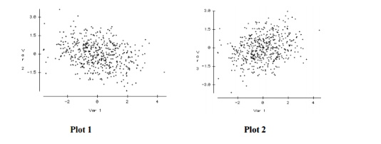
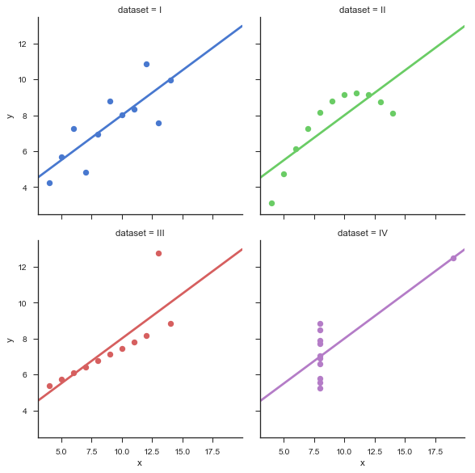

# 面试题集: AI-机器学习

[返回旧的已有问题](#旧的问题列表)

## 技能概览

### 模型架构与设计

| 能力点 | 技能难度| 快速跳转 |
| :--- |:---: | :---: |
| 线性回归模型理解 | 1 | [直达题目](#线性回归模型理解) |
| 逻辑回归模型理解 | 1 | [直达题目](#逻辑回归模型理解) |
| 决策树基础 | 2 | [直达题目](#决策树基础) |
| 随机森林原理 | 3 | [直达题目](#随机森林原理) |
| 支持向量机(SVM)原理与应用 | 4 | [直达题目](#支持向量机原理与应用) |
| 神经网络基础结构 | 3 | [直达题目](#神经网络基础结构) |
| 卷积神经网络(CNN)设计与实现 | 5 | [直达题目](#卷积神经网络设计与实现) |
| 循环神经网络(RNN)及LSTM理解 | 5 | [直达题目](#循环神经网络及lstm理解) |
| Transformer架构原理 | 6 | [直达题目](#transformer架构原理) |
| 图神经网络(GNN)基础 | 6 | [直达题目](#图神经网络基础) |
| 自注意力机制深入理解 | 7 | [直达题目](#自注意力机制深入理解) |
| 模型压缩与蒸馏技术 | 7 | [直达题目](#模型压缩与蒸馏技术) |
| 生成对抗网络(GAN)设计与训练 | 7 | [直达题目](#生成对抗网络设计与训练) |
| 大规模预训练模型架构设计 | 8 | [直达题目](#大规模预训练模型架构设计) |
| 多模态模型设计 | 8 | [直达题目](#多模态模型设计) |
| 模型架构创新与自定义 | 9 | [直达题目](#模型架构创新与自定义) |
| 跨领域模型架构战略设计 | 10 | [直达题目](#跨领域模型架构战略设计) |

### 训练与优化技术

| 能力点 | 技能难度| 快速跳转 |
| :--- |:---: | :---: |
| 损失函数基础理解 | 1 | [直达题目](#损失函数基础理解) |
| 梯度下降及变种算法 | 2 | [直达题目](#梯度下降及变种算法) |
| 正则化技术应用 | 3 | [直达题目](#正则化技术应用) |
| 超参数调优基础 | 3 | [直达题目](#超参数调优基础) |
| 批量归一化与激活函数 | 4 | [直达题目](#批量归一化与激活函数) |
| 优化器选择与调优 | 5 | [直达题目](#优化器选择与调优) |
| 学习率调度策略 | 5 | [直达题目](#学习率调度策略) |
| 模型训练监控与早停 | 6 | [直达题目](#模型训练监控与早停) |
| 分布式训练基础 | 6 | [直达题目](#分布式训练基础) |
| 混合精度训练技术 | 7 | [直达题目](#混合精度训练技术) |
| 自适应优化算法深入 | 7 | [直达题目](#自适应优化算法深入) |
| 大规模分布式训练架构设计 | 8 | [直达题目](#大规模分布式训练架构设计) |
| 训练过程自动化与流水线设计 | 8 | [直达题目](#训练过程自动化与流水线设计) |
| 训练算法创新与自定义 | 9 | [直达题目](#训练算法创新与自定义) |
| 训练系统战略规划与优化 | 10 | [直达题目](#训练系统战略规划与优化) |

### 数据处理与特征工程

| 能力点 | 技能难度| 快速跳转 |
| :--- |:---: | :---: |
| 数据清洗基础 | 1 | [直达题目](#数据清洗基础) |
| 数据预处理技术 | 2 | [直达题目](#数据预处理技术) |
| 特征选择方法 | 3 | [直达题目](#特征选择方法) |
| 特征构造与转换 | 4 | [直达题目](#特征构造与转换) |
| 类别不平衡处理 | 4 | [直达题目](#类别不平衡处理) |
| 特征降维技术（PCA等） | 5 | [直达题目](#特征降维技术-pca等) |
| 时间序列特征工程 | 5 | [直达题目](#时间序列特征工程) |
| 文本特征提取技术 | 6 | [直达题目](#文本特征提取技术) |
| 图数据特征工程 | 6 | [直达题目](#图数据特征工程) |
| 自动特征工程工具应用 | 7 | [直达题目](#自动特征工程工具应用) |
| 特征工程自动化与优化 | 8 | [直达题目](#特征工程自动化与优化) |
| 跨领域特征融合设计 | 9 | [直达题目](#跨领域特征融合设计) |
| 特征工程战略规划 | 10 | [直达题目](#特征工程战略规划) |

### 模型评估与验证

| 能力点 | 技能难度| 快速跳转 |
| :--- |:---: | :---: |
| 基础评估指标理解（准确率、召回率等） | 1 | [直达题目](#基础评估指标理解-准确率-召回率等) |
| 混淆矩阵及其应用 | 2 | [直达题目](#混淆矩阵及其应用) |
| 交叉验证方法 | 3 | [直达题目](#交叉验证方法) |
| 模型泛化能力评估 | 4 | [直达题目](#模型泛化能力评估) |
| 模型过拟合与欠拟合诊断 | 4 | [直达题目](#模型过拟合与欠拟合诊断) |
| AUC-ROC曲线分析 | 5 | [直达题目](#auc-roc曲线分析) |
| 贝叶斯优化与超参数搜索 | 6 | [直达题目](#贝叶斯优化与超参数搜索) |
| 模型不确定性估计 | 6 | [直达题目](#模型不确定性估计) |
| 模型解释性技术（LIME、SHAP） | 7 | [直达题目](#模型解释性技术-lime-shap) |
| 模型评估自动化与监控 | 8 | [直达题目](#模型评估自动化与监控) |
| 多任务与多目标评估设计 | 9 | [直达题目](#多任务与多目标评估设计) |
| 企业级模型评估体系设计 | 10 | [直达题目](#企业级模型评估体系设计) |

### 机器学习框架与工具

| 能力点 | 技能难度| 快速跳转 |
| :--- |:---: | :---: |
| Scikit-learn基础使用 | 2 | [直达题目](#scikit-learn基础使用) |
| TensorFlow基础操作 | 3 | [直达题目](#tensorflow基础操作) |
| PyTorch基础操作 | 3 | [直达题目](#pytorch基础操作) |
| Keras模型构建 | 4 | [直达题目](#keras模型构建) |
| 模型部署基础（TensorFlow Serving等） | 5 | [直达题目](#模型部署基础-tensorflow-serving等) |
| ONNX模型转换与应用 | 6 | [直达题目](#onnx模型转换与应用) |
| 深度学习框架性能调优 | 7 | [直达题目](#深度学习框架性能调优) |
| 自定义层与算子开发 | 8 | [直达题目](#自定义层与算子开发) |
| 框架源码阅读与贡献 | 9 | [直达题目](#框架源码阅读与贡献) |
| 框架架构设计与优化 | 10 | [直达题目](#框架架构设计与优化) |

### 应用场景与案例实践

| 能力点 | 技能难度| 快速跳转 |
| :--- |:---: | :---: |
| 分类与回归问题实战 | 2 | [直达题目](#分类与回归问题实战) |
| 推荐系统基础实现 | 3 | [直达题目](#推荐系统基础实现) |
| 自然语言处理基础应用 | 3 | [直达题目](#自然语言处理基础应用) |
| 计算机视觉基础应用 | 3 | [直达题目](#计算机视觉基础应用) |
| 强化学习基础理解 | 4 | [直达题目](#强化学习基础理解) |
| 时间序列预测实战 | 4 | [直达题目](#时间序列预测实战) |
| 生成模型应用案例 | 5 | [直达题目](#生成模型应用案例) |
| 多任务学习实战 | 6 | [直达题目](#多任务学习实战) |
| 端到端系统设计与实现 | 7 | [直达题目](#端到端系统设计与实现) |
| 跨模态应用开发 | 8 | [直达题目](#跨模态应用开发) |
| 复杂系统集成与优化 | 9 | [直达题目](#复杂系统集成与优化) |
| 行业级AI解决方案设计 | 10 | [直达题目](#行业级ai解决方案设计) |

---

## 详细题目列表

### 模型架构与设计

<a id='线性回归模型理解'></a>
#### 线性回归模型理解

**技能难度评分:** 1/10

**问题 1:**

> 以下关于线性回归模型的描述，哪一项是正确的？
> 
> A. 线性回归模型可以用来预测分类结果，因为它输出的是概率值。
> 
> B. 线性回归模型假设自变量与因变量之间存在线性关系。
> 
> C. 线性回归模型不需要训练过程，直接用数据点计算即可。
> 
> D. 线性回归模型的目标是最大化预测值与真实值之间的误差。

<details>
  <summary>点击查看答案</summary>
  <p><strong>

正确答案: B. 线性回归模型假设自变量与因变量之间存在线性关系。 解释：线性回归模型的核心假设是因变量和自变量之间存在线性关系，因此模型通过拟合一条直线来预测因变量。选项A错误，因为线性回归用于预测连续数值，不用于分类；选项C错误，线性回归需要训练过程来确定最佳拟合参数；选项D错误，线性回归的目标是最小化预测值与真实值之间的误差。</strong></p>
</details>

**问题 2:**

> 假设你在一家电商公司工作，负责预测商品的销售额。你选择使用线性回归模型来建立预测模型。请简要说明线性回归模型的基本假设是什么？在实际应用中，如果这些假设被违反，可能会带来哪些影响？

<details>
  <summary>点击查看答案</summary>
  <p><strong>

正确答案: 线性回归模型的基本假设包括：
1. 线性关系假设：自变量与因变量之间存在线性关系。
2. 独立性假设：样本之间相互独立。
3. 同方差性假设：误差项的方差是恒定的（不存在异方差）。
4. 正态性假设：误差项服从正态分布。

如果这些假设被违反，可能带来的影响包括：
- 违反线性关系假设，模型拟合效果差，预测不准确。
- 违反独立性假设，参数估计可能有偏，标准误差估计不准确。
- 存在异方差时，参数的估计仍然是无偏的，但标准误差估计不准确，影响假设检验和置信区间。
- 误差不服从正态分布，会影响参数的显著性检验，但对大样本影响较小。</strong></p>
</details>

---

<a id='逻辑回归模型理解'></a>
#### 逻辑回归模型理解

**技能难度评分:** 1/10

**问题 1:**

> 以下关于逻辑回归模型的描述，哪一项是正确的？
> 
> A. 逻辑回归模型直接预测输入特征的线性组合值作为输出。
> B. 逻辑回归模型用于解决回归问题，预测连续的数值输出。
> C. 逻辑回归模型通过Sigmoid函数将线性组合的输入映射到0到1之间的概率值。
> D. 逻辑回归模型不适合处理二分类问题，只能用于多分类问题。

<details>
  <summary>点击查看答案</summary>
  <p><strong>

正确答案: C. 逻辑回归模型通过Sigmoid函数将线性组合的输入映射到0到1之间的概率值。逻辑回归模型的核心是对输入特征的线性组合应用Sigmoid函数，从而将结果映射为一个概率值，适用于二分类问题的概率预测。选项A错误，因为模型输出的是经过Sigmoid函数转换的概率，而非线性组合的直接值；选项B错误，逻辑回归是分类模型而非回归模型；选项D错误，逻辑回归主要用于二分类问题，也可以扩展到多分类，但不是其唯一用途。</strong></p>
</details>

**问题 2:**

> 假设你在一家电商公司工作，负责构建一个模型来预测用户是否会购买某个商品。你决定使用逻辑回归模型。请简要说明逻辑回归模型的基本原理，以及它在这个二分类问题中的作用，并谈谈为什么逻辑回归适合用来做这种预测。

<details>
  <summary>点击查看答案</summary>
  <p><strong>

正确答案: 逻辑回归模型是一种用于二分类问题的线性模型，它通过对输入特征的线性组合进行加权求和，然后通过一个sigmoid函数（也称为逻辑函数）将结果映射到0到1之间的概率值。这个概率值表示样本属于某一类别的可能性。在电商用户购买预测的场景中，逻辑回归模型会根据用户的特征（如浏览历史、点击率、用户属性等）计算用户购买的概率。最终模型会根据设定的阈值（通常是0.5）判断用户是否会购买。逻辑回归适合这类任务的原因包括：1) 模型简单，易于理解和实现；2) 输出概率值，便于解释和后续决策；3) 对线性可分的数据表现良好；4) 训练速度快，适合大规模数据。</strong></p>
</details>

---

<a id='决策树基础'></a>
#### 决策树基础

**技能难度评分:** 2/10

**问题 1:**

> 在决策树模型中，什么是“叶节点”（Leaf Node）？
> 
> A. 决策树中用于分割数据的内部节点，代表特征的测试条件。
> B. 决策树中没有子节点的终端节点，表示具体的分类或回归结果。
> C. 决策树中根节点的别称，是整个树的起始点。
> D. 决策树中用于剪枝操作的特殊节点，用来减少过拟合。

<details>
  <summary>点击查看答案</summary>
  <p><strong>

正确答案: B. 决策树中没有子节点的终端节点，表示具体的分类或回归结果。——叶节点是决策树的终端节点，代表最终的预测结果，区别于内部节点的测试条件。</strong></p>
</details>

**问题 2:**

> 假设你是一家电商公司的数据科学家，负责使用决策树模型来预测用户是否会购买某款新上市的智能手表。请简述决策树是如何根据用户的特征（如年龄、浏览时长、历史购买记录等）进行分类决策的？并说明决策树模型在实际业务中有哪些优点和潜在的局限性？

<details>
  <summary>点击查看答案</summary>
  <p><strong>

正确答案: 决策树通过对用户的特征进行条件判断，将数据逐步划分成不同的子集，从根节点开始，根据特征的不同取值选择最优分裂点，逐层向下分裂，直到满足停止条件（如达到最大深度或节点纯度足够高），最终在叶节点给出分类结果。每个内部节点代表一个特征的判断条件，叶节点代表分类标签。

优点包括：模型直观易理解，便于解释业务决策；不需要大量数据预处理；能够处理数值型和类别型特征；适用于多分类问题。

局限性包括：容易过拟合训练数据，导致泛化能力下降；对噪声和异常值敏感；在特征较多时，构建树结构可能复杂且计算开销大。针对这些问题，通常会结合剪枝技术或使用集成方法（如随机森林）来提升性能。</strong></p>
</details>

---

<a id='随机森林原理'></a>
#### 随机森林原理

**技能难度评分:** 3/10

**问题 1:**

> 以下关于随机森林模型的描述，哪一项是正确的？
> 
> A. 随机森林通过在每棵树的每个节点上使用所有特征来划分数据，以减少偏差。
> 
> B. 随机森林通过引入随机性，结合多棵决策树的结果来提高模型的泛化能力。
> 
> C. 随机森林模型通常只使用一棵决策树进行预测，以避免过拟合。
> 
> D. 随机森林中的每棵树都是通过梯度下降算法训练得到的，类似于神经网络的训练方式。

<details>
  <summary>点击查看答案</summary>
  <p><strong>

正确答案: B. 随机森林通过引入随机性，结合多棵决策树的结果来提高模型的泛化能力。正确答案是B，因为随机森林通过对数据进行有放回的抽样（Bootstrap）生成多样的训练子集，并在构建每棵树时随机选择特征子集，从而引入随机性，结合多棵树的投票结果来降低模型的方差，提高泛化能力。A选项错误，因为随机森林在每个节点上随机选择部分特征，而不是全部特征。C选项错误，随机森林使用多棵树而非单棵树。D选项错误，随机森林的树是通过决策树算法构建的，而非梯度下降。</strong></p>
</details>

**问题 2:**

> 假设你在为一个电商平台设计一个用户购买预测模型。请简述随机森林模型的基本原理，并说明在该场景中使用随机森林的优势是什么？

<details>
  <summary>点击查看答案</summary>
  <p><strong>

正确答案: 随机森林是一种集成学习方法，通过构建多个决策树来进行分类或回归。每棵树在训练时都会随机选择样本和特征子集，从而增强模型的多样性和鲁棒性。最终，随机森林通过对所有树的预测结果进行投票（分类）或平均（回归）来输出最终结果。在电商用户购买预测场景中，随机森林的优势包括：1. 能够处理高维和大量特征数据，适合复杂的用户行为数据。2. 通过随机采样和特征选择，减少过拟合，提高模型泛化能力。3. 对异常值和噪声具有较强的鲁棒性。4. 训练过程可以并行化，适合大规模数据处理。因此，随机森林能够有效捕获用户购买行为的复杂模式，提升预测准确性。</strong></p>
</details>

---

<a id='支持向量机原理与应用'></a>
#### 支持向量机(SVM)原理与应用

**技能难度评分:** 4/10

**问题 1:**

> 以下关于支持向量机（SVM）的描述中，哪一项是正确的？
> 
> A. SVM通过最大化支持向量之间的距离来实现分类。
> B. SVM的主要目标是找到一个能够最大化类别间间隔的超平面。
> C. 支持向量是指所有训练样本中距离决策边界最远的点。
> D. SVM只能处理线性可分的数据，无法应用于非线性问题。

<details>
  <summary>点击查看答案</summary>
  <p><strong>

正确答案: B. SVM的主要目标是找到一个能够最大化类别间间隔的超平面。——这是SVM的核心原理，即通过最大化两个类别之间的间隔（margin）来提高模型的泛化能力。选项A错误，因为SVM最大化的是支持向量与超平面之间的间隔，而非支持向量相互之间的距离。选项C错误，支持向量是距离决策边界最近的样本点，而非最远的。选项D错误，SVM可以通过核函数处理非线性问题。</strong></p>
</details>

**问题 2:**

> 假设你在开发一个邮件垃圾分类系统，使用支持向量机（SVM）模型来区分垃圾邮件和正常邮件。请简要说明SVM是如何找到最优分类边界的？同时，考虑到邮件内容可能不是线性可分的，你会如何处理这种情况？请结合具体的技术手段进行说明。

<details>
  <summary>点击查看答案</summary>
  <p><strong>

正确答案: 支持向量机（SVM）的核心思想是通过找到一个最大间隔的分割超平面，将不同类别的数据点分开。这个超平面不仅要正确分类训练数据，还要最大化距离最近训练样本（支持向量）到超平面的距离，从而提高模型的泛化能力。具体来说，SVM通过求解一个凸优化问题，找到使间隔最大的超平面。

当数据线性不可分时，SVM通常采用两种方法：

1. 核方法（Kernel Trick）：通过核函数将原始数据映射到更高维的特征空间，使得在新的空间中数据线性可分。常用的核函数包括线性核、多项式核、高斯径向基函数（RBF）核等。

2. 软间隔（Soft Margin）：允许部分数据点违反间隔约束，即允许一定程度的分类错误，通过引入惩罚参数C来平衡间隔大小和分类错误率。

在邮件垃圾分类中，考虑到文本数据的复杂性，通常会结合文本特征（如TF-IDF）和核函数（例如RBF核）来提升模型的分类能力，同时利用软间隔来处理噪声和异常样本。</strong></p>
</details>

---

<a id='神经网络基础结构'></a>
#### 神经网络基础结构

**技能难度评分:** 3/10

**问题 1:**

> 以下关于神经网络基础结构的描述，哪一项是正确的？
> 
> A. 神经网络中，输入层的节点数必须等于输出层的节点数。
> 
> B. 隐藏层的主要作用是提取输入数据的特征并进行非线性变换。
> 
> C. 神经网络的每一层都必须采用相同的激活函数，以保证网络的稳定性。
> 
> D. 输出层的激活函数只能是线性函数，以便进行预测。

<details>
  <summary>点击查看答案</summary>
  <p><strong>

正确答案: B. 隐藏层的主要作用是提取输入数据的特征并进行非线性变换。因为隐藏层通过激活函数引入非线性，使模型能够学习复杂的模式和特征，区别于简单的线性模型。</strong></p>
</details>

**问题 2:**

> 在实际业务中，如果你需要设计一个简单的神经网络模型来预测房价，输入特征包括面积、房龄和地理位置等，你会如何设计该神经网络的基础结构？请说明你选择的层类型、层数及其作用，并简要解释这些结构如何帮助模型更好地学习特征之间的关系。

<details>
  <summary>点击查看答案</summary>
  <p><strong>

正确答案: 针对房价预测的任务，设计一个简单的神经网络基础结构通常包括以下几个部分：

1. 输入层：输入层的节点数等于特征的数量，比如面积、房龄、地理位置等，假设共有3个特征，则输入层有3个节点。

2. 隐藏层：可以设计1到2个隐藏层，每个隐藏层包含一定数量的神经元（如16或32个），使用激活函数（如ReLU）来引入非线性，使模型能够学习复杂的特征关系。

3. 输出层：对于房价预测这种回归任务，输出层通常有1个节点，输出一个连续值，激活函数一般使用线性函数或不使用激活函数。

通过这种结构，输入层接收原始特征，隐藏层通过加权和和激活函数转换，能够捕捉特征之间的非线性关系，输出层则将隐藏层的特征映射到预测的房价。这样的基础结构简单且有效，适合初步建模和理解神经网络的工作原理。</strong></p>
</details>

---

<a id='卷积神经网络设计与实现'></a>
#### 卷积神经网络(CNN)设计与实现

**技能难度评分:** 5/10

**问题 1:**

> 在设计卷积神经网络（CNN）时，哪种操作最主要用于增加模型的感受野（receptive field）以捕捉更大范围的特征？
> 
> A. 使用更小的卷积核（如3x3）并堆叠更多层
> B. 增加卷积核的步幅（stride）
> C. 使用更大的池化层（如4x4最大池化）
> D. 使用批归一化（Batch Normalization）来加速训练

<details>
  <summary>点击查看答案</summary>
  <p><strong>

正确答案: A. 使用更小的卷积核（如3x3）并堆叠更多层。通过堆叠多个小卷积核层，网络的感受野逐渐扩大，能够捕获更大范围的特征，同时这种设计参数更少、非线性更丰富，效果优于直接使用大卷积核。选项B步幅增加会减少特征图尺寸，并非直接扩大感受野，C池化层虽有一定扩大感受野作用但主要用于降采样，D批归一化是为了加速训练和稳定网络，与感受野无关。</strong></p>
</details>

**问题 2:**

> 假设你正在设计一个用于自动驾驶场景中路面障碍物检测的卷积神经网络（CNN）。请简述你在设计网络架构时会重点考虑哪些因素？并说明如何通过调整网络层数、卷积核大小和池化方式来平衡模型的准确性和计算效率。

<details>
  <summary>点击查看答案</summary>
  <p><strong>

正确答案: 在设计用于自动驾驶路面障碍物检测的CNN时，重点考虑的因素包括：

1. 网络层数：更多的层数通常能提取更复杂的特征，但会增加计算成本和可能导致过拟合。需要根据硬件限制和实时性要求选择合适的深度。

2. 卷积核大小：较小的卷积核（如3x3）能捕捉细节且参数较少，有利于构建深层网络；较大卷积核可以覆盖更大感受野，捕捉全局信息。通常结合使用不同大小的卷积核来提升特征表达能力。

3. 池化方式：池化用于降低特征图尺寸，减少计算量，同时提取空间不变特征。常用最大池化和平均池化。最大池化有助于突出显著特征，适合障碍物检测。池化步长和窗口大小的选择影响信息保留和计算效率。

通过合理调整这些参数，可以在保证模型准确性的同时，控制计算资源消耗，满足自动驾驶系统对实时性的要求。例如，使用较浅的网络和小卷积核配合适度的池化，可以实现轻量级模型；而对于精度要求更高的场景，则可以增加层数和多尺度卷积设计，但需优化计算架构以保持效率。</strong></p>
</details>

---

<a id='循环神经网络及lstm理解'></a>
#### 循环神经网络(RNN)及LSTM理解

**技能难度评分:** 5/10

**问题 1:**

> 在循环神经网络（RNN）和长短期记忆网络（LSTM）中，LSTM 之所以能够有效缓解梯度消失问题，主要是因为哪一部分结构的设计？
> 
> A. 门控机制（输入门、遗忘门和输出门）通过控制信息流动，实现长期依赖的记忆保留和更新。
> 
> B. 使用了卷积层替代传统的全连接层，从而减少参数量，提升训练效率。
> 
> C. 采用了多层堆叠结构，使模型可以捕获更深层次的时间依赖关系。
> 
> D. 引入了残差连接，避免信息在网络中传递时的衰减。

<details>
  <summary>点击查看答案</summary>
  <p><strong>

正确答案: A. 门控机制（输入门、遗忘门和输出门）通过控制信息流动，实现长期依赖的记忆保留和更新。因为LSTM通过设计独特的门控结构，有效地控制了信息的保留与忘记，解决了传统RNN中梯度消失的问题，从而能够捕获长期依赖关系。</strong></p>
</details>

**问题 2:**

> 假设你正在设计一个基于循环神经网络(RNN)的文本生成系统，但在训练过程中发现模型出现了梯度消失问题，导致长距离依赖无法有效学习。请简要说明梯度消失的原因，并结合LSTM的结构特点，解释LSTM是如何缓解这一问题的？

<details>
  <summary>点击查看答案</summary>
  <p><strong>

正确答案: 梯度消失是指在反向传播过程中，梯度经过多层时间步的链式法则传递时不断变小，导致前面时间步的参数几乎得不到有效更新，模型难以捕捉长距离依赖。RNN的简单循环结构容易导致这种问题。LSTM通过引入了门控机制（输入门、遗忘门和输出门）和细胞状态（Cell State），使得信息可以沿着细胞状态线性传递，梯度在反向传播时不会轻易消失或爆炸，从而有效缓解了梯度消失的问题。具体来说，遗忘门控制信息的保留与遗忘，输入门控制新信息的写入，输出门控制输出信息，这些门的设计使得LSTM能够选择性地保留长期依赖的信息，增强了模型对长距离依赖的学习能力。</strong></p>
</details>

---

<a id='transformer架构原理'></a>
#### Transformer架构原理

**技能难度评分:** 6/10

**问题 1:**

> 在Transformer架构中，"自注意力机制（Self-Attention）"的主要作用是什么？
> 
> A. 通过卷积操作提取局部特征，增强模型对空间信息的感知能力。
> B. 计算输入序列中所有位置之间的依赖关系，以捕捉全局上下文信息。
> C. 使用循环神经网络结构处理序列数据，防止梯度消失问题。
> D. 利用池化层降低序列长度，减少计算复杂度。

<details>
  <summary>点击查看答案</summary>
  <p><strong>

正确答案: B. 计算输入序列中所有位置之间的依赖关系，以捕捉全局上下文信息。——自注意力机制的核心作用是让模型能够动态地关注序列中不同位置的信息，进而捕获全局的上下文关系，这也是Transformer区别于传统RNN和CNN的重要特征。</strong></p>
</details>

**问题 2:**

> 假设你正在设计一个基于Transformer模型的文本分类系统，用于处理长文本输入。请简述Transformer架构中自注意力机制是如何帮助模型捕捉文本中长距离依赖关系的？并结合具体场景，分析在处理长文本时可能遇到的挑战及你会采取哪些改进措施或架构调整来提升模型性能？

<details>
  <summary>点击查看答案</summary>
  <p><strong>

正确答案: Transformer中的自注意力机制通过计算输入序列中每个位置与其他所有位置的相关性权重，实现信息的全局交互，能够有效捕捉长距离依赖关系。具体来说，自注意力通过查询（Query）、键（Key）、值（Value）三组向量计算注意力分数，进而加权汇总输入特征，使模型可以直接访问任意远位置的信息，而不依赖于传统RNN的逐步传播。

在长文本处理场景中，Transformer面临的主要挑战包括计算和内存复杂度随着序列长度的平方增长，导致训练和推理效率下降；以及长文本中信息稀疏，可能使模型难以聚焦于关键部分。

为解决这些问题，可以采取以下改进措施：
1. 使用稀疏注意力机制（如Longformer、BigBird）减少计算复杂度。
2. 引入层次化编码策略，将长文本拆分为段落或句子，先提取局部特征再整合全局信息。
3. 采用记忆机制或复用缓存，减少重复计算。
4. 调整模型深度和宽度，平衡表达能力和计算资源。
5. 结合位置编码改进，增强模型对长距离位置的感知能力。

通过上述方法，可以在实际业务中更有效地利用Transformer架构处理长文本数据，提高分类准确率和计算效率。</strong></p>
</details>

---

<a id='图神经网络基础'></a>
#### 图神经网络(GNN)基础

**技能难度评分:** 6/10

**问题 1:**

> 在图神经网络（GNN）中，节点特征的更新通常依赖于邻居节点的信息。以下哪种机制最准确地描述了这种信息传递过程？
> 
> A. 节点特征通过全局池化操作直接获得图的整体表示，然后更新自身特征。
> 
> B. 节点特征通过聚合邻居节点的特征信息，然后结合自身特征进行更新。
> 
> C. 节点特征仅通过自身的特征进行非线性变换，不依赖邻居节点的信息。
> 
> D. 节点特征通过随机选择邻居节点的特征进行直接替换，忽略自身特征。

<details>
  <summary>点击查看答案</summary>
  <p><strong>

正确答案: B. 节点特征通过聚合邻居节点的特征信息，然后结合自身特征进行更新。 解释：图神经网络的核心机制是通过聚合邻居节点的特征信息，结合自身节点特征，进行更新，以捕捉图结构中的局部依赖关系。选项A描述的是全局池化，通常用于图的整体表示而非节点更新；选项C忽略了邻居信息，违背了GNN设计初衷；选项D的随机替换会丢失节点自身信息，且非主流做法。</strong></p>
</details>

**问题 2:**

> 假设你在一个社交网络平台工作，平台希望通过图神经网络(GNN)来预测用户的兴趣标签。请简述GNN是如何利用图结构信息帮助提升预测性能的？并结合该场景，说明在设计GNN模型时，如何选择合适的邻居聚合策略以平衡信息融合和噪声过滤？

<details>
  <summary>点击查看答案</summary>
  <p><strong>

正确答案: 图神经网络(GNN)通过节点之间的连接关系（图结构）来传播和聚合信息，使得每个节点的表示不仅包含自身特征，还融合了邻居节点的特征，从而捕捉局部结构和上下文信息。在社交网络平台的用户兴趣预测任务中，GNN能够利用用户之间的社交关系，将相互关联用户的行为和兴趣信息聚合起来，提高模型的预测准确性。

在设计GNN模型时，邻居聚合策略的选择非常关键。常见的聚合方法包括平均聚合（mean）、最大聚合（max）、加权和（weighted sum）等。选择合适的聚合策略需要考虑：

1. 信息融合效果：平均聚合可以平滑邻居信息，避免某个邻居过分影响节点表示；加权和聚合则可以根据邻居的重要性动态调整权重，提升表达能力。

2. 噪声过滤能力：在社交网络中，部分邻居可能带来噪声，最大聚合可以突出关键邻居的特征，减少噪声影响。

3. 计算复杂度和模型可解释性：简单的聚合方法计算效率高，复杂的加权方法可能需要额外的参数和训练。

因此，结合具体业务场景，可以尝试先用平均聚合获得稳定的表现，再根据数据特点调整为加权聚合或引入注意力机制，以更好地平衡信息融合和噪声过滤。</strong></p>
</details>

---

<a id='自注意力机制深入理解'></a>
#### 自注意力机制深入理解

**技能难度评分:** 7/10

**问题 1:**

> 在Transformer模型中的自注意力机制中，以下关于计算注意力权重的描述，哪一项是正确的？
> 
> A. 注意力权重是通过对查询（Query）和键（Key）向量进行点积后，直接进行Softmax归一化得到的。
> 
> B. 注意力权重的计算中，查询（Query）和键（Key）向量的点积会除以它们维度的平方根，以避免梯度消失或爆炸问题。
> 
> C. 注意力权重的计算依赖于查询（Query）和键（Key）向量的余弦相似度，用于衡量它们的方向一致性。
> 
> D. 注意力权重是先对查询（Query）和键（Key）向量拼接，再通过一个前馈神经网络计算得到的。

<details>
  <summary>点击查看答案</summary>
  <p><strong>

正确答案: B. 注意力权重的计算中，查询（Query）和键（Key）向量的点积会除以它们维度的平方根，以避免梯度消失或爆炸问题。这个缩放因子是自注意力机制中的一个关键步骤，尤其是在高维空间中，能够稳定训练过程，防止点积结果过大导致Softmax函数梯度变得极小，从而影响模型性能。</strong></p>
</details>

**问题 2:**

> 假设你在设计一个基于Transformer的文本生成系统，发现模型对长文本中的远距离依赖捕捉效果不佳。请结合自注意力机制的原理，分析可能导致这一问题的原因，并提出两种改进自注意力机制的方案以增强对长距离依赖的建模能力。此外，请说明这两种方案各自的优缺点。

<details>
  <summary>点击查看答案</summary>
  <p><strong>

正确答案: 自注意力机制通过计算输入序列中各位置之间的相关性（即注意力权重）来捕捉依赖关系，理论上能够有效建模长距离依赖。然而，实际应用中，以下原因可能导致对长距离依赖捕捉效果不佳：

1. **计算资源限制**：自注意力的计算复杂度为O(n²)，当序列变长时，计算和内存开销巨大，导致模型可能在训练或推理时受限，影响了对全局信息的有效利用。

2. **注意力分布稀释**：随着序列长度增加，注意力权重可能趋于均匀分布，使得模型难以集中关注重要的远距离信息。

针对上述问题，可以考虑以下两种改进方案：

### 方案一：引入稀疏注意力机制
- **原理**：只计算部分关键位置之间的注意力，减少计算量，保持重要远距离依赖的捕捉。
- **优点**：降低计算复杂度，适合长序列处理；能聚焦关键位置，提升信息利用效率。
- **缺点**：可能错过部分重要信息，依赖稀疏模式设计的合理性。

### 方案二：使用相对位置编码
- **原理**：通过相对位置编码增强模型对序列中元素相对位置的感知能力，改善远距离依赖的学习。
- **优点**：增强位置敏感性，提升远距离依赖捕捉；不增加太多计算开销。
- **缺点**：设计和调优相对复杂，可能对不同任务效果不一致。

总结：针对长文本远距离依赖捕捉问题，改进自注意力机制需在计算效率和信息完整性之间权衡，结合具体应用场景选择合适的方案。</strong></p>
</details>

---

<a id='模型压缩与蒸馏技术'></a>
#### 模型压缩与蒸馏技术

**技能难度评分:** 7/10

**问题 1:**

> 在模型蒸馏（Knowledge Distillation）过程中，学生模型（Student Model）学习的主要目标是什么？
> 
> A. 直接复制教师模型（Teacher Model）的权重参数，以简化训练过程。
> 
> B. 学习教师模型输出的软标签（soft labels），以捕捉教师模型的知识分布。
> 
> C. 通过减少模型层数来降低模型的计算复杂度。
> 
> D. 使用剪枝技术删除不重要的神经元，以减少模型大小。

<details>
  <summary>点击查看答案</summary>
  <p><strong>

正确答案: B</strong></p>
</details>

**问题 2:**

> 假设你负责开发一款移动端图像识别应用，现有一个准确率较高但模型过大、推理速度慢的深度学习模型。请结合模型压缩与蒸馏技术，设计一个方案以在保证模型性能的前提下提升模型的推理效率和部署便捷性。请说明你会选择哪些具体技术手段，如何实施，以及在实际应用中可能遇到的挑战和应对策略。

<details>
  <summary>点击查看答案</summary>
  <p><strong>

正确答案: 针对移动端图像识别应用中模型过大、推理速度慢的问题，可以采用以下方案：

1. 模型蒸馏（Knowledge Distillation）：
   - 通过让一个较小的学生模型学习较大教师模型的软标签或中间特征，学生模型能够继承教师模型的表现能力，同时结构更轻量。
   - 实施时，先训练好教师模型，再用教师模型的输出作为学生模型的部分训练目标。

2. 结构剪枝（Pruning）：
   - 剪除模型中冗余或重要性较低的神经元或通道，减少模型参数和计算量。
   - 需结合剪枝后的微调，恢复模型性能。

3. 量化（Quantization）：
   - 将模型参数和激活值从高精度浮点数转换为低精度（如8位整数），减少内存占用和计算复杂度。
   - 可以采用量化感知训练以降低精度损失。

4. 知识蒸馏与压缩结合：
   - 先通过蒸馏获得轻量学生模型，再对学生模型进行剪枝和量化，提高整体效率。

挑战及应对策略：
- 模型性能下降：通过知识蒸馏缓解压缩带来的性能损失，适当调整蒸馏温度和权重。
- 部署环境差异：针对移动端硬件特性，选择支持的量化格式和优化库。
- 训练复杂度增加：采用自动化压缩工具和超参数搜索减少人工调试成本。

通过上述综合方法，可以在保证模型准确率的同时显著提升移动端的推理速度和部署便捷性。</strong></p>
</details>

---

<a id='生成对抗网络设计与训练'></a>
#### 生成对抗网络(GAN)设计与训练

**技能难度评分:** 7/10

**问题 1:**

> 在设计和训练生成对抗网络（GAN）时，哪种策略最有效地缓解了训练过程中常见的模式崩溃（mode collapse）问题？
> 
> A. 增加判别器的复杂度，使其更强大以识别生成样本的缺陷。
> 
> B. 使用标签平滑（label smoothing）来减轻判别器的过拟合。
> 
> C. 采用多判别器架构，并让多个判别器分别评估生成器的输出。
> 
> D. 仅使用单一的生成器和判别器，减少网络结构的复杂性以稳定训练。

<details>
  <summary>点击查看答案</summary>
  <p><strong>

正确答案: C. 采用多判别器架构，并让多个判别器分别评估生成器的输出。 解析：模式崩溃是GAN训练中的常见问题，单一判别器可能无法全面评估生成器的多样性，导致生成器陷入生成有限模式的困境。采用多判别器架构可以从多个角度评估生成器输出，促使生成器生成更多样化的样本，从而有效缓解模式崩溃。选项A虽然增强判别器能力，但可能加剧训练不稳定；选项B的标签平滑主要减轻判别器过拟合，并非直接针对模式崩溃；选项D减少复杂性反而可能降低模型表达能力，不利于解决模式崩溃问题。</strong></p>
</details>

**问题 2:**

> 假设你在一个图像生成项目中使用生成对抗网络(GAN)，目标是生成高分辨率的人脸图像。训练过程中，你发现生成器生成的图像质量不稳定，且训练时经常出现模式崩溃（mode collapse）现象。请你分析可能导致模式崩溃的原因，并提出至少两种改进训练稳定性和生成多样性的方法。此外，结合具体的架构设计或训练技巧说明你的改进方案如何缓解这些问题。

<details>
  <summary>点击查看答案</summary>
  <p><strong>

正确答案: 模式崩溃通常是因为生成器在训练过程中只学会生成有限种类的样本，从而骗过判别器，导致生成多样性极低。原因可能包括：

1. 判别器过强，导致生成器难以学习多样化特征；
2. 训练不平衡，导致梯度消失或不稳定；
3. 损失函数设计不合理，未能有效鼓励多样性；
4. 网络架构限制，限制了生成器的表达能力。

改进方法包括：

1. 使用改进的损失函数，如Wasserstein GAN（WGAN）及其梯度惩罚（WGAN-GP），改善梯度流，提升训练稳定性；
2. 采用谱归一化（Spectral Normalization）限制判别器权重，防止判别器过强；
3. 引入 minibatch discrimination 或多样性敏感的正则项，鼓励生成多样化样本；
4. 在生成器和判别器中使用残差连接（ResNet）或自注意力机制（Self-Attention），增强模型表达能力。

通过这些方法，训练过程更稳定，生成器能够获得更丰富的梯度信息，减少模式崩溃，提升生成图像的多样性和质量。</strong></p>
</details>

---

<a id='大规模预训练模型架构设计'></a>
#### 大规模预训练模型架构设计

**技能难度评分:** 8/10

**问题 1:**

> 在设计大规模预训练模型（如GPT、BERT等）的架构时，以下哪项设计原则最关键，以保证模型在处理超大规模参数时的训练效率和性能？
> 
> A. 使用浅层网络结构以减少模型参数，防止过拟合
> B. 采用分布式训练和模型并行技术来扩展计算资源和内存容量
> C. 优先选择传统的全连接层替代注意力机制以降低计算复杂度
> D. 减少训练数据规模以加快训练速度和模型收敛速度

<details>
  <summary>点击查看答案</summary>
  <p><strong>

正确答案: B. 采用分布式训练和模型并行技术来扩展计算资源和内存容量。理由：大规模预训练模型参数量巨大，单机难以容纳和计算，因此通过分布式训练和模型并行设计，可以有效扩展硬件资源，提升训练效率和模型性能。选项A错误，因为大规模预训练模型往往需要深层结构以增强表达能力；选项C错误，全连接层计算成本高且不具备注意力机制的上下文捕捉能力；选项D错误，减少训练数据反而会影响模型泛化能力。</strong></p>
</details>

**问题 2:**

> 在设计一个面向多模态（文本、图像、音频）的大规模预训练模型时，如何构建模型架构以高效融合不同模态的信息？请结合具体的技术手段，分析在模型规模、计算资源和训练效率方面需要考虑的关键设计点，并提出解决方案。

<details>
  <summary>点击查看答案</summary>
  <p><strong>

正确答案: 设计多模态大规模预训练模型架构时，关键要点包括：

1. 模态编码器设计：针对不同模态（文本、图像、音频）设计专门的编码器，例如Transformer用于文本，CNN或视觉Transformer用于图像，卷积神经网络或时序Transformer用于音频，保证各模态信息的有效特征提取。

2. 融合机制：采用跨模态自注意力机制（Cross-modal Attention）、多模态融合层（如多头注意力融合层）、或共享底层表示的方法，实现不同模态间的信息交互和融合。

3. 模型规模与参数共享：通过参数共享减少模型体积，如共享Transformer层，或使用模块化设计（模块共享或适配器）以平衡模型容量与效率。

4. 计算资源优化：利用混合精度训练（FP16/BF16）、分布式训练策略（数据并行、模型并行）、流水线并行，以及梯度累积等技术提高训练效率。

5. 训练策略：设计合理的多任务学习目标，结合模态自监督任务（如掩码语言模型、图像编码任务、音频预测任务）促进模态间协同学习。

6. 内存管理：采用激活检查点、梯度检查点等技术缓解显存压力。

总结：通过模块化编码器设计、多模态融合机制、参数共享和高效的分布式训练策略，结合合理的训练目标，可设计出既能有效融合多模态信息，又具备较高训练效率和可扩展性的大规模预训练模型架构。</strong></p>
</details>

---

<a id='多模态模型设计'></a>
#### 多模态模型设计

**技能难度评分:** 8/10

**问题 1:**

> 在设计多模态模型时，哪种架构设计最有效地处理不同模态数据的特征融合，以提升模型整体性能？
> 
> A. 将所有模态数据直接拼接成一个长向量，输入单一的全连接网络进行训练。
> 
> B. 使用独立的编码器分别提取每种模态的特征，然后通过注意力机制进行融合。
> 
> C. 仅选用视觉模态作为输入，因为视觉信息通常包含最丰富的特征。
> 
> D. 使用单一的卷积神经网络处理所有模态数据，无需区分模态差异。

<details>
  <summary>点击查看答案</summary>
  <p><strong>

正确答案: B. 使用独立的编码器分别提取每种模态的特征，然后通过注意力机制进行融合。 — 这种设计可以针对不同模态的数据特点设计专门的编码器，提取各自的高质量特征，再利用注意力机制有效融合，提升多模态模型的表现。A选项虽然简单，但直接拼接忽略了模态差异，可能导致特征冲突；C选项忽视了多模态融合的核心思想；D选项忽略了模态异质性，单一网络难以兼顾所有模态特点。</strong></p>
</details>

**问题 2:**

> 假设你在设计一个多模态模型，用于电商平台的商品推荐系统，该系统需要结合商品图片、商品描述文本以及用户行为数据来提高推荐的准确性。请描述你如何设计该多模态模型的架构，包括：
> 
> 1. 不同模态数据的特征提取方法；
> 2. 多模态信息融合的策略；
> 3. 如何处理模态间数据分布差异和缺失数据问题；
> 4. 在模型设计中你会考虑哪些关键点以确保系统的可扩展性和实时性？
> 
> 请结合具体技术细节说明你的设计思路。

<details>
  <summary>点击查看答案</summary>
  <p><strong>

正确答案: 1. 特征提取方法：
- 商品图片：采用预训练的卷积神经网络（如ResNet、EfficientNet）提取视觉特征，利用卷积层捕捉图像的空间信息。
- 商品描述文本：使用预训练的语言模型（如BERT、RoBERTa）提取文本语义特征，捕获上下文信息。
- 用户行为数据：对用户的点击、购买等行为数据进行统计特征工程，或使用序列模型（如LSTM、Transformer）捕捉用户行为序列的时序特征。

2. 多模态融合策略：
- 采用中间融合（Intermediate Fusion）策略，将各模态提取的特征映射到同一维度后，通过注意力机制（如多头自注意力）或门控机制进行加权融合，增强不同模态之间的交互。
- 也可以考虑使用跨模态变换器（Cross-modal Transformer）进一步建模模态间的相关性。

3. 处理数据分布差异和缺失问题：
- 通过归一化和标准化方法缓解不同模态特征的分布差异。
- 对缺失模态数据，采用模态不依赖的设计，如设计独立的模态嵌入，缺失时用零向量或训练时引入模态缺失的样本进行鲁棒性训练。
- 还可以使用生成模型（如变分自编码器）来估计缺失模态的特征。

4. 可扩展性和实时性考虑：
- 模型架构设计需模块化，方便增加新的模态或替换单一模态的处理模块。
- 采用轻量级模型或知识蒸馏减少计算资源消耗。
- 利用异步并行处理不同模态数据，加快特征提取速度。
- 设计缓存机制，重用用户历史特征，减少重复计算。
- 选用支持在线学习或增量更新的模型，保证系统对用户行为变化的快速适应能力。</strong></p>
</details>

---

<a id='模型架构创新与自定义'></a>
#### 模型架构创新与自定义

**技能难度评分:** 9/10

**问题 1:**

> 在设计深度学习模型时，针对特定任务进行模型架构创新与自定义时，哪种做法最能有效提升模型的表达能力且避免过拟合？
> 
> A. 直接增加网络层数和参数数量，期望模型自动学习更复杂的特征
> B. 利用模块化设计，引入跳跃连接（skip connections）和多分支结构以增强信息流传递和特征融合
> C. 仅使用预训练模型的固定架构，避免任何结构调整以保证训练稳定性
> D. 通过大幅简化模型结构，减少网络深度和宽度来避免过拟合，忽略任务特定需求

<details>
  <summary>点击查看答案</summary>
  <p><strong>

正确答案: B. 利用模块化设计，引入跳跃连接（skip connections）和多分支结构以增强信息流传递和特征融合。该方法通过改善梯度流和信息传递，提升模型表达能力，同时有效缓解深层网络中的梯度消失和过拟合问题，是模型架构创新中常用且有效的策略。</strong></p>
</details>

**问题 2:**

> 假设你所在的团队正在开发一个用于自动驾驶场景下多传感器数据融合的深度学习模型。目前主流模型在处理不同传感器（如摄像头、雷达、激光雷达）数据融合时存在特征对齐和信息互补不足的问题。请你设计一种创新的模型架构或架构组件，来解决多传感器异构数据融合的挑战，并说明你选择该设计的理由、可能带来的优势以及在实现过程中需要注意的问题。

<details>
  <summary>点击查看答案</summary>
  <p><strong>

正确答案: 针对多传感器异构数据融合的挑战，可以设计一种基于跨模态注意力机制的多分支融合架构。具体方案包括：

1. 多分支特征提取：为每种传感器设计专门的特征提取网络（如卷积网络处理图像，点云网络处理激光雷达数据），保证各自特征表示的有效提取。

2. 跨模态注意力融合层：引入跨模态自注意力机制，使得不同传感器的特征在融合时能够动态关注彼此的关键信息，实现特征对齐和信息互补。

3. 多尺度融合策略：结合不同层次的特征进行融合，提高模型对多尺度目标的识别能力。

4. 可训练的权重分配：设计权重学习模块，动态调整各传感器贡献，提升适应性。

选择理由：跨模态注意力机制能够有效捕捉不同模态间的相关性，解决传统融合方法中硬性对齐不足的问题。多分支设计保证异构数据专有的特征表达能力。多尺度融合提升检测精度。

优势：增强了特征表达的互补性和鲁棒性，提高了多传感器融合的准确性和适应性。

实现注意点：
- 注意计算复杂度，避免模型过大影响实时性。
- 训练时需设计合理的损失函数，保证各分支协同优化。
- 处理不同传感器数据的同步和时间戳对齐问题。
- 防止过拟合，考虑数据增强和正则化。

综上，该架构通过创新的跨模态注意力融合层，有效解决了多传感器数据异构性和信息互补的难题，适合自动驾驶等复杂环境下的感知任务。</strong></p>
</details>

---

<a id='跨领域模型架构战略设计'></a>
#### 跨领域模型架构战略设计

**技能难度评分:** 10/10

**问题 1:**

> 在设计一个跨领域的AI模型架构时，以下哪项策略最有效地支持模型在多个不同领域中实现泛化能力？
> 
> A. 为每个领域设计独立的专用模型，避免共享任何参数，以确保领域内最优性能。
> 
> B. 使用统一的基础架构，结合领域特定的适配器模块，通过共享底层表示和局部调节实现跨领域泛化。
> 
> C. 采用单一的大型预训练模型，直接应用于所有领域，不做任何领域特定的调整。
> 
> D. 通过在每个领域训练完全不同的模型架构来避免领域间的干扰，提高模型的专属表现。

<details>
  <summary>点击查看答案</summary>
  <p><strong>

正确答案: B. 使用统一的基础架构，结合领域特定的适配器模块，通过共享底层表示和局部调节实现跨领域泛化。 解释：跨领域模型架构战略设计的核心在于平衡共享信息和领域特异性。选项B提出的策略通过共享底层表示捕获通用特征，同时利用适配器模块进行领域特定调整，能够有效提升模型的泛化能力和适应性。选项A和D虽然能在单一领域表现良好，但缺乏跨领域的泛化能力。选项C忽略了领域差异，通常导致性能下降，因此不适合跨领域设计。</strong></p>
</details>

**问题 2:**

> 假设你在一个大型企业中负责设计一套跨领域的AI模型架构，该企业业务涵盖金融风控、医疗影像分析和智能制造三大领域。请你从战略设计的角度，阐述如何构建一个能够有效支持多个领域的统一模型架构？请重点说明如何解决不同领域数据异构性、模型泛化能力、计算资源调度以及安全合规性问题。

<details>
  <summary>点击查看答案</summary>
  <p><strong>

正确答案: 在设计跨领域模型架构时，首先需要构建一个模块化且可扩展的架构框架，支持不同领域的特定需求与共性部分的复用。

1. 数据异构性处理：采用统一的数据标准和接口规范，利用数据湖或数据中台集中管理异构数据。对不同领域数据进行预处理和特征提取，构建领域适应层，保证输入数据格式和语义的一致性。

2. 模型泛化能力：设计多任务学习或元学习框架，提升模型在不同领域的泛化能力。利用共享底层表示和领域特定头部结构，兼顾通用性和领域特异性。

3. 计算资源调度：引入动态资源调度机制，根据各领域模型训练和推理的负载变化，灵活分配计算资源。采用容器化和微服务架构，支持模型的弹性部署和横向扩展。

4. 安全合规性：针对不同领域的数据隐私和合规要求，设计细粒度的访问控制和数据加密机制。结合联邦学习和差分隐私技术，确保跨领域协作时数据安全。

综上，跨领域模型架构战略设计需要在统一框架下兼顾领域差异，确保数据、模型和资源的高效协同与安全合规。</strong></p>
</details>

---


### 训练与优化技术

<a id='损失函数基础理解'></a>
#### 损失函数基础理解

**技能难度评分:** 1/10

**问题 1:**

> 在机器学习中，损失函数的主要作用是什么？
> 
> A. 用于衡量模型预测结果与真实标签之间的差距
> B. 用于增加模型的复杂度以防止过拟合
> C. 用于调整模型的超参数以提升训练速度
> D. 用于对数据进行预处理和归一化

<details>
  <summary>点击查看答案</summary>
  <p><strong>

正确答案: A. 用于衡量模型预测结果与真实标签之间的差距。损失函数的核心目的是量化模型预测值与真实值之间的差异，帮助模型通过优化算法不断调整参数以减少误差，从而提升模型性能。选项B混淆了损失函数与正则化的作用，选项C描述的是超参数调优，选项D涉及数据预处理，与损失函数无关。</strong></p>
</details>

**问题 2:**

> 假设你正在开发一个用于预测房价的回归模型。请简要说明损失函数在模型训练中的作用，并举例说明一种常用的回归损失函数及其基本计算方式。

<details>
  <summary>点击查看答案</summary>
  <p><strong>

正确答案: 损失函数用于衡量模型预测值与真实值之间的差异，是模型训练过程中优化的目标。通过最小化损失函数，模型参数得以调整，从而提高预测准确性。常用的回归损失函数之一是均方误差（Mean Squared Error, MSE），其计算方式为所有样本预测值与真实值差的平方的平均值，即MSE = \frac{1}{n} \sum_{i=1}^n (y_i - \hat{y}_i)^2 其中，n是样本数量，y_i是真实值，\hat{y}_i是预测值。MSE通过惩罚较大误差，促使模型更准确地拟合数据。</strong></p>
</details>

---

<a id='梯度下降及变种算法'></a>
#### 梯度下降及变种算法

**技能难度评分:** 2/10

**问题 1:**

> 在使用梯度下降算法时，为什么常常会使用学习率衰减（learning rate decay）？
> 
> A. 为了避免模型过拟合训练数据
> B. 为了让模型在训练后期更稳定地收敛，避免跳过最优解
> C. 为了增加每次参数更新的步长，加快收敛速度
> D. 为了减少训练数据量，提高训练速度

<details>
  <summary>点击查看答案</summary>
  <p><strong>

正确答案: B. 为了让模型在训练后期更稳定地收敛，避免跳过最优解

解释：学习率衰减的目的是在训练的早期使用较大的学习率快速下降，随后逐渐减小学习率，使得参数更新步伐变小，从而在训练后期更稳定地收敛，减少跳过或震荡最优解的风险。选项A和D与学习率衰减无直接关系，选项C描述的是增大学习率的效果，与学习率衰减相反。</strong></p>
</details>

**问题 2:**

> 在训练一个简单的线性回归模型时，您发现使用标准的批量梯度下降算法训练过程很慢，且在某些迭代中损失函数值出现震荡。请简要说明可能导致这些问题的原因，并介绍两种常见的梯度下降变种算法，解释它们如何帮助解决这些问题。

<details>
  <summary>点击查看答案</summary>
  <p><strong>

正确答案: 可能导致训练过程慢和损失震荡的原因包括：
1. 学习率设置不合适，过大可能导致震荡，过小则训练慢。
2. 数据集较大，批量梯度下降每次需计算整个数据集的梯度，计算量大导致训练慢。

两种常见的梯度下降变种算法：
1. 随机梯度下降（SGD）：每次仅用一个样本计算梯度，更新参数，计算速度快，能减少内存占用，但梯度估计噪声大，可能导致震荡，但也有助于跳出局部最优。
2. 小批量梯度下降（Mini-batch Gradient Descent）：每次用一小部分样本计算梯度，兼顾了批量梯度下降的稳定性和随机梯度下降的效率，能加快训练速度且减少震荡。

这两种方法通过减少每次计算的样本数量，提高了训练效率，同时小批量梯度下降在震荡和稳定性间取得平衡，帮助模型更快收敛。</strong></p>
</details>

---

<a id='正则化技术应用'></a>
#### 正则化技术应用

**技能难度评分:** 3/10

**问题 1:**

> 在机器学习模型训练过程中，正则化技术的主要目的是？
> 
> A. 增加模型的复杂度以提升训练准确率
> B. 减少模型的过拟合现象，提高泛化能力
> C. 加快模型的训练速度
> D. 增加训练数据的数量以提升模型性能

<details>
  <summary>点击查看答案</summary>
  <p><strong>

正确答案: B. 减少模型的过拟合现象，提高泛化能力

解释：正则化技术通过在损失函数中加入惩罚项，限制模型参数的大小，从而防止模型过拟合训练数据，提升其在未见数据上的泛化能力。选项A错误，因为正则化通常减少模型复杂度而非增加。选项C和D与正则化目的不直接相关。</strong></p>
</details>

**问题 2:**

> 在一个电商推荐系统中，模型在训练集上表现非常好，但在测试集上准确率明显下降。请简述正则化技术如何帮助改善这种过拟合问题，并举例说明两种常用的正则化方法及其在模型训练中的具体应用场景。

<details>
  <summary>点击查看答案</summary>
  <p><strong>

正确答案: 正则化技术通过在损失函数中加入惩罚项，限制模型的复杂度，从而减少过拟合，提高模型在未见数据上的泛化能力。常用的两种正则化方法是L1正则化和L2正则化。L1正则化（Lasso）通过增加参数绝对值的和作为惩罚项，有助于产生稀疏模型，适用于特征选择；L2正则化（Ridge）通过增加参数平方和作为惩罚项，能使参数较小且均匀分布，适用于防止参数过大导致的过拟合。在电商推荐系统中，可以在模型训练时加入L2正则化项，限制权重大小，防止模型过度拟合训练集中的用户行为特征，从而提升测试集上的表现。</strong></p>
</details>

---

<a id='超参数调优基础'></a>
#### 超参数调优基础

**技能难度评分:** 3/10

**问题 1:**

> 在机器学习模型训练过程中，超参数调优的主要目的是？
> 
> A. 自动调整模型参数以最小化训练误差
> B. 通过调整模型外部设定的参数来提升模型的泛化能力
> C. 增加训练数据量以提高模型的准确率
> D. 通过减少训练轮数来防止模型过拟合

<details>
  <summary>点击查看答案</summary>
  <p><strong>

正确答案: B。超参数是指那些在训练前设定的参数（如学习率、正则化强度、树的深度等），通过调优这些超参数，可以提升模型在未见数据上的表现，即泛化能力。选项A描述的是模型参数的自动调整，属于训练过程而非超参数调优；选项C是数据增强策略，不属于超参数调优；选项D虽然涉及过拟合防止，但减少训练轮数只是调节训练过程，不能全面代表超参数调优的目的。</strong></p>
</details>

**问题 2:**

> 假设你正在训练一个用于图像分类的深度学习模型，发现模型在训练集上表现很好但在验证集上表现较差。请解释超参数调优在解决这个问题中的作用，并简要描述你会选择调整哪些超参数来改善模型的泛化能力？

<details>
  <summary>点击查看答案</summary>
  <p><strong>

正确答案: 在训练模型时，如果出现训练集表现好但验证集表现差的情况，通常是过拟合现象。超参数调优通过调整模型训练过程中的关键参数，帮助模型更好地泛化到未见数据。主要可以调整的超参数包括：

1. 学习率（Learning Rate）：调整学习率可以控制模型权重更新的步伐，避免训练过程中的震荡或收敛过慢。
2. 正则化参数（如L2正则化系数）：增加正则化项可以限制模型复杂度，减少过拟合。
3. 批量大小（Batch Size）：影响模型更新频率和训练稳定性，适当调整可以改善训练效果。
4. 网络结构相关参数（如层数、每层神经元数量）：减小模型容量有助于减少过拟合。
5. Dropout率：通过随机丢弃部分神经元，防止模型过度依赖某些特征，从而提升泛化能力。

通过系统地调整这些超参数，并结合验证集表现进行评估，可以有效提升模型在新数据上的表现。</strong></p>
</details>

---

<a id='批量归一化与激活函数'></a>
#### 批量归一化与激活函数

**技能难度评分:** 4/10

**问题 1:**

> 在神经网络中应用批量归一化（Batch Normalization）时，通常建议在激活函数之前还是之后使用？
> 
> A. 在激活函数之前，因为这样可以保证归一化的输入分布稳定
> B. 在激活函数之后，因为激活函数后的非线性变换需要归一化处理
> C. 两者都可以，根据具体任务灵活选择
> D. 不需要使用批量归一化，因为激活函数本身已经起到了归一化作用

<details>
  <summary>点击查看答案</summary>
  <p><strong>

正确答案: A. 在激活函数之前，因为这样可以保证归一化的输入分布稳定。批量归一化的主要目的是对输入到激活函数的线性变换结果进行归一化，使其均值和方差保持稳定，从而加速训练和提高模型性能。通常批量归一化层放置在激活函数之前，确保激活函数接收的输入分布更加稳定。</strong></p>
</details>

**问题 2:**

> 在一个图像分类任务中，你发现模型训练时收敛速度较慢且训练不稳定。你决定在卷积层后加入批量归一化（Batch Normalization）和激活函数ReLU。请简要说明：
> 
> 1. 批量归一化放在激活函数之前还是之后？为什么？
> 2. 批量归一化如何帮助加速训练和提高模型稳定性？
> 3. 如果将激活函数换成Sigmoid，批量归一化的效果会有什么变化？请说明原因。

<details>
  <summary>点击查看答案</summary>
  <p><strong>

正确答案: 1. 批量归一化一般放在激活函数之前（即先BN后ReLU）。这是因为批量归一化通过标准化输入，使得激活函数的输入分布更稳定，有助于缓解梯度消失和梯度爆炸问题，促进更快的收敛。

2. 批量归一化通过对每个小批量的数据进行均值和方差的归一化，减少了内部协变量偏移（Internal Covariate Shift），使得每层输入的分布更加稳定。这有助于提高训练的稳定性，加快收敛速度，并允许使用更高的学习率。

3. 当激活函数换成Sigmoid时，批量归一化的效果可能减弱。因为Sigmoid的输出在0到1之间，且在输入较大或较小时容易饱和，导致梯度消失。批量归一化虽然能部分缓解输入分布的偏移，但Sigmoid的非线性特性限制了其梯度的流动，仍可能导致训练困难。因此，ReLU配合批量归一化通常效果更好。</strong></p>
</details>

---

<a id='优化器选择与调优'></a>
#### 优化器选择与调优

**技能难度评分:** 5/10

**问题 1:**

> 在训练深度神经网络时，选择和调优优化器非常关键。假设你使用的是带有动量的梯度下降（Momentum SGD），以下哪项做法最有助于避免训练过程中出现震荡现象？
> 
> A. 增大学习率，同时减小动量系数
> B. 减小学习率，同时增大动量系数
> C. 保持学习率不变，增大权重衰减参数
> D. 减小动量系数，同时增大权重初始化的方差

<details>
  <summary>点击查看答案</summary>
  <p><strong>

正确答案: B. 减小学习率，同时增大动量系数。减小学习率可以降低更新步伐，减少震荡幅度；增大动量系数有助于平滑梯度方向，缓解震荡，促进收敛。A项增大学习率容易加剧震荡，C项权重衰减主要用于正则化，不直接影响震荡，D项权重初始化影响训练初期表现，与震荡关系不大。</strong></p>
</details>

**问题 2:**

> 假设你正在训练一个深度神经网络模型用于图像分类任务，模型在训练初期收敛缓慢且在验证集上的性能波动较大。请结合优化器的特点，分析可能导致这些问题的原因，并说明你会如何选择和调优优化器以提升模型的训练效率和稳定性？

<details>
  <summary>点击查看答案</summary>
  <p><strong>

正确答案: 训练初期收敛缓慢且验证性能波动较大，可能由以下原因导致：

1. 优化器选择不当：如使用了纯粹的SGD，学习率可能过大或过小，导致训练不稳定或收敛慢。

2. 学习率设置不合理：学习率过大可能导致训练震荡，过小则收敛缓慢。

3. 缺乏自适应调整机制：如未使用带动量或自适应学习率的优化器，导致训练过程不稳定。

针对上述问题，可以采取以下措施：

- 选择适合任务的优化器：如Adam或RMSprop，这些优化器具有自适应学习率调整，能加快收敛并提高训练稳定性。

- 调整学习率及相关超参数：通过学习率调度器（如余弦退火或阶梯下降）动态调整学习率，或者进行网格搜索找到合适的初始学习率。

- 结合动量项：若使用SGD，可加入动量项，以加速收敛并减少震荡。

- 监控训练过程：通过验证集表现调整优化器参数，防止过拟合和欠拟合。

综上，合理选择和调优优化器及其超参数，能够显著提升模型训练效率与稳定性。</strong></p>
</details>

---

<a id='学习率调度策略'></a>
#### 学习率调度策略

**技能难度评分:** 5/10

**问题 1:**

> 在使用学习率调度策略（Learning Rate Scheduler）时，下列哪种策略最适合在训练过程中逐渐减小学习率以获得更稳定的收敛效果？
> 
> A. 使用固定的学习率，保持训练过程中学习率不变。
> B. 使用周期性学习率（Cyclical Learning Rate），在一定范围内反复增大和减小学习率。
> C. 使用指数衰减（Exponential Decay），随着训练逐步减小学习率。
> D. 使用随机调整学习率，每个训练步骤随机选择一个学习率。

<details>
  <summary>点击查看答案</summary>
  <p><strong>

正确答案: C</strong></p>
</details>

**问题 2:**

> 在训练一个深度神经网络时，你发现模型在初始阶段收敛较慢，而在训练后期模型性能波动较大。请结合学习率调度策略，描述你会如何设计或调整学习率计划来改善训练效果？请具体说明你选择的调度策略类型、原因及其对训练的影响。

<details>
  <summary>点击查看答案</summary>
  <p><strong>

正确答案: 在训练开始阶段，由于模型参数较为随机，适当较大的学习率可以帮助模型快速收敛，因此可以采用学习率预热（warm-up）策略，逐步将学习率从较小值增加到设定的初始学习率。训练中期，可以使用固定的学习率或逐步衰减的策略，如阶梯衰减（step decay）或指数衰减（exponential decay），帮助模型稳步优化。针对训练后期性能波动较大的情况，建议采用余弦退火（cosine annealing）或基于性能指标的自适应调度（如ReduceLROnPlateau），通过动态调整学习率减小震荡并促进模型收敛。综合来看，设计学习率计划时应考虑模型训练的不同阶段，采用分阶段调度策略，以平衡收敛速度和稳定性，提高最终模型性能。</strong></p>
</details>

---

<a id='模型训练监控与早停'></a>
#### 模型训练监控与早停

**技能难度评分:** 6/10

**问题 1:**

> 在深度学习模型训练中，使用早停（Early Stopping）技术主要是为了防止模型过拟合。以下哪种做法最符合早停的正确使用方法？
> 
> A. 监控训练集的损失，当训练损失连续多次不下降时停止训练。
> 
> B. 监控验证集的准确率，当验证准确率连续多次不提升时停止训练。
> 
> C. 监控训练集的准确率，当训练准确率达到100%时停止训练。
> 
> D. 监控验证集的损失，当验证损失连续多次下降时停止训练。

<details>
  <summary>点击查看答案</summary>
  <p><strong>

正确答案: B</strong></p>
</details>

**问题 2:**

> 假设你在训练一个深度学习模型用于图像分类，训练过程中发现训练集的准确率持续上升，但验证集的准确率在某个阶段开始下降。请解释这种现象可能的原因，并描述如何利用训练监控手段和早停策略来应对这一问题。请结合具体的监控指标和早停条件进行说明。

<details>
  <summary>点击查看答案</summary>
  <p><strong>

正确答案: 这种现象通常是过拟合的表现，即模型在训练集上表现越来越好，但在验证集上的泛化能力下降。原因可能是模型过于复杂或训练时间过长，导致模型学习到了训练集中的噪声或特定模式，而无法很好地推广到未见数据。

训练监控手段通常包括实时监控训练集和验证集的损失和准确率等指标。通过绘制训练曲线，可以直观地观察模型性能变化趋势。

早停策略是一种防止过拟合的有效方法。具体做法是在训练过程中监控验证集的指标（如验证损失或验证准确率），当验证指标在连续若干个训练周期（称为"耐心值"）内没有改善时，停止训练。这样可以避免模型在验证性能开始恶化时继续训练。

例如，可以设置早停条件为：如果验证损失在连续5个epoch内没有降低，则停止训练。这样既保证了训练的充分性，也防止了过拟合，提高了模型的泛化能力。</strong></p>
</details>

---

<a id='分布式训练基础'></a>
#### 分布式训练基础

**技能难度评分:** 6/10

**问题 1:**

> 在分布式训练中，哪种同步机制最适合保证所有计算节点在每次参数更新时使用相同的模型参数，从而避免模型参数的不一致性？
> 
> A. 异步参数更新（Asynchronous Parameter Update），允许各节点独立更新参数，减少等待时间。
> B. 同步参数更新（Synchronous Parameter Update），所有节点在更新前等待彼此完成计算，确保参数一致。
> C. 参数服务器模式（Parameter Server Model），每个节点直接更新本地参数，无需通信。
> D. 本地梯度累积（Local Gradient Accumulation），节点间不交换梯度，仅本地更新模型参数。

<details>
  <summary>点击查看答案</summary>
  <p><strong>

正确答案: B. 同步参数更新（Synchronous Parameter Update），所有节点在更新前等待彼此完成计算，确保参数一致。这种机制通过在每次参数更新时等待所有节点完成计算，保证了模型参数在各节点间的一致性，避免了异步更新可能导致的参数漂移问题，适合对模型一致性要求较高的分布式训练场景。</strong></p>
</details>

**问题 2:**

> 假设你在一个拥有多台GPU服务器的环境中训练一个大型深度学习模型。请描述数据并行与模型并行两种分布式训练策略的基本原理，并结合实际场景分析在什么情况下你会选择其中一种策略？此外，简要说明分布式训练过程中常见的通信瓶颈及其可能的解决方案。

<details>
  <summary>点击查看答案</summary>
  <p><strong>

正确答案: 1. 数据并行：将训练数据划分成多个批次，分配给不同的GPU，每个GPU拥有模型的完整副本，独立计算梯度，之后通过通信（如AllReduce）聚合梯度，更新模型参数。适用于模型较小但数据量大的场景。

2. 模型并行：将模型拆分成不同部分，分布在不同GPU上，数据在各GPU间传递以完成前向和反向传播。适用于模型过大，单卡无法容纳时。

选择策略：
- 当模型参数较小但数据量大时，优先考虑数据并行；
- 当模型非常大，单个GPU显存不足以加载完整模型时，采用模型并行。

通信瓶颈：
- 梯度同步导致的通信延迟；
- 网络带宽限制；
- 不均衡的计算和通信时间。

解决方案：
- 使用高效的通信库（如NCCL）；
- 梯度压缩与稀疏通信技术；
- 异步训练或混合并行策略；
- 调整批大小和通信频率以平衡计算与通信开销。</strong></p>
</details>

---

<a id='混合精度训练技术'></a>
#### 混合精度训练技术

**技能难度评分:** 7/10

**问题 1:**

> 在深度学习中，混合精度训练技术主要目的是什么？
> 
> A. 仅使用16位浮点数进行所有计算，以减少内存占用和计算时间
> B. 结合16位和32位浮点数的优势，通过动态调整精度来加速训练并保持模型准确性
> C. 使用32位浮点数进行前向传播，16位浮点数进行反向传播以提高训练稳定性
> D. 只在推理阶段使用16位浮点数以减少模型大小，而训练阶段仍保持全精度计算

<details>
  <summary>点击查看答案</summary>
  <p><strong>

正确答案: B. 结合16位和32位浮点数的优势，通过动态调整精度来加速训练并保持模型准确性。混合精度训练技术利用16位浮点数加速计算和减少内存使用，同时保留关键部分（如权重更新）使用32位浮点数以保持训练的数值稳定性和精度，从而提升训练效率并确保模型性能。</strong></p>
</details>

**问题 2:**

> 在一个图像分类的深度学习项目中，为了提升训练速度和减少显存占用，团队决定采用混合精度训练技术。请你简述混合精度训练的核心原理，并结合该项目说明在实际应用中可能遇到的数值稳定性问题及其解决方法。

<details>
  <summary>点击查看答案</summary>
  <p><strong>

正确答案: 混合精度训练是指在模型训练过程中同时使用16位（如FP16）和32位（如FP32）浮点数进行计算，利用低精度计算提升运算速度和节省显存，同时通过某些关键操作保持高精度以确保训练稳定性。其核心原理在于大部分计算使用FP16进行，以加速训练和减少内存需求，而关键变量（如权重更新和损失缩放）则使用FP32保持数值稳定。

在图像分类项目中，混合精度训练可以显著提升训练效率，但实际应用中可能遇到的数值稳定性问题主要包括：
1. 梯度下溢或上溢：FP16的表示范围较窄，可能导致梯度值非常小而被截断为零，或非常大而溢出。
2. 损失值精度降低导致训练不稳定。

为解决这些问题，通常采用以下方法：
- 损失缩放（Loss Scaling）：通过放大损失值，避免梯度过小导致的下溢，训练时再缩放回正常范围。
- 保持权重的主副本为FP32，确保权重更新的精度。
- 在某些关键操作中使用FP32计算，如归一化和激活函数。

这样既能兼顾训练速度和资源消耗，又能保证训练过程的数值稳定和模型性能。</strong></p>
</details>

---

<a id='自适应优化算法深入'></a>
#### 自适应优化算法深入

**技能难度评分:** 7/10

**问题 1:**

> 在使用自适应优化算法（如Adam、RMSprop）训练深度神经网络时，以下哪项关于动量(momentum)和学习率调整的描述是正确的？
> 
> A. Adam算法中动量参数主要用于调整每个参数的学习率，动量本身不会影响梯度更新的方向。
> 
> B. RMSprop通过对梯度的平方进行指数加权平均来调整学习率，但它不考虑梯度的动量信息。
> 
> C. 在Adam优化器中，动量和RMSprop的自适应学习率机制是相互独立且不会相互影响的。
> 
> D. 自适应优化算法中的动量机制通过累积过去梯度信息，有助于加速收敛并减少震荡。

<details>
  <summary>点击查看答案</summary>
  <p><strong>

正确答案: D. 自适应优化算法中的动量机制通过累积过去梯度信息，有助于加速收敛并减少震荡。 解析：动量机制是通过累积过去梯度的指数加权平均，帮助优化器在梯度方向上加速，从而减少参数更新的震荡，提高训练稳定性。Adam结合了动量和自适应学习率调整，而RMSprop虽调整学习率但不直接使用动量。选项A错误，动量影响梯度方向；B错误，RMSprop不使用动量；C错误，Adam中的动量和自适应学习率是结合在一起的。</strong></p>
</details>

**问题 2:**

> 在训练深度神经网络的过程中，常用的自适应优化算法如Adam、RMSprop和AdaGrad各有其特点和适用场景。假设你正在优化一个自然语言处理任务的模型，训练过程中发现模型在训练后期收敛速度变慢且泛化能力不足。请结合自适应优化算法的原理，分析可能导致这些现象的原因，并提出针对性的改进策略。请具体说明你会如何调整优化算法的参数或选择其他优化方法，以提升训练效果。

<details>
  <summary>点击查看答案</summary>
  <p><strong>

正确答案: 首先，训练后期收敛速度变慢且泛化能力不足，可能原因包括：

1. 自适应学习率衰减过快：AdaGrad会导致学习率单调递减，导致后期学习率变得非常小，训练变慢。
2. 动量和一阶矩估计偏差：Adam在训练早期对一阶矩和二阶矩估计的偏差修正不足，可能影响收敛。
3. 过拟合问题：自适应算法虽然收敛快，但可能导致模型过拟合，影响泛化。

针对这些问题的改进策略：

- 对于AdaGrad，考虑改用RMSprop或Adam，这些算法通过衰减移动平均缓解学习率过快下降的问题。
- 调整Adam的超参数，如降低学习率（learning rate）和调整β1、β2（动量和二阶矩的衰减率）以改善梯度估计，提升收敛速度和稳定性。
- 采用学习率调度器（如余弦退火、学习率预热等）来动态调整学习率，防止后期学习率过小。
- 结合正则化方法（如Dropout、权重衰减）提升泛化能力。
- 也可尝试改进的优化算法，如AdamW（引入权重衰减的Adam）或AdaBound（结合自适应和SGD的优点）来提升训练效果。

总结：针对训练后期模型收敛变慢和泛化不足，需深入理解自适应算法中学习率调整机制及动量估计，结合具体任务调整超参数和优化策略，或者选用更适合的优化算法，以获得更好的训练效果和泛化能力。</strong></p>
</details>

---

<a id='大规模分布式训练架构设计'></a>
#### 大规模分布式训练架构设计

**技能难度评分:** 8/10

**问题 1:**

> 在设计大规模分布式训练架构时，哪种通信策略最适合在多节点GPU集群中减少梯度同步的通信开销，同时保证模型训练的收敛性？
> 
> A. 参数服务器（Parameter Server）架构，通过集中式服务器处理梯度更新，减轻节点间通信压力。
> 
> B. 全量同步（All-Reduce）策略，利用高效的环形或树形拓扑结构实现节点间梯度的全局同步。
> 
> C. 异步更新（Asynchronous Update），节点独立计算并异步更新参数，无需等待其他节点。
> 
> D. 仅使用本地梯度更新，延迟全局同步，减少通信频率，但可能导致模型收敛变慢或不稳定。

<details>
  <summary>点击查看答案</summary>
  <p><strong>

正确答案: B. 全量同步（All-Reduce）策略，利用高效的环形或树形拓扑结构实现节点间梯度的全局同步。 解释：在大规模分布式训练中，All-Reduce策略通过高效的通信拓扑（如环形或树形）实现梯度的全局同步，既减少了通信开销，又保证了各节点模型参数的一致性，从而促进训练的稳定收敛。参数服务器架构（A）容易成为通信瓶颈，异步更新（C）虽然通信开销小，但可能导致模型收敛不稳定，选项D的延迟同步虽然减少通信频率，但可能严重影响训练效果。</strong></p>
</details>

**问题 2:**

> 假设你负责设计一个大规模分布式深度学习训练系统，目标是在一个包含数百台GPU的集群上训练一个复杂的Transformer模型。请结合具体场景，说明你会如何设计训练架构以保证训练效率和系统稳定性？请重点分析以下几个方面：
> 
> 1. 选择数据并行、模型并行还是混合并行的理由及实现方式。
> 2. 如何进行通信优化以减少跨节点通信开销。
> 3. 如何设计容错机制保证训练任务的鲁棒性。
> 
> 请结合实际工程中可能遇到的挑战进行说明。

<details>
  <summary>点击查看答案</summary>
  <p><strong>

正确答案: 1. 并行策略选择与实现：
- 对于Transformer这类参数量大、计算密集的模型，单纯的数据并行可能因显存限制而无法满足，模型并行可以将模型拆分到多个GPU上。
- 混合并行（如数据并行+模型并行）可以兼顾显存和计算资源，提升训练规模和效率。
- 实现上可采用流水线并行（Pipeline Parallelism）将模型层分割成多个阶段，结合张量并行（Tensor Parallelism）拆分单层计算。

2. 通信优化：
- 使用高效的通信库如 NCCL，支持GPU间的高速通信。
- 采用梯度压缩技术（如量化、稀疏化）减少传输数据量。
- 利用通信与计算重叠技术，隐藏通信延迟。
- 设计合理的通信拓扑结构，比如环形（Ring All-Reduce）以减少通信瓶颈。

3. 容错设计：
- 采用检查点（Checkpoint）机制定期保存模型状态，支持失败后恢复。
- 设计任务调度系统支持任务重启和动态资源调配。
- 监控系统健康状态，自动检测和剔除异常节点。

实际挑战包括网络带宽限制导致通信瓶颈，节点故障导致训练中断，模型拆分复杂带来的负载不均等。通过上述设计，可以在保证高效利用硬件资源的同时，提高系统的稳定性和可扩展性。</strong></p>
</details>

---

<a id='训练过程自动化与流水线设计'></a>
#### 训练过程自动化与流水线设计

**技能难度评分:** 8/10

**问题 1:**

> 在设计机器学习训练流水线以实现训练过程自动化时，以下哪项最关键地保证了流水线的可重复性和模型训练的稳定性？
> 
> A. 使用分布式训练框架以加速模型训练
> B. 版本控制训练数据、代码及模型配置
> C. 在训练过程中动态调整学习率以提升模型性能
> D. 部署模型监控系统以实时跟踪模型表现

<details>
  <summary>点击查看答案</summary>
  <p><strong>

正确答案: B. 版本控制训练数据、代码及模型配置。版本控制是确保训练流水线可重复性和训练过程稳定性的核心措施，因为它能够精确追踪和恢复训练所用的每一个组成部分，避免因数据或代码变更导致训练结果不一致。</strong></p>
</details>

**问题 2:**

> 假设你在一家电商平台负责开发一个机器学习模型，用于预测用户的购买行为。该模型需要定期使用最新的用户行为数据进行训练和更新。请描述如何设计一个自动化的训练流水线来实现这一需求，
> 
> 要求包含以下方面：
> 1. 数据获取与预处理的自动化流程设计；
> 2. 模型训练与验证的自动化执行机制；
> 3. 训练结果的监控与异常检测策略；
> 4. 模型上线与回滚的自动化管理方案。
> 
> 请结合具体技术手段或工具，说明你的设计思路和关键考虑点。

<details>
  <summary>点击查看答案</summary>
  <p><strong>

正确答案: 1. 数据获取与预处理自动化：
   - 设计数据管道，自动从数据库或数据湖定期抽取最新用户行为数据（如使用Apache Airflow调度任务）。
   - 利用ETL工具或脚本完成数据清洗、特征工程，确保数据质量和一致性。

2. 模型训练与验证自动化：
   - 使用流水线工具（如Kubeflow Pipelines、MLflow或TensorFlow Extended）自动触发模型训练任务。
   - 集成交叉验证和自动调参模块，确保模型性能稳定。
   - 训练完成后自动运行验证脚本，评估模型指标是否达到预设阈值。

3. 训练结果监控与异常检测：
   - 配置监控系统（如Prometheus+Grafana）实时跟踪训练资源使用和模型性能指标。
   - 设置告警规则，针对训练失败、性能下降或数据漂移等异常情况自动通知相关人员。

4. 模型上线与回滚管理：
   - 将训练好的模型自动注册到模型管理平台（如MLflow Model Registry）。
   - 结合CI/CD工具实现模型自动部署到线上环境，支持灰度发布和A/B测试。
   - 设计回滚机制，若新模型表现不佳或出现异常，可快速切换回历史稳定版本。

关键考虑点包括数据新鲜度与质量保障、训练资源调度与容错、模型性能的持续监控，以及部署流程的安全与高效。整体设计应保证流水线的可重复性、可扩展性和可维护性，支持快速迭代和业务需求变化。</strong></p>
</details>

---

<a id='训练算法创新与自定义'></a>
#### 训练算法创新与自定义

**技能难度评分:** 9/10

**问题 1:**

> 在设计自定义训练算法时，哪种方法最有效地保证了训练过程的灵活性和模型性能的提升？
> 
> A. 固定标准梯度下降算法，避免算法变动带来的不确定性
> B. 利用元学习（Meta-learning）框架，自动调整训练策略以适应不同任务
> C. 只使用预设的优化器，如Adam或SGD，而不进行任何修改
> D. 将训练过程完全交给自动微分库，忽略对训练流程的人工控制

<details>
  <summary>点击查看答案</summary>
  <p><strong>

正确答案: B. 利用元学习（Meta-learning）框架，自动调整训练策略以适应不同任务

解释：元学习通过学习如何学习，能够自动调整训练算法的超参数和策略，从而在不同任务和数据分布下提升模型性能和训练效率。这种方法体现了训练算法的创新和自定义能力。选项A和C过于保守，限制了算法创新，选项D虽然自动化但缺乏对训练过程的灵活控制，可能导致性能下降。</strong></p>
</details>

**问题 2:**

> 假设你在一个推荐系统项目中，现有的训练算法在处理用户行为序列时效果不佳，导致模型精度和在线表现均无法满足业务需求。请结合实际场景，说明你如何通过创新或自定义训练算法来提升模型性能？请具体描述你的思路，包括但不限于算法选择、损失函数设计、训练策略和实际实现中的关键技术点。

<details>
  <summary>点击查看答案</summary>
  <p><strong>

正确答案: 在推荐系统处理用户行为序列效果不佳的场景，可以从以下几个方面进行训练算法的创新与自定义：

1. 算法选择与模型结构创新：
- 引入序列建模能力更强的模型，如Transformer、RNN变体（LSTM、GRU）或时间卷积网络（TCN），针对用户行为的时序特征进行建模。
- 自定义模型结构，如结合注意力机制增强对关键行为的关注，或融合多模态数据（文本、图像等）提升表达能力。

2. 损失函数设计：
- 根据业务目标自定义损失函数，例如加入排序损失（如Pairwise Rank Loss、Listwise Loss）优化推荐排名。
- 设计加权损失函数，强化对重要用户行为或罕见行为的学习。

3. 训练策略创新：
- 采用多任务学习，联合训练用户点击率预测和转化率预测，提升泛化能力。
- 设计动态学习率调整策略或采用自适应优化器（如AdamW、Ranger）加速收敛。
- 利用在线学习或增量训练，及时适应用户行为变化。

4. 实现中的关键技术点：
- 高效的数据管道设计，确保训练数据的时序一致性及实时更新。
- 定制训练框架支持自定义层和损失函数，保证模型扩展性。
- 结合分布式训练提升训练效率，处理大规模用户行为数据。

通过上述创新和自定义手段，可以更好地捕捉用户行为的复杂模式，提升模型的预测准确性和业务效果。</strong></p>
</details>

---

<a id='训练系统战略规划与优化'></a>
#### 训练系统战略规划与优化

**技能难度评分:** 10/10

**问题 1:**

> 在设计大规模深度学习模型的训练系统战略时，哪种策略最有效地平衡了训练速度、资源利用率和模型性能提升？
> 
> A. 采用固定学习率和单一优化器，确保训练过程稳定且易于调试。
> 
> B. 利用分布式训练结合混合精度计算，并动态调整学习率和批量大小以适应训练进展。
> 
> C. 在训练初期使用小批量大小，逐步增加至最大批量大小，且保持优化器和超参数不变。
> 
> D. 通过增加训练轮数和模型复杂度，单纯依赖更多数据和时间提升模型性能。

<details>
  <summary>点击查看答案</summary>
  <p><strong>

正确答案: B. 利用分布式训练结合混合精度计算，并动态调整学习率和批量大小以适应训练进展。 解释：选项B综合考虑了训练速度（分布式训练和混合精度计算加速）、资源利用率（动态调整批量大小优化计算资源）及模型性能（动态调整学习率以更好地收敛），是当前大规模训练系统中最有效的战略规划方法。选项A过于保守，难以充分利用硬件资源；选项C虽然考虑批量大小变化，但未优化学习率和超参数，效果有限；选项D仅依赖增加训练资源，忽视训练效率和优化策略，成本高且效率低。</strong></p>
</details>

**问题 2:**

> 假设你负责设计一个大规模分布式机器学习训练系统，目标是为一个实时推荐系统提供高效的模型更新。请结合训练系统战略规划与优化的角度，详细说明你如何规划训练系统的架构和训练策略，以满足低延迟、高吞吐和资源利用率的需求？请重点阐述以下方面：
> 
> 1. 训练任务的调度与资源分配策略
> 2. 模型更新的频率与增量训练方案
> 3. 数据流水线的设计与优化
> 4. 训练过程中的性能监控与瓶颈分析方法
> 
> 请结合具体技术手段和优化策略进行说明。

<details>
  <summary>点击查看答案</summary>
  <p><strong>

正确答案: 在设计大规模分布式训练系统以满足实时推荐系统的需求时，应从以下几个关键方面进行战略规划与优化：

1. **训练任务的调度与资源分配策略**
- 采用动态资源调度系统（如Kubernetes或YARN）实现弹性伸缩，确保训练任务根据负载自动调整资源。
- 利用优先级队列和任务预估模型，合理分配GPU/TPU等加速资源，避免资源浪费和任务饥饿。
- 实现多任务并行训练和混合调度，提升资源利用率。

2. **模型更新的频率与增量训练方案**
- 设计增量训练机制，支持基于新数据的快速微调，避免全量重训带来的延迟。
- 结合在线学习和离线训练，离线周期性训练基础模型，在线快速更新模型参数。
- 根据业务需求设定合理的模型更新频率，平衡模型新鲜度与训练开销。

3. **数据流水线的设计与优化**
- 构建高效的数据预处理流水线，采用流式数据处理框架（如Apache Flink、Kafka）实现低延迟数据传输。
- 实施数据分片与缓存策略，减少I/O瓶颈，保证训练数据的及时供应。
- 应用数据增强和特征工程自动化工具提升数据质量。

4. **训练过程中的性能监控与瓶颈分析方法**
- 部署全面的监控系统（Prometheus、Grafana）跟踪GPU利用率、网络带宽、内存使用等关键指标。
- 利用分布式追踪工具分析训练任务的瓶颈，如通信延迟、数据加载速度。
- 通过日志分析和异常检测，快速定位和解决训练故障。

综上，通过合理的资源调度、增量模型更新、优化数据流水线及完善的性能监控，可以有效提升训练系统的响应速度和资源利用率，满足实时推荐系统对模型新鲜度和低延迟的严格要求。</strong></p>
</details>

---


### 数据处理与特征工程

<a id='数据清洗基础'></a>
#### 数据清洗基础

**技能难度评分:** 1/10

**问题 1:**

> 在数据清洗过程中，以下哪种操作是用来处理缺失值的常见方法？
> 
> A. 删除包含缺失值的行
> B. 将缺失值替换为随机数
> C. 将所有缺失值替换为0
> D. 忽略缺失值，直接使用数据进行训练

<details>
  <summary>点击查看答案</summary>
  <p><strong>

正确答案: A. 删除包含缺失值的行。删除包含缺失值的行是处理缺失数据的常见且直接的方法，尤其是在数据量较大且缺失值较少的情况下，能避免引入偏差。选项B中的随机数替换可能引入噪声，选项C将缺失值统一替换为0可能导致数据失真，选项D忽略缺失值则可能导致模型训练出错。</strong></p>
</details>

**问题 2:**

> 假设你负责一个电商平台的用户行为数据分析项目，发现原始数据中存在缺失值和异常值。请简述你会采取哪些基本的数据清洗步骤来处理这些问题？并说明这样做的原因。

<details>
  <summary>点击查看答案</summary>
  <p><strong>

正确答案: 在处理电商平台用户行为数据中的缺失值和异常值时，基本的数据清洗步骤包括：

1. 缺失值处理：
   - 识别缺失值所在的字段和记录。
   - 根据缺失值的比例和业务场景，选择合适的处理方法，如删除缺失值较多的记录、用均值/中位数/众数填充，或使用插值法填充。
   - 这样做是为了避免缺失数据对分析结果产生偏差或导致模型训练失败。

2. 异常值处理：
   - 通过统计方法（如箱线图、标准差法）检测异常值。
   - 分析异常值是否为数据录入错误或真实的极端行为。
   - 对错误的异常值进行修正或删除，对真实的极端值根据业务需求决定是否保留。

3. 数据格式和类型检查：
   - 确认数据格式一致，如日期格式统一、数值类型正确。

4. 去重处理：
   - 删除重复记录，确保数据唯一性。

通过以上步骤，可以提高数据质量，确保后续分析和建模的准确性和可靠性。</strong></p>
</details>

---

<a id='数据预处理技术'></a>
#### 数据预处理技术

**技能难度评分:** 2/10

**问题 1:**

> 在数据预处理过程中，以下哪种操作最主要用于处理缺失数据？
> 
> A. 标准化（Standardization）
> B. 缺失值填充（Imputation）
> C. 主成分分析（PCA）
> D. 标签编码（Label Encoding）

<details>
  <summary>点击查看答案</summary>
  <p><strong>

正确答案: B. 缺失值填充（Imputation） — 因为缺失值填充是专门用于处理数据中的缺失项，通过合理的方法填补缺失数据，从而保证数据完整性，便于后续建模。其他选项如标准化、主成分分析和标签编码，虽然是常见的数据预处理技术，但它们并不直接用于处理缺失值。</strong></p>
</details>

**问题 2:**

> 在一个电商平台的用户行为数据中，存在缺失值和异常值。请简述你会采取哪些数据预处理技术来处理这些问题，并说明这样做的理由？

<details>
  <summary>点击查看答案</summary>
  <p><strong>

正确答案: 对于缺失值，常用的处理方法包括删除含缺失值的样本、用均值/中位数/众数填充、或使用插值法和预测模型填充。选择方法时需考虑缺失值的比例和分布，以避免引入偏差。对于异常值，可以先通过统计方法（如箱线图、Z-score）检测异常，然后根据业务场景选择删除异常值或进行修正。这样做有助于提升模型的准确性和稳定性，避免因异常数据影响模型训练效果。</strong></p>
</details>

---

<a id='特征选择方法'></a>
#### 特征选择方法

**技能难度评分:** 3/10

**问题 1:**

> 在特征选择过程中，以下哪种方法主要通过评估每个特征与目标变量之间的相关性来选择特征？
> 
> A. 递归特征消除（Recursive Feature Elimination，RFE）
> B. 过滤法（Filter Method）
> C. 包裹法（Wrapper Method）
> D. 嵌入法（Embedded Method）

<details>
  <summary>点击查看答案</summary>
  <p><strong>

正确答案: B. 过滤法（Filter Method）——过滤法通过统计指标（如相关系数、卡方检验等）独立评估每个特征与目标变量的相关性，选择最有信息量的特征，计算效率较高。其他方法则涉及模型训练或迭代过程。</strong></p>
</details>

**问题 2:**

> 在一个电商平台的用户购买行为预测项目中，数据科学团队收集了大量用户的行为特征和商品属性特征。请简述你在特征选择时会采用哪些常见的方法，并结合该场景说明如何选择合适的特征选择策略以提升模型性能？

<details>
  <summary>点击查看答案</summary>
  <p><strong>

正确答案: 常见的特征选择方法主要包括三类：

1. 过滤法（Filter）：基于统计指标（如相关系数、卡方检验、信息增益等）独立评估每个特征与目标变量的相关性，选择相关性较高的特征。优点是简单快速，缺点是忽略特征之间的相互作用。

2. 包裹法（Wrapper）：通过构建模型并评估不同特征子集的性能（如递归特征消除RFE），选择对模型效果提升明显的特征组合。优点是考虑特征间的交互效果，缺点是计算开销大。

3. 嵌入法（Embedded）：在模型训练过程中自动进行特征选择，如L1正则化（Lasso）可以产生稀疏模型，自动筛选重要特征。优点是效率较高且效果好，适合大规模数据。

结合电商用户购买行为预测场景：
- 初期可用过滤法快速剔除与购买行为无关的特征，降低特征维度。
- 对于筛选后的特征，可采用包裹法（如基于随机森林的重要性评估）进一步挖掘对模型性能提升显著的特征组合。
- 在模型训练阶段，利用嵌入法（如带正则化的模型）进一步优化特征集合。

选择策略时应综合考虑数据规模、计算资源和模型复杂度，结合业务理解，确保选出的特征既有预测能力又具备业务解释性，从而提升模型的泛化能力和实际应用效果。</strong></p>
</details>

---

<a id='特征构造与转换'></a>
#### 特征构造与转换

**技能难度评分:** 4/10

**问题 1:**

> 在机器学习的数据预处理阶段，下面哪种操作属于"特征构造"的范畴？
> 
> A. 将类别变量转换为独热编码（One-Hot Encoding）
> B. 使用已有的数值特征计算出一个新的比率特征
> C. 对数值特征进行归一化处理，使其值域固定在0到1之间
> D. 利用PCA（主成分分析）方法降低特征维度

<details>
  <summary>点击查看答案</summary>
  <p><strong>

正确答案: B. 使用已有的数值特征计算出一个新的比率特征。解释：特征构造指的是通过已有特征组合或转换生成新的、更有表达力的特征，以帮助模型更好地学习数据中的模式。选项B中通过计算比率特征，属于典型的特征构造操作。选项A和C属于特征转换（编码和归一化），而选项D属于特征降维，不是特征构造。</strong></p>
</details>

**问题 2:**

> 在一个电商平台的用户行为数据中，包含用户浏览商品的时间戳、商品类别、浏览次数等原始特征。请简述你会如何进行特征构造与转换，以提升用户购买预测模型的效果？请结合具体的技术方法说明你的思路。

<details>
  <summary>点击查看答案</summary>
  <p><strong>

正确答案: 在电商平台用户行为数据中进行特征构造与转换，可以从以下几个方面入手：

1. 时间特征构造：
   - 从时间戳提取具体时间信息，如小时、星期几、是否节假日等，捕捉用户活跃的时间段。
   - 计算用户在一定时间窗口内的行为频率，如过去7天的浏览次数，反映用户近期活跃度。

2. 类别特征转换：
   - 对商品类别进行独热编码（One-Hot Encoding）或目标编码（Target Encoding），将类别信息转成模型能处理的数值。

3. 数值特征处理：
   - 对浏览次数等数值型特征进行归一化或标准化，减少量纲影响。
   - 构造交叉特征，例如“商品类别 × 浏览次数”，捕捉类别与行为的交互影响。

4. 行为序列特征：
   - 如果有用户的浏览序列，可以使用滑动窗口提取序列特征，或进行统计特征提取（如平均浏览时间间隔）。

5. 缺失值处理：
   - 对缺失的数据进行合理填充，如用中位数填充或构造缺失指示变量。

通过上述特征构造与转换，可以让模型更好地捕捉用户行为的时序特征、类别差异及行为强度，从而提升预测准确性。</strong></p>
</details>

---

<a id='类别不平衡处理'></a>
#### 类别不平衡处理

**技能难度评分:** 4/10

**问题 1:**

> 在处理类别不平衡问题时，哪种方法最适合用来增加少数类样本的数量以改善模型的性能？
> 
> A. 随机下采样多数类样本
> B. 使用SMOTE（合成少数类过采样技术）生成合成样本
> C. 增加模型的正则化参数以防止过拟合
> D. 仅使用准确率作为评估指标来判断模型效果

<details>
  <summary>点击查看答案</summary>
  <p><strong>

正确答案: B. 使用SMOTE（合成少数类过采样技术）生成合成样本。SMOTE通过生成少数类的合成样本来增加少数类样本数量，改善类别不平衡带来的问题，进而提升模型对少数类的识别能力。A选项虽然减少了多数类样本，但可能丢失重要信息；C选项关注模型复杂度调整，与数据平衡无直接关系；D选项误导性强，准确率在类别不平衡时可能失效，不能单独用于评估。</strong></p>
</details>

**问题 2:**

> 在一个电商平台的欺诈检测模型中，欺诈订单仅占总订单的1%，类别极度不平衡。请简述你会采用哪些方法来处理类别不平衡问题，并说明这些方法各自的优缺点。

<details>
  <summary>点击查看答案</summary>
  <p><strong>

正确答案: 针对类别不平衡问题，可以采用以下几种方法：

1. 过采样（如SMOTE）
   - 优点：通过合成少数类样本增加其数量，提升模型对少数类的识别能力。
   - 缺点：可能导致过拟合，生成的样本可能不够多样。

2. 欠采样（如随机欠采样）
   - 优点：减少多数类样本，提升训练效率。
   - 缺点：可能丢失有价值的信息，影响模型泛化。

3. 使用类别权重（class weighting）
   - 优点：在模型训练时给予少数类更高的权重，减少对样本数量的依赖。
   - 缺点：需调参，权重设置不当可能导致模型不稳定。

4. 集成方法（如EasyEnsemble）
   - 优点：结合多个弱分类器，增强少数类识别能力。
   - 缺点：计算复杂度较高。

5. 选择合适的评估指标（如F1-score、AUC、召回率）
   - 优点：更准确反映模型在不平衡数据上的效果。
   - 缺点：需要根据业务需求选择合适指标。

综合来看，针对电商欺诈检测，建议结合类别权重和过采样方法，同时使用适合的不平衡评价指标，来提升模型效果。</strong></p>
</details>

---

<a id='特征降维技术-pca等'></a>
#### 特征降维技术（PCA等）

**技能难度评分:** 5/10

**问题 1:**

> 在使用主成分分析（PCA）进行特征降维时，以下哪项描述是正确的？
> 
> A. PCA通过最大化特征之间的相关性来选择新的特征空间。
> B. PCA选择的主成分是按解释的方差从少到多排序的。
> C. PCA生成的新特征是原始特征的线性组合，且彼此正交。
> D. PCA适用于处理具有非线性关系的特征，因为它能捕捉复杂的非线性结构。

<details>
  <summary>点击查看答案</summary>
  <p><strong>

正确答案: C. PCA生成的新特征是原始特征的线性组合，且彼此正交。PCA通过线性变换将原始特征转换为一组新的正交特征（主成分），这些主成分按解释的方差大小排序，且相互独立，便于降维和去除冗余信息。</strong></p>
</details>

**问题 2:**

> 假设你在一个电商平台工作，负责分析用户的购买行为特征。你手上有一个包含200个特征的用户行为数据集，现在希望用PCA技术进行特征降维，以提高后续模型的训练效率和效果。请简述你在应用PCA时的关键步骤，并说明如何判断降维后的主成分数目是否合适。此外，结合业务场景，谈谈在降维过程中可能遇到的问题以及应对策略。

<details>
  <summary>点击查看答案</summary>
  <p><strong>

正确答案: 1. 关键步骤：
- 数据预处理：对原始数据进行标准化处理（均值为0，方差为1），确保各特征量纲一致。
- 计算协方差矩阵：计算标准化后数据的协方差矩阵，反映特征间的线性关系。
- 特征值分解：对协方差矩阵进行特征值分解，得到特征值和对应的特征向量（主成分）。
- 选择主成分：根据累计方差贡献率选择主成分数量，通常选择能解释总方差80%-95%的主成分。
- 数据转换：用选定的主成分构成的投影矩阵，将原始数据映射到低维空间。

2. 判断主成分数目：
- 通过累计方差贡献率曲线（Scree plot）观察拐点。
- 结合业务需求权衡降维效果和信息保留。

3. 可能遇到的问题及应对策略：
- 信息丢失：过度降维导致重要信息丢失，可通过调整选取的主成分数量缓解。
- 解释性差：主成分是线性组合，可能难以直接解释业务含义，可结合领域知识辅助解释。
- 非线性关系：PCA只能捕捉线性关系，如果数据具有复杂非线性结构，考虑使用非线性降维方法（如t-SNE、UMAP）。
- 数据噪声：异常值或噪声影响主成分的提取，需做好数据清洗和异常检测。</strong></p>
</details>

---

<a id='时间序列特征工程'></a>
#### 时间序列特征工程

**技能难度评分:** 5/10

**问题 1:**

> 在时间序列特征工程中，以下哪种方法最适合捕捉序列中的周期性变化？
> 
> A. 使用滑动窗口计算移动平均值
> B. 计算时间序列的自相关函数（ACF）
> C. 对序列进行差分处理以消除趋势
> D. 使用归一化方法将数据缩放到0到1之间

<details>
  <summary>点击查看答案</summary>
  <p><strong>

正确答案: B. 计算时间序列的自相关函数（ACF）

解释：自相关函数（ACF）用于衡量时间序列在不同时间滞后下的相关性，是识别和捕捉周期性或重复模式的常用工具。滑动窗口计算移动平均值主要用于平滑数据，差分处理用于消除趋势，归一化用于数据标准化，这些方法不直接用于发现周期性。</strong></p>
</details>

**问题 2:**

> 假设你在为一个电商平台设计一个基于用户历史购买数据的时间序列预测模型。请简述你会如何进行时间序列的特征工程，重点说明如何提取能够反映用户购买行为变化的特征以及如何处理季节性和趋势性因素？

<details>
  <summary>点击查看答案</summary>
  <p><strong>

正确答案: 在电商用户购买行为的时间序列特征工程中，首先需要从原始购买数据中提取关键的时间相关特征，例如购买次数的滚动窗口统计（如过去7天、30天的购买次数、购买频率）、购买金额的移动平均和最大值等，这些特征能够反映用户近期的活跃度和购买习惯变化。其次，可以提取时间戳相关的周期性特征，如星期几、月份、节假日标记等，帮助模型捕获季节性波动。对于趋势性因素，可以通过计算购买量的趋势斜率或使用差分（difference）方法来去除趋势，使模型关注购买行为的变化。还可以利用时间序列的分解方法（如STL分解）将序列分解为趋势、季节和残差部分，分别作为特征输入。最后，针对缺失值或异常值需要进行合理处理，如插值或平滑，以提高特征的质量。整体思路是结合统计特征、周期性信息和趋势调整，构建全面且能反映用户购买行为变化的时间序列特征。</strong></p>
</details>

---

<a id='文本特征提取技术'></a>
#### 文本特征提取技术

**技能难度评分:** 6/10

**问题 1:**

> 在文本特征提取中，哪种方法最适合捕捉文本中的语义信息，而不仅仅是词频统计？
> 
> A. One-Hot Encoding
> B. TF-IDF (Term Frequency-Inverse Document Frequency)
> C. Word Embeddings（如Word2Vec或GloVe）
> D. Bag of Words (词袋模型)

<details>
  <summary>点击查看答案</summary>
  <p><strong>

正确答案: C. Word Embeddings（如Word2Vec或GloVe） - 因为Word Embeddings通过将词映射到连续的向量空间中，能够捕捉词与词之间的语义关系，而不仅仅是词频或词出现的统计信息，这使得它在文本特征提取中更能反映语义信息。A、B、D选项主要基于词频统计，无法有效捕捉词语之间的语义关联。</strong></p>
</details>

**问题 2:**

> 在一个情感分析项目中，假设你需要从大量用户评论中提取文本特征，以训练一个机器学习模型来预测评论的正负情感。请描述你会采用哪些文本特征提取技术，并结合实际场景分析每种技术的优缺点。此外，如何在文本特征提取过程中处理高维稀疏性问题？

<details>
  <summary>点击查看答案</summary>
  <p><strong>

正确答案: 在情感分析项目中，常用的文本特征提取技术包括：

1. 词袋模型（Bag of Words，BoW）：将文本转换为词频向量，简单直观，易于实现。但BoW忽略了词序和语义信息，且高维稀疏，可能导致模型泛化能力差。

2. TF-IDF（词频-逆文档频率）：在BoW基础上加权，突出区分度高的词，减少常见词的影响。适合提高特征的判别力，但依然存在高维稀疏问题，且无法捕捉词语的上下文关系。

3. 词嵌入（Word Embedding）：如Word2Vec、GloVe等，将词映射到低维连续空间，能捕捉词语的语义和上下文信息，减少维度且更丰富。但需要预训练模型或大量语料支持，且不直接表达词频信息。

4. 预训练语言模型特征：如BERT提取的上下文表示，提供更丰富的上下文语义信息，适用于复杂语义理解任务，但计算资源需求高，且模型较大。

处理高维稀疏性问题的方法包括：

- 降维技术：如PCA、LDA，减少特征维度，去除噪声。
- 特征选择：筛选重要特征，剔除低频词或无关词。
- 使用密集向量表示：如词嵌入替代稀疏的BoW或TF-IDF。

结合实际，通常可以先用TF-IDF快速构建基线模型，再通过词嵌入或预训练模型提升特征表达能力，最终结合特征选择和降维策略优化模型性能。</strong></p>
</details>

---

<a id='图数据特征工程'></a>
#### 图数据特征工程

**技能难度评分:** 6/10

**问题 1:**

> 在图数据特征工程中，哪种方法最适合捕捉节点的局部结构信息，从而用于后续的图神经网络训练？
> 
> A. 使用节点的度（Degree）作为唯一特征，因为度能够完全描述节点的重要性。
> B. 采用节点的邻居聚合特征，如通过聚合邻居节点的特征来构造节点的新特征。
> C. 仅使用节点的标签信息，不考虑结构特征，因为标签是最直接的监督信号。
> D. 利用节点的全局排序信息，比如节点在整个图中的排名，忽略局部邻居信息。

<details>
  <summary>点击查看答案</summary>
  <p><strong>

正确答案: B. 采用节点的邻居聚合特征，如通过聚合邻居节点的特征来构造节点的新特征。--邻居聚合是图神经网络中特征工程的核心步骤，它有效捕捉了节点的局部结构信息和邻居节点的特征，有助于提升模型的表达能力。选项A虽然度是重要特征，但单独使用无法全面反映节点的局部结构。选项C忽略了结构信息，这是图数据特征工程的关键。选项D虽然考虑全局信息，但忽视了局部邻居的细节，通常不能替代邻居聚合。</strong></p>
</details>

**问题 2:**

> 假设你在一个社交网络平台工作，任务是通过图数据构建用户画像，以提升推荐系统的效果。请简述你会如何设计和提取图数据的特征，包括节点特征和边特征，并说明这些特征如何帮助模型更好地理解用户行为和关系网络？

<details>
  <summary>点击查看答案</summary>
  <p><strong>

正确答案: 在社交网络的图数据特征工程中，首先需要明确节点和边的定义及其属性。节点通常代表用户，边代表用户之间的关系（如关注、好友、互动等）。

1. 节点特征设计：
- 基本属性：用户的个人信息（年龄、性别、地理位置等）。
- 行为特征：用户的活跃度（发帖数、点赞数、评论数）、兴趣标签、历史行为模式。
- 图结构特征：节点度（连接数）、聚类系数、PageRank值、节点嵌入（如Node2Vec、DeepWalk生成的向量）等。

2. 边特征设计：
- 边的类型：关注、好友、点赞、评论等不同关系类型。
- 交互频率：两用户间的互动次数、互动时间分布。
- 边权重：基于交互强度赋予不同权重。

3. 特征的作用：
- 节点特征帮助模型了解用户的个性化属性和行为习惯。
- 图结构特征反映用户在社交网络中的地位和影响力。
- 边特征揭示用户之间关系的强弱和类型，帮助捕捉社交影响。

通过这些特征，推荐系统能够更准确地捕捉用户兴趣和社交关系，从而实现个性化推荐和关系驱动的推荐效果提升。</strong></p>
</details>

---

<a id='自动特征工程工具应用'></a>
#### 自动特征工程工具应用

**技能难度评分:** 7/10

**问题 1:**

> 在自动特征工程工具的应用中，以下哪项描述最准确地体现了自动特征工程的核心优势？
> 
> A. 自动特征工程工具主要依赖于人工定义的特征模板，因此无法发现数据中隐藏的复杂特征。
> 
> B. 自动特征工程工具通过自动组合和转换原始特征，可以生成新的高阶特征，从而提升模型性能，减少人工干预。
> 
> C. 自动特征工程工具只适用于数值型数据，对于类别型数据的处理能力有限，需手动预处理。
> 
> D. 自动特征工程工具能够完全取代特征选择步骤，无需后续进行特征筛选或降维处理。

<details>
  <summary>点击查看答案</summary>
  <p><strong>

正确答案: B. 自动特征工程工具通过自动组合和转换原始特征，可以生成新的高阶特征，从而提升模型性能，减少人工干预。——这是自动特征工程的核心优势，能够自动发现复杂的特征交互和转换，提升模型表现。A选项错误，因为现代自动特征工程工具不限于人工模板；C选项错误，许多工具支持类别型数据的自动处理；D选项错误，自动特征工程生成的特征仍旧可能需要后续筛选。</strong></p>
</details>

**问题 2:**

> 假设你在一家电商公司工作，负责为用户购买行为建立机器学习模型。你决定使用自动特征工程工具（如Featuretools或AutoFeat）来提升特征构建效率。请描述：
> 1. 自动特征工程工具在该场景中主要解决了哪些问题？
> 2. 你会如何选择和配置这些工具以适应电商用户购买行为的数据特点？
> 3. 在使用自动特征工程工具时，可能存在哪些风险或挑战，你会采取哪些措施来应对？

<details>
  <summary>点击查看答案</summary>
  <p><strong>

正确答案: 1. 自动特征工程工具主要解决的问题包括：
- 自动从原始数据中生成大量高质量特征，减少人工设计特征的时间和工作量；
- 通过深层次的特征组合和转换，挖掘潜在的复杂关系，提升模型表现；
- 统一和规范特征生成流程，便于复用和管理。

2. 选择和配置方面：
- 选择支持多表关系的数据结构，因为电商数据通常包含用户、商品、交易等多张表；
- 配置合适的时间窗口和深度，确保生成的特征具有业务时序意义，避免信息泄露；
- 根据业务需求，设置合理的特征生成规则和过滤条件，避免产生过多无关或冗余特征；
- 考虑计算资源和时间，平衡特征复杂度与效率。

3. 风险和挑战及应对措施：
- 生成大量特征可能导致维度灾难和过拟合，需结合特征选择和正则化技术；
- 自动生成的特征可能缺乏业务解释性，需结合业务知识进行筛选和验证；
- 存在信息泄露风险，需严格控制特征生成时的数据时间范围；
- 计算资源消耗大，需合理规划计算环境和优化流程。

综上，通过合理配置和谨慎使用自动特征工程工具，可以有效提升电商用户行为建模的效率和效果，同时避免潜在风险。</strong></p>
</details>

---

<a id='特征工程自动化与优化'></a>
#### 特征工程自动化与优化

**技能难度评分:** 8/10

**问题 1:**

> 在特征工程自动化与优化过程中，自动特征选择方法中主要依赖于什么机制来提高模型性能？
> 
> A. 通过手动设定特征权重来筛选最重要的特征
> B. 利用统计指标或模型的重要性评分自动筛选特征，以减少冗余和噪声
> C. 仅使用所有原始特征，避免任何特征筛选以保证信息完整
> D. 通过增加更多特征来增强模型的表达能力，而不考虑特征相关性

<details>
  <summary>点击查看答案</summary>
  <p><strong>

正确答案: B. 利用统计指标或模型的重要性评分自动筛选特征，以减少冗余和噪声。自动特征选择方法通常基于统计指标（如相关系数、方差阈值）或基于模型的特征重要性评分（如树模型的特征重要性）来筛选特征，从而优化模型性能，减少冗余和噪声。选项A错误因为手动设定权重不属于自动化方法；选项C错误因为不进行筛选会导致模型复杂度高且可能过拟合；选项D错误因为盲目增加特征可能引入相关性问题和噪声。</strong></p>
</details>

**问题 2:**

> 假设你在一个电商平台负责构建用户购买行为预测模型。现有海量原始用户行为日志数据，且数据类型多样（点击、浏览、搜索关键词、购物车操作等）。请结合特征工程自动化与优化的思路，简述你如何设计一个自动化特征工程流程以提升模型性能，并说明在该过程中如何解决特征冗余和计算效率问题。

<details>
  <summary>点击查看答案</summary>
  <p><strong>

正确答案: 1. 自动化特征工程流程设计：
- 数据预处理自动化：自动清洗、缺失值处理与格式转换。
- 特征生成自动化：利用自动特征生成工具（如Featuretools）基于原始日志数据生成多层次聚合特征，例如用户的点击频次、搜索关键词热度等。
- 特征选择自动化：结合统计方法（如相关性分析、方差选择）和模型驱动方法（如基于树模型的特征重要性）自动筛选有效特征。
- 特征构造优化：自动化构造交叉特征、多项式特征等，并通过正则化方法避免过拟合。
- 特征监控与迭代：自动监控特征分布的漂移，定期更新或剔除失效特征。

2. 解决特征冗余问题：
- 采用相关性分析剔除高相关冗余特征。
- 利用降维技术（如PCA）压缩特征空间。
- 应用基于模型的特征选择剔除贡献低或冗余特征。

3. 提升计算效率：
- 采用分布式计算框架（如Spark）加速特征生成与处理。
- 利用缓存机制避免重复计算。
- 精简特征集，减少模型输入维度，降低计算复杂度。
- 设计增量特征计算策略，针对新数据只计算增量特征，提升实时性。</strong></p>
</details>

---

<a id='跨领域特征融合设计'></a>
#### 跨领域特征融合设计

**技能难度评分:** 9/10

**问题 1:**

> 在设计跨领域特征融合方案时，哪种策略最有效地解决了不同领域特征维度不匹配和分布差异带来的融合难题？
> 
> A. 直接将所有领域的原始特征简单拼接，依赖后续模型自动学习融合关系。
> 
> B. 利用领域自适应技术（如对抗训练）对特征进行对齐，再通过注意力机制动态加权融合。
> 
> C. 仅选择各领域中统计分布最接近的特征进行融合，以减少分布差异的影响。
> 
> D. 在融合前，采用独立的降维方法（如PCA）对每个领域特征降维至统一维度，避免特征维度不匹配问题。

<details>
  <summary>点击查看答案</summary>
  <p><strong>

正确答案: B</strong></p>
</details>

**问题 2:**

> 假设你在设计一个电商推荐系统，该系统需要融合用户的行为数据（如浏览、点击、购买）与商品的文本描述特征（如标题、类别、品牌）以及用户的社交关系网络特征。请简述你在跨领域特征融合设计时会考虑哪些关键因素，如何解决不同领域特征在尺度、分布和语义上的差异问题？并请举例说明你会采用哪些具体的融合策略或技术手段来提升模型效果。

<details>
  <summary>点击查看答案</summary>
  <p><strong>

正确答案: 在跨领域特征融合设计中，关键考虑因素包括：

1. 特征的尺度差异：行为数据通常是数值型或计数型，文本特征经过嵌入处理后为稠密向量，社交网络特征可能为图结构或嵌入表示，需统一尺度。
2. 特征的分布差异：不同领域特征的统计分布和稀疏程度差异较大，需采用归一化、标准化或分布匹配方法。
3. 语义差异：不同领域特征蕴含不同类型的信息，如何保持和利用各自的语义特征是设计关键。

针对以上问题，可以采取以下融合策略：

- 特征预处理：对数值型行为数据进行归一化，对文本进行词嵌入（如Word2Vec、BERT），对社交网络采用图嵌入（如GraphSAGE、GCN）。
- 多模态融合：利用多层神经网络分别编码不同领域特征，之后通过注意力机制（Attention）加权融合，增强重要特征的表达。
- 跨领域对齐：通过对抗训练（Adversarial Training）或最大均值差异（MMD）等方法减少不同领域特征分布差异。
- 特征交互建模：采用特征交叉网络（如Deep & Cross Network）、自注意力机制或因子分解机（FM）捕捉跨领域特征间的高阶交互。

例如，可以先分别用BERT提取文本特征，用GCN学习用户社交嵌入，再用多层感知机融合所有特征，结合注意力机制动态调整各类特征权重，从而提升推荐准确率和泛化能力。</strong></p>
</details>

---

<a id='特征工程战略规划'></a>
#### 特征工程战略规划

**技能难度评分:** 10/10

**问题 1:**

> 在制定特征工程的战略规划时，哪项策略最能有效提升模型的泛化能力，同时兼顾计算资源的合理利用？
> 
> A. 重点选择高维稠密特征，因为更多的特征数量通常能提升模型性能，即使计算开销较大。
> 
> B. 优先采用与业务目标高度相关且分布稳定的特征，结合特征选择与降维技术，减少冗余并控制复杂度。
> 
> C. 只关注自动生成的特征，避免人工设计特征，因为自动特征总能捕捉所有潜在模式。
> 
> D. 通过扩展特征交叉组合的数量来增加模型的表达能力，不必考虑过拟合的风险。

<details>
  <summary>点击查看答案</summary>
  <p><strong>

正确答案: B. 优先采用与业务目标高度相关且分布稳定的特征，结合特征选择与降维技术，减少冗余并控制复杂度。因为有效的特征工程战略应聚焦于提升模型泛化能力，选择业务相关且分布稳定的特征有助于模型在实际应用中表现稳定。同时结合特征选择和降维可以减少噪声和冗余特征，降低计算资源消耗，避免过拟合，达到性能与资源的平衡。</strong></p>
</details>

**问题 2:**

> 假设你负责一家电商平台的机器学习团队，目标是提升用户购买转化率。请结合业务场景，详细描述你如何制定一个全面的特征工程战略规划，包括但不限于特征来源识别、特征选择标准、特征更新策略以及如何保证特征质量和可维护性。请说明你在规划过程中如何权衡业务需求与技术实现的复杂度，并举例说明可能遇到的挑战及应对措施。

<details>
  <summary>点击查看答案</summary>
  <p><strong>

正确答案: 在电商平台提升用户购买转化率的背景下，制定特征工程战略规划应包含以下几个关键部分：

1. 特征来源识别
- 业务数据：用户行为（点击、浏览、搜索）、交易数据（购买历史、购物车）、用户画像（年龄、性别、地理位置）
- 外部数据：市场趋势、节假日信息、竞争对手活动
- 衍生特征：通过业务规则或统计方法生成的特征，如用户活跃度、复购率、购买频率

2. 特征选择标准
- 相关性：特征与目标变量的相关性强
- 稳定性：特征在不同时间段表现稳定
- 可解释性：业务团队能够理解和接受
- 计算成本：特征计算不应过于复杂，影响系统性能

3. 特征更新策略
- 实时特征：如用户当前会话行为，需要频繁更新
- 离线特征：如用户历史购买统计，可以定期批量更新
- 混合策略：根据特征类型和业务需求灵活制定更新频率

4. 特征质量与可维护性保障
- 数据校验和监控：建立数据质量监控体系，及时发现异常
- 版本管理：对特征计算逻辑进行版本控制，确保可回溯
- 自动化流水线：利用特征工程平台实现自动化特征计算和部署

5. 权衡业务需求与技术复杂度
- 优先开发高价值、低复杂度特征，快速验证效果
- 对高复杂度特征进行成本效益分析，评估是否投入资源
- 与业务团队紧密沟通，确保特征设计契合实际需求，避免过度设计

6. 可能遇到的挑战及应对措施
- 数据稀疏：通过特征交叉或降维技术缓解
- 特征漂移：定期监控特征分布，及时调整模型和特征
- 计算资源瓶颈：优化特征计算流程，采用增量计算或缓存机制

综上，通过系统化规划特征工程战略，不仅提升模型性能，还能确保特征系统的稳定性和可扩展性，有效支持业务目标的实现。</strong></p>
</details>

---


### 模型评估与验证

<a id='基础评估指标理解-准确率-召回率等'></a>
#### 基础评估指标理解（准确率、召回率等）

**技能难度评分:** 1/10

**问题 1:**

> 在二分类模型评估中，准确率（Accuracy）是指以下哪种情况？
> 
> A. 模型正确预测的正样本数占所有预测为正的样本数的比例。
> 
> B. 模型正确预测的负样本数占所有负样本的比例。
> 
> C. 模型正确预测的样本数占所有样本数的比例。
> 
> D. 模型正确预测的正样本数占所有实际为正的样本数的比例。

<details>
  <summary>点击查看答案</summary>
  <p><strong>

正确答案: C. 模型正确预测的样本数占所有样本数的比例。准确率表示模型在所有样本中预测正确的比例，是衡量整体预测准确性的指标。其他选项描述了准确率以外的指标，如A对应精确率（Precision），D对应召回率（Recall），B描述不准确且混淆了概念。</strong></p>
</details>

**问题 2:**

> 假设你在开发一个邮件垃圾分类模型，目前模型的准确率很高，但用户反馈仍然收到不少垃圾邮件。请结合准确率和召回率的定义，分析可能出现的问题，并说明在这种业务场景下，哪个指标更重要，为什么？

<details>
  <summary>点击查看答案</summary>
  <p><strong>

正确答案: 准确率是指模型预测为正例（垃圾邮件）的样本中，实际为正例的比例；召回率是指所有实际为正例的样本中，被模型正确预测为正例的比例。模型准确率高说明模型预测为垃圾邮件的邮件中，大部分确实是垃圾邮件，但这并不代表模型识别了所有的垃圾邮件。用户仍然收到不少垃圾邮件，可能是因为模型的召回率较低，也就是漏判了很多垃圾邮件。对于垃圾邮件分类场景，召回率更重要，因为漏判的垃圾邮件会直接影响用户体验。因此，应重点提升召回率，尽量减少漏判垃圾邮件的情况，即使这可能导致准确率稍有下降。</strong></p>
</details>

---

<a id='混淆矩阵及其应用'></a>
#### 混淆矩阵及其应用

**技能难度评分:** 2/10

**问题 1:**

> 在二分类问题中，混淆矩阵的“假阳性（False Positive）”指的是哪种情况？
> 
> A. 模型将负类样本预测为正类
> B. 模型将正类样本预测为负类
> C. 模型正确地将正类样本预测为正类
> D. 模型正确地将负类样本预测为负类

<details>
  <summary>点击查看答案</summary>
  <p><strong>

正确答案: A. 模型将负类样本预测为正类。假阳性指的是模型错误地将实际为负类的样本预测为正类，这在混淆矩阵中对应的是FP（False Positive）的位置。其他选项描述分别对应假阴性（B）、真正类（C）和真负类（D），不是假阳性的定义。</strong></p>
</details>

**问题 2:**

> 假设你在一个二分类问题中，模型的混淆矩阵如下：
> 
> |           | 预测正例 | 预测负例 |
> |-----------|----------|----------|
> | 实际正例  | 40       | 10       |
> | 实际负例  | 5        | 45       |
> 
> 请简要解释混淆矩阵中这四个数字分别代表什么，并说明如何根据这个混淆矩阵计算模型的准确率（Accuracy）。

<details>
  <summary>点击查看答案</summary>
  <p><strong>

正确答案: 混淆矩阵中的四个数字含义如下：
- 40（真正例，TP）：模型正确预测为正例的样本数。
- 10（假负例，FN）：实际为正例但被模型错误预测为负例的样本数。
- 5（假正例，FP）：实际为负例但被模型错误预测为正例的样本数。
- 45（真负例，TN）：模型正确预测为负例的样本数。

准确率（Accuracy）是指模型预测正确的样本占总样本数的比例，计算公式为：

准确率 = (TP + TN) / (TP + TN + FP + FN)

代入数值：
准确率 = (40 + 45) / (40 + 45 + 5 + 10) = 85 / 100 = 0.85，即85%。</strong></p>
</details>

---

<a id='交叉验证方法'></a>
#### 交叉验证方法

**技能难度评分:** 3/10

**问题 1:**

> 以下关于交叉验证（Cross-Validation）方法的描述，哪一项是正确的？
> 
> A. 交叉验证只能应用于线性回归模型，不能用于其他机器学习模型。
> 
> B. K折交叉验证中，数据集被平均分成K个子集，每次用其中一个子集作为测试集，其余作为训练集，重复K次。
> 
> C. 留一法交叉验证（LOOCV）是将数据集随机分成多个子集，每次用其中一个子集训练模型，其余作为测试集。
> 
> D. 交叉验证的主要目的是增加训练数据量，从而提升模型性能。

<details>
  <summary>点击查看答案</summary>
  <p><strong>

正确答案: B. K折交叉验证中，数据集被平均分成K个子集，每次用其中一个子集作为测试集，其余作为训练集，重复K次。 解释：选项B正确描述了K折交叉验证的过程，是常用的模型评估方法。选项A错误，交叉验证适用于各种模型；选项C描述错误，留一法是每次用一个样本作为测试集，其余作为训练集；选项D错误，交叉验证的目的是评估模型的泛化能力，而非增加训练数据量。</strong></p>
</details>

**问题 2:**

> 假设你正在开发一个信用卡欺诈检测模型，为了评估模型的性能，你决定使用交叉验证方法。请简述什么是交叉验证，并结合该场景说明使用交叉验证的优势。

<details>
  <summary>点击查看答案</summary>
  <p><strong>

正确答案: 交叉验证是一种模型评估方法，通常将数据集划分为多个互不重叠的子集（折），模型依次在不同的子集上进行训练和验证，从而更全面地评估模型的泛化能力。在信用卡欺诈检测场景中，使用交叉验证可以有效避免因数据划分偶然性导致的评估偏差，尤其是在样本不平衡的情况下，通过多次训练和验证，能够获得更稳定和可靠的性能指标，帮助选出更合适的模型。</strong></p>
</details>

---

<a id='模型泛化能力评估'></a>
#### 模型泛化能力评估

**技能难度评分:** 4/10

**问题 1:**

> 在评估机器学习模型的泛化能力时，哪种方法最能有效反映模型在未见数据上的表现？
> 
> A. 仅使用训练集上的准确率来评估模型性能
> B. 使用交叉验证（Cross-Validation）来评估模型性能
> C. 使用训练集上的损失值作为泛化能力的唯一指标
> D. 仅依赖测试集上的一次评估结果来判断模型泛化能力

<details>
  <summary>点击查看答案</summary>
  <p><strong>

正确答案: B. 使用交叉验证（Cross-Validation）来评估模型性能

解释：交叉验证通过将数据集分成多个子集，轮流作为训练集和验证集，能更稳定和全面地评估模型在未见数据上的表现，减少偶然性和过拟合的影响。选项A和C仅依赖训练集数据，无法反映泛化性能，选项D虽然使用测试集但只进行一次评估，可能存在数据划分偶然性，稳定性较差。</strong></p>
</details>

**问题 2:**

> 假设你在一个电商平台负责开发一个推荐系统模型。你发现模型在训练集上表现很好，但在实际线上用户反馈中效果不佳。请简要说明你会如何评估该模型的泛化能力？并结合具体方法，分析可能导致泛化能力差的原因以及你会采取哪些措施来改善。

<details>
  <summary>点击查看答案</summary>
  <p><strong>

正确答案: 评估模型泛化能力主要是验证模型在未见过的数据上的表现。具体步骤包括：

1. **使用验证集和测试集**：将数据划分为训练集、验证集和测试集，验证集用于调参，测试集用于最终评估。通过比较训练集和测试集上的性能指标（如准确率、AUC等），判断模型是否过拟合。

2. **交叉验证**：采用K折交叉验证，能更稳定地估计模型在不同数据分布上的表现，减少偶然性。

3. **线上A/B测试**：在控制环境下对模型进行实际效果验证，观察模型在真实用户上的表现。

导致泛化能力差的原因可能包括：
- 训练数据与线上数据分布存在差异（数据偏移）
- 模型过于复杂，导致过拟合训练数据
- 训练数据噪声较多或样本不均衡

改善措施：
- 增加更多具有代表性和多样性的训练数据，或做数据增强
- 采用正则化技术（如L2正则、Dropout）减少过拟合
- 简化模型结构，避免过深或过复杂
- 使用早停法避免训练过度
- 持续监控线上模型表现，及时更新和调整模型</strong></p>
</details>

---

<a id='模型过拟合与欠拟合诊断'></a>
#### 模型过拟合与欠拟合诊断

**技能难度评分:** 4/10

**问题 1:**

> 在机器学习模型训练过程中，以下哪种情况最可能表明模型发生了过拟合？
> 
> A. 训练误差高，验证误差高，且两者相近。
> B. 训练误差低，验证误差高，且两者差距较大。
> C. 训练误差和验证误差都很低，且相差不大。
> D. 训练误差高，验证误差低，且两者差距较大。

<details>
  <summary>点击查看答案</summary>
  <p><strong>

正确答案: B. 训练误差低，验证误差高，且两者差距较大。这说明模型在训练数据上表现很好，但在未见过的验证数据上表现较差，典型的过拟合现象：模型过度学习了训练数据的细节和噪声，导致泛化能力下降。</strong></p>
</details>

**问题 2:**

> 假设你在为一个电商平台构建商品推荐模型，训练过程中发现训练集的准确率非常高，但验证集的准确率明显较低。请结合具体指标和模型表现，分析可能的原因，并说明你会如何诊断和缓解这一问题？

<details>
  <summary>点击查看答案</summary>
  <p><strong>

正确答案: 训练集准确率高而验证集准确率低，通常说明模型发生了过拟合。过拟合是指模型在训练数据上表现很好，但泛化能力差，无法有效预测新数据。诊断过拟合可以通过以下几个方面：

1. **学习曲线分析**：绘制训练误差和验证误差随训练样本数量变化的曲线。过拟合时，训练误差低且稳定，而验证误差较高并且不下降。

2. **模型复杂度检查**：复杂模型（如深层神经网络、过多的决策树等）更容易过拟合。

3. **交叉验证**：使用交叉验证评估模型的泛化性能，验证是否稳定。

缓解过拟合的方法包括：

- 增加训练数据量，使模型能学习到更多普适特征。
- 使用正则化手段（如L1、L2正则化）限制模型复杂度。
- 简化模型结构，减少参数数量。
- 采用早停法，在验证误差开始上升时停止训练。
- 使用数据增强技术提升数据多样性。

总之，通过指标和学习曲线诊断过拟合后，应结合业务场景选择合适的方法进行优化。</strong></p>
</details>

---

<a id='auc-roc曲线分析'></a>
#### AUC-ROC曲线分析

**技能难度评分:** 5/10

**问题 1:**

> 在二分类模型的性能评估中，AUC-ROC曲线的面积（AUC值）代表什么？
> 
> A. 模型在所有可能的阈值下正确分类正负样本的概率平均值。
> B. 模型预测为正样本中实际为正样本的比例。
> C. 模型检测出所有正样本的比例。
> D. 模型错误分类的概率。

<details>
  <summary>点击查看答案</summary>
  <p><strong>

正确答案: A. 模型在所有可能的阈值下正确分类正负样本的概率平均值。 解释：AUC（Area Under the Curve）是ROC曲线下的面积，表示模型在所有可能的阈值下正确区分正负样本的能力。具体来说，AUC值可以理解为随机选取一个正样本和一个负样本，模型正确将正样本得分高于负样本的概率。选项B是准确率，选项C是召回率，选项D是错误分类率，这些与AUC的定义不同。</strong></p>
</details>

**问题 2:**

> 假设你在一个信用卡欺诈检测项目中，使用两个不同的二分类模型A和模型B进行预测。模型A的AUC-ROC值为0.85，模型B的AUC-ROC值为0.80。请解释AUC-ROC值的含义，结合业务场景分析哪一个模型更适合用于实际部署？此外，如果模型A的召回率较低，而模型B的召回率较高，你会如何权衡选择？

<details>
  <summary>点击查看答案</summary>
  <p><strong>

正确答案: AUC-ROC曲线的含义是衡量分类模型在不同阈值下的整体分类性能，AUC值越接近1，模型区分正负样本的能力越强。具体到信用卡欺诈检测，AUC=0.85的模型A比AUC=0.80的模型B在总体上更能区分欺诈交易与正常交易。

然而，AUC值只是一个整体性能指标，不能完全决定模型的实际应用价值。在信用卡欺诈检测中，召回率（识别出欺诈交易的比例）通常非常重要，因为漏报欺诈可能带来重大损失。如果模型A的召回率较低，意味着它可能漏掉更多的欺诈交易；而模型B召回率较高，能捕捉更多欺诈行为，虽然整体AUC较低。

权衡选择时，需要根据业务对召回率和误报率的容忍度来定。如果业务更强调降低漏报（提高召回率），可能会选择模型B；如果更关注整体准确度和减少误报，模型A可能更合适。也可以考虑通过调整阈值或结合两个模型的优势来达到最佳效果。</strong></p>
</details>

---

<a id='贝叶斯优化与超参数搜索'></a>
#### 贝叶斯优化与超参数搜索

**技能难度评分:** 6/10

**问题 1:**

> 在使用贝叶斯优化进行超参数搜索时，以下哪项最准确地描述了贝叶斯优化的核心优势？
> 
> A. 贝叶斯优化通过随机采样大量超参数组合，确保全局最优解的找到。
> 
> B. 贝叶斯优化基于先验分布和已评估的点，智能选择下一组超参数以高效寻找最优解。
> 
> C. 贝叶斯优化只适用于连续超参数，对离散超参数无效。
> 
> D. 贝叶斯优化不需要构建代理模型，直接通过梯度下降优化超参数。

<details>
  <summary>点击查看答案</summary>
  <p><strong>

正确答案: B. 贝叶斯优化基于先验分布和已评估的点，智能选择下一组超参数以高效寻找最优解。 解释：贝叶斯优化的核心优势在于它利用先验知识和历史评估结果，通过构建代理模型（如高斯过程）和采集函数，智能地选择下一次的超参数组合，从而减少评估次数，提高搜索效率。选项A描述的是随机搜索，非贝叶斯优化；选项C错误，因为贝叶斯优化也可以通过特定方法处理离散超参数；选项D错误，贝叶斯优化依赖代理模型而非梯度信息。</strong></p>
</details>

**问题 2:**

> 假设你在一个推荐系统项目中，需要对一个复杂的深度学习模型进行超参数调优。传统的网格搜索和随机搜索在计算资源有限的情况下效率较低。请解释贝叶斯优化在超参数搜索中的基本原理，以及它相比传统方法的优势。同时，结合实际场景，说明在使用贝叶斯优化时可能遇到的挑战及应对策略。

<details>
  <summary>点击查看答案</summary>
  <p><strong>

正确答案: 贝叶斯优化是一种基于概率模型的全局优化方法，适用于优化计算成本高且无解析表达式的目标函数（如机器学习模型的验证误差）。其核心思想是利用一个代理模型（通常是高斯过程）来近似目标函数，并根据当前的观测结果，利用采集函数（Acquisition Function）选择下一个最有可能提升性能的超参数组合进行评估。这样可以有效平衡探索（探索未知区域）与利用（利用已知的优秀区域）。

相比传统的网格搜索和随机搜索，贝叶斯优化在超参数搜索中优势明显：
- **样本效率高**：通过智能选择采样点，减少不必要的试验次数，节约计算资源。
- **适合高成本评估函数**：特别适合训练时间长、资源消耗大的模型调优。
- **自动调整搜索方向**：动态更新代理模型，逐步聚焦于表现好的超参数区域。

实际场景中的挑战及应对策略：
1. **高维度问题**：贝叶斯优化在高维空间中表现可能下降。应对策略包括使用降维技术或稀疏高斯过程。
2. **噪声与不确定性**：模型评估可能存在噪声，影响代理模型准确性。可以通过引入噪声模型或多次评估平均来缓解。
3. **计算资源限制**：虽然贝叶斯优化节省资源，但每次迭代仍需训练模型。可结合早停策略或使用代理模型快速筛选。
4. **参数边界与离散参数处理**：需要合理设置参数范围，针对离散参数设计合适的编码或采样方法。

综上，贝叶斯优化在超参数搜索中通过智能采样显著提升调优效率，但需结合具体场景调整策略以应对实际挑战。</strong></p>
</details>

---

<a id='模型不确定性估计'></a>
#### 模型不确定性估计

**技能难度评分:** 6/10

**问题 1:**

> 在机器学习模型的预测中，模型不确定性估计的主要目的是？
> 
> A. 提高模型的训练速度，使其更快收敛。
> B. 量化模型预测的置信度，以识别可能的错误预测。
> C. 减少模型的参数数量，降低模型复杂度。
> D. 增加模型的准确率，通过调节超参数实现。
> 

<details>
  <summary>点击查看答案</summary>
  <p><strong>

正确答案: B</strong></p>
</details>

**问题 2:**

> 假设你在开发一个自动驾驶车辆的视觉识别模型，该模型需要在各种复杂环境中准确识别路标和障碍物。请描述你将如何评估和估计该模型在实际应用中的不确定性？请结合具体的方法或技术，说明这些不确定性估计如何帮助提升模型的可靠性和安全性。

<details>
  <summary>点击查看答案</summary>
  <p><strong>

正确答案: 在自动驾驶视觉识别模型中评估不确定性，常用的方法包括贝叶斯神经网络、蒙特卡罗（MC）Dropout和深度集成（Deep Ensembles）。

1. 贝叶斯神经网络：通过对模型参数进行概率建模，直接获得预测的分布，从而量化不确定性。

2. MC Dropout：在推理阶段多次启用Dropout，获取多次预测结果的分布，估计模型的不确定性。

3. 深度集成：训练多个不同初始化的模型，通过多个模型的预测差异来衡量不确定性。

这些不确定性估计帮助识别模型在何种输入下预测不可靠，例如遇到罕见或未知环境时，模型的不确定性会升高。系统可以基于不确定性阈值触发安全策略，比如减速、报警或请求人工介入，从而提升整体的安全性和可靠性。此外，不确定性估计还能指导数据采集和模型迭代，重点关注高不确定性区域，提升模型的泛化能力。</strong></p>
</details>

---

<a id='模型解释性技术-lime-shap'></a>
#### 模型解释性技术（LIME、SHAP）

**技能难度评分:** 7/10

**问题 1:**

> 在使用LIME和SHAP进行模型解释时，下列哪一项最准确地描述了这两种方法的主要区别？
> 
> A. LIME通过构建局部线性模型来解释单个预测结果，而SHAP基于博弈论计算特征贡献值，能够保证特征重要性的加和等于预测结果。
> 
> B. LIME只能用于解释树模型的输出，而SHAP只能用于神经网络模型的解释。
> 
> C. LIME和SHAP都是全局解释方法，主要用于理解整个模型的行为，而非单个样本的预测。
> 
> D. SHAP方法不考虑特征之间的相互作用，而LIME能够准确捕捉所有特征之间的复杂依赖关系。

<details>
  <summary>点击查看答案</summary>
  <p><strong>

正确答案: A. LIME通过构建局部线性模型来解释单个预测结果，而SHAP基于博弈论计算特征贡献值，能够保证特征重要性的加和等于预测结果。 —— 该选项准确描述了LIME和SHAP的核心区别：LIME通过在单个预测点附近拟合简单模型实现局部解释，而SHAP利用博弈论的Shapley值理论，计算每个特征对预测的公平贡献，且确保贡献值总和等于模型输出。其他选项存在误导或错误理解，比如B错误地限制了模型类型，C错误地将两者归为全局解释方法，D错误地描述了特征依赖的处理能力。</strong></p>
</details>

**问题 2:**

> 假设你在一家金融科技公司负责开发一个信用评分模型，该模型基于多种用户特征（如收入、借贷历史、消费行为等）预测用户的信用风险。业务部门希望不仅能得到模型的预测结果，还能理解模型做出特定预测的原因，以便在客户沟通和风险控制中更有说服力。请结合LIME和SHAP两种模型解释性技术，说明它们各自的原理、适用场景及优缺点，并讨论在该信用评分场景中，你会如何选择和应用这两种技术来满足业务需求？

<details>
  <summary>点击查看答案</summary>
  <p><strong>

正确答案: LIME（Local Interpretable Model-agnostic Explanations）和SHAP（SHapley Additive exPlanations）都是用于解释复杂机器学习模型的局部解释性技术，但它们的原理和应用方式有所不同。 1. 原理：
- LIME通过在目标预测点的邻域内生成扰动样本，训练一个简单的可解释模型（如线性模型）来近似复杂模型的局部行为，从而解释该点的预测结果。
- SHAP基于博弈论中的Shapley值，计算每个特征对模型预测的贡献值，确保解释的公平性和一致性，能够分配特征的贡献度。

2. 适用场景：
- LIME适用于任何黑箱模型，尤其适合在需要快速生成局部解释时使用，且对大规模数据计算较为高效。
- SHAP适用于需要全局和局部解释的场景，能够提供一致且理论基础扎实的特征贡献度，适合对解释精度要求较高的场景。

3. 优缺点：
- LIME优点：模型无关，解释直观，计算速度快；缺点：解释的稳定性受扰动样本影响，可能存在不一致性。
- SHAP优点：解释结果具有理论保证，能够全局和局部解释；缺点：计算开销较大，尤其是在高维特征和复杂模型时。

4. 具体应用于信用评分场景：
- 对于业务部门关注的单个用户信用风险解释，可以使用LIME快速生成该用户信用评分的局部解释，帮助业务快速理解关键特征。
- 对于更深入的风险控制和模型审计，可以利用SHAP计算全体用户的特征贡献，发现整体模型行为和潜在偏差。
- 实践中，可以先用LIME快速响应业务需求，在离线或定期分析中结合SHAP进行更全面的解释和模型监控。这样既保证了响应速度，也提升了解释的可信度和全面性。</strong></p>
</details>

---

<a id='模型评估自动化与监控'></a>
#### 模型评估自动化与监控

**技能难度评分:** 8/10

**问题 1:**

> 在构建机器学习模型评估自动化与监控系统时，哪项做法最能有效检测模型的性能下降（Model Drift）？
> 
> A. 定期计算模型在训练集上的准确率，并与之前结果对比
> B. 监控模型在最新生产数据上的关键指标（如准确率、召回率等），并设置阈值报警
> C. 只需监控模型的输入特征分布，数据分布一旦变化即报警
> D. 监控模型预测的输出概率分布，忽略真实标签的变化情况

<details>
  <summary>点击查看答案</summary>
  <p><strong>

正确答案: B. 监控模型在最新生产数据上的关键指标（如准确率、召回率等），并设置阈值报警。因为模型性能下降通常反映在模型对真实标签的预测效果变差，单纯监控训练集性能或仅监控输入特征分布不能全面反映模型实际表现。监控生产环境中的模型关键性能指标并设置阈值能够及时发现Model Drift和性能衰减。</strong></p>
</details>

**问题 2:**

> 假设你在一家电商平台负责推荐系统的模型维护工作。该推荐模型每天都会根据最新用户行为数据进行在线更新。请结合实际场景回答：
> 
> 1. 你会如何设计一个自动化的模型评估与监控系统，以确保模型在更新后性能没有下降？
> 2. 该系统需要监控哪些关键指标？
> 3. 如果监控指标出现异常，你会采取哪些措施来快速定位问题并恢复模型性能？
> 
> 请简要说明你的设计思路和具体做法。

<details>
  <summary>点击查看答案</summary>
  <p><strong>

正确答案: 1. 自动化模型评估与监控系统设计思路：
- 定时自动触发模型评估流程，使用最新的验证集或在线收集的真实反馈数据，自动计算模型性能指标。
- 集成数据质量监控，确保输入数据分布未发生显著偏移。
- 利用仪表盘实时展示指标变化趋势，设置阈值告警机制。
- 支持多版本模型对比，自动记录每次模型更新的性能数据。

2. 关键监控指标包括：
- 业务相关的性能指标，如点击率（CTR）、转化率、AUC、准确率等。
- 数据分布相关指标，如特征分布统计、数据漂移检测指标。
- 线上实时反馈指标，如用户行为变化、模型响应时间等。

3. 异常处理措施：
- 通过日志和告警系统快速定位异常时间点和影响范围。
- 复现异常环境，检查数据输入、特征工程及模型推理环节。
- 回滚到上一版本稳定模型，保障业务连续性。
- 分析异常原因，调整数据处理或模型参数，进行重新训练和验证。
- 持续跟踪修复效果，确保问题彻底解决。</strong></p>
</details>

---

<a id='多任务与多目标评估设计'></a>
#### 多任务与多目标评估设计

**技能难度评分:** 9/10

**问题 1:**

> 在设计多任务学习模型的评估指标时，以下哪种方法最能有效兼顾不同任务的性能，避免某一任务的指标主导整体评估结果？
> 
> A. 直接将所有任务的指标简单相加，得到总分作为模型整体性能评价。
> 
> B. 对各任务指标进行归一化后，按照任务重要性加权求和，形成单一的综合指标。
> 
> C. 仅选取性能最差的任务指标作为整体评估标准，确保模型在最弱任务上的表现。
> 
> D. 只关注主任务的指标，忽略辅助任务的评估，简化模型的性能判断。

<details>
  <summary>点击查看答案</summary>
  <p><strong>

正确答案: B. 对各任务指标进行归一化后，按照任务重要性加权求和，形成单一的综合指标。——这种方法能够平衡不同任务指标的量纲和重要性，避免某一任务指标数值较大而主导整体评估，体现多任务评估设计的合理性。</strong></p>
</details>

**问题 2:**

> 假设你正在设计一个多任务学习模型，模型需要同时完成图像分类和目标检测两个任务。请结合具体业务场景，说明如何设计合理的多任务与多目标评估指标体系？请详细阐述你会如何平衡不同任务的评估指标，以及在实际应用中可能遇到的挑战和解决思路。

<details>
  <summary>点击查看答案</summary>
  <p><strong>

正确答案: 在设计多任务学习模型的评估体系时，首先需要明确每个任务的关键性能指标。例如，图像分类常用准确率（Accuracy）、F1分数等指标；目标检测通常关注mAP（mean Average Precision）、召回率等指标。

业务场景中，假设是一个智能安防系统，要求模型既能准确识别场景类别（如室内、室外），又能精准检测并定位潜在威胁对象（如入侵者）。

设计评估体系时，需考虑：
1. 单任务指标的选取：确保选取的指标能反映各任务的核心需求。
2. 多目标指标的统一或加权：采用加权和或多目标优化方法，将不同指标融合为一个综合评分。权重分配应基于业务优先级和任务难度。
3. 评估频率与阶段：训练过程中可分别监控单任务指标，最终上线前使用综合指标评估整体性能。

平衡指标时，可能遇到任务之间的冲突（如分类准确性提升导致检测召回率下降）。解决思路包括动态权重调整、任务间权重调优、利用Pareto最优前沿分析等方法。

此外，还应关注评估指标的稳定性和鲁棒性，避免过拟合某一任务指标，确保模型在实际业务环境中表现良好。通过以上设计，能够有效指导模型优化，提升多任务学习模型的实用价值。</strong></p>
</details>

---

<a id='企业级模型评估体系设计'></a>
#### 企业级模型评估体系设计

**技能难度评分:** 10/10

**问题 1:**

> 在设计企业级模型评估体系时，以下哪项是最关键的考虑因素，以确保模型在实际业务环境中的长期稳定性和适应性？
> 
> A. 仅关注模型在训练集和验证集上的性能指标，如准确率和损失函数。
> 
> B. 建立持续监控机制，包括模型性能漂移检测和业务指标的实时反馈，以便及时调整模型。
> 
> C. 使用复杂的模型结构和多种先进算法，以提升模型的初始预测准确度。
> 
> D. 只在模型上线前进行一次全面的测试，保证上线时模型表现最佳。

<details>
  <summary>点击查看答案</summary>
  <p><strong>

正确答案: B. 建立持续监控机制，包括模型性能漂移检测和业务指标的实时反馈，以便及时调整模型。——企业级模型评估体系设计的核心在于确保模型能够长期稳定运行，适应数据和业务环境的变化。持续监控和性能漂移检测帮助及时发现模型性能下降，从而支持模型维护和迭代，保证业务价值最大化。其他选项忽视了模型上线后的动态管理，容易导致模型过时和失效。</strong></p>
</details>

**问题 2:**

> 在一家大型金融科技企业中，数据科学团队负责开发和部署多个机器学习模型以支持风控、客户画像和信用评估等核心业务。请设计一个企业级的模型评估体系，确保评估结果的科学性、稳定性及可复现性。请结合以下方面进行阐述：
> 
> 1. 评估指标的选择及多维度评估框架设计。
> 2. 模型上线前和上线后的评估流程与监控策略。
> 3. 数据漂移和模型性能衰减的检测与应对机制。
> 4. 评估体系与企业业务目标和合规要求的对齐方式。
> 
> 请详细说明你的设计思路，并结合实际业务场景给出具体实现建议。

<details>
  <summary>点击查看答案</summary>
  <p><strong>

正确答案: 设计企业级模型评估体系需从以下几个关键方面入手：

1. **评估指标选择及多维度评估框架设计**：
   - 结合不同业务场景选择适合的指标，如风控侧重点于召回率、FPR，信用评估注重AUC、KS值，客户画像关注多样化指标。
   - 构建多维度评估框架，涵盖准确性、稳定性、鲁棒性、公平性和资源消耗等指标。
   - 引入业务指标（如损失率、收益率）与技术指标联合评估，确保模型与业务目标一致。

2. **模型上线前后的评估与监控流程**：
   - 上线前通过离线验证（交叉验证、时间切分验证）确保模型性能稳定。
   - 设计A/B测试或Shadow Testing验证模型实际表现。
   - 上线后搭建实时监控系统，监控性能指标、输入特征分布、延迟等，及时发现异常。

3. **数据漂移和模型性能衰减检测与应对**：
   - 利用统计方法（如KS检验、Population Stability Index）检测输入特征和预测结果的漂移。
   - 建立定期回顾机制，结合性能指标趋势判断模型是否需要重新训练。
   - 自动化触发机制，比如性能下降超过阈值自动告警并启动模型更新流程。

4. **评估体系与业务目标及合规对齐**：
   - 明确业务关键指标，将模型评估目标与业务KPI挂钩。
   - 确保模型遵守相关法律法规，如数据隐私保护、公平性要求。
   - 设计可审计的评估流程和报告，支持内部和外部合规审查。

**具体实现建议**：
- 搭建统一的模型评估平台，集成离线评估、在线监控和自动化告警。
- 设计灵活的指标配置模块，支持不同模型和业务场景自定义指标。
- 引入模型性能版本管理，确保评估结果和模型版本一一对应。
- 建立跨部门沟通机制，确保模型评估结果能及时反馈给业务和合规团队。</strong></p>
</details>

---


### 机器学习框架与工具

<a id='scikit-learn基础使用'></a>
#### Scikit-learn基础使用

**技能难度评分:** 2/10

**问题 1:**

> 在使用Scikit-learn进行机器学习模型训练时，以下哪一行代码是用来划分训练集和测试集的？
> 
> A. from sklearn.model_selection import train_test_split
> B. from sklearn.preprocessing import StandardScaler
> C. from sklearn.linear_model import LinearRegression
> D. from sklearn.metrics import accuracy_score

<details>
  <summary>点击查看答案</summary>
  <p><strong>

正确答案: A. from sklearn.model_selection import train_test_split

解释：选项A是用于导入划分训练集和测试集的函数train_test_split，这是Scikit-learn中常用的数据预处理步骤。选项B是数据标准化工具，选项C是线性回归模型，选项D是计算模型准确率的函数，均不是划分数据集的功能。</strong></p>
</details>

**问题 2:**

> 假设你正在使用Scikit-learn构建一个简单的分类模型，用于根据客户的年龄和收入预测其是否会购买某产品。请简述在Scikit-learn中完成这一流程的基本步骤，并说明如何使用训练数据和测试数据进行模型评估。

<details>
  <summary>点击查看答案</summary>
  <p><strong>

正确答案: 1. 数据准备：将客户的年龄和收入作为特征，购买情况作为标签，准备训练数据和测试数据。
2. 导入模型：例如导入LogisticRegression类。
3. 模型实例化：创建模型对象。
4. 模型训练：使用训练数据调用fit方法训练模型。
5. 模型预测：对测试数据调用predict方法得到预测结果。
6. 模型评估：使用accuracy_score等指标评估预测结果与真实标签的匹配程度。

通过上述步骤，面试者应能展示对Scikit-learn基础API（如fit、predict、train_test_split、评估指标）的理解，并能结合具体业务场景描述模型训练和评估流程。</strong></p>
</details>

---

<a id='tensorflow基础操作'></a>
#### TensorFlow基础操作

**技能难度评分:** 3/10

**问题 1:**

> 以下关于TensorFlow中张量（Tensor）的描述，哪一项是正确的？
> 
> A. TensorFlow中的张量只能是二维数组，不支持更高维度的数据。
> 
> B. 在TensorFlow中，张量的形状（shape）在计算图构建时必须是固定不变的。
> 
> C. TensorFlow中的张量是多维数组，可以包含整数、浮点数等不同数据类型。
> 
> D. TensorFlow的张量只能存储数值类型数据，不能存储字符串类型的数据。

<details>
  <summary>点击查看答案</summary>
  <p><strong>

正确答案: C. TensorFlow中的张量是多维数组，可以包含整数、浮点数等不同数据类型。 解释：TensorFlow的核心数据结构是张量（Tensor），它可以是任意维度的数组，不限于二维，支持多种数据类型，包括整数、浮点数、布尔值等。选项A错误，因为张量支持任意维度。选项B错误，因为虽然形状通常在构建时确定，但也支持动态形状。选项D错误，因为TensorFlow也支持字符串类型的张量。</strong></p>
</details>

**问题 2:**

> 假设你正在使用TensorFlow开发一个图像分类模型。在训练过程中，你需要定义一个简单的张量操作来计算两个张量的加法。请简述如何在TensorFlow中创建两个常量张量，并执行加法操作。同时，解释TensorFlow中张量的计算是如何延迟执行的，以及如何获取实际的计算结果。

<details>
  <summary>点击查看答案</summary>
  <p><strong>

正确答案: 在TensorFlow中，可以使用`tf.constant()`函数创建常量张量。例如：
```python
import tensorflow as tf

# 创建两个常量张量
a = tf.constant([1, 2, 3])
b = tf.constant([4, 5, 6])

# 执行加法操作
c = a + b
```
这里，`c`代表两个张量的加法结果，但此时计算并未立即执行，而是构建了一个计算图。

TensorFlow采用延迟执行（lazy execution）机制，即先构建计算图，只有在实际需要结果时才执行计算。在TensorFlow 2.x中，默认启用即时执行（eager execution），计算会立即执行，返回实际结果。

如果使用的是TensorFlow 1.x，获取结果需要在`tf.Session()`中运行：
```python
with tf.Session() as sess:
    result = sess.run(c)
    print(result)
```
在TensorFlow 2.x中，直接打印`c`即可得到结果：
```python
print(c.numpy())  # 输出: [5 7 9]
```

总结：
1. 使用`tf.constant()`创建常量张量
2. 使用加法操作符`+`构建计算图
3. TensorFlow 2.x中默认即时执行，直接调用`.numpy()`获取结果；1.x中需使用`Session.run()`执行计算。</strong></p>
</details>

---

<a id='pytorch基础操作'></a>
#### PyTorch基础操作

**技能难度评分:** 3/10

**问题 1:**

> 在PyTorch中，下面关于张量（Tensor）操作的描述中，哪个选项是正确的？
> 
> A. 使用`torch.tensor()`创建的张量默认会在GPU上分配内存。
> 
> B. `tensor.size()`返回的是张量的元素总数。
> 
> C. 使用`tensor.view()`可以改变张量的维度，但不会改变数据的存储顺序。
> 
> D. `tensor.requires_grad`属性只能在张量创建时设置，之后不能修改。

<details>
  <summary>点击查看答案</summary>
  <p><strong>

正确答案: C. 使用`tensor.view()`可以改变张量的维度，但不会改变数据的存储顺序。 解释：`tensor.view()`会返回一个新的张量，改变其形状（维度），但不会更改底层数据的存储顺序，适用于保持数据连续的情况下调整形状。选项A错误，默认张量是在CPU上创建的；B错误，`tensor.size()`返回的是张量的形状；D错误，`requires_grad`属性可以在张量创建后通过赋值修改。</strong></p>
</details>

**问题 2:**

> 假设你正在开发一个图像分类模型，数据预处理阶段你需要将一批图像数据转换为PyTorch张量，并进行归一化处理。请简述如何使用PyTorch完成以下操作：
> 
> 1. 将一个形状为 (batch_size, height, width, channels) 的NumPy数组转换为PyTorch张量，并调整维度顺序以符合PyTorch的输入格式。
> 2. 对转换后的张量进行归一化处理，使其像素值范围在0到1之间。
> 
> 请结合具体的PyTorch函数和方法说明你的实现思路。

<details>
  <summary>点击查看答案</summary>
  <p><strong>

正确答案: 1. 转换NumPy数组并调整维度：
   - 使用 `torch.from_numpy()` 将 NumPy 数组转换为 PyTorch 张量。
   - PyTorch的图像张量通常采用 (batch_size, channels, height, width) 格式，因此需要使用 `tensor.permute()` 方法调整维度顺序。

   示例代码：
   ```python
   import torch
   import numpy as np

   numpy_array = np.random.rand(batch_size, height, width, channels)  # 示例输入
   tensor = torch.from_numpy(numpy_array)  # 转换为张量
   tensor = tensor.permute(0, 3, 1, 2)  # 调整为 (batch_size, channels, height, width)
   ```

2. 归一化处理：
   - 通常像素值在0-255之间，若输入数据已经是浮点数且范围不确定，可以通过除以255来归一化。
   - 若是随机生成的0-1之间数据，可以直接使用。

   示例代码：
   ```python
   tensor = tensor.float() / 255.0  # 转换为浮点数并归一化到0-1范围
   ```

总结：
通过`torch.from_numpy()`进行类型转换，使用`permute()`调整维度，最后通过除以255完成归一化，完成从NumPy数组到PyTorch张量的预处理，为模型输入做好准备。</strong></p>
</details>

---

<a id='keras模型构建'></a>
#### Keras模型构建

**技能难度评分:** 4/10

**问题 1:**

> 在使用Keras构建神经网络模型时，以下哪种方式是正确的用法来创建一个简单的顺序模型，并添加一个Dense层？
> 
> A. model = Sequential()
>    model.add(Dense(64, input_shape=(10,)))
> 
> B. model = Sequential([Dense(64, input_shape=10)])
> 
> C. model = Sequential()
>    model.add(Dense(64, input_dim=10))
> 
> D. model = Sequential()
>    model.add(Dense(64, input_shape=10))

<details>
  <summary>点击查看答案</summary>
  <p><strong>

正确答案: A. model = Sequential()
   model.add(Dense(64, input_shape=(10,)))

解析：
在Keras中，构建顺序模型通常先实例化Sequential类，然后通过add()方法添加层。Dense层的输入形状需要传入一个元组，例如input_shape=(10,)，表示输入为10维向量。选项B中input_shape缺少元组括号，选项C中使用了过时的参数input_dim，选项D中input_shape参数未使用元组，都会导致错误或警告，因此只有A是正确的用法。</strong></p>
</details>

**问题 2:**

> 假设你正在为一个图像分类项目构建Keras模型。请简述如何设计一个简单的卷积神经网络（CNN）模型，包括关键层的选择和顺序，并说明为什么这样设计能够有效提取图像特征。

<details>
  <summary>点击查看答案</summary>
  <p><strong>

正确答案: 一个简单的卷积神经网络（CNN）模型通常包含以下几类关键层：

1. 输入层（Input Layer）：定义输入图像的尺寸和通道数。

2. 卷积层（Conv2D）：用于提取局部特征。通过卷积核扫描输入图像，能够捕捉边缘、纹理等低级特征。通常在模型的前几层使用多个卷积层叠加。

3. 激活层（Activation, 如ReLU）：引入非线性，使模型能够学习复杂的特征映射。

4. 池化层（MaxPooling2D）：用于下采样，减少特征图的尺寸，降低计算量，同时提取更具代表性的特征。

5. 展平层（Flatten）：将多维特征图展开为一维向量，便于全连接层处理。

6. 全连接层（Dense）：用于整合提取到的特征，进行分类决策。

7. 输出层（Dense，激活函数通常为softmax或sigmoid）：输出分类概率。

设计原因：
- 卷积层和池化层的组合能够有效捕捉和压缩图像中的空间特征，减少参数数量，防止过拟合。
- 激活函数增加模型的表达能力。
- 全连接层则整合高层次特征，完成分类任务。

整体设计思路是先通过多层卷积提取和抽象图像特征，再通过全连接层进行分类，符合图像处理的特性。</strong></p>
</details>

---

<a id='模型部署基础-tensorflow-serving等'></a>
#### 模型部署基础（TensorFlow Serving等）

**技能难度评分:** 5/10

**问题 1:**

> 在使用 TensorFlow Serving 部署机器学习模型时，下列哪项描述是正确的？
> 
> A. TensorFlow Serving 只能部署使用 TensorFlow 训练的模型，不能部署其他框架的模型。
> 
> B. TensorFlow Serving 支持通过版本管理功能，实现模型的平滑更新和回滚。
> 
> C. 在 TensorFlow Serving 中，模型一旦启动后，无法动态加载新的模型版本，必须重启服务。
> 
> D. TensorFlow Serving 只能部署静态图模型，无法部署 TensorFlow 2.x 中的动态图模型（Eager Execution）。

<details>
  <summary>点击查看答案</summary>
  <p><strong>

正确答案: B. TensorFlow Serving 支持通过版本管理功能，实现模型的平滑更新和回滚。 解释：TensorFlow Serving 支持模型版本管理，允许同时部署多个版本的模型，客户端可以动态选择版本，从而实现平滑更新和快速回滚，保证服务的高可用性。选项A错误，因为 TensorFlow Serving 也支持其他格式的模型（如通过自定义适配器）。选项C错误，TensorFlow Serving 支持动态加载新版本模型，无需重启。选项D错误，TensorFlow Serving 支持将 TensorFlow 2.x 的动态图模型导出为 SavedModel 格式后进行部署。</strong></p>
</details>

**问题 2:**

> 假设你在一个电商平台负责部署一个基于TensorFlow训练的推荐模型。为了支持高并发在线请求，你决定使用TensorFlow Serving。请简述在使用TensorFlow Serving进行模型部署时，如何实现模型的版本管理和无缝升级？同时，遇到模型性能下降时，你会如何利用TensorFlow Serving的特性进行快速回滚？

<details>
  <summary>点击查看答案</summary>
  <p><strong>

正确答案: 在TensorFlow Serving中，模型的版本管理通过将不同版本的模型文件放在指定的模型目录下的不同子文件夹中实现，每个子文件夹的名称即为模型版本号。当TensorFlow Serving启动时，会加载该目录下的所有版本模型，并根据配置选择最新版本提供服务。无缝升级通常通过将新的模型版本加入目录，TensorFlow Serving会自动检测并切换到新版本，无需停止服务，从而实现在线更新。

当模型性能下降时，可以利用TensorFlow Serving的版本管理功能快速回滚，只需将服务指向之前性能较好的模型版本，或者删除/禁用当前版本，TensorFlow Serving会自动切换到上一个可用版本，保证服务的连续性和稳定性。这种机制避免了停机时间，支持快速响应业务需求的变化。</strong></p>
</details>

---

<a id='onnx模型转换与应用'></a>
#### ONNX模型转换与应用

**技能难度评分:** 6/10

**问题 1:**

> 在使用ONNX进行模型转换时，下列哪项操作是确保转换后模型能够被目标推理引擎正确加载和执行的关键步骤？
> 
> A. 在转换前将所有浮点数权重转换为整数类型，以减少模型大小
> B. 确认源模型中所有自定义层均已有对应的ONNX运算符或提供自定义实现
> C. 仅需转换模型的前向推理部分，忽略反向传播相关的计算图
> D. 转换完成后直接使用ONNX模型文件，无需验证模型的结构和输入输出一致性

<details>
  <summary>点击查看答案</summary>
  <p><strong>

正确答案: B</strong></p>
</details>

**问题 2:**

> 假设你在一个实际项目中，需要将一个用PyTorch训练的深度学习模型部署到一个只支持ONNX格式的推理引擎上。请简述完成PyTorch模型转换为ONNX格式的关键步骤，并说明在转换过程中可能遇到的两个常见问题及其解决方法。同时，结合业务场景，分析为什么选择ONNX格式进行模型部署可能带来优势。

<details>
  <summary>点击查看答案</summary>
  <p><strong>

正确答案: 完成PyTorch模型转换为ONNX格式的关键步骤包括：
1. 准备模型和示例输入：加载训练好的PyTorch模型，并准备一个符合模型输入要求的张量作为示例输入。
2. 调用torch.onnx.export接口：使用torch.onnx.export函数，将PyTorch模型导出为ONNX格式文件，需指定模型、示例输入、导出路径以及ONNX版本等参数。
3. 验证导出的ONNX模型：使用ONNX Runtime或其他工具加载导出的模型，进行推理验证，确保转换正确。

转换过程中常见问题及解决方法：
- 不支持的操作符（Operator）：某些PyTorch操作可能在ONNX中没有对应实现。解决方法是检查模型中使用的操作，尽量替换为ONNX支持的操作，或者自定义扩展ONNX算子。
- 动态形状处理问题：ONNX模型在处理动态输入时可能有限制。解决方法是使用动态轴(dynamic_axes)参数正确标注动态维度，或者固定输入形状。

业务场景优势分析：
选择ONNX格式进行模型部署的优势主要体现在跨平台和跨框架兼容性。ONNX作为开放的模型交换格式，支持多种深度学习框架（如PyTorch、TensorFlow）和推理引擎（如ONNX Runtime、TensorRT）。这使得模型部署更加灵活，能够在不同硬件和软件环境中复用同一模型，无需重新训练或转换，降低了开发和维护成本。此外，ONNX Runtime优化了推理性能，有助于提升模型服务的响应速度和稳定性，满足业务对实时性的要求。</strong></p>
</details>

---

<a id='深度学习框架性能调优'></a>
#### 深度学习框架性能调优

**技能难度评分:** 7/10

**问题 1:**

> 在使用深度学习框架（如TensorFlow或PyTorch）进行模型训练时，哪种做法最有效地提升GPU性能利用率和训练速度？
> 
> A. 增大批量大小（batch size）直到遇到显存溢出错误
> B. 将所有数据预处理步骤放在训练循环内逐步执行，以保证数据实时更新
> C. 禁用混合精度训练，使用纯FP32精度以避免数值不稳定
> D. 在每个训练迭代中频繁保存模型检查点以防止意外中断

<details>
  <summary>点击查看答案</summary>
  <p><strong>

正确答案: A. 增大批量大小（batch size）直到遇到显存溢出错误。增大批量大小可以更充分地利用GPU的计算资源和内存带宽，从而提升训练速度和性能，但需要注意显存限制。选项B错误因为将数据预处理放入训练循环会成为性能瓶颈；选项C错误因为混合精度训练通常能提升性能且减少显存占用；选项D错误因为频繁保存检查点会增加I/O开销，降低训练效率。</strong></p>
</details>

**问题 2:**

> 假设你在一个深度学习项目中使用PyTorch训练一个图像分类模型，但发现训练速度远低于预期，且GPU利用率较低。请结合实际场景，简述你会从哪些方面入手进行性能调优，并说明每个方面的调优思路及可能的改进措施。

<details>
  <summary>点击查看答案</summary>
  <p><strong>

正确答案: 在遇到训练速度慢且GPU利用率低的情况时，可以从以下几个方面进行性能调优：

1. 数据加载和预处理：
   - 使用多线程数据加载（如PyTorch的DataLoader中的num_workers参数）以避免数据成为瓶颈。
   - 预先对数据进行缓存和增强，减少训练时的CPU负载。

2. 模型结构和计算图优化：
   - 确认模型是否使用了高效的层和操作，避免不必要的计算。
   - 使用半精度浮点数（FP16）训练以提高计算速度和减少显存占用。
   - 利用框架自带的图优化工具，如TorchScript进行模型加速。

3. 硬件资源利用：
   - 检查GPU的显存使用情况，避免显存不足导致频繁交换。
   - 使用多GPU训练分布式训练，提升吞吐量。
   - 调整批量大小（batch size），找到性能和显存使用的平衡点。

4. 训练策略调整：
   - 采用梯度累积减少显存压力。
   - 优化学习率调度和优化器配置，避免因训练不稳定导致的性能下降。

5. 框架和环境配置：
   - 确认使用了最新且适配硬件的深度学习框架版本。
   - 使用合适的CUDA和cuDNN版本，保证底层库的高效调用。

通过以上多方面的诊断和优化，可以有效提升训练的性能和资源利用率，解决训练速度慢和GPU利用率低的问题。</strong></p>
</details>

---

<a id='自定义层与算子开发'></a>
#### 自定义层与算子开发

**技能难度评分:** 8/10

**问题 1:**

> 在深度学习框架中开发自定义层（Custom Layer）时，以下哪项是确保该自定义层能够正确参与反向传播计算的关键步骤？
> 
> A. 只需实现前向计算（forward）函数，框架会自动推导反向传播过程。
> 
> B. 实现前向计算函数并明确指定该层的权重初始化方法即可。
> 
> C. 实现前向计算函数，同时定义反向传播（backward）函数或梯度计算逻辑。
> 
> D. 只需继承基类并重写初始化函数，反向传播由框架默认处理。

<details>
  <summary>点击查看答案</summary>
  <p><strong>

正确答案: C. 实现前向计算函数，同时定义反向传播（backward）函数或梯度计算逻辑。因为自定义层需要显式定义前向和反向传播逻辑，才能确保梯度正确计算和参数更新，尤其是在一些较底层的深度学习框架或自定义算子中，框架不会自动推导反向传播，需要开发者手动实现反向传播函数。</strong></p>
</details>

**问题 2:**

> 假设你在开发一个深度学习推荐系统，需要实现一个自定义层，该层能够对输入的用户特征向量和物品特征向量执行特定的非线性交互操作，以提升模型表达能力。请你描述：
> 
> 1. 在主流深度学习框架（如TensorFlow或PyTorch）中，如何设计和实现这样一个自定义层？
> 2. 在实现该自定义层时，需要考虑哪些关键因素以保证计算效率和梯度正确传递？
> 3. 如果需要进一步将该自定义层转换成高效的算子（operator）供生产环境部署，你会采用哪些技术手段和流程？
> 
> 请结合具体场景，说明你的设计思路和实现要点。

<details>
  <summary>点击查看答案</summary>
  <p><strong>

正确答案: 1. 设计与实现自定义层：
- 在TensorFlow中，可以继承tf.keras.layers.Layer类，重写__init__、build和call方法，定义参数和前向计算逻辑。例如，将用户和物品特征向量通过非线性函数（如元素乘积后通过激活函数）进行交互。
- 在PyTorch中，可以继承torch.nn.Module类，实现__init__和forward方法来定义层的参数和前向计算。

2. 关键考虑因素：
- 确保前向计算逻辑正确且高效，避免不必要的内存拷贝。
- 支持自动微分，确保反向传播时梯度能正确计算。通常应使用框架内置的张量操作。
- 注意参数初始化和数值稳定性，防止梯度消失或爆炸。
- 如果计算涉及复杂操作，可考虑使用自定义的autograd函数（PyTorch）或tf.custom_gradient（TensorFlow）以手动定义前向和反向流程。

3. 转换为高效算子供生产部署：
- 使用框架提供的算子注册和编译机制，如TensorFlow的XLA编译器或PyTorch的TorchScript，将自定义层转换为图级优化的算子。
- 在需要跨平台部署时，可使用ONNX格式导出自定义层，并基于ONNX Runtime实现自定义算子。
- 对算子进行性能优化，如融合操作、利用硬件加速（GPU/TPU）和内存优化。
- 编写高效的底层实现（如C++/CUDA），并通过扩展接口集成到框架。

综上，设计自定义层时需结合业务场景具体需求，合理设计层的功能和接口，同时兼顾性能和可维护性。生产环境部署则强调算子级的高效实现和跨平台兼容。</strong></p>
</details>

---

<a id='框架源码阅读与贡献'></a>
#### 框架源码阅读与贡献

**技能难度评分:** 9/10

**问题 1:**

> 在对一个开源机器学习框架源码进行阅读和贡献时，以下哪项操作最能确保你的代码更容易被框架维护者接受？
> 
> A. 在提交Pull Request前，先阅读并遵守项目的贡献指南（CONTRIBUTING.md），并在代码中添加详细的注释。
> 
> B. 直接在主分支（main/master）上进行开发并提交代码，以节省时间，加快合并速度。
> 
> C. 修改大块核心代码以添加新功能，无需先与维护者沟通，展示自己的技术能力。
> 
> D. 只关注功能实现，忽略单元测试，因为测试团队会负责写测试代码。

<details>
  <summary>点击查看答案</summary>
  <p><strong>

正确答案: A. 在提交Pull Request前，先阅读并遵守项目的贡献指南（CONTRIBUTING.md），并在代码中添加详细的注释。 这是因为开源项目通常有明确的贡献规范，遵守这些规范和良好的代码注释能大大提高代码的可维护性和被接受的概率。选项B在主分支直接开发风险很大，容易引起冲突和不稳定；选项C忽视沟通可能导致不必要的重复工作或设计不一致；选项D忽视测试会降低代码质量，影响项目稳定性。</strong></p>
</details>

**问题 2:**

> 假设你所在的团队正在使用一个开源的深度学习框架（如TensorFlow或PyTorch）来开发一个复杂的推荐系统。最近，你发现框架中某个核心模块的性能瓶颈影响了模型的训练速度。请描述你如何通过阅读该框架的源码定位性能瓶颈，并提出改进方案。随后，阐述你在准备向开源社区贡献该改进时，应该遵循的流程和注意事项。

<details>
  <summary>点击查看答案</summary>
  <p><strong>

正确答案: 1. 定位性能瓶颈的步骤：
  - 明确性能瓶颈所在的模块或功能点，结合实际业务场景和模型训练日志，初步定位问题范围。
  - 阅读该模块的源码，理解其设计逻辑、数据流程及关键算法实现。
  - 利用性能分析工具（如profiler、trace等），对源码进行细粒度性能监测，找出耗时热点和资源瓶颈。
  - 分析瓶颈产生的根本原因，是算法复杂度、内存管理、I/O阻塞还是并行计算不足等。

2. 提出改进方案：
  - 根据瓶颈原因，设计优化方案，如算法优化、内存使用优化、并行计算改进等。
  - 在本地环境实现并验证改进效果，确保性能提升且不影响功能正确性。

3. 向开源社区贡献改进的流程和注意事项：
  - 查阅框架的贡献指南，了解代码规范、提交要求和评审流程。
  - 准备清晰的代码提交，包括详细的注释、单元测试和性能测试结果。
  - 编写详尽的PR描述，说明问题背景、改进内容及性能提升数据。
  - 积极响应社区review，及时修改和完善代码。
  - 关注社区反馈，确保改进被合并后能够持续维护与优化。</strong></p>
</details>

---

<a id='框架架构设计与优化'></a>
#### 框架架构设计与优化

**技能难度评分:** 10/10

**问题 1:**

> 在设计一个高性能的深度学习框架架构时，以下哪种设计策略最有效地提升模型训练的可扩展性和资源利用率？
> 
> A. 将所有计算操作顺序执行，确保计算图简单，便于调试。
> 
> B. 采用静态计算图设计，提前编译整个模型，以便进行全局优化和内存复用。
> 
> C. 使用纯解释型计算图，每次运行时动态生成计算步骤，最大程度提高灵活性。
> 
> D. 将模型拆分为多个子模块，分别在独立进程中运行，减少进程间通信。
> 

<details>
  <summary>点击查看答案</summary>
  <p><strong>

正确答案: B. 采用静态计算图设计，提前编译整个模型，以便进行全局优化和内存复用。 解析：静态计算图设计允许框架在训练前进行全局优化，如操作融合、内存复用和调度优化，从而显著提升训练效率和资源利用率。相比之下，顺序执行（A）效率低且不具备并行优势；纯解释型计算图（C）灵活性强但难以进行全局优化，可能导致性能瓶颈；而将模型拆分为多个子模块独立进程（D）虽然有助于模块化，但进程间通信开销大，反而可能降低整体性能。</strong></p>
</details>

**问题 2:**

> 假设你负责设计一个面向大规模图像识别任务的机器学习框架，该框架需要支持分布式训练、模块化模型构建以及高效的推理服务。请结合具体业务场景，说明你如何设计该框架的整体架构？
> 
> 请重点回答以下几个方面：
> 1. 框架的核心组件有哪些？它们如何协同工作？
> 2. 如何设计以支持分布式训练和大规模数据处理？
> 3. 你会如何优化模型推理的性能和资源利用？
> 4. 在架构设计中，如何兼顾扩展性、灵活性与易用性？
> 
> 请结合具体技术方案和设计思路进行阐述。

<details>
  <summary>点击查看答案</summary>
  <p><strong>

正确答案: 1. 核心组件设计：
- 数据处理模块：负责高效的数据加载与预处理，支持数据增强和分布式数据读取。
- 模型构建模块：采用模块化设计，支持灵活组装各种网络结构，方便复用和扩展。
- 训练调度模块：管理分布式训练任务，协调多节点同步与异步更新机制。
- 推理引擎：优化模型推理路径，支持批量推理和异步调用。
- 监控与日志模块：实时监控训练和推理状态，方便调试与性能分析。

2. 分布式训练与大规模数据处理：
- 利用参数服务器或全量同步（如All-Reduce）机制实现多GPU/多节点协同训练。
- 设计高效的数据并行和模型并行策略，结合混合并行提升性能。
- 数据管道采用分布式文件系统（如HDFS）和缓存机制，减少I/O瓶颈。

3. 推理性能与资源优化：
- 采用模型压缩技术，如剪枝、量化和知识蒸馏，减小模型体积。
- 利用异构计算资源（GPU/TPU/FPGA）和加速库（如TensorRT）加速推理。
- 设计动态批处理机制，提升硬件利用率。

4. 扩展性、灵活性与易用性：
- 采用插件式架构，方便新增算法模块和硬件适配。
- 提供统一的API接口和配置管理，降低使用门槛。
- 设计清晰的模块边界，便于维护和迭代。

综上，通过合理设计核心模块、采用先进的分布式训练技术和推理优化手段，同时注重框架的扩展性和易用性，能够有效支撑大规模图像识别任务的需求。</strong></p>
</details>

---


### 应用场景与案例实践

<a id='分类与回归问题实战'></a>
#### 分类与回归问题实战

**技能难度评分:** 2/10

**问题 1:**

> 在一个机器学习项目中，您需要预测房价。以下哪种模型更适合这个任务？
> 
> A. 逻辑回归（Logistic Regression）
> B. 线性回归（Linear Regression）
> C. 决策树分类器（Decision Tree Classifier）
> D. 支持向量机分类器（SVM Classifier）

<details>
  <summary>点击查看答案</summary>
  <p><strong>

正确答案: B. 线性回归（Linear Regression） — 因为房价预测是一个连续数值的回归问题，线性回归模型适合处理回归任务，而逻辑回归和其他分类器适合用于分类问题。</strong></p>
</details>

**问题 2:**

> 假设你在一个电商平台工作，需要根据用户的购买历史和浏览行为，预测用户下一次购买的商品类别（分类问题）和预计购买金额（回归问题）。请简要说明你会如何构建这两个模型，并分别列举一种适合的算法，同时说明为什么选择该算法。

<details>
  <summary>点击查看答案</summary>
  <p><strong>

正确答案: 1. 构建分类模型（预测商品类别）：
- 数据准备：收集用户购买历史和浏览行为，构建特征，如商品浏览次数、购买频率、用户年龄等。
- 模型选择：可以选择决策树、随机森林或逻辑回归等分类算法。
- 训练与验证：使用历史数据训练模型，并用验证集评估准确率。
- 适合算法示例：随机森林。理由：随机森林能处理高维、多样化的特征，并且对异常值和噪声较为鲁棒，适合电商复杂的用户行为数据。

2. 构建回归模型（预测购买金额）：
- 数据准备：类似分类问题，提取用户相关特征，同时目标变量是用户的购买金额。
- 模型选择：线性回归、决策树回归或梯度提升回归树（GBRT）等。
- 训练与验证：训练模型后评估均方误差（MSE）等指标。
- 适合算法示例：线性回归。理由：线性回归简单高效，适合初步建模和对购买金额的线性关系假设，如果数据表现出非线性，可以考虑更复杂的模型。

总结：通过明确分类和回归任务的不同目标，选择合适的特征和算法，可以有效构建预测模型，满足业务需求。</strong></p>
</details>

---

<a id='推荐系统基础实现'></a>
#### 推荐系统基础实现

**技能难度评分:** 3/10

**问题 1:**

> 在实现一个基于协同过滤的推荐系统时，以下哪种方法最适合用来计算用户之间的相似度？
> 
> A. 使用余弦相似度计算用户评分向量的相似度
> B. 使用线性回归模型预测用户评分
> C. 使用决策树分类用户兴趣类别
> D. 使用K-means聚类算法直接推荐商品

<details>
  <summary>点击查看答案</summary>
  <p><strong>

正确答案: A. 使用余弦相似度计算用户评分向量的相似度。理由：基于协同过滤的推荐系统常用余弦相似度来衡量用户之间在评分空间的相似度，从而找到兴趣相近的用户进行推荐。线性回归和决策树不属于计算相似度的方法，K-means是聚类方法但不直接用于计算用户相似度。</strong></p>
</details>

**问题 2:**

> 假设你在开发一个电商平台的推荐系统，面对用户浏览和购买行为数据，简述如何基于协同过滤的方法实现一个基础的推荐系统？请说明协同过滤的基本原理、主要步骤以及在实际应用中可能遇到的挑战。

<details>
  <summary>点击查看答案</summary>
  <p><strong>

正确答案: 协同过滤是一种基于用户或物品之间相似度来进行推荐的方法。其基本原理是通过分析用户的历史行为（如浏览、购买记录），找到兴趣相似的用户或相似的物品，从而为目标用户推荐他们可能感兴趣的商品。主要步骤包括：

1. 数据收集：收集用户-物品的交互数据，如评分、点击、购买等。
2. 构建用户-物品矩阵：将数据整理为矩阵形式，行代表用户，列代表物品，值为用户对物品的偏好。
3. 计算相似度：使用余弦相似度、皮尔逊相关系数等方法计算用户之间或物品之间的相似度。
4. 生成推荐：基于相似度，预测用户对未交互物品的喜好程度，推荐得分高的物品。

实际应用中的挑战包括：
- 数据稀疏性：用户与物品的交互数据往往很稀疏，导致相似度计算不准确。
- 冷启动问题：新用户或新物品缺乏历史数据，难以推荐。
- 计算复杂度：大规模数据下相似度计算和推荐生成可能成本较高。

针对这些挑战，可以结合其他方法如内容过滤、矩阵分解等进行改进。</strong></p>
</details>

---

<a id='自然语言处理基础应用'></a>
#### 自然语言处理基础应用

**技能难度评分:** 3/10

**问题 1:**

> 以下关于自然语言处理（NLP）基础应用的描述，哪一项是正确的？
> 
> A. 词向量模型主要用于将文本转换为数字向量，以便机器能够处理和理解文本的语义。
> B. 文本分类只能应用于情感分析，无法用于垃圾邮件检测。
> C. 词频统计是深度学习模型训练的核心步骤。
> D. 机器翻译不属于自然语言处理的范畴，因为它涉及到语言转换而非语言理解。

<details>
  <summary>点击查看答案</summary>
  <p><strong>

正确答案: A. 词向量模型主要用于将文本转换为数字向量，以便机器能够处理和理解文本的语义。——词向量是NLP中将文本数据转换为机器可处理的数字形式的基础方法，能够捕捉词语的语义信息，广泛应用于各种NLP任务中，选项B错误，文本分类可用于多种场景；选项C错误，词频统计是基础统计方法，非深度学习核心；选项D错误，机器翻译是NLP的重要应用之一。</strong></p>
</details>

**问题 2:**

> 假设你在一个电商平台工作，负责设计一个基于自然语言处理（NLP）的客户评价分析系统。请简述你会选择哪些基础的NLP技术来实现对客户评价的情感倾向判定，并说明这些技术在实际应用中的作用和优势。

<details>
  <summary>点击查看答案</summary>
  <p><strong>

正确答案: 在电商平台的客户评价分析系统中，可以选择以下基础的NLP技术来实现情感倾向判定：

1. 分词（Tokenization）：将客户的评价文本切分成词或短语，便于后续分析。
2. 词性标注（POS Tagging）：识别词语的语法角色，帮助理解句子结构。
3. 停用词过滤（Stop Words Removal）：去除如“的”、“了”等无实际意义的高频词，减少噪声。
4. 词向量表示（Word Embeddings）：将词语转换成向量，捕捉词语间的语义关系，提升模型理解能力。
5. 情感词典或情感分类模型：利用已有的情感词汇表或训练好的分类模型，对文本进行正面、负面或中性情感判定。

这些技术结合使用，可以有效地处理和理解客户评价文本，自动判定情感倾向，帮助平台快速获取用户反馈，辅助决策和优化服务。</strong></p>
</details>

---

<a id='计算机视觉基础应用'></a>
#### 计算机视觉基础应用

**技能难度评分:** 3/10

**问题 1:**

> 在计算机视觉的基础应用中，以下哪种技术最适合用于从图像中检测并标记人脸的位置？
> 
> A. 卷积神经网络（CNN）
> B. K-均值聚类算法
> C. 线性回归
> D. 支持向量机（SVM）

<details>
  <summary>点击查看答案</summary>
  <p><strong>

正确答案: A。卷积神经网络（CNN）因其在图像特征提取和表示方面的强大能力，广泛应用于人脸检测等视觉任务，能够有效识别和定位人脸区域。其他选项如K-均值聚类主要用于无监督聚类，不适合检测具体物体；线性回归用于回归问题；支持向量机虽可用于分类，但在复杂图像特征提取方面不如CNN表现优异。</strong></p>
</details>

**问题 2:**

> 假设你在开发一个智能零售系统，需要通过摄像头实时监测货架上的商品库存情况。请简述你会采用哪些计算机视觉的基础技术来实现商品的识别和库存统计？并说明在实际应用中可能遇到的主要挑战及你的解决思路。

<details>
  <summary>点击查看答案</summary>
  <p><strong>

正确答案: 为了实现货架商品的识别和库存统计，通常会采用以下基础计算机视觉技术：

1. 图像采集与预处理：使用摄像头采集货架图像，进行图像增强、去噪和裁剪以提升后续识别效果。
2. 目标检测：利用目标检测算法（如YOLO、SSD等）检测图像中的商品位置。
3. 目标分类：对检测出的商品进行分类，确定具体商品种类。
4. 库存统计：基于检测和分类结果，统计每种商品的数量。

实际应用中主要挑战包括：
- 商品遮挡和排列密集导致检测困难。解决方法：采用多角度摄像头或视频帧多时刻融合技术；
- 光照变化影响识别准确率。解决方法：图像预处理调整光照，或使用光照鲁棒的模型；
- 商品外观相似导致分类错误。解决方法：结合条形码扫描或增加模型训练数据多样性。

通过合理选用和组合这些技术，可以有效提升智能零售系统的商品识别和库存管理能力。</strong></p>
</details>

---

<a id='强化学习基础理解'></a>
#### 强化学习基础理解

**技能难度评分:** 4/10

**问题 1:**

> 在强化学习中，哪一个概念最准确地描述了智能体与环境交互后所获得的反馈信号？
> 
> A. 策略（Policy）：智能体决定下一步动作的规则。
> B. 奖励（Reward）：智能体执行动作后环境给予的即时反馈，用于指导学习。
> C. 状态（State）：环境在某一时刻的具体情况。
> D. 价值函数（Value Function）：对未来奖励的预期估计。

<details>
  <summary>点击查看答案</summary>
  <p><strong>

正确答案: B. 奖励（Reward）：智能体执行动作后环境给予的即时反馈，用于指导学习。 解释：奖励是强化学习中智能体从环境收到的反馈信号，表示当前动作的好坏，直接用于指导智能体的学习过程。选项A、C和D分别描述了强化学习的其他重要概念，但都不是反馈信号本身。</strong></p>
</details>

**问题 2:**

> 假设你正在为一家在线广告推荐系统设计强化学习模型，以优化广告点击率。请简要说明在该场景中，强化学习的基本组成部分（环境、状态、动作、奖励）如何定义？并说明为什么强化学习适合该应用场景？

<details>
  <summary>点击查看答案</summary>
  <p><strong>

正确答案: 在在线广告推荐系统中：

- 环境（Environment）：用户及其交互行为，包括用户点击广告的反馈。
- 状态（State）：当前用户的特征、浏览历史、时间等信息。
- 动作（Action）：向用户展示特定的广告。
- 奖励（Reward）：用户是否点击广告，通常点击为正奖励，未点击为零或负奖励。

强化学习适用于该场景，因为系统可以通过不断与用户交互，基于反馈（点击或未点击）动态调整广告推荐策略，从而最大化长期点击率，而非单次点击效果。它能处理动态环境和延迟奖励的问题，适合个性化推荐和策略优化。</strong></p>
</details>

---

<a id='时间序列预测实战'></a>
#### 时间序列预测实战

**技能难度评分:** 4/10

**问题 1:**

> 在进行时间序列预测时，哪种方法最适合处理具有明显季节性且周期性变化的数据？
> 
> A. 使用简单移动平均法（Simple Moving Average）进行平滑处理
> B. 利用ARIMA模型（自回归积分滑动平均模型）并结合季节性差分（SARIMA）
> C. 仅使用线性回归模型预测未来值
> D. 忽略时间序列的时间顺序，直接用随机森林进行预测

<details>
  <summary>点击查看答案</summary>
  <p><strong>

正确答案: B. 利用ARIMA模型（自回归积分滑动平均模型）并结合季节性差分（SARIMA）。因为SARIMA模型能够同时处理时间序列中的趋势、季节性和随机成分，适合有明显季节性且周期性变化的时间序列数据。简单移动平均法（A）仅适合平滑处理，不能捕捉复杂的季节性模式；线性回归（C）忽视时间依赖性；随机森林（D）不考虑时间顺序，可能错失时间序列的时序信息。</strong></p>
</details>

**问题 2:**

> 假设你负责为一家电商平台设计一个时间序列预测模型，以预测未来7天的日订单量。请描述你会如何处理数据的季节性和趋势成分，以及你会选择哪些模型来进行预测？请结合具体方法说明理由。

<details>
  <summary>点击查看答案</summary>
  <p><strong>

正确答案: 在处理电商平台的日订单量时间序列时，首先需要对数据进行趋势和季节性的分解。常用的方法有移动平均法和 STL（Seasonal and Trend decomposition using Loess）分解，这样可以将时间序列拆分为趋势、季节性和残差三部分。处理趋势成分可以帮助模型更好地捕捉长期变化，而季节性成分则反映周期性波动，如周末促销或节假日影响。

模型选择方面，可以考虑以下几种：

1. 经典统计模型：如SARIMA模型，适合有明确季节性和趋势的时间序列，通过差分处理使序列平稳后进行建模。

2. 基于机器学习的方法：如XGBoost或LightGBM，通过引入日期特征（如星期几、是否节假日）和滞后变量，能够捕捉复杂非线性关系。

3. 深度学习模型：如LSTM或GRU，这些模型擅长捕捉时间序列中的长期依赖关系，适合数据量较大且具有复杂模式的场景。

选择理由：
- 如果数据量较小且季节性明显，SARIMA是一个简单有效的选择。
- 如果数据量较大，且希望模型自动学习复杂特征，机器学习或深度学习模型更适合。

最后，模型训练后需通过交叉验证和指标评估（如MAE、RMSE）来选择最优模型，并结合业务知识调整预测结果。</strong></p>
</details>

---

<a id='生成模型应用案例'></a>
#### 生成模型应用案例

**技能难度评分:** 5/10

**问题 1:**

> 在以下哪种应用场景中，生成模型（如GAN或变分自编码器）最合适？
> 
> A. 预测股市未来几天的价格走势，以指导投资决策
> B. 自动生成逼真的人脸图像，用于游戏和影视特效制作
> C. 通过历史数据分类客户行为，进行客户细分
> D. 对大量文本数据进行关键词提取，辅助信息检索

<details>
  <summary>点击查看答案</summary>
  <p><strong>

正确答案: B</strong></p>
</details>

**问题 2:**

> 假设你在一家在线电商平台工作，负责推荐系统的优化。请描述一个利用生成模型（例如GAN或变分自编码器）改善个性化推荐的应用案例。请说明生成模型在该场景中的具体作用、如何设计该模型的输入和输出，以及可能遇到的挑战和解决思路。

<details>
  <summary>点击查看答案</summary>
  <p><strong>

正确答案: 生成模型在个性化推荐系统中的应用可以通过生成用户的潜在兴趣特征或模拟用户行为数据来增强推荐效果。例如，利用变分自编码器（VAE）对用户的历史行为数据进行编码和重构，生成用户潜在的兴趣分布，从而推荐更符合用户偏好的商品。具体设计时，输入可以是用户的历史点击、购买记录等特征向量，输出则是重构的行为数据或潜在兴趣表示。GAN也可以用于生成用户可能感兴趣但未曾接触过的商品特征，丰富推荐候选集。面临的挑战包括生成数据的多样性和真实性不足，可能导致推荐偏差；训练过程中模型不稳定。解决方案包括引入正则化、采用条件生成模型以结合上下文信息、以及多任务学习增强模型的泛化能力。</strong></p>
</details>

---

<a id='多任务学习实战'></a>
#### 多任务学习实战

**技能难度评分:** 6/10

**问题 1:**

> 在多任务学习（Multi-Task Learning, MTL）的实际应用中，哪种情境最适合采用共享隐藏层的方法？
> 
> A. 当多个任务之间没有任何相关性，且数据分布完全不同。
> 
> B. 当多个任务在底层特征表示上存在一定关联，但输出目标不同。
> 
> C. 当每个任务的数据量极少，且任务之间的目标完全一致。
> 
> D. 当任务之间的模型结构完全不同，且无法共享任何参数。

<details>
  <summary>点击查看答案</summary>
  <p><strong>

正确答案: B. 当多个任务在底层特征表示上存在一定关联，但输出目标不同。 解释：共享隐藏层的方法适用于多个任务在特征级别存在相关性，可以通过共享表示提升学习效果，但任务的具体输出目标可能不同。选项A和D描述的情况不适合共享参数，因为任务间无关或结构差异大，可能导致负迁移。选项C虽然任务目标一致，但数据量少，更适合单任务学习或其他数据增强方法。</strong></p>
</details>

**问题 2:**

> 假设你正在为一家电商平台设计一个多任务学习模型，该模型需要同时完成用户购买预测和商品评分预测两个任务。请回答：
> 
> 1. 在这种多任务学习场景中，如何设计模型的共享层和任务特定层？
> 2. 你会如何处理两个任务之间可能存在的冲突，确保模型在两个任务上均有良好表现？
> 3. 请简述你在训练过程中会采用哪些策略来平衡两个任务的训练效果？

<details>
  <summary>点击查看答案</summary>
  <p><strong>

正确答案: 1. 模型设计：
   - 共享层：设计一组共享的神经网络层，用于提取用户和商品的通用特征，例如用户历史行为、商品属性等。这部分网络帮助模型捕捉到对两个任务都重要的公共信息。
   - 任务特定层：在共享层之后，为每个任务设计各自独立的网络层，用于学习各自任务的特征表示和预测。这有助于模型捕捉任务间的差异性。

2. 处理任务冲突：
   - 采用任务权重调节：通过调整不同任务的损失权重，使得模型不会过度偏向某一任务。
   - 引入梯度投影或正交技术：如使用梯度投影方法防止任务梯度相互冲突，保持梯度方向的协调。
   - 利用任务相关性分析：根据两个任务的相关度动态调整共享层和任务特定层的结构。

3. 训练策略：
   - 多任务损失加权：动态调整任务损失的权重，比如使用不确定性加权、动态任务权重调整等方法。
   - 采用交替训练或联合训练：根据任务间的关系选择合适的训练方式。
   - 使用早停策略：监控各任务的性能，防止某一任务过拟合。

通过上述设计和策略，可以有效发挥多任务学习的优势，提升模型在购买预测和评分预测两个任务上的表现。</strong></p>
</details>

---

<a id='端到端系统设计与实现'></a>
#### 端到端系统设计与实现

**技能难度评分:** 7/10

**问题 1:**

> 在设计一个端到端机器学习系统时，下列哪项做法最能有效确保模型的稳定性和可维护性？
> 
> A. 在开发过程中频繁更改模型结构以快速适应新需求，忽略版本控制
> B. 采用模块化设计，将数据处理、模型训练和模型部署分开管理，并使用版本控制系统
> C. 将所有流程合并为一个单一脚本，减少系统复杂度
> D. 只在模型训练完成后进行一次全面测试，避免在开发过程中频繁测试

<details>
  <summary>点击查看答案</summary>
  <p><strong>

正确答案: B. 采用模块化设计，将数据处理、模型训练和模型部署分开管理，并使用版本控制系统。因为模块化设计和版本控制能够提高系统的稳定性、可维护性和协作效率，避免不同环节的相互影响和难以追踪的错误。选项A频繁更改模型结构且缺乏版本控制容易导致系统不稳定；选项C合并所有流程会增加维护难度，降低灵活性；选项D缺少频繁测试可能导致问题积累，影响最终模型表现。</strong></p>
</details>

**问题 2:**

> 假设你需要设计并实现一个端到端的智能客服系统，该系统能够接收用户的文本输入，进行意图识别和实体抽取，随后结合知识库生成准确的回复，最后将回复返回给用户。请描述你如何设计该系统的整体架构，包括关键模块的划分、数据流向以及如何保证系统的实时性和可扩展性。同时，结合实际场景，谈谈你在模型选择、训练及部署过程中可能遇到的挑战及应对策略。

<details>
  <summary>点击查看答案</summary>
  <p><strong>

正确答案: 设计智能客服端到端系统时，可以将整体架构分为以下关键模块：

1. **输入处理模块**：负责接收用户输入文本，进行预处理，如分词、去噪、拼写纠正等。

2. **意图识别与实体抽取模块**：利用自然语言理解技术，实现对用户输入的意图分类和实体识别。可采用多任务学习模型或分别训练意图分类器和实体识别器。

3. **知识库查询与对话管理模块**：根据识别出的意图和实体，构造查询请求，访问后台知识库，结合对话状态管理，生成合适的回答。

4. **回复生成模块**：基于规则或生成式模型，生成最终的回复文本。

5. **输出模块**：将回复返回给用户，支持多渠道接口（如网页、移动端）。

数据流向为：用户输入→输入处理→意图识别与实体抽取→知识库查询与对话管理→回复生成→输出。

为了保证系统的实时性，应采用高效的模型和缓存机制，必要时使用异步处理和负载均衡。可扩展性方面，设计微服务架构，模块间解耦，方便独立扩展和部署。

在模型选择上，需权衡准确率和推理速度，选择适合在线服务的轻量模型或通过模型剪枝加速。训练过程中，需处理数据不平衡和噪声，保证模型泛化能力。部署时应关注模型更新的无缝切换和监控系统性能，确保系统稳定运行。

综上，设计时需兼顾业务需求、技术实现及系统维护，确保端到端系统高效可靠地运行。</strong></p>
</details>

---

<a id='跨模态应用开发'></a>
#### 跨模态应用开发

**技能难度评分:** 8/10

**问题 1:**

> 在跨模态应用开发中，下列哪种技术最有效地实现了图像和文本信息的联结，从而支持基于图像内容的文本生成或基于文本的图像检索？
> 
> A. 单独训练的卷积神经网络（CNN）和循环神经网络（RNN）模块，分别处理图像和文本，最后直接拼接输出
> B. 使用联合嵌入空间（joint embedding space）方法，将图像和文本映射到同一向量空间进行相似性度量
> C. 采用仅基于文本的语言模型，通过关键词匹配实现跨模态查询
> D. 利用传统的图像处理算法提取特征，再通过规则匹配文本描述

<details>
  <summary>点击查看答案</summary>
  <p><strong>

正确答案: B. 使用联合嵌入空间（joint embedding space）方法，将图像和文本映射到同一向量空间进行相似性度量。解释：联合嵌入空间方法能够有效地将不同模态的数据（如图像和文本）映射到统一的向量空间，使得跨模态的相似性计算和检索成为可能，这对于实现图像与文本的深度联结和理解至关重要。选项A虽然涉及图像和文本的处理，但简单拼接不能有效捕捉两种模态的关联性；选项C仅依赖文本，缺乏对图像特征的理解；选项D基于传统规则匹配，难以处理复杂的跨模态语义关系。</strong></p>
</details>

**问题 2:**

> 在一个智能零售系统中，设计一个跨模态应用，该应用需要结合商品图像（视觉信息）、商品描述文本（语言信息）和用户评论（多模态文本数据）来推荐个性化商品。请说明你会如何设计该跨模态模型的架构，包括数据预处理、特征提取、融合方法以及如何解决不同模态数据的异构性问题？同时，请简述如何评估该跨模态推荐系统的效果。

<details>
  <summary>点击查看答案</summary>
  <p><strong>

正确答案: 1. 数据预处理：
- 图像数据：进行图像增强（如旋转、裁剪等）和归一化处理。
- 文本数据（商品描述和用户评论）：进行分词、去停用词、词向量转换（如使用BERT或Word2Vec）。

2. 特征提取：
- 视觉特征：利用预训练的卷积神经网络（如ResNet、EfficientNet）提取图像的高维特征向量。
- 语言特征：利用预训练语言模型（如BERT）提取文本的语义表示。

3. 融合方法：
- 早期融合：将不同模态的特征向量直接拼接，输入到后续的深度神经网络中进行联合学习。
- 晚期融合：分别对各模态特征进行独立建模后，将各模态的预测结果进行加权融合。
- 注意力机制融合：通过跨模态注意力机制，动态调整各模态特征的重要性，提升融合效果。

4. 解决异构性问题：
- 对不同模态特征进行统一维度映射。
- 使用对齐方法（如对齐损失或对比学习）确保不同模态的语义空间一致。
- 利用多模态变换器（Multimodal Transformer）捕捉跨模态的交互关系。

5. 评估方法：
- 推荐效果指标：如准确率（Precision）、召回率（Recall）、F1分数、AUC等。
- 用户体验指标：如点击率（CTR）、转化率等。
- 跨模态对齐质量：通过可视化或者相关性分析验证不同模态特征的融合效果。

整体设计应注重模型的可扩展性和实时性能，确保系统在实际零售场景中的应用效果。</strong></p>
</details>

---

<a id='复杂系统集成与优化'></a>
#### 复杂系统集成与优化

**技能难度评分:** 9/10

**问题 1:**

> 在一个复杂的机器学习系统集成项目中，多个模型和模块需要协同工作以实现最终业务目标。下列哪种策略最有效地优化系统整体性能，同时避免单点故障导致系统崩溃？
> 
> A. 将所有模型和模块合并为一个大型端到端模型，减少模块间通信成本。
> 
> B. 采用微服务架构，将系统拆分为独立模块，通过异步通信和负载均衡实现松耦合和高可用性。
> 
> C. 优先保证每个单独模型的最优性能，忽略模块间的接口和交互优化。
> 
> D. 统一使用同一类型的硬件和软件环境，简化部署和维护流程，避免异构环境带来的不确定性。

<details>
  <summary>点击查看答案</summary>
  <p><strong>

正确答案: B. 采用微服务架构，将系统拆分为独立模块，通过异步通信和负载均衡实现松耦合和高可用性。 解析：复杂系统集成中，采用微服务架构能够将系统拆分成独立且可单独维护的模块，有助于提升系统的可扩展性和容错能力。异步通信减少模块间的耦合，负载均衡则保证系统在部分模块失败时仍能继续运行，避免单点故障导致整体系统崩溃。A选项虽然减少通信，但大型端到端模型易于成为单点故障且难以维护。C选项忽略接口和交互优化，会导致系统集成效率低下。D选项虽然简化环境，但并不能从架构上解决单点故障和系统弹性问题。</strong></p>
</details>

**问题 2:**

> 假设你正在领导一个AI驱动的智能制造系统项目，该系统需要集成多个子系统，包括设备状态监测、生产调度优化和质量检测三个模块。请说明在设计和实现复杂系统集成与优化时，你如何确保各模块的高效协同和整体性能最优化？请结合具体技术手段和优化策略，阐述你会如何处理数据流、模型接口、系统瓶颈及实时响应需求等关键问题。

<details>
  <summary>点击查看答案</summary>
  <p><strong>

正确答案: 在设计和实现智能制造系统的复杂系统集成与优化时，需从以下几个方面入手：

1. 模块接口标准化与解耦设计：采用统一的数据格式和接口规范（如RESTful API或消息队列），确保设备状态监测、生产调度和质量检测模块间松耦合，便于独立升级和维护。

2. 数据流管理与实时性保障：使用流式数据处理框架（如Apache Kafka、Flink）实现实时数据采集与处理，保证数据在各模块间高效传递，满足实时响应需求。

3. 模型集成与协同优化：通过多任务学习或联合优化策略整合不同模块的机器学习模型，利用共享特征和反馈机制提升整体预测准确性和调度效率。

4. 系统瓶颈识别与资源调度：利用性能监控工具（如Prometheus）定位系统瓶颈，结合负载均衡和异步处理技术优化资源分配，确保关键路径的低延迟。

5. 容错与弹性设计：设计冗余机制和故障恢复策略，保障系统稳定运行，尤其是在生产调度环节确保不中断。

6. 持续迭代与优化：基于系统运行数据进行性能分析，采用自动化调优工具和A/B测试不断优化模型和系统架构。

通过以上技术手段和策略，可以实现复杂系统中各模块的高效协同，提升整体性能和响应速度，满足智能制造系统的实际应用需求。</strong></p>
</details>

---

<a id='行业级ai解决方案设计'></a>
#### 行业级AI解决方案设计

**技能难度评分:** 10/10

**问题 1:**

> 在设计一个面向金融行业的行业级AI解决方案时，哪项设计原则最关键以确保系统的合规性、可解释性和长期可维护性？
> 
> A. 优先采用最新的深度学习模型以追求最高的预测准确率，忽略模型的可解释性
> 
> B. 设计模块化架构，结合可解释性强的模型和严格的数据治理策略
> 
> C. 只关注模型性能指标，快速上线产品，后续再考虑合规和维护问题
> 
> D. 将所有数据存储在云端，完全依赖第三方安全防护，减少自身的数据治理负担

<details>
  <summary>点击查看答案</summary>
  <p><strong>

正确答案: B. 设计模块化架构，结合可解释性强的模型和严格的数据治理策略。金融行业对合规性和模型可解释性要求极高，设计模块化架构有助于系统的灵活维护和升级，结合严格的数据治理确保数据质量和合规，满足行业需求。其他选项要么忽视了合规与可解释性，要么在安全和维护责任上存在风险。</strong></p>
</details>

**问题 2:**

> 假设你正在为一家大型零售连锁企业设计一个行业级的AI解决方案，目的是通过机器学习提升供应链的预测准确性和库存管理效率。请详细描述你如何从需求分析、数据准备、模型选择、系统架构设计到上线部署的全过程设计方案。请重点说明如何解决跨部门数据整合、模型的可解释性、系统的可扩展性以及实时响应等关键挑战。

<details>
  <summary>点击查看答案</summary>
  <p><strong>

正确答案: 1. 需求分析：明确业务目标，如提升需求预测准确率、减少库存积压、优化补货策略。与供应链、IT、运营等多部门沟通，收集具体需求和痛点。

2. 数据准备：整合来自销售、库存、供应商、物流等多个部门的数据，解决数据格式不统一和数据质量问题。采用数据清洗、缺失值处理和特征工程技术，保证数据质量和相关性。

3. 模型选择：根据预测任务选择合适的机器学习模型，如时间序列预测的LSTM、Prophet，或基于梯度提升树的回归模型。考虑模型的准确性、训练效率和可解释性。

4. 系统架构设计：设计模块化架构，包括数据采集层、数据处理层、模型训练与推理层、接口服务层。采用微服务架构保证系统的灵活扩展和维护便利。

5. 跨部门数据整合挑战：建立统一的数据标准和数据治理流程，采用ETL管道实现自动化数据同步和更新，确保数据一致性和实时性。

6. 模型可解释性：引入可解释性工具（如SHAP、LIME）帮助业务方理解模型决策，增强信任度，便于调整和优化。

7. 系统可扩展性：采用云原生技术和容器化部署（如Kubernetes），支持弹性伸缩，应对业务量波动。

8. 实时响应：设计实时数据流处理能力，结合在线学习或增量更新策略，使模型预测能够快速反映最新业务变化。

9. 上线部署：分阶段发布，先进行A/B测试和灰度发布，监控模型性能和系统稳定性，及时调整和优化。

通过以上步骤，可以构建一个满足业务需求、技术先进且具有良好用户体验的行业级AI解决方案。</strong></p>
</details>

---


---
---

## 旧的问题列表


<a id='1-下列说法正确的是多选'></a>
### 1. 下列说法正确的是？（多选）


  A. AdaGrad 使用的是一阶导数


  B. L-BFGS 使用的是二阶导数


  C. AdaGrad 使用的是二阶导数


  D. L-BFGS 使用的是一阶导数


  答案：AB


  解析：AdaGrad 是基于梯度下降算法的，AdaGrad算法能够在训练中自动的对学习速率 α 进行调整，对于出现频率较低参数采用较大的 α 更新；相反，对于出现频率较高的参数采用较小的 α 更新。Adagrad非常适合处理稀疏数据。很明显，AdaGrad 算法利用的是一阶导数。

  

  L-BFGS 是基于牛顿优化算法的，牛顿优化算法使用的是二阶导数。  


<a id='2-增加卷积核的尺寸一定能提高卷积神经网络的性能-这句话是否正确'></a>
### 2. “增加卷积核的尺寸，一定能提高卷积神经网络的性能。” 这句话是否正确？

  A. 正确


  B. 错误


  答案：B

  解析：卷积核的尺寸是超参数，不一定增加其尺寸就一定增加神经网络的性能，需要验证选择最佳尺寸。


<a id='3-假设你在卷积神经网络的第一层中有-5-个卷积核每个卷积核尺寸为-77具有零填充且步幅为-1该层的输入图片的维度是-2242243那么该层输出的维度是多少'></a>
### 3. 假设你在卷积神经网络的第一层中有 5 个卷积核，每个卷积核尺寸为 7×7，具有零填充且步幅为 1。该层的输入图片的维度是 224×224×3。那么该层输出的维度是多少？


  A. 217 x 217 x 3


  B. 217 x 217 x 8


  C. 218 x 218 x 5


  D. 220 x 220 x 7


  答案：C


  解析：一般地，如果原始图片尺寸为 nxn，filter 尺寸为 fxf，则卷积后的图片尺寸为 (n-f+1)x(n-f+1)，注意 f 一般为奇数。


  若考虑存在填充和步幅，用 s 表示 stride 长度，p 表示 padding 长度，如果原始图片尺寸为 nxn，filter 尺寸为 fxf，则卷积后的图片尺寸为：


  上式中，⌊⋯⌋ 表示向下取整。


  此例中， n=224，p=0，f=7，s=1，因此，该层输出的尺寸为 218x218。

  输出的第三个维度由滤波器的个数决定，即为 5。


<a id='4-假如现在有个神经网络激活函数是-relu若使用线性激活函数代替-relu那么该神经网络还能表征-xnor-函数吗'></a>
### 4. 假如现在有个神经网络，激活函数是 ReLU，若使用线性激活函数代替 ReLU，那么该神经网络还能表征 XNOR 函数吗？


  A. 可以


  B. 不可以


  答案：B

  解析：异或（XNOR）关系是非线性的，线性激活函数只能解决线性问题，不能解决非线性问题。如果用线性激活代替 ReLU，则神经网络失去逼近非线性函数的能力。


<a id='5-机器学习训练时mini-batch-的大小优选为2个的幂如-256-或-512它背后的原因是什么'></a>
### 5. 机器学习训练时，Mini-Batch 的大小优选为2个的幂，如 256 或 512。它背后的原因是什么？


  A. Mini-Batch 为偶数的时候，梯度下降算法训练的更快


  B. Mini-Batch 设为 2 的 幂，是为了符合 CPU、GPU 的内存要求，利于并行化处理


  C. 不使用偶数时，损失函数是不稳定的


  D. 以上说法都不对

  答案：B


<a id='6-下列哪种方法可以用来减小过拟合多选'></a>
### 6. 下列哪种方法可以用来减小过拟合？（多选）


  A. 更多的训练数据


  B. L1 正则化


  C. L2 正则化


  D. 减小模型的复杂度


  答案：ABCD

  解析：增加训练样本、L1正则化、L2 正则化、减小模型复杂度都能有效避免发生过拟合。


<a id='7-下列说法错误的是'></a>
### 7. 下列说法错误的是？


  A. 当目标函数是凸函数时，梯度下降算法的解一般就是全局最优解


  B. 进行 PCA 降维时，需要计算协方差矩阵


  C. 沿负梯度的方向一定是最优的方向


  D. 利用拉格朗日函数能解带约束的优化问题


  答案：C

  解析：沿负梯度的方向是函数值减少最快的方向但不一定就是最优方向。


<a id='8-k-means-算法无法聚以下哪种形状的样本'></a>
### 8. K-Means 算法无法聚以下哪种形状的样本？


  A. 圆形分布


  B. 螺旋分布


  C. 带状分布


  D. 凸多边形分布


  答案：B

  解析：K-Means 算法是基于距离测量的，无法聚非凸形状的样本。


<a id='9-向量-x1234-90-的-l1-范数为'></a>
### 9. 向量 X=[1,2,3,4,-9,0] 的 L1 范数为？


  A. 1


  B. 19


  C. 6


  D. √111


  答案：B


  解析：L0 范数表示向量中所有非零元素的个数；L1 范数指的是向量中各元素的绝对值之和，又称“稀疏矩阵算子”；L2 范数指的是向量中各元素的平方和再求平方根。

  本例中，L0 范数为 5，L1 范数为 19，L2 范数为 √111。


<a id='10-关于-l1l2-正则化下列说法正确的是'></a>
### 10. 关于 L1、L2 正则化下列说法正确的是？


  A. L2 正则化能防止过拟合，提升模型的泛化能力，但 L1 做不到这点


  B. L2 正则化技术又称为 Lasso Regularization


  C. L1 正则化得到的解更加稀疏


  D. L2 正则化得到的解更加稀疏


  答案：C


  解析：L1、L2 正则化都能防止过拟合，提升模型的泛化能力。L1 正则化技术又称为 Lasso Regularization。L1 正则化得到的解更加稀疏，如下图所示：


  以二维情况讨论，上图左边是 L2 正则化，右边是 L1 正则化。从另一个方面来看，满足正则化条件，实际上是求解蓝色区域与黄色区域的交点，即同时满足限定条件和 Ein 最小化。对于 L2 来说，限定区域是圆，这样，得到的解 w1 或 w2 为 0 的概率很小，很大概率是非零的。


  对于 L1 来说，限定区域是正方形，方形与蓝色区域相交的交点是顶点的概率很大，这从视觉和常识上来看是很容易理解的。也就是说，方形的凸点会更接近 Ein 最优解对应的 wlin 位置，而凸点处必有 w1 或 w2 为 0。这样，得到的解 w1 或 w2 为零的概率就很大了。所以，L1 正则化的解具有稀疏性。

  扩展到高维，同样的道理，L2 的限定区域是平滑的，与中心点等距；而 L1 的限定区域是包含凸点的，尖锐的。这些凸点更接近 Ein 的最优解位置，而在这些凸点上，很多 wj 为 0。


<a id='11-有-n-个样本一般用于训练一般用于测试若增大-n-值则训练误差和测试误差之间的差距会如何变化'></a>
### 11. 有 N 个样本，一般用于训练，一般用于测试。若增大 N 值，则训练误差和测试误差之间的差距会如何变化？


  A. 增大


  B. 减小


  答案：B

  解析：增加数据，能够有效减小过拟合，减小训练样本误差和测试样本误差之间的差距。


<a id='12-假定你在神经网络中的隐藏层中使用激活函数-x在特定神经元给定任意输入你会得到输出--0-01x-可能是以下哪一个激活函数'></a>
### 12. 假定你在神经网络中的隐藏层中使用激活函数 X。在特定神经元给定任意输入，你会得到输出 -0.01。X 可能是以下哪一个激活函数？


  A. ReLU


  B. tanh


  C. Sigmoid


  D. 以上都有可能


  答案：B

  解析：ReLU 的输出范围是 [0,+∞)，tanh 的输出范围是 (-1,+1)，Sigmoid 的输出范围是 (0,+1)。


<a id='13-k-nn-最近邻方法在什么情况下效果较好'></a>
### 13. k-NN 最近邻方法在什么情况下效果较好？


  A. 样本较多但典型性不好


  B. 样本较少但典型性好


  C. 样本呈团状分布


  D. 样本呈链状分布


  答案：B


  解析：K 近邻算法主要依靠的是周围的点，因此如果样本过多，则难以区分，典型性好的容易区分。

  样本呈团状或链状都具有迷惑性，这样 kNN 就发挥不出其求近邻的优势了，整体样本应该具有典型性好，样本较少，比较适宜。


<a id='14-下列方法中可以用于特征降维的方法包括多选'></a>
### 14. 下列方法中，可以用于特征降维的方法包括？（多选）


  A. 主成分分析 PCA


  B. 线性判别分析 LDA


  C. AutoEncoder


  D. 矩阵奇异值分解 SVD


  E. 最小二乘法 LeastSquares


  答案：ABCD

  解析：主成分分析 PCA 、线性判别分析 LDA 、AutoEncoder、矩阵奇异值分解 SVD 都是用于特征降维的方法。最小二乘法是解决线性回归问题的算法，但是并没有进行降维。


<a id='15-以下哪些方法不可以直接来对文本分类'></a>
### 15. 以下哪些方法不可以直接来对文本分类？


  A. K-Means


  B. 决策树


  C. 支持向量机


  D. kNN


  答案：A

  解析：K-Means 是无监督算法，它之所以不能称为分类是因为它之前并没有类别标签，因此只能聚类。


<a id='16-在回归模型中下列哪一项在权衡欠拟合under-fitting和过拟合over-fitting中影响最大'></a>
### 16. 在回归模型中，下列哪一项在权衡欠拟合（under-fitting）和过拟合（over-fitting）中影响最大？


  A. 多项式阶数


  B. 更新权重 w 时，使用的是矩阵求逆还是梯度下降


  C. 使用常数项


  答案：A


  解析：选择合适的多项式阶数非常重要。如果阶数过大，模型就会更加复杂，容易发生过拟合；如果阶数较小，模型就会过于简单，容易发生欠拟合。如果有对过拟合和欠拟合概念不清楚的，见下图所示：

   


<a id='17-假设你有以下数据输入和输出都只有一个变量使用线性回归模型ywxb来拟合数据那么使用留一法leave-one-out交叉验证得到的均方误差是多少'></a>
### 17. 假设你有以下数据：输入和输出都只有一个变量。使用线性回归模型（y=wx+b）来拟合数据。那么使用留一法（Leave-One Out）交叉验证得到的均方误差是多少？


  A. 10/27


  B. 39/27


  C. 49/27


  D. 55/27


  答案：C


  解析：留一法，简单来说就是假设有 N 个样本，将每一个样本作为测试样本，其它 N-1 个样本作为训练样本。这样得到 N 个分类器，N 个测试结果。用这 N个结果的平均值来衡量模型的性能。


  对于该题，我们先画出 3 个样本点的坐标：


  使用两个点进行线性拟合，分成三种情况，如下图所示：


  第一种情况下，回归模型是 y = 2，误差 E1 = 1。


  第二种情况下，回归模型是 y = -x + 4，误差 E2 = 2。


  第三种情况下，回归模型是 y = -1/3x + 2,误差 E3 = 2/3。


  则总的均方误差为：


<a id='18-下列关于极大似然估计maximum-likelihood-estimatemle说法正确的是多选'></a>
### 18. 下列关于极大似然估计（Maximum Likelihood Estimate，MLE），说法正确的是（多选）？


  A. MLE 可能并不存在


  B. MLE 总是存在


  C. 如果 MLE 存在，那么它的解可能不是唯一的


  D. 如果 MLE 存在，那么它的解一定是唯一的


  答案：AC


  解析：如果极大似然函数 L(θ) 在极大值处不连续，一阶导数不存在，则 MLE 不存在，如下图所示：


另一种情况是 MLE 并不唯一，极大值对应两个 θ。如下图所示：  


<a id='19-如果我们说线性回归模型完美地拟合了训练样本训练样本误差为零则下面哪个说法是正确的'></a>
### 19. 如果我们说“线性回归”模型完美地拟合了训练样本（训练样本误差为零），则下面哪个说法是正确的？


  A. 测试样本误差始终为零


  B. 测试样本误差不可能为零


  C. 以上答案都不对


  答案：C

  解析：根据训练样本误差为零，无法推断测试样本误差是否为零。值得一提是，如果测试样本样本很大，则很可能发生过拟合，模型不具备很好的泛化能力！


<a id='20-在一个线性回归问题中我们使用-r-平方r-squared来判断拟合度此时如果增加一个特征模型不变则下面说法正确的是'></a>
### 20. 在一个线性回归问题中，我们使用 R 平方（R-Squared）来判断拟合度。此时，如果增加一个特征，模型不变，则下面说法正确的是？


  A. 如果 R-Squared 增加，则这个特征有意义


  B. 如果R-Squared 减小，则这个特征没有意义


  C. 仅看 R-Squared 单一变量，无法确定这个特征是否有意义。


  D. 以上说法都不对


  答案：C


解析：线性回归问题中，R-Squared 是用来衡量回归方程与真实样本输出之间的相似程度。其表达式如下所示：


上式中，分子部分表示真实值与预测值的平方差之和，类似于均方差 MSE；分母部分表示真实值与均值的平方差之和，类似于方差 Var。根据 R-Squared 的取值，来判断模型的好坏：如果结果是 0，说明模型拟合效果很差；如果结果是 1，说明模型无错误。一般来说，R-Squared 越大，表示模型拟合效果越好。R-Squared 反映的是大概有多准，因为，随着样本数量的增加，R-Square必然增加，无法真正定量说明准确程度，只能大概定量。


  对于本题来说，单独看 R-Squared，并不能推断出增加的特征是否有意义。通常来说，增加一个特征，R-Squared 可能变大也可能保持不变，两者不一定呈正相关。


  如果使用校正决定系数（Adjusted R-Square）：


  其中，n 是样本数量，p 是特征数量。Adjusted R-Square 抵消样本数量对 R-Square的影响，做到了真正的 0~1，越大越好。

<a id='21-下列关于线性回归分析中的残差residuals说法正确的是'></a>
### 21. 下列关于线性回归分析中的残差（Residuals）说法正确的是？


  A. 残差均值总是为零


  B. 残差均值总是小于零


  C. 残差均值总是大于零


  D. 以上说法都不对


  答案：A

  解析：线性回归分析中，目标是残差最小化。残差平方和是关于参数的函数，为了求残差极小值，令残差关于参数的偏导数为零，会得到残差和为零，即残差均值为零。


<a id='22-下列关于异方差heteroskedasticity说法正确的是'></a>
### 22. 下列关于异方差（Heteroskedasticity）说法正确的是？


  A. 线性回归具有不同的误差项


  B. 线性回归具有相同的误差项


  C. 线性回归误差项为零


  D. 以上说法都不对


  答案：A


  解析：异方差性是相对于同方差（Homoskedasticity）而言的。所谓同方差，是为了保证回归参数估计量具有良好的统计性质，经典线性回归模型的一个重要假定：总体回归函数中的随机误差项满足同方差性，即它们都有相同的方差。如果这一假定不满足，即：随机误差项具有不同的方差，则称线性回归模型存在异方差性。

  通常来说，奇异值的出现会导致异方差性增大。


<a id='23-下列哪一项能反映出-x-和-y-之间的强相关性'></a>
### 23. 下列哪一项能反映出 X 和 Y 之间的强相关性？


  A. 相关系数为 0.9


  B. 对于无效假设 β=0 的 p 值为 0.0001


  C. 对于无效假设 β=0 的 t 值为 30


  D. 以上说法都不对


  答案：A


  解析：相关系数的概念我们很熟悉，它反映了不同变量之间线性相关程度，一般用 r 表示。


  其中，Cov(X,Y) 为 X 与 Y 的协方差，Var[X] 为 X 的方差，Var[Y] 为 Y 的方差。r 取值范围在 [-1,1] 之间，r 越大表示相关程度越高。A 选项中，r=0.9 表示 X 和 Y 之间有较强的相关性。


  而 p 和 t 的数值大小没有统计意义，只是将其与某一个阈值进行比对,以得到二选一的结论。例如，有两个假设：

- 无效假设（null hypothesis）H0：两参量间不存在“线性”相关。

- 备择假设（alternative hypothesis）H1：两参量间存在“线性”相关。

  如果阈值是 0.05，计算出的 p 值很小，比如为 0.001，则可以说“有非常显著的证据拒绝 H0 假设,相信 H1 假设。即两参量间存在“线性”相关。p 值只用于二值化判断，因此不能说 p=0.06 一定比 p=0.07 更好。
  
  

<a id='24-下列哪些假设是我们推导线性回归参数时遵循的多选'></a>
### 24. 下列哪些假设是我们推导线性回归参数时遵循的（多选）？


  A. X 与 Y 有线性关系（多项式关系）


  B. 模型误差在统计学上是独立的


  C. 误差一般服从 0 均值和固定标准差的正态分布


  D. X 是非随机且测量没有误差的


  答案：ABCD

  解析：在进行线性回归推导和分析时，我们已经默认上述四个条件是成立的。


<a id='25-为了观察测试-y-与-x-之间的线性关系x-是连续变量使用下列哪种图形比较适合'></a>
### 25. 为了观察测试 Y 与 X 之间的线性关系，X 是连续变量，使用下列哪种图形比较适合？


  A. 散点图


  B. 柱形图


  C. 直方图


  D. 以上都不对


  答案：A

  解析：散点图反映了两个变量之间的相互关系，在测试 Y 与 X 之间的线性关系时，使用散点图最为直观。


<a id='26-一般来说下列哪种方法常用来预测连续独立变量'></a>
### 26. 一般来说，下列哪种方法常用来预测连续独立变量？


  A. 线性回归


  B. 逻辑回顾


  C. 线性回归和逻辑回归都行


  D. 以上说法都不对


  答案：A

  解析：线性回归一般用于实数预测，逻辑回归一般用于分类问题。


<a id='27-个人健康和年龄的相关系数是--1-09根据这个你可以告诉医生哪个结论'></a>
### 27. 个人健康和年龄的相关系数是 -1.09。根据这个你可以告诉医生哪个结论？


  A. 年龄是健康程度很好的预测器


  B. 年龄是健康程度很糟的预测器


  C. 以上说法都不对


  答案：C

  解析：因为相关系数的范围是 [-1,1] 之间，所以，-1.09 不可能存在。


<a id='28-下列哪一种偏移是我们在最小二乘直线拟合的情况下使用的图中横坐标是输入-x纵坐标是输出-y'></a>
### 28. 下列哪一种偏移，是我们在最小二乘直线拟合的情况下使用的？图中横坐标是输入 X，纵坐标是输出 Y。


  A. 垂直偏移（vertical offsets）


  B. 垂向偏移（perpendicular offsets）


  C. 两种偏移都可以


  D. 以上说法都不对


  答案：A

  解析：线性回归模型计算损失函数，例如均方差损失函数时，使用的都是 vertical offsets。perpendicular offsets 一般用于主成分分析（PCA）中。


<a id='29-假如我们利用-y-是-x-的-3-阶多项式产生一些数据3-阶多项式能很好地拟合数据那么下列说法正确的是多选'></a>
### 29. 假如我们利用 Y 是 X 的 3 阶多项式产生一些数据（3 阶多项式能很好地拟合数据）。那么，下列说法正确的是（多选）？


  A. 简单的线性回归容易造成高偏差（bias）、低方差（variance）


  B. 简单的线性回归容易造成低偏差（bias）、高方差（variance）


  C. 3 阶多项式拟合会造成低偏差（bias）、高方差（variance）


  D. 3 阶多项式拟合具备低偏差（bias）、低方差（variance）


  答案：AD


  解析：偏差和方差是两个相对的概念，就像欠拟合和过拟合一样。如果模型过于简单，通常会造成欠拟合，伴随着高偏差、低方差；如果模型过于复杂，通常会造成过拟合，伴随着低偏差、高方差。


  用一张图来形象地表示偏差与方差的关系：


图片来源：https://www.zhihu.com/question/27068705

偏差（bias）可以看成模型预测与真实样本的差距，想要得到 low bias，就得复杂化模型，但是容易造成过拟合。方差（variance）可以看成模型在测试集上的表现，想要得到 low variance，就得简化模型，但是容易造成欠拟合。实际应用中，偏差和方差是需要权衡的。若模型在训练样本和测试集上都表现的不错，偏差和方差都会比较小，这也是模型比较理想的情况。


<a id='30-假如你在训练一个线性回归模型有下面两句话'></a>
### 30. 假如你在训练一个线性回归模型，有下面两句话：


      1. 如果数据量较少，容易发生过拟合。
    
      2. 如果假设空间较小，容易发生过拟合。

关于这两句话，下列说法正确的是？

  A. 1 和 2 都错误


  B. 1 正确，2 错误


  C. 1 错误，2 正确


  D. 1 和 2 都正确


  答案：B


  解析：先来看第 1 句话，如果数据量较少，容易在假设空间找到一个模型对训练样本的拟合度很好，容易造成过拟合，该模型不具备良好的泛化能力。

  再来看第 2 句话，如果假设空间较小，包含的可能的模型就比较少，也就不太可能找到一个模型能够对样本拟合得很好，容易造成高偏差、低方差，即欠拟合。


<a id='31-假如我们使用-lasso-回归来拟合数据集该数据集输入特征有-100-个x1x2-x100现在我们把其中一个特征值扩大-10-倍例如是特征-x1然后用相同的正则化参数对-lasso-回归进行修正'></a>
### 31. 假如我们使用 Lasso 回归来拟合数据集，该数据集输入特征有 100 个（X1，X2，...，X100）。现在，我们把其中一个特征值扩大 10 倍（例如是特征 X1），然后用相同的正则化参数对 Lasso 回归进行修正。


  那么，下列说法正确的是？


  A. 特征 X1 很可能被排除在模型之外


  B. 特征 X1 很可能还包含在模型之中


  C. 无法确定特征 X1 是否被舍弃


  D. 以上说法都不对


  答案： B


  解析：Lasso 回归类似于线性回归，只不过它在线性回归的基础上，增加了一个对所有参数的数值大小约束，如下所示：


  其中，t 为正则化参数。Lasso 回归其实就是在普通线性回归的损失函数的基础上增加了个 β 的约束。那么 β 的约束为什么要使用这种形式，而不使用 β 的平方约束呢？原因就在于第一范数的约束下，一部分回归系数刚好可以被约束为 0。这样的话，就达到了特征选择的效果。如下图所示：


  左边是第二范式，右边是第一范式。第一范数约束下，β 更有可能被约束成 0。这点非常类似于 L1 和 L2 正则化的区别。

  因此，Lasso 回归适用于样本数量较少，特征维度较大的情形，便于从较多特征中进行特征选择。例如 DNA 数据，特征维度很大，我们只希望通过 Lasso 回归找出与某些疾病有关的 DNA 片段。

  本题中，将特征 X1 数值扩大 10 倍，他对应的回归系数将相应会减小，但不为 0，以此来保证仍然满足 β 的正则化约束。


<a id='32-关于特征选择下列对-ridge-回归和-lasso-回归说法正确的是'></a>
### 32. 关于特征选择，下列对 Ridge 回归和 Lasso 回归说法正确的是？


  A. Ridge 回归适用于特征选择


  B. Lasso 回归适用于特征选择


  C. 两个都适用于特征选择


  D. 以上说法都不对


  答案：B


  解析：上一题我们已经介绍过，Lasso 回归会让一部分回归系数刚好可以被约束为 0，起到特征选择的效果。

  Ridge 回归又称岭回归，它是普通线性回归加上 L2 正则项，用来防止训练过程中出现的过拟合。L2 正则化效果类似上一题左图，限定区域是圆，这样，得到的回归系数为 0 的概率很小，很大概率是非零的。因此，比较来说，Lasso 回归更容易得到稀疏的回归系数，有利于舍弃冗余或无用特征，适用于特征选择。


<a id='33-如果在线性回归模型中增加一个特征变量下列可能发生的是多选'></a>
### 33. 如果在线性回归模型中增加一个特征变量，下列可能发生的是（多选）？


  A. R-squared 增大，Adjust R-squared 增大


  B. R-squared 增大，Adjust R-squared 减小


  C. R-squared 减小，Adjust R-squared 减小


  D. R-squared 减小，Adjust R-squared 增大


  答案：AB


  解析：线性回归问题中，R-Squared 是用来衡量回归方程与真实样本输出之间的相似程度。其表达式如下所示：


  上式中，分子部分表示真实值与预测值的平方差之和，类似于均方差 MSE；分母部分表示真实值与均值的平方差之和，类似于方差 Var。一般来说，R-Squared 越大，表示模型拟合效果越好。R-Squared 反映的是大概有多准，因为，随着样本数量的增加，R-Squared 必然增加，无法真正定量说明准确程度，只能大概定量。


  单独看 R-Squared，并不能推断出增加的特征是否有意义。通常来说，增加一个特征特征，R-Squared 可能变大也可能保持不变，两者不一定呈正相关。


  如果使用校正决定系数（Adjusted R-Squared）：


  其中，n 是样本数量，p 是特征数量。Adjusted R-Squared 抵消样本数量对 R-Squared 的影响，做到了真正的 0~1，越大越好。

  增加一个特征变量，如果这个特征有意义，Adjusted R-Square 就会增大，若这个特征是冗余特征，Adjusted R-Squared 就会减小。


<a id='34-下面三张图展示了对同一训练样本使用不同的模型拟合的效果蓝色曲线那么我们可以得出哪些结论多选'></a>
### 34. 下面三张图展示了对同一训练样本，使用不同的模型拟合的效果（蓝色曲线）。那么，我们可以得出哪些结论（多选）？


  A. 第 1 个模型的训练误差大于第 2 个、第 3 个模型


  B. 最好的模型是第 3 个，因为它的训练误差最小


  C. 第 2 个模型最为“健壮”，因为它对未知样本的拟合效果最好


  D. 第 3 个模型发生了过拟合


  E. 所有模型的表现都一样，因为我们并没有看到测试数据


  答案：ACD

  解析：1、2、3 模型分别对应的多项式阶数由小到大，即模型由简单到复杂。模型越简单，容易发生欠拟合；模型越复杂，容易发生过拟合。第 1 个模型过于简单，出现欠拟合；第 3 个模型过于复杂，对训练样本拟合得很好，但在测试样本上效果会很差，即过拟合；第 2 个模型最为“健壮”，在训练样本和测试样本上拟合效果都不错！


<a id='35-下列哪些指标可以用来评估线性回归模型多选'></a>
### 35. 下列哪些指标可以用来评估线性回归模型（多选）？


  A. R-Squared


  B. Adjusted R-Squared


  C. F Statistics


  D. RMSE / MSE / MAE


  答案：ABCD


  解析：R-Squared 和 Adjusted R-Squared 的概念，我们在 Q3 有过介绍，它们都可以用来评估线性回归模型。F Statistics 是指在零假设成立的情况下，符合F分布的统计量，多用于计量统计学中。


  RMSE 指的是均方根误差：


  MSE 指的是均方误差：


  MAE 指的是评价绝对误差：


  以上指标都可以用来评估线性回归模型。


<a id='36-线性回归中我们可以使用正规方程normal-equation来求解系数下列关于正规方程说法正确的是'></a>
### 36. 线性回归中，我们可以使用正规方程（Normal Equation）来求解系数。下列关于正规方程说法正确的是？


  A. 不需要选择学习因子


  B. 当特征数目很多的时候，运算速度会很慢


  C. 不需要迭代训练


  答案：ABC


  解析：求解线性回归系数，我们一般最常用的方法是梯度下降，利用迭代优化的方式。除此之外，还有一种方法是使用正规方程，原理是基于最小二乘法。下面对正规方程做简要的推导。


  已知线性回归模型的损失函数 Ein 为：


  对 Ein 计算导数，令 ∇Ein=0：


  然后就能计算出 W：


  以上就是使用正规方程求解系数 W 的过程。可以看到，正规方程求解过程不需要学习因子，也没有迭代训练过程。当特征数目很多的时候，XTX 矩阵求逆会很慢，这时梯度下降算法更好一些。

  如果 XTX 矩阵不可逆，是奇异矩阵怎么办呢？其实，大部分的计算逆矩阵的软件程序，都可以处理这个问题，也会计算出一个逆矩阵。所以，一般伪逆矩阵是可解的。


<a id='37-如果-y-是-xx1x2-xn的线性函数'></a>
### 37. 如果 Y 是 X（X1，X2，...，Xn）的线性函数：


  Y = β0 + β1X1 + β2X2 + ··· + βnXn


  则下列说法正确的是（多选）？


  A. 如果变量 Xi 改变一个微小变量 ΔXi，其它变量不变。那么 Y 会相应改变 βiΔXi。


  B. βi 是固定的，不管 Xi 如何变化


  C. Xi 对 Y 的影响是相互独立的，且 X 对 Y 的总的影响为各自分量 Xi 之和


  答案：ABC

  解析：这题非常简单，Y 与 X（X1，X2，...，Xn）是线性关系，故能得出 ABC 结论。


<a id='38-构建一个最简单的线性回归模型需要几个系数只有一个特征'></a>
### 38. 构建一个最简单的线性回归模型需要几个系数（只有一个特征）？


  A. 1 个


  B. 2 个


  C. 3 个


  D. 4 个


  答案：B

  解析：最简单的线性回归模型，只有一个特征，即 Y = aX + b，包含 a 和 b 两个系数。


<a id='39-下面两张图展示了两个拟合回归线a-和-b原始数据是随机产生的现在我想要计算-a-和-b-各自的残差之和注意两种图中的坐标尺度一样'></a>
### 39. 下面两张图展示了两个拟合回归线（A 和 B），原始数据是随机产生的。现在，我想要计算 A 和 B 各自的残差之和。注意：两种图中的坐标尺度一样。


  关于 A 和 B 各自的残差之和，下列说法正确的是？


  A. A 比 B 高


  B. A 比 B 小


  C. A 与 B 相同


  D. 以上说法都不对


  答案：C


  解析：A 和 B 中各自的残差之和应该是相同的。线性回归模型的损失函数为：


  对损失函数求导，并令 ∇J=0，即可得到 XW-Y=0，即残差之和始终为零。


<a id='40-如果两个变量相关那么它们一定是线性关系吗'></a>
### 40. 如果两个变量相关，那么它们一定是线性关系吗？


  A. 是


  B. 不是


  答案：B

  解析：相关不一定是线性关系，也有可能是非线性相关。


<a id='41-两个变量相关它们的相关系数-r-可能为-0这句话是否正确'></a>
### 41. 两个变量相关，它们的相关系数 r 可能为 0。这句话是否正确？


  A. 正确


  B. 错误


  答案：A


  解析：一般来说，相关系数 r=0 是两变量相互独立的必要不充分条件。也就是说，如果两个变量相互独立，那么相关系数 r 一定为 0，如果相关系数 r=0，则不一定相互独立。相关系数 r=0 只能说明两个变量之间不存在线性关系，仍然可能存在非线性关系。

  那么，若两个变量相关，存在非线性关系，那么它们的相关系数 r 就为 0。


<a id='42-加入使用逻辑回归对样本进行分类得到训练样本的准确率和测试样本的准确率现在在数据中增加一个新的特征其它特征保持不变然后重新训练测试则下列说法正确的是'></a>
### 42. 加入使用逻辑回归对样本进行分类，得到训练样本的准确率和测试样本的准确率。现在，在数据中增加一个新的特征，其它特征保持不变。然后重新训练测试。则下列说法正确的是？


  A. 训练样本准确率一定会降低


  B. 训练样本准确率一定增加或保持不变


  C. 测试样本准确率一定会降低


  D. 测试样本准确率一定增加或保持不变


  答案：B


  解析：在模型中增加更多特征一般会增加训练样本的准确率，减小 bias。但是测试样本准确率不一定增加，除非增加的特征是有效特征。

  这题对应的知识点也包括了增加模型复杂度，虽然会减小训练样本误差，但是容易发生过拟合。


<a id='43-下面这张图是一个简单的线性回归模型图中标注了每个样本点预测值与真实值的残差计算-sse-为多少'></a>
### 43. 下面这张图是一个简单的线性回归模型,图中标注了每个样本点预测值与真实值的残差。计算 SSE 为多少？


  A. 3.02


  B. 0.75


  C. 1.01


  D. 0.604


  答案：A

  解析：SSE 是平方误差之和（Sum of Squared Error），SSE = (-0.2)^2 + (0.4)^2 + (-0.8)^2 + (1.3)^2 + (-0.7)^2 = 3.02


<a id='44-假设变量-var1-和-var2-是正相关的那么下面那张图是正确的图中横坐标是-var1纵坐标是-var2且对-var1-和-var2-都做了标准化处理'></a>
### 44. 假设变量 Var1 和 Var2 是正相关的，那么下面那张图是正确的？图中，横坐标是 Var1，纵坐标是 Var2，且对 Var1 和 Var2 都做了标准化处理。



  A. Plot 1


  B. Plot 2


  答案：B

  解析：显然，Plot 2 显示出 Var2 与 Var1 是正相关的，例如 Var2 = Var1。Plot 1 显示出 Var2 与 Var1 是负相关的，例如 Var2 = -Var1。


<a id='45-假设一个公司的薪资水平中位数是-35000排名第-25-和-75-的薪资分别是-21000-和--53000如果某人的薪水是-1那么它可以被看成是异常值outlier吗'></a>
### 45. 假设一个公司的薪资水平中位数是 $35,000，排名第 25% 和 75% 的薪资分别是 $21,000 和 $ 53,000。如果某人的薪水是 $1，那么它可以被看成是异常值（Outlier）吗？

  A. 可以

  B. 不可以

  C. 需要更多的信息才能判断

  D. 以上说法都不对


  答案：C

  解析：异常值（Outlier）指样本中的个别值，其数值明显偏离它（或他们）所属样本的其余观测值，也称异常数据，离群值。目前人们对异常值的判别与剔除主要采用物理判别法和统计判别法两种方法。

  所谓物理判别法就是根据人们对客观事物已有的认识，判别由于外界干扰、人为误差等原因造成实测数据值偏离正常结果，在实验过程中随时判断，随时剔除。

  统计判别法是给定一个置信概率，并确定一个置信限，凡超过此限的误差，就认为它不属于随机误差范围，将其视为异常值剔除。当物理识别不易判断时，一般采用统计识别法。

  该题中，所给的信息量过少，无法肯定一定是异常值。


<a id='46-关于回归regression和相关correlation下列说法正确的是注意x-是自变量y-是因变量'></a>
### 46. 关于“回归（Regression）”和“相关（Correlation）”，下列说法正确的是？注意：x 是自变量，y 是因变量。


  A. 回归和相关在 x 和 y 之间都是互为对称的


  B. 回归和相关在 x 和 y 之间都是非对称的


  C. 回归在 x 和 y 之间是非对称的，相关在 x 和 y 之间是互为对称的


  D. 回归在 x 和 y 之间是对称的，相关在 x 和 y 之间是非对称的


  答案：D


  解析：相关（Correlation）是计算两个变量的线性相关程度，是对称的。也就是说，x 与 y 的相关系数和 y 与 x 的相关系数是一样的，没有差别。

  回归（Regression）一般是利用 特征 x 预测输出 y，是单向的、非对称的。


<a id='47-仅仅知道变量的均值mean和中值median能计算的到变量的偏斜度skewness吗'></a>
### 47. 仅仅知道变量的均值（Mean）和中值（Median），能计算的到变量的偏斜度（Skewness）吗？


  A. 可以


  B. 不可以


  答案：B


  解析：偏斜度是对统计数据分布偏斜方向及程度的度量。偏斜度是利用 3 阶矩定义的，其计算公式如下：


  其中，n 是样本数量。统计数据的频数分布有的是对称的，有的是不对称的，即呈现偏态。在偏态分布中，当偏斜度为正值时，分布正偏，即众数位于算术平均数的左侧；当偏斜度为负值时，分布负偏，即众数位于算术平均数的右侧。

  我们可以利用众数、中位数和算术平均数之间的关系判断分布是左偏态还是右偏态，但要度量分布偏斜的程度，就需要计算偏斜度了。


<a id='48-假设有-n-组数据集每组数据集中x-的平均值都是-9x-的方差都是-11y-的平均值都是-7-50x-与-y-的相关系数都是-0-816拟合的线性回归方程都是-y--3-00--0-500x那么这-n-组数据集是否一样'></a>
### 48. 假设有 n 组数据集，每组数据集中，x 的平均值都是 9，x 的方差都是 11，y 的平均值都是 7.50，x 与 y 的相关系数都是 0.816，拟合的线性回归方程都是 y = 3.00 + 0.500*x。那么这 n 组数据集是否一样？


  A. 一样


  B. 不一样


  C. 无法确定


  答案：C


  解析：这里需要知道的是 Anscombe's quartet。1973年，统计学家F.J. Anscombe 构造出了四组奇特的数据。这四组数据中，x 值的平均数都是 9.0，y 值的平均数都是 7.5；x 值的方差都是 10.0，y值的方差都是 3.75；它们的相关度都是 0.816，线性回归线都是 y=3+0.5x。单从这些统计数字上看来，四组数据所反映出的实际情况非常相近，而事实上，这四组数据有着天壤之别，如下图所示：



  相应的 Python 代码为：

``` python
import seaborn as sns

sns.set(style="ticks")
df = sns.load_dataset("anscombe")
sns.lmplot(x="x", y="y", col="dataset", hue="dataset", data=df,
           col_wrap=2, ci=None, palette="muted", size=4,
           scatter_kws={"s": 50, "alpha": 1})
```


<a id='49-观察样本次数如何影响过拟合多选注意所有情况的参数都保持一致'></a>
### 49. 观察样本次数如何影响过拟合（多选）？注意：所有情况的参数都保持一致。


  A. 观察次数少，容易发生过拟合


  B. 观察次数少，不容易发生过拟合


  C. 观察次数多，容易发生过拟合


  D. 观察次数多，不容易发生过拟合


  答案：AD

  解析：如果样本观察次数较少，且样本数量较少，通过提高模型复杂度，例如多项式阶数，很容易对所有样本点都拟合的非常好，造成过拟合。但是，如果观察次数多，样本更具有代表性，这时候，即使模型复杂，也不容易发生过拟合，得到的模型能够较真实地反映真实的数据分布。


<a id='50-假如使用一个较复杂的回归模型来拟合样本数据使用-ridge-回归调试正则化参数-λ来降低模型复杂度若-λ-较大时关于偏差bias和方差variance下列说法正确的是'></a>
### 50. 假如使用一个较复杂的回归模型来拟合样本数据，使用 Ridge 回归，调试正则化参数 λ，来降低模型复杂度。若 λ 较大时，关于偏差（bias）和方差（variance），下列说法正确的是？


  A. 若 λ 较大时，偏差减小，方差减小


  B. 若 λ 较大时，偏差减小，方差增大


  C. 若 λ 较大时，偏差增大，方差减小


  D. 若 λ 较大时，偏差增大，方差增大


  答案：C


  解析：若 λ 较大时，意味着模型复杂度较低，这时候容易发生欠拟合，对应偏差增大，方差减小。做个简单总结：


    - λ 较小：偏差减小，方差增大，容易发生过拟合
    
    - λ 较大：偏差增大，方差减小，容易发生欠拟合


<a id='51-假如使用一个较复杂的回归模型来拟合样本数据使用-ridge-回归调试正则化参数-λ来降低模型复杂度若-λ-较小时关于偏差bias和方差variance下列说法正确的是'></a>
### 51. 假如使用一个较复杂的回归模型来拟合样本数据，使用 Ridge 回归，调试正则化参数 λ，来降低模型复杂度。若 λ 较小时，关于偏差（bias）和方差（variance），下列说法正确的是？


  A. 若 λ 较小时，偏差减小，方差减小


  B. 若 λ 较小时，偏差减小，方差增大


  C. 若 λ 较小时，偏差增大，方差减小


  D. 若 λ 较小时，偏差增大，方差增大


  答案：B

  解析：见 题5。


<a id='52-下列关于-ridge-回归说法正确的是多选'></a>
### 52. 下列关于 Ridge 回归，说法正确的是（多选）？


  A. 若 λ=0，则等价于一般的线性回归


  B. 若 λ=0，则不等价于一般的线性回归


  C. 若 λ=+∞，则得到的权重系数很小，接近于零


  D. 若 λ=+∞，则得到的权重系数很大，接近与无穷大


  答案：AC


  解析：若 λ=0，即没有正则化项，等价于一般的线性回归，可以使用最小二乘法求解系数。若 λ=+∞，正则化项对权重系数的“惩罚”非常大，对应得到的权重系数很小，接近于零。


<a id='53-在下面给出的三个残差图中下面哪一个代表了与其他模型相比更差的模型'></a>
### 53. 在下面给出的三个残差图中，下面哪一个代表了与其他模型相比更差的模型？

  注意：

1. 所有的残差都已经标准化
1. 图中横坐标是预测值，纵坐标是残差


  A. 1


  B. 2


  C. 3


  D. 无法比较


  答案：C

  解析：预测值与残差之间不应该存在任何函数关系，若存在函数关系，表明模型拟合的效果并不很好。对应在图中，若横坐标是预测值，纵坐标是残差，残差应表现为与预测值无关的随机分布。但是，图 3 中残差与预测值呈二次函数关系，表明该模型并不理想。


<a id='54-下列哪一种方法的系数没有封闭形式closed-form的解'></a>
### 54. 下列哪一种方法的系数没有封闭形式（closed-form）的解？

  A. Ridge 回归

  B. Lasso

  C. Ridge 回归和 Lasso

  D. 以上都不是

  答案：B

  解析：Ridge 回归是一般的线性回归再加上 L2 正则项，它具有封闭形式的解，可以基于最小二乘法求解  


  Lasso 回归是一般的线性回归再加上 L1 正则项，L1 正则项使解是非线性的，没有封闭形式的解。


<a id='55-观察如下数据集'></a>
### 55. 观察如下数据集：


删除 a，b，c，d 哪个点对拟合回归线的影响最大？


  A. a


  B. b


  C. c


  D. d


  答案：D

  解析：线性回归对数据中的离群点比较敏感。虽然 c 点也是离群点，但它接近与回归线，残差较小。因此，d 点对拟合回归线的影响最大。


<a id='56-在一个简单的线性回归模型中只有一个变量如果将输入变量改变一个单位增加或减少那么输出将改变多少'></a>
### 56. 在一个简单的线性回归模型中（只有一个变量），如果将输入变量改变一个单位（增加或减少），那么输出将改变多少？


  A. 一个单位


  B. 不变


  C. 截距


  D. 回归模型的尺度因子


  答案：D

  解析：很简单，假设线性回归模型是：y=a+bx，若 x 改变一个单位，例如 x+1，则 y 改变 b 个单位。b 是回归模型的尺度因子。


<a id='57-逻辑回归将输出概率限定在-01-之间下列哪个函数起到这样的作用'></a>
### 57. 逻辑回归将输出概率限定在 [0,1] 之间。下列哪个函数起到这样的作用？


  A. Sigmoid 函数


  B. tanh 函数


  C. ReLU 函数


  D. Leaky ReLU 函数


  答案：A


  解析：Sigmoid 函数的表达式和图形如下所示：


Sigmoid 函数输出值限定在 [0,1] 之间。

  tanh 函数：


  ReLU 函数：


  Leaky ReLU 函数：


其中，λ 为可变参数，例如 λ=0.01。


<a id='58-线性回归和逻辑回归中关于损失函数对权重系数的偏导数下列说法正确的是'></a>
### 58. 线性回归和逻辑回归中，关于损失函数对权重系数的偏导数，下列说法正确的是？


  A. 两者不一样


  B. 两者一样


  C. 无法确定


  答案：B


  解析：线性回归的损失函数为：


  逻辑回归的损失函数为：


  逻辑回归输出层包含了 Sigmoid 非线性函数，其损失函数对 Sigmoid 函数之前的线性输出 Z 的偏导数与线性回归的损失函数对线性输出 Z 的偏导数一样，都是：


  具体推导过程比较简单，此处省略。

  dZ 是一样的，反向求导过程中，对所有权重系数的偏导数表达式都是一样的。


<a id='59-假设使用逻辑回归进行-n-多类别分类使用-one-vs-rest-分类法下列说法正确的是'></a>
### 59. 假设使用逻辑回归进行 n 多类别分类，使用 One-vs-rest 分类法。下列说法正确的是？


  A. 对于 n 类别，需要训练 n 个模型


  B. 对于 n 类别，需要训练 n-1 个模型


  C. 对于 n 类别，只需要训练 1 个模型


  D. 以上说法都不对


  答案：A


  解析：One-vs-rest 分类法中，假设有 n 个类别，那么就会建立 n 个二项分类器，每个分类器针对其中一个类别和剩余类别进行分类。进行预测时，利用这 n个二项分类器进行分类，得到数据属于当前类的概率，选择其中概率最大的一个类别作为最终的预测结果。


  举个简单的例子，3 分类，类别分别是 {-1, 0, 1}。构建 3 个 二分类器：

```
-1 与 0，1

0 与 -1，1

1 与 -1，0
```

  若第 1 个二分类器得到 -1 的概率是 0.7，第 2 个二分类器得到 0 的概率是 0.2，第 3 个二分类器得到 1 的 概率是 0.4，则最终预测的类别是 -1。


<a id='60-下图是两个不同-β0β1-对应的逻辑回归模型绿色和黑色'></a>
### 60. 下图是两个不同 β0、β1 对应的逻辑回归模型（绿色和黑色）：


  关于两个逻辑回归模型中的 β0、β1 值，下列说法正确的是？


  注意：y= β0+β1*x， β0 是截距，β1 是权重系数。


  A. 绿色模型的 β1 比黑色模型的 β1 大


  B. 绿色模型的 β1 比黑色模型的 β1 小


  C. 两个模型的 β1 相同


  D. 以上说法都不对


  答案：B

  解析：逻辑回归模型最终还要经过 Sigmoid 非线性函数，Sigmoid 是增函数，其图形与上图中的黑色模型相近。黑色模型是增函数，说明其 β1>0，绿色模型是减函数，说明其 β1<0。所以，得出结论：绿色模型的 β1 比黑色模型的 β1 小。


<a id='61-在-n-维空间中n--1下列哪种方法最适合用来检测异常值'></a>
### 61. 在 n 维空间中（n > 1），下列哪种方法最适合用来检测异常值？


  A. 正态概率图


  B. 箱形图


  C. 马氏距离


  D. 散点图


  答案：C


  解析：正态概率图（Normal Probability Plot）一般用来检查一组数据是否服从正态分布。是实数与正态分布数据之间函数关系的散点图。如果这组实数服从正态分布，正态概率图将是一条直线。如下图所示：


  箱形图（Box Plot），是一种用作显示一组数据分散情况资料的统计图。因型状如箱子而得名。如下图所示：


  散点图（Scatter Plot）是描述离散数据点的空间分布。


  马氏距离（Mahalonobis distance）多用来计算某样本点与数据集的距离，优点是具有尺度无关性。马氏距离的计算公式如下：


  其中，μ 是样本集均值，S 是样本集协方差矩阵。我们注意到马氏距离的公式与欧式距离公式只是多了一个协方差矩阵的逆。这也正是马氏距离的优点之处，它考虑了不同特征之间的协方差不同，将其进行归一化，使得距离度量与尺度无关。


  举个简单的例子来说明，假如 A 的身高体重为（170，60000），B 的身高体重为（170，61000），C 的身高体重是（160，60000），其中身高体重的单位分别是 cm、g。按照常理来说，A 和 B 的体型是比较相近的，但是如果使用欧式距离，计算得到 A 和 C 比较相近。原因在于身高维度的方差较小，而体重维度的方差较大。马氏距离恰恰消除了各个维度方差不同的影响，把方差归一化，使得特征之间的关系更加符合实际情况。

  因此，马氏距离更适合来判断样本点与数据集的位置关系，判断其是否离群。正态概率图、箱形图、散点图都比较直观，容易判断出错。


<a id='62-逻辑回归与多元回归分析有哪些不同之处'></a>
### 62. 逻辑回归与多元回归分析有哪些不同之处？


  A. 逻辑回归用来预测事件发生的概率


  B. 逻辑回归用来计算拟合优度指数


  C. 逻辑回归用来对回归系数进行估计


  D. 以上都是


  答案：D


  解析：A 选项，逻辑回归是用来解决分类问题的，可以用于预测事件发生的概率。


  B 选项，一般来说，为了测量真实样本与模型的拟合程度，可以使用逻辑回归来计算拟合优度指数。

  C 选项，在拟合逻辑回归模型之后，我们还可以根据系数值，来判断各个独立特征与目标输出的关系（正相关或负相关）。


<a id='63-下列关于-bootstrap-说法正确的是'></a>
### 63. 下列关于 bootstrap 说法正确的是？


  A. 从总的 M 个特征中，有放回地抽取 m 个特征（m < M）


  B. 从总的 M 个特征中，无放回地抽取 m 个特征（m < M）


  C. 从总的 N 个样本中，有放回地抽取 n 个样本（n < N）


  D. 从总的 N 个样本中，无放回地抽取 n 个样本（n < N）


  答案：C


  解析：bootstrap 的思想是从已有的数据集中模拟出类似但又不完全一样的数据集。主要是针对没有足够数据来训练多个模型的情况。

  bootstrap 的做法是，假设有 N 笔资料 D，先从中选出一个样本，再放回去，再选择一个样本，再放回去，共重复 n 次。这样我们就得到了一个新的 n 笔资料 D'，这个新的数据集中可能包含原数据集里的重复样本点，也可能没有原数据集里的某些样本，D' 与 D 类似但又不完全相同。值得一提的是，抽取-放回的操作次数不一定非要是 N，次数可以任意设定。例如原始样本有 10000 个，我们可以抽取-放回 3000 次，得到包含 3000 个样本的 D' 也是完全可以的。


<a id='64-监督式学习中存在过拟合而对于非监督式学习来说没有过拟合这句话是否正确'></a>
### 64. "监督式学习中存在过拟合，而对于非监督式学习来说，没有过拟合"，这句话是否正确？


  A. 正确


  B. 错误


  答案：B


  解析：对于非监督式学习，仍然可能存在过拟合。一般来说，评估非监督式学习的指标也有很多，例如使用调整兰德指数（Adjusted Rand Score）来评估聚类模型。


  聚类模型中，假设实际类别信息为 C，聚类结果为 K，a 表示在 C 与 K 中都是同类别的元素有几对，b 表示在 C 与 K 中都是不同类别的元素有几对，则兰德指数为：


  RI 取值范围为 [0,1]，值越大意味着聚类结果与真实情况越吻合。


  但是，在聚类结果随机的情况下，RI 并不为 0。因此，为了解决这一问题，调整兰德指数（Adjusted Rand Score）被提出，它具有更高的区分度：


  ARI 取值范围为 [−1,1]，值越大意味着聚类结果与真实情况越吻合。从广义的角度来讲，ARI 衡量的是两个数据分布的吻合程度。


<a id='65-关于-k-折交叉验证下列说法正确的是'></a>
### 65. 关于 k 折交叉验证，下列说法正确的是？


  A. k 值并不是越大越好，k 值过大，会降低运算速度


  B. 选择更大的 k 值，会让偏差更小，因为 k 值越大，训练集越接近整个训练样本


  C. 选择合适的 k 值，能减小验方差


  D. 以上说法都正确


  答案： D


  解析：机器学习中，在样本量不充足的情况下，为了充分利用数据集对算法效果进行测试，将数据集随机分为 k 个包，每次将其中一个包作为测试集，剩下 k-1 个包作为训练集进行训练。


  k 折交叉验证的的 k 值不能太大，也不能太小。k 值过大，会降低运算速度。若 k 与样本数量 N 相同，则是留一法（Leave-One-Out）。k 值较大，训练集越接近整个训练样本，有利于减小模型偏差（bias）。一般可以将 k 作为超参数调试，根据表现选择合适的 k 值。

  k 折交叉验证能够有效提高模型的学习能力，类似于增加了训练样本数量，使得学习的模型更加稳健，鲁棒性更强。选择合适的 k 值能够有效避免过拟合。


<a id='66-如果回归模型中存在多重共线性multicollinearity应该如何解决这一问题而不丢失太多信息多选'></a>
### 66. 如果回归模型中存在多重共线性（multicollinearity），应该如何解决这一问题而不丢失太多信息（多选）？


  A. 剔除所有的共线性变量


  B. 剔除共线性变量中的一个


  C. 通过计算方差膨胀因子（Variance Inflation Factor，VIF）来检查共线性程度，并采取相应措施


  D. 删除相关变量可能会有信息损失，我们可以不删除相关变量，而使用一些正则化方法来解决多重共线性问题，例如 Ridge 或 Lasso 回归。


  答案：BCD


  解析：如果回归模型中存在共线性变量，那么可以采取相应措施，剔除共线性变量中的一个。为了检验多重共线性，我们可以创建一个相关矩阵来识别和去除相关度在 75% 以上的变量（阈值大小可人为设置）。此外，我们可以使用计算方差膨胀因子（VIF）来检查多重共线性的存在。若 VIF <= 4 则没有多重共线性，若 VIF＞10 值意味着严重的多重共线性。此外，我们可以使用容忍度作为多重共线性的指标。


  方差膨胀因子（Variance Inflation Factor，VIF）：是指解释变量之间存在多重共线性时的方差与不存在多重共线性时的方差之比。VIF 跟容忍度是倒数关系。详细介绍可自行查阅统计学资料。

  但是，去除相关变量可能导致信息的丢失。为了保留这些变量，我们可以使用正则化来“惩罚”回归模型，如 Ridge 和 Lasso 回归。此外，我们可以添加一些随机噪声相关变量，使变量变得彼此不同。但是，增加噪声可能会影响预测精度，因此应该谨慎使用这种方法。


<a id='67-评估完模型之后发现模型存在高偏差high-bias应该如何解决'></a>
### 67. 评估完模型之后，发现模型存在高偏差（high bias），应该如何解决？


  A. 减少模型的特征数量


  B. 增加模型的特征数量


  C. 增加样本数量


  D. 以上说法都正确


  答案：B


  解析：如果模型存在高偏差（high bias），意味着模型过于简单。为了使模型更加健壮，我们可以在特征空间中添加更多的特征。而添加样本数量将减少方差。


<a id='68-在构建一个决策树模型时我们对某个属性分割节点下面四张图中哪个属性对应的信息增益最大'></a>
### 68. 在构建一个决策树模型时，我们对某个属性分割节点，下面四张图中，哪个属性对应的信息增益最大？


  A. outlook


  B. humidity


  C. windy


  D. temperature


  答案：A


  解析：李航的《统计学习方法》中，对信息增益有如下定义：特征 A 对训练数据集 D 的信息增益 g(D,A)，定义为集合 D 的经验熵 H(D) 与特征 A 给定条件下 D 的经验条件熵 H(D|A) 之差，即


  g(D,A) = H(D) - H(D|A)


  这一题，我们先计算经验熵 H(D)：

```
H(D) = -9/14 * log(9/14) - 5/14 * log(5/14)
        = 0.6518
```

  图一中，经验条件熵 H(D|A) 为：

```latex
 H(D|A) = 5/14 * (-2/5*log(2/5)-3/5*log(3/5))
             + 4/14 * (-1*log(1)-0)

             + 5/14 * (-3/5*log(3/5)-2/5*log(2/5))

             = 0.4807
```

  图一的信息增益为：

```latex
g(D,A) = H(D) - H(D|A) = 0.6518 - 0.4807 = 0.1711
```


  图二中，经验条件熵 H(D|A) 为：

      H(D|A) = 7/14 * (-3/7*log(3/7)-4/7*log(4/7))
      			 + 7/14 * (-6/7*log(6/7)-1/7*log(1/7))
             = 0.5465


  图二的信息增益为：

    g(D,A) = H(D) - H(D|A) = 0.6518 - 0.5465 = 0.1053


  图三中，经验条件熵 H(D|A) 为：

     H(D|A) = 8/14 * (-6/8*log(6/8)-2/8*log(2/8))
    				+ 6/14 * (-3/6*log(3/6)-3/6*log(3/6))
            = 0.6184


  图三的信息增益为：

    g(D,A) = H(D) - H(D|A) = 0.6518 - 0.6184 = 0.0334


  图四中，经验条件熵 H(D|A) 为：

      H(D|A) = 4/14 * (-2/4*log(2/4)-2/4*log(2/4))
    				 /+ 6/14 * (-4/6*log(4/6)-2/6*log(2/6))
             /+ 4/14 * (-3/4*log(3/4)-1/4*log(1/4))
             = 0.6315


  图四的信息增益为：

    g(D,A) = H(D) - H(D|A) = 0.6518 - 0.6315 = 0.0203

  显然，图一 outlook 对应的信息增益最大。


<a id='69-在决策树分割结点的时候下列关于信息增益说法正确的是多选'></a>
### 69. 在决策树分割结点的时候，下列关于信息增益说法正确的是（多选）？


  A. 纯度高的结点需要更多的信息来描述它


  B. 信息增益可以用”1比特-熵”获得


  C. 如果选择一个属性具有许多特征值, 那么这个信息增益是有偏差的

  答案： BC


<a id='70-如果一个-svm-模型出现欠拟合那么下列哪种方法能解决这一问题'></a>
### 70. 如果一个 SVM 模型出现欠拟合，那么下列哪种方法能解决这一问题？


  A. 增大惩罚参数 C 的值


  B. 减小惩罚参数 C 的值


  C. 减小核系数（gamma参数）


  答案：A


  解析：SVM模型出现欠拟合，表明模型过于简单，需要提高模型复杂度。


  Soft-Margin SVM 的目标为：


  C 值越大，相应的模型月复杂。接下来，我们看看 C 取不同的值时，模型的复杂程度。


  从上图可以看出，C=1 时，模型比较简单，分类错误的点也比较多，发生欠拟合。当 C 越来越大的时候，模型越来越复杂，分类错误的点也在减少。但是，当 C 值很大的时候，虽然分类正确率提高，但很可能把 noise 也进行了处理，从而可能造成过拟合。


  而对于 SVM 的核函数，同样，核系数越大，模型越复杂。举个例子，核系数分别取 1, 10, 100 时对应的分类效果如下：


  从图中可以看出，当核系数比较小的时候，分类线比较光滑。当核系数越来越大的时候，分类线变得越来越复杂和扭曲，直到最后，分类线变成一个个独立的小区域。为什么会出现这种区别呢？这是因为核系数越大，其对应的核函数越尖瘦，那么有限个核函数的线性组合就比较离散，分类效果并不好。所以， SVM 也会出现过拟合现象，核系数的正确选择尤为重要，不能太小也不能太大。


<a id='71-假设我们在支持向量机svm算法中对-gammarbf-核系数-γ的不同值进行可视化由于某种原因我们忘记了标记伽马值的可视化令-g1g2g3-分别对应着下面的图-1图-2-和图-3则关于-g1g2g3-大小下列说法正确的是'></a>
### 71. 假设我们在支持向量机（SVM）算法中对 Gamma（RBF 核系数 γ）的不同值进行可视化。由于某种原因，我们忘记了标记伽马值的可视化。令 g1、g2、g3 分别对应着下面的图 1、图 2 和图 3。则关于 g1、g2、g3 大小下列说法正确的是？


  A. g1 > g2 > g3


  B. g1 = g2 = g3


  C. g1 < g2 < g3


  D. g1 > g2 = g3


  E. g1 < g2 = g3


  答案：C


  解析：本题考查的是 Kernel SVM 中 Gamma γ 对模型形状的影响。


  SVM 中为了得到更加复杂的分类面并提高运算速度，通常会使用核函数的技巧。径向基核函数（RBF）也称为高斯核函数是最常用的核函数，其核函数的表达式如下所示：


  形式与高斯分布类似，Gamma γ 是高斯分布中标准差 Sigma σ 的导数。我们知道在高斯分布中，σ 越小，对应的高斯曲线就越尖瘦。也就是说 γ 越大，高斯核函数对应的曲线就越尖瘦。这样，运用核技巧得到的 SVM 分类面就更加曲折复杂，甚至会将许多样本隔离成单个的小岛。


  下面是 γ 分别取 1、10、100 时对应的 SVM 分类效果：


  值得一提的是，γ 过小容易造成欠拟合，γ 过大容易造成过拟合。

<a id='72-我们知道二元分类的输出是概率值一般设定输出概率大于或等于-0-5则预测为正类若输出概率小于-0-5则预测为负类那么如果将阈值-0-5-提高例如-0-6大于或等于-0-6-的才预测为正类则准确率precision和召回率recall会发生什么变化多选'></a>
### 72. 我们知道二元分类的输出是概率值。一般设定输出概率大于或等于 0.5，则预测为正类；若输出概率小于 0.5，则预测为负类。那么，如果将阈值 0.5 提高，例如 0.6，大于或等于 0.6 的才预测为正类。则准确率（Precision）和召回率（Recall）会发生什么变化（多选）？


  A. 准确率（Precision）增加或者不变


  B. 准确率（Precision）减小


  C. 召回率（Recall）减小或者不变


  D. 召回率（Recall）增大


  答案：AC


  解析：本题考察的是二元分类阈值提高对准确率和召回率的影响。


  首先来看一下什么是准确率和召回率，下面分别用 P 和 R 代表。以一个简单的例子来说明，例如预测 20 个西瓜中哪些是好瓜，这 20 个西瓜中实际有 15 个好瓜，5 个坏瓜。某个模型预测的结果是：16 个好瓜，4 个坏瓜。其中，预测的 16 个好瓜中有 14 个确实是好瓜，预测的 4 个坏瓜中有 3 个确实是坏瓜。下面以一张图表说明：

<table>
<tr>
<th>
</th>
<th>
真实好瓜 P
</th>
<th>
真实坏瓜 N
</th>
</tr>
<tr>
<td>
预测好瓜 P
</td>
<td>
TP = 14
</td>
<td>
FP = 2
</td>
</tr>
<tr>
<td>
预测坏瓜 N
</td>
<td>
FN = 1
</td>
<td>
TN = 3
</td>
</tr>
</table>


  这样，准确率 P 的定义是：


  可以理解为预测好瓜中，确实是好瓜的比例。该例子中 P = 14/(14+2)。


  召回率 R 的定义是：


  可以理解为真实的好瓜被预测出来的比例。该例子中 R = 14/(14+1)。


  现在，如果二元分类阈值提高，相当于判定好瓜的标准更严格了。所以可能会造成预测是好瓜的数目减少，即 TP 和 FP 均减小。因此准确率可能会增加，极端的，苛刻条件，只预测一个是好瓜，那该瓜是好瓜的概率会很大，即准确率很高。但是 15 个好瓜你只挑出来 1 个，召回率就降低了。


  准确率和召回率都不能很好地反映模型性能，通常使用 F1 score 来作为模型预测水平判据。F1 Score 被定义为准确率和召回率的调和平均数。，如下所示：


<a id='73-点击率预测是一个正负样本不平衡问题例如-99-的没有点击只有-1-点击假如在这个非平衡的数据集上建立一个模型得到训练样本的正确率是-99则下列说法正确的是'></a>
### 73. 点击率预测是一个正负样本不平衡问题（例如 99% 的没有点击，只有 1% 点击）。假如在这个非平衡的数据集上建立一个模型，得到训练样本的正确率是 99%，则下列说法正确的是？


  A. 模型正确率很高，不需要优化模型了


  B. 模型正确率并不高，应该建立更好的模型


  C. 无法对模型做出好坏评价


  D. 以上说法都不对


  答案：B


  解析：这一题延续了上题中准确率和召回率的知识点，考查了正负样本分布不均问题。


  模型训练过程中正负样本分布不均是常见的问题。这时候不能单独只看预测正确率。对于此题来说，如果我们预测的结果是 100% 没有点击，0% 点击，那么可以说正确率是 99%，因为只有 1% 的点击预测错误。但是，我们其实更关心的那 1% 的点击率并没有预测出来。可以说这样的模型是没有任何意义的。

  对应正负样本不平衡的情况需要做一些数据处理，主要包括：采样、数据合成、惩罚因子加权、一分类。其中，一分类即是在正负样本分布极不平衡的时候，把它看做一分类（One Class Learning）或异常检测（Novelty Detection）问题。这类方法的重点不在于捕捉类间的差别，而是为其中一类进行建模，经典的工作包括 One-class SVM 等。


<a id='74-假设我们使用-knn-训练模型其中训练数据具有较少的观测数据下图是两个属性-xy-和两个标记为--和-o-的训练数据现在令-k--1则图中的-leave-one-out-交叉验证错误率是多少'></a>
### 74. 假设我们使用 kNN 训练模型，其中训练数据具有较少的观测数据（下图是两个属性 x、y 和两个标记为 “+” 和 “o” 的训练数据）。现在令 k = 1，则图中的 Leave-One-Out 交叉验证错误率是多少？


  A. 0%


  B. 20%


  C. 50%


  D. 100%


  答案：D


  解析：本题考查的是 kNN 算法和 Leave-One-Out 交叉验证。


  kNN 算法是标记类算法，取当前实例最近邻的 k 个样本，k 个样本中所属的最多类别即判定为该实例的类别。本题中 k = 1，则只需要看最近邻的那一个样本属于“+” 还是“o”即可。


  Leave-One-Out 交叉验证是一种用来训练和测试分类器的方法，假定数据集有N 个样本，将这个样本分为两份，第一份 N-1 个样本用来训练分类器，另一份 1 个样本用来测试，如此迭代 N 次，所有的样本里所有对象都经历了测试和训练。

  分别对这 10 个点进行观察可以发现，每个实例点最近邻的都不是当前实例所属的类别，因此每次验证都是错误的。整体的错误率即为 100%。


<a id='75-如果在大型数据集上训练决策树为了花费更少的时间来训练这个模型下列哪种做法是正确的'></a>
### 75. 如果在大型数据集上训练决策树。为了花费更少的时间来训练这个模型，下列哪种做法是正确的？


  A. 增加树的深度


  B. 增加学习率


  C. 减小树的深度


  D. 减少树的数量


  答案：C


  解析：本题考查的是决策树相关概念。


  一般用决策树进行分类，从根结点开始，对实例的某一特征进行测试，根据测试结果，将实例分配到其子结点。这时，每一个子结点对应着该特征的一个取值。如此递归地对实例进行测试并分类，直至达到叶结点。最后将实例分到叶结点的类中。—— 引自李航 《统计学习方法》


  决策树深度越深，在训练集上误差会越小，准确率越高。但是容易造成过拟合，而且增加模型的训练时间。对决策树进行修剪，减小树的深度，能够提高模型的训练速度，有效避免过拟合。


  单决策树中，学习率不是一个有效参数。

  决策树是单树，随机森林由多个决策树组成。


<a id='76-关于神经网络下列说法正确的是'></a>
### 76. 关于神经网络，下列说法正确的是？


  A. 增加网络层数，可能会增加测试集分类错误率


  B. 增加网络层数，一定会增加训练集分类错误率


  C. 减少网络层数，可能会减少测试集分类错误率


  D. 减少网络层数，一定会减少训练集分类错误率


  答案：AC


  解析：本题考查的是神经网络层数对训练误差和测试误差的影响。


  一般来说，神经网络层数越多，模型越复杂，对数据的分类效果越好。所以，从最简单的层数开始，增加网络层数都能使得训练误差和测试误差减小。但是，神经网络层数过多容易造成过拟合，即对训练样本分类效果很好，误差小，但是测试误差很大。

  为了避免发生过拟合，应该选择合适的神经网络层数并使用正则化技术来让神经网络更加稳健。


<a id='77-假设我们使用原始的非线性可分版本的-soft-svm-优化目标函数我们需要做什么来保证得到的模型是线性可分离的'></a>
### 77. 假设我们使用原始的非线性可分版本的 Soft-SVM 优化目标函数。我们需要做什么来保证得到的模型是线性可分离的？


  A. C = 0


  B. C = 1


  C. C 正无穷大


  D. C 负无穷大


  答案：C


  解析：本题考查的是 SVM 和 Soft-SVM 之间的联系和彼此转化条件。


  Soft-SVM 在原来的 SVM 基础上增加了分类错误项，如下式：


  其中，第二项即为分类错误项。C 为参数类似于正则化中的惩罚因子。其中， ξn 表示每个点犯错误的程度，ξn = 0，表示没有错误，ξn 越大，表示错误越大，即点距离边界（负的）越大。参数 C 表示尽可能选择宽边界和尽可能不要犯错两者之间的权衡，因为边界宽了，往往犯错误的点会增加。large C 表示希望得到更少的分类错误，即不惜选择窄边界也要尽可能把更多点正确分类；small C 表示希望得到更宽的边界，即不惜增加错误点个数也要选择更宽的分类边界。因此，C 正无穷大时，可以实现没有分类错误的点，模型线性可分。

  从另一方面来看，线性可分 SVM 中，对偶形式解得拉格朗日因子 αn≥0；而在 Soft-SVM 中，对偶形式解得拉格朗日因子 0 ≤ αn ≤ C。显然，当 C 无正无穷大的时候，两者形式相同。

  值得一提的是，当 C 值很大的时候，虽然分类正确率提高，但很可能把 noise 也进行了处理，从而可能造成过拟合。也就是说 Soft-SVM 同样可能会出现过拟合现象，所以参数 C 的选择非常重要。下图是 C 分别取1、10、100时，相应的分类曲线：


<a id='78-在训练完-svm-之后我们可以只保留支持向量而舍去所有非支持向量仍然不会影响模型分类能力这句话是否正确'></a>
### 78. 在训练完 SVM 之后，我们可以只保留支持向量，而舍去所有非支持向量。仍然不会影响模型分类能力。这句话是否正确？


  A. 正确


  B. 错误


  答案：A

  解析：本题考查的是对支持向量机 SVM 的概念理解。

  其实，刚学习支持向量机时会有个疑问，就是为什么会叫这个名字。该算法决定分类面的一般是关键的几个点，这几个点构建了分类面，因此被称为支持向量。该算法也就叫支持向量机了。训练完毕之后，其它非支持向量对分类面并无影响，去掉无妨。

  对于线性可分的 SVM，可以根据拉格朗日因子 αn 数值来判断当前样本 (xn, yn) 是否为 SV。

    - 若 αn = 0：不是 SV
    
    - 若 αn > 0：是 SV，且分类正确


  对于 Soft-SVM（线性不可分），可以根据拉格朗日因子 αn 数值与参数 C 的关系来判断当前样本 (xn, yn) 是否为 SV。

      - 若 αn = 0：不是 SV，且分类正确
    
      - 若 0 < αn < C：是 SV
    
      - 若 αn = C：不是 SV，且分类错误（或恰好位于分类面上）


  对 SVM 概念不太清楚的同学可以看看林轩田机器学习技法 1-6 对 SVM 的讲解，通俗易懂，内容翔实。


<a id='79-下列哪些算法可以用来够造神经网络多选'></a>
### 79. 下列哪些算法可以用来够造神经网络（多选）？


  A. kNN


  B. 线性回归


  C. 逻辑回归


  答案：BC


  解析：本题考查的是 kNN、线性回归、逻辑回归与神经网络之间的一些关系。


  kNN 是一种基于实例的学习算法，不具有任何训练参数。因此不能用来构造神经网络。

  线性回归和逻辑回归都可以用来构造神经网络模型，其实二者就是单神经元的神经网络。


<a id='80-下列数据集适用于隐马尔可夫模型的是'></a>
### 80. 下列数据集适用于隐马尔可夫模型的是？


  A. 基因数据


  B. 影评数据


  C. 股票市场价格


  D. 以上所有


  答案：D


  解析：本题考查的是隐马尔可夫模型适用于解决哪类问题。

  隐马尔可夫模型（Hidden Markov Model，HMM）是关于时序的概率模型，描述一个隐藏的马尔可夫链随机生成不可观测的状态随机序列，再由各个状态生成一个观察而产生观测随机序列的过程。因此，隐马尔可夫模型适用于解决时间序列问题。


<a id='81-我们想要训练一个-ml-模型样本数量有-100-万个特征维度是-5000面对如此大数据如何有效地训练模型多选'></a>
### 81. 我们想要训练一个 ML 模型，样本数量有 100 万个，特征维度是 5000，面对如此大数据，如何有效地训练模型（多选）？

  A. 对训练集随机采样，在随机采样的数据上建立模型

  B. 尝试使用在线机器学习算法

  C. 使用 PCA 算法减少特征维度

  答案：ABC

  解析：本题考查的是如何解决样本数量和特征维度过大的问题。

  在有限的内存下，如何处理高特征纬度的训练样本是一项非常艰巨的任务。下面这些方法可以用来解决这一问题。

      我们可以随机抽样数据集，包括样本数量和特征数量。这意味着，我们可以创建一个更小的数据集，比如说，有 1000 个特征和 300000 个样本进行训练。
    
      使用在线学习（online learning）算法
    
      使用主成分分析算法（PCA）挑选有效的特征，去除冗余特征。

  关于在线学习与离线学习，离线学习是我们最为常见的一种机器学习算法模式，使用全部数据参与训练。训练完成，整个模型就确定了；而在线学习一般每次使用一个数据或是小批量数据进行训练，每次训练都会优化模型，模型处于不断优化更改状态。  

  PCA(principal Component Analysis)，是一种使用最广泛的数据压缩算法。在PCA中，数据从原来的坐标系转换到新的坐标系，由数据本身决定。转换坐标系时，以方差最大的方向作为坐标轴方向，因为数据的最大方差给出了数据的最重要的信息。第一个新坐标轴选择的是原始数据中方差最大的方法，第二个新坐标轴选择的是与第一个新坐标轴正交且方差次大的方向。重复该过程，重复次数为原始数据的特征维数。

  什么是冗余特征呢？比如汽车数据中，里面既有以“千米/每小时”度量特征，也有“英里/小时”的特征，显然这两个特征有一个是多余的。


<a id='82-我们希望减少数据集中的特征数量你可以采取以下哪一个步骤来减少特征多选'></a>
### 82. 我们希望减少数据集中的特征数量。你可以采取以下哪一个步骤来减少特征（多选）？

  A. 使用正向选择法（Forward Selection）


  B. 使用反向消除法（Backward Elimination）


  C. 逐步选择消除法（Stepwise）


  D. 计算不同特征之间的相关系数，删去相关系数高的特征之一


  答案：ABCD

  解析：本题考查的是机器学习模型中特征选择问题。

  正向选择（Forward Selection）是首先选择一个特征，每个特征都试一遍，选择对模型准确率提升最高的那个特征；然后再在这个特征基础上添加另外一个特征，方法类似，直到模型准确率不再提示为止。

  反向消除（Backward Elimination）是首先包含了所有的特征，然后尝试删除每个特征，最终删掉对模型准确率提升最高的一个特征（因为删除这个特征，模型准确率反而增加了，说明是无用特征）。如此类推，直到删除特征并不能提升模型为止。

  相对于 Forward Selection，Backward Elimination 的优点在于其允许一些低贡献值的特征能够进到模型中去(有时候低贡献值的特征能在组合中有更大的贡献值，而 Forward Selection 忽略了这种组合的可能性)，因此Backward Elimination能够避免受一两个占主导地位的特征的干扰。

  另外还有一种特征选择方法是 Stepwise，该方法结合上述两者的方法，新加入一个特征之后，再尝试删去一个特征，直至达到某个预设的标准。这种方法的缺点是，预设的标准不好定，而且容易陷入到过拟合当中。

  除此之外，也可以使用基于相关性的特征选择，可以去除多重线性特征。例如上一题中“千米/每小时”和“英里/小时”是相关性很大的特征，可删其一。


<a id='83-下面关于-random-forest-和-gradient-boosting-trees-说法正确的是'></a>
### 83. 下面关于 Random Forest 和 Gradient Boosting Trees 说法正确的是？

  A. Random Forest 的中间树不是相互独立的，而 Gradient Boosting Trees 的中间树是相互独立的


  B. 两者都使用随机特征子集来创建中间树


  C. 在 Gradient Boosting Trees 中可以生成并行树，因为它们是相互独立的


  D. 无论任何数据，Gradient Boosting Trees 总是优于 Random Forest


  答案：B


  解析：本题考查的是随机森林和梯度提升树（GBDT）的基本概率和区别。


  Random Forest 是基于 Bagging 的，而 Gradient Boosting Trees 是基于 Boosting 的。Bagging 和 Boosting 的区别在于：


  1）样本选择上：

  Bagging：训练集是在原始集中有放回选取的，从原始集中选出的各轮训练集之间是独立的。

  Boosting：每一轮的训练集不变，只是训练集中每个样例在分类器中的权重发生变化。而权值是根据上一轮的分类结果进行调整。


  2）样例权重：

  Bagging：使用均匀取样，每个样例的权重相等。

  Boosting：根据错误率不断调整样例的权值，错误率越大则权重越大。


  3）预测函数：

  Bagging：所有预测函数的权重相等。

  Boosting：每个弱分类器都有相应的权重，对于分类误差小的分类器会有更大的权重。


  4）并行计算：

  Bagging：各个预测函数可以并行生成。

  Boosting：各个预测函数只能顺序生成，因为后一个模型参数需要前一轮模型的结果。


  因此，Gradient Boosting Trees 的中间树不是相互独立的，因为前一棵树的结果影响下一棵树。Random Forest 的中间树相互独立，因此可以并行生成这些树。


  在这两种算法中，我们使用随机特征集来生成中间树。

  Gradient Boosting Trees 并不总比 Random Forest 好，依赖于数据。


<a id='84-对于-pca-处理后的特征其朴素贝叶斯特征相互独立的假设一定成立因为所有主成分都是正交的所以不相关这句话是否正确'></a>
### 84. “对于 PCA 处理后的特征，其朴素贝叶斯特征相互独立的假设一定成立，因为所有主成分都是正交的，所以不相关”。这句话是否正确？


  A. True


  B. False


  答案：B


  解析：本题考查的是 PCA 和 朴素贝叶斯的基本概率和区别。


  这句话有两处错误：一是 PCA 转换之后的特征不一定不相关；二是不相关并不等价于相互独立。


  正交和不相关没有必然关系，只有当一个随机变量的统计平均等于零时，正交和不相关等价。

  独立则必定不相关，而不相关却不一定互相独立，只有是高斯时独立和不相关才等价。


<a id='85-下列关于-pca-说法正确的是多选'></a>
### 85. 下列关于 PCA 说法正确的是（多选）？


  A. 在使用 PCA 之前，我们必须标准化数据


  B. 应该选择具有最大方差的主成分


  C. 应该选择具有最小方差的主成分


  D. 可以使用 PCA 在低维空间中可视化数据


  答案：ABD


  解析：本题考查的是主成分分析（PCA）的基本概念和推导原理。


  PCA 对数据中变量的尺度非常敏感，因此我们需要对各个变量进行标准化。方法是减去各自变量的均值，除以标准差。


  举个例子，假如某个变量单位从 km 改成 cm，大大增加了其方差，那么该变量可能就成为了主成分。这是我们不希望看大的。


  B 是正确的，因为我们总是选择方差最大的主成分。可以这么来理解，方差越大，说明在该特征上分布越广泛，说明该特征月有用，影响越大。

  PCA 有时在较低维度上绘制数据是非常有用。例如我们可以提取前 2 个主要组成部分，然后在二维平面上使用散点图可视化数据。


<a id='86-下图中主成分的最佳数目是多少'></a>
### 86. 下图中，主成分的最佳数目是多少？


  A. 10


  B. 20


  C. 30


  D. 无法确定


  答案：C


  解析：本题考查的是 PCA 的基本概念。

  显然，当主成分数目为 30 的时候，积累的方差比例最大。


<a id='87-数据科学家经常使用多个算法进行预测并将多个机器学习算法的输出称为集成学习结合起来以获得比所有个体模型都更好的更健壮的输出则下列说法正确的是'></a>
### 87. 数据科学家经常使用多个算法进行预测，并将多个机器学习算法的输出（称为“集成学习”）结合起来，以获得比所有个体模型都更好的更健壮的输出。则下列说法正确的是？


  A. 基本模型之间相关性高


  B. 基本模型之间相关性低


  C. 集成方法中，使用加权平均代替投票方法


  D. 基本模型都来自于同一算法


  答案：B


  解析：本题考查的是集成学习的基本原理。

  集成学习，顾名思义，通过将多个单个学习器集成/组合在一起，使它们共同完成学习任务。

  举个例子来说明，假如你有 T 个朋友，每个朋友向你预测推荐明天某支股票会涨还是会跌，那么你该选择哪个朋友的建议呢？第一种方法是从 T 个朋友中选择一个最受信任，对股票预测能力最强的人，直接听从他的建议就好。这是一种普遍的做法，对应的就是 validation 的思想，即选择犯错误最小的模型。第二种方法，如果每个朋友在股票预测方面都是比较厉害的，都有各自的专长，那么就同时考虑 T 个朋友的建议，将所有结果做个投票，一人一票，最终决定出对该支股票的预测。这种方法对应的是 uniformly 思想。第三种方法，如果每个朋友水平不一，有的比较厉害，投票比重应该更大一些，有的比较差，投票比重应该更小一些。那么，仍然对 T 个朋友进行投票，只是每个人的投票权重不同。这种方法对应的是 non-uniformly 的思想。第四种方法与第三种方法类似，但是权重不是固定的，根据不同的条件，给予不同的权重。比如如果是传统行业的股票，那么给这方面比较厉害的朋友较高的投票权重，如果是服务行业，那么就给这方面比较厉害的朋友较高的投票权重。以上所述的这四种方法都是将不同人不同意见融合起来的方式，这就是集成思想，即把多个基本模型结合起来，得到更好的预测效果。

  通常来说，基本模型之间的相关性越低越好，因为每个模型有各自的特长，集成起来才更加强大。


<a id='88-如何在监督式学习中使用聚类算法多选'></a>
### 88. 如何在监督式学习中使用聚类算法（多选）？

  A. 首先，可以创建聚类，然后分别在不同的集群上应用监督式学习算法


  B. 在应用监督式学习算法之前，可以将其类别 ID 作为特征空间中的一个额外的特征


  C. 在应用监督式学习之前，不能创建聚类


  D. 在应用监督式学习算法之前，不能将其类别 ID 作为特征空间中的一个额外的特征


  答案：AB

  解析：本题考查的是聚类算法与监督式学习。

  我们可以为不同的集群构建独立的机器学习模型，并且可以提高预测精度。将每个类别的 ID 作为特征空间中的一个额外的特征可能会提高的精度结果。


<a id='89-下面哪句话是正确的'></a>
### 89. 下面哪句话是正确的？


  A. 机器学习模型的精准度越高，则模型的性能越好


  B. 增加模型的复杂度，总能减小测试样本误差


  C. 增加模型的复杂度，总能减小训练样本误差


  D. 以上说法都不对


  答案：C

  解析：本题考查的是机器学习模型的评判指标。

  机器学习模型的精准度（Precision）越高，模型性能不一定越好，还要看模型的召回率（Recall），特别是在正负样本分布不均的情况下。一般使用 F1 score 评判标准。


  增加模型复杂度，通常可能造成过拟合。过拟合的表现是训练样本误差减小，而测试样本误差增大。


<a id='90-关于-gbdt-算法下列说法正确的是多选'></a>
### 90. 关于 GBDT 算法，下列说法正确的是（多选）？

  A. 增加用于分割的最小样本数量，有助于避免过拟合


  B. 增加用于分割的最小样本数量，容易造成过拟合


  C. 减小每个基本树的样本比例，有助于减小方差


  D. 减小每个基本树的样本比例，有助于减小偏差


  答案：AC


  解析：本题考查的是 GBDT 的基本概念。

  节点中用于分割所需的最小样本数用来控制过拟合。过高的值可能导致欠拟合，因此，它应该使用交叉验证进行调整。

  每个基本树选择的样本比例是通过随机抽样来完成的。小于1的值能够减小方差使模型具有鲁棒性。典型值 0.8 通常工作良好，但可以进一步精细调整。

  GBDT 通过多轮迭代,每轮迭代产生一个弱分类器，每个分类器在上一轮分类器的残差基础上进行训练。对弱分类器的要求一般是足够简单，并且是低方差和高偏差的，因为训练的过程是通过降低偏差来不断提高最终分类器的精度。


<a id='91-下面哪个对应的是正确的-knn-决策边界'></a>
### 91. 下面哪个对应的是正确的 KNN 决策边界？


  A. A

  B. B

  C. C

  D. D

  答案：A

  解析：本题考查的是 KNN 的相关知识点。

  KNN 分类算法是一个比较成熟也是最简单的机器学习(Machine Learning)算法之一。该方法的思路是：如果一个样本在特征空间中与K个实例最为相似(即特征空间中最邻近)，那么这 K 个实例中大多数属于哪个类别，则该样本也属于这个类别。其中，计算样本与其他实例的相似性一般采用距离衡量法。离得越近越相似，离得越远越不相似。因此，决策边界可能不是线性的。


<a id='92-如果一个经过训练的机器学习模型在测试集上达到-100-的准确率这是否意味着该模型将在另外一个新的测试集上也能得到-100-的准确率呢'></a>
### 92. 如果一个经过训练的机器学习模型在测试集上达到 100% 的准确率，这是否意味着该模型将在另外一个新的测试集上也能得到 100% 的准确率呢？


  A. 是的，因为这个模型泛化能力已经很好了，可以应用于任何数据


  B. 不行，因为还有一些模型不确定的东西，例如噪声


  答案：B

  解析：本题考查的是机器学习泛化能力与噪声。

  现实世界的数据并不总是无噪声的，所以在这种情况下，我们不会得到 100% 的准确度。


<a id='93-下面是交叉验证的几种方法'></a>
### 93. 下面是交叉验证的几种方法：


    1. Bootstrap


    2. 留一法交叉验证


    3. 5 折交叉验证


    4. 重复使用两次 5 折交叉验证


  请对上面四种方法的执行时间进行排序，样本数量为 1000。


  A. 1 > 2 > 3 > 4


  B. 2 > 4 > 3 > 1


  C. 4 > 1 > 2 >３


  D. 2 > 4 > 3 > 1


  答案：D


  解析：本题考查的是 k 折交叉验证和 Bootstrap 的基本概念。


  Bootstrap 是统计学的一个工具，思想就是从已有数据集 D 中模拟出其他类似的样本 Dt。Bootstrap 的做法是，假设有 N 笔资料，先从中选出一个样本，再放回去，再选择一个样本，再放回去，共重复 N 次。这样我们就得到了一个新的 N 笔资料，这个新的 Dt 中可能包含原 D 里的重复样本点，也可能没有原 D 里的某些样本，Dt 与 D 类似但又不完全相同。值得一提的是，抽取-放回的操作不一定非要是 N，次数可以任意设定。例如原始样本有 10000 个，我们可以抽取-放回 3000 次，得到包含 3000 个样本的 Dt 也是完全可以的。因此，使用 bootstrap 只相当于有 1 个模型需要训练，所需时间最少。


  留一法（Leave-One-Out）交叉验证每次选取 N-1 个样本作为训练集，另外一个样本作为验证集，重复 N 次。因此，留一法相当于有 N 个模型需要训练，所需的时间最长。


  5 折交叉验证把 N 个样本分成 5 份，其中 4 份作为训练集，另外 1 份作为验证集，重复 5 次。因此，5 折交叉验证相当于有 5 个模型需要训练。

  2 次重复的 5 折交叉验证相当于有 10 个模型需要训练。


<a id='94-变量选择是用来选择最好的判别器子集-如果要考虑模型效率我们应该做哪些变量选择的考虑多选'></a>
### 94. 变量选择是用来选择最好的判别器子集， 如果要考虑模型效率，我们应该做哪些变量选择的考虑？（多选）


  A. 多个变量是否有相同的功能


  B. 模型是否具有解释性


  C. 特征是否携带有效信息


  D. 交叉验证


  答案：ACD


  解析：本题考查的是模型特征选择。

  如果多个变量试图做相同的工作，那么可能存在多重共线性，影响模型性能，需要考虑。如果特征是携带有效信息的，总是会增加模型的有效信息。我们需要应用交叉验证来检查模型的通用性。关于模型性能，我们不需要看到模型的可解释性。


<a id='95-下面有关分类算法的准确率召回率f1-值的描述错误的是'></a>
### 95. 下面有关分类算法的准确率，召回率，F1 值的描述，错误的是？

  A.准确率是检索出相关文档数与检索出的文档总数的比率，衡量的是检索系统的查准率


  B.召回率是指检索出的相关文档数和文档库中所有的相关文档数的比率，衡量的是检索系统的查全率


  C.正确率、召回率和 F 值取值都在 0 和 1 之间，数值越接近 0，查准率或查全率就越高


  D.为了解决准确率和召回率冲突问题，引入了F1分数


  答案：C


  解析：对于二类分类问题常用的评价指标是精准度（precision）与召回率（recall）。通常以关注的类为正类，其他类为负类，分类器在测试数据集上的预测或正确或不正确，4种情况出现的总数分别记作：


  TP——将正类预测为正类数


  FN——将正类预测为负类数


  FP——将负类预测为正类数


  TN——将负类预测为负类数


  精准率定义为：P = TP / (TP + FP)


  召回率定义为：R = TP / (TP + FN)


  F1值定义为： F1 = 2PR / (P + R)

  精准率和召回率和 F1 取值都在 0 和 1 之间，精准率和召回率高，F1 值也会高，不存在数值越接近 0 越高的说法，应该是数值越接近 1 越高。


<a id='96-如果在线性回归模型中额外增加一个变量特征之后下列说法正确的是'></a>
### 96. 如果在线性回归模型中额外增加一个变量特征之后，下列说法正确的是？

  A. R-Squared 和 Adjusted R-Squared 都会增大


  B. R-Squared 保持不变 Adjusted R-Squared 增加


  C. R-Squared 和 Adjusted R-Squared 都会减小


  D. 以上说法都不对


  答案：D


  解析：本题考查的是线性回归模型的评估准则 R-Squared 和 Adjusted R-Squared。


  线性回归问题中，R-Squared 是用来衡量回归方程与真实样本输出之间的相似程度。其表达式如下所示：


  上式中，分子部分表示真实值与预测值的平方差之和，类似于均方差 MSE；分母部分表示真实值与均值的平方差之和，类似于方差 Var。根据 R-Squared 的取值，来判断模型的好坏：如果结果是 0，说明模型拟合效果很差；如果结果是 1，说明模型无错误。一般来说，R-Squared 越大，表示模型拟合效果越好。R-Squared 反映的是大概有多准，因为，随着样本数量的增加，R-Square必然增加，无法真正定量说明准确程度，只能大概定量。


  单独看 R-Squared，并不能推断出增加的特征是否有意义。通常来说，增加一个特征，R-Squared 可能变大也可能保持不变，两者不一定呈正相关。


  如果使用校正决定系数（Adjusted R-Square）：


  其中，n 是样本数量，p 是特征数量。Adjusted R-Square 抵消样本数量对 R-Square的影响，做到了真正的 0~1，越大越好。若增加的特征有效，则 Adjusted R-Square 就会增大，反之则减小。


<a id='97-如下图所示对同一数据集进行训练得到-3-个模型对于这-3-个模型的评估下列说法正确的是多选'></a>
### 97. 如下图所示，对同一数据集进行训练，得到 3 个模型。对于这 3 个模型的评估，下列说法正确的是？（多选）


  A. 第一个模型的训练误差最大


  B. 第三个模型性能最好，因为其训练误差最小


  C. 第二个模型最稳健，其在测试集上表现应该最好


  D. 第三个模型过拟合


  答案：ACD


  解析：本题考查的是机器学习模型欠拟合、过拟合概念。


  很简单，第一个模型过于简单，发生欠拟合，训练误差很大，在训练样本和测试样本上表现都不佳。第二个模型较好，泛化能力强，模型较为健壮，在训练样本和测试样本上表现都不错。第三个模型过于复杂，发生过拟合，训练样本误差虽然很小，但是在测试样本集上一般表现很差，泛化能力很差。

  模型选择应该避免欠拟合和过拟合，对于模型复杂的情况可以选择使用正则化方法。


<a id='98-如果使用线性回归模型下列说法正确的是'></a>
### 98. 如果使用线性回归模型，下列说法正确的是？

  A. 检查异常值是很重要的，因为线性回归对离群效应很敏感


  B. 线性回归分析要求所有变量特征都必须具有正态分布


  C. 线性回归假设数据中基本没有多重共线性


  D. 以上说法都不对


  答案：A


  解析：本题考查的是线性回归的一些基本原理。


  异常值是数据中的一个非常有影响的点，它可以改变最终回归线的斜率。因此，去除或处理异常值在回归分析中一直是很重要的。


  了解变量特征的分布是有用的。类似于正态分布的变量特征对提升模型性能很有帮助。例如，数据预处理的时候经常做的一件事就是将数据特征归一化到（0，1）分布。但这也不是必须的。

  当模型包含相互关联的多个特征时，会发生多重共线性。因此，线性回归中变量特征应该尽量减少冗余性。C 选择绝对化了。


<a id='99-建立线性模型时我们看变量之间的相关性在寻找相关矩阵中的相关系数时如果发现-3-对变量var1-和-var2var2-和-var3var3-和-var1之间的相关性分别为--0-980-45-和-1-23我们能从中推断出什么呢多选'></a>
### 99. 建立线性模型时，我们看变量之间的相关性。在寻找相关矩阵中的相关系数时，如果发现 3 对变量（Var1 和 Var2、Var2 和 Var3、Var3 和 Var1）之间的相关性分别为 -0.98、0.45 和 1.23。我们能从中推断出什么呢？（多选）


  A. Var1 和 Var2 具有很高的相关性


  B. Var1 和 Var2 存在多重共线性，模型可以去掉其中一个特征


  C. Var3 和 Var1 相关系数为 1.23 是不可能的


  答案：ABC


  解析：本题考查的是相关系数的基本概念。

  Var1 和 Var2 之间的相关性非常高，并且是负的，因此我们可以将其视为多重共线性的情况。此外，当数据中存在多重线性特征时，我们可以去掉一个。一般来说，如果相关大于 0.7 或小于 -0.7，那么我们认为特征之间有很高的相关性。第三个选项是不言自明的，相关系数介于 [-1,1] 之间，1.23 明显有误。


<a id='100-如果自变量-x-和因变量-y-之间存在高度的非线性和复杂关系那么树模型很可能优于经典回归方法这个说法正确吗'></a>
### 100. 如果自变量 X 和因变量 Y 之间存在高度的非线性和复杂关系，那么树模型很可能优于经典回归方法。这个说法正确吗？


  A. 正确


  B. 错误


  答案：A


  解析：本题考查的是回归模型的选择。


  当数据是非线性的时，经典回归模型泛化能力不强，而基于树的模型通常表现更好。
