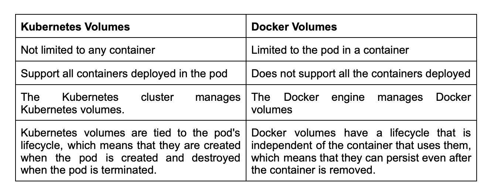
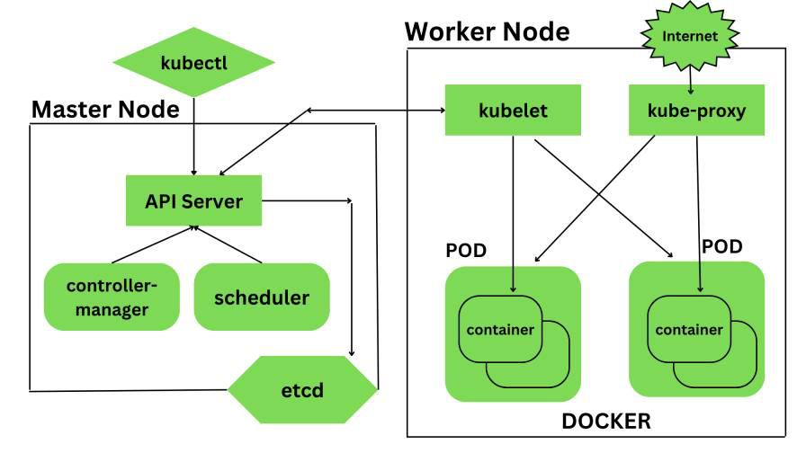

# 面试题集: 运维-K8s

[返回旧的已有问题](#旧的问题列表)

## 技能概览

### 集群架构与组件

| 能力点 | 技能难度| 快速跳转 |
| :--- |:---: | :---: |
| Kubernetes架构核心组件理解 | 2 | [直达题目](#kubernetes架构核心组件理解) |
| API Server工作机制 | 3 | [直达题目](#api-server工作机制) |
| etcd数据存储原理 | 4 | [直达题目](#etcd数据存储原理) |
| Controller Manager职责与工作流程 | 4 | [直达题目](#controller-manager职责与工作流程) |
| Scheduler调度算法与优化 | 5 | [直达题目](#scheduler调度算法与优化) |
| Kubelet与Node管理机制 | 4 | [直达题目](#kubelet与node管理机制) |
| 集群高可用设计与实现 | 6 | [直达题目](#集群高可用设计与实现) |
| 多集群管理与联邦架构 | 7 | [直达题目](#多集群管理与联邦架构) |
| 集群架构优化与扩展设计 | 8 | [直达题目](#集群架构优化与扩展设计) |
| 集群架构源码分析与定制 | 9 | [直达题目](#集群架构源码分析与定制) |
| 企业级集群架构设计与治理 | 10 | [直达题目](#企业级集群架构设计与治理) |

### 网络与服务发现

| 能力点 | 技能难度| 快速跳转 |
| :--- |:---: | :---: |
| Kubernetes网络模型理解 | 2 | [直达题目](#kubernetes网络模型理解) |
| Pod网络通信原理 | 3 | [直达题目](#pod网络通信原理) |
| CNI插件配置与管理 | 4 | [直达题目](#cni插件配置与管理) |
| Service类型与负载均衡机制 | 3 | [直达题目](#service类型与负载均衡机制) |
| DNS服务与服务发现机制 | 4 | [直达题目](#dns服务与服务发现机制) |
| 网络策略(NetworkPolicy)配置与应用 | 5 | [直达题目](#网络策略配置与应用) |
| 网络性能调优与故障排查 | 6 | [直达题目](#网络性能调优与故障排查) |
| 跨集群网络与多租户隔离设计 | 7 | [直达题目](#跨集群网络与多租户隔离设计) |
| 网络插件源码分析与定制开发 | 9 | [直达题目](#网络插件源码分析与定制开发) |
| 企业级网络架构设计与治理 | 10 | [直达题目](#企业级网络架构设计与治理) |

### 存储管理

| 能力点 | 技能难度| 快速跳转 |
| :--- |:---: | :---: |
| Kubernetes存储模型理解 | 2 | [直达题目](#kubernetes存储模型理解) |
| PersistentVolume与PersistentVolumeClaim使用 | 3 | [直达题目](#persistentvolume与persistentvolumeclaim使用) |
| StorageClass配置与动态存储供应 | 4 | [直达题目](#storageclass配置与动态存储供应) |
| 数据备份与恢复策略 | 5 | [直达题目](#数据备份与恢复策略) |
| 存储性能调优与故障排查 | 6 | [直达题目](#存储性能调优与故障排查) |
| 分布式存储系统集成（如Ceph、GlusterFS） | 7 | [直达题目](#分布式存储系统集成-如ceph-glusterfs) |
| 存储插件开发与定制 | 9 | [直达题目](#存储插件开发与定制) |
| 企业级存储架构设计与治理 | 10 | [直达题目](#企业级存储架构设计与治理) |

### 安全管理

| 能力点 | 技能难度| 快速跳转 |
| :--- |:---: | :---: |
| Kubernetes安全模型理解 | 2 | [直达题目](#kubernetes安全模型理解) |
| 认证与授权机制（RBAC、ABAC） | 3 | [直达题目](#认证与授权机制-rbac-abac) |
| Pod安全策略（PSP）与安全上下文 | 4 | [直达题目](#pod安全策略-psp-与安全上下文) |
| 网络安全策略配置与管理 | 5 | [直达题目](#网络安全策略配置与管理) |
| 镜像安全扫描与漏洞管理 | 5 | [直达题目](#镜像安全扫描与漏洞管理) |
| 安全审计与合规管理 | 6 | [直达题目](#安全审计与合规管理) |
| 安全事件响应与应急处理 | 7 | [直达题目](#安全事件响应与应急处理) |
| 安全加固与零信任架构设计 | 8 | [直达题目](#安全加固与零信任架构设计) |
| 安全组件源码分析与定制 | 9 | [直达题目](#安全组件源码分析与定制) |
| 企业级安全治理与策略制定 | 10 | [直达题目](#企业级安全治理与策略制定) |

### 监控与日志

| 能力点 | 技能难度| 快速跳转 |
| :--- |:---: | :---: |
| 监控指标与Prometheus基础 | 2 | [直达题目](#监控指标与prometheus基础) |
| Alertmanager告警配置与管理 | 3 | [直达题目](#alertmanager告警配置与管理) |
| 日志收集与集中管理（EFK/ELK） | 4 | [直达题目](#日志收集与集中管理-efk-elk) |
| 监控系统性能调优 | 5 | [直达题目](#监控系统性能调优) |
| 自定义监控指标与扩展 | 6 | [直达题目](#自定义监控指标与扩展) |
| 故障诊断与根因分析 | 7 | [直达题目](#故障诊断与根因分析) |
| 监控系统架构设计与优化 | 8 | [直达题目](#监控系统架构设计与优化) |
| 监控组件源码分析与定制 | 9 | [直达题目](#监控组件源码分析与定制) |
| 企业级监控治理与策略制定 | 10 | [直达题目](#企业级监控治理与策略制定) |

### 自动化运维与CI/CD

| 能力点 | 技能难度| 快速跳转 |
| :--- |:---: | :---: |
| kubectl命令行工具熟练使用 | 3 | [直达题目](#kubectl命令行工具熟练使用) |
| Helm包管理与Chart开发 | 4 | [直达题目](#helm包管理与chart开发) |
| Operator模式理解与开发 | 5 | [直达题目](#operator模式理解与开发) |
| CI/CD流水线集成与自动化部署 | 6 | [直达题目](#ci-cd流水线集成与自动化部署) |
| GitOps实践与工具链集成 | 7 | [直达题目](#gitops实践与工具链集成) |
| 自动化运维脚本与工具开发 | 7 | [直达题目](#自动化运维脚本与工具开发) |
| 复杂场景下的Operator设计与优化 | 8 | [直达题目](#复杂场景下的operator设计与优化) |
| 自动化运维平台架构设计 | 9 | [直达题目](#自动化运维平台架构设计) |
| 企业级自动化运维体系建设 | 10 | [直达题目](#企业级自动化运维体系建设) |

### 故障排查与性能优化

| 能力点 | 技能难度| 快速跳转 |
| :--- |:---: | :---: |
| Pod状态与事件诊断 | 3 | [直达题目](#pod状态与事件诊断) |
| 日志分析与问题定位 | 4 | [直达题目](#日志分析与问题定位) |
| 资源调度与瓶颈分析 | 5 | [直达题目](#资源调度与瓶颈分析) |
| 性能调优策略与实践 | 6 | [直达题目](#性能调优策略与实践) |
| 集群容量规划与扩展策略 | 7 | [直达题目](#集群容量规划与扩展策略) |
| 复杂故障排查与恢复方案 | 8 | [直达题目](#复杂故障排查与恢复方案) |
| 性能监控与自动化调优 | 9 | [直达题目](#性能监控与自动化调优) |
| 企业级性能优化与架构改进 | 10 | [直达题目](#企业级性能优化与架构改进) |

### 存储与数据管理

| 能力点 | 技能难度| 快速跳转 |
| :--- |:---: | :---: |
| 卷管理与挂载机制 | 3 | [直达题目](#卷管理与挂载机制) |
| 数据持久化策略设计 | 4 | [直达题目](#数据持久化策略设计) |
| 备份恢复工具与流程 | 5 | [直达题目](#备份恢复工具与流程) |
| 存储安全与加密技术 | 6 | [直达题目](#存储安全与加密技术) |
| 分布式存储系统集成 | 7 | [直达题目](#分布式存储系统集成) |
| 存储系统性能调优 | 8 | [直达题目](#存储系统性能调优) |
| 存储系统源码分析 | 9 | [直达题目](#存储系统源码分析) |
| 企业级存储架构设计 | 10 | [直达题目](#企业级存储架构设计) |

### 集群升级与维护

| 能力点 | 技能难度| 快速跳转 |
| :--- |:---: | :---: |
| Kubernetes版本管理与升级策略 | 4 | [直达题目](#kubernetes版本管理与升级策略) |
| 集群备份与恢复 | 5 | [直达题目](#集群备份与恢复) |
| 节点维护与滚动更新 | 5 | [直达题目](#节点维护与滚动更新) |
| 升级过程中的兼容性处理 | 6 | [直达题目](#升级过程中的兼容性处理) |
| 自动化升级流程设计 | 7 | [直达题目](#自动化升级流程设计) |
| 多版本集群管理 | 8 | [直达题目](#多版本集群管理) |
| 升级失败故障排查与回滚 | 9 | [直达题目](#升级失败故障排查与回滚) |
| 企业级升级策略与流程规范 | 10 | [直达题目](#企业级升级策略与流程规范) |

---

## 详细题目列表

### 集群架构与组件

<a id='kubernetes架构核心组件理解'></a>
#### Kubernetes架构核心组件理解

**技能难度评分:** 2/10

**问题 1:**

> 以下哪个是 Kubernetes 控制平面（Control Plane）中的核心组件，负责维护集群的整体状态和调度工作负载？
> 
> A. kubelet
> B. kube-apiserver
> C. etcd
> D. kube-proxy
> 
> 请从中选择唯一正确的答案。

<details>
  <summary>点击查看答案</summary>
  <p><strong>

正确答案: B. kube-apiserver。kube-apiserver 是 Kubernetes 控制平面的核心组件，负责处理所有 REST 操作，维护集群的整体状态，是集群的入口。选项 A (kubelet) 是节点上的代理，负责管理容器生命周期；选项 C (etcd) 是分布式键值存储，保存集群状态数据，但不直接调度工作负载；选项 D (kube-proxy) 负责集群网络服务代理，不属于控制平面核心组件。</strong></p>
</details>

**问题 2:**

> 假设你负责维护一个生产环境的Kubernetes集群，集群中运行着多个关键业务服务。某天，你发现部分服务无法正常调度，Pod一直处于Pending状态。请结合Kubernetes的架构核心组件，简要分析可能导致Pod调度失败的原因，并说明相关组件在这个过程中各自的作用。

<details>
  <summary>点击查看答案</summary>
  <p><strong>

正确答案: 在Kubernetes架构中，核心组件包括API Server、Scheduler、Controller Manager、Etcd、Kubelet等。当Pod处于Pending状态且无法调度时，主要涉及的组件是Scheduler和API Server。

1. API Server：作为集群的入口，接收用户和系统的请求。当新的Pod被创建时，API Server将Pod信息存储到Etcd。

2. Scheduler：负责监控API Server中的未调度Pod，根据资源和调度策略选择合适的Node来运行Pod。如果调度失败，可能是因为集群资源不足（CPU、内存等）、节点不可用或调度策略限制。

3. Etcd：保存整个集群的状态数据，Scheduler和Controller Manager通过读取Etcd数据来做调度和管理决策。

4. Kubelet：负责在Node上执行Pod，调度失败时，Kubelet不会启动Pod。

因此，Pod调度失败可能是由于资源不足、节点状态异常或调度策略配置不当。分析问题时，应检查Scheduler日志、节点状态以及资源使用情况。</strong></p>
</details>

---

<a id='api-server工作机制'></a>
#### API Server工作机制

**技能难度评分:** 3/10

**问题 1:**

> 以下关于Kubernetes API Server的工作机制，哪一项描述是正确的？
> 
> A. API Server直接将所有请求写入etcd，并且不进行任何验证或授权
> B. API Server是集群中的唯一入口，负责处理REST请求，验证、授权后将数据存储到etcd
> C. API Server只能处理来自kubectl的请求，不能处理其他组件的请求
> D. API Server主要负责调度Pod到节点上，并直接管理节点资源

<details>
  <summary>点击查看答案</summary>
  <p><strong>

正确答案: B. API Server是集群中的唯一入口，负责处理REST请求，验证、授权后将数据存储到etcd。解释：API Server作为Kubernetes集群的核心组件，是所有REST请求的统一入口。它负责对请求进行认证和授权，验证请求的合法性，然后将数据存储到etcd。选项A错误，因为API Server会进行认证和授权；选项C错误，因为API Server处理来自集群内外多种组件的请求；选项D错误，调度工作由Scheduler负责，而非API Server。</strong></p>
</details>

**问题 2:**

> 在一个Kubernetes集群中，用户通过kubectl发起了一个创建Pod的请求。请简述API Server在接收到该请求后处理的主要工作流程，并说明API Server如何保证请求的安全性和一致性？

<details>
  <summary>点击查看答案</summary>
  <p><strong>

正确答案: 当用户通过kubectl发起创建Pod的请求后，API Server接收到该请求，首先会进行身份认证（Authentication）以确认请求者的身份，然后进行权限校验（Authorization）确保该用户有创建Pod的权限。接下来，API Server会对请求内容进行数据验证（Admission Control），包括校验请求格式和执行准入控制插件。通过验证后，API Server将请求写入etcd，作为集群的唯一数据存储，确保数据的一致性。然后，API Server会将该事件通知调度器（Scheduler）和控制器管理器（Controller Manager），以便后续处理。此外，API Server通过使用基于TLS的加密通道保证通信安全，并通过乐观并发控制与资源版本（Resource Version）机制维护数据一致性。整个过程确保了请求的安全性和集群状态的最终一致性。</strong></p>
</details>

---

<a id='etcd数据存储原理'></a>
#### etcd数据存储原理

**技能难度评分:** 4/10

**问题 1:**

> 在 Kubernetes 中，etcd 作为集群的关键数据存储组件，其数据存储原理主要基于哪种机制？
> 
> A. 关系型数据库存储，使用 SQL 查询进行数据访问
> B. 基于分布式一致性算法 Raft 的键值存储，确保数据的强一致性
> C. 使用分布式文件系统存储数据，如 Ceph 或 GlusterFS
> D. 采用最终一致性的 NoSQL 存储模型，如 Cassandra

<details>
  <summary>点击查看答案</summary>
  <p><strong>

正确答案: B. 基于分布式一致性算法 Raft 的键值存储，确保数据的强一致性。etcd 通过 Raft 一致性算法实现分布式系统中的强一致性，保证所有节点的数据状态一致，采用键值对方式存储数据，适合 Kubernetes 的高可用需求。其他选项描述的存储方式与 etcd 的实现原理不符。</strong></p>
</details>

**问题 2:**

> 在一个Kubernetes集群中，etcd作为集群的关键数据存储组件，存储了大量的配置信息和状态数据。请简述etcd是如何保证数据持久化和一致性的？结合Raft协议，说明etcd在发生节点故障时是如何保证数据不丢失的。

<details>
  <summary>点击查看答案</summary>
  <p><strong>

正确答案: etcd使用BoltDB作为底层的持久化存储引擎，将数据以键值对的形式存储在本地磁盘中，保证数据在节点重启后仍然存在。为了保证数据的一致性，etcd采用了Raft共识算法，确保集群中的多数节点达成一致后才提交数据。Raft协议通过选举leader节点，所有写操作必须通过leader进行，leader将日志复制到follower节点，只有当多数节点确认日志后才提交，保证数据一致且不会丢失。当某个节点故障时，只要集群中多数节点存活，etcd就能通过日志复制和状态机应用，保证数据不会丢失并能正常提供服务。</strong></p>
</details>

---

<a id='controller-manager职责与工作流程'></a>
#### Controller Manager职责与工作流程

**技能难度评分:** 4/10

**问题 1:**

> 在 Kubernetes 集群中，Controller Manager 的主要职责是什么？
> 
> A. 负责调度 Pod 到合适的节点上执行。
> B. 负责监控集群状态并维持集群的期望状态，通过执行各种控制循环（控制器）来管理资源。
> C. 负责存储集群的所有配置信息和状态数据。
> D. 负责处理集群内的网络通信和服务发现。

<details>
  <summary>点击查看答案</summary>
  <p><strong>

正确答案: B. 负责监控集群状态并维持集群的期望状态，通过执行各种控制循环（控制器）来管理资源。 Controller Manager 通过运行多个控制器，持续监测集群的实际状态，并根据期望状态执行相应操作，确保资源对象符合用户定义的规范。A 选项描述的是 Scheduler 的职责，C 选项描述的是 etcd 的职责，D 选项涉及的是 kube-proxy 和网络插件的职责。</strong></p>
</details>

**问题 2:**

> 在一个Kubernetes集群中，某节点因故障导致Pod异常退出。请结合Controller Manager的职责与工作流程，简述Controller Manager如何检测并修复该异常状态？

<details>
  <summary>点击查看答案</summary>
  <p><strong>

正确答案: Controller Manager是Kubernetes集群中的核心组件之一，负责运行不同类型的控制器以确保集群状态与期望状态一致。当节点上的Pod异常退出时，以下是Controller Manager的工作流程：

1. **状态监控**：Controller Manager通过与API Server通信，持续监控集群资源的状态，包括Pod的运行状况。

2. **事件感知**：当Pod异常退出，API Server会更新Pod的状态信息，Controller Manager中的ReplicaSet或Deployment控制器会检测到Pod数量低于期望数量。

3. **决策制定**：控制器判断当前状态与期望状态不符，决定需要创建新的Pod来替代异常退出的Pod。

4. **执行操作**：控制器向API Server发送请求，创建新的Pod，确保ReplicaSet或Deployment的Pod副本数恢复到期望值。

5. **持续循环**：Controller Manager不断循环监控和调整，直到集群状态恢复正常。

通过这一流程，Controller Manager自动感知异常并触发修复动作，保障集群的稳定运行。</strong></p>
</details>

---

<a id='scheduler调度算法与优化'></a>
#### Scheduler调度算法与优化

**技能难度评分:** 5/10

**问题 1:**

> 在 Kubernetes Scheduler 中，调度算法通常包括多个步骤以决定将 Pod 调度到哪个节点。以下哪一项描述了调度算法中“优选（Priority）”阶段的正确功能？
> 
> A. 过滤掉不满足 Pod 资源需求的节点，确保只考虑可行节点。
> 
> B. 计算每个节点的优先级分数，以确定最适合运行该 Pod 的节点。
> 
> C. 直接将 Pod 分配给资源利用率最低的节点，无需计算分数。
> 
> D. 通过随机选择一个节点，避免调度热点问题。
> 
> 请从以上选项中选择最合适的一项。

<details>
  <summary>点击查看答案</summary>
  <p><strong>

正确答案: B. 计算每个节点的优先级分数，以确定最适合运行该 Pod 的节点。-- 在 Kubernetes Scheduler 的调度流程中，“过滤（Filter）”阶段先排除不合适的节点，之后的“优选（Priority）”阶段会计算每个剩余节点的优先级分数，根据得分高低来选择最合适的节点。选项 A 描述的是过滤阶段，选项 C 和 D 不符合调度算法的实际流程。</strong></p>
</details>

**问题 2:**

> 在一个多租户的Kubernetes集群中，存在多个命名空间和大量的Pod请求。假设某些高优先级业务Pod经常因资源调度延迟导致启动缓慢，影响了业务的响应时间。请简述Kubernetes Scheduler的调度流程中哪些算法环节可能导致这种情况，并提出至少两种优化调度性能的策略。

<details>
  <summary>点击查看答案</summary>
  <p><strong>

正确答案: Kubernetes Scheduler的调度流程主要包括过滤（Filtering）和优选（Scoring）两大环节。在过滤阶段，Scheduler会筛选出符合Pod资源需求和调度约束的节点；在优选阶段，会根据多种调度算法（如资源利用率、亲和性、反亲和性等）对节点进行打分，选择得分最高的节点进行调度。

导致高优先级Pod调度延迟的可能原因包括：

1. 过滤环节中节点资源紧张，导致可用节点较少，增加调度等待时间。
2. 优选环节中的算法权重设置不合理，导致高优先级Pod未能优先调度。
3. 集群中存在大量低优先级Pod占用资源，影响调度效率。

针对上述情况，可以采取如下优化策略：

1. 使用Pod优先级和抢占（Priority and Preemption）机制，确保高优先级Pod能抢占低优先级Pod的资源，提升调度响应速度。
2. 调整调度器的调度算法权重或自定义调度策略，优化节点打分逻辑，使高优先级Pod优先获得资源。
3. 部署多调度器（Multiple Schedulers），将不同优先级或业务类型的Pod分配到专门的调度器，减少调度延迟。
4. 采用资源预留和弹性伸缩策略，确保集群中有足够的资源应对高优先级Pod的调度需求。</strong></p>
</details>

---

<a id='kubelet与node管理机制'></a>
#### Kubelet与Node管理机制

**技能难度评分:** 4/10

**问题 1:**

> 在 Kubernetes 集群中，Kubelet 主要负责节点管理的哪项功能？
> 
> A. 负责调度 Pod 到节点上
> B. 监控节点状态并向 API Server 汇报
> C. 管理集群内的网络策略
> D. 存储和管理容器镜像
> 
> 请从以上选项中选择最符合 Kubelet 作用的答案。

<details>
  <summary>点击查看答案</summary>
  <p><strong>

正确答案: B. 监控节点状态并向 API Server 汇报。Kubelet 作为节点上的主要代理，负责监控节点和容器的状态，并将信息定期汇报给 API Server，确保集群的健康与状态同步。其他选项中，调度由 Scheduler 负责，网络策略由网络插件管理，镜像存储由容器运行时处理。</strong></p>
</details>

**问题 2:**

> 在一个生产环境的Kubernetes集群中，某个Node节点突然无法响应调度请求且Pod状态显示为不可用。请结合Kubelet与Node管理机制，简述Kubelet在Node状态监控和汇报中的作用，以及在该场景下你会如何排查和解决问题？

<details>
  <summary>点击查看答案</summary>
  <p><strong>

正确答案: Kubelet是运行在每个Node上的主要代理，负责管理该Node上的Pod生命周期，并定期向API Server汇报Node的状态（包括健康状况、资源使用情况等）。Kubelet通过心跳机制和Node Status更新，确保Master能实时了解Node的健康状态。

在Node无法响应调度请求且Pod状态异常的场景中，排查步骤包括：
1. 检查Kubelet进程是否正常运行，确认服务未崩溃或异常停止。
2. 查看Kubelet日志，寻找错误或警告信息，排查网络问题、证书问题或资源不足等。
3. 检查Node的网络连通性，确保API Server与Node之间通信正常。
4. 查看Node的状态（kubectl get nodes），确认是否为NotReady状态，进一步查看具体原因。
5. 根据日志和状态信息，采取相应措施，如重启Kubelet服务、修复网络问题或调整资源分配。

通过这些步骤，可以定位问题根源，恢复Node的正常功能，保证Pod的正常运行。</strong></p>
</details>

---

<a id='集群高可用设计与实现'></a>
#### 集群高可用设计与实现

**技能难度评分:** 6/10

**问题 1:**

> 在设计 Kubernetes 集群的高可用架构时，哪种方案最有效地保证了 API Server 的高可用性？
> 
> A. 部署多个 API Server 实例，并通过负载均衡器（如 HAProxy 或 Nginx）进行流量分发
> 
> B. 只部署一个 API Server 实例，依赖 etcd 的高可用性保障整个集群的稳定
> 
> C. 在每个节点上都运行一个 API Server 实例，无需额外的负载均衡配置
> 
> D. 通过定期备份 API Server 配置文件，快速恢复节点故障即可保证高可用

<details>
  <summary>点击查看答案</summary>
  <p><strong>

正确答案: A. 部署多个 API Server 实例，并通过负载均衡器（如 HAProxy 或 Nginx）进行流量分发。因为 Kubernetes API Server 是集群的核心入口，单点故障会导致整个集群不可用。通过部署多个 API Server 实例并使用负载均衡器分发请求，可以确保即使某个实例故障，集群依然可用，从而实现高可用性。选项 B 错误，因为即使 etcd 高可用，单一 API Server 仍是单点故障。选项 C 错误，API Server 不应在每个节点自动运行，也需要集中管理和负载均衡。选项 D 虽有备份，但无法实时保障高可用性。</strong></p>
</details>

**问题 2:**

> 在一个生产环境中，某公司部署了一个Kubernetes集群，负责运行关键业务应用。为了确保集群的高可用性，需要设计并实现高可用方案。请结合具体场景，描述你如何设计Kubernetes集群的高可用架构，包括但不限于控制平面组件和etcd的高可用部署，以及如何保障数据一致性和故障自动恢复。请重点说明你的设计思路和实现细节。

<details>
  <summary>点击查看答案</summary>
  <p><strong>

正确答案: 设计Kubernetes集群高可用的关键在于保证控制平面（Control Plane）和数据存储（etcd）组件的冗余和故障自动恢复能力。

1. 控制平面高可用设计：
- 部署多个（通常3个或以上）API Server节点，分布在不同的物理或虚拟机上，确保单点故障不会影响集群控制。
- 使用负载均衡器（如HAProxy、Nginx或云厂商的负载均衡服务）对外暴露API Server，保证请求能够均匀分发到健康的API Server节点。
- 其他控制平面组件（Controller Manager、Scheduler）也应采用多实例部署，通常采用Leader选举机制保证只有一个实例在工作，其他作为备份。

2. etcd高可用设计：
- 部署一个etcd集群，建议节点数为奇数（如3或5），分布在不同的节点上，防止脑裂。
- 通过etcd的内置Raft协议实现数据的强一致性，确保所有节点数据同步。
- 定期备份etcd数据，防止数据丢失。

3. 数据一致性与故障恢复保障：
- 利用etcd的强一致性保证，控制平面组件能够准确获取集群状态。
- 负载均衡器检测API Server健康状态，自动剔除不可用节点。
- 控制平面组件的Leader选举机制保证高可用时刻只有一个主实例处于工作状态。
- 定期监控集群状态，配合自动化运维工具实现故障自动恢复。

总结：通过多节点冗余部署控制平面和etcd集群，结合负载均衡和Leader选举机制，保证集群控制层的高可用和数据一致性。同时，实施完善的监控和备份策略，提升故障响应和恢复能力。</strong></p>
</details>

---

<a id='多集群管理与联邦架构'></a>
#### 多集群管理与联邦架构

**技能难度评分:** 7/10

**问题 1:**

> 在 Kubernetes 多集群管理与联邦架构中，哪种机制最适合实现跨集群的统一资源调度和全局服务发现？
> 
> A. 使用 Kubernetes 的 Namespace 隔离不同集群中的资源，实现资源共享和调度
> B. 利用 Kubernetes 联邦（Federation）API 聚合多个集群，实现跨集群资源同步和全局服务发现
> C. 通过在每个集群中部署相同的 Deployment，手动同步服务状态，达到跨集群调度的效果
> D. 依赖外部负载均衡器对不同集群的服务 IP 进行轮询，实现跨集群服务的访问和调度

<details>
  <summary>点击查看答案</summary>
  <p><strong>

正确答案: B. 利用 Kubernetes 联邦（Federation）API 聚合多个集群，实现跨集群资源同步和全局服务发现。因为 Kubernetes 联邦架构专为多集群管理设计，能够统一调度资源和实现服务的全局发现，避免了手动同步和单独集群隔离带来的管理复杂性。</strong></p>
</details>

**问题 2:**

> 假设你所在的公司运营着多个 Kubernetes 集群，分布在不同的地理区域，用于支撑高可用和灾备需求。近期业务需求要求实现跨集群的统一服务发现和配置管理，同时希望能够在多个集群之间实现应用的自动同步和统一策略管理。请结合多集群管理与联邦架构的相关知识，简述你会如何设计和实现这样的方案？
> 
> 请重点说明：
> 1. 联邦架构在该场景中的作用和优势；
> 2. 关键组件和技术选型；
> 3. 可能面临的挑战以及对应的解决思路。

<details>
  <summary>点击查看答案</summary>
  <p><strong>

正确答案: 1. 联邦架构的作用和优势：
- 联邦架构可以实现跨多个 Kubernetes 集群的统一资源管理和调度，支持服务发现、配置同步和策略统一，从而满足高可用和灾备需求。
- 通过联邦，可以实现应用和配置在集群间的自动同步，避免手动操作带来的不一致性，提高运维效率。
- 支持基于策略的流量分配和故障隔离，增强系统的弹性和容灾能力。

2. 关键组件和技术选型：
- Kubernetes Federation V2（KubeFed）：作为联邦控制平面，负责多集群资源的同步和协调。
- Service Mesh（如 Istio、多集群模式）：支持跨集群服务发现和流量管理。
- 配置管理工具（如 GitOps 工具 Flux、Argo CD）：实现配置和应用的持续交付和同步。
- 多集群网络方案（如 VPN、SDN 或云厂商提供的跨区域网络）：保障集群间通信。

3. 挑战及解决思路：
- 网络延迟和安全：设计安全的跨集群网络连接，使用加密和认证机制。
- 资源冲突和一致性问题：利用联邦控制器的冲突解决策略，确保资源状态一致。
- 版本兼容性和升级风险：制定严格的版本管理和升级流程，逐步推广。
- 监控和故障排查复杂性：部署集中化监控和日志收集系统，支持跨集群的统一视图。</strong></p>
</details>

---

<a id='集群架构优化与扩展设计'></a>
#### 集群架构优化与扩展设计

**技能难度评分:** 8/10

**问题 1:**

> 在 Kubernetes 集群架构优化与扩展设计中，若希望实现控制平面（Control Plane）高可用并且易于水平扩展，以下哪种设计方案最合适？
> 
> A. 部署单个高性能的 Master 节点，所有控制组件集中在该节点上，依赖其性能支撑高负载。
> 
> B. 部署多个 Master 节点，使用外部负载均衡器将请求分发到各个 Master 节点，保证 API Server 的高可用和扩展性。
> 
> C. 将所有控制组件（API Server、Controller Manager、Scheduler）部署在不同的节点上，且不使用负载均衡器，依赖客户端直接连接。
> 
> D. 只部署一个 Master 节点，将所有 Worker 节点的负载均匀分配，控制平面不需要扩展。

<details>
  <summary>点击查看答案</summary>
  <p><strong>

正确答案: B. 部署多个 Master 节点，使用外部负载均衡器将请求分发到各个 Master 节点，保证 API Server 的高可用和扩展性。 - 这是实现 Kubernetes 控制平面高可用和水平扩展的推荐做法。通过部署多个 Master 节点，避免单点故障；并通过负载均衡器分发请求，提升系统整体的可靠性和扩展能力。选项 A 依赖单点，存在风险；选项 C 缺少负载均衡，增加客户端复杂度和故障风险；选项 D 忽视了控制平面的高可用需求。</strong></p>
</details>

**问题 2:**

> 假设你负责维护一个生产环境的 Kubernetes 集群，该集群当前运行多个关键业务应用，随着业务增长，集群中的节点资源逐渐紧张且调度延迟增加。请结合集群架构优化与扩展设计的知识，详细说明你会如何分析当前集群瓶颈，并设计一个可扩展且高可用的集群架构方案？请重点说明以下内容：
> 
> 1. 你会从哪些维度评估集群的性能瓶颈？
> 2. 在节点扩展方面，你会选择怎样的扩展策略？（考虑自动扩展、节点类型选择等）
> 3. 如何优化集群的控制平面以提升稳定性和响应速度？
> 4. 针对业务多样化需求，你会如何设计集群的多租户隔离和资源管理？
> 
> 请结合具体技术方案和最佳实践进行阐述。

<details>
  <summary>点击查看答案</summary>
  <p><strong>

正确答案: 1. 评估集群性能瓶颈维度：
   - 节点资源使用率（CPU、内存、磁盘、网络）监控，确认是否存在资源紧张。
   - 调度延迟和调度失败率，分析 Kubernetes 调度器是否成为瓶颈。
   - 控制平面组件（API Server、Scheduler、Controller Manager）响应时间和负载。
   - Pod 启动时间和网络延迟，确认应用层面是否存在性能瓶颈。

2. 节点扩展策略：
   - 启用 Cluster Autoscaler 实现根据负载自动增加或减少节点，提升资源利用率。
   - 结合业务负载特点，选择不同类型节点（如计算密集型、内存密集型）进行异构扩展。
   - 使用节点池（Node Pool）管理不同节点类型，便于分配和调度。

3. 控制平面优化：
   - 部署高可用控制平面，多副本 API Server 分散请求压力。
   - 优化 ETCD 集群性能，例如使用 SSD 存储、合理配置副本数。
   - 监控和调整 API Server 的请求限流和缓存参数，减少响应延迟。

4. 多租户隔离与资源管理：
   - 通过命名空间（Namespace）实现逻辑隔离。
   - 利用资源配额（Resource Quotas）和限制范围（Limit Ranges）控制各租户资源使用。
   - 结合网络策略（NetworkPolicy）限制租户间网络访问，提升安全性。
   - 采用 RBAC 策略精细化权限管理，保障租户操作安全。

综合以上策略，可以构建一个既能动态扩展、资源利用高效，又具备高可用和安全隔离能力的 Kubernetes 集群，满足业务持续增长的需求。</strong></p>
</details>

---

<a id='集群架构源码分析与定制'></a>
#### 集群架构源码分析与定制

**技能难度评分:** 9/10

**问题 1:**

> 在 Kubernetes 集群架构源码分析与定制过程中，若需定制 API Server 的认证流程，以下哪项修改方式最符合源码设计原则？
> 
> A. 直接修改 kube-apiserver 源码中的认证模块逻辑，然后重新编译部署。
> 
> B. 使用 Kubernetes 插件机制，编写自定义认证插件并通过命令行参数引入。
> 
> C. 在 kube-apiserver 的启动参数中关闭所有默认认证，使用外部负载均衡器完成认证。
> 
> D. 修改 kubelet 源码，增强其对 API Server 的认证请求处理能力。

<details>
  <summary>点击查看答案</summary>
  <p><strong>

正确答案: B. 使用 Kubernetes 插件机制，编写自定义认证插件并通过命令行参数引入。——Kubernetes 设计了灵活的插件机制，允许通过动态加载插件来定制认证流程，避免直接修改核心源码，提高扩展性和维护性。选项A直接修改源码违背了扩展性原则，选项C关闭默认认证会导致安全隐患，选项D修改 kubelet 源码与 API Server 认证流程无关。</strong></p>
</details>

**问题 2:**

> 假设你所在的团队正在使用一个开源的 Kubernetes 集群管理平台，当前需要对集群调度模块进行定制，以满足特定的业务需求，比如实现基于业务优先级的调度策略。请结合你对 Kubernetes 源码架构的理解，简述你如何分析调度模块的源码结构，并设计定制方案。请重点说明你会关注哪些核心组件和关键代码路径，以及如何确保定制后的调度策略能够安全高效地集成到现有集群架构中。

<details>
  <summary>点击查看答案</summary>
  <p><strong>

正确答案: 首先，分析 Kubernetes 调度模块的源码结构时，需要重点关注 scheduler 组件，特别是调度器的调度循环（Scheduling Loop）、调度插件框架（Scheduler Framework）及其各个调度阶段（预选、打分、绑定等）。调度器源码主要位于 k8s.io/kubernetes/pkg/scheduler 目录下。

具体步骤包括：
1. 理解调度流程：从 Pod 被调度到节点的全过程，包括调度队列（Scheduling Queue）、调度算法实现、调度插件调用等。
2. 定位源码关键点：关注 Scheduler Framework 的插件接口，如预选（Filter）、打分（Score）、预绑定（PreBind）、绑定（Bind）等阶段的插件注册和执行逻辑。
3. 设计定制方案：基于业务优先级，可以自定义一个调度打分插件，通过实现 Score 插件接口对不同业务的 Pod 赋予不同权重，影响调度优先级。
4. 集成方案：将自定义插件注册到调度器配置文件中，确保调度器启动时加载该插件。

为了保证定制策略的安全和高效，需要做好单元测试及集成测试，监控调度性能指标，并通过合理的插件隔离避免影响其他调度逻辑。此外，代码改动应遵循 Kubernetes 社区的编码规范，确保后续升级和维护的便利。</strong></p>
</details>

---

<a id='企业级集群架构设计与治理'></a>
#### 企业级集群架构设计与治理

**技能难度评分:** 10/10

**问题 1:**

> 在设计企业级Kubernetes集群架构时，下列哪项做法最有效地确保了集群的高可用性和可扩展性？
> 
> A. 部署单个大型控制平面节点以简化管理，所有工作节点直连该节点。
> 
> B. 采用多控制平面节点的HA架构，结合外部负载均衡器，同时合理划分命名空间和资源配额来治理集群资源。
> 
> C. 将所有业务服务部署在同一个命名空间，方便统一管理和快速扩展。
> 
> D. 避免使用持久化存储，所有状态数据均存储在Pod内存中，以提升性能和简化架构。

<details>
  <summary>点击查看答案</summary>
  <p><strong>

正确答案: B. 采用多控制平面节点的HA架构，结合外部负载均衡器，同时合理划分命名空间和资源配额来治理集群资源。 解析：企业级Kubernetes集群设计必须保证控制平面的高可用性，通常通过多控制平面节点组成HA架构实现，并结合外部负载均衡器确保访问稳定。同时，合理划分命名空间和资源配额是集群治理的关键，能有效隔离和管理不同团队或业务的资源，提升集群的可扩展性和安全性。选项A单点控制平面存在单点故障风险，选项C命名空间单一不利于资源隔离和管理，选项D放弃持久化存储不符合生产环境状态管理需求。</strong></p>
</details>

**问题 2:**

> 假设你负责设计一个面向全球的企业级 Kubernetes 集群架构，该企业需要支持多业务线、具备高可用性、跨地域灾备能力，同时需要满足严格的安全合规要求和资源隔离需求。请你从集群划分、网络设计、访问控制及治理策略四个方面，详细描述你的设计思路和具体方案，并说明如何平衡系统的复杂度与运维效率。

<details>
  <summary>点击查看答案</summary>
  <p><strong>

正确答案: 1. 集群划分：
- 多集群策略，按照业务线和地域划分集群，避免单点故障影响所有业务。
- 采用主集群+灾备集群架构，不同区域部署多个集群，支持跨区域故障切换。
- 结合业务需求考虑集群大小和资源配额，防止资源争抢。

2. 网络设计：
- 采用基于CNI插件的网络方案，如Calico或Cilium，支持网络策略隔离。
- 使用多层网络隔离，业务线之间通过网络策略严格限制通信。
- 跨地域集群间通过VPN或专线实现安全连接和数据同步。

3. 访问控制：
- 基于RBAC细粒度权限管理，结合OIDC实现统一身份认证。
- 采用Namespace隔离业务线，并结合NetworkPolicy限制网络访问。
- 引入审计机制，记录操作日志，满足合规要求。

4. 治理策略：
- 实施资源配额和LimitRange，防止资源滥用。
- 引入策略引擎（如OPA Gatekeeper）进行策略验证和准入控制。
- 建立统一监控和告警体系，结合日志收集实现可观测性。

平衡复杂度与运维效率：
- 采用自动化运维工具（如GitOps）统一管理配置和应用发布。
- 通过标准化流程和模板降低人为误操作。
- 定期评估集群架构，逐步优化，避免过度设计。
- 利用云原生工具和平台提升运维自动化和智能化水平。</strong></p>
</details>

---


### 网络与服务发现

<a id='kubernetes网络模型理解'></a>
#### Kubernetes网络模型理解

**技能难度评分:** 2/10

**问题 1:**

> 在Kubernetes网络模型中，以下哪项描述是正确的？
> 
> A. 每个Pod都有独立的IP地址，Pod之间必须通过NodePort服务进行通信。
> B. 所有Pod共享一个IP地址，通过端口区分不同的容器。
> C. 每个Pod拥有唯一的IP地址，Pod之间可以直接通过IP地址互相通信，无需NAT转换。
> D. Kubernetes网络要求所有Pod必须位于同一个物理网络段，才能互相通信。

<details>
  <summary>点击查看答案</summary>
  <p><strong>

正确答案: C. 每个Pod拥有唯一的IP地址，Pod之间可以直接通过IP地址互相通信，无需NAT转换。 解释：Kubernetes网络模型设计原则之一是每个Pod都有唯一的IP地址，Pod之间可以直接通过IP地址通信，无需网络地址转换（NAT）。这简化了服务发现和通信机制。选项A错误，因为Pod之间通信不一定要通过NodePort服务。选项B错误，Pod不共享IP地址。选项D错误，Pods不必在同一物理网络段，Kubernetes通过网络插件实现跨物理网络的通信。</strong></p>
</details>

**问题 2:**

> 假设你在一个Kubernetes集群中部署了两个Pod，Pod A和Pod B，分别运行在不同的Node节点上。请简要说明Kubernetes网络模型是如何保证Pod A能够直接通过IP地址访问Pod B的？请结合Kubernetes的网络基本原则进行说明。

<details>
  <summary>点击查看答案</summary>
  <p><strong>

正确答案: Kubernetes网络模型的核心原则之一是“所有Pod在集群内彼此可直接通信，无需NAT（网络地址转换）”。这意味着每个Pod都有一个唯一的IP地址，整个集群内的所有Pod IP地址在逻辑上都是可路由的。具体来说：

1. **每个Pod拥有唯一的IP地址**，无论Pod在哪个Node上，IP地址都不会冲突。
2. **Node之间的网络必须互通**，集群中的所有Node都能直接路由到其他Node上的Pod IP。
3. **Kubernetes不对Pod间通信进行NAT转换**，Pod A直接使用Pod B的IP地址通信，底层网络插件（如Calico、Flannel等）负责实现跨Node的网络路由。

因此，当Pod A尝试访问Pod B时，流量会通过Node间的网络路由直接到达Pod B的IP地址，实现无缝通信。这种设计简化了网络配置和服务发现，提高了网络性能和可靠性。</strong></p>
</details>

---

<a id='pod网络通信原理'></a>
#### Pod网络通信原理

**技能难度评分:** 3/10

**问题 1:**

> 在 Kubernetes 集群中，Pod 之间能够直接通信的主要原因是什么？
> 
> A. Pod 共享同一个网络命名空间，因此可以直接通过 localhost 通信。
> 
> B. 每个 Pod 都被分配一个唯一的 IP 地址，且集群网络保证了这些 IP 之间的互通性。
> 
> C. Pod 之间通过 Kubernetes API 服务器转发流量实现通信。
> 
> D. Pod 之间的通信必须通过 Service 代理（如 kube-proxy）进行转发。

<details>
  <summary>点击查看答案</summary>
  <p><strong>

正确答案: B. 每个 Pod 都被分配一个唯一的 IP 地址，且集群网络保证了这些 IP 之间的互通性。 解释：Kubernetes 中的每个 Pod 都有唯一的 IP 地址，集群网络（如 Flannel、Calico 等）确保这些 IP 地址之间可以直接路由通信，因此 Pod 可以直接相互访问，不需要经过额外的代理或共享网络命名空间。选项 A 错误，因为每个 Pod 有自己的网络命名空间，不共享 localhost。选项 C 错误，API 服务器不转发 Pod 流量。选项 D 错误，Service 代理主要用于服务发现和负载均衡，而非 Pod 直接通信的必经路径。</strong></p>
</details>

**问题 2:**

> 在一个Kubernetes集群中，假设有两个Pod分别部署在不同的Node节点上。请简述这两个Pod之间是如何实现网络通信的？请结合Pod的网络命名空间、CNI插件和Service的作用来说明，并举例说明当通信出现问题时，你会如何排查。

<details>
  <summary>点击查看答案</summary>
  <p><strong>

正确答案: 在Kubernetes中，Pod之间的网络通信主要依赖于以下几个关键概念：

1. **Pod网络命名空间**：每个Pod有自己独立的网络命名空间，拥有唯一的IP地址。Pod内的容器共享这个网络命名空间，可以直接通过Pod的IP进行通信。

2. **CNI插件**：Kubernetes通过CNI（Container Network Interface）插件为每个Pod分配IP地址并配置路由规则，确保不同Node上的Pod可以相互访问。CNI插件负责实现跨Node的网络连接，通常通过Overlay网络（如Calico、Flannel）或路由网络实现。

3. **Service的作用**：Service为Pod提供一个稳定的访问入口，通过ClusterIP、NodePort或LoadBalancer等方式实现服务发现和负载均衡，简化Pod间通信。

通信过程示例：
- Pod A（Node 1）想访问Pod B（Node 2），Pod A直接使用Pod B的IP地址发起请求。
- CNI插件配置的Overlay网络会封装数据包，通过底层网络传输到Node 2。
- Node 2的网络插件解封装数据包，路由到Pod B。

排查思路示例：
- 检查Pod IP是否正确分配且Pod处于Running状态。
- 验证CNI插件是否正常运行，如网络插件的Pod状态。
- 使用`ping`或`curl`测试Pod间网络连通性。
- 检查iptables或网络策略（NetworkPolicy）是否阻止流量。
- 查看节点之间的网络配置和路由表。
- 检查Service是否正确配置，是否能通过Service访问Pod。</strong></p>
</details>

---

<a id='cni插件配置与管理'></a>
#### CNI插件配置与管理

**技能难度评分:** 4/10

**问题 1:**

> 在 Kubernetes 集群中配置 CNI 插件时，下列哪一项是正确的操作步骤？
> 
> A. 将 CNI 插件的二进制文件放置在每个节点的 /etc/cni/net.d 目录下，配置文件放在 /opt/cni/bin 目录中。
> 
> B. 确保所有节点的 kubelet 服务启动参数中包含 --network-plugin=cni，并且将 CNI 配置文件放在 /etc/cni/net.d 目录下。
> 
> C. 只需在 master 节点安装并配置 CNI 插件，节点自动继承网络配置。
> 
> D. 配置 CNI 插件时，不需要重启 kubelet 服务，修改配置文件后自动生效。

<details>
  <summary>点击查看答案</summary>
  <p><strong>

正确答案: B. 确保所有节点的 kubelet 服务启动参数中包含 --network-plugin=cni，并且将 CNI 配置文件放在 /etc/cni/net.d 目录下。因为 kubelet 需要通过 --network-plugin=cni 参数启用 CNI 网络插件，同时 CNI 的配置文件必须放在节点的 /etc/cni/net.d 目录下以供 kubelet 调用，确保网络插件能够正确工作。</strong></p>
</details>

**问题 2:**

> 假设你在一个生产环境的Kubernetes集群中，正在使用Calico作为CNI插件。近期集群中出现部分Pod之间网络通信异常，怀疑是Calico配置问题导致。请简述你会如何排查Calico的CNI插件配置问题，并说明在排查过程中你会关注哪些关键配置项及日志信息？

<details>
  <summary>点击查看答案</summary>
  <p><strong>

正确答案: 1. **确认Calico组件状态**：检查calico-node DaemonSet的Pod是否正常运行，使用`kubectl get pods -n calico-system`确认所有Pod状态。

2. **查看Calico日志**：通过`kubectl logs`查看calico-node的日志，关注是否有网络错误、BGP邻居状态异常或配置加载失败等信息。

3. **验证CNI配置文件**：检查`/etc/cni/net.d/`目录下的Calico配置文件（如`10-calico.conflist`），确认配置是否正确，包括IPAM类型、网络范围和策略等。

4. **检查网络策略**：确认是否有网络策略阻止了Pod间通信，使用`kubectl get networkpolicies`查看当前策略，必要时暂时禁用策略验证问题。

5. **核对IP池配置**：确认Calico的IP池配置（如IP范围、NAT设置）是否正确，可以使用`calicoctl get ippools`查看。

6. **排查路由和BGP状态**：Calico依赖BGP路由，确认BGP邻居关系是否正常，使用`calicoctl node status`查看路由状态。

7. **验证节点网络接口和IP转发**：确认节点的网络接口配置及IP转发设置是否正确。

通过上述步骤，可以定位Calico配置中的问题，从而解决Pod网络通信异常。</strong></p>
</details>

---

<a id='service类型与负载均衡机制'></a>
#### Service类型与负载均衡机制

**技能难度评分:** 3/10

**问题 1:**

> 在 Kubernetes 中，以下哪种 Service 类型默认会为集群外部提供一个稳定的 IP 地址，并通过 kube-proxy 实现负载均衡？
> 
> A. ClusterIP
> B. NodePort
> C. LoadBalancer
> D. ExternalName

<details>
  <summary>点击查看答案</summary>
  <p><strong>

正确答案: B. NodePort

解释：NodePort 类型的 Service 会在每个节点上开放一个端口，通过该端口可以从集群外部访问服务，kube-proxy 会将请求负载均衡到后端 Pod。ClusterIP 只在集群内部提供访问，LoadBalancer 依赖云提供商提供外部负载均衡器，ExternalName 用于 DNS 名称映射，不提供负载均衡功能。</strong></p>
</details>

**问题 2:**

> 假设你的Kubernetes集群中有一个Web应用服务，需要对外提供访问，并且保证流量能够均匀分配到后台的多个Pod实例上。请简述Kubernetes中常见的Service类型，并分析在该场景下选择哪种Service类型最合适？同时，说明Kubernetes是如何实现该Service类型的负载均衡机制的。

<details>
  <summary>点击查看答案</summary>
  <p><strong>

正确答案: Kubernetes中常见的Service类型包括：

1. ClusterIP：默认类型，只能在集群内部访问，提供一个虚拟IP来负载均衡集群内的Pod。
2. NodePort：在ClusterIP基础上暴露一个静态端口在每个Node上，允许外部通过NodeIP:NodePort访问服务。
3. LoadBalancer：在支持的云平台上通过云服务商的负载均衡器将服务暴露给外部。
4. ExternalName：通过DNS名称将服务映射到外部服务。

在需要对外提供访问且保证流量均匀分配的场景下，通常选择LoadBalancer类型，因为它能直接通过云服务提供商的负载均衡器实现外部访问和流量分发。

负载均衡机制：
- Kubernetes中的Service会创建一个虚拟IP（ClusterIP），并通过kube-proxy在每个Node上配置iptables规则或IPVS规则，实现流量转发到后端的Pod。
- 对于LoadBalancer类型，云平台会创建一个外部负载均衡器，将请求转发到集群中的NodePort或ClusterIP。
- 负载均衡通常采用轮询、最少连接等算法实现均衡分发。

总结：选择LoadBalancer Service类型可以满足对外访问和负载均衡的需求，背后通过kube-proxy的规则和云平台负载均衡器协同工作实现流量均衡。</strong></p>
</details>

---

<a id='dns服务与服务发现机制'></a>
#### DNS服务与服务发现机制

**技能难度评分:** 4/10

**问题 1:**

> 在 Kubernetes 中，CoreDNS 作为默认的 DNS 服务，负责集群内的服务发现。以下关于 Kubernetes DNS 服务的描述，哪项是正确的？
> 
> A. CoreDNS 只解析集群外部的 DNS 请求，集群内部的服务名称解析由 kube-proxy 处理。
> 
> B. Kubernetes 服务的 DNS 名称格式通常是：<service-name>.<namespace>.svc.cluster.local。
> 
> C. Kubernetes DNS 服务只能解析 Pod 的 IP 地址，不能解析服务名称。
> 
> D. 在 Kubernetes 中，服务发现不依赖 DNS，而是通过静态配置文件实现。

<details>
  <summary>点击查看答案</summary>
  <p><strong>

正确答案: B</strong></p>
</details>

**问题 2:**

> 在一个Kubernetes集群中，多个微服务通过服务发现机制进行通信。请结合DNS服务的工作原理，说明当一个Pod尝试访问另一个服务时，Kubernetes是如何利用DNS实现服务发现的？同时，假设某个服务的Pod动态扩缩容，DNS解析会如何保证服务请求的正确路由？

<details>
  <summary>点击查看答案</summary>
  <p><strong>

正确答案: Kubernetes中的DNS服务通常由CoreDNS实现，它通过集群内部的DNS服务器为服务创建域名解析记录。每个Service在创建时会生成一个DNS记录，例如`<service-name>.<namespace>.svc.cluster.local`。当一个Pod访问该服务时，它会发起DNS解析请求，CoreDNS根据Service的ClusterIP返回对应的IP地址。

当服务的Pod数量动态变化时，Service对象会自动更新其对应的Endpoint信息，CoreDNS通过查询这些Endpoint来解析服务的实际后端Pod IP列表。负载均衡通常由Service的ClusterIP和kube-proxy配合实现，kube-proxy会将请求转发到一个健康的后端Pod。这样，DNS解析返回的是Service的虚拟IP，真实的流量分发由kube-proxy负责，保证请求能正确路由到可用的Pod。

总结：DNS服务负责将服务名解析为Service的ClusterIP，服务发现和负载均衡依赖于Service和Endpoint的更新机制，保证了在Pod动态扩缩容时服务请求的正确路由。</strong></p>
</details>

---

<a id='网络策略配置与应用'></a>
#### 网络策略(NetworkPolicy)配置与应用

**技能难度评分:** 5/10

**问题 1:**

> 在 Kubernetes 中，NetworkPolicy 用于控制 Pod 之间的网络流量。假设你配置了一个 NetworkPolicy，指定只有标签为 `app=frontend` 的 Pod 可以访问标签为 `app=backend` 的 Pod。以下哪项描述最准确地反映了该 NetworkPolicy 的作用？
> 
> A. 只有标签为 `app=frontend` 的 Pod 可以访问所有命名空间中标签为 `app=backend` 的 Pod。
> 
> B. 只有标签为 `app=frontend` 的 Pod 可以访问相同命名空间中标签为 `app=backend` 的 Pod。
> 
> C. 标签为 `app=backend` 的 Pod 可以访问标签为 `app=frontend` 的 Pod。
> 
> D. 所有 Pod 都可以访问标签为 `app=backend` 的 Pod，但只能从标签为 `app=frontend` 的 Pod 发起访问。

<details>
  <summary>点击查看答案</summary>
  <p><strong>

正确答案: B. 只有标签为 `app=frontend` 的 Pod 可以访问相同命名空间中标签为 `app=backend` 的 Pod。 NetworkPolicy 默认作用于创建它的命名空间内的 Pod，不能跨命名空间控制流量，除非特别配置跨命名空间规则。选项 A 错误因为默认不支持跨命名空间访问控制，选项 C 方向错误，D 选项表述混淆不清。</strong></p>
</details>

**问题 2:**

> 假设你管理的Kubernetes集群中有两个命名空间：`frontend` 和 `backend`。`frontend` 命名空间中的应用需要访问 `backend` 命名空间中的服务，但不允许其他命名空间访问 `backend`。请简述如何使用 NetworkPolicy 来实现这个需求，并说明在配置过程中需要注意的关键点。

<details>
  <summary>点击查看答案</summary>
  <p><strong>

正确答案: 要实现只有 `frontend` 命名空间中的应用可以访问 `backend` 命名空间中的服务，可以为 `backend` 命名空间中的Pod创建一个 NetworkPolicy，允许来自 `frontend` 命名空间的流量，拒绝其他来源的流量。关键步骤如下：

1. **定义 NetworkPolicy 的作用范围**：指定 `backend` 命名空间中的 Pod 作为目标（通过 `podSelector`），确保策略只作用于这些 Pod。

2. **允许来自 `frontend` 命名空间的流量**：在 `ingress` 部分，使用 `namespaceSelector` 来选择 `frontend` 命名空间，并允许其访问目标 Pod。

3. **默认拒绝其他流量**：NetworkPolicy 是按需允许的，未匹配的流量默认被拒绝，因此不需要显式拒绝其他命名空间的流量。

4. **注意事项**：
   - 确保集群网络插件支持 NetworkPolicy。
   - 如果有多个 NetworkPolicy，需理解它们的叠加效果。
   - 测试策略后，验证访问控制是否符合预期。

示例配置片段：
```yaml
apiVersion: networking.k8s.io/v1
kind: NetworkPolicy
metadata:
  name: allow-frontend
  namespace: backend
spec:
  podSelector: {}
  ingress:
  - from:
    - namespaceSelector:
        matchLabels:
          name: frontend
```
</strong></p>
</details>

---

<a id='网络性能调优与故障排查'></a>
#### 网络性能调优与故障排查

**技能难度评分:** 6/10

**问题 1:**

> 在 Kubernetes 集群中，当发现 Pod 之间的网络延迟显著增加时，以下哪种方法最有效地帮助定位网络性能瓶颈？
> 
> A. 使用 kubectl logs 查看 Pod 日志，确认应用是否有异常
> B. 使用 tcpdump 或 wireshark 捕获网络包，分析网络流量和延迟情况
> C. 修改 Pod 的资源请求和限制，提升 CPU 和内存分配
> D. 通过 kubectl describe 查看 Service 资源的详细信息，确认服务状态

<details>
  <summary>点击查看答案</summary>
  <p><strong>

正确答案: B. 使用 tcpdump 或 wireshark 捕获网络包，分析网络流量和延迟情况。因为网络性能瓶颈通常涉及底层网络传输问题，通过抓包分析可以直接观察网络包的流向、延迟和丢包情况，从而有效定位问题。选项 A 主要关注应用层日志，无法直接反映网络性能；选项 C 调整资源配置与网络延迟关系不大；选项 D 查看 Service 状态不能反映具体网络传输性能。</strong></p>
</details>

**问题 2:**

> 在一个使用Calico作为CNI插件的Kubernetes集群中，某应用Pod之间的网络延迟突然升高，导致业务响应变慢。请结合网络性能调优和故障排查的思路，描述你会如何定位该问题，并提出至少两种可能的优化措施。请说明你的分析步骤和思考逻辑。

<details>
  <summary>点击查看答案</summary>
  <p><strong>

正确答案: 1. 定位问题步骤：
   - 检查Pod网络状态：使用`kubectl exec`进入Pod，执行ping和traceroute测试Pod间网络延迟，确认是否是Pod间网络延迟升高。
   - 查看Calico状态：通过`calicoctl`或`kubectl get pods -n calico-system`检查Calico组件是否正常运行。
   - 分析网络流量：使用`tcpdump`抓包分析是否存在丢包、重传或异常流量。
   - 查看节点资源：检查节点CPU、内存、网络带宽是否达到瓶颈，特别是负责转发的节点。
   - 检查网络策略和安全组：确认是否有网络策略限制导致额外的包过滤或转发延迟。
   - 查看日志：分析Calico和kube-proxy的日志，排查异常错误或警告。

2. 可能的优化措施：
   - 调整Calico配置，如开启或优化IPIP/VXLAN隧道模式，根据集群网络拓扑选择合适的模式以减少封包开销。
   - 优化节点网络参数，如调整Linux内核的网络缓冲区大小（net.core.rmem_max/net.core.wmem_max），提高网络吞吐能力。
   - 使用多路径路由或开启BPF加速（如果Calico支持），减少包处理延迟。
   - 在业务层面，合理设计服务拆分，减少跨节点通信，或使用Pod亲和性减少跨节点网络流量。

整体思路是从网络状态、组件状态、资源使用和配置策略多角度分析，结合具体工具逐步排查，最后根据瓶颈点进行针对性优化。</strong></p>
</details>

---

<a id='跨集群网络与多租户隔离设计'></a>
#### 跨集群网络与多租户隔离设计

**技能难度评分:** 7/10

**问题 1:**

> 在设计 Kubernetes 跨集群网络与多租户隔离方案时，哪种策略最能有效保证不同租户之间的网络隔离，同时支持跨集群服务发现和通信？
> 
> A. 使用 ClusterIP 类型的 Service 并通过 Ingress Controller 实现跨集群访问，结合 NetworkPolicy 实现租户隔离。
> 
> B. 利用 Service Mesh（如 Istio）结合多集群网格实现服务发现和通信，配合命名空间隔离及 NetworkPolicy 进行租户网络隔离。
> 
> C. 采用 NodePort 暴露服务，配合跨集群负载均衡器实现服务发现，利用 RBAC 控制租户访问权限。
> 
> D. 通过在每个集群内部署独立的 DNS 服务实现跨集群服务发现，使用物理网络隔离实现租户隔离。

<details>
  <summary>点击查看答案</summary>
  <p><strong>

正确答案: B. 利用 Service Mesh（如 Istio）结合多集群网格实现服务发现和通信，配合命名空间隔离及 NetworkPolicy 进行租户网络隔离。——这是因为 Service Mesh 支持多集群环境下的服务发现和安全通信，结合 Kubernetes 原生的命名空间隔离和 NetworkPolicy 可以实现细粒度的多租户网络隔离，满足跨集群和多租户的复杂需求。</strong></p>
</details>

**问题 2:**

> 假设你所在的公司采用了多个Kubernetes集群来支持不同的业务部门，每个部门需要严格的网络隔离以保证数据安全，同时部分服务需要跨集群调用。请简述你如何设计跨集群网络方案以实现多租户隔离，并确保跨集群服务的安全和高效通信？请说明你会考虑的关键技术点、可能采用的工具或方案，以及如何解决常见的跨集群网络挑战。

<details>
  <summary>点击查看答案</summary>
  <p><strong>

正确答案: 1. 多租户隔离设计：
- 使用网络策略（Network Policies）限制不同租户或业务部门Pod之间的通信。
- 各集群内部通过命名空间和RBAC实现更细粒度权限控制。
- 使用独立的IP段或子网分配给不同集群和租户，避免IP冲突。

2. 跨集群网络方案：
- 采用服务网格（如Istio、Linkerd）实现跨集群服务发现和流量管理，支持跨集群路由和安全策略。
- 使用VPN或SDN方案（如Calico跨集群网络、Cilium Cluster Mesh）实现集群间的网络互通。
- 利用DNS联邦或服务发现机制实现跨集群服务发现。

3. 安全与高效通信：
- 启用mTLS加密确保跨集群通信的安全。
- 配置合理的流量限流和熔断策略，保障系统稳定。
- 监控跨集群网络延迟和带宽，优化网络拓扑。

4. 常见挑战及解决方案：
- IP地址冲突：通过IP段规划和网络地址转换解决。
- 网络延迟和带宽瓶颈：部署边缘集群或使用高性能网络设备。
- 服务发现复杂性：使用统一的服务发现平台或服务网格。

综上，通过合理的网络隔离策略、跨集群网络连接技术与安全通信机制，可以有效实现多租户隔离和跨集群服务的安全高效调用。</strong></p>
</details>

---

<a id='网络插件源码分析与定制开发'></a>
#### 网络插件源码分析与定制开发

**技能难度评分:** 9/10

**问题 1:**

> 在 Kubernetes 网络插件的定制开发中，CNI（Container Network Interface）插件的核心职责是确保容器的网络连接。以下哪项最准确地描述了CNI插件在容器网络中的功能？
> 
> A. 负责在节点之间路由Pod间流量，提供跨节点的网络连接
> B. 通过调用操作系统内核的网络命名空间接口，为容器分配IP地址并配置网络接口
> C. 作为Kubernetes API的扩展，管理服务的负载均衡和服务发现
> D. 监控容器网络流量，自动调整网络带宽以保证服务质量

<details>
  <summary>点击查看答案</summary>
  <p><strong>

正确答案: B. 通过调用操作系统内核的网络命名空间接口，为容器分配IP地址并配置网络接口。解释：CNI插件的核心职责是在容器启动时，通过操作系统的网络命名空间创建和配置容器的网络接口，分配IP地址，并处理网络配置。选项A描述的是网络插件或SDN方案中路由功能，但不是CNI的直接职责；选项C描述的是Kubernetes服务和负载均衡功能，不属于CNI插件范畴；选项D涉及流量监控和带宽管理，通常由其他网络监控组件处理，而非CNI插件。</strong></p>
</details>

**问题 2:**

> 假设你所在团队使用的是基于 CNI 的 Kubernetes 网络插件（例如 Calico），现在业务需求要求在网络插件中新增一个自定义功能：当 Pod 创建时，根据标签动态调整其网络策略，以达到更精细的访问控制。请结合网络插件的源码结构，简述你如何着手分析源码以实现该功能，并说明在定制开发过程中可能遇到的关键技术挑战及其解决思路。

<details>
  <summary>点击查看答案</summary>
  <p><strong>

正确答案: 1. **源码分析步骤**：
- **理解架构**：首先，了解该网络插件的架构和工作流程，比如 Calico 的 CNI 实现、策略管理模块及其与 Kubernetes API 的交互方式。
- **定位关键模块**：找到负责 Pod 网络配置和网络策略应用的核心代码路径，通常涉及 CNI 插件入口、IPAM、策略控制器等。
- **分析数据流**：追踪 Pod 创建事件在插件中的处理流程，重点关注标签信息的获取和策略应用逻辑。
- **查阅文档与社区资源**：结合官方文档和源码注释，理解原有策略实现方式和扩展点。

2. **实现思路**：
- 在 Pod 创建的处理流程中，增加对 Pod 标签的动态读取。
- 基于标签动态生成或调整网络策略对象，调用 Kubernetes API 或插件内部接口应用策略。
- 确保策略的及时更新和同步，避免网络中断。

3. **关键技术挑战及解决思路**：
- **标签同步延迟**：Pod 标签可能更新延迟，需设计合理的事件监听和重试机制。
- **策略冲突管理**：动态策略可能与已有策略冲突，需实现冲突检测和优先级控制。
- **性能影响**：动态策略调整可能影响网络性能，需优化策略生成和应用逻辑，避免频繁重配置。
- **源码复杂度高**：插件源码庞大且涉及多语言（Go、C等），需逐步调试和模块化改造，确保代码质量和稳定性。</strong></p>
</details>

---

<a id='企业级网络架构设计与治理'></a>
#### 企业级网络架构设计与治理

**技能难度评分:** 10/10

**问题 1:**

> 在设计企业级Kubernetes网络架构时，哪种方案最适合实现跨多个集群的统一服务发现和负载均衡，同时确保网络隔离和安全性？
> 
> A. 使用Kubernetes默认的ClusterIP服务，结合外部DNS实现跨集群服务发现。
> 
> B. 部署服务网格（如Istio）并结合多集群网格控制平面，实现服务发现、流量管理和安全策略统一治理。
> 
> C. 通过节点端口（NodePort）暴露服务，利用云提供商的负载均衡器实现跨集群访问。
> 
> D. 在每个集群内部署独立的Ingress控制器，使用各自独立的服务发现机制，避免跨集群通信以保证安全性。

<details>
  <summary>点击查看答案</summary>
  <p><strong>

正确答案: B. 部署服务网格（如Istio）并结合多集群网格控制平面，实现服务发现、流量管理和安全策略统一治理。 解释：在企业级环境中，跨多个Kubernetes集群统一管理服务发现和负载均衡，同时保证网络隔离与安全，服务网格是最佳实践。服务网格提供细粒度流量控制、故障恢复及统一的安全策略，尤其是多集群网格控制平面支持跨集群通信和治理。选项A依赖外部DNS，缺乏细粒度控制和安全保障；选项C的NodePort方式存在安全风险且难以扩展；选项D虽保证隔离，但无法实现统一管理，不符合企业级需求。</strong></p>
</details>

**问题 2:**

> 假设你负责设计一个基于 Kubernetes 的多租户企业级网络架构，该架构需要满足以下需求：
> 
> 1. 不同租户的网络流量必须隔离，且互不影响。
> 2. 支持跨租户的服务发现和访问，但需要严格的访问控制策略。
> 3. 网络架构要兼顾高可用性和可扩展性。
> 4. 需要监控和治理网络流量，及时发现和处理异常流量。
> 
> 请结合 Kubernetes 网络模型，详细描述你会如何设计该企业级多租户网络架构，包括但不限于网络隔离方案、服务发现机制、访问控制策略、负载均衡设计及网络监控治理手段。请阐述设计中遇到的挑战及你的解决思路。

<details>
  <summary>点击查看答案</summary>
  <p><strong>

正确答案: 1. 网络隔离方案：
- 采用 Kubernetes Namespace 结合网络策略（NetworkPolicy）实现租户级别的流量隔离。
- 利用网络插件（如 Calico、Cilium）支持基于标签的细粒度网络策略，实现跨 Namespace 且跨租户的安全隔离。
- 对于跨租户通信需求，设置严格的白名单规则，确保只允许必要的服务访问。

2. 服务发现机制：
- 利用 Kubernetes 原生的 Service 及 DNS 机制实现租户内部的服务发现。
- 对于跨租户服务发现，可以使用外部服务注册中心（如 Consul）或通过 Kubernetes Ingress/Service Mesh（如 Istio）实现跨 Namespace 访问。

3. 访问控制策略：
- 使用 NetworkPolicy 限制 Pod 之间的流量，结合 RBAC 控制用户和服务账户的权限。
- 引入服务网格（Service Mesh）技术，利用其流量管理和安全策略（如 mTLS、访问日志）强化访问控制。

4. 负载均衡设计：
- 内部负载均衡通过 Kubernetes Service 的 ClusterIP 和 Endpoint 实现。
- 跨租户或外部访问通过 Ingress Controller 或服务网格入口网关（Gateway）实现高可用的流量分发。

5. 网络监控与治理：
- 部署网络监控工具（如 Prometheus + Grafana、Cilium Hubble）实时监控网络流量和连接状态。
- 利用服务网格的分布式追踪和日志功能，快速定位异常流量和故障点。
- 配置流量限速和熔断策略，防止流量洪峰和攻击。

挑战与解决思路：
- 多租户隔离复杂度高，需结合多层网络策略和服务网格强化安全边界。
- 跨租户服务发现和访问存在安全风险，采用强认证和授权机制缓解。
- 监控和治理海量流量对系统性能有影响，需合理设计采样和报警策略。
- 保证高可用和可扩展性，需多区域部署和自动化运维工具支持。</strong></p>
</details>

---


### 存储管理

<a id='kubernetes存储模型理解'></a>
#### Kubernetes存储模型理解

**技能难度评分:** 2/10

**问题 1:**

> 在Kubernetes中，哪种存储资源类型用于抽象底层存储系统，使Pod能够动态地申请存储卷？
> 
> A. PersistentVolume (PV)
> B. PersistentVolumeClaim (PVC)
> C. StorageClass
> D. Volume
> 
> 请从以下选项中选择最准确的答案。

<details>
  <summary>点击查看答案</summary>
  <p><strong>

正确答案: B. PersistentVolumeClaim (PVC) - PVC 是用户请求存储的声明，允许 Pod 动态申请由 PersistentVolume 提供的存储资源，体现了存储的抽象和动态绑定。</strong></p>
</details>

**问题 2:**

> 在一个电商网站的Kubernetes集群中，开发团队需要为订单数据库容器分配持久存储，以确保数据在Pod重启或迁移时不会丢失。请简述Kubernetes中持久存储模型的核心组件及其作用，并说明如何通过这些组件实现数据的持久化。

<details>
  <summary>点击查看答案</summary>
  <p><strong>

正确答案: Kubernetes存储模型的核心组件包括：

1. PersistentVolume (PV)：这是集群中的一块存储资源，独立于Pod生命周期，由管理员预先配置或动态供应。

2. PersistentVolumeClaim (PVC)：用户对存储资源的请求，声明所需存储的大小和访问模式。

3. StorageClass：定义存储卷的类型和动态供应的参数，支持自动创建PV。

4. Volume：Pod中的卷挂载点，Pod通过Volume使用持久化存储。

实现数据持久化的步骤：

- 管理员或系统通过StorageClass动态创建或预先配置PV。
- 开发者在Pod定义中创建PVC，声明所需存储。
- PVC绑定到符合条件的PV。
- Pod通过声明的Volume挂载PVC，使用持久存储。

这样，即使Pod重启或迁移，数据仍保存在PV中，实现了持久化。</strong></p>
</details>

---

<a id='persistentvolume与persistentvolumeclaim使用'></a>
#### PersistentVolume与PersistentVolumeClaim使用

**技能难度评分:** 3/10

**问题 1:**

> 在 Kubernetes 中，PersistentVolume (PV) 和 PersistentVolumeClaim (PVC) 的使用中，以下哪项描述是正确的？
> 
> A. PVC 是由集群管理员预先创建的存储资源，用户通过 PV 来申请存储容量。
> 
> B. PV 是集群中的存储资源，PVC 是用户对存储资源的具体请求和声明。
> 
> C. 当 PVC 被删除时，相关的 PV 资源也会自动被删除。
> 
> D. PVC 和 PV 必须使用相同的存储类名称，否则无法绑定成功。

<details>
  <summary>点击查看答案</summary>
  <p><strong>

正确答案: B. PV 是集群中的存储资源，PVC 是用户对存储资源的具体请求和声明。这个描述正确反映了 PV 和 PVC 的基本关系：PV 是集群中预配置的存储资源，而 PVC 是用户提出的存储需求声明，Kubernetes 根据 PVC 去匹配合适的 PV。</strong></p>
</details>

**问题 2:**

> 在一个Kubernetes集群中，假设你需要为一个状态ful应用提供持久化存储。请简述PersistentVolume（PV）和PersistentVolumeClaim（PVC）之间的关系，并说明在该场景中如何使用它们来确保应用的数据不会因Pod重启而丢失？

<details>
  <summary>点击查看答案</summary>
  <p><strong>

正确答案: PersistentVolume（PV）是集群中已配置的存储资源，代表物理存储（如NFS、iSCSI或云存储卷）；PersistentVolumeClaim（PVC）是用户对存储资源的请求，类似于申请存储的声明。PVC会根据请求的存储大小、访问模式等条件绑定到一个合适的PV。在状态ful应用中，开发者创建PVC来声明所需的存储，Kubernetes会自动将PVC绑定到符合条件的PV。应用Pod通过引用PVC来挂载存储卷。这样，即使Pod重启或重新调度，挂载的存储仍保持不变，保证数据持久性。</strong></p>
</details>

---

<a id='storageclass配置与动态存储供应'></a>
#### StorageClass配置与动态存储供应

**技能难度评分:** 4/10

**问题 1:**

> 在 Kubernetes 中配置 StorageClass 以实现动态存储供应时，以下哪个字段用于指定存储插件的类型？
> 
> A. provisioner
> B. reclaimPolicy
> C. volumeBindingMode
> D. mountOptions

<details>
  <summary>点击查看答案</summary>
  <p><strong>

正确答案: A. provisioner

解释：provisioner 字段用于指定动态存储供应时所使用的存储插件类型，比如常见的 "kubernetes.io/aws-ebs" 或 "kubernetes.io/gce-pd"。reclaimPolicy 指定的是卷的回收策略，volumeBindingMode 控制卷的绑定行为，mountOptions 用于配置挂载选项，因此这些字段都不是用来指定存储插件类型的。</strong></p>
</details>

**问题 2:**

> 在一个 Kubernetes 集群中，开发团队需要为多个应用动态分配不同性能等级的存储卷。请说明如何通过配置 StorageClass 实现动态存储供应，
> 并描述 StorageClass 中常见的关键字段及其作用。同时，请结合实际场景，简述动态存储供应相比静态预配置存储的优势。

<details>
  <summary>点击查看答案</summary>
  <p><strong>

正确答案: 动态存储供应通过定义 StorageClass 来实现，StorageClass 是描述存储类型和参数的资源对象。管理员创建不同的 StorageClass，对应不同的存储性能或类型（如快速 SSD、普通 HDD）。

常见关键字段包括：
- provisioner：指定存储插件（如 `kubernetes.io/aws-ebs`）负责动态创建 PV。
- parameters：配置存储参数，如卷类型、IOPS 等。
- reclaimPolicy：定义删除 PVC 后 PV 的处理方式（如 Delete 或 Retain）。
- volumeBindingMode：定义 PV 绑定 PVC 的时机（Immediate 或 WaitForFirstConsumer）。

实际场景中，通过为不同应用创建不同的 StorageClass，开发者在声明 PVC 时指定所需的 StorageClass，系统自动创建符合需求的 PV，简化了存储管理。

动态存储供应的优势包括：
- 自动化和灵活性，避免手动创建 PV，减少运维工作。
- 按需分配，支持多种存储类型和性能等级。
- 提高资源利用率，避免资源闲置。
- 支持存储的生命周期管理和自动回收，提升集群存储管理效率。</strong></p>
</details>

---

<a id='数据备份与恢复策略'></a>
#### 数据备份与恢复策略

**技能难度评分:** 5/10

**问题 1:**

> 在 Kubernetes 中实施数据备份与恢复策略时，哪种方法最适合确保持久卷（Persistent Volume）数据的一致性和完整性？
> 
> A. 直接备份宿主机上的持久卷数据目录，因为数据存储在宿主机上，备份效率最高。
> 
> B. 使用快照（Snapshot）功能结合应用一致性钩子，以确保备份数据的应用级一致性。
> 
> C. 只备份应用的配置文件，因为持久卷数据可以通过重新部署应用自动恢复。
> 
> D. 通过定期重启 Pod 来强制数据刷新到持久卷，从而保证数据备份的完整性。

<details>
  <summary>点击查看答案</summary>
  <p><strong>

正确答案: B. 使用快照（Snapshot）功能结合应用一致性钩子，以确保备份数据的应用级一致性。 解释：在 Kubernetes 中，直接备份宿主机目录可能导致数据不一致，因为卷可能在多个节点间迁移。仅备份配置文件忽略了实际数据，无法实现完整恢复。定期重启 Pod 不能保证数据已持久化到卷，且可能导致服务中断。使用快照结合应用级一致性钩子（如 pre/post backup 脚本）可以确保数据的完整性和一致性，是推荐的备份策略。</strong></p>
</details>

**问题 2:**

> 假设你负责维护一个运行在 Kubernetes 集群中的关键业务应用，该应用使用了 StatefulSet 和 PersistentVolume 来管理数据存储。请描述你会如何设计一个数据备份与恢复策略，确保在发生数据损坏或集群故障时能够快速恢复业务。请重点说明备份的类型、备份频率、恢复流程以及如何验证备份的有效性。

<details>
  <summary>点击查看答案</summary>
  <p><strong>

正确答案: 设计数据备份与恢复策略时，应考虑以下几个方面：

1. 备份类型：
   - 定期全量备份：定期对所有数据进行完整备份，确保有完整的数据快照。
   - 增量/差异备份：在全量备份基础上，定期进行增量或差异备份，减少备份数据量和时间。

2. 备份频率：
   - 根据业务数据变更频率和恢复点目标（RPO）确定备份频率。一般关键业务建议每日全量备份，结合多次增量备份。

3. 备份工具和存储位置：
   - 使用 Kubernetes 兼容的备份工具（如 Velero）进行 PV 快照备份。
   - 备份数据应存储在集群外部的安全存储中（例如云存储或异地备份服务器），防止集群故障影响备份数据。

4. 恢复流程：
   - 发生故障时，首先确认故障范围。
   - 使用备份数据恢复 PV 和 StatefulSet 数据，确保 StatefulSet 中的 Pod 可以重新挂载恢复的数据卷。
   - 验证应用数据完整性和服务可用性。

5. 备份验证：
   - 定期进行恢复演练，验证备份数据的有效性和恢复流程的可行性。
   - 监控备份任务状态，确保备份成功完成。

通过以上策略，可以在数据损坏或集群故障后快速恢复业务，减少数据丢失和停机时间。</strong></p>
</details>

---

<a id='存储性能调优与故障排查'></a>
#### 存储性能调优与故障排查

**技能难度评分:** 6/10

**问题 1:**

> 在 Kubernetes 集群中，应用存储性能出现瓶颈时，以下哪种方法最有效地定位并解决存储性能问题？
> 
> A. 仅通过查看 PersistentVolumeClaim（PVC）的状态来判断存储是否可用
> B. 结合监控工具（如 Prometheus）观察存储相关指标（IOPS、延迟等）并分析 Pod 日志，定位性能瓶颈
> C. 通过增加 Pod 副本数来分摊存储负载，自动提升存储性能
> D. 直接修改 StorageClass 的参数，随机调整参数值以尝试提升性能

<details>
  <summary>点击查看答案</summary>
  <p><strong>

正确答案: B. 结合监控工具（如 Prometheus）观察存储相关指标（IOPS、延迟等）并分析 Pod 日志，定位性能瓶颈。 解释：存储性能调优需要基于具体的性能指标（如 IOPS、延迟）进行分析，结合 Pod 日志查看应用层是否有异常，从而准确定位瓶颈所在。选项 A 只能判断存储是否挂载成功，无法定位性能问题；选项 C 可能带来更多负载，反而加剧性能瓶颈；选项 D 盲目调整参数缺乏依据，可能导致更严重问题。</strong></p>
</details>

**问题 2:**

> 在一个生产环境的Kubernetes集群中，某个使用Ceph RBD作为持久存储的StatefulSet应用，突然出现了存储I/O性能严重下降，导致应用响应变慢。请结合存储性能调优与故障排查的角度，简述你会如何定位和解决该问题？
> 
> 请回答时重点说明：
> 1. 你会关注和检查哪些关键指标和日志？
> 2. 可能导致性能下降的常见原因有哪些？
> 3. 针对这些原因，你会采取哪些调优或修复措施？

<details>
  <summary>点击查看答案</summary>
  <p><strong>

正确答案: 1. 关键指标和日志：
- 监控Ceph集群的性能指标，如IOPS、延迟（latency）、吞吐量（throughput）、硬盘利用率等。
- 检查Kubernetes中对应Pod的事件日志（kubectl describe pod）及存储相关的CSI插件日志。
- 查看Ceph OSD日志，确认是否有硬盘故障、网络延迟或重平衡操作。
- 监控节点的CPU、内存和网络使用情况，排查资源瓶颈。

2. 常见原因：
- Ceph OSD节点硬件故障或负载过高。
- 网络瓶颈或丢包，导致数据传输延迟。
- 存储池配置不合理，如副本数设置过高或CRUSH规则导致数据热点。
- CSI驱动或Kubernetes版本兼容性问题。
- 后端存储设备出现瓶颈，如SSD寿命到期或磁盘碎片。

3. 调优与修复措施：
- 通过添加或替换故障的OSD节点，恢复Ceph集群健康状态。
- 优化网络配置，确保低延迟和高带宽连接。
- 调整存储池参数，合理设置副本数和数据分布规则，避免数据热点。
- 升级或回滚CSI驱动，确保兼容性。
- 对后端存储进行健康检查，必要时更换硬盘或优化存储布局。
- 在Kubernetes层面，可以考虑调整Pod的资源请求与限制，避免资源争用。
- 使用Ceph自带的性能测试工具（如rados bench）进行压力测试，验证调优效果。</strong></p>
</details>

---

<a id='分布式存储系统集成-如ceph-glusterfs'></a>
#### 分布式存储系统集成（如Ceph、GlusterFS）

**技能难度评分:** 7/10

**问题 1:**

> 在 Kubernetes 中集成 Ceph 作为分布式存储时，以下哪种方式最适合实现持久化存储的动态供应？
> 
> A. 使用 Ceph RBD（RADOS Block Device）作为 Persistent Volume，并通过 StorageClass 配置动态供应
> B. 在 Pod 中直接挂载 Ceph OSD 节点的本地磁盘路径，确保数据持久化
> C. 将 Ceph 集群作为外部数据库，直接通过应用程序调用进行存储操作
> D. 使用 GlusterFS 代替 Ceph，因为 Ceph 不支持动态存储供应机制

<details>
  <summary>点击查看答案</summary>
  <p><strong>

正确答案: A. 使用 Ceph RBD（RADOS Block Device）作为 Persistent Volume，并通过 StorageClass 配置动态供应。Ceph RBD 允许 Kubernetes 通过 StorageClass 实现动态卷的创建和管理，符合 Kubernetes 的持久化存储最佳实践。选项 B 错误，因为直接挂载 OSD 节点本地磁盘不符合分布式存储的设计，也不支持动态管理。选项 C 与存储集成的动态供应无关，且不符合存储层面的使用方式。选项 D 混淆了存储技术，Ceph 本身支持动态供应，GlusterFS 是另一种存储系统。</strong></p>
</details>

**问题 2:**

> 假设你在一个Kubernetes集群中部署了一个需要高可用和高性能存储的业务应用。请结合Ceph或GlusterFS，简述你如何设计和集成分布式存储解决方案以满足以下需求：
> 
> 1. 保证数据的持久性和一致性。
> 2. 支持动态存储卷的创建和扩展。
> 3. 应对存储节点故障时的数据恢复和业务连续性。
> 
> 请说明你的设计思路、关键配置点以及可能遇到的挑战和解决方案。

<details>
  <summary>点击查看答案</summary>
  <p><strong>

正确答案: 1. 设计思路：
   - 选择Ceph或GlusterFS作为分布式存储后端，利用其分布式架构实现数据冗余和负载均衡。
   - 通过Kubernetes的存储类(StorageClass)集成动态卷供应器(CSI)，实现存储卷的动态创建和扩展。
   
2. 关键配置点：
   - 对于Ceph：配置Ceph集群（MON、OSD、MDS等组件），确保至少三节点以实现高可用。配置RBD或CephFS作为存储接口，通过CSI插件连接K8s。
   - 对于GlusterFS：部署GlusterFS集群，配置多个存储节点和副本卷，保证数据冗余。通过Heketi或GlusterFS CSI插件实现存储卷的动态管理。
   - 配置StorageClass和PersistentVolumeClaim，实现动态卷的自动绑定和扩展。
   
3. 数据持久性与一致性：
   - Ceph通过CRUSH算法和副本策略保证数据分布和一致性；GlusterFS通过副本卷和文件锁实现一致性。
   - 定期监控集群健康状态，配置合理的副本数以防止数据丢失。

4. 容错与恢复：
   - 对存储节点故障，Ceph的自动恢复机制会重建副本，GlusterFS通过副本卷保证数据可用。
   - 配置Kubernetes Pod的亲和性和反亲和性，保证存储和计算节点分布均衡。

5. 挑战与解决方案：
   - 网络延迟和带宽瓶颈：优化网络拓扑，使用高速网络设备。
   - 存储容量规划与扩展：动态扩展存储容量，避免单点瓶颈。
   - CSI插件兼容性及升级问题：测试升级流程，使用社区推荐版本。

总结：通过合理设计Ceph或GlusterFS集群，并利用K8s的CSI插件实现动态管理，可以满足高可用、高性能和可扩展的存储需求，同时通过监控和容错机制保障业务连续性。</strong></p>
</details>

---

<a id='存储插件开发与定制'></a>
#### 存储插件开发与定制

**技能难度评分:** 9/10

**问题 1:**

> 在 Kubernetes 中开发和定制 CSI（Container Storage Interface）存储插件时，以下哪项是正确实现插件卷快照功能的关键步骤？
> 
> A. 在 CSI 插件的 Controller 服务中实现 CreateSnapshot 和 DeleteSnapshot RPC 接口，同时确保 VolumeSnapshot CRD 已正确安装和配置。
> 
> B. 只需在 Node 服务中实现挂载和卸载卷的逻辑，Controller 服务不需要实现任何快照相关接口。
> 
> C. 通过直接修改 Kubernetes API Server 的源码，添加对快照功能的支持。
> 
> D. 只需在 StorageClass 中启用 snapshotClass 参数，无需在 CSI 插件中额外实现快照接口。

<details>
  <summary>点击查看答案</summary>
  <p><strong>

正确答案: A. 在 CSI 插件的 Controller 服务中实现 CreateSnapshot 和 DeleteSnapshot RPC 接口，同时确保 VolumeSnapshot CRD 已正确安装和配置。 解析：CSI 存储插件的快照功能需要在 Controller 端实现快照相关的 RPC 接口（如 CreateSnapshot 和 DeleteSnapshot），并且 Kubernetes 集群需要支持 VolumeSnapshot CRD，才能使快照功能正常工作。Node 服务主要负责卷的挂载和卸载，不涉及快照操作。直接修改 API Server 源码是不符合 Kubernetes 插件扩展机制的做法，且 StorageClass 的 snapshotClass 参数只用于引用快照类，不是实现快照功能的手段。</strong></p>
</details>

**问题 2:**

> 在一个大型电商平台的Kubernetes集群中，由于业务需求，现有的CSI存储插件无法满足对特定存储系统的性能优化以及数据加密需求。请你设计并简述一个自定义CSI存储插件的开发方案，重点包括以下几点：
> 
> 1. 如何设计CSI插件的架构以支持性能优化和数据加密。
> 2. 在插件开发过程中，如何处理与Kubernetes的接口交互，保证存储的可用性和稳定性。
> 3. 针对该场景，你会如何进行插件的功能测试和性能验证。
> 
> 请结合实际工作中的挑战和解决思路进行说明。

<details>
  <summary>点击查看答案</summary>
  <p><strong>

正确答案: 1. CSI插件架构设计：
   - 采用模块化设计，将性能优化和数据加密作为独立模块，方便维护和升级。
   - 利用CSI规范的Node服务和Controller服务分工，Controller负责卷的创建、删除，Node负责挂载、加密操作。
   - 性能优化方面，可实现缓存机制、异步写入或I/O调度策略。
   - 数据加密模块集成加密算法，确保存储数据在传输和保存过程中的安全性。

2. Kubernetes接口交互处理：
   - 遵守CSI接口规范，实现必要的RPC调用接口，如CreateVolume、DeleteVolume、NodePublishVolume等。
   - 通过状态报告和事件回调，及时向Kubernetes反馈插件状态，确保调度器能正确调度Pod和卷。
   - 处理异常和错误情况，确保插件在异常情况下能进行恢复或回滚，保证存储的高可用性。

3. 功能测试和性能验证：
   - 功能测试包括接口兼容性测试、数据加密验证、错误恢复测试等，确保插件功能完善。
   - 性能验证通过压力测试和负载测试，模拟高并发访问场景，评估插件的I/O性能和加密开销。
   - 结合监控工具采集插件运行指标，持续优化性能和稳定性。

实际挑战与解决思路：
- 挑战：加密带来的性能损耗，需要在安全性和性能之间权衡。
- 解决：采用硬件加速或选择高效加密算法。
- 挑战：与Kubernetes版本兼容性问题。
- 解决：持续跟踪CSI规范版本，采用版本适配策略。</strong></p>
</details>

---

<a id='企业级存储架构设计与治理'></a>
#### 企业级存储架构设计与治理

**技能难度评分:** 10/10

**问题 1:**

> 在设计企业级 Kubernetes 存储架构时，以下哪种方案最能确保数据高可用性与一致性，同时支持跨地域灾备？
> 
> A. 使用 StatefulSet 结合本地 PV（Persistent Volume）存储，依赖节点本地存储实现高性能
> 
> B. 采用分布式存储系统（如 Ceph 或 Portworx）作为持久卷的后端，结合 StorageClass 实现多副本和跨节点故障恢复
> 
> C. 利用 NFS 服务器作为共享存储，所有 Pod 直接挂载同一个 NFS 目录以简化存储管理
> 
> D. 依赖云厂商的对象存储（如 S3）作为持久存储，直接挂载到容器内以实现跨地域数据访问

<details>
  <summary>点击查看答案</summary>
  <p><strong>

正确答案: B</strong></p>
</details>

**问题 2:**

> 在一个大型金融企业的Kubernetes集群中，业务对存储的高可用性、性能和数据安全性有极高的要求。请结合企业级存储架构设计与治理的原则，简述你如何设计该集群的存储架构，包括存储类型的选择、数据冗余策略、访问控制和监控治理方案。并说明如何在设计中兼顾性能优化与运维可管理性。

<details>
  <summary>点击查看答案</summary>
  <p><strong>

正确答案: 设计该金融企业Kubernetes集群的存储架构时，应重点考虑以下几个方面：

1. 存储类型选择：
  - 对于高性能需求的业务，采用基于NVMe SSD的分布式块存储，如Ceph RBD或CSI插件支持的高性能存储。
  - 对于大容量、归档类数据，可以使用对象存储（如MinIO或云对象存储服务）实现成本与容量的平衡。
  - 结合本地持久卷（Local PV）满足一些低延迟需求。

2. 数据冗余策略：
  - 使用分布式存储系统的副本机制（如Ceph的副本或纠删码）确保数据多副本冗余，防止单点故障。
  - 在不同可用区（AZ）或数据中心部署存储节点，保证跨区域灾备能力。

3. 访问控制：
  - 利用Kubernetes的RBAC结合存储系统本身的访问控制（如Ceph的用户权限管理）实现细粒度权限管理。
  - 配置存储加密传输（如TLS）和静态加密，保证数据安全。

4. 监控与治理方案：
  - 部署全面的存储监控系统，采集容量、IOPS、延迟、错误率等指标，借助Prometheus和Grafana进行可视化。
  - 配置告警策略，及时发现性能瓶颈和故障。
  - 定期进行存储健康检查和容量规划。

5. 性能优化与运维可管理性：
  - 采用存储分层策略，将高频访问数据放置在高性能层，冷数据放在低成本层。
  - 利用CSI驱动支持动态卷管理，提高自动化运维效率。
  - 设计合理的存储配额和限流策略，防止单点业务影响整体性能。
  - 通过自动化运维工具实现存储资源的统一管理和生命周期管理。

综合以上设计，既确保了金融业务对数据的高可用性和安全性，又兼顾了性能需求和运维的可控性，满足企业级存储架构设计与治理的要求。</strong></p>
</details>

---


### 安全管理

<a id='kubernetes安全模型理解'></a>
#### Kubernetes安全模型理解

**技能难度评分:** 2/10

**问题 1:**

> 以下关于 Kubernetes 安全模型的描述，哪一项是正确的？
> 
> A. Kubernetes 安全模型主要依赖于节点级别的防火墙规则来限制 Pod 之间的通信。
> 
> B. Kubernetes 使用 RBAC（基于角色的访问控制）来管理对 API 资源的访问权限。
> 
> C. Kubernetes 的安全模型不支持对容器镜像进行签名验证。
> 
> D. 所有 Kubernetes 组件默认启用 TLS 加密通信，无需额外配置。

<details>
  <summary>点击查看答案</summary>
  <p><strong>

正确答案: B. Kubernetes 使用 RBAC（基于角色的访问控制）来管理对 API 资源的访问权限。 解释：Kubernetes 安全模型中，RBAC 是核心机制之一，用于精细控制用户和服务账户对 Kubernetes API 的访问权限。选项A错误，因为 Pod 之间的通信控制主要通过 Network Policies 实现，而不是节点防火墙。选项C错误，Kubernetes 支持通过镜像策略执行策略（Image Policy Webhook）实现镜像签名验证。选项D错误，TLS 通信需要配置证书，默认情况下并非所有组件都启用。</strong></p>
</details>

**问题 2:**

> 假设你负责管理一个运行多个业务应用的Kubernetes集群。为了防止不同应用之间的权限越界，你如何利用Kubernetes的安全模型来限制Pod的权限，并确保只有授权的用户和服务账户可以访问特定资源？请简述你会采取的关键措施。

<details>
  <summary>点击查看答案</summary>
  <p><strong>

正确答案: 在Kubernetes安全模型中，主要通过以下几个方面限制Pod权限并控制访问：

1. **RBAC（Role-Based Access Control）**：定义用户和服务账户的角色和权限，确保只有被授权的主体才能访问特定的API资源。

2. **ServiceAccount与Pod绑定**：为每个Pod指定合适的ServiceAccount，限制Pod操作权限，避免默认ServiceAccount权限过大。

3. **Pod Security Policies（或Pod Security Admission）**：限制Pod的安全上下文配置，如禁止以root身份运行、限制特权模式、限制卷挂载类型等。

4. **Network Policies**：控制Pod之间的网络访问，防止不同应用Pod互相通信，限制网络层面的权限边界。

5. **Namespace隔离**：将不同业务应用部署在不同Namespace中，结合RBAC和Network Policies实现资源和访问的隔离。

通过以上措施，可以有效限制Pod权限，防止权限越界，并确保访问控制符合最小权限原则。</strong></p>
</details>

---

<a id='认证与授权机制-rbac-abac'></a>
#### 认证与授权机制（RBAC、ABAC）

**技能难度评分:** 3/10

**问题 1:**

> 在 Kubernetes 中，RBAC（基于角色的访问控制）和 ABAC（基于属性的访问控制）都用于控制访问权限。以下关于 RBAC 和 ABAC 的描述，哪一项是正确的？
> 
> A. RBAC 依赖于用户的属性和环境标签来决定访问权限，而 ABAC 仅基于角色定义权限。
> B. RBAC 基于预定义的角色集合来授权，而 ABAC 通过策略规则基于属性动态授权。
> C. ABAC 是 Kubernetes 默认的授权模式，而 RBAC 需要额外安装插件才能使用。
> D. RBAC 和 ABAC 都不支持细粒度的权限控制，只能控制命名空间级别的访问。

<details>
  <summary>点击查看答案</summary>
  <p><strong>

正确答案: B. RBAC 基于预定义的角色集合来授权，而 ABAC 通过策略规则基于属性动态授权。——因为 RBAC 是基于角色的静态授权方式，角色定义了一组权限；而 ABAC 则是基于用户、资源等属性动态计算权限，两者是 Kubernetes 中常用的两种授权机制。其他选项中，A 描述颠倒，C 错误，RBAC 是 Kubernetes 默认支持的授权模式，D 错误，RBAC 和 ABAC 都支持细粒度权限控制。</strong></p>
</details>

**问题 2:**

> 在一个多团队协作的 Kubernetes 集群中，安全团队希望通过授权机制限制不同团队成员对集群资源的访问权限。请简要说明 RBAC 和 ABAC 两种授权机制的区别，并结合实际场景，说明在什么情况下更适合使用 RBAC，什么情况下更适合使用 ABAC？

<details>
  <summary>点击查看答案</summary>
  <p><strong>

正确答案: RBAC（基于角色的访问控制）通过定义角色（Role）和绑定（RoleBinding）来控制用户对资源的访问权限，角色中预定义了一组权限，用户通过绑定角色获得对应权限。RBAC 简单易用，适合权限结构清晰、角色固定的场景，比如不同团队成员分别拥有管理员、开发者、只读者等固定角色时。

ABAC（基于属性的访问控制）则根据用户、资源、环境等多种属性动态评估访问权限，支持更灵活和细粒度的权限控制。适合权限需求复杂多变、需要根据用户身份属性、请求时间、资源标签等动态条件来控制访问的场景。

例如：
- 使用 RBAC：一个企业内部有开发团队和测试团队，分别赋予“开发者”和“测试者”角色，角色权限相对固定，适合用 RBAC 简化管理。
- 使用 ABAC：当需要基于用户部门、请求时间段、资源标签（如项目环境）等多维度动态控制访问时，ABAC 更具优势。</strong></p>
</details>

---

<a id='pod安全策略-psp-与安全上下文'></a>
#### Pod安全策略（PSP）与安全上下文

**技能难度评分:** 4/10

**问题 1:**

> 在Kubernetes中，Pod安全策略（Pod Security Policy, PSP）和Pod安全上下文(Security Context)主要用于什么目的？
> 
> A. 控制Pod的资源使用，如CPU和内存限制。
> B. 管理Pod的网络访问权限和服务发现设置。
> C. 定义Pod运行时的安全限制，如运行权限、用户ID和卷挂载权限。
> D. 监控Pod的日志和事件以检测安全威胁。

<details>
  <summary>点击查看答案</summary>
  <p><strong>

正确答案: C. 定义Pod运行时的安全限制，如运行权限、用户ID和卷挂载权限。 解释：PSP和安全上下文用于约束Pod的安全行为，包括指定Pod中容器的运行用户、是否允许特权模式、卷的类型和权限等，从而提升集群的安全性。选项A涉及资源管理，选项B关注网络配置，选项D则是日志监控，均不属于PSP和安全上下文的范畴。</strong></p>
</details>

**问题 2:**

> 在一个生产环境中，贵公司希望限制容器运行时的权限，避免容器以 root 用户身份运行，并且禁止容器使用特权模式。请简述如何结合 Kubernetes 的 Pod 安全策略（PSP）和安全上下文（SecurityContext）来实现这一安全要求？并说明如果集群中没有启用 PSP，会出现什么影响？

<details>
  <summary>点击查看答案</summary>
  <p><strong>

正确答案: 要实现限制容器以非 root 用户身份运行并禁止特权模式，可以采取以下措施：

1. 使用 Pod 安全策略（PSP）：
   - 创建一个 PSP 对象，设置 `runAsUser` 字段为非 0 的 UID，强制容器以非 root 用户运行。
   - 设置 `privileged` 字段为 false，禁止使用特权模式。
   - 通过 RBAC 授权，将该 PSP 绑定给需要的用户或服务账户，确保只有符合策略的 Pod 能被调度。

2. 配置 Pod 的安全上下文（SecurityContext）：
   - 在 Pod 或容器级别设置 `runAsUser`，指定非 root 用户ID。
   - 确保 `privileged` 字段设置为 false（默认即可）。

3. 如果集群未启用 PSP：
   - Kubernetes 不会强制执行这些安全限制，Pod 可以以 root 用户身份运行，也能使用特权模式。
   - 这会带来安全风险，可能导致容器逃逸或权限提升攻击。

总结：通过 Pod 安全策略定义集群级的安全限制，结合安全上下文在 Pod 级别具体实现，能够有效控制容器权限，提升集群安全性。没有 PSP 的环境缺乏强制约束，安全风险更高。</strong></p>
</details>

---

<a id='网络安全策略配置与管理'></a>
#### 网络安全策略配置与管理

**技能难度评分:** 5/10

**问题 1:**

> 在 Kubernetes 中配置 NetworkPolicy 以限制 Pod 之间的通信时，哪种策略配置方式可以确保只有同一命名空间内指定标签的 Pod 能够相互通信？
> 
> A. 创建一个 NetworkPolicy，指定 podSelector 选择器匹配目标标签，并设置 namespaceSelector 来限制命名空间，同时配置 ingress 规则允许来自匹配的 Pod 的流量。
> 
> B. 只需在目标 Pod 所在的命名空间中创建一个 NetworkPolicy，设置 podSelector 匹配目标标签，无需配置 namespaceSelector。
> 
> C. 创建一个全局 NetworkPolicy，允许所有命名空间的 Pod 互相通信，只需使用 podSelector 来匹配标签。
> 
> D. 创建一个 NetworkPolicy，使用 ipBlock 来限制允许访问的 IP 范围，忽略 podSelector 和 namespaceSelector。

<details>
  <summary>点击查看答案</summary>
  <p><strong>

正确答案: A. 创建一个 NetworkPolicy，指定 podSelector 选择器匹配目标标签，并设置 namespaceSelector 来限制命名空间，同时配置 ingress 规则允许来自匹配的 Pod 的流量。 解析：在 Kubernetes 中，NetworkPolicy 通过 podSelector 来选择目标 Pod，通过 namespaceSelector 来限制流量来源的命名空间。要确保只有同一命名空间内特定标签的 Pod 能通信，需要同时使用 podSelector 和 namespaceSelector 来限定目标和来源，从而实现细粒度的网络访问控制。选项 B 忽略了 namespaceSelector，无法限制命名空间；选项 C 允许所有命名空间通信，不符合题意；选项 D 使用 ipBlock 不能实现基于标签和命名空间的限制。</strong></p>
</details>

**问题 2:**

> 在一个多租户的 Kubernetes 集群中，不同团队的应用需要相互隔离以确保安全。请说明如何使用 Kubernetes 网络策略（NetworkPolicy）来实现以下需求：
> 
> 1. 允许同一命名空间内的所有 Pod 之间自由通信。
> 2. 阻止不同命名空间之间的 Pod 相互访问。
> 3. 允许某些特定命名空间的 Pod 可以访问另一个命名空间的指定服务。
> 
> 请结合实际场景描述你的设计思路，并简要说明如何验证网络策略的生效。

<details>
  <summary>点击查看答案</summary>
  <p><strong>

正确答案: 在多租户 Kubernetes 集群中，为了实现不同团队的应用隔离，可以通过以下设计思路配置网络策略：

1. 允许同一命名空间内所有 Pod 之间自由通信：
   - 创建一个 NetworkPolicy，允许来自同一命名空间 Pod 的所有流量。这可以通过设置 `podSelector: {}` 和 `namespaceSelector` 指向当前命名空间来实现。

2. 阻止不同命名空间之间的 Pod 相互访问：
   - 默认情况下，如果没有 NetworkPolicy，所有 Pod 可以相互通信。
   - 需要为每个命名空间创建一个拒绝所有入站流量的默认策略，除非显式允许。
   - 利用 NetworkPolicy 的 `policyTypes: [Ingress]` 和空的 `podSelector` 来阻止外部访问。

3. 允许某些特定命名空间的 Pod 访问另一个命名空间的指定服务：
   - 在被访问的命名空间中，创建一个 NetworkPolicy，允许来自特定命名空间的 Pod（通过 `namespaceSelector`）访问指定的 Pod（通过 `podSelector`）或服务。

验证方法：
- 使用 `kubectl exec` 进入 Pod，尝试访问其他命名空间的 Pod 或服务。
- 通过 `curl` 或 `ping` 等工具测试网络连通性。
- 观察网络策略日志和事件，确认策略生效。

通过上述配置，可以实现多租户环境下的网络隔离与控制，保障集群安全。</strong></p>
</details>

---

<a id='镜像安全扫描与漏洞管理'></a>
#### 镜像安全扫描与漏洞管理

**技能难度评分:** 5/10

**问题 1:**

> 在 Kubernetes 运维中，关于镜像安全扫描和漏洞管理，以下哪项操作最能有效降低运行时的安全风险？
> 
> A. 仅在镜像构建完成后进行一次漏洞扫描，确保镜像安全后再推送到仓库。
> 
> B. 在镜像构建阶段和部署前都进行漏洞扫描，并结合持续监控运行中容器的安全状态。
> 
> C. 只依赖 Kubernetes 的内置安全策略来防止漏洞利用，无需额外的镜像扫描工具。
> 
> D. 通过定期更新镜像标签确保使用最新版本，而不必关注漏洞扫描结果。

<details>
  <summary>点击查看答案</summary>
  <p><strong>

正确答案: B. 在镜像构建阶段和部署前都进行漏洞扫描，并结合持续监控运行中容器的安全状态。 解析：单次扫描无法覆盖运行时可能出现的新漏洞，只有在构建和部署前进行多次扫描，并结合持续的运行时安全监控，才能有效降低安全风险。选项A忽视了运行时安全；选项C过于依赖Kubernetes内置功能，缺乏主动漏洞管理；选项D仅依赖版本更新，忽略了漏洞扫描的重要性。</strong></p>
</details>

**问题 2:**

> 假设你负责管理一个基于 Kubernetes 的生产环境，团队使用私有镜像仓库来存储应用镜像。近期安全团队发现某个基础镜像存在多个高危漏洞。请说明你会如何利用镜像安全扫描工具和漏洞管理策略来应对这一问题，并确保生产环境的安全性？请结合实际操作步骤和管理流程进行说明。

<details>
  <summary>点击查看答案</summary>
  <p><strong>

正确答案: 1. **漏洞确认与影响评估**：首先，使用镜像安全扫描工具（如 Clair、Trivy、Anchore 等）对所有相关镜像进行全面扫描，确认漏洞详情及影响范围，尤其关注高危漏洞。评估漏洞对生产环境中运行的应用服务的影响。

2. **镜像更新与修复**：基于扫描结果，通知开发团队更新基础镜像，修复漏洞。通常是升级到官方修复版本或替换为安全的基础镜像。

3. **重新构建与测试**：开发团队重新构建应用镜像，并在测试环境中进行回归测试，确保漏洞修复无副作用。

4. **持续集成/持续部署 (CI/CD) 集成安全扫描**：将镜像安全扫描集成到 CI/CD 流程中，确保每次镜像构建都自动进行安全扫描，防止漏洞镜像进入生产环境。

5. **镜像签名与访问控制**：对已通过安全扫描的镜像进行签名，利用 Kubernetes 的镜像策略（如 Admission Controller）限制只允许经过签名的镜像部署。

6. **漏洞管理流程**：建立漏洞响应流程，包括漏洞报告、优先级评估、修复计划和验证，确保漏洞及时处理。

7. **定期扫描与监控**：定期对仓库和运行中的镜像进行安全扫描，结合安全告警系统，实时监控漏洞动态。

8. **文档与培训**：对团队进行安全意识培训，确保所有成员了解镜像安全的重要性和操作规范。</strong></p>
</details>

---

<a id='安全审计与合规管理'></a>
#### 安全审计与合规管理

**技能难度评分:** 6/10

**问题 1:**

> 在 Kubernetes 环境中，进行安全审计与合规管理时，以下哪项措施最有效地确保集群操作的可追溯性？
> 
> A. 配置 Pod Security Policies 来限制容器权限。
> B. 启用并集中收集 API Server 的审计日志。
> C. 通过 Network Policies 控制集群内的网络流量。
> D. 使用 Role-Based Access Control (RBAC) 来管理用户权限。

<details>
  <summary>点击查看答案</summary>
  <p><strong>

正确答案: B. 启用并集中收集 API Server 的审计日志。——审计日志是安全审计与合规管理的核心，通过启用 API Server 审计日志，可以详细记录所有对 Kubernetes API 的请求和响应，从而实现操作的可追溯性和事件追踪。选项 A 和 C 虽然是安全防护措施，但并不直接提供审计功能；选项 D 负责权限管理，但没有日志记录的功能。</strong></p>
</details>

**问题 2:**

> 在一个运行Kubernetes集群的企业环境中，安全审计和合规管理尤为重要。假设你的团队需要确保集群符合某行业的安全合规标准（如PCI-DSS或GDPR），请说明你会采取哪些措施来实现有效的安全审计和合规管理？请结合具体工具或技术，并说明如何通过这些措施及时发现和响应安全事件。

<details>
  <summary>点击查看答案</summary>
  <p><strong>

正确答案: 实现Kubernetes集群的安全审计与合规管理，可以采取以下措施：

1. 启用审计日志（Audit Logs）：配置Kubernetes审计策略，记录关键操作，如资源变更、身份认证和授权事件。通过审计日志可以追踪用户行为和异常操作。

2. 集成日志管理和分析工具：使用ELK（Elasticsearch, Logstash, Kibana）、Prometheus和Grafana等工具集中收集和分析审计日志，方便实时监控和历史回溯。

3. 使用安全合规工具：借助开源工具如Kube-bench（针对CIS Kubernetes基准的检查）、Kube-hunter（漏洞扫描）以及商业合规工具，评估集群的安全状态并生成合规报告。

4. 访问控制和身份管理：实施基于角色的访问控制（RBAC），限制用户权限，确保最小权限原则。同时结合身份认证机制（如OIDC、LDAP）保证身份的合法性。

5. 自动化合规检查和告警：配置持续集成/持续部署（CI/CD）流程中嵌入安全检查，利用工具自动检测配置偏差或违规行为，及时触发告警。

6. 安全事件响应：制定安全事件响应流程，结合审计日志提供的线索，快速定位安全事件源头和影响范围，进行有效处置。

通过上述措施，可以实现对Kubernetes集群的全面安全审计和合规管理，及时发现和响应潜在的安全风险，确保集群符合行业安全标准。</strong></p>
</details>

---

<a id='安全事件响应与应急处理'></a>
#### 安全事件响应与应急处理

**技能难度评分:** 7/10

**问题 1:**

> 在 Kubernetes 集群中发生安全事件时，哪种措施最适合在初步响应阶段快速限制潜在威胁？
> 
> A. 立即删除受影响的 Pod 并重启节点，以确保清除所有恶意进程。
> 
> B. 使用 NetworkPolicy 限制受影响 Pod 的网络访问，阻断外部攻击面。
> 
> C. 直接关闭整个集群，防止事件扩散。
> 
> D. 直接修改集群中的所有用户权限，防止未授权访问。

<details>
  <summary>点击查看答案</summary>
  <p><strong>

正确答案: B. 使用 NetworkPolicy 限制受影响 Pod 的网络访问，阻断外部攻击面。 解释：在安全事件的初步响应阶段，快速限制受影响 Pod 的网络访问可以有效阻断攻击的传播和外部通信，减少风险扩散。而立即删除 Pod 或重启节点可能导致数据丢失和服务中断，关闭整个集群是极端且影响范围过大的措施，直接修改所有用户权限缺乏针对性，且可能影响正常运维操作。</strong></p>
</details>

**问题 2:**

> 假设你负责管理一个生产环境的 Kubernetes 集群，某天发现集群中多个 Pod 出现异常，怀疑集群遭受了安全攻击。请描述你如何进行安全事件的响应与应急处理，包括但不限于事件的初步确认、隔离控制、取证分析和恢复策略。请结合具体的 Kubernetes 组件和工具进行说明。

<details>
  <summary>点击查看答案</summary>
  <p><strong>

正确答案: 1. 事件初步确认：
- 通过监控系统（如 Prometheus、Grafana）和日志收集工具（如 Fluentd、ELK）查看异常指标和日志，确认是否存在攻击行为。
- 使用 kubectl 查看异常 Pod 的状态、事件和资源占用情况。

2. 隔离控制：
- 立即对受影响的 Pod 进行隔离，比如标记为不可调度或直接删除，防止攻击扩散。
- 如果有网络策略（NetworkPolicy），调整规则限制受影响 Pod 的网络访问。
- 使用 Kubernetes 的 RBAC 策略限制攻击者权限。

3. 取证分析：
- 收集相关日志（Pod 日志、节点系统日志、API Server 审计日志）。
- 通过工具（如 Falco、Sysdig）进行实时安全事件检测和行为分析。
- 保留快照和备份，防止证据丢失。

4. 恢复策略：
- 根据备份数据恢复受影响的服务和数据。
- 对集群进行全面安全审计，修复漏洞（如升级组件、修补配置错误）。
- 加强安全防护措施，如启用 Pod 安全策略（PSP）或 OPA Gatekeeper 策略。
- 事后总结，完善应急预案和安全监控。</strong></p>
</details>

---

<a id='安全加固与零信任架构设计'></a>
#### 安全加固与零信任架构设计

**技能难度评分:** 8/10

**问题 1:**

> 在 Kubernetes 集群的安全加固和零信任架构设计中，以下哪一项最能体现零信任理念的核心原则？
> 
> A. 在集群内部网络中关闭所有网络策略，默认允许所有 Pod 之间的流量通信，以减少配置复杂度。
> 
> B. 通过使用基于身份的访问控制（如 RBAC）和强制执行细粒度的网络策略，实现“永不信任，始终验证”的访问模型。
> 
> C. 仅在集群外围部署防火墙，依赖外围防护来保障集群内部安全，简化集群内部安全配置。
> 
> D. 允许所有节点和 Pod 之间的通信，依赖加密通道来保护数据传输，而不对访问权限做细粒度限制。

<details>
  <summary>点击查看答案</summary>
  <p><strong>

正确答案: B. 通过使用基于身份的访问控制（如 RBAC）和强制执行细粒度的网络策略，实现“永不信任，始终验证”的访问模型。 解释：零信任架构的核心是“永不信任，始终验证”，这要求对每个访问请求进行严格的身份验证和权限校验，并通过细粒度的网络策略限制权限范围。选项B正确体现了这一理念。选项A和D忽略了访问控制的细粒度限制，违反了零信任的基本原则；选项C仅依赖外围防护，忽视了集群内部的严格安全策略，无法满足零信任架构的要求。</strong></p>
</details>

**问题 2:**

> 在一个企业级Kubernetes集群中，业务系统对安全要求极高，要求实现零信任架构以最小化攻击面。请结合Kubernetes的安全加固措施，设计一个零信任架构方案，重点说明如何实现身份认证、访问控制和网络隔离，并分析在该方案中可能遇到的挑战及对应的解决思路。

<details>
  <summary>点击查看答案</summary>
  <p><strong>

正确答案: 零信任架构设计方案关键点如下：

1. 身份认证（Authentication）
- 实施强身份验证机制，如结合OIDC（OpenID Connect）与Kubernetes RBAC集成，确保用户和服务身份的唯一性和可信性。
- 使用多因素认证（MFA）提升身份验证强度。
- 利用Service Account和外部身份提供者（如Dex、Keycloak）实现服务间身份认证。

2. 访问控制（Authorization）
- 开启并严格配置Kubernetes的RBAC，最小权限原则分配权限。
- 结合OPA Gatekeeper等策略引擎，动态校验资源访问请求，防止越权操作。
- 对敏感资源使用Namespace隔离和NetworkPolicy限制访问范围。

3. 网络隔离（Network Segmentation）
- 利用CNI插件支持的NetworkPolicy实现Pod间细粒度网络访问控制。
- 对外暴露服务使用Ingress Controller结合WAF（Web Application Firewall）提升防护。
- 在集群边界部署服务网格（如Istio），实现服务间的加密通信和流量控制。

4. 持续监控与审计
- 集成Kubernetes审计日志和监控工具（如Prometheus、ELK）实时监控异常行为。
- 结合SIEM系统做安全事件分析。

可能的挑战及解决思路：
- 身份管理复杂度高：采用统一身份管理平台，降低管理负担。
- 网络策略配置复杂且易出错：使用策略模板和自动化工具进行管理。
- 性能开销：合理选择和调优服务网格和安全组件，平衡安全与性能。
- 零信任文化推广难：通过培训和分阶段实施降低阻力。

总结：基于零信任架构，结合Kubernetes的身份认证、访问控制和网络隔离机制，能够有效提升集群安全性，但需关注实施复杂度和性能影响，通过自动化和统一管理工具辅助实现。</strong></p>
</details>

---

<a id='安全组件源码分析与定制'></a>
#### 安全组件源码分析与定制

**技能难度评分:** 9/10

**问题 1:**

> 在对 Kubernetes 安全组件（如 kube-apiserver 或 kubelet）进行源码分析与定制时，以下哪项是确保定制安全性和稳定性的关键实践？
> 
> A. 直接修改二进制文件以实现定制，避免源码复杂性带来的风险
> 
> B. 通过阅读源码理解认证和授权模块的实现原理，并基于此进行定制，同时保持集群的安全策略一致性
> 
> C. 忽略安全组件的日志模块，专注于功能模块的修改以提升性能
> 
> D. 使用社区发布的未经审查的补丁以快速实现功能定制，节省开发时间

<details>
  <summary>点击查看答案</summary>
  <p><strong>

正确答案: B. 通过阅读源码理解认证和授权模块的实现原理，并基于此进行定制，同时保持集群的安全策略一致性。理由：安全组件的定制必须基于对源码的深入理解，特别是认证（Authentication）和授权（Authorization）模块，这些模块直接影响集群访问控制和安全边界。直接修改二进制文件（A）风险极大且不可维护；忽略日志模块（C）会导致安全事件难以追踪；使用未经审查的补丁（D）可能引入漏洞，破坏集群安全。</strong></p>
</details>

**问题 2:**

> 假设你在一个大规模Kubernetes集群中，发现默认的安全组件（如Admission Controller）无法满足企业的细粒度访问控制需求。请描述你如何进行安全组件的源码分析，以识别关键模块和扩展点，并设计一个定制策略来增强访问控制。请结合具体的源码分析方法、关键代码结构理解，以及如何设计和实现定制功能进行阐述。

<details>
  <summary>点击查看答案</summary>
  <p><strong>

正确答案: 1. 源码分析方法：
   - 阅读官方文档和设计说明，理解安全组件的总体架构。
   - 克隆安全组件的源码仓库，使用IDE（如GoLand）进行代码导航。
   - 重点关注Admission Controller的入口函数、请求处理流程和策略决策模块。
   - 利用日志和调试工具（如Delve）跟踪请求流向，加深对代码执行路径的理解。

2. 关键代码结构理解：
   - 识别AdmissionReview请求的处理入口（如HandleAdmissionReview函数）。
   - 分析策略决策逻辑所在的模块，理解如何根据请求内容进行准入判断。
   - 查找插件机制或扩展点代码，确认自定义逻辑的挂载方式。

3. 定制设计与实现：
   - 基于源码扩展点，设计符合企业安全需求的策略模块。
   - 实现细粒度访问控制逻辑，如基于用户身份、请求资源属性、时间窗口等多维度的规则。
   - 将定制策略以插件或模块形式集成入安全组件，确保不破坏原有功能。
   - 编写单元测试验证定制逻辑的正确性。
   - 部署测试环境验证定制组件的表现和稳定性。

通过上述步骤，能够深入理解安全组件的内部机制，并基于源码实现差异化的安全策略，满足企业复杂的安全需求。</strong></p>
</details>

---

<a id='企业级安全治理与策略制定'></a>
#### 企业级安全治理与策略制定

**技能难度评分:** 10/10

**问题 1:**

> 在企业级 Kubernetes 安全治理中，制定安全策略时，哪项措施最有效地确保集群中应用和服务的最小权限原则得到贯彻？
> 
> A. 使用 NetworkPolicy 限制 Pod 之间的网络访问，实现微分段和通信隔离。
> B. 通过 RBAC 授予用户和服务账户尽可能多的权限以保证操作方便。
> C. 启用 Pod Security Policies（PSP）来限制容器的安全上下文和权限。
> D. 配置集群级别的 Admission Controller 来强制执行安全策略和合规检查。

<details>
  <summary>点击查看答案</summary>
  <p><strong>

正确答案: D. 配置集群级别的 Admission Controller 来强制执行安全策略和合规检查。 解析：Admission Controller 是 Kubernetes 集群中的关键安全组件，能够在资源对象创建和更新时强制执行安全策略，确保所有资源符合企业定义的安全标准，真正实现最小权限和安全合规。虽然 NetworkPolicy（A）和 Pod Security Policies（C）都是重要的安全措施，但它们更多侧重于网络隔离和容器运行时安全，不能全面保证权限的最小化和合规性。RBAC（B）应遵循最小权限原则，而非赋予过多权限，因此 B 是错误的。</strong></p>
</details>

**问题 2:**

> 假设你负责一家中大型企业的Kubernetes集群安全治理。该企业面临多团队协作、合规要求严格（如ISO27001、GDPR）以及频繁的安全审计。请你设计一套企业级的Kubernetes安全治理策略框架，涵盖身份与访问管理、网络安全、镜像安全、审计与合规等方面。请说明你如何制定这些策略以满足企业的安全需求，并结合具体技术手段和工具来实现这些策略的落地。请重点阐述如何平衡安全性与运维效率，以及如何通过策略管理支持持续合规和风险降低。

<details>
  <summary>点击查看答案</summary>
  <p><strong>

正确答案: 设计企业级Kubernetes安全治理策略框架时，应综合考虑身份与访问管理、网络安全、镜像安全、审计与合规四大核心方面：

1. 身份与访问管理（IAM）:
  - 实施基于角色的访问控制（RBAC），确保最小权限原则，限制用户、服务账户的操作范围。
  - 集成企业身份认证系统（如LDAP、OIDC）统一认证，支持多因素认证提升安全性。
  - 使用Kubernetes的Namespace和资源配额，细分权限边界，防止权限滥用。

2. 网络安全：
  - 部署网络策略（NetworkPolicy）实现Pod之间的细粒度访问控制，限制跨命名空间和跨集群通信。
  - 使用服务网格（如Istio）实现加密通信和流量监控。
  - 配置Ingress和Egress控制，防止外部攻击和数据泄露。

3. 镜像安全：
  - 采用私有镜像仓库，结合镜像签名和扫描工具（如Clair、Trivy）确保镜像无漏洞。
  - 实施镜像拉取策略，禁止使用未授权或未扫描的镜像。

4. 审计与合规：
  - 启用Kubernetes审计日志，配置集中日志管理和实时监控。
  - 定期进行安全扫描和合规检测，利用工具如Open Policy Agent（OPA）或Kyverno实现策略自动化审查。
  - 制定应急响应和事件处理流程，确保安全事件及时响应。

平衡安全性与运维效率：
  - 采用自动化工具和CI/CD集成安全检查，减轻运维负担。
  - 通过策略模板和标准化流程实现快速部署和一致管理。

持续合规与风险降低：
  - 定期更新安全策略，结合业务变化和最新威胁情报。
  - 建立安全培训和意识提升机制，增强团队安全责任感。

总结：通过体系化的安全策略设计和技术手段落地，实现企业级Kubernetes环境的安全治理，既满足合规要求，又保障业务连续性和运维效率。</strong></p>
</details>

---


### 监控与日志

<a id='监控指标与prometheus基础'></a>
#### 监控指标与Prometheus基础

**技能难度评分:** 2/10

**问题 1:**

> 在使用Prometheus监控Kubernetes集群时，下列哪种指标类型最适合用来表示某个Pod当前的CPU使用率？
> 
> A. Counter（计数器）
> B. Gauge（仪表盘）
> C. Histogram（直方图）
> D. Summary（摘要）

<details>
  <summary>点击查看答案</summary>
  <p><strong>

正确答案: B. Gauge（仪表盘） — Gauge类型指标用于表示当前的数值状态，例如CPU使用率、内存使用量等，可以随时增加或减少，适合监控实时状态。Counter类型只能递增，适合计数事件次数；Histogram和Summary主要用于统计分布和延迟等指标。</strong></p>
</details>

**问题 2:**

> 假设你负责维护一个运行在 Kubernetes 集群中的微服务应用。你使用 Prometheus 来监控应用的性能指标。请简述 Prometheus 是如何收集这些监控指标的？并说明在配置 Prometheus 监控 Kubernetes 应用时，通常会用到哪些关键的配置或者概念？

<details>
  <summary>点击查看答案</summary>
  <p><strong>

正确答案: Prometheus 主要通过 HTTP Pull 模型来收集监控指标。它会定期向被监控目标（如微服务应用暴露的 /metrics 端点）发送请求，拉取当前的指标数据。这样可以使 Prometheus 主动控制数据收集的频率和时机。

在 Kubernetes 环境中，配置 Prometheus 监控应用时，通常会用到以下关键配置和概念：

1. **Service Discovery（服务发现）**：Prometheus 通过集成 Kubernetes API，自动发现集群中的服务和 Pod，动态获取监控目标。
2. **Scrape Configurations（抓取配置）**：定义 Prometheus 如何抓取不同目标的指标，包括抓取的地址、端点路径、抓取频率等。
3. **Annotations（注解）**：在 Kubernetes 的 Pod 或 Service 上添加特定的注解，告诉 Prometheus 哪些对象需要被监控及其对应的抓取路径。
4. **Exporters（导出器）**：对于一些非原生支持 Prometheus 的应用，可以使用 Exporter 将应用内部的指标转换为 Prometheus 可识别的格式。

通过以上配置，Prometheus 能够高效、动态地收集 Kubernetes 微服务应用的指标，实现对应用性能和健康状态的监控。</strong></p>
</details>

---

<a id='alertmanager告警配置与管理'></a>
#### Alertmanager告警配置与管理

**技能难度评分:** 3/10

**问题 1:**

> 在配置Prometheus的Alertmanager时，以下哪项配置最适合用于将告警按严重级别分组并分别发送到不同的通知渠道？
> 
> A. 使用`group_by`字段按严重级别分组，并在`receivers`中配置不同通知渠道
> B. 在`route`中将所有告警发送到同一个`receiver`，由该接收器内部区分严重级别
> C. 使用`inhibit_rules`来阻止低严重级别的告警发送通知
> D. 在`templates`中定义告警模板，根据严重级别选择通知渠道

<details>
  <summary>点击查看答案</summary>
  <p><strong>

正确答案: A. 使用`group_by`字段按严重级别分组，并在`receivers`中配置不同通知渠道。正确答案是A，因为Alertmanager中的`group_by`字段允许按指定标签（如严重级别）对告警进行分组，结合`route`配置不同`receiver`，可以将不同严重级别的告警发送到不同的通知渠道。选项B错误，因为`route`配置决定了告警的分发，不能仅依赖接收器内部区分；选项C错误，`inhibit_rules`用于抑制相关告警，而不是分组发送；选项D错误，`templates`仅定义告警格式，不负责告警的分发。</strong></p>
</details>

**问题 2:**

> 在一个Kubernetes集群中，团队发现有些重要的告警经常被误判为低优先级，导致响应不及时。请简述如何通过Alertmanager的配置来有效区分告警的优先级，并举例说明如何配置不同的告警接收渠道（如邮件和Slack）来对应不同优先级的告警。

<details>
  <summary>点击查看答案</summary>
  <p><strong>

正确答案: 1. 优先级区分：
   - 可以在Prometheus的告警规则中通过labels添加优先级标签，例如：`severity: critical`或`severity: warning`。
   - 在Alertmanager的配置文件中，根据`severity`标签使用`route`和`receiver`来区分不同优先级的告警。

2. 配置示例：
```yaml
route:
  group_by: ['alertname']
  group_wait: 30s
  group_interval: 5m
  repeat_interval: 3h
  receiver: 'default-receiver'
  routes:
  - match:
      severity: critical
    receiver: 'critical-receiver'
  - match:
      severity: warning
    receiver: 'warning-receiver'

receivers:
- name: 'critical-receiver'
  email_configs:
  - to: 'oncall@example.com'
    send_resolved: true
  slack_configs:
  - channel: '#critical-alerts'
    send_resolved: true

- name: 'warning-receiver'
  email_configs:
  - to: 'team@example.com'
    send_resolved: true
  slack_configs:
  - channel: '#warning-alerts'
    send_resolved: true

- name: 'default-receiver'
  email_configs:
  - to: 'default@example.com'
    send_resolved: true
```

3. 说明：
   - `route`部分根据`severity`标签分流告警。
   - 严重告警发送到专门的邮件和Slack频道，确保及时响应。
   - 较低优先级的告警发送到普通渠道，减少干扰。

这样配置可以帮助团队根据告警的优先级采取不同的响应策略，提升运维效率。</strong></p>
</details>

---

<a id='日志收集与集中管理-efk-elk'></a>
#### 日志收集与集中管理（EFK/ELK）

**技能难度评分:** 4/10

**问题 1:**

> 在 Kubernetes 集群中使用 EFK（Elasticsearch, Fluentd, Kibana）架构进行日志收集与集中管理时，Fluentd 的主要职责是什么？
> 
> A. 存储和索引日志数据，方便快速查询
> B. 采集、解析和转发日志数据到 Elasticsearch
> C. 提供基于 Web 的日志展示和分析界面
> D. 监控集群节点的 CPU 和内存使用情况

<details>
  <summary>点击查看答案</summary>
  <p><strong>

正确答案: B. 采集、解析和转发日志数据到 Elasticsearch。Fluentd 作为日志收集组件，负责从各个节点采集日志，进行解析和格式化，然后将日志转发到 Elasticsearch 进行存储和索引。选项 A 是 Elasticsearch 的职责，选项 C 是 Kibana 的职责，选项 D 与日志收集无关，属于监控范畴。</strong></p>
</details>

**问题 2:**

> 假设你负责维护一个基于 Kubernetes 的生产环境集群，集群中运行着多个微服务应用。为了实现日志的统一收集和分析，你计划部署 EFK（Elasticsearch, Fluentd, Kibana）日志收集系统。请简述在该场景中 Fluentd 的作用，以及你会如何配置 Fluentd 来确保不同容器的日志能够被正确收集、区分和发送到 Elasticsearch？

<details>
  <summary>点击查看答案</summary>
  <p><strong>

正确答案: Fluentd 在 EFK 架构中主要负责从 Kubernetes 集群中收集容器日志，并将其统一格式化和转发到 Elasticsearch。它作为日志收集的代理，运行在每个节点上（通常以 DaemonSet 形式部署），监控节点上的所有容器日志文件。

配置 Fluentd 时，需要做以下关键点：
1. **日志采集路径配置**：配置 Fluentd 监听 Kubernetes 容器日志目录（例如 /var/log/containers/*.log），确保能够收集所有容器的日志。
2. **日志标签和字段提取**：通过解析日志文件名和内容，提取容器名称、命名空间、Pod 名称、容器 ID 等元数据，用于区分日志来源。
3. **日志格式化**：将日志转换为 JSON 格式，方便 Elasticsearch 存储和查询。
4. **缓冲和重试机制**：配置 Fluentd 的缓冲策略和重试机制，保证日志在网络波动或 Elasticsearch 不可用时不丢失。
5. **安全和性能优化**：根据集群规模调整 Fluentd 的资源使用，确保日志收集不影响节点性能。

通过以上配置，Fluentd 能够准确收集和区分不同容器的日志，并将日志发送到 Elasticsearch，后续可通过 Kibana 进行统一查询和可视化分析。</strong></p>
</details>

---

<a id='监控系统性能调优'></a>
#### 监控系统性能调优

**技能难度评分:** 5/10

**问题 1:**

> 在 Kubernetes 集群的监控系统中，为了准确评估节点和容器的性能瓶颈，哪种做法最有效？
> 
> A. 仅监控节点的 CPU 和内存使用率，因为容器性能完全依赖于节点资源。
> 
> B. 集成 Prometheus 和 Grafana，监控节点和容器的关键指标，并设置合理的报警阈值。
> 
> C. 只关注应用日志，因为性能问题主要通过日志中的错误信息体现。
> 
> D. 使用静态阈值报警，不需要根据历史数据调整阈值，因为系统性能应该稳定。

<details>
  <summary>点击查看答案</summary>
  <p><strong>

正确答案: B. 集成 Prometheus 和 Grafana，监控节点和容器的关键指标，并设置合理的报警阈值。——该选项正确，因为有效的性能调优需要同时监控节点和容器的资源使用情况，通过 Prometheus 收集详细的指标数据，Grafana 可视化展示，并且合理的报警阈值能够及时发现和响应性能异常。A 选项忽略了容器层的细粒度监控，C 选项仅靠日志无法全面反映性能状态，D 选项忽略了性能波动的实际情况，静态阈值往往导致误报或漏报。</strong></p>
</details>

**问题 2:**

> 假设你负责维护一个基于 Kubernetes 的电商应用集群，近期监控系统显示集群中某些节点的 CPU 使用率持续偏高，导致部分服务响应变慢。请简述你会如何利用监控数据进行性能调优？请结合具体的监控指标和调优思路说明。

<details>
  <summary>点击查看答案</summary>
  <p><strong>

正确答案: 首先，通过监控系统（如 Prometheus + Grafana）查看节点的 CPU 使用率、内存使用率、Pod 的资源请求与限制（requests 和 limits）等指标，确认是否存在资源瓶颈或配置不合理。其次，检查 Pod 的调度情况，是否出现热点节点或资源分布不均。然后，分析应用的性能指标，如请求延迟、错误率，结合节点负载，判断是否需要水平扩展 Pod 副本数。还可以通过调整资源配额，优化容器资源请求与限制，避免资源浪费或争用。最后，若监控显示某些进程或服务异常消耗资源，可进一步定位具体容器或应用层面的问题，进行代码或配置优化。调优过程中应持续观察监控数据，验证调整效果，确保系统性能稳定提升。</strong></p>
</details>

---

<a id='自定义监控指标与扩展'></a>
#### 自定义监控指标与扩展

**技能难度评分:** 6/10

**问题 1:**

> 在 Kubernetes 中实现自定义监控指标并将其暴露给 Prometheus，以下哪种做法是最合适的？
> 
> A. 直接在 Pod 的应用程序中使用 Prometheus 客户端库来定义和暴露自定义指标，然后通过 ServiceMonitor 配置抓取。
> 
> B. 利用 Kubernetes 的 Horizontal Pod Autoscaler (HPA) 直接定义自定义指标，Prometheus 会自动发现并采集。
> 
> C. 修改 kube-apiserver 的配置文件，添加自定义指标导出模块。
> 
> D. 使用 kubectl top 命令直接创建自定义指标并导出给 Prometheus。

<details>
  <summary>点击查看答案</summary>
  <p><strong>

正确答案: A. 直接在 Pod 的应用程序中使用 Prometheus 客户端库来定义和暴露自定义指标，然后通过 ServiceMonitor 配置抓取。因为自定义指标通常需要在应用内部通过 Prometheus 客户端库来定义和暴露，Prometheus Operator 使用 ServiceMonitor 来抓取这些指标，能实现灵活且标准化的监控方案。选项 B 错误是因为 HPA 依赖指标但不负责定义或采集自定义指标；选项 C 错误是因为 kube-apiserver 不支持直接添加自定义指标；选项 D 错误是因为 kubectl top 仅用于查看当前资源使用情况，不能创建或导出自定义指标。</strong></p>
</details>

**问题 2:**

> 在一个 Kubernetes 集群中，某电商平台的支付服务对交易延迟非常敏感。你被要求为该服务设计并实现自定义监控指标，以便实时监控支付请求的处理时间，并触发自动扩缩容。请简述你会如何设计自定义指标的采集与暴露流程，结合 Prometheus 和 Kubernetes 的扩展机制，说明如何实现该自定义指标的自动采集、存储和基于指标的自动扩缩容。

<details>
  <summary>点击查看答案</summary>
  <p><strong>

正确答案: 1. 设计自定义指标采集与暴露流程：
- 在支付服务代码中集成 Prometheus 客户端库（如 Go 的 prometheus/client_golang），定义自定义指标如 Histogram 或 Summary 来记录支付请求的处理时间。
- 在服务中暴露一个 /metrics HTTP 接口，供 Prometheus 抓取。

2. Prometheus 配置：
- 在 Prometheus 配置文件中添加抓取该支付服务的 /metrics 端点。
- 确保 Prometheus 能够发现支付服务的实例（通过 Kubernetes Service Discovery）。

3. 自定义指标的存储和监控：
- Prometheus 定时抓取指标数据并存储。
- 可以结合 Grafana 创建可视化仪表盘，实时观察支付请求的延迟分布。

4. 基于自定义指标的自动扩缩容：
- 使用 Kubernetes 的自定义指标适配器（如 Prometheus Adapter）将 Prometheus 中的自定义指标暴露给 Kubernetes 的 Horizontal Pod Autoscaler (HPA)。
- 配置 HPA 使用该自定义指标作为扩缩容依据，例如设置当支付处理时间超过某个阈值时，自动增加支付服务的副本数。

5. 实现自动化流程：
- 部署 Prometheus Adapter，配置映射规则，将 Prometheus 查询结果转换为 Kubernetes 可识别的自定义指标。
- 配置 HPA，引用该自定义指标，实现自动扩缩容。

这样设计能够实现自定义指标的自动采集、存储和基于指标的自动扩缩容，满足电商支付服务对交易延迟的严格监控需求。</strong></p>
</details>

---

<a id='故障诊断与根因分析'></a>
#### 故障诊断与根因分析

**技能难度评分:** 7/10

**问题 1:**

> 在 Kubernetes 集群中出现 Pod 无法正常启动的故障时，最有效的初步故障诊断步骤是哪一项？
> 
> A. 直接删除故障 Pod 并重建一个新 Pod，观察新 Pod 是否正常启动。
> 
> B. 查看 Pod 的事件（Events）和描述信息（kubectl describe pod），排查调度和启动失败的具体原因。
> 
> C. 直接查看集群中所有节点的日志，寻找相关的错误信息。
> 
> D. 增加 Pod 的副本数，利用副本自动恢复功能解决问题。

<details>
  <summary>点击查看答案</summary>
  <p><strong>

正确答案: B. 查看 Pod 的事件（Events）和描述信息（kubectl describe pod），排查调度和启动失败的具体原因。 解释：在 Kubernetes 故障诊断中，首先应查看 Pod 的事件和详细描述，这可以帮助定位调度失败、镜像拉取错误或配置问题等具体原因。选项 A 是一种临时手段，不能定位根因；选项 C 范围过大，难以快速定位问题；选项 D 适用于扩展而非诊断问题。</strong></p>
</details>

**问题 2:**

> 在一个生产环境中，某个 Kubernetes 集群中的应用突然出现响应变慢甚至部分请求超时。请描述你会如何利用 Kubernetes 的监控和日志工具进行故障诊断和根因分析？请结合具体工具和步骤说明，并指出如何判断是集群资源瓶颈、应用本身问题还是网络异常所导致。

<details>
  <summary>点击查看答案</summary>
  <p><strong>

正确答案: 1. **初步观察和信息收集**：
   - 使用 `kubectl get pods` 和 `kubectl describe pod <pod-name>` 查看 Pod 状态和事件。
   - 通过 `kubectl top nodes` 和 `kubectl top pods` 检查集群节点和 Pod 的资源使用情况（CPU、内存）。

2. **监控数据分析**：
   - 利用 Prometheus 监控指标查看相关应用的请求量、响应时间、错误率等指标趋势。
   - 通过 Grafana 仪表盘分析是否存在突发的资源使用高峰或异常指标。

3. **日志排查**：
   - 使用 `kubectl logs <pod-name>` 查看应用日志，重点关注错误信息、异常堆栈和超时日志。
   - 借助 ELK（Elasticsearch, Logstash, Kibana）或 Loki 等日志集中系统进行跨 Pod 日志查询和关联分析。

4. **网络排查**：
   - 使用 `kubectl exec <pod-name> -- ping` 或 `curl` 测试服务间连通性。
   - 查看 CNI 插件日志，确认网络策略是否变更导致流量受限。

5. **综合判断根因**：
   - 若资源使用率持续接近上限，且 Prometheus 指标显示 CPU、内存瓶颈，可能是资源不足。
   - 若日志中出现频繁异常或超时，且资源足够，说明应用本身存在问题。
   - 若网络测试失败或延迟高，且资源和应用正常，可能是网络异常。

6. **后续处理**：
   - 根据根因调整资源配额、优化应用代码或修复网络配置。

通过以上步骤，结合监控和日志工具，能够系统地定位问题根因，保障 Kubernetes 集群稳定运行。</strong></p>
</details>

---

<a id='监控系统架构设计与优化'></a>
#### 监控系统架构设计与优化

**技能难度评分:** 8/10

**问题 1:**

> 在设计 Kubernetes 集群的监控系统架构时，以下哪种方案最有助于优化监控数据的存储效率和查询性能？
> 
> A. 将所有监控数据直接存储在 ETCD 中，利用其高可用性和一致性保证数据完整性。
> 
> B. 使用 Prometheus 进行指标采集，通过配置远程存储（Remote Write）将数据发送到专门的时序数据库进行长期存储和查询优化。
> 
> C. 仅依赖节点本地的监控代理收集数据，减少网络传输，提升数据采集实时性。
> 
> D. 将监控数据全部存储在日志系统（如 ELK）中，通过日志查询实现指标分析和告警。
> 

<details>
  <summary>点击查看答案</summary>
  <p><strong>

正确答案: B. 使用 Prometheus 进行指标采集，通过配置远程存储（Remote Write）将数据发送到专门的时序数据库进行长期存储和查询优化。 这是因为 Prometheus 设计为高效采集和存储时序指标数据，但其本地存储适合短期存储，远程存储方案能有效解决长期存储和大规模查询性能问题，从而优化整体监控系统架构。</strong></p>
</details>

**问题 2:**

> 假设你负责设计一个基于 Kubernetes 集群的微服务监控系统。该集群包含数百个节点和上千个容器实例，业务对监控系统的实时性和可用性有较高要求。同时，监控数据量巨大，存储和查询压力大。请结合具体场景，简述你如何设计监控系统架构以满足以下需求：
> 
> 1. 高效采集和传输大量监控数据，保证系统性能不受影响。
> 2. 实现监控数据的高可用存储及快速查询。
> 3. 针对突发流量或节点异常，如何进行监控系统的弹性扩展和容错设计。
> 
> 请说明你设计中的关键组件选择、数据处理流程以及优化策略。

<details>
  <summary>点击查看答案</summary>
  <p><strong>

正确答案: 在设计大规模 Kubernetes 集群的监控系统时，需充分考虑数据采集、存储、查询和系统弹性等方面，具体设计思路如下：

1. 高效采集与传输：
- 采集工具选择：使用轻量级的采集代理如 Prometheus Node Exporter、cAdvisor 采集节点和容器指标，配合 Prometheus Operator 统一管理。
- 数据传输：利用 Prometheus 的拉模式采集，减少网络压力；对于日志和事件数据，可使用 Fluentd 或 Fluent Bit 进行高效收集和转发。
- 限流与采样：针对高频指标采用采样或指标聚合，减少采集数据量，降低系统负载。

2. 高可用存储与快速查询：
- 存储方案：采用远程存储方案（如 Thanos、Cortex）扩展 Prometheus，实现跨集群高可用及长期存储。
- 查询优化：利用下游存储的索引和压缩技术提升查询性能；搭建 Grafana 做可视化，支持多维度和实时数据展示。

3. 弹性扩展与容错设计：
- 弹性扩展：监控系统组件（如 Prometheus、Thanos Store）部署在 Kubernetes 中，利用 HPA（Horizontal Pod Autoscaler）根据负载自动伸缩。
- 容错设计：部署多副本 Prometheus 实例和远程存储，避免单点故障；使用服务网格或消息队列缓冲数据，保障采集链路稳定。

总结：该架构通过轻量采集代理、高效数据传输与远程高可用存储结合，配合弹性扩缩和容错机制，实现了对大规模 Kubernetes 集群的高性能、稳定监控。</strong></p>
</details>

---

<a id='监控组件源码分析与定制'></a>
#### 监控组件源码分析与定制

**技能难度评分:** 9/10

**问题 1:**

> 在定制 Kubernetes 监控组件（如 Prometheus Operator）时，理解其源码结构至关重要。以下关于 Prometheus Operator 源码中监控目标（ServiceMonitor）发现与管理的描述，哪项是正确的？
> 
> A. ServiceMonitor 对象的变更直接触发 Prometheus 实例的重新部署，从而更新监控目标。
> 
> B. Prometheus Operator 通过监听 ServiceMonitor CRD 的 Informer 来异步同步监控目标配置，避免频繁重启 Prometheus 实例。
> 
> C. Prometheus Operator 中，所有监控目标配置均硬编码在源码中，无法通过 CRD 动态调整。
> 
> D. 监控目标的发现依赖于 Kubernetes 的 Endpoints 对象，Prometheus Operator 不直接管理 ServiceMonitor 对象。

<details>
  <summary>点击查看答案</summary>
  <p><strong>

正确答案: B. Prometheus Operator 通过监听 ServiceMonitor CRD 的 Informer 来异步同步监控目标配置，避免频繁重启 Prometheus 实例。 解析：Prometheus Operator 的设计中，使用 Kubernetes 的 Informer 机制监听 ServiceMonitor 自定义资源的变化，并异步更新 Prometheus 配置文件，从而避免因监控目标变化频繁重启 Prometheus 实例，提高系统稳定性和响应速度。选项 A 错误，因为不会通过重新部署来更新目标；选项 C 错误，配置是动态的；选项 D 错误，Operator 直接管理 ServiceMonitor 对象。</strong></p>
</details>

**问题 2:**

> 假设你所在团队使用Prometheus作为Kubernetes集群的核心监控组件。在实际业务中，发现默认的Prometheus监控指标无法满足某些自定义业务指标的采集需求。请结合Prometheus的源码架构，说明你如何定位并定制Prometheus的指标采集逻辑？
> 
> 请具体描述：
> 1. Prometheus源码中负责采集、处理和暴露指标的关键模块及其职责。
> 2. 你会如何设计并实现一个自定义采集器（Collector）以采集业务特定指标。
> 3. 定制完成后，如何验证自定义指标是否正确采集并暴露给Prometheus Server。
> 
> 请结合源码角度和实际操作流程进行详细说明。

<details>
  <summary>点击查看答案</summary>
  <p><strong>

正确答案: 1. Prometheus源码关键模块解析：
- **scrape** 包：负责定义抓取目标（targets）、管理抓取周期、执行HTTP请求抓取指标数据。
- **collector** 接口及其实现：核心负责采集指标的抽象，所有指标采集逻辑通过实现Collector接口完成。
- **registry** 模块：管理所有已注册的Collector，统一收集指标数据并暴露。
- **exposition** 模块：负责将采集到的指标数据格式化成Prometheus可识别的文本或协议格式供Server抓取。

2. 自定义Collector设计与实现：
- 实现Prometheus的Collector接口，重写Collect方法，内部定义业务特定的指标（如Gauge、Counter等）。
- 在Collect方法内，通过调用业务系统API或读取业务日志等手段，动态采集业务指标。
- 将采集到的指标封装成prometheus.Metric对象，传入channel暴露给注册中心。
- 在主程序中通过prometheus.MustRegister注册自定义Collector。

3. 验证流程：
- 启动定制后的Exporter，并访问其metrics暴露端点，确认业务指标是否正确呈现。
- 在Prometheus Server配置文件中添加对应的抓取job，确保能够抓取新指标。
- 通过Prometheus的表达式浏览器或Grafana中查询自定义指标，验证其数据的正确性和实时性。
- 结合源码调试，利用日志和断点确认采集流程是否按预期执行。

通过以上步骤，结合对Prometheus源码的分析和定制实践，能够有效扩展监控能力，满足业务特定指标监控需求。</strong></p>
</details>

---

<a id='企业级监控治理与策略制定'></a>
#### 企业级监控治理与策略制定

**技能难度评分:** 10/10

**问题 1:**

> 在设计企业级 Kubernetes 监控治理策略时，以下哪项措施最有效地确保监控系统的高可用性和数据一致性？
> 
> A. 部署单一 Prometheus 实例，集中采集所有指标，并定期备份数据
> 
> B. 利用 Prometheus 联邦（Federation）架构，将监控数据分层聚合，结合高可用部署和数据冗余策略
> 
> C. 通过增加更多采集节点，提升监控指标的采集频率，以保证数据实时性
> 
> D. 只监控关键服务的指标，减少数据量，从而降低监控系统的负载

<details>
  <summary>点击查看答案</summary>
  <p><strong>

正确答案: B. 利用 Prometheus 联邦（Federation）架构，将监控数据分层聚合，结合高可用部署和数据冗余策略。企业级监控治理强调系统的高可用性和数据的一致性，单一实例容易成为单点故障，简单增加采集频率或减少监控范围无法解决高可用和一致性问题。联邦架构通过分层聚合和冗余设计，能够有效提升系统的稳定性和可维护性，符合企业级监控治理的最佳实践。</strong></p>
</details>

**问题 2:**

> 假设你负责管理一个大型企业级Kubernetes集群，集群中运行着多个关键业务服务。最近，业务部门反映监控告警频繁且大量误报，导致运维团队疲于应付，影响了故障响应效率。请结合企业级监控治理与策略制定的角度，简述你将如何优化当前的监控体系？请说明你在指标采集、告警策略、日志管理及数据治理方面的具体思路和实施方案。

<details>
  <summary>点击查看答案</summary>
  <p><strong>

正确答案: 在企业级Kubernetes集群监控治理中，应从以下几个方面进行优化：

1. 指标采集：
- 统一指标标准，采用Prometheus等监控组件，确保采集的指标覆盖关键业务和基础设施。
- 设定指标的采集粒度和频率，避免过度采集导致系统负载和数据冗余。

2. 告警策略：
- 设计分级告警机制，区分紧急告警与普通告警，减少误报对运维的干扰。
- 利用告警抑制和聚合功能，避免重复告警。
- 结合业务上下文，设置合理的阈值和多条件告警规则，提高告警准确率。

3. 日志管理：
- 集中收集和存储日志，采用ELK或Loki等方案，方便日志的检索与分析。
- 对日志进行分类和标签化，支持多维度查询。
- 定期清理和归档历史日志，保证存储效率和合规性。

4. 数据治理：
- 制定监控数据的权限管理策略，确保数据安全。
- 规范指标命名和标签体系，提升数据一致性和可用性。
- 定期评审监控指标和告警策略，根据业务变化调整，实现持续优化。

通过以上措施，可以提升监控数据的可靠性和告警的准确性，减少误报和漏报，提升运维团队响应效率，保障业务稳定运行。</strong></p>
</details>

---


### 自动化运维与CI/CD

<a id='kubectl命令行工具熟练使用'></a>
#### kubectl命令行工具熟练使用

**技能难度评分:** 3/10

**问题 1:**

> 在使用kubectl时，如果想要查看某个Pod的详细信息，包括事件（Events）和状态（Status），应该使用下面哪个命令？
> 
> A. kubectl get pod <pod-name> -o yaml
> B. kubectl describe pod <pod-name>
> C. kubectl logs <pod-name>
> D. kubectl exec -it <pod-name> -- /bin/bash

<details>
  <summary>点击查看答案</summary>
  <p><strong>

正确答案: B. kubectl describe pod <pod-name>

解释：
选项B使用kubectl describe命令，它会显示Pod的详细信息，包括状态、事件、标签、容器信息等，非常适合查看Pod的整体状态和事件。
选项A虽然也能显示Pod的详细信息，但主要是以YAML格式输出资源定义，不包括实时事件信息。
选项C用于查看Pod中容器的日志，不包含Pod的状态和事件。
选项D用于进入Pod的容器交互式终端，不适合查看Pod的状态信息。</strong></p>
</details>

**问题 2:**

> 假设你正在管理一个运行多个微服务的Kubernetes集群。某个服务的Pod频繁重启，你需要快速定位问题。请描述你会使用哪些kubectl命令来查看该服务Pod的状态、日志以及事件信息，并简要说明每个命令的作用。

<details>
  <summary>点击查看答案</summary>
  <p><strong>

正确答案: 1. 查看该服务的Pod列表和状态：
```bash
kubectl get pods -l app=<服务标签> -n <命名空间>
```
该命令通过标签筛选出目标服务的Pod，并显示它们的当前状态，帮助确认哪些Pod存在重启或异常。

2. 查看具体某个Pod的详细状态：
```bash
kubectl describe pod <pod名称> -n <命名空间>
```
该命令提供Pod的事件、状态、容器状态等详细信息，有助于分析重启原因。

3. 查看Pod日志：
```bash
kubectl logs <pod名称> -n <命名空间>
```
用于查看Pod中容器的标准输出日志，帮助定位容器内部错误。

4. 查看最近的事件信息：
```bash
kubectl get events -n <命名空间> --sort-by='.metadata.creationTimestamp'
```
该命令列出命名空间中按时间排序的事件，有助于发现集群层面的异常或资源冲突。

通过结合以上命令，可以快速定位和排查Pod频繁重启的原因。</strong></p>
</details>

---

<a id='helm包管理与chart开发'></a>
#### Helm包管理与Chart开发

**技能难度评分:** 4/10

**问题 1:**

> 以下关于Helm Chart的描述，哪一项是正确的？
> 
> A. Helm Chart中的values.yaml文件用于定义模板中的变量默认值。
> B. Helm Chart的templates目录中存放的是已打包好的二进制文件。
> C. 使用helm install命令时，必须先手动创建Kubernetes资源。
> D. Chart.yaml文件用于存储Kubernetes集群的配置信息。

<details>
  <summary>点击查看答案</summary>
  <p><strong>

正确答案: A. Helm Chart中的values.yaml文件用于定义模板中的变量默认值。 解释：values.yaml文件是Helm Chart中用于定义模板变量的默认值的地方，用户可以通过修改该文件或使用--set参数覆盖默认值。B选项错误，templates目录存放的是模板文件而非二进制文件。C选项错误，helm install命令会根据Chart自动创建Kubernetes资源，无需手动创建。D选项错误，Chart.yaml是Chart的元数据文件，不存储Kubernetes集群配置信息。</strong></p>
</details>

**问题 2:**

> 假设你负责维护一个基于Helm的Kubernetes应用部署，最近业务需求变更，需要在原有Chart中新增一个配置项以支持动态设置应用的日志级别。请说明你会如何修改Chart以支持此配置，并简述如何验证你的修改能够正常工作？

<details>
  <summary>点击查看答案</summary>
  <p><strong>

正确答案: 1. 修改Chart的values.yaml文件，新增一个日志级别配置项，例如：

```yaml
logLevel: info
```

2. 在Chart的模板文件（如deployment.yaml）中，使用Helm模板语法引用这个配置项，动态设置容器的环境变量或者命令行参数，例如：

```yaml
- name: LOG_LEVEL
  value: "{{ .Values.logLevel }}"
```

3. 使用helm upgrade命令部署更新后的Chart，并通过传递不同的logLevel值来验证配置是否生效，例如：

```bash
helm upgrade myapp ./mychart --set logLevel=debug
```

4. 验证方法可以包括：
- 通过kubectl查看Pod的环境变量或者启动参数是否正确设置
- 观察应用日志输出是否符合预期的日志级别
- 结合业务监控或日志聚合工具确认日志级别变化

这样可以确保新增的配置项能够动态控制应用日志级别，满足业务需求。</strong></p>
</details>

---

<a id='operator模式理解与开发'></a>
#### Operator模式理解与开发

**技能难度评分:** 5/10

**问题 1:**

> 在Kubernetes Operator模式开发中，Operator的主要职责是什么？
> 
> A. 手动管理Pod的生命周期，确保其正常运行
> B. 通过自定义控制循环自动化管理复杂应用的生命周期和状态
> C. 仅负责监控集群的资源使用情况并生成报告
> D. 自动扩展集群节点以应对负载变化

<details>
  <summary>点击查看答案</summary>
  <p><strong>

正确答案: B. 通过自定义控制循环自动化管理复杂应用的生命周期和状态。Operator模式的核心在于通过控制循环（Control Loop）实现对复杂应用的自动化管理，包括部署、升级、备份、恢复等操作，从而减轻人工干预。选项A错误，因为Operator是自动化而非手动管理；选项C错误，监控只是运维的一部分，并非Operator的主要职责；选项D虽然涉及自动化，但自动扩展通常是Horizontal Pod Autoscaler或Cluster Autoscaler的功能，不是Operator的主要功能。</strong></p>
</details>

**问题 2:**

> 假设你在一个Kubernetes集群中负责管理一个有状态的数据库服务，该数据库需要自动化的备份和恢复机制。请解释如何使用Operator模式来实现这一需求？请描述Operator的核心组件以及它如何帮助实现自动化运维，并简述在开发该Operator时需要重点关注的几个关键点。

<details>
  <summary>点击查看答案</summary>
  <p><strong>

正确答案: Operator是一种扩展Kubernetes功能的模式，通过自定义控制器来管理复杂的应用生命周期，特别适合有状态服务的自动化运维。

1. 核心组件：
- Custom Resource Definition (CRD)：定义数据库服务的自定义资源，描述备份和恢复相关的配置。
- Controller：监听CRD的变更，执行相应的操作，如触发备份、恢复数据库。

2. 实现自动化运维：
- Operator持续监控数据库实例状态，根据CRD中定义的策略自动执行备份任务。
- 在检测到故障或恢复请求时，Operator自动触发恢复流程，确保服务高可用。

3. 开发重点：
- 状态管理：确保Operator能够准确感知和管理数据库的运行状态。
- 事件驱动：设计合理的事件监听机制，及时响应CRD变更。
- 错误处理与重试逻辑：保证操作的可靠性和容错性。
- 安全性：合理管理访问权限，保护数据安全。

通过Operator模式，可以将数据库的备份和恢复操作自动化，减少人工干预，提高系统稳定性和运维效率。</strong></p>
</details>

---

<a id='ci-cd流水线集成与自动化部署'></a>
#### CI/CD流水线集成与自动化部署

**技能难度评分:** 6/10

**问题 1:**

> 在 Kubernetes 环境中集成 CI/CD 流水线以实现自动化部署时，以下哪种做法最能确保部署过程的可靠性和一致性？
> 
> A. 在流水线中直接使用 kubectl 命令进行部署，不依赖任何配置管理工具。
> 
> B. 使用 Helm Charts 管理 Kubernetes 资源，并在 CI/CD 流水线中通过 Helm 升级实现版本控制和回滚。
> 
> C. 每次构建后直接用 Docker CLI 推送镜像到生产环境节点。
> 
> D. 手动更新 Kubernetes 部署 YAML 文件，然后触发流水线执行部署操作。

<details>
  <summary>点击查看答案</summary>
  <p><strong>

正确答案: B. 使用 Helm Charts 管理 Kubernetes 资源，并在 CI/CD 流水线中通过 Helm 升级实现版本控制和回滚。 这是因为 Helm 提供了良好的包管理和版本控制机制，能显著提高 Kubernetes 部署的可靠性和一致性，同时简化回滚操作。相比之下，直接使用 kubectl 或 Docker CLI 缺乏版本管理和自动化优势，手动更新配置则容易导致人为错误。</strong></p>
</details>

**问题 2:**

> 假设你负责为一个微服务架构的电商平台设计CI/CD流水线，要求实现代码提交触发自动化测试、构建Docker镜像、推送镜像到私有仓库，并自动部署到Kubernetes集群中。请简述你会如何设计该流水线，并说明如何保证流水线的高可用性和部署的稳定性？

<details>
  <summary>点击查看答案</summary>
  <p><strong>

正确答案: 设计该CI/CD流水线时，可以采用如下步骤：

1. **代码提交触发**：使用Git仓库（如GitLab、GitHub）配置Webhook或集成CI工具（如Jenkins、GitLab CI、Argo CD），当代码提交或合并请求时触发流水线。

2. **自动化测试**：流水线第一阶段执行单元测试、集成测试，确保代码质量。

3. **构建Docker镜像**：通过Dockerfile构建镜像，并使用标签（如Git commit hash）标记。

4. **推送镜像**：将构建好的镜像推送到私有Docker仓库（如Harbor），保证镜像可用且安全。

5. **自动部署到K8s**：流水线调用kubectl或使用Helm、Kustomize进行部署，更新Deployment或StatefulSet，实现滚动升级。

6. **验证部署**：通过健康检查和集成测试验证部署成功。

为保证流水线高可用性和部署稳定性，可采取以下措施：

- **流水线高可用**：使用分布式CI系统或多节点Jenkins构建集群，避免单点故障。
- **并行执行与流水线优化**：合理拆分流水线阶段，提高效率。
- **镜像管理**：使用镜像标签和清理策略，避免仓库混乱。
- **灰度发布/蓝绿部署**：降低部署风险，确保服务不中断。
- **回滚机制**：部署失败时快速回滚到稳定版本。
- **资源监控与告警**：实时监控流水线和K8s集群状态，及时响应异常。

通过以上设计，能构建一个自动化、稳定且高可用的CI/CD流水线，满足微服务电商平台的快速迭代和部署需求。</strong></p>
</details>

---

<a id='gitops实践与工具链集成'></a>
#### GitOps实践与工具链集成

**技能难度评分:** 7/10

**问题 1:**

> 在GitOps实践中，哪种工具链集成方式最能确保Kubernetes集群的状态与Git仓库中的声明性配置保持一致？
> 
> A. 使用CI工具自动构建镜像，并手动通过kubectl应用配置到集群
> B. 通过Git webhook触发CD流水线，自动将Git中的配置推送到集群，并持续监控Git状态以实现自动回滚
> C. 使用配置管理工具（如Ansible）定期拉取Git仓库配置并应用到集群
> D. 利用Kubernetes Operator监控集群状态并将变更同步回Git仓库

<details>
  <summary>点击查看答案</summary>
  <p><strong>

正确答案: B. 通过Git webhook触发CD流水线，自动将Git中的配置推送到集群，并持续监控Git状态以实现自动回滚。解释：GitOps核心理念是以Git作为唯一可信源，自动化地将声明性配置应用到集群，并持续对比Git仓库和集群状态，确保一致性，及时回滚异常状态。选项B描述了这种自动触发与持续监控的闭环机制，符合GitOps实践。选项A缺乏自动同步和持续监控，选项C不是持续自动化且容易出现配置漂移，选项D则混淆了GitOps的单向同步模型，Operator不应主动将集群状态写回Git。正确答案是B。</strong></p>
</details>

**问题 2:**

> 假设你的团队正在为一个基于Kubernetes的微服务平台实施GitOps流程。你需要设计一个完整的GitOps工具链集成方案，确保代码提交后能自动触发CI构建、镜像推送，以及CD流程自动同步配置到集群。请描述你会如何设计这套方案，包括选择哪些工具，如何实现工具链的集成，以及如何保证系统的安全性和稳定性。

<details>
  <summary>点击查看答案</summary>
  <p><strong>

正确答案: 1. 工具选择：
- Git仓库（如GitHub/GitLab/Bitbucket）：作为声明式配置和应用代码的单一可信来源。
- CI工具（如Jenkins、GitLab CI、GitHub Actions、Tekton）：自动构建代码、运行测试、构建容器镜像并推送到镜像仓库。
- 镜像仓库（如Docker Hub、Harbor、AWS ECR）：存储构建好的容器镜像。
- GitOps工具（如Argo CD、Flux）：监控Git仓库配置变化并自动同步到Kubernetes集群。

2. 工具链集成设计：
- 开发者提交代码和Kubernetes资源配置到Git仓库。
- CI系统检测到提交触发流水线，完成代码测试、构建容器镜像并推送到镜像仓库。
- CI成功后，自动更新Git中的Kubernetes资源配置文件（如Deployment的镜像标签）。
- GitOps工具持续监控Git仓库，当检测到配置变更时，将变更自动应用到Kubernetes集群。

3. 安全性和稳定性保障：
- 使用Git分支策略和代码审查确保配置变更质量。
- CI/CD流水线中集成安全扫描和镜像签名验证。
- GitOps工具配置权限控制，限制对集群的变更权限。
- 采用回滚策略和健康检查，确保异常时能快速恢复。
- 日志和监控体系保障流程可追踪和故障快速定位。</strong></p>
</details>

---

<a id='自动化运维脚本与工具开发'></a>
#### 自动化运维脚本与工具开发

**技能难度评分:** 7/10

**问题 1:**

> 在 Kubernetes 自动化运维脚本开发中，以下哪种方式最适合实现对多个集群配置文件（kubeconfig）进行批量管理和切换？
> 
> A. 使用环境变量 KUBECONFIG 结合脚本动态设置路径，实现多配置文件切换
> B. 直接修改默认的 ~/.kube/config 文件，合并所有集群配置，避免使用多个文件
> C. 为每个集群编写单独的脚本，手动切换 kubeconfig 文件路径
> D. 通过在脚本中硬编码集群的 API Server 地址和 Token，绕过 kubeconfig 文件管理

<details>
  <summary>点击查看答案</summary>
  <p><strong>

正确答案: A. 使用环境变量 KUBECONFIG 结合脚本动态设置路径，实现多配置文件切换。因为 KUBECONFIG 环境变量支持多个配置文件路径的拼接，通过脚本动态管理该变量，可以灵活高效地切换和管理多个集群的配置，避免了修改默认配置文件的风险，也比硬编码和单独脚本管理更自动化和可维护。</strong></p>
</details>

**问题 2:**

> 假设你在一个使用Kubernetes的大型电商平台工作，负责开发自动化运维脚本以提升部署效率和稳定性。最近，团队要求你实现一个自动化工具，能够定期检测集群中所有Pod的健康状态，并在发现异常时自动重启对应的Pod，同时将异常信息记录到日志系统中。请你简述设计该自动化工具的思路，包含以下几个方面：
> 
> 1. 如何获取Pod健康状态的信息？
> 2. 如何判断Pod异常并执行自动重启？
> 3. 如何设计日志记录及告警机制以保证异常信息的可追踪？
> 4. 你会选择使用哪种脚本或工具语言来实现，并说明理由。
> 
> 请结合Kubernetes相关API或工具，尽量详尽阐述你的解决方案。

<details>
  <summary>点击查看答案</summary>
  <p><strong>

正确答案: 1. 获取Pod健康状态信息：
   - 通过Kubernetes API（如kubectl或client-go库）查询Pod的状态，重点关注Pod的`status.phase`和`status.containerStatuses`中的`ready`和`restartCount`等字段。
   - 也可以结合Liveness和Readiness探针的状态来判断Pod健康。

2. 判断Pod异常并自动重启：
   - 监控Pod状态，如发现Pod处于CrashLoopBackOff、Pending时间过长或容器非Ready状态，则认为异常。
   - 使用Kubernetes API执行删除Pod操作，Kubernetes控制器会自动根据Deployment或ReplicaSet策略重新创建Pod，实现“重启”。

3. 日志记录及告警机制设计：
   - 在脚本中集成日志功能，记录检测时间、Pod名称、异常类型及重启操作。
   - 将日志发送到集中式日志系统（如ELK、Prometheus+Grafana）以便查询和分析。
   - 配合告警系统（如Alertmanager）基于异常日志触发告警，及时通知运维人员。

4. 脚本/工具语言选择及理由：
   - 推荐使用Go语言，因其有官方的client-go库，方便调用Kubernetes API，且性能优良，适合长期运行的守护进程。
   - 也可以用Python结合kubernetes-client库快速开发，便于脚本编写和维护。

总结：该自动化工具应基于Kubernetes API实现健康检测和Pod管理，结合日志和告警系统保证异常可追踪，选择适合的语言和库提升开发效率和可靠性。</strong></p>
</details>

---

<a id='复杂场景下的operator设计与优化'></a>
#### 复杂场景下的Operator设计与优化

**技能难度评分:** 8/10

**问题 1:**

> 在设计一个复杂场景下的Kubernetes Operator时，以下哪种策略最有效地防止因重复事件或延迟事件导致的状态不一致问题？
> 
> A. 通过在Reconcile函数中引入全局锁，确保每次只能有一个Reconcile过程执行
> 
> B. 利用控制循环幂等性设计，使Reconcile函数对同一事件多次执行结果一致
> 
> C. 在Operator中增加事件队列处理，确保事件按顺序严格处理，避免并发执行
> 
> D. 通过增加大量日志记录和告警，及时发现状态不一致后手动干预解决

<details>
  <summary>点击查看答案</summary>
  <p><strong>

正确答案: B. 利用控制循环幂等性设计，使Reconcile函数对同一事件多次执行结果一致。解释：在复杂场景下，Kubernetes Operator的Reconcile函数可能会被多次触发，且事件可能重复或延迟。设计幂等的Reconcile逻辑，确保多次执行不会导致资源状态异常，是防止状态不一致的最佳实践。A选项的全局锁会导致性能瓶颈且不符合K8s的设计理念；C选项严格顺序处理事件难以实现且影响扩展性；D选项依赖人工干预，不符合自动化运维要求。</strong></p>
</details>

**问题 2:**

> 假设你需要为一个多租户数据库系统设计一个Kubernetes Operator，该Operator需要支持动态资源调度、故障自动恢复、以及不同租户间的资源隔离和配额管理。请描述你在设计该Operator时，如何处理以下几个复杂问题：
> 
> 1. 如何实现高效且安全的多租户资源隔离？
> 2. 在资源调度和弹性伸缩方面，你会采用什么策略以保证系统的稳定性和性能？
> 3. 针对故障自动恢复，你会如何设计Operator的重试机制和状态同步逻辑？
> 
> 请结合具体的K8s机制和设计模式进行说明。

<details>
  <summary>点击查看答案</summary>
  <p><strong>

正确答案: 1. 多租户资源隔离：
- 利用Kubernetes的Namespace进行逻辑隔离，每个租户分配独立的Namespace。
- 结合ResourceQuota和LimitRange来限制租户的资源使用，防止资源争抢。
- 使用RBAC控制权限，确保租户只能访问自己的资源。
- 对于更严格隔离，可以考虑NetworkPolicy限制网络访问，保障数据安全。

2. 资源调度和弹性伸缩策略：
- 结合Horizontal Pod Autoscaler（HPA）和Vertical Pod Autoscaler（VPA）实现弹性伸缩，动态调整Pod数量和资源配额。
- Operator内部实现自定义指标收集，如租户请求量、数据库连接数等，辅助决策调度策略。
- 设计优先级和预留资源策略，保证关键租户或关键服务的资源优先分配。
- 使用Pod Disruption Budget确保在节点维护或滚动升级时，保持服务可用性。

3. 故障自动恢复设计：
- Operator实现基于事件驱动的Reconcile循环，实时感知资源状态变更。
- 设计幂等的Reconcile逻辑，保证多次执行不会导致副作用。
- 实现指数退避的重试机制，避免频繁重试引发系统波动。
- 定期与实际状态进行同步，修正状态偏差。
- 结合Leader Election机制，保证Operator高可用，避免状态竞争。

综上，设计复杂场景下的Operator应充分利用Kubernetes的命名空间、RBAC、资源配额、自动伸缩及事件驱动机制，结合良好的设计模式保证系统的安全性、稳定性和高可用性。</strong></p>
</details>

---

<a id='自动化运维平台架构设计'></a>
#### 自动化运维平台架构设计

**技能难度评分:** 9/10

**问题 1:**

> 在设计一个基于 Kubernetes 的自动化运维平台架构时，以下哪项设计原则最关键，以确保平台的高可用性和可扩展性？
> 
> A. 使用单一集群管理所有运维任务，简化架构，避免多集群带来的复杂性
> 
> B. 将核心运维功能拆分为微服务，利用 Kubernetes 的服务发现和负载均衡实现灵活扩展
> 
> C. 依赖节点标签和污点来实现所有权限控制和隔离，减少额外的授权服务
> 
> D. 集成所有自动化任务到一个单一的 CI/CD 流水线，确保所有任务按顺序执行，避免并发冲突

<details>
  <summary>点击查看答案</summary>
  <p><strong>

正确答案: B. 将核心运维功能拆分为微服务，利用 Kubernetes 的服务发现和负载均衡实现灵活扩展。解释：将运维平台的核心功能拆分为微服务架构，可以使各个功能模块独立部署和扩展，提升系统的灵活性和可维护性。结合 Kubernetes 的服务发现和负载均衡机制，可以实现高可用和自动扩容，满足不同负载需求。选项A虽然简化了架构，但单一集群容易成为单点故障且难以扩展。选项C将权限控制集中在节点标签和污点上，缺乏细粒度和动态的访问控制，安全性不足。选项D将所有任务集成到单一流水线中，缺乏灵活性且易导致瓶颈和任务阻塞。</strong></p>
</details>

**问题 2:**

> 假设你负责设计一个基于Kubernetes的自动化运维平台，目标是实现多租户环境下的应用持续集成与持续部署（CI/CD）、资源隔离、权限管理及故障自动恢复。请结合具体技术组件，描述你如何设计该平台的整体架构，包括核心模块及其交互关系，并说明如何保障平台的高可用性和安全性。

<details>
  <summary>点击查看答案</summary>
  <p><strong>

正确答案: 1. 架构设计核心模块：
- 多租户管理模块：通过Namespace隔离不同租户的资源，结合NetworkPolicy实现网络隔离，使用Role-Based Access Control（RBAC）实现权限隔离。
- CI/CD流水线模块：集成Jenkins、Tekton或Argo CD，实现代码自动构建、镜像构建与推送、应用部署与回滚。
- 资源调度与监控模块：利用Kubernetes的调度策略及Prometheus+Grafana进行资源使用和性能监控，结合Alertmanager触发告警。
- 故障自动恢复模块：基于Kubernetes的Deployment、StatefulSet的自愈能力，实现Pod自动重启，结合Operator模式进行复杂故障检测和自动修复。

2. 核心模块交互关系：CI/CD模块触发构建后，通过Kubernetes API部署应用到对应租户Namespace，多租户管理模块确保资源和权限隔离；监控模块持续采集运行数据，故障自动恢复模块根据监控告警执行自动修复操作。

3. 高可用设计：平台组件采用多副本部署，使用Kubernetes自身的控制平面高可用设计，存储使用分布式存储（如Ceph、NFS）；CI/CD流水线及数据库采用主从或集群模式。

4. 安全性保障：采用TLS加密通信，集成身份认证（如OIDC或LDAP），细粒度RBAC权限控制，镜像仓库使用私有安全仓库，定期扫描漏洞和安全审计。</strong></p>
</details>

---

<a id='企业级自动化运维体系建设'></a>
#### 企业级自动化运维体系建设

**技能难度评分:** 10/10

**问题 1:**

> 在构建企业级 Kubernetes 自动化运维体系时，哪项设计原则最关键，以确保系统的可扩展性、可靠性和持续交付能力？
> 
> A. 仅依赖手动操作和人工审核，以保证高度的安全控制
> B. 采用声明式配置管理和 GitOps 实践，实现自动化部署和版本追踪
> C. 将所有运维脚本集中在单一服务器上，方便统一管理
> D. 只在生产环境部署自动化工具，避免开发环境受到影响

<details>
  <summary>点击查看答案</summary>
  <p><strong>

正确答案: B. 采用声明式配置管理和 GitOps 实践，实现自动化部署和版本追踪。因为声明式配置管理和 GitOps 能够将系统状态定义为代码，支持自动化部署、版本控制和审计，极大提升系统的可扩展性和可靠性，是企业级自动化运维体系建设的核心。选项A过于依赖人工，降低自动化效率；选项C集中管理存在单点故障风险；选项D忽视了开发环境的自动化需求，不利于持续交付和快速迭代。</strong></p>
</details>

**问题 2:**

> 假设你所在的企业正在构建一个基于 Kubernetes 的多集群自动化运维体系，要求实现统一的应用发布、配置管理、监控告警和故障自动恢复。请结合具体的技术选型和设计思路，详细阐述你如何规划和搭建该企业级自动化运维体系，包括但不限于以下方面：
> 
> 1. 多集群资源统一管理的方案和工具选择
> 2. 自动化 CI/CD 流水线设计，如何实现应用的持续集成与持续交付
> 3. 配置管理与版本控制策略
> 4. 监控与告警系统的架构设计，如何实现快速故障定位和自动化处理
> 5. 整体体系中如何保证安全性和合规性
> 
> 请结合实际运维场景，分析可能遇到的挑战并提出相应的解决方案。

<details>
  <summary>点击查看答案</summary>
  <p><strong>

正确答案: 1. 多集群资源统一管理：
- 采用 Rancher 或 OpenShift 等多集群管理平台，实现集群的统一接入和权限管理。
- 利用 Kubernetes Federation 或者 ArgoCD 等工具实现跨集群的应用部署和配置同步。

2. 自动化 CI/CD 流水线设计：
- 选择 Jenkins、GitLab CI/CD、Tekton 等工具搭建流水线。
- 设计流水线时，集成代码检查、单元测试、镜像构建与推送、Helm Chart 打包与发布。
- 使用 GitOps 模式，通过 ArgoCD 或 Flux 实现声明式部署，保证环境一致性。

3. 配置管理与版本控制：
- 使用 Git 作为配置的单一可信源（SSOT），所有配置文件均纳入版本管理。
- 利用 Helm、Kustomize 进行环境差异化管理，确保配置可追溯和回滚。

4. 监控与告警系统架构：
- 部署 Prometheus + Grafana 监控体系，实现指标采集和可视化。
- 使用 Alertmanager 配置分级告警策略，结合 PagerDuty 或钉钉机器人实现告警通知。
- 引入 ELK/EFK 堆栈做日志集中管理，结合 Jaeger 做分布式追踪，辅助快速故障定位。
- 设计自动化故障处理脚本或 Kubernetes Operator，实现部分故障的自动恢复。

5. 安全性与合规性保障：
- 使用 RBAC 和 OPA/Gatekeeper 实现权限和策略管理。
- 集成容器镜像扫描（如 Trivy）和流水线安全检查。
- 对敏感配置使用 Kubernetes Secrets 或 HashiCorp Vault 进行集中管理。
- 定期进行审计日志收集和合规性检查，确保满足企业安全要求。

挑战与解决方案：
- 多集群管理复杂度高，建议分层管理和自动化脚本辅助操作。
- 配置和版本控制容易冲突，采用 GitOps 严格管控变更流程。
- 监控告警噪声大，需设计合理的告警策略和分级，避免告警疲劳。
- 故障自动恢复风险，需充分测试自动化脚本，采用灰度发布降低影响。

整体方案通过工具链集成和流程标准化，构建高效、可靠、安全的企业级 Kubernetes 自动化运维体系。</strong></p>
</details>

---


### 故障排查与性能优化

<a id='pod状态与事件诊断'></a>
#### Pod状态与事件诊断

**技能难度评分:** 3/10

**问题 1:**

> 在Kubernetes中，当一个Pod的状态显示为 "CrashLoopBackOff" 时，最合适的排查第一步是？
> 
> A. 直接删除Pod并等待ReplicaSet重新创建
> B. 使用kubectl logs命令查看Pod中容器的日志
> C. 扩容Deployment以增加Pod的数量
> D. 检查节点的资源使用情况是否达到上限

<details>
  <summary>点击查看答案</summary>
  <p><strong>

正确答案: B. 使用kubectl logs命令查看Pod中容器的日志。因为CrashLoopBackOff通常意味着容器启动后快速崩溃，查看容器日志是诊断问题的首要步骤，有助于了解崩溃原因。选项A虽然可以临时解决，但未诊断问题根源；C和D虽然可能相关，但不是首要排查步骤。</strong></p>
</details>

**问题 2:**

> 假设你在生产环境中发现某个关键业务的Pod一直处于`CrashLoopBackOff`状态。请描述你会如何通过Kubernetes提供的工具和命令来诊断该Pod的状态和事件，找出导致崩溃的可能原因。请简述你诊断的步骤和关注的关键点。

<details>
  <summary>点击查看答案</summary>
  <p><strong>

正确答案: 1. 查看Pod的详细状态：使用命令`kubectl describe pod <pod-name>`，重点关注Events部分，查看是否有错误提示或事件记录，例如镜像拉取失败、挂载卷失败等。

2. 查看Pod的日志：使用`kubectl logs <pod-name> --previous`查看上一次容器的日志，这对于CrashLoopBackOff很重要，因为它表示容器持续崩溃，日志中可能包含崩溃原因。

3. 查看Pod的当前日志：使用`kubectl logs <pod-name>`查看当前容器启动后的日志，观察是否有异常信息。

4. 检查容器的启动命令和参数是否正确，是否有配置错误导致崩溃。

5. 检查资源限制：`kubectl describe pod`中查看是否存在资源限制导致容器被杀死。

6. 根据事件和日志信息，定位具体问题，比如应用程序异常退出、探针失败导致重启等。</strong></p>
</details>

---

<a id='日志分析与问题定位'></a>
#### 日志分析与问题定位

**技能难度评分:** 4/10

**问题 1:**

> 在 Kubernetes 集群中，某个 Pod 频繁重启，运维工程师需要通过日志来定位问题。以下哪种方法最有效地帮助定位该 Pod 重启的根本原因？
> 
> A. 直接查看节点的系统日志（如 /var/log/messages）以查找异常
> B. 使用 kubectl logs 命令查看该 Pod 的容器日志，并结合 kubectl describe pod 查看事件信息
> C. 重启节点后观察 Pod 是否还会重启，判断是否节点问题
> D. 只查看集群控制平面的日志（如 kube-apiserver 日志）分析 Pod 重启原因

<details>
  <summary>点击查看答案</summary>
  <p><strong>

正确答案: B. 使用 kubectl logs 命令查看该 Pod 的容器日志，并结合 kubectl describe pod 查看事件信息。因为 Pod 重启通常与容器内进程异常或资源限制相关，查看容器日志可以直接获取错误信息，结合 describe 命令可以得到事件级别的故障提示，是定位问题的关键步骤。A 选项虽然有时能提供节点层面的线索，但不具针对性；C 选项属于试错法，且有风险；D 选项关注的是集群控制层面日志，通常无法直接反映单个 Pod 的容器级问题。</strong></p>
</details>

**问题 2:**

> 在一个 Kubernetes 集群中，某个业务应用 Pod 频繁重启，导致服务不稳定。请描述你如何通过日志分析来定位问题的步骤和思路，重点说明如何利用 Kubernetes 相关日志（如 Pod 日志、节点日志和事件日志）进行排查。

<details>
  <summary>点击查看答案</summary>
  <p><strong>

正确答案: 1. 首先使用 `kubectl describe pod <pod-name>` 查看 Pod 事件日志，确认是否有明显的错误或异常事件（如 OOMKilled、CrashLoopBackOff 等）。

2. 使用 `kubectl logs <pod-name> --previous` 查看上一个容器实例的日志，分析容器重启前的错误信息。

3. 查看当前容器日志，查找异常堆栈或错误提示，结合应用日志定位具体异常。

4. 如果 Pod 日志没有明显问题，查看节点日志（如 `journalctl -u kubelet` 或节点系统日志），排查节点层面的问题（如资源不足、网络异常）。

5. 利用 `kubectl get events` 查看集群事件，确认是否有调度或资源限制相关的异常。

6. 根据日志信息，结合资源监控数据，判断是否为资源瓶颈、配置错误或应用代码问题。

7. 综合日志和监控结果，锁定问题根因，制定相应的修复方案。</strong></p>
</details>

---

<a id='资源调度与瓶颈分析'></a>
#### 资源调度与瓶颈分析

**技能难度评分:** 5/10

**问题 1:**

> 在 Kubernetes 中进行资源调度与瓶颈分析时，下列哪种方法最有效地帮助识别节点资源不足导致的调度失败？
> 
> A. 检查 Pod 的事件日志（kubectl describe pod）中是否有 "FailedScheduling" 错误信息
> B. 查看 Pod 的日志（kubectl logs）以确定应用是否抛出异常
> C. 使用 kubectl top nodes 查看节点的 CPU 和内存使用情况
> D. 通过 kubectl get pods 查看所有 Pod 的状态是否为 Running

<details>
  <summary>点击查看答案</summary>
  <p><strong>

正确答案: A. 检查 Pod 的事件日志（kubectl describe pod）中是否有 "FailedScheduling" 错误信息。因为 "FailedScheduling" 错误直接反映了调度器因为节点资源不足（如 CPU 或内存不足）导致无法调度 Pod，是定位调度瓶颈的首要信号。选项 C 虽然可以查看节点资源使用，但不能直接反映调度失败原因；选项 B 关注的是应用层面异常，不适合定位调度瓶颈；选项 D 只能显示 Pod 状态，不能提供调度失败的具体原因。</strong></p>
</details>

**问题 2:**

> 假设你管理的Kubernetes集群中，一个关键业务应用的Pod经常处于Pending状态，且日志显示调度器因为资源不足无法分配节点。请结合资源调度和瓶颈分析的知识，简述你会如何排查这个问题，并提出至少三种可能的优化方案，说明其原理和适用场景。

<details>
  <summary>点击查看答案</summary>
  <p><strong>

正确答案: 排查步骤：
1. 查看Pod的描述信息，确认Pending原因，一般通过`kubectl describe pod <pod-name>`查看调度事件。
2. 检查集群节点资源使用情况，如CPU、内存和磁盘，通过`kubectl top nodes`或监控系统获取指标。
3. 审查Pod的资源请求（requests）和限制（limits）配置，判断是否合理。
4. 查看节点的污点（taints）和Pod的容忍度（tolerations），确认是否有节点被标记不可调度。
5. 检查调度策略和优先级（priority classes），是否导致Pod被其他高优先级Pod抢占资源。

可能的优化方案：
1. 调整Pod资源请求和限制：合理设置requests，避免请求过高导致调度困难，适用于资源紧张且Pod资源配置不合理的场景。
2. 增加集群节点资源：扩容节点或升级节点硬件，适合资源长期紧张且业务持续增长的情况。
3. 使用节点亲和性（node affinity）和反亲和性（anti-affinity）：优化Pod调度分布，避免资源热点，提高利用率，适用于分布式负载均衡需求。
4. 调整调度策略和优先级：设置合理优先级，确保关键业务Pod优先调度，适用于多租户或多业务竞争资源的场景。
5. 清理或迁移无效Pod/资源：释放被占用的资源，适用于资源被长时间占用但不活跃的情况。</strong></p>
</details>

---

<a id='性能调优策略与实践'></a>
#### 性能调优策略与实践

**技能难度评分:** 6/10

**问题 1:**

> 在 Kubernetes 集群中进行性能调优时，以下哪种做法最有效地帮助减少 Pod 启动延迟？
> 
> A. 增加节点数量以分散负载，确保每个节点的资源充足
> B. 预先拉取镜像（image pre-pulling）到节点中，避免启动时拉取镜像的延迟
> C. 禁用所有副本的健康检查以减少资源消耗
> D. 增加 Pod 的资源请求（requests）和限制（limits）值，以确保调度时优先分配资源

<details>
  <summary>点击查看答案</summary>
  <p><strong>

正确答案: B. 预先拉取镜像（image pre-pulling）到节点中，避免启动时拉取镜像的延迟。因为在 Kubernetes 中，Pod 启动延迟主要受制于镜像拉取时间，预先拉取镜像可以显著减少启动时间，提高启动效率。选项 A 虽然可以提高整体资源充足度，但不能直接减少单个 Pod 启动延迟；选项 C 禁用健康检查可能导致服务不可用；选项 D 可能导致资源浪费且不一定减少启动延迟。</strong></p>
</details>

**问题 2:**

> 假设你管理的Kubernetes集群中，某个关键业务应用的Pod在高峰期出现了CPU和内存资源的持续高利用率，导致响应时间明显变长。请简述你会采取哪些性能调优策略来缓解该问题，并说明每个策略背后的原理和实际操作步骤。

<details>
  <summary>点击查看答案</summary>
  <p><strong>

正确答案: 1. 资源请求与限制（Requests & Limits）：合理设置Pod的CPU和内存请求与限制，保证Pod有足够资源运行，同时避免资源争抢。操作步骤包括使用kubectl修改Pod的资源配置或修改Deployment配置文件。

2. 水平自动扩缩容（Horizontal Pod Autoscaler，HPA）：根据CPU利用率或自定义指标自动增加或减少Pod副本数，缓解单Pod压力。配置HPA时需要设置合适的指标阈值。

3. 垂直扩容（Vertical Pod Autoscaler，VPA）：自动调整Pod的资源请求，适应实际负载需求，避免资源浪费或不足。

4. 节点扩容与资源调度优化：增加节点资源或调整调度策略，确保高负载Pod可以获得更多节点资源支持。

5. 应用性能优化：检查应用代码和配置，优化性能瓶颈，如数据库连接池大小、缓存策略等。

6. 使用监控工具（如Prometheus、Grafana）持续监控和分析资源使用情况，结合日志排查潜在问题。</strong></p>
</details>

---

<a id='集群容量规划与扩展策略'></a>
#### 集群容量规划与扩展策略

**技能难度评分:** 7/10

**问题 1:**

> 在 Kubernetes 集群的容量规划与扩展策略中，以下哪种做法最适合应对突发流量激增，确保集群资源的高效利用和稳定性？
> 
> A. 设置固定数量的节点，避免自动扩缩容，以简化管理。
> 
> B. 使用 Cluster Autoscaler，根据节点资源使用情况自动调整节点数量，同时配合 Horizontal Pod Autoscaler 调整 Pod 数量。
> 
> C. 仅依赖 Horizontal Pod Autoscaler 扩展 Pod，忽略节点层面的扩容。
> 
> D. 预留大量资源，始终保持集群资源充足，即使平时资源利用率较低。

<details>
  <summary>点击查看答案</summary>
  <p><strong>

正确答案: B</strong></p>
</details>

**问题 2:**

> 假设你负责管理一个Kubernetes集群，支持一个电商平台的促销活动。活动期间用户请求量会出现短时爆发式增长，集群资源可能面临紧张。请结合集群容量规划和扩展策略，简述你如何预估资源需求，并设计合理的扩展方案以保证系统的稳定性和性能？请重点说明如何结合自动扩缩容（Horizontal Pod Autoscaler、Cluster Autoscaler）和手动扩展策略，以及如何监控和调整扩展策略以应对突发流量。

<details>
  <summary>点击查看答案</summary>
  <p><strong>

正确答案: 1. 资源需求预估：
- 通过历史业务数据分析活动前后的流量变化，识别峰值请求量和负载特征。
- 结合业务指标（如请求响应时间、错误率）和Pod资源使用率（CPU、内存）进行容量规划。
- 预留一定的冗余资源应对突发流量，避免资源瓶颈。

2. 扩展方案设计：
- 自动扩缩容：
  - 使用Horizontal Pod Autoscaler（HPA）根据Pod的CPU或自定义指标自动调整副本数，快速响应请求量变化。
  - 使用Cluster Autoscaler（CA）自动调整节点数量，保证Pod有足够的计算资源调度。
- 手动扩展策略：
  - 在促销活动前，根据预估的峰值流量，手动增加节点和Pod数量，提前做好容量准备。
  - 活动期间监控关键指标，必要时手动调整HPA阈值或手动扩容节点以应对异常波动。

3. 监控与调整：
- 部署完善的监控系统（如Prometheus、Grafana）监控CPU、内存、网络I/O、Pod调度延迟等指标。
- 通过日志和指标分析，及时发现瓶颈或资源浪费。
- 根据监控反馈动态调整HPA的目标指标和CA的扩缩容策略，优化资源利用率和系统稳定性。

总结：结合历史数据和实时监控进行容量规划，通过自动和手动相结合的扩展策略，确保Kubernetes集群在促销活动期间的弹性伸缩和业务稳定。</strong></p>
</details>

---

<a id='复杂故障排查与恢复方案'></a>
#### 复杂故障排查与恢复方案

**技能难度评分:** 8/10

**问题 1:**

> 在 Kubernetes 集群中，某个关键业务 Pod 突然频繁重启，且日志显示与存储挂载相关的错误。作为运维工程师，以下哪种排查和恢复方案最合适？
> 
> A. 直接删除该 Pod，等待 Deployment 自动重建，忽略存储错误，关注 Pod 是否恢复正常。
> 
> B. 检查 PersistentVolume 和 PersistentVolumeClaim 的状态，确保存储资源可用且绑定正确，然后查看节点挂载情况，最后重启相关节点的 kubelet 服务。
> 
> C. 修改 Pod 的镜像版本，尝试使用不同版本的容器镜像来解决存储挂载问题。
> 
> D. 临时增加 Pod 的副本数，分散负载，等待问题自然消失，再逐步缩减副本数。

<details>
  <summary>点击查看答案</summary>
  <p><strong>

正确答案: B. 检查 PersistentVolume 和 PersistentVolumeClaim 的状态，确保存储资源可用且绑定正确，然后查看节点挂载情况，最后重启相关节点的 kubelet 服务。 该方案针对存储挂载错误的根因进行了系统性的排查和恢复，确保存储资源链路完整性，是解决此类故障的正确途径。A 选项忽略了存储错误，可能导致故障持续；C 选项与存储挂载错误无直接关联，盲目更换镜像不可取；D 选项不针对根因，可能导致资源浪费且问题未解决。</strong></p>
</details>

**问题 2:**

> 假设你负责维护一个在Kubernetes集群上运行的电商平台，该平台突然出现大量用户请求响应延迟增大，部分服务Pod频繁重启，日志显示存在OOMKilled和网络连接超时错误。请描述你会如何进行复杂故障的排查和恢复，具体包括：
> 
> 1. 你会从哪些方面收集和分析信息？
> 2. 针对OOMKilled和网络连接超时这两类错误，你会采取哪些诊断和缓解措施？
> 3. 你如何确保故障恢复后系统的稳定性和性能？
> 
> 请结合具体的Kubernetes工具和资源进行说明。

<details>
  <summary>点击查看答案</summary>
  <p><strong>

正确答案: 1. 信息收集与分析：
- 使用kubectl命令查看Pod状态，例如kubectl describe pod和kubectl logs，重点关注重启次数和OOMKilled原因。
- 通过kubectl top pod/node查看资源使用情况，判断是否存在CPU或内存瓶颈。
- 查看集群网络策略和服务的网络配置，排查网络连接超时的可能原因。
- 检查应用和系统日志，尤其是事件（kubectl get events）以获取异常信息。

2. 针对OOMKilled的诊断和缓解措施：
- 检查Pod的资源请求和限制配置，确认是否合理。
- 分析应用内存使用情况，定位内存泄漏或高内存消耗的代码。
- 调整资源限制或优化应用代码，必要时增加节点资源或水平扩展Pod数量。

针对网络连接超时：
- 检查网络插件状态和配置，确认网络连通性。
- 使用工具如kubectl exec进入Pod，执行ping、curl等命令测试服务连通。
- 检查服务发现（Service、Endpoints）是否正常。
- 审查网络策略（NetworkPolicy）是否阻断了必要流量。

3. 恢复后保障系统稳定性和性能：
- 实施资源监控和告警，及时发现异常。
- 优化Pod资源配置和自动扩缩容策略。
- 定期进行压力测试和故障演练，验证恢复方案有效性。
- 使用滚动更新和灰度发布减少发布风险。

通过上述步骤，结合kubectl、监控工具（如Prometheus、Grafana）、日志聚合（如ELK）等手段，系统地排查和恢复复杂故障，确保Kubernetes集群的稳定运行。</strong></p>
</details>

---

<a id='性能监控与自动化调优'></a>
#### 性能监控与自动化调优

**技能难度评分:** 9/10

**问题 1:**

> 在 Kubernetes 集群中，针对性能监控与自动化调优，以下哪种方法最能有效地实现资源利用率的自动动态调整？
> 
> A. 使用 Prometheus 结合 Kubernetes Horizontal Pod Autoscaler（HPA），基于自定义指标自动扩缩容。
> B. 静态配置 Pod 的资源请求和限制，确保每个 Pod 有固定的 CPU 和内存分配。
> C. 通过定期手动检查节点负载情况，人工调整 Pod 副本数和资源限制。
> D. 使用 Kubernetes DaemonSet 部署监控代理，单纯收集日志数据以分析性能瓶颈。

<details>
  <summary>点击查看答案</summary>
  <p><strong>

正确答案: A. 使用 Prometheus 结合 Kubernetes Horizontal Pod Autoscaler（HPA），基于自定义指标自动扩缩容。——这是实现性能监控与自动化调优的最佳实践，通过 Prometheus 监控采集自定义指标，结合 HPA 自动调整 Pod 副本数，实现资源利用率的动态优化。B 选项的静态配置无法应对负载波动，C 选项过于依赖人工，缺乏自动化能力，D 选项虽然有监控，但仅收集日志无法实现自动调优。</strong></p>
</details>

**问题 2:**

> 假设你负责维护一个基于Kubernetes的大型电商平台，最近用户反馈系统响应变慢，特别是在促销高峰期。请描述你如何利用Kubernetes的性能监控工具定位性能瓶颈，并结合自动化调优手段，设计一个闭环的性能优化方案。请重点说明指标选择、监控架构、自动化触发条件及调优执行方式。

<details>
  <summary>点击查看答案</summary>
  <p><strong>

正确答案: 1. 性能监控定位瓶颈：
- 指标选择：关注CPU、内存使用率，Pod的启动时间，容器的网络延迟，磁盘I/O，以及关键业务服务的响应时间和错误率。
- 监控工具架构：部署Prometheus收集集群和应用指标，Grafana做可视化，结合Kubernetes自带的metrics-server和cAdvisor获取节点和容器级别指标。
- 利用这些指标可以定位是资源瓶颈（如CPU过载、内存不足）、网络延迟，还是应用层面的问题。

2. 自动化调优方案设计：
- 触发条件：定义阈值告警，如CPU利用率持续超过80%，请求延迟超过预设值，错误率增高等。
- 自动化执行：结合Kubernetes的Horizontal Pod Autoscaler (HPA)自动扩缩容，或者使用Vertical Pod Autoscaler (VPA)自动调整Pod资源配置。
- 结合自定义的调度策略（如节点亲和性、Pod优先级）和预留资源机制，确保关键业务Pod优先获得资源。

3. 闭环优化流程：
- 监控系统持续采集数据，自动化策略根据告警触发扩容或资源调整。
- 通过持续反馈监控数据，验证调优效果，若无效则触发人工介入。
- 定期根据业务增长调整自动化策略阈值和资源配额。

总结：通过精准的指标监控，结合自动化的扩缩容和资源调整策略，形成实时响应性能瓶颈的闭环，确保系统在高峰期依然稳定高效运行。</strong></p>
</details>

---

<a id='企业级性能优化与架构改进'></a>
#### 企业级性能优化与架构改进

**技能难度评分:** 10/10

**问题 1:**

> 在企业级 Kubernetes 集群中，为了实现性能优化和架构改进，以下哪种做法最能有效地减少节点资源争用，提升整体应用性能？
> 
> A. 在所有节点上均匀部署所有类型的 Pod，以保证负载均衡，避免资源浪费。
> 
> B. 使用节点亲和性（Node Affinity）和污点（Taints）结合容忍（Tolerations）机制，将不同类型的工作负载隔离到专用节点上。
> 
> C. 通过增加 Pod 的副本数来提升应用性能，避免单点瓶颈。
> 
> D. 禁用 Kubernetes 的 QoS（Quality of Service）机制，以减少调度器开销，提高 Pod 启动速度。

<details>
  <summary>点击查看答案</summary>
  <p><strong>

正确答案: B. 使用节点亲和性（Node Affinity）和污点（Taints）结合容忍（Tolerations）机制，将不同类型的工作负载隔离到专用节点上。这个方法可以有效避免不同工作负载之间的资源争用和干扰，实现资源的专用和优化，提升整体性能和稳定性，特别适合企业级环境中复杂多样的应用场景。</strong></p>
</details>

**问题 2:**

> 假设你负责管理一套基于 Kubernetes 的电商平台，该平台在大促期间出现了集群 CPU 和内存资源持续紧张，Pod 启动延迟增加，服务响应变慢，甚至偶尔出现请求超时。请结合企业级性能优化与架构改进的角度，详细描述你如何排查问题，并提出至少三项优化措施。请特别说明如何通过架构调整提升系统的弹性和扩展性，以及如何监控和预防类似问题的再次发生。

<details>
  <summary>点击查看答案</summary>
  <p><strong>

正确答案: 排查思路：
1. 监控数据分析：通过 Prometheus 等监控工具查看 CPU、内存、网络和磁盘 IO 使用情况，定位资源瓶颈。
2. Pod 事件和日志排查：查看 Kubernetes 事件和应用日志，确认是否存在容器频繁重启、调度失败或资源限制导致的 OOMKill。
3. 负载分布和调度策略：检查 Pod 分布是否均衡，是否存在节点过载。

优化措施：
1. 资源请求与限制合理设置：根据实际负载调整 Pod 的资源请求和限制，避免资源浪费或竞争。
2. 水平自动扩缩容（HPA）：配置基于 CPU 或自定义指标的自动扩缩容，动态应对流量波动。
3. 节点池分层与弹性伸缩：将节点划分为不同类型池，结合 Cluster Autoscaler 实现节点动态扩缩容。
4. 采用更高效的容器镜像和启动策略，减少 Pod 启动时间。

架构改进：
- 引入微服务拆分，减少单服务负载和耦合，提高弹性。
- 使用服务网格（如 Istio）实现流量控制和故障隔离。
- 设计异步消息队列缓冲高峰流量，避免瞬时压力导致服务崩溃。

监控与预防：
- 建立完善的监控报警体系，实时感知资源异常。
- 定期进行容量规划和压力测试，提前发现潜在瓶颈。
- 实施混沌工程，验证系统在异常情况下的恢复能力。</strong></p>
</details>

---


### 存储与数据管理

<a id='卷管理与挂载机制'></a>
#### 卷管理与挂载机制

**技能难度评分:** 3/10

**问题 1:**

> 在 Kubernetes 中，哪种卷类型能够在 Pod 重启后保留数据，并且可以被多个 Pod 同时挂载以实现共享存储？
> 
> A. EmptyDir
> B. HostPath
> C. PersistentVolumeClaim (PVC)
> D. ConfigMap

<details>
  <summary>点击查看答案</summary>
  <p><strong>

正确答案: C. PersistentVolumeClaim (PVC) - PersistentVolumeClaim 是针对持久存储的抽象，能够在 Pod 重启后保留数据，并且支持多种底层存储类型。通过设置访问模式，可以实现多个 Pod 共享挂载。相比之下，EmptyDir 是临时卷，Pod 删除后数据丢失；HostPath 直接挂载主机目录，不适合多节点环境；ConfigMap 用于存储配置数据，不用于持久存储。</strong></p>
</details>

**问题 2:**

> 在一个Kubernetes集群中，假设你有一个运行着数据库的Pod，该Pod需要持久化存储以保证数据不丢失。请简述Kubernetes中卷（Volume）与持久卷（Persistent Volume，PV）的区别，并说明在Pod中如何挂载持久卷以实现数据持久化？同时，请简要分析如果Pod重启，数据能否保持不变，以及为什么？

<details>
  <summary>点击查看答案</summary>
  <p><strong>

正确答案: - **卷（Volume）与持久卷（Persistent Volume，PV）的区别**：
  - 卷是Pod生命周期内的存储，绑定在Pod中，Pod删除后卷也会丢失（如emptyDir）。
  - 持久卷（PV）是集群级别的存储资源，独立于Pod生命周期，可以长期保存数据。

- **挂载持久卷的步骤**：
  1. 创建PersistentVolume（PV），定义存储资源。
  2. 创建PersistentVolumeClaim（PVC），请求指定大小和访问模式的存储。
  3. 在Pod的spec中通过volumes字段引用PVC，并在containers的volumeMounts中挂载该卷。

- **Pod重启后数据持久性分析**：
  - 使用PVC挂载的持久卷，数据保存在集群外部存储（如NFS、云盘），Pod重启后依然可以访问之前的数据，数据不会丢失。
  - 如果只是使用普通卷（如emptyDir），Pod重启或重建会导致数据丢失，因为数据存储在Pod生命周期内。</strong></p>
</details>

---

<a id='数据持久化策略设计'></a>
#### 数据持久化策略设计

**技能难度评分:** 4/10

**问题 1:**

> 在 Kubernetes 中设计数据持久化策略时，哪种存储类型最适合需要在 Pod 重启或迁移后保持数据不丢失的场景？
> 
> A. EmptyDir 存储，因为它提供快速的本地存储空间。
> B. HostPath 存储，因为它直接挂载节点的文件系统，性能最好。
> C. PersistentVolume (PV) 配合 PersistentVolumeClaim (PVC)，因为它提供了独立于 Pod 生命周期的持久存储。
> D. ConfigMap，因为它可以存储配置信息且数据持久化可靠。

<details>
  <summary>点击查看答案</summary>
  <p><strong>

正确答案: C. PersistentVolume (PV) 配合 PersistentVolumeClaim (PVC)，因为它提供了独立于 Pod 生命周期的持久存储。选项 A 的 EmptyDir 只在 Pod 生命周期内有效，重启后数据会丢失；选项 B 的 HostPath 依赖节点，迁移时不可用且存在安全风险；选项 D 的 ConfigMap 适用于配置数据，不适合持久化业务数据，因此 C 是最合适的选择。</strong></p>
</details>

**问题 2:**

> 在一个Kubernetes集群中，你负责设计一个电商应用的持久化存储方案。该应用包括订单服务和用户服务，订单数据需要高可用且支持跨节点访问，而用户服务的数据访问频率较低且对延迟要求不高。请简述你会如何设计这两部分的数据持久化策略，并说明选择的存储类型和持久卷（Persistent Volume）配置的理由。

<details>
  <summary>点击查看答案</summary>
  <p><strong>

正确答案: 对于订单服务，由于订单数据需要高可用且支持跨节点访问，建议使用支持ReadWriteMany访问模式的共享存储，如NFS或CephFS，配合对应的PersistentVolume（PV）和PersistentVolumeClaim（PVC）配置，以保证多节点Pod能并发访问和数据一致性。存储应具备高可靠性和备份机制，确保数据安全。

对于用户服务，由于访问频率低且对延迟要求不高，可以使用基于本地磁盘的持久卷（如hostPath或本地PV），或者使用ReadWriteOnce模式的云盘（如AWS EBS、GCE PD），满足单节点访问即可，降低存储成本。

总体上，设计时需考虑存储的访问模式、性能需求、成本和数据安全性，合理选择存储类型和PV配置。</strong></p>
</details>

---

<a id='备份恢复工具与流程'></a>
#### 备份恢复工具与流程

**技能难度评分:** 5/10

**问题 1:**

> 在 Kubernetes 集群中，使用 Velero 进行备份和恢复时，哪项操作是确保备份数据完整性和成功恢复的关键步骤？
> 
> A. 只需备份 PersistentVolumeClaims（PVC），因为 Pod 会自动重新调度。
> B. 备份时应包括命名空间、资源对象（如 Deployment、Service）及其对应的持久卷快照。
> C. 恢复时只恢复 Deployment 资源，持久卷数据无需恢复。
> D. 只备份 etcd 数据库，因为所有资源状态都保存在其中。

<details>
  <summary>点击查看答案</summary>
  <p><strong>

正确答案: B</strong></p>
</details>

**问题 2:**

> 假设你负责维护一个关键业务的 Kubernetes 集群，该集群中运行着多个状态ful应用，如数据库和消息队列。请描述你会如何设计一个备份与恢复流程，确保数据的安全性和恢复的高效性。请具体说明你会选择哪些工具，为什么选择它们，以及在恢复时需要注意哪些关键步骤和潜在风险。

<details>
  <summary>点击查看答案</summary>
  <p><strong>

正确答案: 设计 Kubernetes 状态ful应用的备份与恢复流程时，首先要明确备份的范围，包括持久卷（PV）、应用配置和 Kubernetes 资源定义。

1. 工具选择：
- 使用 Velero 作为主要备份工具，因为它支持备份 Kubernetes 资源和持久卷快照，且能与多种存储后端集成。
- 对于数据库，可以结合数据库自身的备份工具（如 mysqldump、pg_dump）进行逻辑备份，确保数据一致性。

2. 备份流程设计：
- 定期使用 Velero 备份集群状态和持久卷快照。
- 针对数据库，安排逻辑备份任务，备份数据到外部持久存储。
- 结合快照和逻辑备份，确保在不同场景下可恢复。

3. 恢复流程：
- 确认备份数据的完整性和一致性。
- 恢复 Kubernetes 资源和持久卷快照，确保应用状态恢复。
- 对数据库，先恢复逻辑备份，再应用增量日志（如果有）。

4. 关键注意点和风险：
- 备份过程需保证数据一致性，尤其是数据库，避免备份时数据变更导致恢复后数据不一致。
- 恢复过程要考虑版本兼容性，避免因版本差异导致恢复失败。
- 恢复时注意顺序，先恢复存储卷，再恢复应用，防止启动失败。
- 定期演练恢复流程，验证备份有效性。

通过上述设计，可以确保关键业务数据的安全性，同时提升恢复效率，减少业务中断时间。</strong></p>
</details>

---

<a id='存储安全与加密技术'></a>
#### 存储安全与加密技术

**技能难度评分:** 6/10

**问题 1:**

> 在 Kubernetes 中，确保存储卷数据的安全性和加密，以下哪种做法是最合适的？
> 
> A. 使用 Kubernetes 内置的 Secret 资源直接存储加密密钥，并通过 Pod 挂载到应用中，确保密钥安全。
> 
> B. 依赖底层存储提供商（如云厂商的块存储）实现数据加密，而 Kubernetes 只负责挂载和管理存储卷。
> 
> C. 在应用层实现数据加密，Kubernetes 不需要关心存储卷的加密和安全性。
> 
> D. 通过配置 PersistentVolume 的访问模式（如 ReadWriteOnce）来确保存储数据的加密和安全性。

<details>
  <summary>点击查看答案</summary>
  <p><strong>

正确答案: B. 依赖底层存储提供商（如云厂商的块存储）实现数据加密，而 Kubernetes 只负责挂载和管理存储卷。——Kubernetes 本身不直接负责存储数据的加密，通常依赖底层存储系统（如云厂商提供的加密功能）来实现数据的静态加密，确保数据安全。选项 A 虽然使用了 Secret，但 Secret 用于存储敏感信息并非直接加密存储卷数据；选项 C 忽略了存储层面的安全，存在风险；选项 D 访问模式主要控制访问权限，而非加密。</strong></p>
</details>

**问题 2:**

> 在一个生产环境的 Kubernetes 集群中，存储卷（Persistent Volumes）需要保证数据的安全性和机密性。请结合存储安全与加密技术，说明你会如何设计和实施存储加密方案？请包括以下内容：
> 
> 1. 存储加密的不同层级（如应用层、容器层、存储层）的优缺点。
> 2. 在 Kubernetes 中支持存储加密的常用方案和工具。
> 3. 针对密钥管理，你会如何确保密钥的安全性和可用性？
> 4. 结合实际场景，简述你如何权衡性能、安全性和运维复杂度。
> 
> 请用简洁明了的语言回答。

<details>
  <summary>点击查看答案</summary>
  <p><strong>

正确答案: 1. 存储加密的不同层级：
- 应用层加密：数据在应用写入存储前就被加密，安全性最高，能防止存储系统被攻破后的数据泄露，但增加开发复杂度和性能开销。
- 容器层加密：通过容器或 sidecar 实现加密，灵活性较高，但依赖容器配置和管理，可能存在性能影响。
- 存储层加密：如使用存储系统自带的加密功能（如云存储的加密卷），实现简单，透明度高，但安全边界较低，依赖存储提供商的安全能力。

2. Kubernetes 中支持的存储加密方案包括：
- 使用支持加密的存储类（StorageClass），如支持加密的云存储卷（AWS EBS、GCP Persistent Disk等）。
- 使用 CSI 驱动插件支持的加密功能。
- 使用外部工具如 Vault 进行数据加密和密钥管理。

3. 密钥管理策略：
- 使用专门的密钥管理服务（如 HashiCorp Vault、AWS KMS）集中管理密钥。
- 采用密钥轮换机制，定期更新密钥。
- 通过 Kubernetes Secret 结合加密机制（如加密的 etcd 后端）安全存储敏感信息。
- 控制访问权限，限制只有授权组件和用户能访问密钥。

4. 权衡：
- 性能：存储层加密性能开销最小，应用层加密最重。
- 安全性：应用层加密最高，存储层加密最低。
- 运维复杂度：存储层加密简单易用，应用层和容器层加密复杂度高。

因此，根据业务对安全和性能的要求，选择合适的加密层级和工具，结合完善的密钥管理，确保数据安全和系统稳定运行。</strong></p>
</details>

---

<a id='分布式存储系统集成'></a>
#### 分布式存储系统集成

**技能难度评分:** 7/10

**问题 1:**

> 在 Kubernetes 集群中集成分布式存储系统时，以下哪种做法最能确保数据的高可用性和一致性？
> 
> A. 使用 HostPath 卷直接挂载存储节点的本地磁盘，确保快速访问。
> 
> B. 部署分布式存储 CSI 插件，并配置多副本策略以实现存储数据的冗余和故障恢复。
> 
> C. 仅通过 NFS 共享存储挂载数据卷，因为它简单易用且无需额外配置。
> 
> D. 将存储卷配置为 ReadWriteOnce 模式，以避免多个 Pod 同时写入导致的数据冲突。

<details>
  <summary>点击查看答案</summary>
  <p><strong>

正确答案: B. 部署分布式存储 CSI 插件，并配置多副本策略以实现存储数据的冗余和故障恢复。 解析：分布式存储系统通常通过 CSI 插件集成到 Kubernetes 中，利用多副本策略保证数据冗余和故障恢复能力，从而实现高可用性和一致性。选项 A 使用 HostPath 仅适合本地存储，无法实现跨节点的数据高可用。选项 C 的 NFS 虽然简单，但通常缺乏分布式存储的高可用和一致性保障。选项 D 的 ReadWriteOnce 模式限制了多节点并发写入，不利于分布式存储系统的设计。</strong></p>
</details>

**问题 2:**

> 假设你在一个使用Kubernetes部署的电商平台中负责存储方案设计。该平台需要支持高并发访问和数据持久化，且要求存储系统具备高可用性和数据一致性。请说明你会如何选择和集成分布式存储系统到Kubernetes集群中？
> 
> 请结合以下方面进行回答：
> 1. 分布式存储系统的选择依据（如性能、扩展性、数据一致性等）
> 2. 在Kubernetes中集成该存储系统的主要步骤和注意事项
> 3. 如何保证数据的高可用和一致性
> 4. 可能遇到的挑战及解决思路

<details>
  <summary>点击查看答案</summary>
  <p><strong>

正确答案: 1. 选择依据：
- 性能：选择支持高并发读写的存储系统，如Ceph、Portworx或Longhorn。
- 扩展性：存储系统应能无缝扩展容量和性能，支持动态扩容。
- 数据一致性：支持强一致性或最终一致性，根据业务需求决定。
- 高可用性：具备自动故障恢复和数据冗余机制。

2. 集成步骤与注意事项：
- 部署存储系统集群，确保其自身高可用。
- 在Kubernetes集群中安装对应的CSI（Container Storage Interface）驱动。
- 配置StorageClass，定义存储策略（如副本数、卷类型）。
- 为Pod配置PersistentVolumeClaim，绑定对应的存储资源。
- 注意存储访问模式（ReadWriteOnce、ReadOnlyMany等）满足应用需求。

3. 保证数据高可用和一致性：
- 利用存储系统的副本机制，保证数据冗余。
- 配置合适的副本数和故障域。
- 监控存储健康，及时处理故障节点。
- 选择合适的一致性模型，避免数据冲突。

4. 可能遇到的挑战及解决思路：
- 网络延迟影响性能：优化网络拓扑，使用高速网络。
- 存储系统复杂性高：做好文档和自动化运维。
- 数据恢复时间长：配置快照与备份策略。
- 资源竞争导致性能下降：合理配置资源配额，监控存储使用。</strong></p>
</details>

---

<a id='存储系统性能调优'></a>
#### 存储系统性能调优

**技能难度评分:** 8/10

**问题 1:**

> 在 Kubernetes 集群中，针对存储系统性能调优，下列哪种做法最有效地减少了存储 I/O 延迟，从而提升整体应用性能？
> 
> A. 使用 HostPath 卷代替网络存储，以减少网络传输延迟
> B. 调整 PersistentVolume 的存储类（StorageClass）参数，如使用高 IOPS 的存储类型和调整 reclaimPolicy
> C. 增加 Pod 的副本数以分散存储请求，减少单点压力
> D. 频繁对卷进行快照备份，以确保数据一致性和恢复速度

<details>
  <summary>点击查看答案</summary>
  <p><strong>

正确答案: B. 调整 PersistentVolume 的存储类（StorageClass）参数，如使用高 IOPS 的存储类型和调整 reclaimPolicy。正确原因是：存储类参数直接影响底层存储性能，选择高性能存储类型（如 SSD）和合理的回收策略可以有效降低 I/O 延迟，提高性能。A选项虽然减少网络传输，但 HostPath 不适合生产环境且难以扩展；C选项增加 Pod 数量可能加剧存储压力，反而降低性能；D选项频繁快照会增加存储负载，反而影响性能。</strong></p>
</details>

**问题 2:**

> 假设你在一个Kubernetes集群中部署了一个高并发的电商应用，应用依赖于一个外部的分布式存储系统（如Ceph或GlusterFS）来存储订单数据。近期你发现订单写入操作的延迟明显增加，影响了用户体验。请结合存储系统性能调优的知识，分析可能导致性能瓶颈的几个关键因素，并提出针对性的调优方案。同时，说明你在K8s层面可以采取哪些措施来优化存储性能。

<details>
  <summary>点击查看答案</summary>
  <p><strong>

正确答案: 可能导致存储性能瓶颈的关键因素包括：

1. 存储后端硬件资源不足：如磁盘IOPS低、网络带宽瓶颈、存储节点CPU或内存资源紧张。
2. 存储系统配置不合理：如副本数过高导致写入延迟、存储池分布不均、数据碎片化严重。
3. 网络延迟和抖动：存储网络（如Ceph的公私网）配置不当或拥塞导致数据传输延迟。
4. 存储协议和挂载参数：使用不合适的挂载选项（如NFS或CSI驱动参数）影响性能。
5. 应用层写入模式：大量小文件或随机写入导致存储性能下降。

针对上述问题的调优方案：

- 确认存储后端硬件状态，升级硬件或增加存储节点。
- 优化存储系统配置，调整副本数（权衡可靠性和性能），合理划分存储池，清理碎片。
- 优化存储网络配置，隔离存储流量，提升带宽，减少网络延迟。
- 调整存储挂载参数，如调整NFS的rsize/wsize，或CSI驱动的读写缓存设置。
- 优化应用写入模式，合并小文件写入，采用批量提交。

在Kubernetes层面可以采取的措施包括：

- 使用StorageClass配置合适的存储参数，如调整卷类型（SSD/HDD）、IOPS限制。
- 通过Pod的资源限制和亲和性，避免存储节点过载。
- 使用CSI driver的性能调优参数。
- 利用VolumeSnapshot和数据备份减少线上负载。
- 监控存储相关指标，结合Prometheus等工具进行性能分析和预警。

通过综合以上分析和调优，可以有效降低存储写入延迟，提升电商应用的整体性能和用户体验。</strong></p>
</details>

---

<a id='存储系统源码分析'></a>
#### 存储系统源码分析

**技能难度评分:** 9/10

**问题 1:**

> 在 Kubernetes 中，关于持久卷 (Persistent Volume, PV) 的源码实现，以下哪项描述最准确地反映了 PV 控制器在管理存储生命周期中的核心职责？
> 
> A. PV 控制器主要负责动态创建存储卷，并将其直接分配给 Pod，且不涉及回收机制。
> 
> B. PV 控制器通过监控 PersistentVolumeClaim (PVC) 对象的状态，自动绑定、释放和回收 PV，以实现存储资源的有效管理。
> 
> C. PV 控制器主要作用是监控存储后台的物理卷健康状况，并在检测到故障时自动迁移数据。
> 
> D. PV 控制器的职责仅限于存储卷的加密和访问权限控制，不涉及卷的绑定和回收。

<details>
  <summary>点击查看答案</summary>
  <p><strong>

正确答案: B. PV 控制器通过监控 PersistentVolumeClaim (PVC) 对象的状态，自动绑定、释放和回收 PV，以实现存储资源的有效管理。——正确答案。PV 控制器的核心职责是基于 PVC 的请求，自动管理 PV 的绑定和释放流程，确保存储资源的动态调度和回收，保障集群存储生命周期管理的自动化和高效性。选项 A 错误，因为 PV 控制器不仅创建卷，还负责绑定和回收；选项 C 错误，PV 控制器不涉及底层物理卷健康监控；选项 D 错误，卷的绑定和回收是 PV 控制器的核心职责，访问控制属于其他组件管理。</strong></p>
</details>

**问题 2:**

> 在 Kubernetes 集群中，假设你正在分析一个开源分布式存储系统（如 Ceph 或 Longhorn）的源码，重点是其数据持久化和故障恢复模块。请结合源码中的数据写入流程和故障恢复机制，简述该存储系统如何保证数据的一致性和高可用性？在实际运维中，如果发现节点频繁发生故障，你会如何通过源码分析定位问题，并提出改进建议？

<details>
  <summary>点击查看答案</summary>
  <p><strong>

正确答案: 该存储系统通常通过以下机制保证数据一致性和高可用性：

1. 数据写入流程：
   - 多副本或副本集：系统会将数据写入多个节点，确保数据冗余。
   - 写时同步或异步复制：源码中通常实现了同步写入机制，保证主副本写入成功后再确认给客户端，避免数据丢失。
   - 日志或事务机制：通过写前日志（WAL）或类似机制保证写操作的原子性和持久性。

2. 故障恢复机制：
   - 节点检测与自动恢复：源码中包含健康检查模块，定期检测节点状态，发现异常时触发数据重复制或重新分配。
   - 一致性协议实现：如 Paxos、Raft 等，保证在节点故障或网络分区时数据状态最终一致。

3. 定位问题的方法：
   - 查看源码中的健康检测和故障处理逻辑，确认故障检测阈值和重试策略是否合理。
   - 分析数据同步模块，确认是否存在同步瓶颈或异常导致节点压力过大。
   - 结合日志模块源码，排查是否有频繁重启或错误日志导致节点不稳定。

4. 改进建议：
   - 优化故障检测策略，调整阈值避免误判。
   - 改进数据同步算法，提升效率和容错能力。
   - 增加节点资源监控和预警，提前发现潜在故障。

通过深入分析源码，结合实际运行状况，能有效定位并解决节点故障频发问题，提升存储系统的稳定性和可靠性。</strong></p>
</details>

---

<a id='企业级存储架构设计'></a>
#### 企业级存储架构设计

**技能难度评分:** 10/10

**问题 1:**

> 在设计企业级Kubernetes集群的存储架构时，以下哪种策略最能保证数据的高可用性和一致性？
> 
> A. 使用本地节点存储（如hostPath），并通过应用层实现数据备份和恢复。
> 
> B. 采用分布式存储系统（如Ceph、Portworx）结合Kubernetes的PersistentVolume，实现跨节点数据共享和冗余。
> 
> C. 直接使用云提供商的对象存储（如S3），将其挂载为PersistentVolume，依赖应用处理数据一致性。
> 
> D. 使用NFS共享存储作为PersistentVolume，依赖文件系统锁机制保证数据一致性。

<details>
  <summary>点击查看答案</summary>
  <p><strong>

正确答案: B. 采用分布式存储系统（如Ceph、Portworx）结合Kubernetes的PersistentVolume，实现跨节点数据共享和冗余。 - 分布式存储系统本身设计支持数据的多副本冗余和跨节点高可用，能够在节点故障时保证数据不丢失且保持一致性，适合企业级存储需求。选项A依赖本地存储且备份复杂，难以保证高可用；选项C的对象存储虽然高可用但通常不支持块存储特性，且一致性由应用处理，增加复杂度；选项D的NFS共享存储存在单点故障风险且文件锁机制无法完全保证跨节点数据一致性，故不是最佳选择。</strong></p>
</details>

**问题 2:**

> 假设你负责设计一个支持大规模 Kubernetes 集群的企业级存储架构，该集群需要满足高可用、高性能、数据安全和多租户隔离的需求。请结合具体技术和方案，简述你如何设计存储架构，包括但不限于存储类型选择、数据冗余策略、性能优化措施以及多租户数据隔离方案。

<details>
  <summary>点击查看答案</summary>
  <p><strong>

正确答案: 1. 存储类型选择：
- 根据业务需求选择合适的存储类型，例如块存储（CSI 插件支持的如Ceph RBD、OpenEBS）、文件存储（如NFS、CephFS）或对象存储（如MinIO、Ceph RGW）。块存储适合数据库等高性能需求，文件存储适合共享访问，对象存储适合海量非结构化数据。

2. 数据冗余策略：
- 采用分布式存储系统（如Ceph、GlusterFS）实现数据副本，多副本或纠删码技术保证数据高可用和持久性。
- 配置多可用区或跨数据中心部署，防止单点故障和灾难恢复。

3. 性能优化措施：
- 利用缓存机制（如SSD缓存、内存缓存）提升读写性能。
- 结合存储QoS策略限制不同应用的IO资源，防止“噪声邻居”影响。
- 合理规划存储节点的网络拓扑和带宽，采用高速网络（如10GbE或更高）确保吞吐。

4. 多租户数据隔离方案：
- 通过Kubernetes的命名空间结合存储类(StorageClass)和持久卷声明(PVC)实现逻辑隔离。
- 使用存储系统的多租户安全特性，如Ceph的RBD镜像权限控制、加密传输和静态加密存储。
- 配置访问控制列表(ACLs)和网络策略，确保不同租户数据访问的隔离和安全。

综上，设计时需要综合考虑业务需求与存储系统特性，确保存储架构的高可用、性能、数据安全和多租户隔离能力。</strong></p>
</details>

---


### 集群升级与维护

<a id='kubernetes版本管理与升级策略'></a>
#### Kubernetes版本管理与升级策略

**技能难度评分:** 4/10

**问题 1:**

> 在 Kubernetes 集群升级过程中，哪种做法最符合官方推荐的版本管理与升级策略？
> 
> A. 直接从任意旧版本跳跃升级到最新版本，以减少升级步骤。
> 
> B. 按照官方支持的版本路径，逐个小版本升级，确保集群稳定运行。
> 
> C. 只升级主节点（Master），工作节点（Worker）保持原版本即可。
> 
> D. 升级时不需要备份集群配置和数据，因为升级工具会自动处理所有风险。

<details>
  <summary>点击查看答案</summary>
  <p><strong>

正确答案: B. 按照官方支持的版本路径，逐个小版本升级，确保集群稳定运行。-- Kubernetes 官方推荐的升级策略是逐个小版本（Minor版本）升级，避免跳跃升级带来的兼容性和稳定性问题。直接跳跃升级（A）可能导致集群不稳定或失败；只升级主节点（C）会导致主工作节点版本不一致，影响集群功能；不备份（D）存在风险，官方建议升级前做好备份。</strong></p>
</details>

**问题 2:**

> 假设你负责维护一个生产环境的Kubernetes集群，当前版本为1.21，计划升级到1.24版本。请简述你在升级过程中会采取哪些步骤和策略，以确保升级安全且对业务影响最小？同时说明遇到不兼容API或功能变更时，你会如何处理。

<details>
  <summary>点击查看答案</summary>
  <p><strong>

正确答案: 1. **升级前准备**：
- 备份集群数据和配置，包括etcd备份。
- 阅读官方升级文档，确认支持的升级路径（注意Kubernetes支持跳级升级的限制，通常建议逐个小版本升级，如1.21 -> 1.22 -> 1.23 -> 1.24）。
- 检查集群中运行的应用是否兼容新版本API，特别是已弃用或废弃的API。
- 在测试环境模拟升级流程，验证应用和集群功能。

2. **升级策略**：
- 采用滚动升级方式，先升级控制平面节点，再升级工作节点。
- 保证控制平面高可用，避免单点故障。
- 升级过程中监控集群状态，及时发现并处理异常。

3. **处理不兼容API或功能变更**：
- 利用`kubectl deprecations`或相关工具识别不兼容的API。
- 逐步替换或升级应用中使用的旧API版本。
- 如遇关键功能变更，评估新版本功能影响，必要时调整应用或集群配置。

4. **升级后验证**：
- 验证集群组件和应用是否正常运行。
- 监控性能和日志，确认无异常。
- 保持回滚方案，确保出现严重问题时能快速恢复。

通过以上步骤和策略，能最大限度保障升级安全，减少对业务的影响。</strong></p>
</details>

---

<a id='集群备份与恢复'></a>
#### 集群备份与恢复

**技能难度评分:** 5/10

**问题 1:**

> 在 Kubernetes 集群的备份与恢复过程中，以下哪项操作是确保 ETCD 数据一致性备份的最佳实践？
> 
> A. 在备份 ETCD 数据前，先暂停所有节点上的 kubelet 服务
> B. 使用 etcdctl snapshot save 命令进行备份，同时确保备份时 ETCD 集群处于健康状态
> C. 直接拷贝 ETCD 数据目录中的文件作为备份即可，无需额外操作
> D. 备份时只需关注 ETCD 数据库，忽略 Kubernetes 的其他资源对象备份

<details>
  <summary>点击查看答案</summary>
  <p><strong>

正确答案: B. 使用 etcdctl snapshot save 命令进行备份，同时确保备份时 ETCD 集群处于健康状态。因为 ETCD 是 Kubernetes 的核心数据存储，使用 etcdctl snapshot save 命令备份可以保证数据的一致性和完整性，同时要求 ETCD 集群健康以避免备份数据损坏或不完整。选项 A 错误，因为暂停 kubelet 服务不是必要步骤，且可能影响集群运行。选项 C 错误，直接拷贝数据目录可能导致数据不一致，因为 ETCD 运行时文件可能在修改中。选项 D 错误，完整的集群恢复需要备份 ETCD 和 Kubernetes 资源对象等多个组件。</strong></p>
</details>

**问题 2:**

> 假设你负责维护一个生产环境的 Kubernetes 集群，最近一次集群升级前你进行了全量备份。升级后发现集群中部分关键服务无法正常启动。请简述你如何利用备份进行故障排查和恢复？在回答中请说明备份内容的关键组成部分，以及恢复过程中需要注意的事项。

<details>
  <summary>点击查看答案</summary>
  <p><strong>

正确答案: 在遇到升级后关键服务无法启动的情况下，利用备份进行故障排查和恢复的步骤如下：

1. **备份内容关键组成部分**：
   - **etcd 备份**：存储 Kubernetes 集群的所有状态数据，包括资源对象定义等。
   - **集群配置文件**：如 kube-apiserver、kube-controller-manager、kube-scheduler 的配置。
   - **集群证书和密钥**：保证集群组件间的安全通信。
   - **持久化数据卷的备份**（如果涉及存储数据）。

2. **故障排查**：
   - 检查升级日志和事件，确认具体失败原因。
   - 查看关键服务的状态和日志，判断是否因配置或数据异常导致。
   - 对比升级前后的配置和证书，确认是否缺失或不兼容。

3. **恢复步骤**：
   - 如果是 etcd 数据异常或损坏，优先从 etcd 备份中恢复集群状态。
   - 恢复集群配置文件和证书，确保组件间通信正常。
   - 重新部署关键服务，验证是否恢复正常。
   - 如果涉及应用层数据，恢复持久化卷数据。

4. **注意事项**：
   - 恢复过程中确保备份版本与当前集群版本兼容，避免版本冲突。
   - 恢复操作需在维护窗口进行，避免影响生产环境。
   - 恢复后进行全面的健康检查，确保集群各组件和服务正常运行。

通过以上方法，能够有效利用备份数据快速定位问题并恢复集群服务，保障业务连续性。</strong></p>
</details>

---

<a id='节点维护与滚动更新'></a>
#### 节点维护与滚动更新

**技能难度评分:** 5/10

**问题 1:**

> 在 Kubernetes 集群中进行节点维护时，哪种操作步骤最能确保节点上的 Pod 能够安全地迁移，从而实现无中断的服务更新？
> 
> A. 直接使用 kubectl drain 命令驱逐节点上的 Pod，确保节点标记为不可调度，然后进行维护。
> B. 先将节点标记为不可调度（kubectl cordon），然后使用 kubectl delete pod 强制删除所有 Pod，最后进行维护。
> C. 先将节点标记为不可调度（kubectl cordon），再使用 kubectl drain 命令安全驱逐 Pod，确保 Pod 被重新调度到其他节点。
> D. 直接通过关闭节点的 kubelet 服务，强制所有 Pod 迁移到其他节点，进行节点维护。

<details>
  <summary>点击查看答案</summary>
  <p><strong>

正确答案: C. 先将节点标记为不可调度（kubectl cordon），再使用 kubectl drain 命令安全驱逐 Pod，确保 Pod 被重新调度到其他节点。---正确答案是 C，因为在 Kubernetes 节点维护中，应该先使用 kubectl cordon 将节点标记为不可调度，防止新 Pod 调度到该节点，然后使用 kubectl drain 安全地驱逐节点上的 Pod，确保 Pod 能够优雅地终止并迁移到其他节点。选项 A 忽略了先标记不可调度，可能导致新 Pod 调度；选项 B 使用强制删除，可能导致服务中断；选项 D 通过关闭 kubelet 是不安全且不推荐的做法。</strong></p>
</details>

**问题 2:**

> 在一个生产环境的 Kubernetes 集群中，运维团队计划对一台节点进行维护（例如升级操作系统或硬件更换）。请描述在进行节点维护时，如何安全地将该节点上的工作负载迁移到其他节点，确保业务连续性；同时，解释在集群中进行滚动更新时，如何避免因节点更新导致的服务中断。请结合具体命令或步骤说明。

<details>
  <summary>点击查看答案</summary>
  <p><strong>

正确答案: 1. 节点维护时的工作负载迁移：
- 使用 `kubectl drain <node-name> --ignore-daemonsets --delete-emptydir-data` 命令，将该节点上的 Pod 安全地驱逐到其他节点。该命令会阻止新的 Pod 调度到该节点，并且驱逐所有可迁移的 Pod，确保业务不会中断。
- 维护完成后，使用 `kubectl uncordon <node-name>` 命令将节点标记为可调度，恢复正常运行。

2. 滚动更新避免服务中断：
- 利用 Deployment 的滚动更新特性，通过修改 Deployment 的镜像版本或配置，Kubernetes 会逐步替换旧的 Pod，保证在更新过程中有足够的副本数维持服务。
- 配置合理的 `readinessProbe` 和 `livenessProbe`，确保 Pod 在完全就绪后才接收流量。
- 结合 PodDisruptionBudget（PDB）限制同时被驱逐的 Pod 数量，避免因节点更新导致服务容量不足。

总结：节点维护时借助 `kubectl drain` 和 `uncordon` 实现平滑迁移；滚动更新依赖 Deployment 的更新机制和 PDB 等资源，确保更新过程中的服务高可用。</strong></p>
</details>

---

<a id='升级过程中的兼容性处理'></a>
#### 升级过程中的兼容性处理

**技能难度评分:** 6/10

**问题 1:**

> 在 Kubernetes 集群升级过程中，针对 API 版本的兼容性处理，哪种做法是最推荐的？
> 
> A. 直接升级到最新的 Kubernetes 版本，然后再修改所有自定义资源的 API 版本。
> 
> B. 在升级前，先确认当前使用的 API 版本是否在目标版本中被废弃或删除，并提前进行资源的迁移或适配。
> 
> C. 升级过程中忽略 API 版本警告，因为 Kubernetes 会自动兼容所有旧版本 API。
> 
> D. 只要集群节点操作系统版本兼容，API 版本兼容性不需要特别关注。

<details>
  <summary>点击查看答案</summary>
  <p><strong>

正确答案: B. 在升级前，先确认当前使用的 API 版本是否在目标版本中被废弃或删除，并提前进行资源的迁移或适配。 这是因为 Kubernetes 在不同版本间会废弃或删除部分 API 版本，提前确认和适配可以避免升级后出现资源不可用或集群异常的问题。</strong></p>
</details>

**问题 2:**

> 假设你负责维护一个生产环境的Kubernetes集群，计划将集群从1.20版本升级到1.23版本。升级过程中，你发现某些自定义资源（CRD）和第三方控制器在新版本中存在兼容性问题，导致部分服务无法正常工作。请结合实际场景，简述你会如何进行兼容性处理，确保升级过程平稳且业务不中断？请重点说明你会采取哪些具体措施来识别和解决兼容性问题。

<details>
  <summary>点击查看答案</summary>
  <p><strong>

正确答案: 在升级Kubernetes集群时遇到CRD和第三方控制器兼容性问题，处理步骤包括：

1. **升级前的兼容性评估**：
   - 查阅官方版本发布说明和API变更文档，关注废弃或变更的API。
   - 使用工具（如`kubectl deprecations`或社区开源工具）扫描当前集群资源，识别潜在不兼容的API和资源。
   - 与第三方控制器供应商或开源社区确认兼容的版本。

2. **环境准备和测试**：
   - 在测试环境或预生产环境进行升级演练，验证CRD和控制器的兼容性。
   - 针对不兼容的CRD，考虑升级CRD版本或修改CRD定义。
   - 如果第三方控制器版本不兼容，需要提前升级控制器到支持新K8s版本的版本。

3. **分阶段升级和回滚策略**：
   - 采用滚动升级，先升级控制平面，再升级节点，保证业务平滑迁移。
   - 预先备份CRD和重要数据，准备回滚方案。

4. **兼容性问题实时监控与处理**：
   - 升级过程中密切监控日志和服务状态，及时发现异常。
   - 对出现兼容性问题的资源，临时调整或隔离，确保其他服务不受影响。

5. **升级后验证和优化**：
   - 验证业务功能是否正常，确认CRD和控制器工作正常。
   - 收集反馈，持续改进升级流程。

通过以上措施，可以最大限度减少兼容性问题对业务的影响，确保升级平稳完成。</strong></p>
</details>

---

<a id='自动化升级流程设计'></a>
#### 自动化升级流程设计

**技能难度评分:** 7/10

**问题 1:**

> 在设计 Kubernetes 集群的自动化升级流程时，哪种做法最能保证升级过程的安全性和最小化服务中断？
> 
> A. 直接对所有节点同时执行升级操作，以缩短升级时间。
> 
> B. 使用滚动升级策略，逐个节点升级，并在升级前进行节点健康检查。
> 
> C. 升级过程中关闭所有调度器，避免 Pod 被调度到未升级的节点上。
> 
> D. 完成所有节点升级后，再手动重启所有 Pod，确保使用最新版本的服务。

<details>
  <summary>点击查看答案</summary>
  <p><strong>

正确答案: B. 使用滚动升级策略，逐个节点升级，并在升级前进行节点健康检查。 解释：滚动升级可以逐步替换节点，确保集群持续可用，节点健康检查可以避免将不健康的节点纳入升级流程，从而减少服务中断和升级风险。选项A的同时升级会导致集群不可用风险增加，选项C关闭调度器会影响集群正常调度，选项D手动重启Pod不符合自动化设计且可能导致服务中断。</strong></p>
</details>

**问题 2:**

> 假设你负责维护一个生产环境的 Kubernetes 集群，该集群承载着关键的在线业务。为了保证业务的连续性和系统的稳定性，你需要设计一个自动化的集群升级流程。请结合以下场景描述，简要说明你会如何设计这个自动化升级流程：
> 
> - 集群包含多个节点，业务服务对高可用性要求较高，不能出现长时间停机。
> - 升级过程中需要考虑节点的滚动升级和回滚机制。
> - 需要对升级过程进行监控并自动报警。
> - 希望最大程度减少人工干预，实现自动化。
> 
> 请说明你的设计思路，包括升级流程的关键步骤、自动化实现的技术手段以及如何保障升级的安全性和可靠性。

<details>
  <summary>点击查看答案</summary>
  <p><strong>

正确答案: 在设计 Kubernetes 集群的自动化升级流程时，需综合考虑业务的高可用性和系统的稳定性，具体设计思路如下：

1. **升级前准备**
   - **备份**：自动备份集群配置和重要数据（如 etcd 数据库）。
   - **升级前验证**：自动检测当前集群状态，确保无异常（节点健康、Pod 状态正常）。

2. **滚动升级流程设计**
   - **节点分批升级**：采用滚动升级策略，每次只升级部分节点，避免全量停机。
   - **节点下线前驱逐 Pod**：自动驱逐节点上的 Pod，确保业务平滑迁移。
   - **升级节点组件**：自动执行节点的 kubelet 和 kube-proxy 升级。
   - **节点重启并加入集群**：升级后节点自动重启，重新加入集群，并进行健康检查。

3. **回滚机制**
   - **自动监控升级状态**：升级后自动检测节点和 Pod 的运行状态。
   - **异常检测与回滚触发**：如果检测到升级失败或业务异常，自动触发回滚流程，将节点恢复至升级前版本。

4. **监控与报警**
   - **集成监控系统**：利用 Prometheus 等监控工具收集升级相关指标（节点状态、Pod 状态、API Server 响应等）。
   - **报警配置**：配置告警规则，当升级异常或业务指标异常时，通过邮件、短信或钉钉等渠道通知运维人员。

5. **自动化实现技术手段**
   - **CI/CD 工具**：使用 Jenkins、GitLab CI 等自动化工具触发升级流程。
   - **基础设施即代码（IaC）**：采用 Terraform、Ansible 等工具管理集群节点的配置和升级步骤。
   - **自定义脚本与 Operator**：编写升级脚本或开发 Kubernetes Operator，实现升级流程的自动化控制。

6. **保障安全性和可靠性**
   - **灰度升级**：先在测试环境和部分非关键节点进行升级验证。
   - **日志审计**：记录升级全过程日志，便于追踪和分析。
   - **权限控制**：限定升级操作权限，防止误操作。

通过上述设计，实现 Kubernetes 集群的自动化升级，最大程度保障业务的连续性和系统的稳定性，同时减少人工干预，提高运维效率。</strong></p>
</details>

---

<a id='多版本集群管理'></a>
#### 多版本集群管理

**技能难度评分:** 8/10

**问题 1:**

> 在 Kubernetes 多版本集群管理中，以下哪种做法最适合确保集群升级的平滑过渡和兼容性？
> 
> A. 直接将所有节点升级到最新版本，然后统一重启所有服务以避免版本冲突。
> 
> B. 使用蓝绿部署（Blue-Green Deployment）策略，先在新版本节点上运行新的工作负载，验证后逐步切换流量。
> 
> C. 同时在所有节点上运行不同版本的 kubelet，以实现版本的灵活切换。
> 
> D. 仅升级控制平面节点，忽略工作节点版本的一致性，因为控制面版本主导整个集群行为。

<details>
  <summary>点击查看答案</summary>
  <p><strong>

正确答案: B. 使用蓝绿部署（Blue-Green Deployment）策略，先在新版本节点上运行新的工作负载，验证后逐步切换流量。这个选项体现了多版本集群管理中通过渐进式升级和流量切换来保证兼容性和稳定性的最佳实践。选项A忽略了升级过程中可能导致的服务中断风险，选项C在实际中不可行且可能导致集群不稳定，选项D错误地忽视了工作节点版本对集群整体兼容性的影响。</strong></p>
</details>

**问题 2:**

> 在一个拥有多个Kubernetes集群的企业环境中，不同集群运行着不同的Kubernetes版本。假设你负责管理这些集群，并且需要确保集群的稳定性和兼容性，同时逐步推进版本升级。请描述你会如何设计和实施多版本集群的管理策略，包括如何处理版本差异带来的API兼容性问题、升级风险控制以及监控和回滚机制？请结合具体的技术手段和运维流程进行说明。

<details>
  <summary>点击查看答案</summary>
  <p><strong>

正确答案: 在多版本Kubernetes集群管理中，首先需要建立版本管理策略，明确支持的Kubernetes版本范围和升级周期。针对版本差异的API兼容性问题，可以采取以下措施：

1. **API兼容性检测**：使用工具如`kubectl deprecations`或`Pluto`检测各版本间的API变更和废弃情况，提前调整应用和资源配置。

2. **分阶段升级流程**：将集群分组，先对非生产或测试环境的集群进行升级，验证兼容性和稳定性后，再逐步推广到生产环境。

3. **蓝绿升级或滚动升级**：通过蓝绿部署或滚动升级方式降低升级风险，确保业务不中断。

4. **版本隔离与标签管理**：为不同版本的集群设置清晰的标签和文档，方便管理和调度。

5. **监控和告警**：利用Prometheus、Grafana监控集群健康状况，特别关注API服务器的错误率和控制面组件状态。

6. **回滚机制**：在升级前备份etcd数据，升级过程中保留旧版本的配置和镜像，若发现问题能够快速回滚到稳定版本。

7. **CI/CD集成**：升级流程纳入CI/CD管道，自动执行兼容性检测和升级测试。

8. **培训和文档**：确保运维团队熟悉不同版本的特性和变更，制定详细的操作手册。

通过上述技术手段和流程，可以有效管理多版本Kubernetes集群，保证系统的稳定性和持续演进。</strong></p>
</details>

---

<a id='升级失败故障排查与回滚'></a>
#### 升级失败故障排查与回滚

**技能难度评分:** 9/10

**问题 1:**

> 在 Kubernetes 集群升级过程中，如果升级失败导致控制平面不可用，以下哪种操作是最合适的回滚步骤？
> 
> A. 直接重启所有节点，希望集群自动恢复升级前状态。
> 
> B. 使用 kubeadm rollback 命令回滚到升级前的版本，并重启 kube-apiserver。
> 
> C. 手动将所有组件的镜像版本改回旧版本，然后重启相关 Pod。
> 
> D. 利用备份的 etcd 快照恢复集群数据，并重新初始化控制平面节点。

<details>
  <summary>点击查看答案</summary>
  <p><strong>

正确答案: B. 使用 kubeadm rollback 命令回滚到升级前的版本，并重启 kube-apiserver。——这是官方推荐的回滚方法，kubeadm 提供 rollback 命令以安全恢复到升级前版本，保证组件版本和配置一致，避免不一致导致的故障。选项 A 盲目重启无保障恢复，选项 C 手动更改版本风险大且不完整，选项 D 仅恢复 etcd 数据不能恢复组件版本，且重新初始化风险较高。</strong></p>
</details>

**问题 2:**

> 假设你负责管理一个生产环境的Kubernetes集群，计划将集群从1.23版本升级到1.24版本。在升级过程中，控制平面组件升级成功，但节点升级失败，导致部分节点处于NotReady状态，业务服务出现不稳定。请描述你将如何进行故障排查，定位升级失败的根因？并说明在排查无果或风险较大时，你会如何安全地进行回滚操作，确保业务尽快恢复稳定？请结合具体的排查步骤、常用命令以及回滚策略进行说明。

<details>
  <summary>点击查看答案</summary>
  <p><strong>

正确答案: 故障排查步骤：
1. **查看节点状态和事件**
   - 使用 `kubectl get nodes` 检查节点状态，确认哪些节点处于NotReady。
   - 使用 `kubectl describe node <node-name>` 查看节点详细信息和事件日志，关注是否有因升级引起的错误（如 kubelet 启动失败、网络插件异常等）。

2. **检查节点升级日志**
   - 登录到失败的节点，查看升级相关日志，如 kubelet 日志（通常在 `/var/log/` 或通过 `journalctl -u kubelet`），以及 kubeadm 升级过程中的日志文件。

3. **验证集群组件和网络状态**
   - 使用 `kubectl get pods -n kube-system` 查看核心组件状态，确认是否有组件因节点状态异常而异常。
   - 检查网络插件（如 Calico、Flannel）状态，确保网络没有被破坏。

4. **确认节点配置和兼容性**
   - 检查节点操作系统版本、Docker或容器运行时版本是否符合Kubernetes版本要求。
   - 检查 kubelet 和 kube-proxy 配置是否正确升级。

5. **排查资源和硬件问题**
   - 查看节点资源是否充足（CPU、内存、磁盘空间）。
   - 检查是否有硬件故障或系统服务异常。

### 回滚操作步骤：
1. **评估回滚风险**
   - 确认控制平面组件版本与节点版本不兼容可能带来的风险。
   - 评估业务影响和回滚窗口。

2. **暂停升级流程**
   - 停止当前升级操作，避免进一步影响。

3. **回滚节点版本**
   - 使用 `kubeadm upgrade` 回滚到1.23版本，或者重新安装节点组件到旧版本。
   - 确保 kubelet 和相关组件版本与控制平面一致。

4. **重启节点服务**
   - 重启 kubelet 和相关服务，确保节点恢复正常。

5. **确认集群恢复**
   - 使用 `kubectl get nodes` 确认节点状态恢复Ready。
   - 检查业务服务是否恢复稳定。

6. **总结和改进**
   - 记录升级失败原因，优化升级策略。
   - 在测试环境复现问题，确保下一次升级顺利。</strong></p>
</details>

---

<a id='企业级升级策略与流程规范'></a>
#### 企业级升级策略与流程规范

**技能难度评分:** 10/10

**问题 1:**

> 在企业级 Kubernetes 集群升级中，哪项做法最符合规范且能最大限度降低升级风险？
> 
> A. 直接在生产环境中对所有节点同时升级，以缩短升级窗口时间。
> 
> B. 先在测试环境执行完整升级流程，验证无误后，分阶段在生产环境逐步升级节点。
> 
> C. 升级前无需备份集群状态，只需确保应用有冗余部署。
> 
> D. 升级时关闭所有监控和日志系统，避免干扰升级过程。

<details>
  <summary>点击查看答案</summary>
  <p><strong>

正确答案: B. 先在测试环境执行完整升级流程，验证无误后，分阶段在生产环境逐步升级节点。企业级升级策略强调先在测试环境模拟升级，确保流程和兼容性无误，再通过分阶段、滚动升级等方式在生产环境中实施，以降低风险并保证业务连续性。</strong></p>
</details>

**问题 2:**

> 假设你负责管理一个企业级Kubernetes集群，集群中承载着多个关键业务系统。请描述你在进行集群版本升级时会设计和遵循的升级策略与流程规范。请结合以下方面进行详细阐述：
> 
> 1. 升级前的准备工作，包括风险评估和回滚方案。
> 2. 升级过程中的步骤安排及如何保障业务连续性。
> 3. 升级后的验证和监控措施。
> 4. 如何处理升级中遇到的突发问题。
> 
> 请结合实际场景说明你的思考和方案。

<details>
  <summary>点击查看答案</summary>
  <p><strong>

正确答案: 1. 升级前准备：
- 版本兼容性和变更影响评估，确认新版本支持现有功能和自定义组件。
- 制定详细的升级计划，包含升级时间窗口和影响范围。
- 制定回滚方案，准备快照、备份等恢复手段。
- 搭建测试环境，进行升级演练，验证升级流程和新版本稳定性。
- 通知相关业务和运维团队，确保升级期间的支持准备。

2. 升级过程安排：
- 采用滚动升级策略，逐节点升级以保证服务持续可用。
- 先升级非关键节点或测试环境，确认无异常后再升级生产节点。
- 对关键组件如API Server、etcd等优先升级，确保集群核心服务稳定。
- 监控升级过程中的关键指标，及时发现异常。

3. 升级后验证与监控：
- 运行健康检查，确认集群组件正常运行。
- 验证关键业务服务状态和性能指标。
- 持续监控日志和报警，确保无隐患。
- 收集反馈，确认升级效果。

4. 突发问题处理：
- 立即启动应急响应流程，评估问题影响。
- 根据预设的回滚方案快速恢复到升级前状态。
- 进行问题定位和根因分析，修正升级方案。
- 重新规划升级时间和流程，通知相关方。

整体上，企业级升级强调风险控制、业务连续性保障和规范流程，确保升级安全、高效、可控。</strong></p>
</details>

---


---
---

## 旧的问题列表


- [面试题集: 运维-K8s](#面试题集-运维-k8s)
  - [技能概览](#技能概览)
    - [集群架构与组件](#集群架构与组件)
    - [网络与服务发现](#网络与服务发现)
    - [存储管理](#存储管理)
    - [安全管理](#安全管理)
    - [监控与日志](#监控与日志)
    - [自动化运维与CI/CD](#自动化运维与cicd)
    - [故障排查与性能优化](#故障排查与性能优化)
    - [存储与数据管理](#存储与数据管理)
    - [集群升级与维护](#集群升级与维护)
  - [详细题目列表](#详细题目列表)
    - [集群架构与组件](#集群架构与组件-1)
      - [Kubernetes架构核心组件理解](#kubernetes架构核心组件理解)
      - [API Server工作机制](#api-server工作机制)
      - [etcd数据存储原理](#etcd数据存储原理)
      - [Controller Manager职责与工作流程](#controller-manager职责与工作流程)
      - [Scheduler调度算法与优化](#scheduler调度算法与优化)
      - [Kubelet与Node管理机制](#kubelet与node管理机制)
      - [集群高可用设计与实现](#集群高可用设计与实现)
      - [多集群管理与联邦架构](#多集群管理与联邦架构)
      - [集群架构优化与扩展设计](#集群架构优化与扩展设计)
      - [集群架构源码分析与定制](#集群架构源码分析与定制)
      - [企业级集群架构设计与治理](#企业级集群架构设计与治理)
    - [网络与服务发现](#网络与服务发现-1)
      - [Kubernetes网络模型理解](#kubernetes网络模型理解)
      - [Pod网络通信原理](#pod网络通信原理)
      - [CNI插件配置与管理](#cni插件配置与管理)
      - [Service类型与负载均衡机制](#service类型与负载均衡机制)
      - [DNS服务与服务发现机制](#dns服务与服务发现机制)
      - [网络策略(NetworkPolicy)配置与应用](#网络策略networkpolicy配置与应用)
      - [网络性能调优与故障排查](#网络性能调优与故障排查)
      - [跨集群网络与多租户隔离设计](#跨集群网络与多租户隔离设计)
      - [网络插件源码分析与定制开发](#网络插件源码分析与定制开发)
      - [企业级网络架构设计与治理](#企业级网络架构设计与治理)
    - [存储管理](#存储管理-1)
      - [Kubernetes存储模型理解](#kubernetes存储模型理解)
      - [PersistentVolume与PersistentVolumeClaim使用](#persistentvolume与persistentvolumeclaim使用)
      - [StorageClass配置与动态存储供应](#storageclass配置与动态存储供应)
      - [数据备份与恢复策略](#数据备份与恢复策略)
      - [存储性能调优与故障排查](#存储性能调优与故障排查)
      - [分布式存储系统集成（如Ceph、GlusterFS）](#分布式存储系统集成如cephglusterfs)
      - [存储插件开发与定制](#存储插件开发与定制)
      - [企业级存储架构设计与治理](#企业级存储架构设计与治理)
    - [安全管理](#安全管理-1)
      - [Kubernetes安全模型理解](#kubernetes安全模型理解)
      - [认证与授权机制（RBAC、ABAC）](#认证与授权机制rbacabac)
      - [Pod安全策略（PSP）与安全上下文](#pod安全策略psp与安全上下文)
      - [网络安全策略配置与管理](#网络安全策略配置与管理)
      - [镜像安全扫描与漏洞管理](#镜像安全扫描与漏洞管理)
      - [安全审计与合规管理](#安全审计与合规管理)
      - [安全事件响应与应急处理](#安全事件响应与应急处理)
      - [安全加固与零信任架构设计](#安全加固与零信任架构设计)
      - [安全组件源码分析与定制](#安全组件源码分析与定制)
      - [企业级安全治理与策略制定](#企业级安全治理与策略制定)
    - [监控与日志](#监控与日志-1)
      - [监控指标与Prometheus基础](#监控指标与prometheus基础)
      - [Alertmanager告警配置与管理](#alertmanager告警配置与管理)
      - [日志收集与集中管理（EFK/ELK）](#日志收集与集中管理efkelk)
      - [监控系统性能调优](#监控系统性能调优)
      - [自定义监控指标与扩展](#自定义监控指标与扩展)
      - [故障诊断与根因分析](#故障诊断与根因分析)
      - [监控系统架构设计与优化](#监控系统架构设计与优化)
      - [监控组件源码分析与定制](#监控组件源码分析与定制)
      - [企业级监控治理与策略制定](#企业级监控治理与策略制定)
    - [自动化运维与CI/CD](#自动化运维与cicd-1)
      - [kubectl命令行工具熟练使用](#kubectl命令行工具熟练使用)
      - [Helm包管理与Chart开发](#helm包管理与chart开发)
      - [Operator模式理解与开发](#operator模式理解与开发)
      - [CI/CD流水线集成与自动化部署](#cicd流水线集成与自动化部署)
      - [GitOps实践与工具链集成](#gitops实践与工具链集成)
      - [自动化运维脚本与工具开发](#自动化运维脚本与工具开发)
      - [复杂场景下的Operator设计与优化](#复杂场景下的operator设计与优化)
      - [自动化运维平台架构设计](#自动化运维平台架构设计)
      - [企业级自动化运维体系建设](#企业级自动化运维体系建设)
    - [故障排查与性能优化](#故障排查与性能优化-1)
      - [Pod状态与事件诊断](#pod状态与事件诊断)
      - [日志分析与问题定位](#日志分析与问题定位)
      - [资源调度与瓶颈分析](#资源调度与瓶颈分析)
      - [性能调优策略与实践](#性能调优策略与实践)
      - [集群容量规划与扩展策略](#集群容量规划与扩展策略)
      - [复杂故障排查与恢复方案](#复杂故障排查与恢复方案)
      - [性能监控与自动化调优](#性能监控与自动化调优)
      - [企业级性能优化与架构改进](#企业级性能优化与架构改进)
    - [存储与数据管理](#存储与数据管理-1)
      - [卷管理与挂载机制](#卷管理与挂载机制)
      - [数据持久化策略设计](#数据持久化策略设计)
      - [备份恢复工具与流程](#备份恢复工具与流程)
      - [存储安全与加密技术](#存储安全与加密技术)
      - [分布式存储系统集成](#分布式存储系统集成)
      - [存储系统性能调优](#存储系统性能调优)
      - [存储系统源码分析](#存储系统源码分析)
      - [企业级存储架构设计](#企业级存储架构设计)
    - [集群升级与维护](#集群升级与维护-1)
      - [Kubernetes版本管理与升级策略](#kubernetes版本管理与升级策略)
      - [集群备份与恢复](#集群备份与恢复)
      - [节点维护与滚动更新](#节点维护与滚动更新)
      - [升级过程中的兼容性处理](#升级过程中的兼容性处理)
      - [自动化升级流程设计](#自动化升级流程设计)
      - [多版本集群管理](#多版本集群管理)
      - [升级失败故障排查与回滚](#升级失败故障排查与回滚)
    - [回滚操作步骤：](#回滚操作步骤)
      - [企业级升级策略与流程规范](#企业级升级策略与流程规范)
  - [旧的问题列表](#旧的问题列表)
    - [1. Kubernetes中的Pod是什么](#1-kubernetes中的pod是什么)
    - [2. kubectl的用途是什么](#2-kubectl的用途是什么)
    - [3. Kubernetes中的Deployment有什么作用](#3-kubernetes中的deployment有什么作用)
    - [4. Kubernetes Service的功能及其必要性](#4-kubernetes-service的功能及其必要性)
    - [5. Kubernetes Service有哪些类型及其区别](#5-kubernetes-service有哪些类型及其区别)
    - [6. ConfigMap和Secret在Kubernetes中的作用有何不同](#6-configmap和secret在kubernetes中的作用有何不同)
    - [7. Kubernetes中的命名空间（Namespaces）是什么？](#7-kubernetes中的命名空间namespaces是什么)
    - [8. Kubernetes中的标签（Labels）和选择器（Selectors）有何作用？](#8-kubernetes中的标签labels和选择器selectors有何作用)
    - [9. 什么是持久卷（PV）和持久卷声明（PVC）？](#9-什么是持久卷pv和持久卷声明pvc)
    - [10. Kubernetes网络如何运作？](#10-kubernetes网络如何运作)
    - [11. Kubernetes中的RBAC机制如何运作？](#11-kubernetes中的rbac机制如何运作)
    - [12. Kubernetes自动扩缩机制有哪些类型？](#12-kubernetes自动扩缩机制有哪些类型)
    - [13. 如何调试Kubernetes中的Pod故障？](#13-如何调试kubernetes中的pod故障)
    - [14. 如何进行滚动更新和回滚？](#14-如何进行滚动更新和回滚)
    - [15. 什么是Ingress？其工作原理是什么？](#15-什么是ingress其工作原理是什么)
    - [16. Kubernetes如何处理资源限制（Resource Limits）与资源请求（Resource Requests）？](#16-kubernetes如何处理资源限制resource-limits与资源请求resource-requests)
    - [17. 当Pod资源使用量超过设置的限制（Limits）时会发生什么？](#17-当pod资源使用量超过设置的限制limits时会发生什么)
    - [18. 什么是Init容器（Init Containers）？何时需要使用它们？](#18-什么是init容器init-containers何时需要使用它们)
    - [19. Kubernetes如何保障Pod中断（Disruptions）时的高可用性（High Availability）？](#19-kubernetes如何保障pod中断disruptions时的高可用性high-availability)
    - [20. 请解释StatefulSet与Deployment的差异](#20-请解释statefulset与deployment的差异)
    - [21. 什么是服务网格（Service Mesh）？在Kubernetes中为何需要它？](#21-什么是服务网格service-mesh在kubernetes中为何需要它)
    - [22. 解释Kubernetes中污点（Taints）与容忍（Tolerations）的作用](#22-解释kubernetes中污点taints与容忍tolerations的作用)
    - [23. 什么是Kubernetes的伴生容器（Sidecar Containers）？列举典型应用场景](#23-什么是kubernetes的伴生容器sidecar-containers列举典型应用场景)
    - [24. 列出三类Pod常见错误及其排查方法](#24-列出三类pod常见错误及其排查方法)
    - [25. 什么是 Kubernetes 变种准入控制 Webhook（Mutating Admission Webhook）？它是如何工作的？](#25-什么是-kubernetes-变种准入控制-webhookmutating-admission-webhook它是如何工作的)
    - [26. 如何实现 Kubernetes 的零停机部署？](#26-如何实现-kubernetes-的零停机部署)
    - [27. Kubernetes 自定义资源定义（CRD）是什么？应该在哪些场景下使用？](#27-kubernetes-自定义资源定义crd是什么应该在哪些场景下使用)
    - [28. Kubernetes Operator 是如何工作的？它的核心组成是什么？](#28-kubernetes-operator-是如何工作的它的核心组成是什么)
    - [29. 如何对 Kubernetes 的 etcd 集群进行备份与恢复？](#29-如何对-kubernetes-的-etcd-集群进行备份与恢复)
    - [30. 如何安全地升级 Kubernetes 集群？](#30-如何安全地升级-kubernetes-集群)
    - [31. 如何监控 Kubernetes 集群的运行状态？](#31-如何监控-kubernetes-集群的运行状态)
    - [32. 如何加固 Kubernetes 集群的安全性？](#32-如何加固-kubernetes-集群的安全性)
    - [33. 如何设置 Kubernetes 的日志收集系统？](#33-如何设置-kubernetes-的日志收集系统)
    - [34. 如何实现 Kubernetes 集群的高可用？](#34-如何实现-kubernetes-集群的高可用)
    - [35. 如何实现 Kubernetes 集群多租户？](#35-如何实现-kubernetes-集群多租户)
    - [36. 如何加密 etcd 中的 Kubernetes secrets？](#36-如何加密-etcd-中的-kubernetes-secrets)
    - [37. 如何在多租户环境中管理 Kubernetes 资源配额？](#37-如何在多租户环境中管理-kubernetes-资源配额)
    - [38. 什么是 CoreDNS？如何进行配置？](#38-什么是-coredns如何进行配置)
    - [39. 如何调试 Kubernetes 应用的延迟问题？](#39-如何调试-kubernetes-应用的延迟问题)
    - [40. Nginx Pod 正常运行但无法通过 Service 访问，如何排查？](#40-nginx-pod-正常运行但无法通过-service-访问如何排查)
    - [41. Deployment 升级失败导致服务中断，如何快速恢复？](#41-deployment-升级失败导致服务中断如何快速恢复)
    - [42. 应用无法连接到外部数据库](#42-应用无法连接到外部数据库)
    - [43. 集群资源耗尽导致新Pod处于Pending状态](#43-集群资源耗尽导致新pod处于pending状态)
    - [44. Kubernetes面试准备技巧](#44-kubernetes面试准备技巧)
    - [45. 什么是Kubernetes？](#45-什么是kubernetes)
    - [46. Kubernetes与Docker的关系？](#46-kubernetes与docker的关系)
    - [47. Docker Swarm与Kubernetes的主要差异？](#47-docker-swarm与kubernetes的主要差异)
    - [48. 主机部署应用与容器部署有何区别？](#48-主机部署应用与容器部署有何区别)
    - [49. Kubernetes 的主要特性有哪些？](#49-kubernetes-的主要特性有哪些)
    - [50. Kubernetes 架构包含哪些核心组件？](#50-kubernetes-架构包含哪些核心组件)
    - [51. 详解 Kubernetes Master 节点的工作原理](#51-详解-kubernetes-master-节点的工作原理)
    - [52. Kubernetes 中的 Node 如何定义？](#52-kubernetes-中的-node-如何定义)
    - [53. Node 状态信息包含哪些内容？](#53-node-状态信息包含哪些内容)
    - [54. 如何定义 Kubernetes 中的 Pod？](#54-如何定义-kubernetes-中的-pod)
    - [55. kube-scheduler 的职责范围？](#55-kube-scheduler-的职责范围)
    - [56. 什么是 Kubernetes 中的容器集群？](#56-什么是-kubernetes-中的容器集群)
    - [57. Google Container Engine 的定位？](#57-google-container-engine-的定位)
    - [58. DaemonSet 的使用场景是什么？](#58-daemonset-的使用场景是什么)
    - [59. Heapster 在集群中的角色？](#59-heapster-在集群中的角色)
    - [60. Minikube 的主要用途？](#60-minikube-的主要用途)
    - [61. Namespace 的资源隔离机制？](#61-namespace-的资源隔离机制)
    - [62. Kubernetes 初始包含哪些命名空间？](#62-kubernetes-初始包含哪些命名空间)
    - [63. 控制器管理器有哪些主要类型？](#63-控制器管理器有哪些主要类型)
    - [64. 什么是 etcd？](#64-什么是-etcd)
    - [65. ClusterIP 是什么？](#65-clusterip-是什么)
    - [66. NodePort 有什么作用？](#66-nodeport-有什么作用)
    - [67. Kubernetes 中的 LoadBalancer 如何工作？](#67-kubernetes-中的-loadbalancer-如何工作)
    - [68. 云控制器管理器（Cloud Controller Manager）的用途是什么？](#68-云控制器管理器cloud-controller-manager的用途是什么)
    - [69. 容器资源监控指什么？](#69-容器资源监控指什么)
    - [70. ReplicaSet 与 Replication Controller 有何区别？](#70-replicaset-与-replication-controller-有何区别)
    - [71. 什么是无头服务（Headless Service）？](#71-什么是无头服务headless-service)
    - [72. 什么是联邦集群（Federated Clusters）？](#72-什么是联邦集群federated-clusters)
    - [73. 什么是 Kubectl？](#73-什么是-kubectl)
    - [74. 列举推荐的 Kubernetes 安全措施示例？](#74-列举推荐的-kubernetes-安全措施示例)
    - [75. 什么是 Kube-proxy？](#75-什么是-kube-proxy)
    - [76. 如何为 Kubernetes 负载均衡器获取静态 IP？](#76-如何为-kubernetes-负载均衡器获取静态-ip)
    - [77. 什么是 Kubernetes？它的作用是什么？](#77-什么是-kubernetes它的作用是什么)
    - [78. Kubernetes 与 Docker 如何关联？](#78-kubernetes-与-docker-如何关联)
    - [79. 解释什么是容器编排？](#79-解释什么是容器编排)
    - [80. 为什么需要容器编排？](#80-为什么需要容器编排)
    - [81. 列举 Kubernetes 的特性？](#81-列举-kubernetes-的特性)
    - [82. Kubernetes 如何助力容器化部署？](#82-kubernetes-如何助力容器化部署)
    - [83. Kubernetes 中的集群指什么？](#83-kubernetes-中的集群指什么)
    - [84. 请解释 Google Container Engine（Google Kubernetes Engine，GKE）](#84-请解释-google-container-enginegoogle-kubernetes-enginegke)
    - [85. 什么是 Heapster？](#85-什么是-heapster)
    - [86. 如何理解 Minikube？](#86-如何理解-minikube)
    - [87. 谈谈对 Kubectl 的理解](#87-谈谈对-kubectl-的理解)
    - [88. 关于 Kubectl 的功能，能再详细说明一下吗？](#88-关于-kubectl-的功能能再详细说明一下吗)
    - [89. Kubernetes 中的节点（Node）是什么？](#89-kubernetes-中的节点node是什么)
    - [90. 列出 Kubernetes 架构的主要组件](#90-列出-kubernetes-架构的主要组件)
    - [91. 请描述 kube-proxy 的作用](#91-请描述-kube-proxy-的作用)
    - [92. Kubernetes 中的 Master 节点是什么？](#92-kubernetes-中的-master-节点是什么)
    - [93. kube-scheduler 的具体职责是什么？](#93-kube-scheduler-的具体职责是什么)
    - [94. Kubernetes 中哪个组件负责跟踪资源利用率？](#94-kubernetes-中哪个组件负责跟踪资源利用率)
    - [95. Kubernetes 控制器管理器（Controller Manager）的作用是什么？](#95-kubernetes-控制器管理器controller-manager的作用是什么)
    - [96. Kubernetes 中有哪些类型的控制器？](#96-kubernetes-中有哪些类型的控制器)
    - [97. 请谈谈对 ETCD 的认识](#97-请谈谈对-etcd-的认识)
    - [98. 请描述 Kubernetes 中的负载均衡器机制](#98-请描述-kubernetes-中的负载均衡器机制)
    - [99. Ingress 网络在 Kubernetes 中承担哪些核心职能？](#99-ingress-网络在-kubernetes-中承担哪些核心职能)
    - [100. 请解释云控制器管理器 (Cloud Controller Manager) 的作用](#100-请解释云控制器管理器-cloud-controller-manager-的作用)
    - [101. Kubernetes 中的云控制器管理器有哪些子类型？](#101-kubernetes-中的云控制器管理器有哪些子类型)
    - [102. 请说明容器资源监控的概念与意义](#102-请说明容器资源监控的概念与意义)
    - [103. 什么是初始化容器 (Init Container)？](#103-什么是初始化容器-init-container)
    - [104. 列举常见的容器资源监控工具](#104-列举常见的容器资源监控工具)
    - [105. Grafana 的主要功能特点是什么？](#105-grafana-的主要功能特点是什么)
    - [106. CAdvisor 的监控侧重点有哪些？](#106-cadvisor-的监控侧重点有哪些)
    - [107. 详细说明 Prometheus 的核心特性](#107-详细说明-prometheus-的核心特性)
    - [108. 副本集 (ReplicaSet) 与副本控制器 (Replication Controller) 的核心区别是什么？](#108-副本集-replicaset-与副本控制器-replication-controller-的核心区别是什么)
    - [109. Replica Set 使用哪些选择器？](#109-replica-set-使用哪些选择器)
    - [110. Replication Controller 使用哪些选择器？](#110-replication-controller-使用哪些选择器)
    - [111. 解释等式选择器的作用机制](#111-解释等式选择器的作用机制)
    - [112. 如何在 Kubernetes 中实施应用监控？](#112-如何在-kubernetes-中实施应用监控)
    - [113. 什么是 Headless Service？](#113-什么是-headless-service)
    - [114. 列举 Kubernetes 安全防护措施](#114-列举-kubernetes-安全防护措施)
    - [115. 解释软件领域中的编排（Orchestration）概念](#115-解释软件领域中的编排orchestration概念)
    - [116. 如何进行 Kubernetes 节点维护？](#116-如何进行-kubernetes-节点维护)
    - [117. Docker Swarm 与 Kubernetes 的核心区别](#117-docker-swarm-与-kubernetes-的核心区别)
    - [118. Kubernetes 的主要特性](#118-kubernetes-的主要特性)
    - [119. Kubernetes 如何优化工作负载分配？](#119-kubernetes-如何优化工作负载分配)
    - [120. 如何通过 Kubernetes 改进技术运营并降低成本？](#120-如何通过-kubernetes-改进技术运营并降低成本)
    - [121. 节点状态包含哪些信息？](#121-节点状态包含哪些信息)
    - [122. Kubernetes 主节点运行的进程是什么？](#122-kubernetes-主节点运行的进程是什么)
    - [123. 请解释 Kubernetes 中的 Pod](#123-请解释-kubernetes-中的-pod)
    - [124. Kube-scheduler 的功能是什么？](#124-kube-scheduler-的功能是什么)
    - [125. DaemonSets 的作用是什么？](#125-daemonsets-的作用是什么)
    - [126. 什么是 ClusterIP 服务？](#126-什么是-clusterip-服务)
    - [127. NodePort 服务的工作原理？](#127-nodeport-服务的工作原理)
    - [128. Ingress 网络如何运作？](#128-ingress-网络如何运作)
    - [129. 同一个 Pod 中的容器如何通信？](#129-同一个-pod-中的容器如何通信)
    - [130. ConfigMap（配置映射）和 Secret（密钥）有何区别？](#130-configmap配置映射和-secret密钥有何区别)
    - [131. 解释 Kubernetes RBAC（基于角色的访问控制）](#131-解释-kubernetes-rbac基于角色的访问控制)
    - [132. 如何为 Kubernetes LoadBalancer 分配静态 IP？](#132-如何为-kubernetes-loadbalancer-分配静态-ip)
    - [133. 列举容器编排工具](#133-列举容器编排工具)
    - [134. Kubernetes 中的常见对象有哪些？](#134-kubernetes-中的常见对象有哪些)
    - [135. 什么是 StatefulSet（有状态副本集）？](#135-什么是-statefulset有状态副本集)
    - [136. DaemonSet（守护进程集）的使用场景有哪些？](#136-daemonset守护进程集的使用场景有哪些)
    - [137. 解释 Operator 的核心作用](#137-解释-operator-的核心作用)
    - [138. 列出常用 Kubectl 命令](#138-列出常用-kubectl-命令)
    - [139. 描述 Kubernetes 集群升级流程](#139-描述-kubernetes-集群升级流程)
    - [140. 解释 Kubernetes 中的 Pod 类型](#140-解释-kubernetes-中的-pod-类型)
    - [141. Kubernetes中的标签（Labels）有什么作用？](#141-kubernetes中的标签labels有什么作用)
    - [142. 列举复制控制器（Replication Controller）的主要目标](#142-列举复制控制器replication-controller的主要目标)
    - [143. Kubernetes中的Secrets是什么？](#143-kubernetes中的secrets是什么)
    - [144. 谈谈Sematext Docker Agent](#144-谈谈sematext-docker-agent)
    - [145. 解释OpenShift平台](#145-解释openshift平台)
    - [146. Kubernetes卷（Volumes）与Docker卷有何区别？](#146-kubernetes卷volumes与docker卷有何区别)
    - [147. 如何在Kubernetes中保障API安全？](#147-如何在kubernetes中保障api安全)
    - [148. 如何调试无法被调度的Pod？](#148-如何调试无法被调度的pod)
    - [149. Kubernetes支持哪些卷类型？](#149-kubernetes支持哪些卷类型)
    - [150. 解释PVC的概念](#150-解释pvc的概念)
    - [151. Kubernetes网络策略的作用是什么？](#151-kubernetes网络策略的作用是什么)
    - [152. 使用默认命名空间（default）有哪些局限性？](#152-使用默认命名空间default有哪些局限性)
    - [153. 如何安全地排空K8s节点？](#153-如何安全地排空k8s节点)
    - [154. 如何对单个Pod执行维护操作？](#154-如何对单个pod执行维护操作)
    - [155. Pod的资源使用如何控制？](#155-pod的资源使用如何控制)
    - [156. Kubernetes节点运行哪些核心服务组件？](#156-kubernetes节点运行哪些核心服务组件)
    - [157. 什么是Pod中断预算（PDB）？](#157-什么是pod中断预算pdb)
    - [158. 为什么建议使用自定义名称空间（namespace）？](#158-为什么建议使用自定义名称空间namespace)
    - [159. Kubernetes中有哪些集中式日志采集模式？](#159-kubernetes中有哪些集中式日志采集模式)
    - [160. 如何将服务转换为外部可访问类型？](#160-如何将服务转换为外部可访问类型)
    - [161. 如何补全Ingress配置规范？](#161-如何补全ingress配置规范)
    - [162. Pod能否调度到带有污点（taint）的节点？](#162-pod能否调度到带有污点taint的节点)
    - [163. Kubernetes中如何实现零停机部署？](#163-kubernetes中如何实现零停机部署)
    - [164. 如何确保Pod始终处于运行状态？](#164-如何确保pod始终处于运行状态)
    - [165. StatefulSet副本数设为1时进行滚动更新是否合理？](#165-statefulset副本数设为1时进行滚动更新是否合理)
    - [166. 当Pod内存超过限制时系统会发送什么信号？](#166-当pod内存超过限制时系统会发送什么信号)
    - [167. 如何在特定节点上运行Pod？](#167-如何在特定节点上运行pod)
    - [168. Kubernetes集群中主节点或工作节点故障时会发生什么？](#168-kubernetes集群中主节点或工作节点故障时会发生什么)
    - [169. 解释Kubernetes架构](#169-解释kubernetes架构)
    - [170. 什么是Kubernetes中的Pod？](#170-什么是kubernetes中的pod)
    - [171. Kubernetes如何实现容器伸缩？](#171-kubernetes如何实现容器伸缩)
    - [172. 什么是Kubelet？](#172-什么是kubelet)
    - [173. 解释StatefulSet与Deployment的区别](#173-解释statefulset与deployment的区别)
    - [174. Kubernetes如何管理配置？](#174-kubernetes如何管理配置)
    - [175. 描述Master节点在Kubernetes中的角色](#175-描述master节点在kubernetes中的角色)
    - [176. kube-proxy在Kubernetes中的作用及如何实现Pod间通信？](#176-kube-proxy在kubernetes中的作用及如何实现pod间通信)
    - [177. 解释Kubernetes中的Ingress概念](#177-解释kubernetes中的ingress概念)
    - [178. 什么是ConfigMap？](#178-什么是configmap)
    - [179. 描述etcd在Kubernetes中的角色](#179-描述etcd在kubernetes中的角色)
    - [180. Kubernetes中的Namespace是什么？](#180-kubernetes中的namespace是什么)
    - [181. 解释标签和选择器的作用](#181-解释标签和选择器的作用)
    - [182. Proxy在Kubernetes中的作用](#182-proxy在kubernetes中的作用)
    - [183. 请解释 DaemonSet 和 ReplicaSet 的区别](#183-请解释-daemonset-和-replicaset-的区别)
    - [184. 如何实现跨节点 Pod 之间的通信？](#184-如何实现跨节点-pod-之间的通信)
    - [185. Kubernetes 有哪些核心优势？](#185-kubernetes-有哪些核心优势)
    - [186. kube-scheduler 在 Kubernetes 中起什么作用？](#186-kube-scheduler-在-kubernetes-中起什么作用)
    - [187. 描述 Horizontal Pod Autoscaler (HPA) 的工作原理](#187-描述-horizontal-pod-autoscaler-hpa-的工作原理)
    - [188. 什么是 Kubernetes 中的 Custom Resource（自定义资源）？](#188-什么是-kubernetes-中的-custom-resource自定义资源)
    - [189. Kubernetes 网络策略(Network Policy)有何作用？](#189-kubernetes-网络策略network-policy有何作用)
    - [190. kube-proxy 组件承担何种职责？](#190-kube-proxy-组件承担何种职责)
    - [191. Helm chart 是什么？如何使用？](#191-helm-chart-是什么如何使用)
    - [192. 解释 Kubernetes 中的污点(Taints)与容忍度(Tolerations)](#192-解释-kubernetes-中的污点taints与容忍度tolerations)
    - [193. Kubernetes 如何管理存储编排？](#193-kubernetes-如何管理存储编排)
    - [194. 请解释 Kubernetes 中初始化容器（init containers）的用途](#194-请解释-kubernetes-中初始化容器init-containers的用途)
    - [195. Kubernetes 中有哪些不同类型的服务（Services）？请列举并说明作用](#195-kubernetes-中有哪些不同类型的服务services请列举并说明作用)
    - [196. 请解释 Kubernetes 中自定义操作符（Custom Operator）的概念](#196-请解释-kubernetes-中自定义操作符custom-operator的概念)
    - [197. 请描述 Kubernetes 控制平面（control plane）的内部组成](#197-请描述-kubernetes-控制平面control-plane的内部组成)
    - [198. Kubernetes API Server 的核心作用是什么？](#198-kubernetes-api-server-的核心作用是什么)
    - [199. 如何在 Kubernetes 中进行部署回滚（rolling back deployments）？](#199-如何在-kubernetes-中进行部署回滚rolling-back-deployments)
    - [200. Pod 中断预算（Pod Disruption Budgets）的作用是什么？](#200-pod-中断预算pod-disruption-budgets的作用是什么)
    - [201. kube-controller-manager 的主要职责是什么？](#201-kube-controller-manager-的主要职责是什么)
    - [202. kube-apiserver 在 Kubernetes 架构中的核心角色是什么？](#202-kube-apiserver-在-kubernetes-架构中的核心角色是什么)
    - [203. Kubernetes 如何处理节点故障和确保弹性？](#203-kubernetes-如何处理节点故障和确保弹性)
    - [204. 如何在 Kubernetes 中配置基于角色的访问控制（RBAC）？](#204-如何在-kubernetes-中配置基于角色的访问控制rbac)
    - [205. 在基于云的Kubernetes集群中，Cloud Controller Manager（云控制器管理器）承担什么角色？](#205-在基于云的kubernetes集群中cloud-controller-manager云控制器管理器承担什么角色)
    - [206. 列举几个重要的kubectl命令并说明其作用？](#206-列举几个重要的kubectl命令并说明其作用)
    - [207. Kubernetes中的Helm是什么？它的核心功能有哪些？](#207-kubernetes中的helm是什么它的核心功能有哪些)

<a id='1-kubernetes中的pod是什么'></a>
### 1. Kubernetes中的Pod是什么

Pod是Kubernetes中最小的可部署单元，代表运行在共享环境中的一个或多个容器（Container）。同一个Pod内的容器共享网络命名空间和存储资源。

示例Pod定义YAML：

```yaml
apiVersion: v1
kind: Pod
metadata:
  name: my-pod
spec:
  containers:
  - name: nginx-container
    image: nginx:1.21
    ports:
    - containerPort: 80
```

> [深入理解] 此处需要强调Pod的临时性特征——Kubernetes调度时会将Pod作为整体部署，但单个Pod本身不具备自我修复能力，这是理解更高层级资源（如Deployment）作用的关键

<a id='2-kubectl的用途是什么'></a>
### 2. kubectl的用途是什么

kubectl是主要命令行工具，用于与Kubernetes集群进行交互和管理资源。常用操作包括查看集群状态、管理资源生命周期和调试应用。

典型命令示例：

```bash
kubectl get pods       # 列出所有Pod
kubectl get services    # 列出所有Service
kubectl logs <pod-name> # 查看Pod日志
kubectl exec -it <pod-name> -- /bin/sh # 进入Pod的Shell环境
```

> [考察内容] 该问题看似基础，实则考察候选人对日常操作工具的熟悉程度。理解命令背后对应的API操作是加分项，例如`kubectl get`实际调用Kubernetes API的LIST方法

<a id='3-kubernetes中的deployment有什么作用'></a>
### 3. Kubernetes中的Deployment有什么作用

Deployment是管理Pod生命周期的顶层抽象，提供声明式更新、滚动升级(rollout)和回滚(rollback)能力。通过维持指定的副本数(replica)来保证应用可用性。

示例Deployment配置：

```yaml
apiVersion: apps/v1
kind: Deployment
metadata:
  name: nginx-deployment
spec:
  replicas: 3
  selector:
    matchLabels:
      app: nginx
  template:
    metadata:
      labels:
        app: nginx
    spec:
      containers:
      - name: nginx
        image: nginx:1.21
        ports:
        - containerPort: 80
```

> [深度解析] Deployment通过ReplicaSet实现版本控制，每个滚动更新都会生成新的ReplicaSet记录。结合`kubectl rollout history`命令可实现精确版本回退

<a id='4-kubernetes-service的功能及其必要性'></a>
### 4. Kubernetes Service的功能及其必要性

Service为动态变化的Pod集合提供稳定的网络端点。由于Pod的IP地址可能随时变化，Service通过标签选择器(Label Selector)绑定动态Pod组，提供持久化的虚拟IP和DNS名称。

ClusterIP类型Service示例：

```yaml
apiVersion: v1
kind: Service
metadata:
  name: my-service
spec:
  selector:
    app: my-app
  ports:
    - protocol: TCP
      port: 80
      targetPort: 80
  type: ClusterIP
```

> [关键理解] Service通过kube-proxy组件实现流量转发，底层依赖iptables或ipvs机制。负载均衡能力由Service的Endpoint列表动态维护，确保流量始终指向健康Pod

<a id='5-kubernetes-service有哪些类型及其区别'></a>
### 5. Kubernetes Service有哪些类型及其区别

主要四类Service类型：

- **ClusterIP（默认）**：集群内部通信使用，对外不可见
- **NodePort**：通过节点静态端口暴露服务，格式为<NodeIP>:<NodePort>
- **LoadBalancer**：云平台负载均衡集成，自动分配公网IP
- **ExternalName**：CNAME记录映射到外部DNS名称

> [实际场景] 生产环境中常组合使用Ingress与LoadBalancer：外部负载均衡器将流量引导至Ingress Controller，再由Ingress规则分发到不同Service，这种分层结构更易管理大规模服务

<a id='6-configmap和secret在kubernetes中的作用有何不同'></a>
### 6. ConfigMap和Secret在Kubernetes中的作用有何不同

ConfigMap用于存储非敏感配置数据，如环境变量、命令行参数等。Secret则专门处理敏感信息，采用Base64编码（非加密）保存密码、密钥等数据。

示例ConfigMap：

```yaml
apiVersion: v1
kind: ConfigMap
metadata:
  name: my-config
data:
  database_url: "postgres://db.example.com"
```

示例Secret（经过Base64编码）：

```yaml
apiVersion: v1
kind: Secret
metadata:
  name: my-secret
type: Opaque
data:
  password: cGFzc3dvcmQ=  # Base64编码的"password"
```

> [安全实践] Secret默认不加密存储，生产环境应启用加密静态存储方案（如使用云厂商的KMS，或配置Kubernetes的EncryptionConfiguration）。敏感数据应避免直接落地到Pod环境变量（可能被日志系统记录）

<a id='7-kubernetes中的命名空间namespaces是什么'></a>
### 7. Kubernetes中的命名空间（Namespaces）是什么？

命名空间是Kubernetes集群内的虚拟集群，通过隔离资源实现多租户环境中的工作负载管理。

创建命名空间及操作Pod的示例：

```bash
kubectl create namespace dev
kubectl run nginx --image=nginx --namespace=dev
kubectl get pods --namespace=dev
```

> [设计意图] 这里通过基础操作展示命名空间的隔离特性，重点体现资源组划分能力

<a id='8-kubernetes中的标签labels和选择器selectors有何作用'></a>
### 8. Kubernetes中的标签（Labels）和选择器（Selectors）有何作用？

标签是附加到对象（如Pod）的键值对，用于组织资源。选择器用于基于标签筛选资源。

带标签的Pod YAML定义：

```yaml
metadata:
  labels:
    environment: production
    app: nginx
```

标签选择器使用示例：

```bash
kubectl get pods -l environment=production
```

> [关键点] 通过标签系统实现松耦合的资源管理，选择器机制为服务发现和滚动更新等操作提供基础支撑

<a id='9-什么是持久卷pv和持久卷声明pvc'></a>
### 9. 什么是持久卷（PV）和持久卷声明（PVC）？

持久卷（PV）是超越Pod生命周期的集群存储资源，可由管理员预配或通过存储类动态创建。持久卷声明（PVC）是用户对存储资源的申请。

PV示例配置：

```yaml
spec:
  capacity:
    storage: 1Gi
  accessModes:
    - ReadWriteOnce
  hostPath:
    path: "/mnt/data"
```

PVC示例配置：

```yaml
spec:
  resources:
    requests:
      storage: 1Gi
```

> [存储解耦] PV与PVC的抽象层级分离，使得存储消费方无需关心底层基础设施细节

<a id='10-kubernetes网络如何运作'></a>
### 10. Kubernetes网络如何运作？

Kubernetes网络实现Pod间、服务间及外部访问的通信，采用扁平化网络结构确保默认全互通能力。

关键组件：

- Pod IP直通：每个Pod分配唯一IP地址，跨节点直接通信
- 服务（Service）抽象：为动态Pod集合提供稳定访问端点
- 入口控制器（Ingress Controller）：管理外部HTTP(S)流量路由
- 网络策略（Network Policy）：实施Pod间通信控制

> [网络特色] CNI插件架构实现网络模型的灵活性，不同网络方案需满足Kubernetes基本通信要求

<a id='11-kubernetes中的rbac机制如何运作'></a>
### 11. Kubernetes中的RBAC机制如何运作？

基于角色的访问控制（RBAC）通过权限分级机制限制用户和服务账户的操作权限，包含以下核心组件：

角色定义示例：

```yaml
rules:
  - resources: ["pods"]
    verbs: ["get", "watch", "list"]
```

角色绑定示例：

```yaml
subjects:
  - kind: User
    name: dummy
roleRef:
  kind: Role
  name: pod-reader
```

> [安全重点] ClusterRole与Role的区别在于作用域，前者是集群级别后者是命名空间级别，绑定方式对应使用ClusterRoleBinding和RoleBinding

<a id='12-kubernetes自动扩缩机制有哪些类型'></a>
### 12. Kubernetes自动扩缩机制有哪些类型？

三种自动扩缩策略：

1. 水平Pod自动扩缩（HPA）：基于CPU/内存或自定义指标调整Pod副本数
2. 垂直Pod自动扩缩（VPA）：调整单个Pod的资源请求量
3. 集群自动扩缩：动态调整集群节点数量

HPA创建命令示例：

```bash
kubectl autoscale deployment nginx --cpu-percent=50 --min=1 --max=10
```

> [扩缩策略] HPA最常用但需配置合理的指标阈值，VPA存在Pod重启代价，Cluster Autoscaler依赖云厂商支持

<a id='13-如何调试kubernetes中的pod故障'></a>
### 13. 如何调试Kubernetes中的Pod故障？

排障三板斧：

```bash
kubectl logs <pod-name> # 查看日志
kubectl describe pod <pod-name> # 检查事件
kubectl exec -it <pod-name> -- /bin/sh # 进入容器调试
```

异常Pod筛选命令：

```bash
kubectl get pods --field-selector=status.phase=Failed
```

> [排障流程] 遵循日志->事件->现场分析的路径，结合Init容器状态、镜像拉取策略、就绪探针等关联分析

<a id='14-如何进行滚动更新和回滚'></a>
### 14. 如何进行滚动更新和回滚？

部署更新命令：

```bash
kubectl set image deployment/my-deployment nginx=nginx:1.21
```

状态检查：

```bash
kubectl rollout status deployment my-deployment
```

回滚操作：

```bash
kubectl rollout undo deployment my-deployment
```

> [发布策略] 滚动更新通过渐进式替换Pod实现零停机，版本历史记录默认保留10个revision供回滚选择

<a id='15-什么是ingress其工作原理是什么'></a>
### 15. 什么是Ingress？其工作原理是什么？

Ingress作为API对象管理集群服务的HTTP(S)外部访问，提供基于域名和路径的流量路由能力。

典型配置示例：

```yaml
spec:
  rules:
    - host: my-app.example.com
      http:
        paths:
          - backend:
              service:
                name: my-service
                port: 80
```

> [入口流量] 需要搭配Ingress Controller（如nginx-ingress）实际处理流量，支持TLS终止、负载均衡等高级功能

<a id='16-kubernetes如何处理资源限制resource-limits与资源请求resource-requests'></a>
### 16. Kubernetes如何处理资源限制（Resource Limits）与资源请求（Resource Requests）？

Kubernetes通过为Pod设置资源请求（Resource Requests）和限制（Resource Limits）来确保资源公平分配并避免集群资源过度使用：

- **资源请求（Requests）**：表示Pod运行所需的最低CPU和内存量，这些资源会被永久分配给Pod。例如256Mi内存和250m CPU核心（即0.25个CPU核心）。
- **资源限制（Limits）**：定义了Pod可使用资源的上限，例如内存上限为512Mi，CPU上限为500m。此时资源不会预分配给Pod，但当需要更多资源时允许动态增长至限制值。

> [示例说明] 以下YAML片段展示了如何定义资源请求与限制：

```yaml
apiVersion: v1
kind: Pod
metadata:
  name: resource-limited-pod
spec:
  containers:
    - name: my-container
      image: nginx
      resources:
        requests:
          memory: "256Mi"
          cpu: "250m"
        limits:
          memory: "512Mi"
          cpu: "500m"
```

<a id='17-当pod资源使用量超过设置的限制limits时会发生什么'></a>
### 17. 当Pod资源使用量超过设置的限制（Limits）时会发生什么？

若Pod的内存使用超过内存限制（Memory Limit），Kubernetes会立即终止该容器并报出OOM（Out Of Memory）错误。如果已定义重启策略（Restart Policy），容器将自动重启。而CPU超限时处理方式不同：Pod不会被终止，但其CPU会被限流（Throttle），导致应用性能下降。

> [深入理解] 这里考察对资源隔离机制的掌握。内存是硬限制因内存耗尽可能引发系统级问题，而CPU限流仅影响性能但不会导致进程中断。

<a id='18-什么是init容器init-containers何时需要使用它们'></a>
### 18. 什么是Init容器（Init Containers）？何时需要使用它们？

Init容器是运行在主容器（Primary Containers）之前的特殊容器，常用于环境准备或依赖检查。例如等待数据库服务就绪后再启动主应用容器。

> [示例说明] 以下YAML展示了通过Init容器检测数据库可用性：

```yaml
apiVersion: v1
kind: Pod
metadata:
  name: app-with-init
spec:
  initContainers:
    - name: wait-for-db
      image: busybox
      command: ['sh', '-c', 'until nc -z db-service 5432; do sleep 2; done']
  containers:
    - name: my-app
      image: my-app-image
```

关键特征包括：初始化顺序执行、失败时整体Pod启动失败、与主容器共享存储卷（Volumes）。

<a id='19-kubernetes如何保障pod中断disruptions时的高可用性high-availability'></a>
### 19. Kubernetes如何保障Pod中断（Disruptions）时的高可用性（High Availability）？

主要通过以下机制实现高可用性：

- **PodDisruptionBudget（PDB）**：在主动中断（如节点维护）时确保最低可用Pod数量。例如定义`minAvailable: 2`表示至少两个Pod保持运行。
- **亲和性与反亲和性规则（Affinity/Anti-affinity）**：控制Pod部署位置以避免单点故障。
- **节点选择器（Node Selectors）与污点/容忍（Taints/Tolerations）**：精确调度Pod到特定节点。

> [配置示例] 创建PDB确保应用的最小可用实例数：

```yaml
apiVersion: policy/v1
kind: PodDisruptionBudget
metadata:
  name: my-app-pdb
spec:
  minAvailable: 2
  selector:
    matchLabels:
      app: my-app
```

<a id='20-请解释statefulset与deployment的差异'></a>
### 20. 请解释StatefulSet与Deployment的差异

StatefulSet专为有状态应用（Stateful Applications）设计，提供以下独特功能：

1. **稳定的网络标识（Stable Network Identity）**：Pod名称始终为`<statefulset-name>-<ordinal-index>`（如`web-0`, `web-1`），与持久化存储卷（PersistentVolume）绑定。
2. **顺序部署与扩缩容（Ordered Deployment）**：按索引顺序创建/删除Pod。
3. **持久存储不变性**：Pod重建时仍能挂载相同的存储卷。

<a id='21-什么是服务网格service-mesh在kubernetes中为何需要它'></a>
### 21. 什么是服务网格（Service Mesh）？在Kubernetes中为何需要它？

服务网格是用于管理服务间通信的专用基础设施层，特性包括：

- **流量管理**：如金丝雀发布（Canary Deployment）、负载均衡
- **安全通信**：通过mTLS（Mutual TLS）自动加密服务间流量
- **可观测性**：收集追踪（Tracing）、指标（Metrics）与日志（Logging）

> [常见工具] 主流方案如Istio、Linkerd将此功能下沉到基础设施层，无需修改应用代码。

<a id='22-解释kubernetes中污点taints与容忍tolerations的作用'></a>
### 22. 解释Kubernetes中污点（Taints）与容忍（Tolerations）的作用

通过污点和容忍机制控制Pod调度位置：

- **污点（Taint）**：在节点上设置污点以阻止一般Pod调度。
- **容忍（Toleration）**：为Pod添加容忍后允许其调度到含对应污点的节点。

> [操作示例] 设置节点仅允许特定Pod调度：

```bash
kubectl taint nodes node1 key1=value1:NoSchedule
```

对应的Pod需定义容忍规则：

```yaml
tolerations:
- key: "key1"
  operator: "Equal"
  value: "value1"
  effect: "NoSchedule"
```

<a id='23-什么是kubernetes的伴生容器sidecar-containers列举典型应用场景'></a>
### 23. 什么是Kubernetes的伴生容器（Sidecar Containers）？列举典型应用场景

伴生容器与主容器共同运行在同一个Pod中，典型用途包括：

- **日志收集**：如通过Fluentd处理主容器日志
- **网络代理**：如Istio的Envoy实现服务网格通信
- **配置同步**：动态加载配置文件或密钥

> [配置示例] 共享存储卷实现日志收集：

```yaml
spec:
  containers:
    - name: main-app
      image: my-app
      volumeMounts:
        - mountPath: /var/log
          name: shared-logs
    - name: log-collector
      image: fluentd
      volumeMounts:
        - mountPath: /var/log
          name: shared-logs
  volumes:
    - name: shared-logs
      emptyDir: {}
```

<a id='24-列出三类pod常见错误及其排查方法'></a>
### 24. 列出三类Pod常见错误及其排查方法

1. **Pending状态**：检查节点资源是否充足或是否存在调度限制（如污点）。通过`kubectl describe pod <name>`查看事件（Events）。
2. **CrashLoopBackOff**：分析应用日志（`kubectl logs <pod-name>`）定位崩溃原因，如配置错误或依赖缺失。
3. **ImagePullBackOff**：验证镜像名称、仓库权限及网络连通性。检查`kubectl describe pod`输出的镜像拉取错误信息。

> [命令示例] 查看Pod详细状态：

```bash
kubectl describe pod my-pod
```

<a id='25-什么是-kubernetes-变种准入控制-webhookmutating-admission-webhook它是如何工作的'></a>
### 25. 什么是 Kubernetes 变种准入控制 Webhook（Mutating Admission Webhook）？它是如何工作的？

变种准入控制 Webhook 能够在 Kubernetes 对象被应用到集群并持久化之前，实时修改这些对象。它通过动态准入控制器拦截 API 请求，这些请求在数据存入 etcd 前被处理。其核心作用是通过注入、修改或删除字段来调整请求负载内容。  

典型应用场景包括：  

- 注入 Sidecar 容器  
- 为 Pod、Deployment 等资源设置默认值  
- 执行最佳实践（例如自动分配资源限额）  
- 增强安全配置（例如强制添加审计追踪标签）  

> [深入理解] 该问题主要考察对动态准入控制机制的理解，需要结合具体场景说明其如何拦截和修改 API 请求。  

<a id='26-如何实现-kubernetes-的零停机部署'></a>
### 26. 如何实现 Kubernetes 的零停机部署？

实现零停机部署通常依赖以下策略：  

- **滚动更新（Rolling Updates）**：默认策略，逐步用新 Pod 替换旧实例  
- **金丝雀发布（Canary Deployments）**：将部分流量导向新版本进行测试  
- **蓝绿部署（Blue-Green Deployments）**：通过全量切换环境实现版本更替  

就绪探针（Readiness Probes）在此过程中确保流量仅被路由到已就绪的 Pod。这里需要注意 `maxSurge` 和 `maxUnavailable` 参数的调优，以平衡更新速度与稳定性。  

<a id='27-kubernetes-自定义资源定义crd是什么应该在哪些场景下使用'></a>
### 27. Kubernetes 自定义资源定义（CRD）是什么？应该在哪些场景下使用？

自定义资源定义（Custom Resource Definition, CRD）允许用户扩展开源社区的 Kubernetes API，创建领域特定的资源类型。典型使用场景包括：  

- 管理定制化应用（例如机器学习模型的版本控制）  
- 构建 Kubernetes Operator 实现应用自愈能力  

示例 CRD 定义（以 YAML 格式描述衬衫资源为例）：  

```yaml
apiVersion: apiextensions.k8s.io/v1
kind: CustomResourceDefinition
metadata:
  name: shirts.stable.example.com
spec:
  group: stable.example.com
  # 其余字段定义资源结构...
```

创建后可通过 `kubectl get shirts` 直接操作该资源。  

> [考察内容] 问题要求解释 CRD 的核心概念及其与 Operator 的关联，需清晰区分 CRD（定义资源） 与 Custom Controller（实现业务逻辑）的关系。  

<a id='28-kubernetes-operator-是如何工作的它的核心组成是什么'></a>
### 28. Kubernetes Operator 是如何工作的？它的核心组成是什么？

Operator 通过扩展 Kubernetes 的自动化能力，管理复杂应用的生命周期。其工作模式基于以下组件：  

1. **CRD**：定义自定义资源类型（例如 `PostgresCluster`）  
2. **Custom Controller**：监听集群事件，触发调协循环（Reconciliation Loop）  
3. **调谐逻辑**：持续对比当前状态与期望状态，执行必要的运维操作  

例如，Etcd Operator 会自动处理节点故障恢复、备份等操作，无需人工干预。  

> [换个问法] 面试官可能以“阐述 Operator 设计模式”的形式提问，此时需要强调“将运维知识编码到控制器中”的核心思想。  

<a id='29-如何对-kubernetes-的-etcd-集群进行备份与恢复'></a>
### 29. 如何对 Kubernetes 的 etcd 集群进行备份与恢复？

备份操作使用 etcdctl 工具：  

```bash
ETCDCTL_API=3 etcdctl --endpoints=https://127.0.0.1:2379 \
  --cacert=/path/to/ca.crt --cert=/path/to/server.crt --key=/path/to/server.key \
  snapshot save backup.db
```

恢复时需停止 etcd 服务并执行：  

```bash
etcdutl --data-dir /var/lib/etcd-new snapshot restore backup.db
```

需要特别注意证书路径与数据目录的权限设置，避免因配置错误导致恢复失败。  

<a id='30-如何安全地升级-kubernetes-集群'></a>
### 30. 如何安全地升级 Kubernetes 集群？

升级流程分阶段执行以最小化风险：  

1. **预检准备**：排空（drain）节点并备份 etcd  
2. **控制平面升级**：按顺序更新 kube-apiserver、kube-controller-manager 等组件  
3. **工作节点升级**：逐个排空节点后更新 kubelet 与容器运行时  
4. **插件更新**：同步升级 CNI 插件、Ingress 控制器等依赖  

关键点在于利用 `kubeadm upgrade plan` 验证兼容性，并通过滚动策略防止服务中断。  

<a id='31-如何监控-kubernetes-集群的运行状态'></a>
### 31. 如何监控 Kubernetes 集群的运行状态？

监控体系需覆盖以下层级：  

- **基础设施层**：节点 CPU/内存/磁盘使用率（通过 Node Exporter 采集）  
- **集群层**：API Server 延迟、etcd 写性能（Prometheus 收集指标）  
- **应用层**：Pod 重启次数、就绪状态（Grafana 仪表盘展示）  

工具链建议组合使用 Prometheus（指标存储）、Loki（日志聚合）、Jaeger（分布式追踪）实现全栈可观测性。  

<a id='32-如何加固-kubernetes-集群的安全性'></a>
### 32. 如何加固 Kubernetes 集群的安全性？

安全加固策略涵盖多个维度：  

1. **认证与授权**：启用 RBAC 并最小化权限，定期轮换 ServiceAccount 令牌  
2. **网络安全**：通过 NetworkPolicy 限制 Pod 间通信，启用 mTLS  
3. **运行时安全**：配置 PodSecurityPolicy 或新版的 PSA（Pod Security Admission）  
4. **密钥管理**：使用 Vault 等工具动态注入敏感信息，避免明文存储在 etcd  

> [需要解释] 被问及“如何防止容器逃逸”时，应补充说明限制特权容器、只读根文件系统等措施。  

<a id='33-如何设置-kubernetes-的日志收集系统'></a>
### 33. 如何设置 Kubernetes 的日志收集系统？

主流方案分两类：  

- **轻量级组合**：Fluentd 作为日志代理，将数据推送到 Loki，配合 Grafana 查询  
- **企业级方案**：Filebeat 采集日志，经 Logstash 处理后存入 Elasticsearch，通过 Kibana 分析  

关键配置步骤包括设置合理的日志保留策略，并为 DaemonSet 分配足够的资源避免丢日志。  

<a id='34-如何实现-kubernetes-集群的高可用'></a>
### 34. 如何实现 Kubernetes 集群的高可用？

高可用架构设计要点：  

- **控制平面冗余**：部署至少 3 个 Master 节点，使用负载均衡器暴露 API Server  
- **工作节点扩展**：启用 Cluster Autoscaler 根据负载自动增减节点  
- **跨区部署**：在多个可用区（Availability Zone）分布节点，避免单点故障  

需特别注意 etcd 集群采用奇数节点数，并使用 Raft 算法保证一致性。

<a id='35-如何实现-kubernetes-集群多租户'></a>
### 35. 如何实现 Kubernetes 集群多租户？

Kubernetes 多租户通过两种模式实现：

软多租户（Soft multi-tenancy）利用命名空间（Namespaces）、基于角色的访问控制（RBAC）和网络策略（NetworkPolicy）在命名空间层级隔离资源，适合信任度较高的内部团队协作。硬多租户（Hard multi-tenancy）则通过虚拟集群方案（如 KCP）或独立控制平面实现物理集群层面的强隔离，适用于跨组织或高安全需求的场景。

> [考察重点]: 面试官想了解候选人对共享集群资源隔离机制的掌握程度，特别考察对不同应用场景隔离强度的判断能力

<a id='36-如何加密-etcd-中的-kubernetes-secrets'></a>
### 36. 如何加密 etcd 中的 Kubernetes secrets？

默认情况下，Secret 以明文存储在 etcd 中，存在严重安全隐患。通过配置 [静态数据加密](https://kubernetes.io/docs/tasks/administer-cluster/encrypt-data/) 可增强安全性：

1. 创建加密配置文件，指定 AES-CBC 加密方式：

```yaml
apiVersion: apiserver.config.k8s.io/v1
kind: EncryptionConfiguration
resources:
  - resources:
      - secrets
    providers:
      - aescbc:  # 核心加密算法
          keys:
            - name: key1
              secret: <BASE64_ENCODED_SECRET>  # 64位编码密钥
      - identity: {}  # 降级策略
```

2. 修改 kube-apiserver 启动参数，添加加密配置路径：

```yaml
command:
  - kube-apiserver
  - --encryption-provider-config=/etc/kubernetes/enc/encryption-config.yaml  # 配置文件路径
```

3. 重启 apiserver 组件后，所有新建 Secret 将以密文存储。可通过`kubectl get secrets -oyaml`验证数据是否显示`k8s:enc:aescbc:v1:`加密标识。

> [需要说明]: identity provider 作为降级方案保留，确保已加密数据仍可读取。滚动更新密钥时需进行多阶段密钥轮换操作

<a id='37-如何在多租户环境中管理-kubernetes-资源配额'></a>
### 37. 如何在多租户环境中管理 Kubernetes 资源配额？

在团队共享集群中，ResourceQuota 是防止单个租户（命名空间）资源滥用的核心机制。典型配额配置示例：

```yaml
apiVersion: v1
kind: ResourceQuota
metadata:
  name: team-quota
  namespace: dev-team
spec:
  hard:
    requests.cpu: "16"  # CPU请求总量限制
    limits.memory: "64Gi"  # 内存上限总量
    pods: "50"  # 最大Pod数量
    services.loadbalancers: "2"  # 负载均衡器配额
```

执行`kubectl describe resourcequota team-quota -n dev-team`可实时监控资源消耗情况。当应用尝试超额创建资源时，API Server 会返回`LimitExceeded`错误。

> [场景延伸]: 结合 LimitRange 可实现更细粒度的资源限制，例如：

- 自动设置容器默认资源请求量
- 约束单个容器资源上下限
- 防止未声明资源需求的 Pod 创建

<a id='38-什么是-coredns如何进行配置'></a>
### 38. 什么是 CoreDNS？如何进行配置？

作为 Kubernetes 默认的 DNS 服务，CoreDNS 通过插件化架构实现服务发现。其核心功能包括：

- 服务域名解析（格式：`<service>.<namespace>.svc.cluster.local`）
- Pod DNS 策略定制（如 hostNetwork 模式处理）
- 上游 DNS 服务器级联查询
- 响应缓存与负载均衡

关键配置入口为 kube-system 命名空间下的 ConfigMap：

```bash
kubectl edit configmap coredns -n kube-system
```

示例配置片段展示自定义域名解析：

```corefile
.:53 {
    errors
    health
    ready
    kubernetes cluster.local in-addr.arpa ip6.arpa {  # Kubernetes服务发现
        pods verified
    }
    forward . /etc/resolv.conf  # 上游DNS
    cache 30  # 查询缓存
    reload  # 热加载配置
}
```

<a id='39-如何调试-kubernetes-应用的延迟问题'></a>
### 39. 如何调试 Kubernetes 应用的延迟问题？

分析流程应涵盖从容器到基础架构的完整堆栈：

```bash
kubectl top pods --sort-by=cpu  # 按CPU排序
kubectl describe node | grep -A10 Allocated  # 节点资源分配

kubectl describe pod frontend-xxxx | grep -iE 'event|state'  # 查看调度事件
kubectl logs frontend-xxxx --previous  # 崩溃容器日志

kubectl exec -ti frontend-xxxx -- curl -w "%{time_connect}" -o /dev/null -s my-db
kubectl get networkpolicy -n prod  # 检查网络策略

kubectl exec -ti frontend-xxxx -- iostat -x 1  # 需要安装sysstat
```

<a id='40-nginx-pod-正常运行但无法通过-service-访问如何排查'></a>
### 40. Nginx Pod 正常运行但无法通过 Service 访问，如何排查？

问题定位应分层次验证：

```bash
kubectl get endpoints nginx-svc  # 确认是否有可用端点
kubectl port-forward svc/nginx-svc 8080:80  # 本地端口转发测试

kubectl describe networkpolicy default-deny  # 查看默认拒绝规则
kubectl exec -ti testpod -- curl -v http://nginx-svc  # 跨Pod访问测试

kubectl get service nginx-svc -o jsonpath='{.spec.ports[0].nodePort}'  # 获取NodePort
iptables -t nat -L KUBE-SERVICES | grep <nodePort>  # 检查iptables规则

kubectl get ingress nginx-ing -o yaml | awk '/host:/{print $2}'  # 确认域名映射
```

<a id='41-deployment-升级失败导致服务中断如何快速恢复'></a>
### 41. Deployment 升级失败导致服务中断，如何快速恢复？

实施金丝雀发布和自动回滚的完整方案：

1. 紧急回滚操作

```bash
kubectl rollout undo deployment/myapp --to-revision=3  # 回滚到指定版本
kubectl rollout status deployment/myapp --timeout=90s  # 监控回滚进度
```

2. 故障原因诊断

```bash
kubectl get events --sort-by=.metadata.creationTimestamp  # 按时间排序事件
kubectl logs myapp-789c556fbc-zxmnx -c init-container  # 检查初始化容器
kubectl describe pod myapp-789c556fbc-zxmnx | grep -i image  # 验证镜像版本
```

3. 预防措施配置

```yaml
spec:
  strategy:
    rollingUpdate:
      maxSurge: 25%
      maxUnavailable: 0  # 零停机更新
    type: RollingUpdate
  minReadySeconds: 60  # 延长就绪检测时间
  revisionHistoryLimit: 5  # 保留历史版本数
```

> [最佳实践]: 应在 CI/CD 流程中集成冒烟测试阶段，通过pre-stop钩子实现优雅终止，配合readiness探针保证流量切换安全

<a id='42-应用无法连接到外部数据库'></a>
### 42. 应用无法连接到外部数据库

"运行在 Kubernetes 中的微服务无法连接到集群外部托管的数据库，该如何排查和修复？"

1. 验证Pod内部的网络连通性。确认Kubernetes集群网络能否访问到目标数据库：

```bash
kubectl exec -it <pod名称> -- curl http://my-database.example.com:5432
```

2. 检查Pod内部的DNS解析。若DNS解析失败，可能需要检查CoreDNS配置：

```bash
kubectl exec -it <pod名称> -- nslookup my-database.example.com
```

3. 检查网络策略（Network Policies）是否阻断了外部访问。某些限制出站流量的策略可能导致该问题：

```bash
kubectl get networkpolicies
kubectl describe networkpolicy <策略名称>
```

> [深入理解] 这个问题实际上考察三个关键网络排查维度：基础网络联通性、DNS解析机制、网络策略约束。需要展示完整的网络调试思路

<a id='43-集群资源耗尽导致新pod处于pending状态'></a>
### 43. 集群资源耗尽导致新Pod处于Pending状态

"新建Pod始终处于Pending状态，事件信息显示'0/3 nodes are available: insufficient CPU and memory'，如何进行问题诊断和解决？"

1. 查看节点资源使用情况。通过节点描述和资源指标确认资源瓶颈：

```bash
kubectl describe node <节点名称>
kubectl top nodes
```

2. 识别高消耗Pod。建议为所有Pod设置合理资源限制，可通过以下命令辅助排查：

```bash
kubectl top pods --all-namespaces
```

3. 缩减非关键应用规模来释放资源：

```bash
kubectl scale deployment <部署名称> --replicas=0
```

4. 扩展节点容量或配置集群自动扩缩器（Cluster Autoscaler），该步骤需要注意云平台特定的扩容机制

> [考察要点] 需要展现完整的资源管理方案：从监控诊断到临时处置再到长期优化，体现资源配额设定和自动化扩缩的综合运用

<a id='44-kubernetes面试准备技巧'></a>
### 44. Kubernetes面试准备技巧

结合个人面试经验，总结成功的Kubernetes面试需要三个核心要素：概念理解、实操能力和排障思维。重点准备以下方面：

1. 掌握Pod、Deployment、Service、PersistentVolume、ConfigMap等核心对象的运作机制
2. 搭建Minikube环境实践应用部署，推荐结合云托管的Kubernetes服务（如EKS/GKE/AKS）进行大规模场景训练
3. 培养问题诊断能力，准备常见故障案例：
   - Pod卡在Pending/CrashLoopBackOff状态
   - 网络策略导致的跨namespace通信中断
   - PersistentVolume挂载失败
   - 节点异常驱逐（Node NotReady）
4. 深入理解Kubernetes网络模型（kube-proxy/CNI/Service Mesh），掌握各种Service类型适用场景
5. 掌握Horizontal Pod Autoscaler与Cluster Autoscaler的组合使用策略
6. 熟悉RBAC授权模型和安全上下文（Security Context）配置

> [经验分享] 作者实践案例：通过搭建多节点集群故意制造网络分区（Network Partition），观察控制面的自我修复机制，深入理解etcd的健康检查机制

<a id='45-什么是kubernetes'></a>
### 45. 什么是Kubernetes？

该问题需要准确表述定义，同时强调关键特性：

Kubernetes是开源的容器编排系统，主要功能包括自动化部署、弹性扩缩、服务发现和容器生命周期管理。其核心价值在于提供声明式配置，通过控制面（Control Plane）组件保障应用状态与预期一致，支持跨多节点的容器编排调度。

技术要点：

- 支持编排多个容器成逻辑单元（Pod）
- 提供自动修复（Self-healing）能力
- 具备水平扩展和负载均衡能力
- 跨云架构兼容性（Cloud-agnostic）

> [补充说明] 注意K8s的发音（"kube"+"8个字母"+"s"），这是社区惯用简写形式

<a id='46-kubernetes与docker的关系'></a>
### 46. Kubernetes与Docker的关系？

需区分两者的定位差异：

Docker是容器运行时（Container Runtime）和镜像构建工具，专注于单个容器的打包和分发。Kubernetes是容器编排框架，管理跨主机的容器集群，核心功能包括调度（Scheduling）、服务发现（Service Discovery）、自动扩缩等。

兼容性说明：

- Kubernetes最初依赖Docker作为容器运行时，但现已通过CRI（Container Runtime Interface）支持containerd、CRI-O等多种实现
- Docker Compose适用于单机容器编排，Kubernetes的调度规模更适合生产环境
- 典型应用架构：开发阶段使用Docker本地构建，生产环境通过Kubernetes编排分布式容器

<a id='47-docker-swarm与kubernetes的主要差异'></a>
### 47. Docker Swarm与Kubernetes的主要差异？

比较应包含架构设计和功能特性：

架构方面：Docker Swarm作为Docker原生编排工具，采用Manager-Worker架构，部署简易但扩展性受限；Kubernetes采用etcd存储集群状态，组件之间通过API Server协调，复杂度高但扩展性强。

关键差异点：

- 自动扩缩：K8s支持基于Metrics Server的HPA，Swarm需人工调整副本数
- 网络模型：Swarm采用内置Overlay网络，K8s需配合CNI插件实现
- 存储管理：K8s的PVC/PV提供更精细的存储生命周期管理
- 滚动更新：两者均支持，但K8s可配置健康检查（Readiness Probe）实现精准流量切换
- 监控方案：K8s生态集成Prometheus/Grafana等监控套件，Swarm依赖第三方方案

> [应用场景] Swarm适合小型稳定场景，K8s适合需要定制化、大规模弹性调度的生产环境

<a id='48-主机部署应用与容器部署有何区别'></a>
### 48. 主机部署应用与容器部署有何区别？

传统应用部署依赖于操作系统架构，要求目标主机具备特定内核版本和相关依赖库。而容器化部署中的容器主机（container host）指的是运行容器化进程的系统，通过隔离机制确保应用程序自带必要依赖库。容器内的二进制文件与宿主机系统完全隔离，不会影响其他应用程序的运行环境。

> [考察重点] 理解传统的环境耦合部署与容器化资源隔离的核心差异，这里需要展示容器化带来的环境一致性优势

<a id='49-kubernetes-的主要特性有哪些'></a>
### 49. Kubernetes 的主要特性有哪些？

Kubernetes 具备多集群管理能力，提供容器编排、安全策略、网络模型和存储管理的完整解决方案。关键特性包括自动化部署流程、节点/容器健康自检机制，以及支持快速垂直/水平扩缩容的能力。通过声明式 API 控制容器在集群中的分布位置和启动方式，降低人工干预需求。

> [特性详解] 注意提及服务发现、滚动更新等隐含特性，虽然原文未明确列出但属于核心功能集

<a id='50-kubernetes-架构包含哪些核心组件'></a>
### 50. Kubernetes 架构包含哪些核心组件？

架构设计采用主从模式，核心由 Master Node（控制平面）和 Worker Node（计算节点）构成。Master 节点包含 API Server 等控制组件，Worker 节点则运行实际工作负载。每个节点类型都有其特定的子组件共同维持集群运作。

<a id='51-详解-kubernetes-master-节点的工作原理'></a>
### 51. 详解 Kubernetes Master 节点的工作原理

Master 节点作为集群大脑，通过 API Server 接收指令并调度 Worker 节点资源。主要职能包括维护集群状态、处理编排请求、实施安全策略等。其核心组件如调度器（kube-scheduler）和控制器管理器（controller-manager）以独立进程方式运行，可通过 pod 形式部署自身。

<a id='52-kubernetes-中的-node-如何定义'></a>
### 52. Kubernetes 中的 Node 如何定义？

Node 是集群的最小计算单元，可以是物理机或云虚拟机。每个 Node 具备可替代性，由 Master 节点统一调度管理。关键特征包含 kubelet 代理运行、容器运行时环境以及资源计量能力。

<a id='53-node-状态信息包含哪些内容'></a>
### 53. Node 状态信息包含哪些内容？

节点状态（Node Status）包含四大要素：网络地址（Address）、运行状况（Condition）、资源容量（Capacity）和系统信息（Info）。这些元数据帮助调度器进行决策，例如通过 Capacity 判断节点负载能力。

<a id='54-如何定义-kubernetes-中的-pod'></a>
### 54. 如何定义 Kubernetes 中的 Pod？

Pod 是 Kubernetes 的最小调度单元，封装一个或多个紧密关联的容器。同 Pod 内容器共享网络命名空间和存储卷，实现本地级通信（通过 localhost）和资源隔离。典型用例包括搭配边车（sidecar）模式的日志收集器与应用容器组合。

```yaml
apiVersion: v1
kind: Pod
metadata:
  name: web-app
spec:
  containers:
  - name: main-app
    image: nginx:1.21
  - name: log-shipper
    image: fluentd:latest
```

<a id='55-kube-scheduler-的职责范围'></a>
### 55. kube-scheduler 的职责范围？

负责为新创建的 Pod 选择最佳运行节点，基于资源需求（requests/limits）、亲和性规则（affinity）和节点状态进行智能调度。内置多阶段调度机制：首先过滤不符合条件的节点，然后对候选节点评分选择最高分节点。

<a id='56-什么是-kubernetes-中的容器集群'></a>
### 56. 什么是 Kubernetes 中的容器集群？

容器集群是由多个 Node 组成的计算资源池，通过 overlay 网络实现跨节点容器通信。Kubernetes API Server 作为控制平面入口，而容器运行时（如 containerd）则在节点层实际管理容器生命周期。

<a id='57-google-container-engine-的定位'></a>
### 57. Google Container Engine 的定位？

现已更名为 Google Kubernetes Engine (GKE)，是基于开源 Kubernetes 的托管服务。提供自动化集群部署、节点扩缩和版本升级功能，深度集成 Google Cloud 的存储、网络等基础设施服务。

<a id='58-daemonset-的使用场景是什么'></a>
### 58. DaemonSet 的使用场景是什么？

用于确保集群中每个节点（或符合标签选择器的节点）运行特定的守护进程 Pod。典型用例包括日志收集（如 Fluentd）、节点监控（如 Prometheus node-exporter）和存储插件（如 GlusterFS）。

<a id='59-heapster-在集群中的角色'></a>
### 59. Heapster 在集群中的角色？

历史版本中的核心监控组件，负责聚合 Node 层面的 CPU/内存等指标数据。现已被 Metrics Server 取代，作为 Kubernetes 资源指标管道的标准实现。其数据支撑 HPA（Horizontal Pod Autoscaler）等自动化伸缩功能。

<a id='60-minikube-的主要用途'></a>
### 60. Minikube 的主要用途？

单节点本地开发工具，可在个人电脑（支持 Windows/macOS/Linux）快速创建测试集群。适用于学习 Kubernetes 基础功能和应用开发调试，但不能模拟多节点生产环境。

<a id='61-namespace-的资源隔离机制'></a>
### 61. Namespace 的资源隔离机制？

通过逻辑分区实现多租户资源管理，常见于多团队共享集群场景。不同命名空间内的资源（如 Service、Deployment）可同名互不冲突。资源配额（ResourceQuota）和网络策略（NetworkPolicy）均可基于 namespace 进行配置。

<a id='62-kubernetes-初始包含哪些命名空间'></a>
### 62. Kubernetes 初始包含哪些命名空间？

- default：用户资源默认命名空间
- kube-system：系统组件运行空间（如 DNS、监控组件）
- kube-public：集群级公开资源配置（通常存放集群信息 ConfigMap）

> [版本注意] 新版本可能增加 kube-node-lease 等命名空间用于节点心跳机制

<a id='63-控制器管理器有哪些主要类型'></a>
### 63. 控制器管理器有哪些主要类型？

主节点上运行的核心控制器包括端点控制器（Endpoints Controller）、服务账户控制器（Service Accounts Controller）、命名空间控制器（Namespace Controller）、节点控制器（Node Controller）、令牌控制器（Token Controller）和副本控制器（Replication Controller）。这些控制器通过独立逻辑管理各自职责范围内的集群资源状态。

<a id='64-什么是-etcd'></a>
### 64. 什么是 etcd？

etcd 是 Kubernetes 集群的核心分布式键值存储（key-value store），用于持久化保存集群的元数据、配置信息和实时状态数据。作为集群的"真相之源"，它支持跨节点读写操作，并通过 Raft 一致性算法保证数据可靠性。尽管最初为 CoreOS 设计，但作为开源项目可运行于 Linux、BSD、macOS 等多种操作系统。

> [技术细节] 注意 etcd 存储的实时状态数据使得 Kubernetes 能够快速响应集群变更，例如节点故障时触发 Pod 重新调度。

<a id='65-clusterip-是什么'></a>
### 65. ClusterIP 是什么？

作为 Kubernetes 的默认服务类型，ClusterIP 会为服务分配一个仅在集群内部可访问的虚拟 IP 地址。这种内部服务通信机制允许其他集群内组件通过该 IP 进行服务发现，但不支持直接外部访问。

<a id='66-nodeport-有什么作用'></a>
### 66. NodePort 有什么作用？

NodePort 通过在集群所有节点的指定端口开放流量入口，实现从外部网络直接访问服务。当外部流量到达节点的该端口时，kube-proxy 会将其转发到对应的 Service，典型配置包含三个端口：节点端口、服务端口、目标 Pod 端口。

```yaml
apiVersion: v1
kind: Service
metadata:
  name: my-nodeport-service
spec:
  type: NodePort
  ports:
  - port: 80       # Service 端口
    targetPort: 80 # Pod 端口
    nodePort: 30007 # 节点端口（范围默认 30000-32767）
```

<a id='67-kubernetes-中的-loadbalancer-如何工作'></a>
### 67. Kubernetes 中的 LoadBalancer 如何工作？

LoadBalancer 服务类型会与云提供商 API 交互，自动创建外部负载均衡器并将流量分发到集群节点。例如在 AWS 中会创建 ELB，其 IP 地址作为服务的外部访问入口。该服务类型通常与 NodePort 协同工作，是托管 Kubernetes 环境中暴露服务到公网的标准方案。

<a id='68-云控制器管理器cloud-controller-manager的用途是什么'></a>
### 68. 云控制器管理器（Cloud Controller Manager）的用途是什么？

云控制器管理器作为 Kubernetes 与云平台间的适配层，解耦了云厂商特定逻辑（如负载均衡器创建、节点状态监测）与核心组件。这种插件化架构允许云厂商在不修改 Kubernetes 核心代码的前提下更新自己的集成实现，例如 AWS 的 CCM 处理 ELB 创建、Azure 的 CCM 管理磁盘存储。

<a id='69-容器资源监控指什么'></a>
### 69. 容器资源监控指什么？

指通过采集容器化应用的 CPU、内存、网络等指标数据，结合健康检查机制来确保微服务架构的稳定运行。常用方案包括 Prometheus 抓取 metrics 数据结合 Grafana 可视化，以及集成的容器运行时监控接口（CRI）。

<a id='70-replicaset-与-replication-controller-有何区别'></a>
### 70. ReplicaSet 与 Replication Controller 有何区别？

**Replication Controller (RC)**：

- 初代副本控制器，通过标签选择器（Label Selector）维护 Pod 副本数
- 仅支持等式匹配（equality-based），例如 `environment = production`
- 不直接支持集合查询（如 in, notin 等操作符）

**ReplicaSet (RS)**：

- 新一代副本控制器，支持更强大的集合选择器（set-based selector）
- 可定义复杂匹配规则如 `environment in (prod, staging)`
- 通常被 Deployment 资源作为底层控制机制使用
- 示例选择器配置：

```yaml
selector:
  matchExpressions:
  - {key: tier, operator: In, values: [frontend]}
  - {key: environment, operator: NotIn, values: [dev]}
```

> [演进历史] ReplicaSet 作为 Replication Controller 的增强版本，现已成主流选择。但在 API 版本中仍需注意：RC 属 v1 API，RS 属 apps/v1。

<a id='71-什么是无头服务headless-service'></a>
### 71. 什么是无头服务（Headless Service）？

当服务定义中指定 `clusterIP: None` 时创建无头服务，这种服务类型不会分配 ClusterIP 也不进行负载均衡。它允许直接通过 DNS 查询获取后端 Pod 的 IP 列表，常用于需要直连 Pod 的场景（如 StatefulSet 的有状态应用）。例如一个名为 `database` 的无头服务，可通过 `database.default.svc.cluster.local` DNS 查询解析到所有匹配 Pod 的 IP。

<a id='72-什么是联邦集群federated-clusters'></a>
### 72. 什么是联邦集群（Federated Clusters）？

联邦集群通过聚合多个独立 Kubernetes 集群形成逻辑统一的资源池，主要实现：

1. **跨集群服务发现**：通过全局 DNS 解析联邦服务
2. **统一资源分发**：将配置（如 Deployment、ConfigMap）同步到多个集群
3. **地域感知调度**：根据业务需求将工作负载部署到特定集群

典型应用场景包括跨可用区的容灾部署、混合云环境统一管理等。联邦控制平面通过 kube-federation-controller-manager 组件协调各集群状态。

<a id='73-什么是-kubectl'></a>
### 73. 什么是 Kubectl？

Kubectl 是用于与 Kubernetes 集群交互的命令行接口（CLI）。它通过执行创建和管理命令来操作集群中的资源，例如部署应用、检查集群状态、扩缩容服务等。典型命令如 `kubectl get pods` 可列出当前运行中的容器组。

<a id='74-列举推荐的-kubernetes-安全措施示例'></a>
### 74. 列举推荐的 Kubernetes 安全措施示例？

标准安全手段包括：定义资源配额(Resource Quota)、启用审计日志(Auditing)、限制 etcd 访问、定期更新安全补丁、网络分段(Segmentation)、制定严格资源策略、持续扫描安全漏洞、仅使用授权镜像仓库。其中，限制 etcd 写权限尤为重要，因其存储了集群所有敏感数据。

> [考察重点] 候选者需体现纵深防御理念，从认证授权、网络策略、镜像安全到运行时防护的多层次安全思路。

<a id='75-什么是-kube-proxy'></a>
### 75. 什么是 Kube-proxy？

Kube-proxy 作为网络代理实现服务抽象，通过维护节点上的网络规则执行负载均衡。它根据 Service 配置的 IP 和端口，将请求转发到后端对应容器。工作模式包括 userspace、iptables 和 IPVS，现代集群多采用性能更优的 IPVS 模式。

<a id='76-如何为-kubernetes-负载均衡器获取静态-ip'></a>
### 76. 如何为 Kubernetes 负载均衡器获取静态 IP？

可通过修改 DNS 记录实现静态 IP，Kubernetes Master 能分配新的静态 IP 地址。例如，在云平台上创建 LoadBalancer 类型 Service 时，平台会自动分配固定 IP。同时可通过 annotation 指定保留现有 IP，如 `service.beta.kubernetes.io/aws-load-balancer-eip-allocations`。

<a id='77-什么是-kubernetes它的作用是什么'></a>
### 77. 什么是 Kubernetes？它的作用是什么？

Kubernetes 是开源的容器编排平台，自动化管理容器的部署、伸缩和运维。源自谷歌 15 年容器化经验，现已成为容器编排的事实标准。核心功能包括滚动更新(Rolling Update)、自愈(Self-healing)、服务发现(Service Discovery)等，可跨物理机、虚拟机及云环境统一调度容器。

<a id='78-kubernetes-与-docker-如何关联'></a>
### 78. Kubernetes 与 Docker 如何关联？

Docker 构建容器镜像，Kubernetes 调度运行容器。二者如同操作系统（K8s）与应用程序（Docker 容器）的关系。Kubernetes 支持多种容器运行时（Container Runtime Interface），包括 Docker、containerd、CRI-O 等。例如，当创建 Deployment 时，Kubelet 会通过 CRI 调用 Docker 启动容器。

<a id='79-解释什么是容器编排'></a>
### 79. 解释什么是容器编排？

容器编排指自动化管理容器集群的部署、伸缩和运维过程。典型任务包括容器调度(Scheduling)、服务发现、负载均衡(Load Balancing)、滚动更新等。例如，当某个容器崩溃时，编排工具会自动重启新实例；当流量激增时，自动水平扩展(Pod Horizontal Autoscaler)容器副本数。

> [技术对比] Kubernetes 通过控制器(Controller)实现声明式编排，而 Docker Swarm 采用命令式方式。后者适合简单场景，前者更适合复杂的企业级应用。

<a id='80-为什么需要容器编排'></a>
### 80. 为什么需要容器编排？

容器编排解决大规模容器管理的复杂度问题。手动管理成百上千容器的部署、网络配置、故障恢复不现实。通过编排工具可实现：滚动发布零停机、跨节点资源优化、动态扩缩容应对流量波动。例如电商大促期间，编排系统可秒级扩展支付服务容器实例。

<a id='81-列举-kubernetes-的特性'></a>
### 81. 列举 Kubernetes 的特性？

核心特性包括：

- 自动调度：根据资源需求自动选择最优节点部署 Pod
- 自愈机制：容器崩溃后自动重启，节点故障时迁移工作负载
- 滚动更新与回滚：逐步替换旧版本 Pod，支持版本快速回退
- 水平扩展：基于 CPU 使用率或自定义指标自动增减副本
- 配置与密钥管理：通过 ConfigMap 和 Secret 分离环境配置
- 服务发现：ClusterIP 服务提供集群内稳定的访问端点
- 网络策略：NetworkPolicy 实现 Pod 间网络访问控制

<a id='82-kubernetes-如何助力容器化部署'></a>
### 82. Kubernetes 如何助力容器化部署？

通过声明式 API 定义应用部署状态，Kubernetes 控制器驱动集群达到期望状态。例如，当创建 Deployment 后，系统自动完成 Pod 调度、服务暴露、健康检查等。开发者只需关注业务镜像，无需操心底层基础设施差异。具体表现为：

```yaml
apiVersion: apps/v1
kind: Deployment
spec:
  replicas: 3
  template:
    spec:
      containers:
      - name: nginx
        image: nginx:1.19
        ports:
        - containerPort: 80
```

这段配置声明需要运行 3 个 nginx 实例，Kubernetes 会持续监控实际状态并自动修复偏差。

<a id='83-kubernetes-中的集群指什么'></a>
### 83. Kubernetes 中的集群指什么？

集群由 Master 节点（控制平面）和 Worker 节点组成。Master 运行 API Server、Scheduler 等控制组件，Worker 运行实际业务负载。集群状态存储在 etcd 分布式数据库中，确保高可用。例如，三 Master 节点的集群可容忍单节点故障，Worker 节点可动态加入以扩展计算能力。

<a id='84-请解释-google-container-enginegoogle-kubernetes-enginegke'></a>
### 84. 请解释 Google Container Engine（Google Kubernetes Engine，GKE）

> [考察内容] 该问题需要说明产品定位、核心功能以及与开源 Kubernetes 的关系。答案需体现对托管服务的理解  

Google Container Engine 是谷歌云对 Kubernetes 开源容器编排平台的托管实现（即 Google Kubernetes Engine，GKE）。它为在谷歌基础设施上部署、扩展和管理容器化应用提供托管环境。通过自动化集群管理、节点自动扩缩等能力，旨在简化生产环境中容器化应用的部署运维复杂度，开发者无需手动配置控制平面组件（control plane components）。

<a id='85-什么是-heapster'></a>
### 85. 什么是 Heapster？

Heapster 是运行在每个节点上的集群级指标数据聚合器，属于 Kubernetes 早期监控解决方案的核心组件。其设计具有灵活性和模块化特性，支持对接不同数据后端如 InfluxDB 或 Grafana 等。但需要特别指出的是，自 Kubernetes 1.11 版本起 Heapster 已被弃用，其功能由 Kubernetes Metrics Server 替代——后者采用更高效的资源利用率数据采集方式，直接通过 Metrics API 为 Horizontal Pod Autoscaler 等组件提供支持。

<a id='86-如何理解-minikube'></a>
### 86. 如何理解 Minikube？

> [典型场景] 此处需对比生产级 Kubernetes 发行版说明定位差异，适合用于强调本地开发场景  

Minikube 是 Kubernetes 的轻量化实现方案，通过在本地计算机创建虚拟机（VM）来搭建单节点集群环境。与 Rancher、EKS、OpenShift 等生产级发行版不同，它专为本地开发测试设计，预置 API Server、etcd 等必要控制面组件。开发者可通过 minikube start 命令快速启动实验环境，无需配置云资源或复杂网络，极大降低了 Kubernetes 的学习与开发调试门槛。

<a id='87-谈谈对-kubectl-的理解'></a>
### 87. 谈谈对 Kubectl 的理解

Kubectl 是 Kubernetes 原生命令行工具（command-line interface），用于与集群控制平面通信。通过执行如 kubectl apply -f manifest.yaml 等命令，可实现对资源对象（Pods/Services/Deployments 等）的增删改查操作。除基本资源管理外，还能调试容器日志（kubectl logs）、执行容器命令（kubectl exec）、查看资源描述（kubectl describe）等，支持同时管理本地与云端（如GKE）集群。

<a id='88-关于-kubectl-的功能能再详细说明一下吗'></a>
### 88. 关于 Kubectl 的功能，能再详细说明一下吗？

> [进阶细节] 需要展示对 kubectl 多维度功能的认识，体现对日常运维场景的理解  

Kubectl 的核心能力可分为三大类：  

1. **资源管理**：通过声明式（如应用 YAML 文件）或命令式（如 kubectl run）方式，对 Pod/Service/ConfigMap 等 API 对象进行全生命周期管理  
2. **集群诊断**：使用 kubectl logs 查看容器日志、kubectl describe 查看资源事件、kubectl top 监控资源用量，协助排查应用故障  
3. **配置管理**：操作 Secret 与 ConfigMap 实现敏感数据注入，通过 kubectl port-forward 建立本地与集群端口的隧道调试服务  
例如查看节点状态：  

```bash
kubectl get nodes -o wide
```

<a id='89-kubernetes-中的节点node是什么'></a>
### 89. Kubernetes 中的节点（Node）是什么？

节点是 Kubernetes 集群的工作单元（Worker Machine），可以是物理机或虚拟机。每个节点需运行三大核心组件：  

- kubelet：负责与控制平面通信并管理 Pod 生命周期  
- 容器运行时（Container Runtime）：如 Docker/containerd，执行容器操作  
- kube-proxy：维护节点网络规则  
集群通过节点资源池实现动态扩容，Node 出现故障时控制平面会自动迁移其 Pod 到健康节点。

<a id='90-列出-kubernetes-架构的主要组件'></a>
### 90. 列出 Kubernetes 架构的主要组件

Kubernetes 采用主从架构，分为控制平面（Control Plane）和工作节点（Worker Node）两类组件：  

**控制平面**（Master Node）：  

- API Server：集群操作的唯一入口，处理 REST 请求  
- Scheduler：决策 Pod 调度到哪个节点  
- Controller Manager：运行节点控制器、副本控制器等控制循环  
- etcd：分布式键值存储，持久化集群状态  

**工作节点**：  

- Kubelet：节点代理，执行 Pod 启停与健康检查  
- Kube-proxy：维护网络规则实现服务发现与负载均衡  
- 容器运行时：运行容器实例

<a id='91-请描述-kube-proxy-的作用'></a>
### 91. 请描述 kube-proxy 的作用

kube-proxy 作为网络代理组件，运行在每个节点上，主要实现 Kubernetes 服务（Service）抽象层。通过维护 iptables/IPVS 规则，将到达 Service ClusterIP 的流量转发至后端 Pod。例如创建 NodePort 服务时，kube-proxy 会在所有节点打开指定端口，并配置 DNAT 规则将请求转发到随机选中的 Pod IP。

<a id='92-kubernetes-中的-master-节点是什么'></a>
### 92. Kubernetes 中的 Master 节点是什么？

Master 节点构成集群的控制平面，包含四大核心组件：  

1. **API Server**：暴露集群操作接口  
2. **etcd**：存储集群配置与状态  
3. **Scheduler**：决策新 Pod 的放置位置  
4. **Controller Manager**：运行副本控制、节点监控等控制器  
Master 节点不运行业务 Pod（可通过 taint 机制保证），专注于集群状态维护和任务调度。

<a id='93-kube-scheduler-的具体职责是什么'></a>
### 93. kube-scheduler 的具体职责是什么？

调度器负责为新创建的 Pod 选择合适的节点，决策过程分为两个阶段：  

1. **预选（Filtering）**：基于资源请求、节点亲和性（affinity）等条件筛选可用节点  
2. **优选（Scoring）**：对通过预选的节点按资源平衡、pod 亲和性等策略打分，选择最优节点  
例如在定义 Pod 资源请求为 4 CPU 时，调度器会排除空闲 CPU 不足 4 核的节点，然后从剩余节点中选择负载最均衡的。

<a id='94-kubernetes-中哪个组件负责跟踪资源利用率'></a>
### 94. Kubernetes 中哪个组件负责跟踪资源利用率？

节点资源监控主要通过两个组件协作实现：  

- **kubelet**：在节点层面收集 CPU/内存用量数据，暴露 Metrics API  
- **Metrics Server**：集群级聚合组件，定时从各节点 kubelet 拉取指标，供 Horizontal Pod Autoscaler 等消费  
例如执行 kubectl top nodes 时，数据即来自 Metrics Server 的聚合结果。

<a id='95-kubernetes-控制器管理器controller-manager的作用是什么'></a>
### 95. Kubernetes 控制器管理器（Controller Manager）的作用是什么？

控制器管理器是多个控制循环（control loops）的集合体，主要职责是持续监控集群状态并与期望状态（desired state）进行对比，驱动系统向期望状态收敛。常见控制器包括：  

- 节点控制器（Node Controller）：处理节点离线/上线事件  
- 副本控制器（Replication Controller）：确保 Pod 副本数符合定义  
- 端点控制器（Endpoints Controller）：维护 Service 与 Pod 的映射关系  

<a id='96-kubernetes-中有哪些类型的控制器'></a>
### 96. Kubernetes 中有哪些类型的控制器？

按功能场景常见的控制器类型包括：  

- **节点控制器**（Node Controller）：监控节点健康状况  
- **副本集控制器**（ReplicaSet Controller）：保证 Pod 副本数达标  
- **服务账户控制器**（ServiceAccount Controller）：为命名空间创建默认服务账户  
- **端点控制器**（Endpoints Controller）：将 Service 关联到 Pod IP:Port  
- **命名空间控制器**（Namespace Controller）：处理命名空间删除后的资源清理  

<a id='97-请谈谈对-etcd-的认识'></a>
### 97. 请谈谈对 ETCD 的认识

ETCD 是 Kubernetes 集群的状态存储中心，具有以下关键特性：  

- **分布式键值存储**：基于 Raft 共识算法实现数据强一致性  
- **Watch 机制**：API Server 通过监听 etcd 变化触发控制器协调逻辑  
- **数据持久化**：存储 Pod/Service 等 API 对象定义及集群元数据  
例如执行 kubectl get pods 时，数据源即来自 API Server 从 etcd 获取的当前状态。高可用部署通常需要 3 或 5 个 etcd 节点组成集群。

<a id='98-请描述-kubernetes-中的负载均衡器机制'></a>
### 98. 请描述 Kubernetes 中的负载均衡器机制

> [知识点延伸] 需同时说明基础原理与负载均衡策略，体现对实际应用场景的理解

Kubernetes 负载均衡器组件负责将网络流量分发到集群内多个应用实例。实现方式包括：

- 基于算法选择后端实例（如轮询 Round Robin）
- 根据客户端 IP 进行哈希分配（IP Hashing）
- 支持会话保持（Session Affinity）

云环境下，LoadBalancer 类型服务会自动在云平台创建托管的负载均衡器，自动处理节点故障转移。典型的流量分发策略特别适合需要成本优化的托管场景，例如按需扩展云主机资源时确保流量高效分发。

<a id='99-ingress-网络在-kubernetes-中承担哪些核心职能'></a>
### 99. Ingress 网络在 Kubernetes 中承担哪些核心职能？

> [功能说明] 需要覆盖流量管理、安全协议和路由配置三方面

Ingress 的核心作用体现在：

1. **流量负载均衡**：将外部请求分发到多个后端服务
2. **SSL/TLS 终止**：在入口层处理加密通信解密
3. **虚拟主机路由**：基于域名或 URL 路径的 HTTP/HTTPS 路由规则配置
4. **统一入口管理**：为多个服务提供单一外部访问点

<a id='100-请解释云控制器管理器-cloud-controller-manager-的作用'></a>
### 100. 请解释云控制器管理器 (Cloud Controller Manager) 的作用

云控制器管理器 (CCM) 是连接 Kubernetes 集群与云服务商 API 的中枢组件，其核心价值在于：

- **云平台解耦**：将云供应商特定代码与核心 Kubernetes 代码分离，支持独立演进
- **资源管理桥梁**：协调创建云负载均衡器、块存储卷等基础设施资源
- **无缝集成**：通过标准接口对接云服务商的网络、存储等 API 能力
- **高可用保障**：自动处理云环境中的节点状态同步与故障恢复

例如，在 AWS 环境使用 CCM 时，它会自动将 Service 类型设为 LoadBalancer 的服务映射到 ELB 实例。

<a id='101-kubernetes-中的云控制器管理器有哪些子类型'></a>
### 101. Kubernetes 中的云控制器管理器有哪些子类型？

云控制器管理器主要包括四种子控制器：

1. **节点控制器 (Node Controller)**：负责云节点生命周期管理（创建/更新/删除）
2. **路由控制器 (Route Controller)**：管理进出集群服务的网络流量路径
3. **存储卷控制器 (Volume Controller)**：处理持久化存储卷的挂载/卸载操作
4. **服务控制器 (Service Controller)**：维护 LoadBalancer 类型服务的云资源同步

<a id='102-请说明容器资源监控的概念与意义'></a>
### 102. 请说明容器资源监控的概念与意义

容器资源监控指持续采集容器化应用运行指标的系统化过程，其核心价值在于：

- **性能可见性**：实时跟踪 CPU/内存/网络等资源使用情况
- **故障预测**：通过指标异常检测潜在系统问题
- **健康评估**：基于阈值告警确保应用可用性
- **容量规划**：历史数据为资源分配优化提供依据

> [实际应用] 在微服务架构中，结合时序数据库和可视化仪表盘可实现细粒度监控

<a id='103-什么是初始化容器-init-container'></a>
### 103. 什么是初始化容器 (Init Container)？

初始化容器是在 Pod 主应用容器启动前运行的特殊容器，其设计目的包括：

- **环境预配置**：下载配置文件或密钥
- **依赖检查**：验证数据库连接或服务可用性
- **数据初始化**：执行数据库迁移脚本或 Schema 创建
- **权限准备**：设置文件系统权限或挂载网络存储

```yaml
apiVersion: v1
kind: Pod
metadata:
  name: myapp-pod
spec:
  initContainers:
  - name: init-service
    image: busybox
    command: ['sh', '-c', 'until nslookup myservice; do echo waiting...; sleep 2; done']
  containers:
  - name: main-app
    image: myapp:1.0
```

<a id='104-列举常见的容器资源监控工具'></a>
### 104. 列举常见的容器资源监控工具

主流容器监控工具包括：

- **Grafana**：交互式可视化仪表盘
- **Kibana**：ELK 栈的数据分析界面
- **CAdvisor**：容器级别的实时指标采集
- **Prometheus**：CNCF 毕业的监控告警系统
- **SolarWinds**：企业级基础设施监控
- **ElasticSearch**：日志检索与分析平台
- **Sysdig**：全栈可观测性解决方案

<a id='105-grafana-的主要功能特点是什么'></a>
### 105. Grafana 的主要功能特点是什么？

Grafana 的核心能力集中在：

1. **多数据源支持**：可连接 Prometheus、InfluxDB 等 50+ 数据源
2. **可视化定制**：折线图/热图/仪表盘等 20+ 图表类型
3. **告警编排**：基于指标的阈值告警触发
4. **团队协作**：支持权限管理和仪表盘版本控制
5. **插件生态**：通过扩展插件对接各类监控系统

架构上采用 TypeScript 开发前端，Go 语言实现后端服务，组件解耦便于扩展。

<a id='106-cadvisor-的监控侧重点有哪些'></a>
### 106. CAdvisor 的监控侧重点有哪些？

容器顾问 (CAdvisor) 的核心监控维度包括：

- **资源利用率**：实时 CPU/内存/文件系统使用情况
- **网络指标**：容器网络接口的流量统计
- **历史趋势**：通过直方图展现资源消耗模式
- **进程分析**：监控容器内运行的进程树
- **性能瓶颈定位**：识别异常内存分配或 CPU 争用

> [实现机制] 作为 DaemonSet 部署在每个节点，通过 cgroups 接口采集数据

<a id='107-详细说明-prometheus-的核心特性'></a>
### 107. 详细说明 Prometheus 的核心特性

Prometheus 的关键技术特征体现在：

1. **多维数据模型**：通过指标名称+键值标签标识时间序列
2. **高效查询语言**：PromQL 支持复杂数据分析
3. **拉取模式采集**：通过 HTTP 协议主动抓取目标指标
4. **服务发现**：支持 Kubernetes/Docker/Consul 等动态目标发现
5. **告警管理**：Alertmanager 组件实现分级通知与静默机制
6. **可视化集成**：原生支持 Grafana 仪表盘对接

```promql
rate(http_requests_total[5m])
```

<a id='108-副本集-replicaset-与副本控制器-replication-controller-的核心区别是什么'></a>
### 108. 副本集 (ReplicaSet) 与副本控制器 (Replication Controller) 的核心区别是什么？

两者的主要差异点在于：
|| 副本控制器 (RC) | 副本集 (RS) |
| **选择器类型** | 等式选择器 (equality-based) | 集合选择器 (set-based) |
| **滚动更新** | 支持 kubectl rolling-update | 需配合 Deployment 使用 |
| **版本演进** | 旧版 API 已淘汰 | 推荐使用的新版本实现 |

> [演进背景] ReplicaSet 作为 ReplicationController 的升级版，提供更灵活的标签选择机制，通常与 Deployment 搭配实现声明式更新

<a id='109-replica-set-使用哪些选择器'></a>
### 109. Replica Set 使用哪些选择器？

Kubernetes 中的 Replica Set 使用标签选择器（Label Selectors）来识别需要管理的 Pod。此类选择器通过指定键值对集合与 Pod 标签进行匹配。其支持基于集合（Set-based）的选择器，允许通过三种操作符进行筛选：in、not in 和 exists。Replica Set 会根据这些选择器匹配带有对应标签的 Pod。

> [术语说明] "标签选择器"对应英文 Label Selectors，"基于集合"即 set-based selectors，常用于通过多个值筛选资源的场景

<a id='110-replication-controller-使用哪些选择器'></a>
### 110. Replication Controller 使用哪些选择器？

Replication Controller 使用基于等式（Equality-based）的标签选择器来识别管理对象。这类选择器通过精确匹配键值对来筛选 Pod，当使用命令行操作时可配合 `-l` 或 `--selector` 参数指定筛选条件。例如使用 `kubectl get pods -l app=nginx` 会准确选择标签为 app=nginx 的 Pod。

<a id='111-解释等式选择器的作用机制'></a>
### 111. 解释等式选择器的作用机制

基于等式的标签选择器（Equality-based selectors）通过精确匹配键值对实现资源筛选。当为 Pod 或其他资源定义标签后，此类选择器会要求完全相同的键值组合才会被选中。典型的匹配场景如 `environment=production`，只有严格包含该标签且值完全相等的资源会被选取。

<a id='112-如何在-kubernetes-中实施应用监控'></a>
### 112. 如何在 Kubernetes 中实施应用监控？

Kubernetes 应用监控可通过两种体系实现：基础资源指标通道和完整指标管道。基础资源指标（Resource Metrics）提供集群组件相关的核心指标（如 CPU/内存），通过轻量级的 metrics-server 组件收集并暴露 metrics.k8s.io API，服务于 Horizontal Pod Autoscaler 和 `kubectl top` 等核心功能。

完整指标管道则可集成 Prometheus 等监控方案，采集包括应用层指标在内的详细数据。这类指标不仅能用于自动扩缩容，还能根据集群实时状态动态调整部署策略，比如通过自定义指标触发复杂的扩缩容逻辑。

<a id='113-什么是-headless-service'></a>
### 113. 什么是 Headless Service？

Headless Service（无头服务）通过设置 `spec.clusterIP: None` 来声明不需要分配集群 IP 地址或代理流量。该服务类型（ClusterIP 的变种）常用于需要直接访问 Pod 的场景，例如数据库等有状态应用。其核心价值在于为每个 Pod 提供稳定的网络标识（如 DNS 域名），绕过服务代理层实现直连通信。

代码示例：

```yaml
apiVersion: v1
kind: Service
metadata:
  name: mysql-headless
spec:
  clusterIP: None
  selector:
    app: mysql
  ports:
  - protocol: TCP
    port: 3306
```

<a id='114-列举-kubernetes-安全防护措施'></a>
### 114. 列举 Kubernetes 安全防护措施

核心安全措施包括：

- ETCD 访问隔离与加密（TLS 认证）
- 网络策略（Network Policies）实现微隔离
- 资源配额（Resource Quotas）限制命名空间资源消耗
- 节点访问权限最小化（如禁用 SSH 直连）
- 定期轮换服务账户令牌

> [扩展要点] 还应关注容器运行时安全（如使用只读文件系统）、RBAC 权限控制、镜像来源可信验证等维度

<a id='115-解释软件领域中的编排orchestration概念'></a>
### 115. 解释软件领域中的编排（Orchestration）概念

编排（Orchestration）指通过自动化工具协调多个系统/服务完成复杂工作流的过程。在 DevOps 语境下，其主要表现为：

- 容器生命周期管理：调度、扩缩容、自愈
- 服务依赖关系管理（启动顺序、健康检查）
- 跨环境配置同步
- CI/CD 流水线自动化

核心特征包括声明式配置（如 K8s YAML）、状态收敛机制（实际状态趋近于期望状态），以及自动化修复能力。

<a id='116-如何进行-kubernetes-节点维护'></a>
### 116. 如何进行 Kubernetes 节点维护？

标准维护流程遵循以下步骤：

1. 标记节点不可调度：`kubectl cordon <node-name>`
2. 驱逐工作负载：`kubectl drain <node-name> --ignore-daemonsets --delete-emptydir-data`
3. 执行物理维护（系统更新等）
4. 恢复节点调度：`kubectl uncordon <node-name>`

代码示例：

```bash
kubectl drain node01 --force --ignore-daemonsets
```

> [注意事项] 驱逐 DaemonSet 管理的 Pod 需添加 --ignore-daemonsets 参数，对于有本地存储的 Pod 需附加 --delete-emptydir-data

<a id='117-docker-swarm-与-kubernetes-的核心区别'></a>
### 117. Docker Swarm 与 Kubernetes 的核心区别

架构差异：

- **部署单元**：Swarm 直接编排 Docker 容器（Docker-native），K8s 抽象出 Pod 概念管理容器组
- **扩展机制**：K8s 支持 Horizontal/Vertical Pod Autoscaler，Swarm 仅提供副本数调整
- **网络模型**：K8s 内置 Service/Ingress 实现精细流量管理，Swarm 依赖 Docker 网络层
- **状态管理**：K8s 原生支持 StatefulSets 管理有状态应用，Swarm 更适配无状态服务

运维复杂度：

- Swarm 适合小型集群快速搭建，K8s 学习曲线陡峭但提供企业级功能

<a id='118-kubernetes-的主要特性'></a>
### 118. Kubernetes 的主要特性

关键特性包括：

- **声明式 API**：通过 YAML 描述期望状态
- **自愈机制**：自动重启异常容器、替换不可用节点
- **服务发现与负载均衡**：内置 DNS 和 Service 抽象
- **存储编排**：支持动态卷供应（PV/PVC）
- **配置机密管理**：ConfigMap 与 Secrets 机制
- **批处理运行**：CronJobs 和 Jobs 支持
- **横向扩展**：HPA/VPA 实现弹性扩缩容

> [架构优势] 这些特性共同支撑了跨云迁移能力和混合部署场景下的统一管控

<a id='119-kubernetes-如何优化工作负载分配'></a>
### 119. Kubernetes 如何优化工作负载分配？

核心优化手段有三层：

1. **调度算法优化**：基于资源请求/限制（resources.requests/limits）选择合适节点
   - 支持节点亲和性（affinity）与污点容忍（tolerations）
2. **负载均衡策略**：Service 通过 kube-proxy 实现流量分发
   - 支持会话保持（sessionAffinity）等进阶配置
3. **弹性伸缩**：
   - HPA（基于 CPU/内存或自定义指标）
   - Cluster Autoscaler 动态调整节点池规模

代码示例（资源限额配置）：

```yaml
containers:
- name: web
  resources:
    requests:
      memory: "64Mi"
      cpu: "250m"
    limits:
      memory: "128Mi" 
      cpu: "500m"
```

<a id='120-如何通过-kubernetes-改进技术运营并降低成本'></a>
### 120. 如何通过 Kubernetes 改进技术运营并降低成本？

可以利用 Kubernetes 配合 DevOps 框架达成目标，主要从四个方向实施：

**自动化部署流程**：Kubernetes 提供容器化应用的自动部署能力，减少人工干预并节省时间。自动化流程可显著提升技术运营效率。

**高效资源利用**：通过容器共享资源并在同节点运行的机制优化算力分配。这种资源复用特性可有效降低基础设施成本。

**水平扩展能力**：集群横向扩展容器的机制支持按流量动态增减实例。避免资源过度预置，在应对流量波动时实现成本节约。

**监控与日志功能**：内置的监控工具和日志系统能快速定位问题。缩短故障排查时间从而降低运维成本。

> [考察重点] 需要展示对基础设施成本优化的系统性思考，能结合 Kubernetes 基础特性关联到实际生产环境中的资源管理策略。

<a id='121-节点状态包含哪些信息'></a>
### 121. 节点状态包含哪些信息？

节点状态由四个核心字段构成：

**Address（地址）**：该字段是否生效取决于云服务商配置或裸金属服务器设置，可能包含 IP、主机名等网络标识信息。

**Condition（状态条件）**：反映节点健康状态的关键指标，例如 DiskPressure 磁盘压力、MemoryPressure 内存压力、PIDPressure 进程数压力以及 Ready 就绪状态。

**Capacity（容量）**：描述节点可分配的计算资源总量，包括 CPU、内存、存储等硬件资源的量化数值。

**Info（系统信息）**：包括 Kubernetes 版本、操作系统类型、容器运行时版本、内核版本等底层环境元数据。

<a id='122-kubernetes-主节点运行的进程是什么'></a>
### 122. Kubernetes 主节点运行的进程是什么？

主节点运行的核心进程是 Kube-apiserver。该组件承担以下关键职责：

作为集群的统一入口，处理所有 REST 请求并验证其合法性。作为唯一直接与用户交互的控制平面组件，负责 API 对象生命周期管理和集群状态协调。网关特性使其成为实施安全策略的关键节点。

> [技术扩展] 虽然问题指认单个进程，但完整的主节点通常还包含 etcd、controller-manager、scheduler 等其他核心组件，不过题目明确限定需回答访问入口进程。

<a id='123-请解释-kubernetes-中的-pod'></a>
### 123. 请解释 Kubernetes 中的 Pod

Pod 是 Kubernetes 的最小调度单元，具有以下特性：

1. **资源封装**：承载一个或多个共生容器（co-located containers），共享网络命名空间和存储卷。内部容器通过 localhost 直接通信，如同运行在同一台物理机上的进程。

2. **生命周期**：每个 Pod 分配唯一的集群 IP 地址，其生命周期是短暂的（ephemeral）。典型的应用场景包括：
   - 主容器与 sidecar 模式辅助容器（如日志收集器）的协同
   - 需要共享存储卷的有状态应用

3. **部署逻辑**：通过副本控制器（ReplicaSet）实现水平扩展，提供滚动更新等运维能力。对于需要持久化存储的场景，可配合 PersistentVolume 使用。

<a id='124-kube-scheduler-的功能是什么'></a>
### 124. Kube-scheduler 的功能是什么？

调度器核心职责是为新创建或未调度的 Pod 选择最优节点，决策流程包含两个阶段：

1. **过滤（Filtering）**：排除不符合硬件资源、端口需求、节点选择器等基本条件的节点，形成候选节点列表。

2. **评分（Scoring）**：对候选节点进行优先级排序，考量因素包括资源均衡（如最小化 CPU/Memory 请求差异）、数据局部性（优先已存在镜像的节点）等优化策略。最终选择最高分节点进行绑定。

> [工作机制] 调度策略可通过 Predicates（预选策略）和 Priorities（优选策略）进行扩展定制。调度过程不直接管理节点资源，而是通过 watch 机制获取集群状态。

<a id='125-daemonsets-的作用是什么'></a>
### 125. DaemonSets 的作用是什么？

DaemonSet 确保满足特定条件的所有节点都运行指定 Pod 的副本，典型应用场景包括：

1. **节点级服务部署**：
   - 网络插件（如 Calico、Flannel）
   - 日志采集器（如 Filebeat）
   - 监控代理（如 Prometheus Node Exporter）

2. **特性保障**：
   - 每个新加入集群的节点自动部署所需守护进程
   - 通过节点标签选择器控制部署范围
   - 与节点生命周期同步，节点下线时自动移除关联 Pod

<a id='126-什么是-clusterip-服务'></a>
### 126. 什么是 ClusterIP 服务？

ClusterIP 是默认的服务（Service）类型，特征包括：

- 分配集群内部虚拟 IP（VIP），生命周期与 Service 绑定
- 基于标签选择器（Label Selector）关联后端 Pod
- 提供四层负载均衡能力（TCP/UDP）
- 通过 kube-proxy 维护 iptables/ipvs 规则实现流量转发

使用场景：微服务架构中服务间通信。例如前端服务通过 ClusterIP 访问后端API服务，无需感知后端 Pod 的具体地址变化。

<a id='127-nodeport-服务的工作原理'></a>
### 127. NodePort 服务的工作原理？

NodePort 在 ClusterIP 基础上扩展外部访问能力：

1. **端口映射**：在 30000-32767 范围内分配静态端口（或手动指定）
2. **节点监听**：所有节点都会监听该端口，通过 kube-proxy 配置转发规则
3. **流量路径**：
   - 外部请求 → 任意节点IP:NodePort
   - 经由节点网络转发到 Service 的 ClusterIP
   - 最终负载均衡到后端 Pod

典型应用场景：开发测试环境的临时外部访问。生产环境通常结合负载均衡器或 Ingress 使用。

<a id='128-ingress-网络如何运作'></a>
### 128. Ingress 网络如何运作？

Ingress 通过以下机制管理外部访问：

1. **规则抽象**：定义基于域名/路径的七层路由规则（HTTP/HTTPS）
2. **控制器实现**：需部署 Ingress Controller（如 Nginx、Traefik）来具体执行路由规则
3. **架构优势**：
   - 减少云服务商负载均衡器数量
   - 支持 TLS 终止、访问控制等高级功能
   - 通过 annotations 实现金丝雀发布等复杂路由策略

示例配置片段：

```yaml
apiVersion: networking.k8s.io/v1
kind: Ingress
metadata:
  name: example-ingress
spec:
  rules:
  - host: app.example.com
    http:
      paths:
      - path: /api
        pathType: Prefix
        backend:
          service:
            name: api-service
            port:
              number: 80
```

<a id='129-同一个-pod-中的容器如何通信'></a>
### 129. 同一个 Pod 中的容器如何通信？

Pod 内容器间通信机制：

1. **网络共享**：共用网络命名空间，使用 loopback 接口(127.0.0.1)相互访问
2. **端口分配**：容器需配置监听不同端口以避免冲突
3. **辅助方式**：
   - 共享卷（Volume）实现文件级数据交换
   - 环境变量传递配置信息
   - 通过 downward API 获取 Pod 元数据

注意点：尽管可通过 localhost 直连，仍建议在容器镜像中设置健康检查机制确保依赖服务可用性。

<a id='130-configmap配置映射和-secret密钥有何区别'></a>
### 130. ConfigMap（配置映射）和 Secret（密钥）有何区别？

Secret 以加密格式存储敏感数据（如密码、API密钥），而 ConfigMap 以普通文本格式存储应用配置（如环境变量）。两者都可作为 Volume（卷）挂载到 Pod，并在 Pod 定义文件中配置。

> [深入理解] 尽管存储方式不同，两者都支持以环境变量或文件形式注入容器，适用于配置解耦场景。Secret 的加密是 base64 编码，实际需配合 RBAC 确保安全性。

<a id='131-解释-kubernetes-rbac基于角色的访问控制'></a>
### 131. 解释 Kubernetes RBAC（基于角色的访问控制）

RBAC 通过 Role（角色）定义权限集合（如读取 Pod 列表），RoleBinding（角色绑定）将角色关联到特定用户、组或 ServiceAccount（服务账户）。例如创建仅允许查看 Pod 的 Role：

```yaml
apiVersion: rbac.authorization.k8s.io/v1
kind: Role
rules:
- apiGroups: [""]
  resources: ["pods"]
  verbs: ["get", "list", "watch"]
```

> [安全实践] RBAC 可限制敏感操作（如删除集群资源），遵循最小权限原则。组合使用 ClusterRole 可实现跨命名空间的权限管理。

<a id='132-如何为-kubernetes-loadbalancer-分配静态-ip'></a>
### 132. 如何为 Kubernetes LoadBalancer 分配静态 IP？

通过云平台预留静态 IP，并在服务定义中指定：

1. 在云控制台（如 AWS/GCP）预留 IP
2. 创建 LoadBalancer 类型 Service
3. 在 service.yaml 添加 `loadBalancerIP: "x.x.x.x"`
4. 使用 `kubectl describe service` 验证 IP 分配

> [注意] 需云提供商支持此功能，部分环境需额外配置 Annotation（如 AWS 的 `service.beta.kubernetes.io/aws-load-balancer-eip-allocations`）。

<a id='133-列举容器编排工具'></a>
### 133. 列举容器编排工具

主要选项包括：

- Docker Swarm：内置 Docker 的轻量级方案
- Apache Mesos：聚焦资源管理的集群管理器
- Kubernetes（K8s）：行业标准的开源系统，支持自动扩缩容

> [趋势] Kubernetes 已成主流，但 Swarm 适合简单场景，Mesos 常用于混合工作负载管理。

<a id='134-kubernetes-中的常见对象有哪些'></a>
### 134. Kubernetes 中的常见对象有哪些？

核心对象涵盖 Pod、ReplicaSet（副本集）、CronJob（定时任务）、DaemonSet（守护进程集）、ServiceAccount（服务账户）、StatefulSet（有状态副本集）、Deployment（部署）。这些对象通过 YAML 文件定义，共同构建应用编排的基石。

<a id='135-什么是-statefulset有状态副本集'></a>
### 135. 什么是 StatefulSet（有状态副本集）？

StatefulSet 管理需要稳定网络标识和持久化存储的有状态应用（如 MySQL 集群）。与 Deployment 不同，它保证 Pod 有序部署/扩缩容，并为每个 Pod 提供唯一的持久化标识（如 pod-name-0, pod-name-1）。典型配置示例：

```yaml
apiVersion: apps/v1
kind: StatefulSet
metadata:
  name: web
spec:
  serviceName: "nginx"
  replicas: 3
  template:
    metadata:
      labels:
        app: nginx
```

<a id='136-daemonset守护进程集的使用场景有哪些'></a>
### 136. DaemonSet（守护进程集）的使用场景有哪些？

主要用于节点级系统服务部署：

1. 日志收集（如 Fluentd 守护进程）
2. 监控代理（如 Node Exporter）
3. 网络插件（如 Calico 网络组件）
4. 存储驱动（如 GlusterFS 客户端）
5. 安全合规代理（如入侵检测）

> [设计特点] 确保集群中每个节点运行指定 Pod 的副本，新节点加入时会自动部署。

<a id='137-解释-operator-的核心作用'></a>
### 137. 解释 Operator 的核心作用

Operator 通过扩展 Kubernetes API 自动化管理复杂应用（如数据库、消息队列）。例如 etcd-operator 可自动处理备份、恢复和集群扩缩容。其本质是自定义控制器（Custom Controller）+ 自定义资源定义（CRD）的组合，封装运维经验到代码中。

<a id='138-列出常用-kubectl-命令'></a>
### 138. 列出常用 Kubectl 命令

基础命令示例：

- `kubectl apply -f deployment.yaml` 应用配置
- `kubectl get pods -n my-namespace` 查看容器组
- `kubectl describe node <node-name>` 调试节点问题
- `kubectl logs -f <pod-name>` 实时查看日志

> [实用技巧] 使用 `kubectl explain` 快速查看资源字段说明，如 `kubectl explain deployment.spec`

<a id='139-描述-kubernetes-集群升级流程'></a>
### 139. 描述 Kubernetes 集群升级流程

关键步骤：

1. 检查兼容性（kubeadm upgrade plan）
2. 备份 etcd 数据（使用 etcdctl snapshot save）
3. 升级控制平面组件（kubeadm upgrade apply）
4. 逐个排空（drain）并升级工作节点
5. 验证 API 版本兼容性（kubectl version）

> [注意事项] 生产环境建议逐个节点滚动升级，并确保工作负载具备容错能力（如 PDB 配置）。

<a id='140-解释-kubernetes-中的-pod-类型'></a>
### 140. 解释 Kubernetes 中的 Pod 类型

两种典型类型：
**单容器 Pod**：最常见的简单部署单元，通过 `kubectl run nginx --image=nginx` 直接创建。

**多容器 Pod**：共享网络/存储的容器组合，以下 YAML 定义边车（Sidecar）模式：

```yaml
apiVersion: v1
kind: Pod
metadata:
  name: web-app
spec:
  containers:
  - name: main
    image: nginx
  - name: sidecar
    image: fluentd
    volumeMounts:
    - name: logs
      mountPath: /var/log/nginx
  volumes:
  - name: logs
    emptyDir: {}
```

> [设计哲学] Pod 是调度最小单元，多容器 Pod 通过共享命名空间实现紧密协作。

<a id='141-kubernetes中的标签labels有什么作用'></a>
### 141. Kubernetes中的标签（Labels）有什么作用？

标签（Labels）在对象创建时附加，并且支持运行时修改，本质上是键值对（key-value pair）的集合。它们属于元数据（metadata）的一种，通常用于定义对象的"标识属性"，帮助后续阶段快速筛选和定位资源。> [深入理解] 虽然标签本身不直接改变Kubernetes系统的行为，但通过选择器（selector）与其他组件（如Service、Deployment）配合使用，能实现动态资源管理  

需要注意的是，标签的语义完全由用户定义，Kubernetes系统本身不会自动赋予特定含义。例如可以用`environment: production`标记生产环境的应用，或用`tier: frontend`区分前端服务  

<a id='142-列举复制控制器replication-controller的主要目标'></a>
### 142. 列举复制控制器（Replication Controller）的主要目标

复制控制器的核心目标包括：管控Pod生命周期、确保指定数量的副本（replicas）处于运行状态、监测Pod健康状况以触发自动修复、允许用户动态调整Pod副本数量。例如当某个节点故障时，控制器会检测到Pod副本不足，并在其他节点上创建新实例  

<a id='143-kubernetes中的secrets是什么'></a>
### 143. Kubernetes中的Secrets是什么？

Secret是用于存储敏感信息的对象类型，例如数据库密码、API密钥或TLS证书。其核心作用包括加密存储（通过base64编码）、细粒度访问控制（例如通过RBAC限制访问范围）、避免明文暴露在Pod定义或环境变量中。例如创建一个Secret：  

```bash
kubectl create secret generic db-creds \
  --from-literal=username=admin \
  --from-literal=password='S!B\*d$zDsb='
```

> [重要说明] 虽然Secret通过编码提供基础保护，但在生产环境中应启用KMS等加密方案保障静态数据安全  

<a id='144-谈谈sematext-docker-agent'></a>
### 144. 谈谈Sematext Docker Agent

这是一个轻量级的日志收集代理，以容器形式运行在Docker主机上。主要功能包括实时收集容器日志、节点事件与性能指标，并将数据流式传输到Sematext云平台。支持Kubernetes、Docker Swarm等多种编排系统，提供可视化监控面板和告警功能。典型部署命令：  

```bash
docker run -d --name sematext-agent \
  -v /var/run/docker.sock:/var/run/docker.sock \
  sematext/sematext-agent
```

<a id='145-解释openshift平台'></a>
### 145. 解释OpenShift平台

OpenShift是基于Kubernetes的企业级容器平台，提供完整的应用开发生命周期管理。特色能力包括：自动化集群安装与升级、内置镜像仓库（image registry）、CI/CD流水线、多租户隔离、开发者自助服务门户（如通过Source-to-Image自动构建容器镜像）。> [版本对比] 相比原生Kubernetes，OpenShift增加了更多安全策略（例如默认禁止以root运行容器）和开发者工具链集成  

<a id='146-kubernetes卷volumes与docker卷有何区别'></a>
### 146. Kubernetes卷（Volumes）与Docker卷有何区别？



<a id='147-如何在kubernetes中保障api安全'></a>
### 147. 如何在Kubernetes中保障API安全？

核心方法包括：通过RBAC严格限制API访问权限、启用API Server的证书认证（TLS mutual authentication）、使用准入控制Webhook进行请求验证、配置网络策略（Network Policies）隔离控制平面通信。举例创建只读权限的Role：  

```yaml
apiVersion: rbac.authorization.k8s.io/v1
kind: Role
metadata:
  namespace: default
  name: pod-reader
rules:
- apiGroups: [""]
  resources: ["pods"]
  verbs: ["get", "watch", "list"]
```

<a id='148-如何调试无法被调度的pod'></a>
### 148. 如何调试无法被调度的Pod？

排查步骤：  

1. 使用`kubectl describe pod <pod-name>`查看事件明细，常见原因包括资源不足（CPU/Memory）、节点选择器（nodeSelector）不匹配  
2. 检查节点状态：`kubectl get nodes`确认节点是否Ready  
3. 查看调度器日志：`kubectl logs -n kube-system <kube-scheduler-pod>`  
4. 资源配额（ResourceQuota）限制检查：`kubectl describe resourcequota`

<a id='149-kubernetes支持哪些卷类型'></a>
### 149. Kubernetes支持哪些卷类型？

常用卷类型示例：  

- **emptyDir**: 临时存储空间，随Pod创建而生成、删除而销毁，适合缓存场景  
- **hostPath**: 挂载节点本地文件系统路径（如`/var/log`），需谨慎使用以避免节点依赖  
- **nfs**: 挂载网络文件系统，支持多节点共享访问  
- **configMap/secret**: 将配置信息或密钥挂载为文件  

例如声明NFS卷：  

```yaml
volumes:
  - name: nfs-vol
    nfs:
      server: nfs.example.com
      path: /export/path
```

<a id='150-解释pvc的概念'></a>
### 150. 解释PVC的概念

持久卷声明（PVC）是用户对存储资源的申请抽象，通过PVC可解耦存储需求与底层架构。工作流程：  

1. 管理员创建PV（如AWS EBS卷或NFS导出）  
2. 开发者提交PVC指定所需存储大小和访问模式（如ReadWriteOnce）  
3. 控制器完成PVC与PV的绑定  
4. Pod挂载PVC作为存储卷  

这种机制使得应用可移植性更强，无需硬编码存储后端细节  

<a id='151-kubernetes网络策略的作用是什么'></a>
### 151. Kubernetes网络策略的作用是什么？

通过NetworkPolicy定义Pod间通信规则，实现微服务层级的访问控制。例如仅允许前端Pod访问后端服务的8080端口：  

```yaml
apiVersion: networking.k8s.io/v1
kind: NetworkPolicy
metadata:
  name: api-allow
spec:
  podSelector:
    matchLabels:
      app: backend
  ingress:
  - from:
    - podSelector:
        matchLabels:
          app: frontend
    ports:
    - protocol: TCP
      port: 8080
```

<a id='152-使用默认命名空间default有哪些局限性'></a>
### 152. 使用默认命名空间（default）有哪些局限性？

主要问题包括：资源分类困难、权限控制粒度不足、易引发命名冲突。最佳实践是按业务线（如`dev/test/prod`）或功能维度（如`monitoring/logging`）创建多命名空间。例如查看各命名空间资源使用：  

```bash
kubectl top pod --all-namespaces
```

<a id='153-如何安全地排空k8s节点'></a>
### 153. 如何安全地排空K8s节点？

标准运维流程：  

1. 标记节点不可调度：`kubectl cordon <node-name>`  
2. 驱逐Pod（跳过DaemonSet管理的系统Pod）：  

```bash
kubectl drain <node-name> --ignore-daemon-sets --delete-emptydir-data
```  

3. 维护完成后取消标记：`kubectl uncordon <node-name>`  
4. 确认节点状态：`kubectl get nodes`  

> [注意事项] 使用`--grace-period`控制优雅终止时间，避免服务中断

<a id='154-如何对单个pod执行维护操作'></a>
### 154. 如何对单个Pod执行维护操作？

此处需要分步骤描述：首先通过命令获取目标Pod的名称，接着使用标签（例如"maintenance-mode"）将其标记为维护模式。之后验证标签是否生效，执行具体维护操作，完成后移除标签并确认状态。关键命令示例包括`kubectl label pods/[POD_NAME] maintenance-mode=true`和`kubectl get pods --show-labels`用于验证。整个过程确保维护期间Pod可被识别避免误操作。

<a id='155-pod的资源使用如何控制'></a>
### 155. Pod的资源使用如何控制？

通过资源请求（Resource Request）和限制（Resource Limit）实现控制。> [术语解释]  

- **Request** 定义容器运行所需的最低资源保障（如CPU、内存）
- **Limit** 设置容器资源使用的上限，防止过度消耗  
例如在YAML中配置`resources.limits.cpu: "1"`表示容器最多使用1核CPU。两者配合既可保证Pod基本运行需求，又能防止单个Pod耗尽节点资源。

<a id='156-kubernetes节点运行哪些核心服务组件'></a>
### 156. Kubernetes节点运行哪些核心服务组件？

集群节点分为工作节点和主节点：  

- **工作节点**：运行kubelet（管理Pod生命周期）和kube-proxy（处理服务网络转发）  
- **主节点**：包含kube-apiserver（集群API入口）、kube-scheduler（Pod调度决策）和kube-controller-manager（状态协调器）  

> [补充说明] 部分环境可能附加运行kube-dns（服务发现）等系统级守护进程，不同发行版会有所差异。

<a id='157-什么是pod中断预算pdb'></a>
### 157. 什么是Pod中断预算（PDB）？

PDB（Pod Disruption Budget）用于保护应用在节点维护或故障场景下的可用性。例如当执行`kubectl drain`时，系统会根据PDB中定义的`minAvailable`值（如最少保持2个Pod可用）阻断操作直到满足条件。关键配置示例如下：

```yaml
apiVersion: policy/v1
kind: PodDisruptionBudget
spec:
  minAvailable: 2
  selector:
    matchLabels:
      app: critical-app
```

<a id='158-为什么建议使用自定义名称空间namespace'></a>
### 158. 为什么建议使用自定义名称空间（namespace）？

默认namespace难以应对多环境、多团队协作的场景。使用自定义命名空间可将生产（production）、开发（development）等环境通过逻辑隔离，实现：  

1. 资源配额（ResourceQuota）精确控制  
2. 基于RBAC的安全策略隔离  
3. 简化服务发现（同一namespace下服务可通过短域名访问）

<a id='159-kubernetes中有哪些集中式日志采集模式'></a>
### 159. Kubernetes中有哪些集中式日志采集模式？
>
> [常用模式]  
**节点日志代理**：在每个节点部署DaemonSet（如Filebeat）采集所有Pod日志  
**边车流式传输**：在Pod内启动专用日志容器（如nginx日志通过fluentd边车转发）  
**边车日志代理**：容器内集成日志采集工具直接推送至中心（如fluent-bit边车）  
**Fluentd统一采集层**：集群级部署Fluentd进行日志聚合过滤

<a id='160-如何将服务转换为外部可访问类型'></a>
### 160. 如何将服务转换为外部可访问类型？

将Service的type字段修改为LoadBalancer：

```yaml
apiVersion: v1
kind: Service
spec:
  type: LoadBalancer # 原ClusterIP修改为此类型
  ports:
    - port: 80
      targetPort: 9376
```  

云平台将自动创建外部负载均衡器分配公网IP，流量会通过节点端口（NodePort）转发到后端Pod。

<a id='161-如何补全ingress配置规范'></a>
### 161. 如何补全Ingress配置规范？

补充rules字段定义路由规则：

```yaml
apiVersion: networking.k8s.io/v1
kind: Ingress
spec:
  rules:
  - host: example.com # 定义访问域名
    http:
      paths:
      - pathType: Prefix
        path: "/v1"
        backend:
          service:
            name: api-v1
            port: 
              number: 80
```

<a id='162-pod能否调度到带有污点taint的节点'></a>
### 162. Pod能否调度到带有污点（taint）的节点？

若节点设置了污点（如`NoSchedule`），Pod需通过toleration声明容忍该污点才能调度。例如节点打污点`dedicated=gpu:NoSchedule`时，Pod的spec需包含：  

```yaml
tolerations:
- key: "dedicated"
  operator: "Equal"
  value: "gpu"
  effect: "NoSchedule"
```

> [使用场景] 常用于GPU节点专用或区分不同硬件类型的场景。

<a id='163-kubernetes中如何实现零停机部署'></a>
### 163. Kubernetes中如何实现零停机部署？

通过Deployment的滚动更新策略（RollingUpdate）：  

1. 分批次创建新版本ReplicaSet并逐渐缩减旧版本  
2. 默认参数`maxUnavailable`控制最大不可用Pod数  
3. `maxSurge`决定滚动更新期间允许超出期望值的Pod数  
完整的策略配置示例如下：

```yaml
spec:
  strategy:
    type: RollingUpdate
    rollingUpdate:
      maxUnavailable: 25%
      maxSurge: 1
```

<a id='164-如何确保pod始终处于运行状态'></a>
### 164. 如何确保Pod始终处于运行状态？

通过配置存活探针（liveness probe）来实现。当检测失败时，Kubernetes会自动重启容器。这在容器运行但应用程序崩溃的情况下特别有用。

> [深入理解] 这个问题实际在考察容器自愈能力的实现机制。存活探针通过定期检查应用健康状态，及时响应应用层故障。

示例中的情况："k8s.gcr.io/liveness"容器的"/heal"端点被配置为检测目标。当该端点无响应时，Kubernetes会自动触发容器重启流程。这种机制保证了即使容器内部应用出现故障，也能通过重启恢复服务能力。

<a id='165-statefulset副本数设为1时进行滚动更新是否合理'></a>
### 165. StatefulSet副本数设为1时进行滚动更新是否合理？

不合理。当副本数只有1时，滚动更新会导致服务中断，因为StatefulSet的更新策略需要终止旧pod再创建新pod。最佳实践建议StatefulSet至少配置两个副本，以确保滚动更新期间的服务高可用性。

> [场景分析] 此处关键点在于理解StatefulSet的更新模式：在单副本场景下，更新相当于直接删除旧实例，此时服务将出现短暂不可用。配置多副本可以确保新旧实例交替时始终有可用实例。

<a id='166-当pod内存超过限制时系统会发送什么信号'></a>
### 166. 当Pod内存超过限制时系统会发送什么信号？

内核将发送SIGKILL信号强制终止进程，并触发OOM（内存溢出）错误。需要特别注意，Kubernetes默认会先发送SIGTERM信号，等待terminationGracePeriodSeconds指定的宽限期（默认30秒）后才会强制终止。

```yaml
resources:
  limits:
    memory: "128Mi"
  requests:
    memory: "64Mi"
```

> [补充机制] 此处的信号处理流程分为两个阶段：首先发送SIGTERM允许进程优雅退出，若超过宽限期则发送SIGKILL强制终止。这种双重机制平衡了数据安全与资源回收的需求。

<a id='167-如何在特定节点上运行pod'></a>
### 167. 如何在特定节点上运行Pod？

使用节点亲和性（node affinity）实现。首先为目标节点打标签，然后在Pod配置中声明调度规则：

```shell
kubectl label nodes person-01 nodelocation=Germany
```

```yaml
affinity:
  nodeAffinity:
    requiredDuringSchedulingIgnoredDuringExecution:
      nodeSelectorTerms:
      - matchExpressions:
        - key: nodelocation
          operator: In
          values:
          - Germany
```

> [进阶用法] 除了硬性要求（requiredDuringScheduling），还可以配置软性偏好（preferredDuringScheduling），实现灵活的节点调度策略。

<a id='168-kubernetes集群中主节点或工作节点故障时会发生什么'></a>
### 168. Kubernetes集群中主节点或工作节点故障时会发生什么？

主节点故障：集群操作API不可用（如kubectl命令无法执行），但已有工作负载继续正常运行，节点状态也不会更新。建议通过多master节点实现高可用。

工作节点故障：该节点上的Pod被标记为Terminating状态。经过5分钟默认等待时间（可通过--node-monitor-period调整）后，控制平面将触发Pod重新调度到健康节点。

<a id='169-解释kubernetes架构'></a>
### 169. 解释Kubernetes架构

开放源代码的容器编排系统，核心功能包括容器编排（container orchestration）、运行时管理、负载均衡、自愈机制和服务发现。集群由控制平面（control plane）和若干工作节点（worker nodes）组成：



> [组件详解] 控制平面包含API Server（集群网关）、Scheduler（调度器）、Controller Manager（控制器）和etcd（键值存储）。工作节点运行kubelet（节点代理）、kube-proxy（网络代理）和容器运行时（如Docker）。

<a id='170-什么是kubernetes中的pod'></a>
### 170. 什么是Kubernetes中的Pod？

Pod是Kubernetes最小的调度单元，包含一个或多个共享存储/网络资源的容器。典型应用场景：

- 主应用容器+日志收集sidecar
- 主容器+配置同步工具
- 紧密耦合的微服务组合

```shell
kubectl get pods -n <namespace-name>
```

> [设计哲学] Pod概念使得容器组合具有物理机的"亲密性"特征，共享IPC命名空间、网络空间，可通过localhost通信，适合需要紧密交互的组件。

<a id='171-kubernetes如何实现容器伸缩'></a>
### 171. Kubernetes如何实现容器伸缩？

通过Horizontal Pod Autoscaler（HPA，水平Pod自动伸缩器）实现。HPA根据CPU/内存利用率或自定义指标自动调整副本数：

```yaml
apiVersion: autoscaling/v2
kind: HorizontalPodAutoscaler
metadata:
  name: my-hpa
spec:
  scaleTargetRef:
    apiVersion: apps/v1
    kind: Deployment
    name: my-deployment
  minReplicas: 3
  maxReplicas: 5
  metrics:
  - type: Resource
    resource:
      name: cpu
      target:
        type: Utilization
        averageUtilization: 65
```

> [监控机制] 指标采集依赖Metrics Server，需预先部署。支持多种指标类型：Resouce（CPU/MEM）、Pods（自定义pod指标）、Object（外部系统指标）等。

<a id='172-什么是kubelet'></a>
### 172. 什么是Kubelet？

工作节点上的核心代理组件，主要职责：

1. 与API Server通信，注册节点信息
2. 管理Pod生命周期（创建/删除容器）
3. 执行存活探针检测
4. 监控节点资源使用情况

异常处理流程：当检测到容器故障时，kubelet会通过CRI（Container Runtime Interface）接口重启容器。

<a id='173-解释statefulset与deployment的区别'></a>
### 173. 解释StatefulSet与Deployment的区别

| 特性                | StatefulSet                     | Deployment           |
| 适用场景            | 有状态应用（数据库等）          | 无状态应用（Web服务）|
| 网络标识            | 稳定域名+有序编号（pod-0等）    | 随机生成             |
| 存储                | 持久卷（PVC）绑定               | 临时存储             |
| 更新策略            | 顺序更新                        | 滚动更新             |
| 伸缩顺序            | 有序扩展/收缩（逆序删除）       | 随机调度             |

> [使用场景] StatefulSet适用于需要稳定网络标识、持久存储和有序部署的数据库类应用（如MySQL集群），而Deployment适合Web服务器等无状态服务。

<a id='174-kubernetes如何管理配置'></a>
### 174. Kubernetes如何管理配置？

通过[**ConfigMaps**](https://www.geeksforgeeks.org/kubernetes-configmap)和Secrets来处理配置数据。ConfigMap用于存放非敏感配置信息，而Secrets专用于密码等机密数据，两者都采用和代码解耦的方式存储，方便独立更新。配置内容以键值对形式存储，既可作为环境变量注入容器，也能以文件形式挂载到Pod中。

> [深入理解]  
> 这种设计实现了配置与应用程序的分离，当需要修改配置时只需更新对应资源，无需重新构建容器镜像。Secret数据默认使用base64编码存储，实际生产环境需要与加密插件配合使用。

<a id='175-描述master节点在kubernetes中的角色'></a>
### 175. 描述Master节点在Kubernetes中的角色

整个集群的控制中枢，承载API Server等核心组件。主要职责包括管理Node状态、调度Pod、响应伸缩请求等。现代架构中这些组件也以Pod形式运行，通过高可用部署确保集群稳定性。

<a id='176-kube-proxy在kubernetes中的作用及如何实现pod间通信'></a>
### 176. kube-proxy在Kubernetes中的作用及如何实现Pod间通信？

负责维护集群网络规则的关键组件。通过监听API Server获取Service/Pod变化，动态配置iptables或ipvs规则实现：

1. 服务发现：建立ClusterIP到Pod IP的映射关系
2. 负载均衡：基于会话保持或轮询策略分配流量
3. 网络策略：支持通过NetworkPolicy控制流量走向

实现机制示例：

```bash
kubectl get pods -n kube-system -l=k8s-app=kube-proxy -o yaml | grep mode
```

<a id='177-解释kubernetes中的ingress概念'></a>
### 177. 解释Kubernetes中的Ingress概念

作为集群的智能流量入口，主要解决四方面问题：

1. 对外暴露HTTP(S)服务
2. 基于域名/路径的流量路由
3. TLS终止
4. 集中式访问控制

典型Ingress配置示例：

```yaml
apiVersion: networking.k8s.io/v1
kind: Ingress
metadata:
  name: example-ingress
spec:
  rules:
  - host: api.example.com
    http:
      paths:
      - pathType: Prefix
        path: "/v1"
        backend:
          service:
            name: v1-service
            port: 
              number: 80
```

> [考察要点]  
> 需要明确区别Ingress资源对象与Ingress Controller的差异，前者定义路由规则，后者是实现规则的实际组件(如Nginx/HAProxy实现)

<a id='178-什么是configmap'></a>
### 178. 什么是ConfigMap？

用于解耦配置与容器镜像的Kubernetes原生配置管理方案。通过以下方式使用：

1. 环境变量注入
2. 配置文件挂载
3. 命令行参数传递

示例中的Pod通过volume挂载使用ConfigMap：

```yaml
volumes:
- name: app-config
  configMap:
    name: app-config-file
    items:
    - key: "game.properties"
      path: "game.properties"
```

<a id='179-描述etcd在kubernetes中的角色'></a>
### 179. 描述etcd在Kubernetes中的角色

分布式的键值数据库，承载集群的大脑功能。记录包括：

- 节点状态
- Pod调度详情
- 网络配置
- 密钥信息等

关键特性：

1. 强一致性（Raft协议）
2. 高可用集群部署
3. 数据持久化存储

> [重要注意点]  
> etcd性能直接影响集群响应速度，生产环境需要SSD存储并进行定期备份

<a id='180-kubernetes中的namespace是什么'></a>
### 180. Kubernetes中的Namespace是什么？

虚拟集群划分机制，提供三层隔离：

1. 资源隔离（CPU/内存配额）
2. 网络隔离（NetworkPolicy）
3. 权限隔离（RBAC）

典型应用场景：

- 多团队环境资源分配
- 开发/测试环境隔离
- 版本隔离（金丝雀发布）

<a id='181-解释标签和选择器的作用'></a>
### 181. 解释标签和选择器的作用

标签系统的核心组件，通过metadata实现资源关联：

1. 标签（Labels）：资源身份标识

   ```yaml
   metadata:
     labels:
       app: frontend
       env: prod
   ```

2. 选择器（Selectors）：动态关联资源

   ```yaml
   selector:
     matchLabels:
       app: backend
     matchExpressions:
       - {key: tier, operator: In, values: [cache]}
   ```

<a id='182-proxy在kubernetes中的作用'></a>
### 182. Proxy在Kubernetes中的作用

具体实现即kube-proxy组件，工作机制分三种模式：

1. userspace（传统代理模式）
2. iptables（默认模式）
3. ipvs（高性能模式）

核心功能：

- 维护Service的VIP到Pod IP的映射
- 实现负载均衡策略
- 处理集群内外网络通信

<a id='183-请解释-daemonset-和-replicaset-的区别'></a>
### 183. 请解释 DaemonSet 和 ReplicaSet 的区别

> [考察内容] 此问题旨在区分对两种核心控制器类型的理解，重点在于应用场景的控制逻辑差异  

ReplicaSet 确保 Kubernetes 集群中运行着预定数量的 Pod，其核心目标是维护副本数，适用于无状态(stateless)应用如 Web 服务。它会在集群任意节点上调度 Pod，不保证分布方式。

DaemonSet 则确保每个节点(Node)上运行着**至少一个指定 Pod**，常用于需要在每台物理节点上部署的组件，如日志收集器(Log Collector)、存储插件(Storage Plugin)等有状态(stateful)服务。这类 Pod 通常与底层节点基础设施密切相关。

<a id='184-如何实现跨节点-pod-之间的通信'></a>
### 184. 如何实现跨节点 Pod 之间的通信？

Pod 间通信默认通过集群内虚拟网络实现：每个 Pod 获得唯一的 IP 地址，节点间流量由网络插件(CNI, Container Network Interface)提供的 overlay 网络（如 Flannel、Calico）或底层路由方案处理。这种设计让跨节点通信对应用透明，如同局域网内通信。

<a id='185-kubernetes-有哪些核心优势'></a>
### 185. Kubernetes 有哪些核心优势？

其核心价值在于提供全生命周期的容器管理能力，具体体现在：  

- 自动化容器编排(Container Orchestration)  
- 动态服务发现与负载均衡(Load Balancing through Service abstraction)  
- 基于 metrics 的自动扩缩容(Auto Scaling via HPA)  
- 滚动更新与版本回退(Rolling Update/Rollback strategy)  
- 故障自愈机制(Self-Healing through health checks)  
- 跨云部署支持(Multi-Cloud deployability)  
- 细粒度权限控制(Role-Based Access Control)  

> [补充说明] 其中存储编排(Storage Orchestration)允许动态挂载存储卷，而配置与密钥管理(Secrets Management)解决了敏感数据处理问题

<a id='186-kube-scheduler-在-kubernetes-中起什么作用'></a>
### 186. kube-scheduler 在 Kubernetes 中起什么作用？

作为控制平面组件，kube-scheduler 专门负责为新创建的 Pod 选择最优运行节点(Node)。评估因素包括资源需求(resource requests)、亲和性规则(affinity rules)、节点健康状况等，通过调度算法得出候选节点列表。与 kube-controller-manager 协作完成集群状态协调。

<a id='187-描述-horizontal-pod-autoscaler-hpa-的工作原理'></a>
### 187. 描述 Horizontal Pod Autoscaler (HPA) 的工作原理

HPA 通过监控目标资源（如 Deployment）的 metrics 指标（CPU/memory 使用率或自定义指标），动态调整 Pod 副本数量。控制器每 15 秒（默认间隔）查询 metrics API，当指标超过阈值时触发扩缩操作。以下示例展示基于内存的自动伸缩配置：

```yaml
apiVersion: autoscaling/v2
kind: HorizontalPodAutoscaler
metadata:
  name: webserver-mem-hpa
spec:
  scaleTargetRef:
    apiVersion: apps/v1
    kind: Deployment
    name: webserver
  minReplicas: 1
  maxReplicas: 5
  metrics:
  - type: Resource
    resource:
      name: memory
      target:
        type: Utilization
        averageValue: 2Mi
```

> [深入理解] 需要结合 metrics-server 或其他适配的监控系统才能获取实时指标数据

<a id='188-什么是-kubernetes-中的-custom-resource自定义资源'></a>
### 188. 什么是 Kubernetes 中的 Custom Resource（自定义资源）？

Custom Resource(CR) 扩展了 Kubernetes API，允许用户定义 API 对象类型。通过 Custom Resource Definition(CRD) 创建后，可以使用 kubectl 管理自定义对象。例如 Prometheus Operator 通过 CR 定义监控配置。与内置资源不同，CR 的生命周期由集群管理员控制，可实现与核心组件解耦的动态功能扩展。

<a id='189-kubernetes-网络策略network-policy有何作用'></a>
### 189. Kubernetes 网络策略(Network Policy)有何作用？

Network Policy 是命名空间级别的规则，控制 Pod 间以及 Pod 与外部服务的网络通信。通过定义入口(ingress)和出口(egress)规则，实现微服务间的零信任网络模型。例如仅允许前端 Pod 与特定数据库服务通信：

```yaml
apiVersion: networking.k8s.io/v1
kind: NetworkPolicy
metadata:
  name: api-allow-db
spec:
  podSelector:
    matchLabels:
      app: api-server
  policyTypes:
  - Egress
  egress:
  - to:
    - podSelector:
        matchLabels:
          app: mysql-db
    ports:
    - protocol: TCP
      port: 3306
```

> [实现依赖] 需 CNI 插件支持 NetworkPolicy 实现，如 Calico 或 Cilium

<a id='190-kube-proxy-组件承担何种职责'></a>
### 190. kube-proxy 组件承担何种职责？

kube-proxy 作为节点上的网络代理，维护节点网络规则以实现 Kubernetes Service 抽象。具体机制包括：  

- 监控 Service 与 Endpoint 变化  
- 通过 iptables/IPVS 实现流量转发  
- 提供负载均衡功能（如轮询算法）  
- 处理 NodePort 类型服务的端口映射

<a id='191-helm-chart-是什么如何使用'></a>
### 191. Helm chart 是什么？如何使用？

Helm 是 Kubernetes 的包管理工具，其 Chart 包含预配置的应用资源定义：  

- 结构：包含 charts/、templates/、values.yaml 等目录文件  
- 部署流程：`helm install myapp ./chart` 根据 values 文件生成资源配置  
- 版本管理：支持应用版本的滚动升级与回退  
- 代码示例：官方 MySQL Chart 包含 Service、Deployment、Secret 等模板

<a id='192-解释-kubernetes-中的污点taints与容忍度tolerations'></a>
### 192. 解释 Kubernetes 中的污点(Taints)与容忍度(Tolerations)

污点机制允许节点驱逐不符合条件的 Pod，常见于专用硬件节点。容忍度声明 Pod 可接受哪些污点。以下配置允许 Pod 调度到带有 `example-key` 污点的节点：

```yaml
tolerations:
- key: "example-key"
  operator: "Exists"
  effect: "NoSchedule"
```

> [工作机制区别] Node Affinity 是 Pod 主动选择节点，Taint/Toleration 是节点被动排斥不匹配 Pod

<a id='193-kubernetes-如何管理存储编排'></a>
### 193. Kubernetes 如何管理存储编排？

存储管理系统通过以下组件协作：  

1. PersistentVolume(PV)：集群级别的存储资源抽象  
2. PersistentVolumeClaim(PVC)：Pod 对存储资源的申请  
3. StorageClass：动态制备 PV 的模板（如 AWS EBS 类型）  
4. CSI 驱动(Container Storage Interface插件)：标准化存储厂商集成接口  

例如，动态创建 SSD 存储卷的声明：

```yaml
apiVersion: v1
kind: PersistentVolumeClaim
metadata:
  name: fast-storage
spec:
  storageClassName: ssd-sc
  accessModes:
    - ReadWriteOnce
  resources:
    requests:
      storage: 100Gi
```

<a id='194-请解释-kubernetes-中初始化容器init-containers的用途'></a>
### 194. 请解释 Kubernetes 中初始化容器（init containers）的用途

初始化容器（init containers）在应用容器（app containers）之前运行，用于执行预操作任务。可在 Pod 规格（Pod specification）中与常规应用容器并列定义，主要用于容纳应用镜像中不包含的实用工具或设置脚本。支持与应用容器相同的资源限制、存储卷（Volume）和安全设置特性。

> [深入理解] 这里考察对 Pod 初始化阶段的理解，需要强调其与应用容器生命周期分离的特性。此外还应指出 init containers 必须成功执行完成后才会启动应用容器。

<a id='195-kubernetes-中有哪些不同类型的服务services请列举并说明作用'></a>
### 195. Kubernetes 中有哪些不同类型的服务（Services）？请列举并说明作用

Kubernetes 服务（Services）主要包括四种核心类型：  

1. **ClusterIP**：为服务提供稳定的虚拟 IP 地址，实现集群内部组件间的通信  
2. **NodePort**：在所有集群节点上开放指定端口，允许外部访问 Pod 组  
3. **LoadBalancer**：通过云提供商自动创建负载均衡器分配外部流量  
4. **ExternalName**：通过 DNS CNAME 记录将服务映射到外部域名  

> [技术要点补充] 不同类型服务的适用场景：ClusterIP 适用于内部通信，NodePort 提供基础外部访问，LoadBalancer 适合云环境大规模流量，ExternalName 用于集成外部服务。

<a id='196-请解释-kubernetes-中自定义操作符custom-operator的概念'></a>
### 196. 请解释 Kubernetes 中自定义操作符（Custom Operator）的概念

自定义操作符（Custom Operator）通过扩展 Kubernetes API 实现应用部署、扩缩容等操作的自动化管理。其实现通常包含自定义控制器（custom controllers），通过添加自定义资源定义（CRD）和对应的控制逻辑来实现特定领域的管理需求。

> [场景示例] 例如创建数据库集群时，可通过 Operator 自动处理备份、故障恢复等运维操作，将领域知识编码成可执行的控制逻辑。

<a id='197-请描述-kubernetes-控制平面control-plane的内部组成'></a>
### 197. 请描述 Kubernetes 控制平面（control plane）的内部组成

控制平面的核心组件包括：  

- **API Server**：处理 REST 请求并作为集群状态的前端网关  
- **etcd**：分布式键值存储系统，保存集群配置和状态  
- **Controller Manager**：运行核心控制循环（如节点状态监控、Pod 副本数量维护）  
- **Scheduler**：负责将 Pod 调度到合适的 Node 上  

> [关键机制] 控制平面持续对比当前状态与期望状态，通过控制循环（control loop）自动驱动集群达到预期状态。

<a id='198-kubernetes-api-server-的核心作用是什么'></a>
### 198. Kubernetes API Server 的核心作用是什么？

作为集群状态的前端网关（frontend），主要负责：  

1. 处理所有 RESTful API 请求  
2. 验证和配置 API 对象（Pod、Service 等）的存储状态  
3. 作为各组件间的通信枢纽（如 kubelet 与 etcd 的交互）  
4. 实现认证（authentication）、鉴权（authorization）和准入控制（admission control）等安全机制  

<a id='199-如何在-kubernetes-中进行部署回滚rolling-back-deployments'></a>
### 199. 如何在 Kubernetes 中进行部署回滚（rolling back deployments）？

通过 `kubectl rollout` 系列命令实现：  

```bash
kubectl rollout undo deployment/<deployment-name>

kubectl rollout undo deployment/<deployment-name> --to-revision=<revision-number>
```

回滚机制依赖部署（Deployment）的版本历史记录，可通过 `kubectl rollout history deployment/<name>` 查看历史版本。需要确保部署时启用修订版本记录（默认保留 10 个版本）。

<a id='200-pod-中断预算pod-disruption-budgets的作用是什么'></a>
### 200. Pod 中断预算（Pod Disruption Budgets）的作用是什么？

PDB 用于确保在集群维护操作（如节点升级）期间保留指定数量的 Pod 副本：  

- `minAvailable`: 强制保证最小可用实例数  
- `maxUnavailable`: 限制最大不可用实例比例  

示例声明：  

```yaml
apiVersion: policy/v1
kind: PodDisruptionBudget
metadata:
  name: zk-pdb
spec:
  minAvailable: 2
  selector:
    matchLabels:
      app: zookeeper
```

> [使用场景] 适用于需要保障应用高可用性的场景，防止意外中断导致服务降级。集群管理工具（如 kubectl drain）会主动遵守 PDB 约束。

<a id='201-kube-controller-manager-的主要职责是什么'></a>
### 201. kube-controller-manager 的主要职责是什么？

该组件集成多个核心控制器（controllers），持续监控集群状态并驱动其达到期望状态：  

- **副本控制器（Replication Controller）**：保证 Pod 副本数量  
- **节点控制器（Node Controller）**：监测节点状态异常  
- **服务账户控制器（Service Account Controller）**：管理命名空间的默认服务账户  
- **端点控制器（Endpoints Controller）**：维护服务与 Pod 的映射关系  

> [工作机制] 每种控制器都是一个独立控制循环（control loop），通过 API Server 获取状态变更并执行修复操作。

<a id='202-kube-apiserver-在-kubernetes-架构中的核心角色是什么'></a>
### 202. kube-apiserver 在 Kubernetes 架构中的核心角色是什么？

担任集群的统一入口（API gateway），主要负责：  

1. 响应 RESTful API 请求并持久化状态到 etcd  
2. 处理请求的认证（authentication）、鉴权（authorization）及准入控制（admission control）  
3. 协调各组件间的通信（如 kubelet 状态上报与调度指令下发）  
4. 验证资源配置的合法性（如 YAML 文件格式校验）  

> [系统特性] 支持水平扩展以应对高负载场景，可部署多个 API Server 实例通过负载均衡对外提供服务。

<a id='203-kubernetes-如何处理节点故障和确保弹性'></a>
### 203. Kubernetes 如何处理节点故障和确保弹性？

通过多层级保障机制实现容错：  

1. **节点健康监测**：kubelet 定期上报心跳，若超时则标记节点 NotReady  
2. **Pod 驱逐机制**：节点故障时控制平面将 Pod 重新调度到健康节点  
3. **副本控制器**：确保 Deployment/StatefulSet 等资源的副本数符合预期  
4. **存储卷持久化**：通过 PersistentVolume 保持存储数据独立于 Pod 生命周期  
5. **跨可用区部署**：利用 Node Affinity 或云平台功能实现容灾  

<a id='204-如何在-kubernetes-中配置基于角色的访问控制rbac'></a>
### 204. 如何在 Kubernetes 中配置基于角色的访问控制（RBAC）？

配置 RBAC 的基本步骤如下：  
**步骤1：定义角色（Role）**  

```yaml
apiVersion: rbac.authorization.k8s.io/v1
kind: Role
metadata:
  namespace: default
  name: pod-reader
rules:
- apiGroups: [""]
  resources: ["pods"]
  verbs: ["get", "watch", "list"]
```

**步骤2：创建角色绑定（RoleBinding）**  

```yaml
apiVersion: rbac.authorization.k8s.io/v1
kind: RoleBinding
metadata:
  name: read-pods
  namespace: default
subjects:
- kind: User
  name: jane
  apiGroup: rbac.authorization.k8s.io
roleRef:
  kind: Role
  name: pod-reader
  apiGroup: rbac.authorization.k8s.io
```

> [最佳实践] 遵循最小权限原则，优先使用命名空间级 Role 而非 ClusterRole。对于生产环境应启用审计日志（audit log）监控权限使用情况。

<a id='205-在基于云的kubernetes集群中cloud-controller-manager云控制器管理器承担什么角色'></a>
### 205. 在基于云的Kubernetes集群中，Cloud Controller Manager（云控制器管理器）承担什么角色？

云控制器管理器是Kubernetes控制平面的核心组件，用于对接云平台的特殊控制逻辑。主要负责将集群与云提供商的API对接，把跟云平台交互的部分和集群内部管理的部分隔离开。典型场景中管理Node controller（节点控制器）的具体实现，例如当节点在云环境中被删除时自动清理资源，以及配置云基础设施相关技术。这类设计使得Kubernetes在跨云部署时能够保持核心逻辑的统一性。

> [深入理解] 该问题需要重点说明解耦思想——将云厂商特定逻辑从核心控制逻辑中剥离，展示对Kubernetes多云适配机制的理解。

<a id='206-列举几个重要的kubectl命令并说明其作用'></a>
### 206. 列举几个重要的kubectl命令并说明其作用？

kubectl apply常用于通过声明式配置部署应用，例如应用YAML文件。kubectl get pods用于查看Pod状态，而kubectl describe可获取资源详细信息。调试命令包括kubectl logs查看容器日志和kubectl exec进入容器执行命令。集群管理方面，kubectl drain可优雅驱逐节点上的Pod，kubectl taint则用于设置节点调度策略。

> [命令示例] 演示滚动更新：  

```bash
kubectl set image deployment/myapp myapp=myapp:v2 --record
kubectl rollout status deployment/myapp
```

这里展示的是直接更新容器镜像并追踪部署状态的典型操作流程。

<a id='207-kubernetes中的helm是什么它的核心功能有哪些'></a>
### 207. Kubernetes中的Helm是什么？它的核心功能有哪些？

Helm是Kubernetes的包管理工具（package manager），通过称为Chart的预配置包简化应用部署。核心功能包括：

1. Templating（模板化）：通过Go模板引擎动态生成YAML文件，支持参数注入
2. Release Management（版本管理）：跟踪每次部署的版本历史，支持回滚
3. Chart仓库：集中存储和分享应用配置包
4. Dependency Management（依赖管理）：自动解析Chart之间的依赖关系

> [举个示例] 部署WordPress的典型命令流：  

```bash
helm repo add bitnami https://charts.bitnami.com/bitnami
helm install my-wordpress bitnami/wordpress -f values.yaml
```

这段代码展示了从仓库添加源到使用自定义values文件部署的全过程。Chart的复用性在此体现为通过参数文件快速定制复杂应用栈。