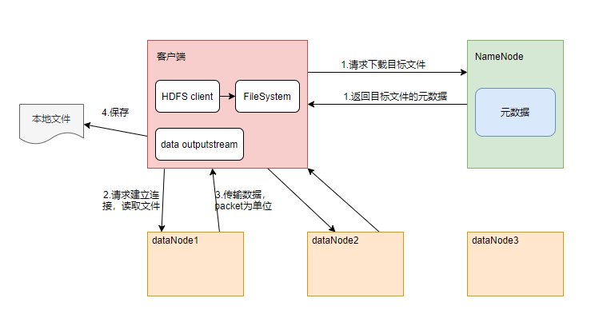
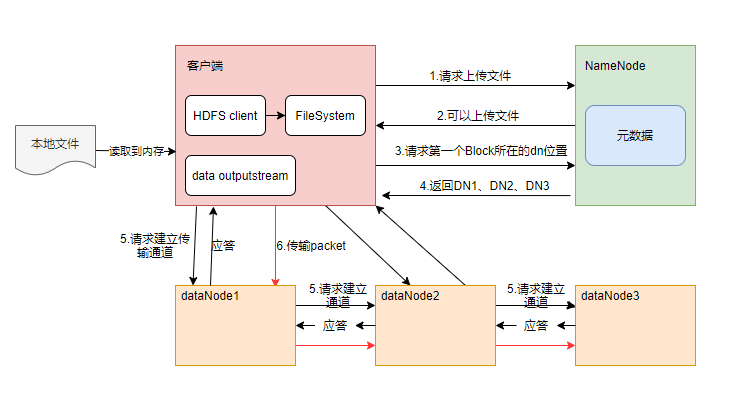

# 面试题集: 数据分析-大数据

[返回旧的已有问题](#旧的问题列表)

## 技能概览

### 数据可视化

| 能力点 | 技能难度| 快速跳转 |
| :--- |:---: | :---: |
| 数据可视化基础 | 1 | [直达题目](#数据可视化基础) |
| 常用可视化工具使用 | 3 | [直达题目](#常用可视化工具使用) |
| 交互式可视化开发 | 5 | [直达题目](#交互式可视化开发) |
| 可视化性能优化 | 7 | [直达题目](#可视化性能优化) |
| 可视化系统架构设计 | 8 | [直达题目](#可视化系统架构设计) |
| 可视化创新与极限应用 | 9 | [直达题目](#可视化创新与极限应用) |
| 可视化企业级规范制定 | 10 | [直达题目](#可视化企业级规范制定) |

---

## 详细题目列表

### 数据可视化

#### 数据可视化基础

**技能难度评分:** 1/10

**问题 1:**

> 在数据可视化中，哪种图表最适合用来显示数据的组成部分比例？
> 
> A. 折线图
> B. 饼图
> C. 散点图
> D. 直方图

  
点击查看答案

  
<strong>正确答案: B. 饼图。饼图通过将整体划分为多个扇形区域来直观展示各部分在整体中的比例关系，适合表现组成部分的百分比。折线图适合显示变化趋势，散点图用于展示两个变量之间的关系，直方图则用于显示数据的分布频率。</strong>

**问题 2:**

> 假设你负责为电商平台的销售团队设计一个数据可视化报表，用来展示过去一个月内每天的销售额变化趋势。请简述你会选择哪种图表类型来展示这一数据，并说明选择该图表类型的原因。

  
点击查看答案

  
<strong>正确答案: 我会选择折线图来展示每天的销售额变化趋势。折线图能够清晰地表现数据随时间的连续变化，适合展示趋势和波动情况。通过折线图，销售团队可以直观地观察到销售额的上升或下降趋势，帮助他们快速识别销售高峰和低谷，从而做出相应的业务调整。</strong>

---

#### 常用可视化工具使用

**技能难度评分:** 3/10

**问题 1:**

> 在使用 Tableau 进行数据可视化时，以下哪种操作最适合用来展示分类变量之间的关系？
> 
> A. 使用折线图（Line Chart）
> B. 使用散点图（Scatter Plot）
> C. 使用条形图（Bar Chart）
> D. 使用热力图（Heat Map）

  
点击查看答案

  
<strong>正确答案: C. 使用条形图（Bar Chart）

解释：条形图适合展示不同分类变量之间的对比关系，能够直观显示各类别的数值大小。折线图适合展示时间序列数据，散点图适合展示两个连续变量的关系，热力图则多用于展示矩阵型数据的强度分布，因此条形图是最合适的选择。</strong>

**问题 2:**

> 假设你在一家电商公司工作，负责分析用户购买行为。现在你需要使用常用的数据可视化工具（如Tableau、Power BI或Matplotlib）来展示过去一年的月度销售额趋势和不同产品类别的销售占比。请简述你会选择哪种可视化图表类型，并说明选择该图表的原因。此外，如果数据量非常大（百万级别），你会采取哪些措施确保可视化工具的性能和交互体验？

  
点击查看答案

  
<strong>正确答案: 1. 图表选择：
- 月度销售额趋势：选择折线图（Line Chart），因为折线图能够清晰地展示时间序列数据的变化趋势，方便观察销售额的波动和趋势。
- 产品类别销售占比：选择饼图（Pie Chart）或环形图（Donut Chart），因为这类图表能够直观展示各类别之间的比例关系，便于比较不同产品类别的销售贡献。

2. 选择原因：
- 折线图适合展示连续时间数据的趋势，能够帮助发现季节性变化或异常点。
- 饼图和环形图适合展示组成部分占整体的比例，便于快速理解各类别销售份额。

3. 性能优化措施：
- 数据预处理：对原始数据进行聚合（如按月汇总），减少可视化时的数据量。
- 分页加载或分块渲染：避免一次性加载全部数据，提升响应速度。
- 使用高效的数据存储和查询方式，如数据库索引或缓存。
- 利用可视化工具的内置性能优化功能，如Power BI的聚合表，Tableau的数据提取。
- 限制图表的交互复杂度，避免过多的实时计算。

这些措施能够确保在处理大数据量时，保持可视化的流畅性和良好的用户体验。</strong>

---

#### 交互式可视化开发

**技能难度评分:** 5/10

**问题 1:**

> 在开发交互式数据可视化时，哪种技术最适合实现图表中的动态数据筛选和实时响应用户操作？
> 
> A. 使用纯HTML和CSS进行样式设置
> B. 利用JavaScript框架（如D3.js或Plotly）绑定数据和事件处理
> C. 仅通过服务器端生成静态图像
> D. 通过数据库直接渲染图表，无需前端交互逻辑

  
点击查看答案

  
<strong>正确答案: B. 利用JavaScript框架（如D3.js或Plotly）绑定数据和事件处理。因为交互式可视化需要前端能够动态响应用户操作和数据变化，JavaScript框架支持绑定数据和事件，使图表可以实时更新和交互，是实现动态筛选和响应的关键技术。</strong>

**问题 2:**

> 在一个电商平台的销售数据分析项目中，要求开发一个交互式可视化仪表盘，支持用户根据时间范围、地区和产品类别进行多维度筛选，并动态展示销售趋势和热销产品排行。请简述你会如何设计和实现这个交互式可视化功能？
> 
> 请重点说明：
> 1. 选择哪些技术或工具来实现交互式效果，并说明原因；
> 2. 如何设计数据结构和接口以支持高效的数据筛选和动态更新；
> 3. 如何保证交互响应的流畅性和用户体验。

  
点击查看答案

  
<strong>正确答案: 1. 技术选择：可以采用如D3.js、ECharts、Plotly等前端可视化库，这些库支持丰富的交互事件和动态渲染，配合React或Vue框架可以更好地管理组件状态和界面更新。选择原因是它们灵活且社区支持好，适合复杂交互需求。

2. 数据结构与接口设计：后端应设计支持多维条件查询的API，返回预聚合或分片数据，减少前端处理压力。数据格式应统一且易于索引，如JSON数组中包含时间、地区、类别及销售指标字段。前端应维护当前筛选条件的状态，触发请求时传递筛选参数，接口返回对应数据用于更新图表。

3. 性能与体验保障：可采用数据缓存和懒加载策略减少重复请求，使用防抖（debounce）技术限制频繁筛选操作触发请求。前端渲染时可使用虚拟DOM或canvas渲染提升性能，保证交互响应快速流畅。同时提供加载动画和错误提示，提升用户体验。</strong>

---

#### 可视化性能优化

**技能难度评分:** 7/10

**问题 1:**

> 在处理大规模数据集进行数据可视化时，哪种方法最有效地提升可视化的性能？
> 
> A. 在客户端渲染所有原始数据点，以保证数据的完整性和细节展示
> B. 使用数据抽样或聚合技术减少绘制的数据量，从而加快渲染速度
> C. 增加图表中的动画效果，使用户体验更加流畅
> D. 使用高分辨率图像导出功能，提升图表的视觉质量

  
点击查看答案

  
<strong>正确答案: B. 使用数据抽样或聚合技术减少绘制的数据量，从而加快渲染速度。因为对于大规模数据集，直接渲染所有数据点会导致性能瓶颈，数据抽样和聚合能够有效减少渲染负载，同时保持数据的趋势和整体信息，提升可视化性能。选项A会导致性能严重下降，选项C虽然提升体验但增加计算量，选项D与性能优化关系不大。</strong>

**问题 2:**

> 在一个电商平台的大数据分析系统中，数据可视化界面需要展示实时销售数据的趋势图。随着数据量的增加和用户请求的增多，界面响应变得非常缓慢。请结合实际场景，简述你会采取哪些优化策略来提升可视化性能？请重点说明数据处理和前端渲染两个层面的优化方法。

  
点击查看答案

  
<strong>正确答案: 针对电商平台实时销售数据趋势图的性能问题，可以从以下两个层面进行优化：

1. 数据处理层优化：
- **数据预聚合与缓存**：提前对销售数据进行分时段聚合（如按小时、日）以减少实时计算量，并使用缓存机制避免重复计算。
- **数据抽样和降采样**：对于极大数据量，采用抽样或降采样技术减小数据规模，减少传输和处理压力。
- **增量更新**：只传输和处理新增或变化的数据，避免全量刷新。
- **异步数据加载**：将数据加载异步化，避免阻塞界面渲染。

2. 前端渲染层优化：
- **虚拟化技术**：对于大量数据点，使用虚拟滚动或按需渲染，避免一次性渲染全部元素。
- **图表库选择与优化**：选用高性能图表库（如ECharts、D3.js）并开启硬件加速，优化渲染效率。
- **减少DOM操作**：批量更新DOM，避免频繁重绘和回流。
- **使用Web Worker**：将复杂计算任务放到Web Worker中，避免阻塞主线程。

通过上述措施，可以有效降低数据处理压力和前端渲染开销，从而提升可视化界面的响应速度和用户体验。</strong>

---

#### 可视化系统架构设计

**技能难度评分:** 8/10

**问题 1:**

> 在设计一个大规模数据可视化系统的架构时，以下哪项设计最有助于确保系统的高可用性和可扩展性？
> 
> A. 将所有数据处理和可视化渲染集中在单一服务器上，减少网络延迟。
> 
> B. 采用微服务架构，将数据采集、处理和渲染模块分离，并使用消息队列进行异步通信。
> 
> C. 使用单一数据库存储所有原始数据和可视化元数据，简化数据管理。
> 
> D. 将所有可视化逻辑直接嵌入前端代码，减少后端复杂度，提升响应速度。

  
点击查看答案

  
<strong>正确答案: B. 采用微服务架构，将数据采集、处理和渲染模块分离，并使用消息队列进行异步通信。 解释：微服务架构能够将系统功能模块解耦，方便独立扩展和维护，消息队列的异步通信机制有助于提升系统的容错性和高可用性，适合大规模数据的分布式处理与可视化需求。其它选项存在单点故障、高耦合、扩展性差等问题，不适合大规模系统设计。</strong>

**问题 2:**

> 假设你负责设计一个面向电商平台的实时数据可视化系统，该系统需要支持多维度数据展示（如销售额、用户行为、库存状态等），并且能够应对高并发访问和海量数据更新。请简述你如何设计该可视化系统的架构，包括数据采集、处理、存储和展示层的关键组件，并说明如何保证系统的高可用性和扩展性。

  
点击查看答案

  
<strong>正确答案: 1. 数据采集层：采用分布式日志收集系统（如Kafka）实时采集电商平台产生的各类数据，包括交易数据、用户行为数据和库存变更。

2. 数据处理层：使用流处理框架（如Flink或Spark Streaming）对实时数据进行清洗、聚合和多维度计算，生成可视化所需的指标和维度数据。

3. 数据存储层：结合时序数据库（如ClickHouse、Druid）和缓存系统（如Redis），存储处理后的数据，支持快速查询和高并发访问。

4. 可视化展示层：采用前端框架（如React或Vue）结合专业的数据可视化库（如ECharts、D3.js）构建交互式多维度仪表盘，支持实时刷新和用户自定义视图。

5. 高可用性设计：通过多副本部署、负载均衡和故障自动切换保证系统各组件的稳定运行。

6. 可扩展性设计：采用微服务架构，支持水平扩展；数据处理和存储组件通过分片和分区机制应对数据增长和访问压力。

7. 监控与报警：部署全链路监控，及时发现和处理系统异常，确保数据准确性和系统稳定性。</strong>

---

#### 可视化创新与极限应用

**技能难度评分:** 9/10

**问题 1:**

> 在进行大数据可视化时，创新性地突破传统图表的限制，以实现更深层次的数据洞察，以下哪种方法最能体现"可视化创新与极限应用"的理念？
> 
> A. 使用标准的柱状图和折线图组合展示多维度数据，确保易读性和用户熟悉度。
> 
> B. 利用交互式动态可视化技术，将多源异构数据集成在一个实时更新的三维可视化环境中，支持用户自定义视角和筛选条件。
> 
> C. 采用静态的饼图展示市场份额数据，突出各部分比例关系。
> 
> D. 简单地使用传统散点图，依靠颜色区分类别，避免复杂的视觉元素干扰用户判断。

  
点击查看答案

  
<strong>正确答案: B. 利用交互式动态可视化技术，将多源异构数据集成在一个实时更新的三维可视化环境中，支持用户自定义视角和筛选条件。 解析：选项B体现了可视化创新的核心——通过先进技术（如交互式、动态和三维视图）突破传统二维静态图表的限制，实现更丰富、更深层次的数据洞察和用户体验。选项A和D虽然考虑了易读性和类别区分，但缺乏创新性；选项C的静态饼图则更倾向于传统展示方式，难以满足大数据复杂性和实时性的需求。</strong>

**问题 2:**

> 在一个大型电商平台中，用户行为数据量巨大且维度复杂。请描述你如何设计一套创新性的数据可视化方案，以帮助产品团队实时洞察用户购买路径中的关键转折点和潜在流失环节。请重点说明你会如何突破传统可视化方法的局限，实现极限应用，包括数据处理、可视化技术选择及交互设计等方面的考虑。

  
点击查看答案

  
<strong>正确答案: 首先，面对海量且维度复杂的用户行为数据，需采用高效的数据预处理策略，如数据抽样、聚合及流处理技术，确保可视化响应的实时性。

其次，针对用户购买路径的可视化，传统的漏斗图或路径图难以直观反映多维度交互和关键转折。可以创新地结合动态路径分析与多维热力图，利用图网络（Graph）可视化技术展现不同节点（页面、事件）间的跳转概率和流失率。

再者，交互设计上应支持多层次钻取（drill-down），允许产品团队根据时间、用户群体或行为类型动态过滤和聚焦，结合时间轴动画展示路径演变趋势。

此外，可引入AI辅助的异常检测和关键节点自动标注，帮助快速发现潜在的流失环节。

综上，通过结合大数据实时处理、图网络可视化、多维交互及智能辅助标注，突破传统静态图表的局限，实现在极限条件下的创新可视化应用，提升数据洞察的深度和效率。</strong>

---

#### 可视化企业级规范制定

**技能难度评分:** 10/10

**问题 1:**

> 在制定企业级数据可视化规范时，以下哪项最重要以确保跨部门数据报告的一致性和可理解性？
> 
> A. 仅使用企业标志色和字体，无需考虑图表类型和布局规范
> B. 明确规定数据可视化的色彩方案、图表类型、布局结构及交互行为
> C. 根据每个团队的喜好自由设计，促进个性化表达
> D. 只关注图表的美观性，忽略数据准确性和信息层级的表达

  
点击查看答案

  
<strong>正确答案: B. 明确规定数据可视化的色彩方案、图表类型、布局结构及交互行为。因为企业级规范制定的核心是统一视觉风格和交互标准，确保不同部门生成的报告在风格和结构上保持一致，便于理解和决策。A选项过于狭隘，仅关注色彩和字体，忽视了图表类型和布局；C选项忽略规范的统一性而强调个性化，容易导致混乱；D选项忽视了数据准确性和信息层级，违背了规范的根本目的。</strong>

**问题 2:**

> 在一家大型互联网公司，数据分析团队需要为全公司制定一套统一的数据可视化规范，以支持不同业务部门的多样化需求。请你设计一套企业级数据可视化规范的制定方案，并说明在规范制定过程中如何平衡统一性与灵活性，确保规范既满足数据一致性和易用性，又能适应快速变化的业务需求。请结合具体的规范内容（如配色方案、图表类型选择、交互设计、数据安全等）和实施策略进行阐述。

  
点击查看答案

  
<strong>正确答案: 制定企业级数据可视化规范的方案应包括以下几个关键步骤和内容：

1. **需求调研与分析**
   - 深入了解各业务部门的数据分析需求和使用场景，收集常用图表类型、交互需求及数据敏感性。

2. **规范内容设计**
   - **配色方案**：制定统一的企业色彩体系，确保视觉一致性，支持色盲友好设计，并允许业务线在主色调基础上做适度调整。
   - **图表类型选择**：定义推荐使用的图表类型及其适用场景，避免误用不适合的数据表达形式，同时允许新增图表类型的申请和评估流程。
   - **交互设计**：规定交互行为的统一标准，如悬浮提示、过滤器设计和响应式布局，保障用户体验一致性。
   - **数据安全与隐私**：制定数据访问权限和敏感信息展示规则，确保合规性。
   - **图表布局与排版**：规范图表标题、注释、单位标识等元素，保障信息传达清晰。

3. **平衡统一性与灵活性**
   - 设立核心规范和可选扩展规范，核心规范保证基础统一，扩展规范允许业务部门根据实际需求做合理调整。
   - 建立规范变更和反馈机制，定期评估业务变化，动态调整规范内容。

4. **实施与推广策略**
   - 开发统一的可视化组件库，方便开发和分析人员快速应用规范。
   - 组织培训和宣导，提升全员规范意识。
   - 设立监督与审核机制，确保规范落地。

通过以上方案，可以在保证数据可视化质量和一致性的基础上，给予业务部门适度的灵活空间，支持业务快速发展，同时维护企业数据资产的安全和规范管理。</strong>

---

---
---

## 旧的问题列表

- [1.kafka的message包括哪些信息](#1-kafka的message包括哪些信息)
- [2.怎么查看kafka的offset](#2-怎么查看kafka的offset)
- [3.hadoop的shuffle过程](#3-hadoop的shuffle过程)
- [4.spark集群运算的模式](#4-spark集群运算的模式)
- [5.HDFS读写数据的过程](#5-hdfs读写数据的过程)
- [6.RDD中reduceBykey与groupByKey哪个性能好，为什么](#6-rdd中reducebykey与groupbykey哪个性能好为什么)
- [7.spark2.0的了解](#7-spark2-0的了解)
- [8.rdd 怎么分区宽依赖和窄依赖](#8-rdd-怎么分区宽依赖和窄依赖)
- [9.spark streaming 读取kafka数据的两种方式](#9-spark-streaming-读取kafka数据的两种方式)
- [10.kafka的数据存在内存还是磁盘](#10-kafka的数据存在内存还是磁盘)
- [11.怎么解决kafka的数据丢失](#11-怎么解决kafka的数据丢失)
- [12.fsimage和edit的区别？](#12-fsimage和edit的区别)
- [13.列举几个配置文件优化？](#13-列举几个配置文件优化)
- [14.datanode 首次加入 cluster 的时候，如果 log 报告不兼容文件版本，那需要namenode执行格式化操作，这样处理的原因是？](#14-datanode-首次加入-cluster-的时候如果-log-报告不兼容文件版本那需要namenode执行格式化操作这样处理的原因是)
- [15.MapReduce 中排序发生在哪几个阶段？这些排序是否可以避免？为什么？](#15-mapreduce-中排序发生在哪几个阶段这些排序是否可以避免为什么)
- [16.hadoop的优化？](#16-hadoop的优化)
- [17.设计题](#17-设计题)
- [18.有10 个文件，每个文件 1G，每个文件的每一行存放的都是用户的 query，每个文件的query 都可能重复。要求你按照 query 的频度排序。还是典型的 TOP K 算法](#18-有10-个文件每个文件-1g每个文件的每一行存放的都是用户的-query每个文件的query-都可能重复要求你按照-query-的频度排序还是典型的-top-k-算法)
- [19.在2.5亿个整数中找出不重复的整数，注，内存不足以容纳这2.5亿个整数。](#19-在2-5亿个整数中找出不重复的整数注内存不足以容纳这2-5亿个整数)
- [20.腾讯面试题：给40亿个不重复的 unsigned int 的整数，没排过序的，然后再给一个数，如何快速判断这个数是否在那 40 亿个数当中？](#20-腾讯面试题给40亿个不重复的-unsigned-int-的整数没排过序的然后再给一个数如何快速判断这个数是否在那-40-亿个数当中)
- [21.怎么在海量数据中找出重复次数最多的一个？](#21-怎么在海量数据中找出重复次数最多的一个)
- [22.上千万或上亿数据（有重复），统计其中出现次数最多的钱 N 个数据。](#22-上千万或上亿数据有重复统计其中出现次数最多的钱-n-个数据)
- [23.一个文本文件，大约有一万行，每行一个词，要求统计出其中最频繁出现的前 10 个词，给出思想，给出时间复杂度分析。](#23-一个文本文件大约有一万行每行一个词要求统计出其中最频繁出现的前-10-个词给出思想给出时间复杂度分析)
- [24.100w 个数中找出最大的 100 个数。](#24-100w-个数中找出最大的-100-个数)
- [25.有一千万条短信，有重复，以文本文件的形式保存，一行一条，有重复。请用 5 分钟时间，找出重复出现最多的前 10 条。](#25-有一千万条短信有重复以文本文件的形式保存一行一条有重复请用-5-分钟时间找出重复出现最多的前-10-条)

### 1.kafka的message包括哪些信息

一个Kafka的Message由一个固定长度的header和一个变长的消息体body组成 header部分由一个字节的magic(文件格式)和四个字节的CRC32(用于判断body消息体是否正常)构成。当magic的值为1的时候，会在magic和crc32之间多一个字节的数据：attributes(保存一些相关属性，比如是否压缩、压缩格式等等)；如果magic的值为0，那么不存在attributes属性 body是由N个字节构成的一个消息体，包含了具体的key/value消息

### 2.怎么查看kafka的offset

0.9版本以上，可以用最新的Consumer client 客户端，有consumer.seekToEnd() / consumer.position() 可以用于得到当前最新的offset

### 3.hadoop的shuffle过程

**一、Map端的shuffle**

　　Map端会处理输入数据并产生中间结果，这个中间结果会写到本地磁盘，而不是HDFS。每个Map的输出会先写到内存缓冲区中，当写入的数据达到设定的阈值时，系统将会启动一个线程将缓冲区的数据写到磁盘，这个过程叫做spill。 　　在spill写入之前，会先进行二次排序，首先根据数据所属的partition进行排序，然后每个partition中的数据再按key来排序。partition的目是将记录划分到不同的Reducer上去，以期望能够达到负载均衡，以后的Reducer就会根据partition来读取自己对应的数据。接着运行combiner(如果设置了的话)，combiner的本质也是一个Reducer，其目的是对将要写入到磁盘上的文件先进行一次处理，这样，写入到磁盘的数据量就会减少。最后将数据写到本地磁盘产生spill文件(spill文件保存在{mapred.local.dir}指定的目录中，Map任务结束后就会被删除)。

　　最后，每个Map任务可能产生多个spill文件，在每个Map任务完成前，会通过多路归并算法将这些spill文件归并成一个文件。至此，Map的shuffle过程就结束了。

**二、Reduce端的shuffle**

　　Reduce端的shuffle主要包括三个阶段，copy、sort(merge)和reduce。 　　首先要将Map端产生的输出文件拷贝到Reduce端，但每个Reducer如何知道自己应该处理哪些数据呢？因为Map端进行partition的时候，实际上就相当于指定了每个Reducer要处理的数据(partition就对应了Reducer)，所以Reducer在拷贝数据的时候只需拷贝与自己对应的partition中的数据即可。每个Reducer会处理一个或者多个partition，但需要先将自己对应的partition中的数据从每个Map的输出结果中拷贝过来。 　　接下来就是sort阶段，也成为merge阶段，因为这个阶段的主要工作是执行了归并排序。从Map端拷贝到Reduce端的数据都是有序的，所以很适合归并排序。最终在Reduce端生成一个较大的文件作为Reduce的输入。

　　最后就是Reduce过程了，在这个过程中产生了最终的输出结果，并将其写到HDFS上。

### 4.spark集群运算的模式

Spark 有很多种模式，最简单就是单机本地模式，还有单机伪分布式模式，复杂的则运行在集群中，目前能很好的运行在 Yarn和 Mesos 中，当然 Spark 还有自带的 Standalone 模式，对于大多数情况 Standalone 模式就足够了，如果企业已经有 Yarn 或者 Mesos 环境，也是很方便部署的。 standalone(集群模式)：典型的Mater/slave模式，不过也能看出Master是有单点故障的；Spark支持ZooKeeper来实现 HA on yarn(集群模式)： 运行在 yarn 资源管理器框架之上，由 yarn 负责资源管理，Spark 负责任务调度和计算 on mesos(集群模式)： 运行在 mesos 资源管理器框架之上，由 mesos 负责资源管理，Spark 负责任务调度和计算 on cloud(集群模式)：比如 AWS 的 EC2，使用这个模式能很方便的访问 Amazon的 S3;Spark 支持多种分布式存储系统：HDFS 和 S3

### 5.HDFS读写数据的过程

**读：**
1、跟namenode通信查询元数据，找到文件块所在的datanode服务器
2、挑选一台datanode（就近原则，然后随机）服务器，请求建立socket流
3、datanode开始发送数据（从磁盘里面读取数据放入流，以packet为单位来做校验）
4、客户端以packet为单位接收，现在本地缓存，然后写入目标文件

**写：**
1、根namenode通信请求上传文件，namenode检查目标文件是否已存在，父目录是否存在
2、namenode返回是否可以上传
3、client请求第一个 block该传输到哪些datanode服务器上
4、namenode返回3个datanode服务器ABC
5、client请求3台dn中的一台A上传数据（本质上是一个RPC调用，建立pipeline），A收到请求会继续调用B，然后B调用C，将真个pipeline建立完成，逐级返回客户端 6、client开始往A上传第一个block（先从磁盘读取数据放到一个本地内存缓存），以packet为单位，A收到一个packet就会传给B，B传给C；A每传一个packet会放入一个应答队列等待应答
7、当一个block传输完成之后，client再次请求namenode上传第二个block的服务器。

### 6.RDD中reduceBykey与groupByKey哪个性能好，为什么

- reduceByKey：reduceByKey会在结果发送至reducer之前会对每个mapper在本地进行merge，有点类似于在MapReduce中的combiner。这样做的好处在于，在map端进行一次reduce之后，数据量会大幅度减小，从而减小传输，保证reduce端能够更快的进行结果计算。
- groupByKey：groupByKey会对每一个RDD中的value值进行聚合形成一个序列(Iterator)，此操作发生在reduce端，所以势必会将所有的数据通过网络进行传输，造成不必要的浪费。同时如果数据量十分大，可能还会造成OutOfMemoryError。

通过以上对比可以发现在进行大量数据的reduce操作时候建议使用reduceByKey。不仅可以提高速度，还是可以防止使用groupByKey造成的内存溢出问题。

### 7.spark2.0的了解

- 更简单：ANSI SQL与更合理的API
- 速度更快：用Spark作为编译器
- 更智能：Structured Streaming

### 8.rdd 怎么分区宽依赖和窄依赖

- 宽依赖：父RDD的分区被子RDD的多个分区使用 例如 groupByKey、reduceByKey、sortByKey等操作会产生宽依赖，会产生shuffle 
- 窄依赖：父RDD的每个分区都只被子RDD的一个分区使用 例如map、filter、union等操作会产生窄依赖

### 9.spark streaming 读取kafka数据的两种方式

这两种方式分别是：

**Receiver-base**

使用Kafka的高层次Consumer API来实现。receiver从Kafka中获取的数据都存储在Spark Executor的内存中，然后Spark Streaming启动的job会去处理那些数据。然而，在默认的配置下，这种方式可能会因为底层的失败而丢失数据。如果要启用高可靠机制，让数据零丢失，就必须启用Spark Streaming的预写日志机制（Write Ahead Log，WAL）。该机制会同步地将接收到的Kafka数据写入分布式文件系统（比如HDFS）上的预写日志中。所以，即使底层节点出现了失败，也可以使用预写日志中的数据进行恢复。

**Direct**

Spark1.3中引入Direct方式，用来替代掉使用Receiver接收数据，这种方式会周期性地查询Kafka，获得每个topic+partition的最新的offset，从而定义每个batch的offset的范围。当处理数据的job启动时，就会使用Kafka的简单consumer api来获取Kafka指定offset范围的数据。

### 10.kafka的数据存在内存还是磁盘

Kafka最核心的思想是使用磁盘，而不是使用内存，可能所有人都会认为，内存的速度一定比磁盘快，我也不例外。在看了Kafka的设计思想，查阅了相应资料再加上自己的测试后，发现磁盘的顺序读写速度和内存持平。 而且Linux对于磁盘的读写优化也比较多，包括read-ahead和write-behind，磁盘缓存等。如果在内存做这些操作的时候，一个是JAVA对象的内存开销很大，另一个是随着堆内存数据的增多，JAVA的GC时间会变得很长，使用磁盘操作有以下几个好处： 磁盘缓存由Linux系统维护，减少了程序员的不少工作。 磁盘顺序读写速度超过内存随机读写。 JVM的GC效率低，内存占用大。使用磁盘可以避免这一问题。 系统冷启动后，磁盘缓存依然可用。

### 11.怎么解决kafka的数据丢失

producer端： 宏观上看保证数据的可靠安全性，肯定是依据分区数做好数据备份，设立副本数。 

broker端： topic设置多分区，分区自适应所在机器，为了让各分区均匀分布在所在的broker中，分区数要大于broker数。 分区是kafka进行并行读写的单位，是提升kafka速度的关键。 

Consumer端 consumer端丢失消息的情形比较简单：如果在消息处理完成前就提交了offset，那么就有可能造成数据的丢失。由于Kafka consumer默认是自动提交位移的，所以在后台提交位移前一定要保证消息被正常处理了，因此不建议采用很重的处理逻辑，如果处理耗时很长，则建议把逻辑放到另一个线程中去做。为了避免数据丢失，现给出两点建议： enable.auto.commit=false 关闭自动提交位移 在消息被完整处理之后再手动提交位移

### 12.fsimage和edit的区别？

大家都知道namenode与secondary namenode 的关系，当他们要进行数据同步时叫做checkpoint时就用到了fsimage与edit，fsimage是保存最新的元数据的信息，当fsimage数据到一定的大小事会去生成一个新的文件来保存元数据的信息，这个新的文件就是edit，edit会回滚最新的数据。

### 13.列举几个配置文件优化？

1）Core-site.xml 文件的优化
   a、fs.trash.interval，默认值： 0；说明： 这个是开启hdfs文件删除自动转移到垃圾箱的选项，值为垃圾箱文件清除时间。一般开启这个会比较好，以防错误删除重要文件。单位是分钟。
   b、dfs.namenode.handler.count，默认值：10；说明：hadoop系统里启动的任务线程数，这里改为40，同样可以尝试该值大小对效率的影响变化进行最合适的值的设定。
   c、mapreduce.tasktracker.http.threads，默认值：40；说明：map和reduce是通过http进行数据传输的，这个是设置传输的并行线程数。

### 14.datanode 首次加入 cluster 的时候，如果 log 报告不兼容文件版本，那需要namenode执行格式化操作，这样处理的原因是？

1. 这样处理是不合理的，因为那么 namenode 格式化操作，是对文件系统进行格式化，namenode 格式化时清空 dfs/name 下空两个目录下的所有文件，之后，会在目录 dfs.name.dir 下创建文件。
2. 文本不兼容，有可能时 namenode 与 datanode 的 数据里的 namespaceID、clusterID 不一致，找到两个 ID 位置，修改为一样即可解决。

### 15.MapReduce 中排序发生在哪几个阶段？这些排序是否可以避免？为什么？

1.  一个 MapReduce 作业由 Map 阶段和 Reduce 阶段两部分组成，这两阶段会对数据排序，从这个意义上说，MapReduce 框架本质就是一个 Distributed Sort。
2.  在 Map 阶段，Map Task 会在本地磁盘输出一个按照 key 排序（采用的是快速排序）的文件（中间可能产生多个文件，但最终会合并成一个），在 Reduce 阶段，每个 Reduce Task 会对收到的数据排序，这样，数据便按照 Key 分成了若干组，之后以组为单位交给 reduce（）处理。
3.  很多人的误解在 Map 阶段，如果不使用 Combiner便不会排序，这是错误的，不管你用不用 Combiner，Map Task 均会对产生的数据排序（如果没有 Reduce Task，则不会排序，实际上 Map 阶段的排序就是为了减轻 Reduce端排序负载）。
4.  由于这些排序是 MapReduce 自动完成的，用户无法控制，因此，在hadoop 1.x 中无法避免，也不可以关闭，但 hadoop2.x 是可以关闭的。

### 16.hadoop的优化？

1.  优化的思路可以从配置文件和系统以及代码的设计思路来优化

2.  配置文件的优化：调节适当的参数，在调参数时要进行测试

3.  代码的优化：combiner的个数尽量与reduce的个数相同，数据的类型保持一致，可以减少拆包与封包的进度

4.  系统的优化：可以设置linux系统打开最大的文件数预计网络的带宽MTU的配置

5.  为 job 添加一个 Combiner，可以大大的减少shuffer阶段的maoTask拷贝过来给远程的   reduce task的数据量，一般而言combiner与reduce相同。

6.  在开发中尽量使用stringBuffer而不是string，string的模式是read-only的，如果对它进行修改，会产生临时的对象，二stringBuffer是可修改的，不会产生临时对象。

7.  修改一下配置：以下是修改 mapred-site.xml 文件

   -  修改最大槽位数：槽位数是在各个 tasktracker 上的 mapred-site.xml 上设置的，默认都是 2 mapred.tasktracker.map.tasks.maximum=2; mapred.tasktracker.reduce.tasks.maximum=2 

   - 调整心跳间隔：集群规模小于 300 时，心跳间隔为 300 毫秒 

     mapreduce.jobtracker.heartbeat.interval.min 心跳时间 

     mapred.heartbeats.in.second 集群每增加多少节点，时间增加下面的值 

     mapreduce.jobtracker.heartbeat.scaling.factor 集群每增加上面的个数，心跳增多少 

   - 启动带外心跳 mapreduce.tasktracker.outofband.heartbeat 默认是 false 

   - 配置多块磁盘 mapreduce.local.dir 

   - 配置 RPC hander 数目 mapred.job.tracker.handler.count 默认是 10，可以改成 50，根据机器的能力 

   - 配置 HTTP 线程数目 tasktracker.http.threads 默认是 40，可以改成 100 根据机器的能力 

   - 选择合适的压缩方式，以 snappy 为例： mapred.compress.map.output true mapred.map.output.compression.codec org.apache.hadoop.io.compress.SnappyCodec

### 17.设计题

**题目：**采集nginx产生的日志，日志的格式为user  ip   time  url   htmlId  每天产生的文件的数据量上亿条，请设计方案把数据保存到HDFS上，并提供一下实时查询的功能（响应时间小于3s）

A、某个用户某天访问某个URL的次数 

B、某个URL某天被访问的总次数 实时思路是：使用Logstash + Kafka + Spark-streaming + Redis + 报表展示平台 

离线的思路是：Logstash + Kafka + Elasticsearch + Spark-streaming + 关系型数据库 A、B、数据在进入到Spark-streaming 中进行过滤，把符合要求的数据保存到Redis中

### 18.有10 个文件，每个文件 1G，每个文件的每一行存放的都是用户的 query，每个文件的query 都可能重复。要求你按照 query 的频度排序。还是典型的 TOP K 算法

 解决方案如下：
**方案 1：**
   顺序读取 10 个文件，按照 hash(query)%10 的结果将 query 写入到另外 10 个文件（记为）中。这样新生成的文件每个的大小大约也 1G（假设 hash 函数是随机的）。 找一台内存在 2G 左右的机器，依次对用 hash_map(query, query_count)来统计每个query 出现的次数。利用快速/堆/归并排序按照出现次数进行排序。将排序好的 query 和对应的 query_cout 输出到文件中。这样得到了 10 个排好序的文件（记为）。 对这 10 个文件进行归并排序（内排序与外排序相结合）。
**方案 2：**
   一般 query 的总量是有限的，只是重复的次数比较多而已，可能对于所有的 query，一次性就可以加入到内存了。这样，我们就可以采用 trie 树/hash_map等直接来统计每个 query出现的次数，然后按出现次数做快速/堆/归并排序就可以了。
**方案 3：**
   与方案 1 类似，但在做完 hash，分成多个文件后，可以交给多个文件来处理，采用分布式的架构来处理（比如 MapReduce），最后再进行合并。

### 19.在2.5亿个整数中找出不重复的整数，注，内存不足以容纳这2.5亿个整数。

**方案 1：**采用 2-Bitmap（每个数分配 2bit，00 表示不存在，01 表示出现一次，10 表示多次，11 无意义）进行，共需内存 2^32 * 2 bit=1 GB 内存，还可以接受。然后扫描这 2.5亿个整数，查看 Bitmap 中相对应位，如果是 00 变 01，01 变 10，10 保持不变。所描完事后，查看 bitmap，把对应位是 01 的整数输出即可。

**方案 2：**也可采用与第 1 题类似的方法，进行划分小文件的方法。然后在小文件中找出不重复的整数，并排序。然后再进行归并，注意去除重复的元素。

### 20.腾讯面试题：给40亿个不重复的 unsigned int 的整数，没排过序的，然后再给一个数，如何快速判断这个数是否在那 40 亿个数当中？

**方案 1：**oo，申请 512M 的内存，一个 bit 位代表一个 unsigned int 值。读入 40 亿个数，设置相应的 bit 位，读入要查询的数，查看相应 bit 位是否为 1，为 1 表示存在，为 0 表示不存在。

**方案 2：**这个问题在《编程珠玑》里有很好的描述，大家可以参考下面的思路，探讨一下： 又因为 2^32 为 40 亿多，所以给定一个数可能在，也可能不在其中； 这里我们把 40 亿个数中的每一个用 32 位的二进制来表示 ，假设这 40 亿个数开始放在一个文件中。 然后将这 40 亿个数分成两类（最高位为 0和最高位为 1），并将这两类分别写入到两个文件中，其中一个文件中数的个数<=20 亿，而另一个>=20 亿（这相当于折半了）； 与要查找的数的最高位比较并接着进入相应的文件再查找再然后把这个文件为又分成两类:（次最高位为 0和次最高位为 1），并将这两类分别写入到两个文件中，其中一个文件中数的个数<=10 亿，而另一个>=10 亿（这相当于折半了）； 与要查找的数的次最高位比较并接着进入相应的文件再查找。 ..... 以此类推，就可以找到了,而且时间复杂度为 O(logn)。 

附：这里，再简单介绍下，位图方法： 使用位图法判断整形数组是否存在重复 ,判断集合中存在重复是常见编程任务之一，当集合中数据量比较大时我们通常希望少进行几次扫描，这时双重循环法就不可取了。 位图法比较适合于这种情况，它的做法是按照集合中最大元素 max 创建一个长度为 max+1的新数组，然后再次扫描原数组，遇到几就给新数组的第几位置上 1，如遇到 5 就给新数组的第六个元素置 1，这样下次再遇到 5 想置位时发现新数组的第六个元素已经是 1 了，这说明这次的数据肯定和以前的数据存在着重复。这 种给新数组初始化时置零其后置一的做法类似于位图的处理方法故称位图法。它的运算次数最坏的情况为 2N。如果已知数组的最大值即能事先给新数组定长的话效 率还能提高一倍。

### 21.怎么在海量数据中找出重复次数最多的一个？

先做 hash，然后求模映射为小文件，求出每个小文件中重复次数最多的一个，并记录重复次数。然后找出上一步求出的数据中重复次数最多的一个就是所求（具体参考前面的题）。

### 22.上千万或上亿数据（有重复），统计其中出现次数最多的钱 N 个数据。

上千万或上亿的数据，现在的机器的内存应该能存下。所以考虑采用 hash_map/搜索二叉树/红黑树等来进行统计次数。然后就是取出前 N 个出现次数最多的数据了，可以用第 2 题提到的堆机制完成。

### 23.一个文本文件，大约有一万行，每行一个词，要求统计出其中最频繁出现的前 10 个词，给出思想，给出时间复杂度分析。

这题是考虑时间效率。用 trie 树统计每个词出现的次数，时间复杂度是 O(n\*le)（le表示单词的平准长度）。然后是找出出现最频繁的前 10 个词，可以用堆来实现，前面的题中已经讲到了，时间复杂度是 O(n\*lg10)。所以总的时间复杂度，是 O(n\*le)与 O(n\*lg10)中较大的哪一 个。

### 24.100w 个数中找出最大的 100 个数。

1. 在前面的题中，我们已经提到了，用一个含 100 个元素的最小堆完成。复杂度为O(100w*lg100)。
2. 采用快速排序的思想，每次分割之后只考虑比轴大的一部分，知道比轴大的一部分在比 100 多的时候，采用传统排序算法排序，取前 100 个。复杂度为 O(100w*100)。
3. 采用局部淘汰法。选取前 100 个元素，并排序，记为序列 L。然后一次扫描剩余的元素 x，与排好序的 100 个元素中最小的元素比，如果比这个最小的 要大，那么把这个最小的元素删除，并把 x 利用插入排序的思想，插入到序列 L 中。依次循环，直到扫描了所有的元素。复杂度为 O(100w*100)。

### 25.有一千万条短信，有重复，以文本文件的形式保存，一行一条，有重复。请用 5 分钟时间，找出重复出现最多的前 10 条。

分析： 常规方法是先排序，在遍历一次，找出重复最多的前 10 条。但是排序的算法复杂度最低为nlgn。

可以设计一个 hash_table, hash_map<string, int>，依次读取一千万条短信，加载到hash_table 表中，并且统计重复的次数，与此同时维护一张最多 10 条的短信表。 这样遍历一次就能找出最多的前 10 条，算法复杂度为 O(n)。

